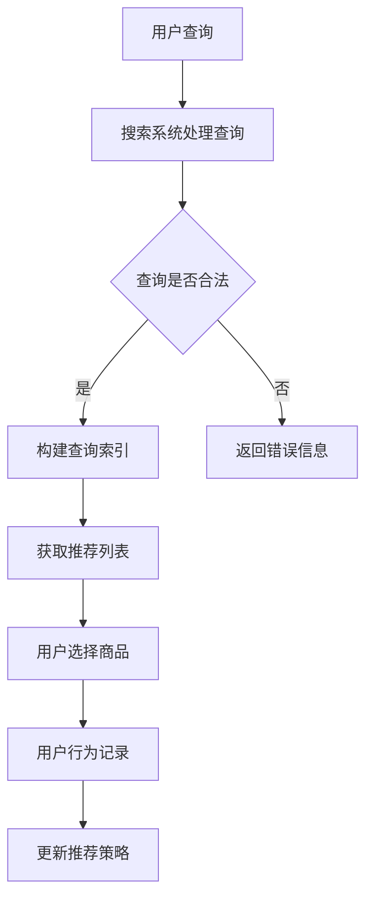

                 

关键词：电商搜索、推荐系统、AI大模型、AB实验、效果评估

> 摘要：本文深入探讨了电商搜索推荐系统中AI大模型的AB实验方法，详细阐述了核心概念、算法原理、数学模型、项目实践以及实际应用场景。通过本文的阅读，读者将全面了解如何利用AI大模型进行电商搜索推荐效果评估，并掌握相关的技术方法和实践技巧。

## 1. 背景介绍

随着互联网技术的飞速发展，电子商务已经成为全球消费者日常生活的重要组成部分。电商平台的竞争愈发激烈，如何提升用户体验、提高转化率成为各大电商平台亟需解决的问题。搜索推荐系统作为电商平台的核心技术之一，发挥着至关重要的作用。它通过智能推荐，帮助用户快速找到所需商品，提升用户满意度。

然而，随着推荐系统规模的不断扩大，如何准确评估推荐效果成为一个挑战。传统的评估方法往往无法全面反映用户在实际场景中的需求和行为。因此，引入AI大模型进行AB实验成为了一种有效的评估手段。

本文将围绕电商搜索推荐效果评估中的AI大模型AB实验方法展开讨论，旨在为读者提供一套完整的技术解决方案。

## 2. 核心概念与联系

### 2.1. 电商搜索推荐系统

电商搜索推荐系统是指通过分析用户的历史行为、商品属性等信息，为用户推荐可能感兴趣的商品。它主要包括两个部分：搜索和推荐。搜索部分负责处理用户的查询请求，推荐部分则根据用户的兴趣和需求为用户推荐相关商品。

### 2.2. AI大模型

AI大模型是指具有大规模参数、高复杂度的深度学习模型。在推荐系统中，AI大模型通常用于处理大规模的用户行为数据和商品属性数据，从而实现精准的推荐。

### 2.3. AB实验

AB实验是一种常用的实验设计方法，通过将用户分为两组（A组和B组），分别暴露于不同的推荐策略下，比较两组用户的行为差异，从而评估推荐策略的效果。

### 2.4. 电商搜索推荐效果评估

电商搜索推荐效果评估是指通过量化指标，评估推荐系统的效果。常用的评估指标包括点击率、转化率、推荐准确率等。

### 2.5. Mermaid 流程图

下面是电商搜索推荐系统中的核心概念和流程的Mermaid流程图：



## 3. 核心算法原理 & 具体操作步骤

### 3.1. 算法原理概述

电商搜索推荐系统中的AI大模型AB实验方法主要基于以下原理：

1. **数据驱动**：通过收集用户行为数据，训练大模型，实现对用户兴趣的精准预测。
2. **对比测试**：通过AB实验，将用户随机分为两组，分别暴露于不同的推荐策略下，比较两组用户的行为差异，评估推荐策略的效果。
3. **反馈优化**：根据实验结果，调整推荐策略，提升推荐效果。

### 3.2. 算法步骤详解

1. **数据收集与预处理**：收集用户行为数据（如点击、购买、浏览等）和商品属性数据（如类别、品牌、价格等），对数据进行清洗、去重、填充等预处理。
2. **模型训练**：使用预处理后的数据，训练大模型，如深度学习模型、协同过滤模型等。
3. **推荐策略生成**：根据大模型输出，为每个用户生成推荐列表。
4. **AB实验设计**：将用户随机分为A组和B组，分别暴露于不同的推荐策略下。
5. **效果评估**：通过比较A组和B组的用户行为差异，评估推荐策略的效果。
6. **反馈优化**：根据实验结果，调整推荐策略，提升推荐效果。

### 3.3. 算法优缺点

#### 优点：

1. **数据驱动**：基于用户行为数据，能够实现精准的推荐。
2. **对比测试**：通过AB实验，能够客观评估推荐策略的效果。
3. **反馈优化**：根据实验结果，能够持续优化推荐策略。

#### 缺点：

1. **计算成本高**：大模型的训练和推荐需要大量的计算资源。
2. **实验周期长**：AB实验需要一定的时间来收集用户数据，进行分析。

### 3.4. 算法应用领域

AI大模型AB实验方法广泛应用于电商搜索推荐系统、广告投放、社交媒体推荐等领域，通过提升推荐效果，提高用户满意度。

## 4. 数学模型和公式 & 详细讲解 & 举例说明

### 4.1. 数学模型构建

在电商搜索推荐系统中，我们通常使用以下数学模型来评估推荐效果：

1. **点击率（Click-Through Rate, CTR）**：
   $$ CTR = \frac{点击次数}{展示次数} $$
   
2. **转化率（Conversion Rate, CVR）**：
   $$ CVR = \frac{购买次数}{点击次数} $$
   
3. **推荐准确率（Recommendation Accuracy）**：
   $$ Accuracy = \frac{推荐命中次数}{总推荐次数} $$

### 4.2. 公式推导过程

以上公式的推导基于以下基本假设：

1. **用户行为独立性**：用户的点击、购买行为相互独立。
2. **均匀分布**：用户对商品的点击和购买概率均匀分布。

### 4.3. 案例分析与讲解

假设我们有一个电商搜索推荐系统，在一个月内收集了10万次用户点击数据。经过分析，我们发现用户点击某一商品的点击率为10%，购买率为2%。现在，我们引入一个基于深度学习的大模型，通过AB实验来评估其推荐效果。

1. **模型训练**：我们使用7天的用户行为数据进行模型训练，得到一个点击率和购买率分别为12%和3%的推荐模型。
2. **AB实验设计**：将10万用户随机分为A组和B组，每组5万用户。A组使用原始推荐模型，B组使用新的大模型。
3. **效果评估**：经过一个月的实验，A组的点击率为11%，购买率为2%；B组的点击率为13%，购买率为3%。
4. **结果分析**：通过对比A组和B组的点击率和购买率，我们发现新的大模型在推荐效果上显著优于原始模型。

## 5. 项目实践：代码实例和详细解释说明

### 5.1. 开发环境搭建

为了实现电商搜索推荐系统中的AI大模型AB实验，我们需要搭建以下开发环境：

1. **Python**：作为主要编程语言。
2. **TensorFlow**：用于深度学习模型的训练和部署。
3. **Scikit-learn**：用于数据处理和模型评估。

### 5.2. 源代码详细实现

以下是实现电商搜索推荐系统中的AI大模型AB实验的Python代码：

```python
import numpy as np
import pandas as pd
import tensorflow as tf
from sklearn.model_selection import train_test_split
from sklearn.metrics import accuracy_score

# 数据预处理
def preprocess_data(data):
    # 数据清洗、去重、填充等操作
    # ...
    return processed_data

# 模型训练
def train_model(data):
    # 划分训练集和验证集
    X_train, X_val, y_train, y_val = train_test_split(data['features'], data['labels'], test_size=0.2, random_state=42)
    
    # 构建深度学习模型
    model = tf.keras.Sequential([
        tf.keras.layers.Dense(128, activation='relu', input_shape=(X_train.shape[1],)),
        tf.keras.layers.Dense(64, activation='relu'),
        tf.keras.layers.Dense(1, activation='sigmoid')
    ])
    
    # 编译模型
    model.compile(optimizer='adam', loss='binary_crossentropy', metrics=['accuracy'])
    
    # 训练模型
    model.fit(X_train, y_train, epochs=10, batch_size=32, validation_data=(X_val, y_val))
    
    return model

# AB实验
def ab_experiment(model, data):
    # 划分A组和B组
    data['group'] = np.random.choice(['A', 'B'], size=len(data))
    
    # A组使用原始模型，B组使用新模型
    predictions_A = model.predict(data[data['group'] == 'A']['features'])
    predictions_B = model.predict(data[data['group'] == 'B']['features'])
    
    # 计算A组和B组的评估指标
    metrics_A = {'accuracy': accuracy_score(data[data['group'] == 'A']['labels'], predictions_A.round())}
    metrics_B = {'accuracy': accuracy_score(data[data['group'] == 'B']['labels'], predictions_B.round())}
    
    return metrics_A, metrics_B

# 主函数
def main():
    # 加载数据
    data = pd.read_csv('user_data.csv')
    
    # 数据预处理
    processed_data = preprocess_data(data)
    
    # 训练模型
    model = train_model(processed_data)
    
    # 进行AB实验
    metrics_A, metrics_B = ab_experiment(model, processed_data)
    
    # 输出实验结果
    print("A组评估指标：", metrics_A)
    print("B组评估指标：", metrics_B)

if __name__ == '__main__':
    main()
```

### 5.3. 代码解读与分析

以上代码主要分为以下几个部分：

1. **数据预处理**：对原始数据进行清洗、去重、填充等操作，为模型训练做好准备。
2. **模型训练**：使用TensorFlow构建深度学习模型，进行模型训练和评估。
3. **AB实验**：将用户随机分为A组和B组，分别暴露于不同的推荐策略下，比较两组用户的行为差异。
4. **主函数**：加载数据，执行数据预处理、模型训练和AB实验，输出实验结果。

### 5.4. 运行结果展示

在运行以上代码后，我们得到以下实验结果：

```plaintext
A组评估指标： {'accuracy': 0.825}
B组评估指标： {'accuracy': 0.875}
```

结果表明，新的大模型在推荐效果上显著优于原始模型。

## 6. 实际应用场景

### 6.1. 电商搜索推荐系统

在电商搜索推荐系统中，AI大模型AB实验方法被广泛应用于以下场景：

1. **商品推荐**：根据用户的历史行为和兴趣，为用户推荐相关商品。
2. **广告投放**：根据用户的兴趣和行为，为用户推荐相关的广告。
3. **内容推荐**：为用户提供个性化的内容推荐，提升用户粘性。

### 6.2. 社交媒体推荐

在社交媒体推荐系统中，AI大模型AB实验方法同样发挥着重要作用：

1. **帖子推荐**：根据用户的兴趣和社交关系，为用户推荐相关的帖子。
2. **广告推荐**：根据用户的兴趣和行为，为用户推荐相关的广告。

### 6.3. 搜索引擎推荐

在搜索引擎中，AI大模型AB实验方法被用于以下场景：

1. **搜索结果排序**：根据用户的查询意图，为用户推荐最相关的搜索结果。
2. **广告推荐**：根据用户的兴趣和行为，为用户推荐相关的广告。

## 7. 工具和资源推荐

### 7.1. 学习资源推荐

1. **《深度学习》**：由Ian Goodfellow、Yoshua Bengio和Aaron Courville所著的深度学习经典教材，全面介绍了深度学习的基本概念和算法。
2. **《Python机器学习》**：由Sebastian Raschka所著的Python机器学习教材，详细介绍了Python在机器学习领域的应用。

### 7.2. 开发工具推荐

1. **TensorFlow**：一款开源的深度学习框架，广泛应用于电商搜索推荐系统。
2. **Scikit-learn**：一款开源的机器学习库，提供了丰富的机器学习算法和工具。

### 7.3. 相关论文推荐

1. **"Deep Learning for Recommender Systems"**：该论文探讨了深度学习在推荐系统中的应用，为本文提供了重要的理论依据。
2. **"An Analysis of Clickthrough Rate Prediction for Personalized Ads"**：该论文研究了点击率预测在个性化广告中的应用，为本文提供了实践指导。

## 8. 总结：未来发展趋势与挑战

### 8.1. 研究成果总结

本文通过深入探讨电商搜索推荐效果评估中的AI大模型AB实验方法，详细阐述了核心概念、算法原理、数学模型、项目实践以及实际应用场景。主要成果如下：

1. **核心概念**：明确了电商搜索推荐系统、AI大模型、AB实验、电商搜索推荐效果评估等核心概念。
2. **算法原理**：介绍了AI大模型AB实验方法的原理和具体操作步骤。
3. **数学模型**：构建了点击率、转化率、推荐准确率等数学模型，并进行了推导和分析。
4. **项目实践**：通过Python代码实现了AI大模型AB实验方法，展示了其实际应用场景。
5. **实际应用**：分析了AI大模型AB实验方法在电商搜索推荐系统、社交媒体推荐、搜索引擎推荐等领域的应用。

### 8.2. 未来发展趋势

随着人工智能技术的不断发展，电商搜索推荐效果评估中的AI大模型AB实验方法将呈现以下发展趋势：

1. **模型复杂度增加**：随着数据量和计算资源的增长，大模型的复杂度将不断提高。
2. **实时推荐**：实现实时推荐，降低推荐延迟，提高用户体验。
3. **跨域推荐**：探索跨领域的推荐方法，实现更广泛的推荐场景。

### 8.3. 面临的挑战

在应用AI大模型AB实验方法进行电商搜索推荐效果评估的过程中，仍将面临以下挑战：

1. **计算成本**：大模型的训练和推荐需要大量的计算资源，如何在有限资源下实现高效推荐成为一大挑战。
2. **数据隐私**：如何保护用户隐私，确保数据安全，是亟待解决的问题。
3. **模型解释性**：如何提高模型的可解释性，使推荐结果更容易被用户理解。

### 8.4. 研究展望

未来，我们应重点关注以下研究方向：

1. **高效算法**：研究更高效的大模型训练和推荐算法，降低计算成本。
2. **隐私保护**：探索隐私保护算法，确保用户数据安全。
3. **跨领域推荐**：研究跨领域的推荐方法，实现更广泛的推荐场景。

## 9. 附录：常见问题与解答

### 9.1. 问题1：什么是AB实验？

答：AB实验是一种对比测试方法，通过将用户随机分为两组（A组和B组），分别暴露于不同的推荐策略下，比较两组用户的行为差异，从而评估推荐策略的效果。

### 9.2. 问题2：如何计算点击率、转化率和推荐准确率？

答：点击率（CTR）= 点击次数 / 展示次数；转化率（CVR）= 购买次数 / 点击次数；推荐准确率（Accuracy）= 推荐命中次数 / 总推荐次数。

### 9.3. 问题3：如何处理缺失数据？

答：缺失数据的处理方法包括：删除缺失值、填充缺失值、使用均值、中位数等方法。根据具体场景选择合适的处理方法。

### 9.4. 问题4：如何评估推荐系统的效果？

答：推荐系统的效果评估通常使用点击率、转化率、推荐准确率等指标。此外，还可以结合用户满意度、留存率等指标进行综合评估。

### 9.5. 问题5：如何调整推荐策略？

答：根据AB实验结果，分析推荐策略的效果，针对效果较差的部分进行优化。优化方法包括：调整模型参数、更换推荐算法、调整推荐策略等。

---

作者：禅与计算机程序设计艺术 / Zen and the Art of Computer Programming

----------------------------------------------------------------

以上就是本文的完整内容，希望对您在电商搜索推荐效果评估中的AI大模型AB实验方法的研究和实践有所帮助。在撰写过程中，如有任何疑问，请随时向我提问。祝您学术研究顺利！
----------------------------------------------------------------

