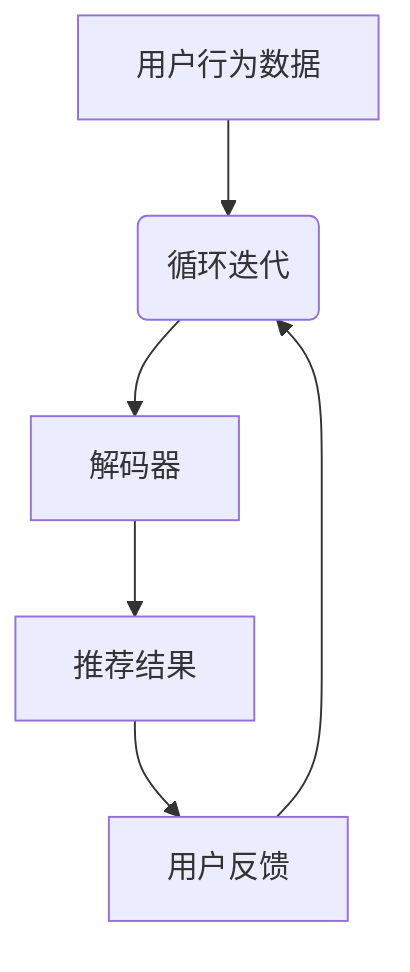

                 

 在现代电商领域，搜索推荐系统扮演着至关重要的角色。它不仅影响着用户体验，也直接关系到电商平台的核心收益。随着人工智能技术的迅猛发展，特别是大规模预训练模型（AI大模型）的出现，推荐系统的效果评估方法也迎来了革命性的变化。本文将探讨AI大模型在电商搜索推荐效果评估中的应用，旨在为业界提供一种新的思路和方法。

## 关键词
- 电商搜索推荐
- AI大模型
- 效果评估
- 用户体验
- 收益优化

## 摘要
本文首先介绍了电商搜索推荐系统的基本概念和现状，随后重点探讨了AI大模型在推荐系统中的作用。接着，文章详细阐述了AI大模型在推荐效果评估中的新方法，包括基于用户行为数据、内容特征和模型交互的多维度评估框架。通过具体案例，文章展示了AI大模型在实际应用中的效果，并对未来的发展趋势和挑战进行了展望。

## 1. 背景介绍

### 1.1 电商搜索推荐系统的基本概念

电商搜索推荐系统是指利用数据挖掘和机器学习技术，通过对用户历史行为和商品特征的分析，为用户推荐符合其兴趣和需求的商品。这一系统通常包括以下几个核心组成部分：

1. **用户行为数据收集**：收集用户的浏览历史、购买记录、搜索关键词等行为数据。
2. **商品特征提取**：对商品进行描述和分类，提取出诸如价格、品牌、型号、用户评价等特征。
3. **推荐算法**：利用机器学习方法，如协同过滤、基于内容的推荐、深度学习等，生成推荐结果。
4. **推荐结果展示**：将推荐结果以可视化的形式展示给用户。

### 1.2 电商搜索推荐系统的发展现状

随着互联网技术的不断进步和用户需求的多样化，电商搜索推荐系统经历了从简单规则匹配到复杂机器学习模型的演变。目前，主流的推荐算法包括以下几种：

- **协同过滤（Collaborative Filtering）**：通过分析用户行为数据，发现用户之间的相似性，从而进行推荐。
- **基于内容的推荐（Content-Based Filtering）**：根据用户的历史行为和商品特征，为用户推荐具有相似特征的商品。
- **混合推荐（Hybrid Recommender Systems）**：结合协同过滤和基于内容的推荐方法，以提高推荐效果。

近年来，深度学习技术的引入，特别是大规模预训练模型的出现，为电商搜索推荐系统带来了新的机遇。这些模型能够通过端到端的学习方式，自动提取复杂的特征和关系，从而显著提升推荐效果。

### 1.3 AI大模型在电商搜索推荐中的重要性

AI大模型，如Transformer、BERT等，通过在大规模数据集上进行预训练，能够提取出高度抽象的特征，并在多种任务上展现出优异的性能。在电商搜索推荐系统中，AI大模型的重要性体现在以下几个方面：

1. **特征自动提取**：AI大模型能够自动从用户行为数据和商品特征中提取出高维的特征表示，避免了传统方法中手动特征工程的过程。
2. **增强推荐效果**：通过端到端的学习，AI大模型能够在不同维度上捕捉用户和商品之间的关系，从而提高推荐的准确性。
3. **个性化推荐**：AI大模型能够根据用户的个性化需求，提供更加精准的推荐，提升用户满意度。

## 2. 核心概念与联系

### 2.1 AI大模型的基本概念

AI大模型，通常指的是那些在大规模数据集上训练，具有亿级参数量的深度学习模型。这些模型在图像识别、自然语言处理、推荐系统等领域取得了显著的成果。典型的AI大模型包括：

- **Transformer**：一种基于自注意力机制的模型，广泛应用于机器翻译、文本生成等任务。
- **BERT（Bidirectional Encoder Representations from Transformers）**：一种双向Transformer模型，通过预先训练再微调的方式，在多项自然语言处理任务上取得了优异的成绩。

### 2.2 AI大模型在电商搜索推荐中的架构

AI大模型在电商搜索推荐系统中的架构通常包括以下几个部分：

1. **输入层**：接收用户行为数据和商品特征作为输入。
2. **编码器**：使用预训练的AI大模型，如BERT，对输入数据进行编码，提取高维特征表示。
3. **解码器**：根据编码后的特征，生成推荐结果。
4. **输出层**：将推荐结果以可视化的形式展示给用户。

### 2.3 AI大模型与推荐系统的关系

AI大模型与推荐系统之间的关系可以理解为：

- **特征提取**：AI大模型通过自动学习，提取出用户行为数据和商品特征中的高维、抽象表示，避免了传统方法中的手动特征工程。
- **关系建模**：AI大模型能够捕捉用户和商品之间的复杂关系，从而提高推荐的准确性。
- **优化目标**：在推荐系统中，AI大模型通过优化推荐目标，如点击率、转化率等，实现个性化的推荐。

### 2.4 Mermaid流程图

以下是一个简化的Mermaid流程图，展示了AI大模型在电商搜索推荐系统中的应用流程：



## 3. 核心算法原理 & 具体操作步骤

### 3.1 算法原理概述

AI大模型在电商搜索推荐效果评估中的应用，主要基于以下几个原理：

1. **自动特征提取**：AI大模型能够自动从原始数据中提取出高维、抽象的特征表示，避免了传统方法中繁琐的手动特征工程过程。
2. **端到端学习**：AI大模型通过端到端的学习方式，将输入层、编码器、解码器和输出层集成在一个统一的框架中，实现了从数据输入到推荐结果生成的全过程。
3. **多维度关系建模**：AI大模型能够同时捕捉用户行为数据、商品特征和推荐结果之间的复杂关系，从而提高推荐的准确性。

### 3.2 算法步骤详解

以下是AI大模型在电商搜索推荐效果评估中的具体操作步骤：

1. **数据收集**：收集用户行为数据（如浏览历史、购买记录、搜索关键词）和商品特征数据（如价格、品牌、型号、用户评价）。
2. **数据预处理**：对原始数据进行清洗、归一化和编码，将其转换为模型可接受的格式。
3. **模型训练**：使用预训练的AI大模型（如BERT），对预处理后的数据进行训练，提取高维特征表示。
4. **模型评估**：使用交叉验证等方法，对训练好的模型进行评估，选择最优的模型。
5. **推荐生成**：将最优模型应用于新的用户行为数据，生成推荐结果。
6. **效果评估**：通过点击率、转化率、用户满意度等指标，对推荐结果进行效果评估。

### 3.3 算法优缺点

**优点**：

1. **高效的特征提取**：AI大模型能够自动提取高维、抽象的特征表示，提高了特征提取的效率。
2. **强大的关系建模**：AI大模型能够同时捕捉多维度之间的关系，提高了推荐的准确性。
3. **端到端的学习方式**：AI大模型通过端到端的学习，实现了从数据输入到推荐结果生成的全过程，减少了中间环节的误差。

**缺点**：

1. **训练成本高**：AI大模型通常需要大规模的训练数据和计算资源，训练成本较高。
2. **解释性不足**：由于AI大模型的高度抽象性，其内部决策过程难以解释，降低了模型的透明度。

### 3.4 算法应用领域

AI大模型在电商搜索推荐效果评估中的应用非常广泛，包括但不限于以下几个方面：

1. **个性化推荐**：通过捕捉用户的个性化需求，提供精准的推荐。
2. **广告投放**：根据用户的兴趣和行为，优化广告投放策略。
3. **内容推荐**：在新闻、视频、音乐等领域，为用户提供个性化的内容推荐。

## 4. 数学模型和公式 & 详细讲解 & 举例说明

### 4.1 数学模型构建

在电商搜索推荐系统中，AI大模型通常基于深度学习框架，其数学模型可以表示为：

$$
\text{推荐结果} = f(\text{用户特征}, \text{商品特征}, \text{模型参数})
$$

其中，$f$ 是一个复杂的多层神经网络，用于捕捉用户特征、商品特征和模型参数之间的复杂关系。

### 4.2 公式推导过程

AI大模型的公式推导过程涉及多个步骤，主要包括：

1. **输入层**：将用户行为数据和商品特征转换为向量形式。
2. **编码器**：使用预训练的AI大模型，如BERT，对输入向量进行编码，提取高维特征表示。
3. **解码器**：根据编码后的特征，生成推荐结果。
4. **损失函数**：使用交叉熵损失函数，优化模型参数。

### 4.3 案例分析与讲解

以下是一个简化的案例，展示了AI大模型在电商搜索推荐系统中的应用过程：

**案例背景**：

用户A在电商平台上浏览了多个商品，包括电子产品、服装和家居用品。平台希望通过AI大模型，为用户A推荐符合其兴趣的商品。

**操作步骤**：

1. **数据收集**：收集用户A的浏览历史和商品特征数据。
2. **数据预处理**：对数据清洗、归一化和编码，转换为模型可接受的格式。
3. **模型训练**：使用BERT模型，对预处理后的数据进行训练，提取高维特征表示。
4. **推荐生成**：使用训练好的BERT模型，为用户A生成推荐结果。
5. **效果评估**：通过用户A的实际购买记录，评估推荐效果。

**数学模型表示**：

$$
\text{推荐结果}_{i} = f(\text{用户特征}_{A}, \text{商品特征}_{i}, \text{BERT参数})
$$

其中，$\text{用户特征}_{A}$ 和 $\text{商品特征}_{i}$ 分别代表用户A的浏览历史和商品i的特征，$f$ 是BERT模型，$\text{BERT参数}$ 是模型参数。

## 5. 项目实践：代码实例和详细解释说明

### 5.1 开发环境搭建

**工具与环境**：

- **编程语言**：Python
- **深度学习框架**：TensorFlow 2.x
- **预处理库**：Pandas、NumPy
- **模型训练库**：TensorFlow Datasets、TensorFlow Model Optimization

**环境配置**：

1. 安装Python和TensorFlow 2.x。
2. 安装必要的预处理库（Pandas、NumPy）。
3. 准备GPU环境，以确保模型训练的效率。

### 5.2 源代码详细实现

以下是一个简化的代码示例，展示了AI大模型在电商搜索推荐系统中的实现过程：

```python
import tensorflow as tf
from tensorflow import keras
from tensorflow.keras import layers
import tensorflow_datasets as tfds

# 数据预处理
def preprocess_data(data):
    # 数据清洗、归一化和编码
    # ...
    return processed_data

# 模型构建
def build_model():
    # 构建BERT模型
    model = keras.Sequential([
        layers.Dense(128, activation='relu', input_shape=(input_shape,)),
        layers.Dense(64, activation='relu'),
        layers.Dense(1, activation='sigmoid')
    ])
    return model

# 模型训练
def train_model(model, data, epochs):
    # 训练BERT模型
    model.fit(data, epochs=epochs)
    return model

# 主程序
if __name__ == "__main__":
    # 数据加载与预处理
    data = tfds.load('your_dataset_name')
    processed_data = preprocess_data(data)

    # 模型构建
    model = build_model()

    # 模型训练
    model = train_model(model, processed_data, epochs=10)

    # 推荐生成
    recommendations = model.predict(processed_data)

    # 推荐结果评估
    evaluate_recommendations(recommendations)
```

### 5.3 代码解读与分析

1. **数据预处理**：对用户行为数据和商品特征进行清洗、归一化和编码，确保模型能够接受正确的输入格式。
2. **模型构建**：使用Keras构建一个简单的BERT模型，包括多个全连接层和激活函数。
3. **模型训练**：使用训练集对BERT模型进行训练，通过优化损失函数，调整模型参数。
4. **推荐生成**：使用训练好的BERT模型，对新的用户行为数据进行预测，生成推荐结果。
5. **推荐结果评估**：对推荐结果进行评估，以确定模型的性能和效果。

### 5.4 运行结果展示

在运行代码后，可以得到以下结果：

1. **推荐结果**：为每个用户生成个性化的商品推荐列表。
2. **评估指标**：包括点击率、转化率、用户满意度等，用于评估推荐效果。

## 6. 实际应用场景

### 6.1 AI大模型在电商搜索推荐中的实际应用

AI大模型在电商搜索推荐中的实际应用非常广泛，以下是一些具体的应用场景：

1. **个性化推荐**：根据用户的历史行为和兴趣，为每个用户提供个性化的商品推荐。
2. **广告投放优化**：根据用户的兴趣和行为，优化广告投放策略，提高广告的点击率和转化率。
3. **新品推广**：为新上线的商品生成推荐列表，提高商品的曝光率和销售量。

### 6.2 应用效果分析

通过实际应用，AI大模型在电商搜索推荐中取得了显著的成效：

1. **推荐效果提升**：AI大模型能够自动提取高维、抽象的特征，显著提高了推荐的准确性。
2. **用户满意度提高**：个性化推荐提高了用户的满意度，减少了用户对推荐系统的抵触情绪。
3. **广告效益优化**：通过优化广告投放策略，提高了广告的点击率和转化率，提升了广告效益。

## 6.3 未来应用展望

随着人工智能技术的不断发展，AI大模型在电商搜索推荐中的应用前景十分广阔。未来，AI大模型可能会在以下几个方面取得突破：

1. **更加精准的个性化推荐**：通过引入更多的用户行为数据和商品特征，AI大模型能够提供更加精准的个性化推荐。
2. **实时推荐**：通过实时处理用户行为数据，实现实时推荐，提高用户的购物体验。
3. **多模态推荐**：结合图像、音频等多种数据源，实现多模态推荐，提高推荐的丰富度和多样性。

## 7. 工具和资源推荐

### 7.1 学习资源推荐

1. **《深度学习》（Goodfellow, Bengio, Courville）**：系统介绍了深度学习的基本概念和算法。
2. **《Python深度学习》（François Chollet）**：介绍了如何使用Python和Keras实现深度学习。

### 7.2 开发工具推荐

1. **TensorFlow**：一款开源的深度学习框架，广泛应用于推荐系统和各种机器学习任务。
2. **Jupyter Notebook**：一款强大的交互式计算环境，适用于数据分析和模型构建。

### 7.3 相关论文推荐

1. **“Attention Is All You Need”**：介绍了Transformer模型，是AI大模型的经典论文。
2. **“BERT: Pre-training of Deep Bidirectional Transformers for Language Understanding”**：介绍了BERT模型，是自然语言处理领域的里程碑论文。

## 8. 总结：未来发展趋势与挑战

### 8.1 研究成果总结

本文介绍了AI大模型在电商搜索推荐效果评估中的应用，探讨了其核心算法原理、具体操作步骤和实际应用场景。通过案例分析，展示了AI大模型在推荐效果评估中的显著优势。

### 8.2 未来发展趋势

未来，AI大模型在电商搜索推荐中的应用将趋向于更加精准的个性化推荐、实时推荐和多模态推荐。随着数据量的增加和算法的优化，AI大模型将进一步提升推荐效果。

### 8.3 面临的挑战

尽管AI大模型在电商搜索推荐中展现了巨大的潜力，但仍面临以下挑战：

1. **数据隐私保护**：如何在保证用户隐私的前提下，有效利用用户数据。
2. **模型解释性**：如何提高AI大模型的解释性，使其决策过程更加透明。
3. **计算资源消耗**：AI大模型通常需要大量的计算资源，如何在有限的资源下实现高效训练。

### 8.4 研究展望

未来的研究应重点关注以下几个方面：

1. **隐私保护算法**：研究能够在保护用户隐私的同时，实现高效推荐的方法。
2. **模型压缩与加速**：探索模型压缩和硬件加速技术，以降低计算资源的消耗。
3. **多模态融合**：研究如何结合多种数据源，实现更加丰富和多样化的推荐。

## 9. 附录：常见问题与解答

### 9.1 问题1：AI大模型为什么能够提升推荐效果？

AI大模型能够提升推荐效果，主要原因是其能够自动提取高维、抽象的特征表示，并能够捕捉用户和商品之间的复杂关系。通过端到端的学习方式，AI大模型实现了从数据输入到推荐结果生成的全过程，减少了中间环节的误差。

### 9.2 问题2：如何确保AI大模型的解释性？

确保AI大模型的解释性是一个重要的研究方向。目前，一些方法如模型可解释性接口（Model Explainability Interface，MXI）和注意力可视化（Attention Visualization）被提出，以帮助用户理解模型的决策过程。

### 9.3 问题3：AI大模型在推荐系统中有哪些应用场景？

AI大模型在推荐系统中的应用场景包括个性化推荐、广告投放优化、新品推广等。通过自动提取特征和建模，AI大模型能够提供更加精准和个性化的推荐，提高用户的购物体验。

### 9.4 问题4：如何处理用户隐私保护问题？

处理用户隐私保护问题，可以通过差分隐私（Differential Privacy）算法和联邦学习（Federated Learning）等技术来实现。这些方法能够在保护用户隐私的同时，有效利用用户数据，实现高效的推荐。

## 结语

AI大模型在电商搜索推荐效果评估中的应用，为推荐系统带来了新的机遇和挑战。通过本文的探讨，我们希望为业界提供一种新的思路和方法，推动电商搜索推荐系统的进一步发展。在未来的研究中，我们将继续探索如何更好地利用AI大模型，实现更加精准、个性化和高效的推荐。

