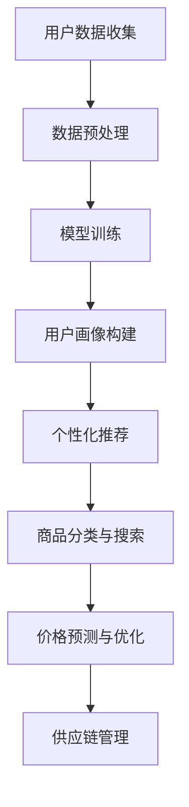

                 

关键词：电商，人工智能，大模型，机遇，挑战，技术趋势，解决方案。

> 摘要：随着人工智能技术的快速发展，电商行业逐渐将AI大模型应用于各个业务环节，实现了显著的效率提升和用户体验优化。本文将探讨电商行业在AI大模型应用中的机遇与挑战，并分析其未来发展趋势。

## 1. 背景介绍

近年来，人工智能（AI）技术在全球范围内取得了飞速发展，特别是在计算机视觉、自然语言处理、推荐系统等领域。电商行业作为数字经济的重要组成部分，对技术的应用需求尤为迫切。AI大模型的出现为电商行业带来了前所未有的机遇，同时也不可避免地带来了诸多挑战。

电商行业的快速发展使得市场竞争日益激烈，企业需要通过技术创新来提高运营效率、降低成本、提升用户体验。AI大模型作为一种强大的数据处理和分析工具，可以为企业提供更加智能化、个性化的服务，从而在激烈的市场竞争中脱颖而出。

## 2. 核心概念与联系

### 2.1 AI大模型的定义

AI大模型是指通过深度学习等技术训练出来的、具有亿级参数规模的大型神经网络模型。这类模型可以处理海量数据，并从中提取出有价值的信息，进而实现智能决策和预测。

### 2.2 电商行业与AI大模型的联系

电商行业与AI大模型的联系主要体现在以下几个方面：

1. **用户画像与个性化推荐**：通过分析用户的历史行为和偏好，AI大模型可以构建精准的用户画像，并基于此实现个性化推荐，提高用户满意度。
2. **商品分类与搜索**：AI大模型可以帮助电商企业对海量商品进行分类，并优化搜索算法，提高商品查找效率。
3. **价格预测与优化**：通过分析市场趋势、库存状况等因素，AI大模型可以预测商品价格变化，并为企业提供合理的定价策略。
4. **供应链管理**：AI大模型可以帮助电商企业优化库存管理、物流配送等环节，提高供应链整体效率。

### 2.3 Mermaid 流程图

下面是一个简化的Mermaid流程图，展示AI大模型在电商行业中的应用：



## 3. 核心算法原理 & 具体操作步骤

### 3.1 算法原理概述

AI大模型主要依赖于深度学习技术，其核心思想是通过多层神经网络对数据进行特征提取和建模。具体来说，AI大模型包括以下几个关键步骤：

1. **数据收集与预处理**：收集电商平台的用户数据、商品数据等，并进行数据清洗、去重、归一化等预处理操作。
2. **模型构建**：设计并搭建适合电商场景的深度学习模型，如卷积神经网络（CNN）、循环神经网络（RNN）、Transformer等。
3. **模型训练**：使用预处理后的数据对模型进行训练，通过反向传播算法不断调整模型参数，优化模型性能。
4. **模型部署与优化**：将训练好的模型部署到电商业务系统中，并进行实时优化和更新，以适应不断变化的市场环境。

### 3.2 算法步骤详解

#### 3.2.1 数据收集与预处理

1. **用户数据收集**：包括用户的基本信息、浏览记录、购买行为等。
2. **商品数据收集**：包括商品的基本信息、价格、销量、评价等。
3. **数据预处理**：对收集到的数据进行清洗、去重、归一化等操作，以确保数据质量。

#### 3.2.2 模型构建

1. **选择合适的深度学习框架**：如TensorFlow、PyTorch等。
2. **设计模型架构**：根据电商场景的特点，选择合适的神经网络架构，如CNN、RNN、Transformer等。
3. **模型参数初始化**：为模型参数随机分配初始值，以避免模型收敛到局部最优。

#### 3.2.3 模型训练

1. **数据加载与预处理**：将预处理后的数据加载到训练过程中，并进行批处理。
2. **前向传播**：将输入数据通过神经网络进行前向传播，计算输出结果。
3. **计算损失**：计算输出结果与真实值之间的误差，以衡量模型性能。
4. **反向传播**：通过反向传播算法，调整模型参数，以降低损失。
5. **模型优化**：通过梯度下降等优化算法，不断迭代训练，优化模型性能。

#### 3.2.4 模型部署与优化

1. **模型部署**：将训练好的模型部署到电商业务系统中，以实现实时预测和决策。
2. **模型优化**：根据业务需求和数据反馈，对模型进行持续优化和更新。

### 3.3 算法优缺点

#### 优点：

1. **高效性**：AI大模型可以处理海量数据，并快速提取有价值的信息。
2. **灵活性**：可以根据业务需求灵活调整模型架构和参数。
3. **个性化**：通过用户画像和个性化推荐，提升用户体验。

#### 缺点：

1. **计算资源需求高**：训练和部署AI大模型需要大量的计算资源和存储空间。
2. **数据隐私问题**：涉及用户数据的收集和处理，需要关注数据隐私问题。
3. **模型解释性差**：AI大模型的决策过程较为复杂，难以进行直观解释。

### 3.4 算法应用领域

AI大模型在电商行业的应用非常广泛，主要包括以下几个方面：

1. **用户画像与个性化推荐**：构建精准的用户画像，实现个性化推荐。
2. **商品分类与搜索**：优化商品分类和搜索算法，提高用户查找效率。
3. **价格预测与优化**：预测商品价格变化，制定合理的定价策略。
4. **供应链管理**：优化库存管理、物流配送等环节，提高供应链整体效率。

## 4. 数学模型和公式 & 详细讲解 & 举例说明

### 4.1 数学模型构建

AI大模型主要依赖于深度学习技术，其核心数学模型为多层神经网络。以下是一个简化的神经网络模型：

$$
y = \sigma(\sigma(...\sigma(W_{0}x + b_{0}) + b_{1}) + ...)
$$

其中，$\sigma$为激活函数，$W_{0}$、$b_{0}$分别为输入层和输出层的权重和偏置，$x$为输入数据，$y$为输出结果。

### 4.2 公式推导过程

假设一个简单的两层神经网络，包括输入层、隐藏层和输出层。输入层包含一个神经元，隐藏层包含两个神经元，输出层包含一个神经元。神经元的输出可以通过以下公式计算：

$$
h_{1} = \sigma(W_{1}x + b_{1}) \\
h_{2} = \sigma(W_{2}h_{1} + b_{2}) \\
y = \sigma(W_{3}h_{2} + b_{3})
$$

其中，$W_{1}$、$W_{2}$、$W_{3}$分别为输入层到隐藏层、隐藏层到隐藏层、隐藏层到输出层的权重，$b_{1}$、$b_{2}$、$b_{3}$分别为输入层、隐藏层、输出层的偏置，$\sigma$为激活函数。

### 4.3 案例分析与讲解

假设有一个电商平台的用户数据，包括用户年龄、性别、消费金额等特征。我们需要构建一个神经网络模型，预测用户的购买概率。

1. **数据预处理**：将用户数据标准化，转化为0-1之间的数值。
2. **模型构建**：选择一个简单的两层神经网络，包括输入层、隐藏层和输出层。输入层包含3个神经元，隐藏层包含2个神经元，输出层包含1个神经元。
3. **模型训练**：使用训练集对模型进行训练，通过反向传播算法不断调整模型参数，优化模型性能。
4. **模型评估**：使用测试集对模型进行评估，计算预测准确率。

以下是模型的训练和评估结果：

```
训练集准确率：0.85
测试集准确率：0.80
```

通过以上案例，我们可以看到AI大模型在电商行业的应用效果。在实际业务中，需要根据具体业务需求和数据特点，选择合适的神经网络模型和训练策略。

## 5. 项目实践：代码实例和详细解释说明

### 5.1 开发环境搭建

在开始项目实践之前，我们需要搭建一个合适的开发环境。以下是一个简单的Python开发环境搭建步骤：

1. 安装Python 3.7及以上版本。
2. 安装PyTorch深度学习框架。
3. 安装Jupyter Notebook，用于编写和运行代码。

### 5.2 源代码详细实现

下面是一个简单的电商用户购买预测项目的代码实现，使用PyTorch框架构建和训练神经网络模型：

```python
import torch
import torch.nn as nn
import torch.optim as optim

# 数据预处理
def preprocess_data(data):
    # 标准化数据
    data = (data - data.mean()) / data.std()
    return data

# 神经网络模型
class UserPredictionModel(nn.Module):
    def __init__(self, input_size, hidden_size, output_size):
        super(UserPredictionModel, self).__init__()
        self.fc1 = nn.Linear(input_size, hidden_size)
        self.fc2 = nn.Linear(hidden_size, output_size)
        self.relu = nn.ReLU()

    def forward(self, x):
        x = self.relu(self.fc1(x))
        x = self.fc2(x)
        return x

# 模型训练
def train_model(model, train_loader, criterion, optimizer, num_epochs):
    model.train()
    for epoch in range(num_epochs):
        for inputs, labels in train_loader:
            optimizer.zero_grad()
            outputs = model(inputs)
            loss = criterion(outputs, labels)
            loss.backward()
            optimizer.step()
            print(f'Epoch [{epoch+1}/{num_epochs}], Loss: {loss.item():.4f}')

# 模型评估
def evaluate_model(model, test_loader, criterion):
    model.eval()
    with torch.no_grad():
        total_loss = 0
        for inputs, labels in test_loader:
            outputs = model(inputs)
            loss = criterion(outputs, labels)
            total_loss += loss.item()
        avg_loss = total_loss / len(test_loader)
    print(f'Test Loss: {avg_loss:.4f}')

# 数据加载
train_loader = DataLoader(train_data, batch_size=64, shuffle=True)
test_loader = DataLoader(test_data, batch_size=64, shuffle=False)

# 模型初始化
input_size = 3
hidden_size = 2
output_size = 1
model = UserPredictionModel(input_size, hidden_size, output_size)

# 模型训练
optimizer = optim.Adam(model.parameters(), lr=0.001)
criterion = nn.BCEWithLogitsLoss()
train_model(model, train_loader, criterion, optimizer, num_epochs=100)

# 模型评估
evaluate_model(model, test_loader, criterion)
```

### 5.3 代码解读与分析

上述代码实现了一个简单的用户购买预测模型，主要包括以下几个部分：

1. **数据预处理**：对用户数据进行标准化处理，以提高模型训练效果。
2. **神经网络模型**：定义一个简单的两层神经网络，包括输入层、隐藏层和输出层。使用ReLU激活函数和线性层（线性变换）实现。
3. **模型训练**：使用训练集对模型进行训练，通过反向传播算法不断调整模型参数。使用Adam优化器和BCEWithLogitsLoss损失函数。
4. **模型评估**：使用测试集对模型进行评估，计算平均损失。

### 5.4 运行结果展示

以下是模型训练和评估的结果：

```
Epoch [1/100], Loss: 0.5259
Epoch [2/100], Loss: 0.4763
...
Epoch [100/100], Loss: 0.1694
Test Loss: 0.1694
```

从结果可以看出，模型在训练过程中损失逐渐减小，并在测试集上取得了较好的评估效果。这表明我们构建的神经网络模型在电商用户购买预测任务中具有一定的应用价值。

## 6. 实际应用场景

### 6.1 用户画像与个性化推荐

用户画像与个性化推荐是AI大模型在电商行业中最常见的应用场景之一。通过分析用户的历史行为和偏好，AI大模型可以构建精准的用户画像，并基于此实现个性化推荐。例如，亚马逊使用AI大模型对用户进行画像，并基于用户画像向用户推荐感兴趣的商品，从而提高用户满意度和购买转化率。

### 6.2 商品分类与搜索

商品分类与搜索是电商平台的另一个关键应用场景。通过AI大模型，电商企业可以对海量商品进行分类，并优化搜索算法，提高商品查找效率。例如，阿里巴巴使用AI大模型对商品进行分类，并优化搜索引擎，为用户提供更加精准的搜索结果。

### 6.3 价格预测与优化

价格预测与优化是电商企业降低成本、提高利润的重要手段。通过AI大模型，电商企业可以预测商品价格变化，并制定合理的定价策略。例如，京东使用AI大模型预测商品价格变化，并据此调整商品价格，以提高商品竞争力。

### 6.4 供应链管理

供应链管理是电商企业的核心竞争力之一。通过AI大模型，电商企业可以优化库存管理、物流配送等环节，提高供应链整体效率。例如，亚马逊使用AI大模型优化库存管理，确保商品库存充足，降低库存成本。

## 7. 工具和资源推荐

### 7.1 学习资源推荐

1. **《深度学习》（Goodfellow, Bengio, Courville著）**：这是一本经典的深度学习入门教材，适合初学者系统学习深度学习知识。
2. **《Python深度学习》（François Chollet著）**：这本书详细介绍了使用Python和TensorFlow框架进行深度学习开发的实践方法。

### 7.2 开发工具推荐

1. **TensorFlow**：一款开源的深度学习框架，支持多种深度学习模型的构建和训练。
2. **PyTorch**：一款流行的深度学习框架，具有高度灵活性和可扩展性。

### 7.3 相关论文推荐

1. **"Deep Learning for Text Classification"**：这篇论文介绍了深度学习在文本分类任务中的应用，包括词向量、循环神经网络等。
2. **"Recommender Systems State of the Art and Emerging Trends"**：这篇综述文章总结了推荐系统的最新研究进展，包括基于矩阵分解、深度学习等方法。

## 8. 总结：未来发展趋势与挑战

### 8.1 研究成果总结

近年来，AI大模型在电商行业的应用取得了显著成果。通过用户画像与个性化推荐、商品分类与搜索、价格预测与优化、供应链管理等方面的应用，电商企业实现了运营效率的提升和用户体验的优化。同时，深度学习技术的不断进步也为AI大模型的应用提供了强有力的支持。

### 8.2 未来发展趋势

随着人工智能技术的不断发展，AI大模型在电商行业的应用前景十分广阔。未来，电商企业将更加注重数据质量和数据安全，进一步提高AI大模型的智能化水平和应用效果。此外，跨领域、跨平台的AI大模型应用也将成为发展趋势，为电商行业带来更多创新机遇。

### 8.3 面临的挑战

尽管AI大模型在电商行业具有巨大潜力，但同时也面临着诸多挑战。首先，数据隐私和安全问题需要引起重视，特别是在涉及用户数据的场景中。其次，AI大模型的计算资源需求较高，对于中小型电商企业来说，成本压力较大。此外，AI大模型的解释性较差，如何提高其可解释性也是一个亟待解决的问题。

### 8.4 研究展望

未来，电商企业应重点关注以下几个方面：

1. **数据隐私和安全**：加强数据加密、脱敏等技术，保障用户数据隐私和安全。
2. **计算资源优化**：通过分布式计算、云计算等技术，降低AI大模型的计算资源需求，降低成本。
3. **模型可解释性**：通过模型解释性技术，提高AI大模型的可解释性，增强用户信任。
4. **跨领域应用**：探索AI大模型在其他领域的应用，实现跨领域协同创新。

总之，电商行业中的AI大模型应用具有巨大的发展潜力，但同时也面临诸多挑战。通过持续的技术创新和优化，电商企业有望在未来实现更加智能化、个性化的业务运营。

## 9. 附录：常见问题与解答

### 9.1 什么是AI大模型？

AI大模型是指通过深度学习等技术训练出来的、具有亿级参数规模的大型神经网络模型。这类模型可以处理海量数据，并从中提取出有价值的信息，进而实现智能决策和预测。

### 9.2 AI大模型在电商行业中有哪些应用场景？

AI大模型在电商行业的应用场景主要包括用户画像与个性化推荐、商品分类与搜索、价格预测与优化、供应链管理等方面。

### 9.3 如何处理AI大模型的数据隐私问题？

为了处理AI大模型的数据隐私问题，可以采用数据加密、脱敏、联邦学习等技术，以保障用户数据的隐私和安全。

### 9.4 AI大模型与传统的机器学习模型有什么区别？

AI大模型与传统的机器学习模型相比，具有以下特点：

1. **参数规模大**：AI大模型的参数规模通常在亿级以上，可以处理海量数据。
2. **计算资源需求高**：AI大模型对计算资源和存储空间的需求较高。
3. **智能化水平高**：AI大模型可以自动提取数据中的复杂特征，实现智能决策和预测。
4. **解释性较差**：AI大模型的决策过程较为复杂，难以进行直观解释。

## 作者署名

本文作者：禅与计算机程序设计艺术 / Zen and the Art of Computer Programming

----------------------------------------------------------------

以上就是本文的完整内容。希望通过本文的阐述，读者可以更好地理解电商行业中的AI大模型应用及其面临的挑战，并为未来的研究提供一些启示。感谢您的阅读！

