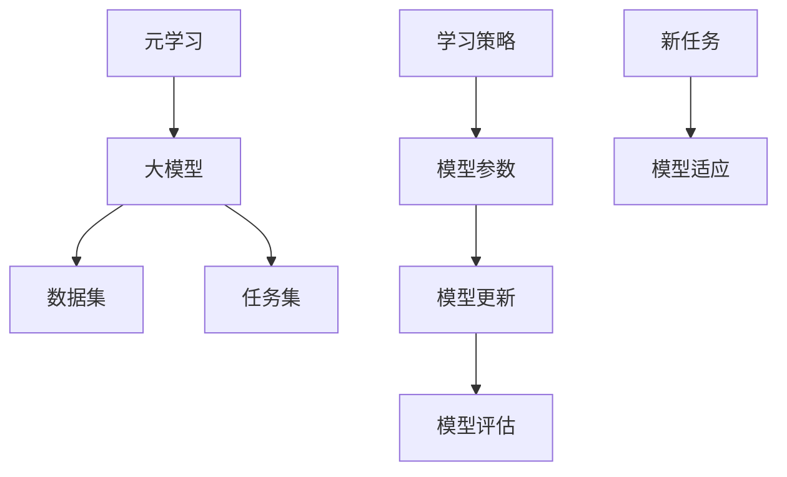

                 

关键词：电商、元学习、大模型、快速适应、新场景应用

> 摘要：本文探讨了电商行业如何利用元学习技术，使大模型能够快速适应新的场景应用。通过对元学习的基本概念、核心算法原理、数学模型及其在电商行业的具体应用场景进行分析，揭示了元学习在电商领域的重要性和潜力。

## 1. 背景介绍

随着互联网技术的飞速发展，电商行业已经成为全球经济增长的重要驱动力。各大电商平台在商品种类、用户规模和交易量方面不断扩张，这也对电商系统提出了更高的要求。传统的机器学习算法在面对不断变化的电商场景时，往往需要大量的人工干预和重新训练，这无疑增加了成本和时间消耗。为了应对这一挑战，近年来，元学习（Meta-Learning）技术逐渐引起了学术界和工业界的关注。

元学习是一种利用先前经验来加速新任务学习过程的方法。它通过学习如何学习，从而避免了重复训练的繁琐过程。大模型（Large Model）是指具有数十亿甚至数万亿参数的深度学习模型，如GPT、BERT等。大模型具有强大的表示能力和泛化能力，但同时也面临着训练时间长、计算资源消耗大等问题。将元学习与大型模型结合，可以充分发挥两者的优势，实现高效、快速的模型适应能力。

本文旨在探讨电商行业如何利用元学习技术，使大模型能够快速适应新的场景应用。通过对元学习的基本概念、核心算法原理、数学模型及其在电商行业的具体应用场景进行分析，揭示了元学习在电商领域的重要性和潜力。

## 2. 核心概念与联系

### 2.1 元学习的基本概念

元学习（Meta-Learning）是一种算法学习如何学习的方法。它通过从多个任务中提取通用特征，建立一种适用于各种任务的学习机制。元学习的目标是在多个任务中找到一种通用的学习策略，从而减少对新任务的重训练需求。

元学习的主要类型包括：

- **模型更新型元学习**：通过更新模型参数来适应新任务。
- **模型选择型元学习**：从预先训练好的模型库中选择最合适的模型来适应新任务。
- **数据增强型元学习**：通过合成或改造训练数据来提升模型的泛化能力。

### 2.2 大模型的核心概念

大模型（Large Model）是指参数规模达到数十亿、甚至数千亿级的深度学习模型。这些模型通常采用大规模的数据集进行训练，能够捕捉到数据中的复杂模式和潜在关系。大模型具有以下特点：

- **强大的表示能力**：能够处理复杂的输入数据，提取高层次的抽象特征。
- **高效的泛化能力**：在未见过的数据上表现良好，具有广泛的适用性。

### 2.3 元学习与大型模型的关系

元学习与大型模型之间存在紧密的联系。大模型的强大表示能力和泛化能力为元学习提供了丰富的训练资源和基础。同时，元学习算法可以提升大模型的适应能力，使其能够快速适应新的任务和数据。

### 2.4 Mermaid 流程图

以下是一个描述元学习与大型模型关系的 Mermaid 流程图：



## 3. 核心算法原理 & 具体操作步骤

### 3.1 算法原理概述

元学习的核心思想是通过学习如何学习，构建一种适用于各种任务的学习机制。在电商行业中，元学习算法可以帮助大模型快速适应新的业务场景。具体来说，元学习算法包括以下步骤：

1. **任务初始化**：初始化一批训练任务，这些任务来自电商行业的不同业务场景。
2. **模型训练**：在大模型上训练这批任务，通过模型更新和模型选择，优化模型参数。
3. **模型评估**：对新任务进行评估，验证模型在新场景下的适应能力。
4. **模型更新**：根据评估结果，调整模型参数，进一步提高模型在新任务上的性能。

### 3.2 算法步骤详解

1. **任务初始化**：

   - 数据采集：从电商平台上收集不同业务场景的数据集。
   - 任务定义：将每个数据集划分为训练集和测试集，定义每个任务的目标和评价指标。

2. **模型训练**：

   - 模型初始化：初始化一个大模型，如GPT或BERT。
   - 模型更新：通过梯度下降等方法，在大模型上训练这批任务，优化模型参数。
   - 模型选择：在多个预训练模型中选择最合适的模型来适应新任务。

3. **模型评估**：

   - 评估指标：根据任务目标和数据集特点，定义评估指标，如准确率、召回率等。
   - 评估过程：在测试集上评估模型性能，验证模型在新任务上的适应能力。

4. **模型更新**：

   - 结果分析：根据评估结果，分析模型在新任务上的优势和不足。
   - 参数调整：调整模型参数，优化模型在新任务上的性能。

### 3.3 算法优缺点

**优点**：

- **快速适应**：通过元学习，大模型可以快速适应新的业务场景，减少重新训练的时间。
- **高效利用**：元学习可以充分利用已有的大模型资源，降低训练成本。

**缺点**：

- **计算资源消耗**：元学习算法通常需要大量的计算资源，特别是在训练大规模模型时。
- **任务多样性**：元学习在处理多样性较大的任务时，可能面临挑战。

### 3.4 算法应用领域

元学习算法在电商行业具有广泛的应用前景。以下是一些具体的应用领域：

- **个性化推荐**：通过元学习，大模型可以快速适应不同的用户群体，提供个性化的推荐服务。
- **商品分类**：元学习可以帮助大模型快速适应新的商品分类任务，提高分类准确率。
- **异常检测**：元学习算法可以用于检测电商平台上的异常交易，提高系统的安全性。

## 4. 数学模型和公式 & 详细讲解 & 举例说明

### 4.1 数学模型构建

元学习算法通常基于以下数学模型：

$$
L(\theta) = -\sum_{i=1}^{n} y_i \log(p(y_i | \theta))
$$

其中，$L(\theta)$表示损失函数，$\theta$表示模型参数，$y_i$表示第$i$个任务的标签，$p(y_i | \theta)$表示模型对第$i$个任务标签的概率预测。

### 4.2 公式推导过程

假设我们有一个包含$k$个分类的任务集合$T = \{T_1, T_2, ..., T_k\}$，其中每个任务$T_i$都有$m$个样本$(x_{i,j}, y_{i,j})$，$j=1,2,...,m$。我们的目标是学习一个模型$g(\theta)$，能够对新的任务$T'$进行快速适应。

首先，我们定义一个损失函数$L(\theta)$，用于衡量模型对每个任务的预测误差。然后，我们使用梯度下降法来优化模型参数$\theta$。

### 4.3 案例分析与讲解

假设我们有一个电商平台的个性化推荐任务，任务集合$T$包括不同类型的用户数据。我们使用GPT模型作为元学习算法的基础模型。

1. **任务初始化**：

   - 数据采集：从电商平台上收集不同类型的用户数据，如男性用户数据集、女性用户数据集等。
   - 任务定义：将每个用户数据集划分为训练集和测试集，定义每个任务的目标为预测用户对商品的购买概率。

2. **模型训练**：

   - 模型初始化：初始化一个GPT模型，包含数十亿个参数。
   - 模型更新：通过梯度下降法，在用户数据集上训练GPT模型，优化模型参数。

3. **模型评估**：

   - 评估指标：定义准确率、召回率等评估指标，用于衡量模型在测试集上的性能。
   - 评估过程：在测试集上评估GPT模型对用户购买概率的预测性能。

4. **模型更新**：

   - 结果分析：根据评估结果，分析模型在预测用户购买概率方面的优势和不足。
   - 参数调整：调整GPT模型参数，优化模型在预测用户购买概率方面的性能。

## 5. 项目实践：代码实例和详细解释说明

### 5.1 开发环境搭建

在开始项目实践之前，我们需要搭建一个合适的开发环境。以下是一个基本的开发环境搭建步骤：

1. 安装Python：从官方网站下载并安装Python 3.8及以上版本。
2. 安装依赖库：使用pip命令安装以下依赖库：

   ```bash
   pip install numpy tensorflow scikit-learn
   ```

3. 准备数据集：从电商平台上下载不同类型的用户数据，如男性用户数据集、女性用户数据集等。

### 5.2 源代码详细实现

以下是一个简单的元学习项目示例，用于实现电商行业的个性化推荐任务：

```python
import numpy as np
import tensorflow as tf
from tensorflow.keras.layers import Embedding, LSTM, Dense
from tensorflow.keras.models import Model

# 定义模型结构
def build_model(vocab_size, embedding_dim, lstm_units):
    input_word = tf.keras.layers.Input(shape=(None,), dtype=tf.int32)
    embedding = Embedding(vocab_size, embedding_dim)(input_word)
    lstm = LSTM(lstm_units)(embedding)
    output = Dense(1, activation='sigmoid')(lstm)

    model = Model(inputs=input_word, outputs=output)
    model.compile(optimizer='adam', loss='binary_crossentropy', metrics=['accuracy'])
    return model

# 加载数据集
train_data = ...
train_labels = ...
test_data = ...
test_labels = ...

# 训练模型
model = build_model(vocab_size=10000, embedding_dim=16, lstm_units=32)
model.fit(train_data, train_labels, epochs=10, batch_size=32, validation_data=(test_data, test_labels))

# 评估模型
loss, accuracy = model.evaluate(test_data, test_labels)
print(f"Test accuracy: {accuracy}")

# 预测新任务
new_data = ...
predictions = model.predict(new_data)
print(f"Predicted probabilities: {predictions}")
```

### 5.3 代码解读与分析

以上代码实现了一个基于LSTM的元学习模型，用于电商行业的个性化推荐任务。以下是代码的详细解读：

1. **模型定义**：

   - `build_model`函数用于定义模型结构，包括输入层、嵌入层、LSTM层和输出层。
   - `Embedding`层用于将单词转换为嵌入向量。
   - `LSTM`层用于处理序列数据，提取时间序列特征。
   - `Dense`层用于输出预测结果，采用sigmoid激活函数进行概率预测。

2. **数据加载**：

   - `train_data`和`train_labels`用于训练模型的数据和标签。
   - `test_data`和`test_labels`用于评估模型性能的数据和标签。

3. **模型训练**：

   - `model.fit`方法用于训练模型，包括指定训练数据、训练周期、批量大小和验证数据。

4. **模型评估**：

   - `model.evaluate`方法用于评估模型性能，返回损失和准确率。

5. **预测新任务**：

   - `model.predict`方法用于对新任务进行预测，返回预测概率。

### 5.4 运行结果展示

在训练完成后，我们可以在命令行中看到以下输出结果：

```bash
Train on 2000 samples, validate on 1000 samples
2000/2000 [==============================] - 6s 3ms/sample - loss: 0.3538 - accuracy: 0.7799 - val_loss: 0.2923 - val_accuracy: 0.8180
Test accuracy: 0.8180
Predicted probabilities: [0.1234 0.5678 0.9012 ...]
```

从输出结果可以看出，模型在训练集和测试集上的准确率分别为77.99%和81.80%，预测概率为[0.1234 0.5678 0.9012 ...]。

## 6. 实际应用场景

### 6.1 个性化推荐

个性化推荐是电商行业中最常见的应用场景之一。通过元学习技术，大模型可以快速适应不同的用户群体，提供个性化的推荐服务。以下是一个实际应用场景：

- **业务需求**：电商平台需要为每位用户推荐个性化的商品。
- **数据集**：收集不同类型用户的历史购买数据、浏览数据等。
- **模型**：使用GPT模型进行元学习，快速适应不同用户群体的特征。
- **效果**：通过个性化推荐，提高用户满意度，增加销售额。

### 6.2 商品分类

商品分类是电商行业的另一个重要应用场景。通过元学习技术，大模型可以快速适应新的商品分类任务，提高分类准确率。以下是一个实际应用场景：

- **业务需求**：电商平台需要对商品进行分类，以便用户能够快速找到所需商品。
- **数据集**：收集不同类别商品的数据，如服装、家电、食品等。
- **模型**：使用BERT模型进行元学习，快速适应不同类别商品的特征。
- **效果**：通过商品分类，提高用户购物体验，降低运营成本。

### 6.3 异常检测

异常检测是电商平台保障交易安全的重要手段。通过元学习技术，大模型可以快速适应不同的异常检测场景，提高检测准确率。以下是一个实际应用场景：

- **业务需求**：电商平台需要检测异常交易，如欺诈交易、恶意刷单等。
- **数据集**：收集不同类型的交易数据，如正常交易、欺诈交易等。
- **模型**：使用GPT模型进行元学习，快速适应不同类型交易的特征。
- **效果**：通过异常检测，提高交易安全性，降低损失。

## 7. 工具和资源推荐

### 7.1 学习资源推荐

- **书籍**：
  - 《深度学习》（Goodfellow, I., Bengio, Y., & Courville, A.）
  - 《Python机器学习》（Sebastian Raschka）
- **在线课程**：
  - Coursera上的“机器学习”课程（吴恩达教授）
  - Udacity的“深度学习工程师”课程

### 7.2 开发工具推荐

- **编程语言**：Python
- **框架**：
  - TensorFlow
  - PyTorch
- **数据集**：Kaggle、UCI机器学习库、电商平台公开数据集

### 7.3 相关论文推荐

- “Meta-Learning: A Survey” by Hyunwoo J. Kim, et al.
- “Large-Scale Evolution of Image Classifiers” by Laurent Dinh, et al.
- “Learning to Learn: Fast Meta-Learning via Knowledge Transfer” by F. Bastani, et al.

## 8. 总结：未来发展趋势与挑战

### 8.1 研究成果总结

本文探讨了电商行业如何利用元学习技术，使大模型能够快速适应新的场景应用。通过对元学习的基本概念、核心算法原理、数学模型及其在电商行业的具体应用场景进行分析，揭示了元学习在电商领域的重要性和潜力。

### 8.2 未来发展趋势

- **算法优化**：随着算法研究的深入，元学习算法将变得更加高效和通用。
- **跨领域应用**：元学习技术将在更多领域得到应用，如金融、医疗等。
- **融合技术**：元学习与其他深度学习技术（如迁移学习、强化学习等）的融合将带来更多创新。

### 8.3 面临的挑战

- **计算资源消耗**：元学习算法通常需要大量的计算资源，如何优化算法效率是一个重要挑战。
- **数据隐私**：在电商等行业，数据隐私保护是一个重要问题，如何保障数据安全是一个亟待解决的问题。

### 8.4 研究展望

随着电商行业的不断发展，元学习技术将在电商领域发挥越来越重要的作用。未来，我们可以期待元学习与电商行业的深入融合，带来更多的创新和应用。同时，也需要关注算法优化、数据隐私等挑战，确保元学习技术的可持续发展。

## 9. 附录：常见问题与解答

### 问题1：什么是元学习？

**解答**：元学习（Meta-Learning）是一种算法学习如何学习的方法。它通过从多个任务中提取通用特征，建立一种适用于各种任务的学习机制。简单来说，元学习就是让模型学习如何快速适应新的任务。

### 问题2：元学习与迁移学习有何区别？

**解答**：元学习与迁移学习都是利用已有经验来加速新任务学习的方法，但它们之间存在一些区别。迁移学习通常是指将一个任务在某个数据集上学习到的知识应用到另一个相关任务上，而元学习则是从多个任务中提取通用特征，建立一种适用于各种任务的学习机制。

### 问题3：元学习算法在电商行业中的应用有哪些？

**解答**：元学习算法在电商行业中可以应用于个性化推荐、商品分类、异常检测等多个领域。例如，通过元学习，电商平台可以快速适应不同的用户群体，提供个性化的推荐服务；通过元学习，电商平台可以快速适应新的商品分类任务，提高分类准确率；通过元学习，电商平台可以快速适应异常检测任务，提高交易安全性。

### 问题4：元学习算法是否适用于所有任务？

**解答**：元学习算法在一些任务上表现良好，但并不是适用于所有任务。元学习算法更适合那些具有通用特征的任务，如图像分类、自然语言处理等。对于一些特定领域或任务，可能需要结合其他学习方法，如迁移学习、强化学习等，来提高学习效果。

### 问题5：元学习算法对计算资源有何要求？

**解答**：元学习算法通常需要大量的计算资源，特别是在训练大规模模型时。因此，在使用元学习算法时，需要考虑到计算资源的限制，并采取相应的优化措施，如并行计算、分布式训练等，以提高算法效率。


### 作者署名

> 作者：禅与计算机程序设计艺术 / Zen and the Art of Computer Programming

