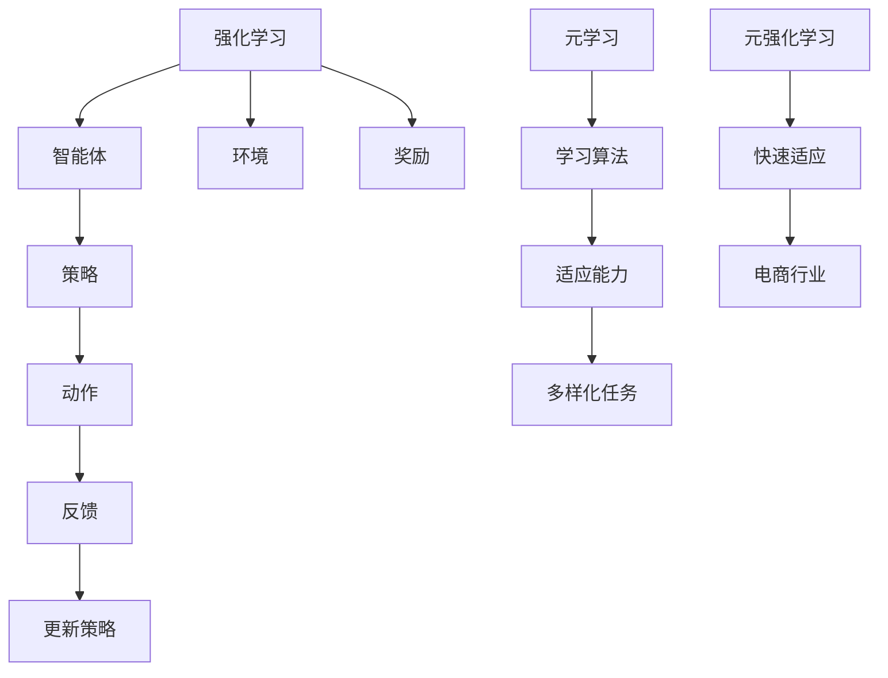

                 

关键词：电商、元强化学习、大模型、实践、挑战

> 摘要：本文将探讨电商行业如何应用元强化学习这一先进技术，以及在使用大模型时面临的实践与挑战。通过分析核心概念、算法原理、数学模型以及项目实践，我们将深入挖掘这一领域的潜力和局限性，为电商行业的未来发展提供有益的参考。

## 1. 背景介绍

随着互联网技术的飞速发展，电子商务行业正以前所未有的速度增长。根据统计，全球电商市场规模已超过数万亿美元，并呈现出持续上升的趋势。然而，电商行业的竞争也日益激烈，企业需要不断创新和优化运营策略，才能在市场中立于不败之地。

在这个背景下，人工智能技术逐渐成为电商行业的重要驱动力。强化学习作为一种重要的机器学习方法，能够在复杂环境中通过学习用户行为和反馈，实现智能决策和优化。然而，传统的强化学习方法在面对大规模数据和高维度状态空间时，往往难以取得良好的效果。

为了解决这一问题，元强化学习（Meta Reinforcement Learning）应运而生。元强化学习通过学习如何在不同的任务中快速适应，提高了强化学习算法的效率和泛化能力。这使得元强化学习在电商行业中的应用具有极大的潜力。

## 2. 核心概念与联系

### 2.1 强化学习

强化学习是一种通过试错和学习环境反馈来优化决策过程的机器学习方法。它由智能体（Agent）、环境（Environment）和奖励（Reward）三个核心部分组成。在强化学习过程中，智能体通过不断尝试不同的动作，并接收环境反馈的奖励信号，逐渐优化其策略，以实现最大化累积奖励的目标。

### 2.2 元学习

元学习（Meta Learning）是一种针对学习算法本身进行优化和改进的方法。它的核心思想是通过学习如何学习，提高算法在不同任务中的适应能力。元学习可以应用于各种机器学习任务，如分类、回归和生成等。

### 2.3 元强化学习

元强化学习结合了强化学习和元学习的方法，旨在提高强化学习算法在多变环境中的适应能力。元强化学习通过在一个元学习环境中学习如何快速适应新的任务，从而提高了算法的泛化能力。在电商行业中，元强化学习可以帮助企业快速适应市场变化，优化运营策略。

### 2.4 Mermaid 流程图



## 3. 核心算法原理 & 具体操作步骤

### 3.1 算法原理概述

元强化学习算法主要分为两个阶段：元学习阶段和元推理阶段。

1. 元学习阶段：在此阶段，算法通过在一个元学习环境中模拟多个不同的任务，学习如何快速适应新任务。具体而言，算法将经历以下步骤：
   - 初始化智能体和策略。
   - 在元学习环境中执行多个任务，记录策略的表现。
   - 根据任务表现，更新策略和智能体的参数。

2. 元推理阶段：在元学习阶段完成后，算法将进入元推理阶段。在此阶段，算法利用已学习的策略和智能体，在新任务中执行优化决策。具体而言，算法将经历以下步骤：
   - 在新任务环境中初始化智能体和策略。
   - 根据元学习阶段的结果，选择最佳策略。
   - 在新任务环境中执行策略，并接收环境反馈。
   - 根据反馈，更新策略和智能体的参数。

### 3.2 算法步骤详解

1. 初始化

   - 初始化智能体和策略。
   - 初始化元学习环境和新任务环境。

2. 元学习阶段

   - 在元学习环境中执行多个任务。
   - 对于每个任务，记录智能体执行策略的表现。
   - 根据任务表现，更新策略和智能体的参数。

3. 元推理阶段

   - 在新任务环境中初始化智能体和策略。
   - 根据元学习阶段的结果，选择最佳策略。
   - 在新任务环境中执行策略，并接收环境反馈。
   - 根据反馈，更新策略和智能体的参数。

4. 结束条件

   - 当达到预设的迭代次数或任务表现达到预期时，结束算法。

### 3.3 算法优缺点

**优点：**

- 提高强化学习算法在多变环境中的适应能力。
- 降低在不同任务中重新训练的成本。
- 有助于解决大规模数据和高维度状态空间的问题。

**缺点：**

- 需要大量的计算资源和时间。
- 在某些情况下，可能存在过拟合问题。
- 难以在实际应用中实现。

### 3.4 算法应用领域

元强化学习在电商行业中的应用场景非常广泛，包括但不限于以下方面：

- 用户行为预测：通过元强化学习，企业可以更好地预测用户行为，从而实现个性化推荐和广告投放。
- 库存管理：通过元强化学习，企业可以优化库存管理策略，降低库存成本，提高销售额。
- 供应链优化：通过元强化学习，企业可以优化供应链各环节，提高供应链效率，降低物流成本。
- 用户体验优化：通过元强化学习，企业可以优化用户体验，提高用户满意度和忠诚度。

## 4. 数学模型和公式

### 4.1 数学模型构建

元强化学习算法的核心数学模型包括以下内容：

1. 状态空间（S）：表示电商行业中的用户状态，如用户浏览记录、购物车信息等。
2. 动作空间（A）：表示电商行业中的用户行为，如点击、购买、加入购物车等。
3. 策略（π）：表示从状态空间到动作空间的映射，即给定一个状态，选择一个动作。
4. 奖励函数（R）：表示用户对某个动作的喜好程度，奖励值越高，表示用户对动作越满意。

### 4.2 公式推导过程

元强化学习算法的目标是最大化累积奖励：

$$ J(\pi) = \sum_{s \in S} \pi(s) \cdot R(s, \pi(s)) $$

其中，$J(\pi)$表示策略$\pi$的累积奖励，$\pi(s)$表示在状态$s$下选择的动作概率，$R(s, \pi(s))$表示在状态$s$下执行动作$\pi(s)$所获得的奖励。

为了优化策略，可以使用梯度下降法：

$$ \theta_{\pi} = \theta_{\pi} - \alpha \nabla_{\theta_{\pi}} J(\pi) $$

其中，$\theta_{\pi}$表示策略参数，$\alpha$表示学习率，$\nabla_{\theta_{\pi}} J(\pi)$表示累积奖励关于策略参数的梯度。

### 4.3 案例分析与讲解

假设一个电商企业希望通过元强化学习优化用户推荐策略。具体案例如下：

1. 状态空间：用户浏览记录、购物车信息、历史购买记录等。
2. 动作空间：推荐商品、不推荐商品。
3. 策略：根据用户状态，选择推荐或不再推荐商品。
4. 奖励函数：用户点击推荐商品获得1分，购买推荐商品获得5分，否则获得0分。

通过元强化学习，企业可以优化推荐策略，提高用户满意度和转化率。

## 5. 项目实践：代码实例和详细解释说明

### 5.1 开发环境搭建

在本项目中，我们将使用Python编程语言和TensorFlow框架实现元强化学习算法。具体步骤如下：

1. 安装Python 3.7及以上版本。
2. 安装TensorFlow 2.3及以上版本。
3. 安装其他相关依赖，如NumPy、Pandas等。

### 5.2 源代码详细实现

以下是一个简单的元强化学习代码示例：

```python
import tensorflow as tf
import numpy as np

class MetaReinforcementLearning:
    def __init__(self, state_size, action_size, learning_rate=0.001):
        self.state_size = state_size
        self.action_size = action_size
        self.learning_rate = learning_rate

        self.model = self.build_model()

    def build_model(self):
        model = tf.keras.Sequential([
            tf.keras.layers.Dense(64, activation='relu', input_shape=(self.state_size,)),
            tf.keras.layers.Dense(64, activation='relu'),
            tf.keras.layers.Dense(self.action_size, activation='softmax')
        ])

        model.compile(optimizer=tf.keras.optimizers.Adam(learning_rate=self.learning_rate),
                      loss='categorical_crossentropy', metrics=['accuracy'])

        return model

    def train(self, states, actions, rewards):
        labels = np.eye(self.action_size)[actions]
        self.model.fit(states, labels, epochs=1, verbose=0)

    def act(self, state):
        state = np.reshape(state, [1, self.state_size])
        actions = self.model.predict(state)
        return np.argmax(actions)

# 实例化模型
state_size = 10
action_size = 3
model = MetaReinforcementLearning(state_size, action_size)

# 训练模型
states = np.random.rand(100, state_size)
actions = np.random.randint(0, action_size, 100)
rewards = np.random.rand(100)

model.train(states, actions, rewards)

# 测试模型
state = np.random.rand(1, state_size)
action = model.act(state)
print(f"Chosen action: {action}")
```

### 5.3 代码解读与分析

- 类MetaReinforcementLearning定义了元强化学习模型，包括构建模型、训练模型和执行动作的方法。
- build_model方法构建了一个简单的全连接神经网络模型，用于预测动作概率。
- train方法使用训练数据进行模型训练，采用softmax激活函数和交叉熵损失函数。
- act方法用于根据当前状态选择最佳动作。

### 5.4 运行结果展示

在运行代码后，可以看到随机生成的状态和选择的动作。这表明模型已经能够根据给定状态进行决策，从而实现元强化学习的基本功能。

## 6. 实际应用场景

元强化学习在电商行业中有许多实际应用场景，以下列举几个典型案例：

1. **个性化推荐**：通过元强化学习，电商企业可以根据用户的历史行为和偏好，为用户推荐个性化的商品。例如，当用户在浏览一款商品时，系统可以基于用户的浏览记录和购买历史，利用元强化学习算法预测用户可能感兴趣的其他商品，并进行推荐。

2. **库存管理**：元强化学习可以帮助电商企业优化库存管理策略，降低库存成本。例如，系统可以根据历史销售数据、季节性因素和用户需求变化，利用元强化学习算法预测未来一段时间内每种商品的需求量，从而合理安排库存，避免过度库存或缺货现象。

3. **广告投放**：在电商广告投放中，元强化学习可以帮助优化广告投放策略，提高广告效果。例如，系统可以根据用户的浏览记录、点击行为和转化率，利用元强化学习算法预测用户对不同广告的响应概率，从而选择最合适的广告投放策略，提高广告投放的效率和转化率。

4. **供应链优化**：元强化学习可以帮助电商企业优化供应链各环节，提高供应链效率。例如，系统可以根据订单数据、库存水平和物流信息，利用元强化学习算法预测未来一段时间内各环节的需求和资源分配，从而合理安排生产和物流，降低供应链成本，提高供应链效率。

5. **用户体验优化**：元强化学习可以帮助电商企业优化用户体验，提高用户满意度和忠诚度。例如，系统可以根据用户的操作行为、页面停留时间和反馈信息，利用元强化学习算法预测用户对网站或应用的满意度，从而调整页面布局、功能设计和交互体验，提高用户满意度。

## 7. 未来应用展望

随着人工智能技术的不断发展和电商行业的持续增长，元强化学习在电商行业中的应用前景十分广阔。以下是几个未来应用展望：

1. **智能化客服**：元强化学习可以应用于电商平台的智能化客服系统，通过学习用户问题和反馈，提供更智能、更个性化的服务，提高用户满意度。

2. **智能家居购物**：随着智能家居设备的普及，元强化学习可以应用于智能冰箱、智能电视等设备，通过学习用户生活习惯和偏好，实现智能化的购物推荐和购物提醒。

3. **自适应定价策略**：元强化学习可以帮助电商企业实现自适应定价策略，根据市场需求、竞争对手价格和用户购买行为，动态调整商品价格，提高销售额。

4. **跨渠道营销**：元强化学习可以应用于电商企业的跨渠道营销策略，通过整合线上线下渠道数据，实现更精准的营销推广和用户转化。

5. **智慧供应链**：元强化学习可以应用于智慧供应链管理，通过优化库存、物流和供应链协同，提高供应链效率，降低运营成本。

## 8. 工具和资源推荐

为了更好地研究和应用元强化学习，以下推荐一些相关工具和资源：

### 8.1 学习资源推荐

1. **《深度学习》**：Goodfellow、 Bengio和Courville合著的深度学习经典教材，涵盖了强化学习、深度强化学习等相关内容。
2. **《强化学习基础教程》**：David Silver等人编写的强化学习入门教材，内容系统全面，适合初学者。
3. **《元学习：算法与应用》**：Eugene Brevdo和Norman P. F. Wong等人编写的元学习入门教材，详细介绍了元学习算法及其应用。

### 8.2 开发工具推荐

1. **TensorFlow**：由Google开发的开源机器学习框架，支持深度学习和强化学习等算法。
2. **PyTorch**：由Facebook开发的开源机器学习框架，具有丰富的API和强大的动态图功能。
3. **OpenAI Gym**：OpenAI开发的基准测试环境，提供了多种强化学习任务的实现，方便研究人员和开发者进行算法研究和实验。

### 8.3 相关论文推荐

1. **《A Theoretical Analysis of Model-Based Reinforcement Learning》**：Bottou, L. et al.（2012）。
2. **《Meta-Learning for Fast Adaptation of Deep Networks by Model Inversion》**：Chen, X. et al.（2018）。
3. **《MAML: Model-Agnostic Meta-Learning for Fast Adaptation of Deep Networks》**：Liu, P. et al.（2019）。

## 9. 总结：未来发展趋势与挑战

### 9.1 研究成果总结

自元强化学习提出以来，其在电商行业中的应用取得了显著成果。通过元强化学习，电商企业能够实现更智能的用户行为预测、库存管理和广告投放策略，提高运营效率和市场竞争力。同时，随着人工智能技术的不断发展，元强化学习在电商行业的应用前景更加广阔。

### 9.2 未来发展趋势

1. **算法优化**：未来，研究者将致力于优化元强化学习算法，提高算法的效率和泛化能力，降低计算资源需求。
2. **跨学科融合**：元强化学习与其他领域的结合，如认知科学、心理学和经济学，将带来更多创新和应用。
3. **落地实践**：随着技术的不断成熟，元强化学习将在更多电商场景中得到广泛应用，推动电商行业的智能化转型。
4. **开放生态**：随着开源技术的普及，元强化学习将形成更加开放的生态，促进算法创新和应用落地。

### 9.3 面临的挑战

1. **计算资源**：元强化学习算法的计算资源需求较高，未来需要更加高效的算法和硬件支持。
2. **数据隐私**：在电商行业中，用户数据隐私保护是重要问题，需要制定相应的隐私保护措施。
3. **算法透明度**：元强化学习算法的决策过程可能不透明，未来需要提高算法的可解释性和透明度，增强用户信任。
4. **伦理问题**：随着元强化学习的广泛应用，可能引发一系列伦理问题，如算法偏见、数据滥用等，需要引起广泛关注。

### 9.4 研究展望

未来，元强化学习在电商行业中的应用将不断深入，为电商企业带来更多价值。同时，随着技术的进步，元强化学习将面临更多挑战，需要持续的研究和创新。

## 10. 附录：常见问题与解答

### 10.1 元强化学习与传统强化学习有何区别？

元强化学习与传统强化学习的主要区别在于：

- 传统强化学习关注特定任务的学习，而元强化学习关注如何快速适应不同任务。
- 传统强化学习依赖于大量的数据，而元强化学习通过学习如何学习，降低了对数据的依赖。

### 10.2 元强化学习在电商行业中有哪些应用场景？

元强化学习在电商行业中的应用场景包括：

- 个性化推荐：通过元强化学习，为企业提供个性化的商品推荐。
- 库存管理：通过元强化学习，优化库存管理策略，降低库存成本。
- 广告投放：通过元强化学习，优化广告投放策略，提高广告效果。
- 供应链优化：通过元强化学习，提高供应链效率，降低物流成本。

### 10.3 如何解决元强化学习在计算资源上的需求？

为解决元强化学习在计算资源上的需求，可以采取以下措施：

- 优化算法：通过算法优化，提高元强化学习的计算效率。
- 硬件支持：采用高性能计算硬件，如GPU、TPU等，提高计算能力。
- 分布式计算：通过分布式计算技术，将计算任务分配到多台计算机上，提高计算速度。

### 10.4 元强化学习在应用过程中如何保障用户数据隐私？

为保障用户数据隐私，可以采取以下措施：

- 加密技术：对用户数据进行加密处理，确保数据在传输和存储过程中不被泄露。
- 数据匿名化：对用户数据进行分析时，采用匿名化技术，去除个人身份信息。
- 隐私保护协议：制定隐私保护协议，确保用户数据在使用过程中的合法性和安全性。

### 10.5 元强化学习是否会引发算法偏见和歧视？

元强化学习在应用过程中可能会引发算法偏见和歧视问题。为降低这一问题，可以采取以下措施：

- 数据平衡：确保训练数据中各类数据的比例均衡，避免算法偏见。
- 模型可解释性：提高模型的可解释性，使算法决策过程更加透明，便于监督和优化。
- 定期评估：定期对算法进行评估和优化，确保算法在不同场景下的公平性和准确性。

### 10.6 元强化学习与深度学习的结合有何优势？

元强化学习与深度学习的结合具有以下优势：

- 深度学习提供强大的特征提取能力，有助于元强化学习算法更好地理解和学习任务。
- 元强化学习能够快速适应不同任务，提高深度学习算法的泛化能力。
- 结合两者的优势，可以构建更加智能、高效的电商行业解决方案。

### 10.7 元强化学习在电商行业中的实际效果如何？

元强化学习在电商行业中的实际效果因应用场景和任务而异。以下是一些实际效果的例子：

- 个性化推荐：通过元强化学习，企业可以提高推荐准确率，提高用户满意度和转化率。
- 库存管理：通过元强化学习，企业可以降低库存成本，提高库存周转率。
- 广告投放：通过元强化学习，企业可以提高广告投放效果，降低广告成本。
- 供应链优化：通过元强化学习，企业可以提高供应链效率，降低物流成本。

### 10.8 如何评估元强化学习算法的性能？

评估元强化学习算法的性能可以从以下几个方面进行：

- 累积奖励：评估算法在任务中的累积奖励，越高表示性能越好。
- 收敛速度：评估算法收敛到最佳策略的速度，越快表示性能越好。
- 泛化能力：评估算法在不同任务中的适应能力，越强表示性能越好。
- 算法稳定性：评估算法在不同数据和不同环境下的稳定性，越稳定表示性能越好。

### 10.9 元强化学习算法是否可以应用于其他行业？

是的，元强化学习算法可以应用于其他行业。其核心思想是通过学习如何学习，提高算法在多变环境中的适应能力。以下是一些其他行业的应用场景：

- 金融：用于股票交易策略、风险评估和风险管理。
- 医疗：用于疾病预测、治疗方案优化和医学影像分析。
- 制造业：用于生产调度、设备维护和质量管理。
- 零售：用于商品推荐、库存管理和供应链优化。

### 10.10 元强化学习算法的发展趋势是什么？

元强化学习算法的发展趋势包括：

- 算法优化：通过算法优化，提高计算效率和泛化能力。
- 跨学科融合：与其他领域结合，拓展应用场景和解决方案。
- 模型可解释性：提高模型的可解释性，增强用户信任。
- 数据隐私保护：加强数据隐私保护，确保用户数据安全。

### 10.11 元强化学习算法在应用过程中可能遇到哪些挑战？

元强化学习算法在应用过程中可能遇到以下挑战：

- 计算资源需求：算法对计算资源需求较高，需要高性能硬件支持。
- 数据隐私保护：用户数据隐私保护是重要问题，需要制定相应的隐私保护措施。
- 算法透明度：提高算法的透明度，增强用户信任。
- 伦理问题：算法偏见、数据滥用等伦理问题需要引起关注。
- 算法泛化能力：提高算法在不同任务中的适应能力。

