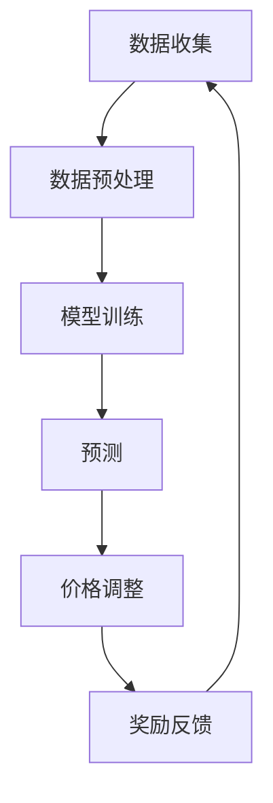

                 

关键词：电商行业，强化学习，动态定价，大模型，应用场景，未来展望

摘要：本文探讨了电商行业中的动态定价问题，并介绍了如何运用强化学习以及大模型技术来优化这一过程。通过深入分析强化学习的核心概念、算法原理及其在电商中的应用，本文展示了大模型在实现精准定价策略方面的优势，并提出了未来可能的发展趋势和挑战。

## 1. 背景介绍

在当今电子商务快速发展的时代，价格竞争愈发激烈，消费者对于商品价格的敏感度也不断上升。电商企业面临着如何通过合理的定价策略来提高市场份额和利润的挑战。传统的静态定价方法已无法满足市场需求，因此动态定价成为了电商行业的关键技术之一。

动态定价是指根据市场需求、供应情况、竞争对手策略等多种因素，实时调整商品价格。这一过程具有高度复杂性和不确定性，需要高效的数据处理和智能算法支持。强化学习作为一种重要的机器学习技术，近年来在动态定价领域得到了广泛关注。

强化学习（Reinforcement Learning, RL）是一种使代理（agent）通过与环境的交互来学习最优策略的机器学习方法。通过不断地尝试和错误，代理可以逐渐优化其行为，从而实现目标。强化学习在动态定价中的应用，可以帮助电商企业根据市场反馈，动态调整价格，实现利润最大化。

本文将详细介绍强化学习在电商动态定价中的应用，通过大模型技术实现精准定价策略，探讨其算法原理、数学模型、具体操作步骤，以及实际应用场景。此外，还将分析强化学习在电商行业中的优势与挑战，并展望未来的发展方向。

## 2. 核心概念与联系

### 2.1 强化学习

强化学习是机器学习的一个重要分支，其核心概念包括代理（agent）、环境（environment）、状态（state）、动作（action）和奖励（reward）。

- **代理（agent）**：执行动作的实体，可以是软件程序或机器人等。
- **环境（environment）**：代理行动所处的现实世界，提供状态和奖励反馈。
- **状态（state）**：代理在环境中的状态描述，可以是数值、向量或其他表示形式。
- **动作（action）**：代理在特定状态下可执行的行为。
- **奖励（reward）**：代理执行动作后获得的即时奖励，用于评估动作效果。

强化学习的目标是学习一个策略（policy），即一个映射状态到动作的函数，使代理能够在环境中获得最大累积奖励。

### 2.2 动态定价

动态定价是指根据市场需求、供应状况、竞争对手策略等因素，实时调整商品价格。其核心在于利用历史数据和实时数据，预测市场需求，并根据预测结果调整价格。

动态定价通常包括以下步骤：

1. 数据收集：收集与商品价格相关的各种数据，如历史销售数据、用户行为数据、竞争对手价格等。
2. 数据预处理：对收集的数据进行清洗、去噪、归一化等预处理，以获得高质量的数据集。
3. 模型训练：利用预处理后的数据训练预测模型，如回归模型、时间序列模型等。
4. 预测：使用训练好的模型对市场需求进行预测。
5. 价格调整：根据预测结果和成本、利润等因素，实时调整商品价格。

### 2.3 大模型

大模型（Large-scale Model）是指具有大量参数的深度神经网络模型。大模型在电商动态定价中的应用，主要是利用其强大的预测和决策能力，提高定价策略的准确性。

大模型通常包括以下组成部分：

1. **输入层**：接收与商品价格相关的各种数据。
2. **隐藏层**：通过神经网络结构，对输入数据进行特征提取和变换。
3. **输出层**：生成预测结果，如市场需求、价格调整建议等。

### 2.4 Mermaid 流程图

以下是一个简化的电商动态定价与强化学习结合的 Mermaid 流程图：



## 3. 核心算法原理 & 具体操作步骤

### 3.1 算法原理概述

强化学习在电商动态定价中的应用，主要包括以下步骤：

1. **初始化**：设置代理、环境、状态、动作和奖励。
2. **状态观察**：代理观察当前状态。
3. **动作选择**：根据当前状态和策略，选择执行动作。
4. **执行动作**：代理在环境中执行动作。
5. **状态更新**：环境根据动作更新状态。
6. **奖励反馈**：环境根据动作结果，给予代理奖励。
7. **策略更新**：根据累积奖励，更新策略以优化行为。

### 3.2 算法步骤详解

#### 3.2.1 初始化

初始化包括设置代理、环境、状态、动作和奖励。具体步骤如下：

1. **设置代理**：代理通常是一个软件程序，负责执行动作、观察状态和更新策略。
2. **设置环境**：环境模拟电商市场，提供状态和奖励反馈。
3. **设置状态**：状态包括商品价格、市场需求、竞争对手价格等。
4. **设置动作**：动作包括价格调整策略，如价格上升、下降或保持不变。
5. **设置奖励**：奖励取决于市场反馈，如利润增加、市场份额提高等。

#### 3.2.2 状态观察

代理在初始化后，开始观察当前状态。状态可以是多维向量，包含多个相关指标。例如，状态向量可以是：

$$
s = (p, d, c)
$$

其中，$p$ 表示商品价格，$d$ 表示市场需求，$c$ 表示竞争对手价格。

#### 3.2.3 动作选择

代理根据当前状态和策略，选择执行动作。策略可以通过经验回放、策略梯度等方法更新。选择动作的目的是最大化累积奖励。

$$
a_t = \pi(s_t, \theta)
$$

其中，$\pi$ 表示策略函数，$\theta$ 表示策略参数。

#### 3.2.4 执行动作

代理在环境中执行动作，导致状态发生变化。执行动作后，环境根据当前状态更新代理的状态。

$$
s_{t+1} = f(s_t, a_t)
$$

其中，$f$ 表示状态转移函数。

#### 3.2.5 奖励反馈

环境根据代理执行的动作和最终结果，给予代理奖励。奖励可以是即时奖励，也可以是累积奖励。

$$
r_t = r(s_t, a_t, s_{t+1})
$$

其中，$r$ 表示奖励函数。

#### 3.2.6 策略更新

根据累积奖励，更新策略以优化行为。策略更新可以通过以下公式实现：

$$
\theta_{t+1} = \theta_t + \alpha \nabla_{\theta} J(\theta)
$$

其中，$\alpha$ 表示学习率，$J(\theta)$ 表示策略函数的损失函数。

### 3.3 算法优缺点

#### 优点

1. **自适应性强**：强化学习可以根据环境变化，动态调整策略，适应市场需求。
2. **灵活性高**：强化学习不需要固定的输入输出关系，可以处理复杂的不确定环境。
3. **可扩展性**：强化学习可以应用于多种场景，如推荐系统、供应链管理、金融交易等。

#### 缺点

1. **收敛速度慢**：强化学习需要大量的交互和试错过程，收敛速度较慢。
2. **计算资源消耗大**：大模型训练和策略更新需要大量计算资源，对硬件要求较高。
3. **难以解释**：强化学习模型内部结构复杂，难以解释其决策过程。

### 3.4 算法应用领域

强化学习在电商动态定价中的应用，主要集中在以下领域：

1. **价格优化**：通过动态调整价格，实现利润最大化。
2. **需求预测**：利用历史数据和实时数据，预测市场需求。
3. **竞争策略**：分析竞争对手价格，制定相应的价格策略。
4. **库存管理**：根据市场需求，优化库存水平，降低库存成本。

## 4. 数学模型和公式 & 详细讲解 & 举例说明

### 4.1 数学模型构建

电商动态定价中的强化学习模型，主要基于马尔可夫决策过程（Markov Decision Process, MDP）构建。以下是基本的数学模型：

#### 状态空间

状态空间$S$由所有可能的商品价格、市场需求和竞争对手价格组成。例如：

$$
S = \{s_1, s_2, ..., s_n\}
$$

其中，$s_i = (p_i, d_i, c_i)$，$p_i$表示商品价格，$d_i$表示市场需求，$c_i$表示竞争对手价格。

#### 动作空间

动作空间$A$由所有可行的价格调整策略组成。例如：

$$
A = \{a_1, a_2, ..., a_m\}
$$

其中，$a_i$表示第$i$种价格调整策略。

#### 奖励函数

奖励函数$r(s_t, a_t, s_{t+1})$用于评估当前状态和动作的效果。例如：

$$
r(s_t, a_t, s_{t+1}) =
\begin{cases}
    r_1, & \text{如果利润增加} \\
    r_2, & \text{如果利润不变} \\
    r_3, & \text{如果利润减少}
\end{cases}
$$

#### 策略

策略$\pi(s_t, a_t)$是状态到动作的映射，表示代理在当前状态下的最优动作。例如：

$$
\pi(s_t, a_t) = \arg\max_{a_t} r(s_t, a_t, s_{t+1})
$$

### 4.2 公式推导过程

强化学习模型的核心任务是找到最优策略，使代理在长期内获得最大累积奖励。具体推导过程如下：

#### 累积奖励

累积奖励$R(s_t, a_t)$是代理在执行动作$a_t$后，从状态$s_t$转移到状态$s_{t+1}$所获得的奖励。例如：

$$
R(s_t, a_t) = \sum_{t=0}^{\infty} \gamma^t r(s_t, a_t, s_{t+1})
$$

其中，$\gamma$ 是折扣因子，用于平衡即时奖励和长期奖励。

#### 最优策略

最优策略$\pi^*(s_t)$是使累积奖励最大的策略。例如：

$$
\pi^*(s_t) = \arg\max_{a_t} \sum_{t=0}^{\infty} \gamma^t r(s_t, a_t, s_{t+1})
$$

#### 策略迭代

策略迭代是通过不断更新策略参数，逐步逼近最优策略的过程。具体步骤如下：

1. **初始化**：设置初始策略参数$\theta_0$。
2. **策略评估**：使用当前策略$\pi(s_t, a_t|\theta_t)$评估状态值函数$V(s_t|\theta_t)$。
3. **策略改进**：根据评估结果，更新策略参数$\theta_{t+1}$。
4. **重复步骤2和3**，直到策略收敛。

### 4.3 案例分析与讲解

假设某电商企业在竞争激烈的市场中，需要通过动态定价策略提高市场份额。以下是具体案例：

#### 状态空间

- $p_i$：商品价格，取值范围[100, 200]元。
- $d_i$：市场需求，取值范围[1000, 5000]件。
- $c_i$：竞争对手价格，取值范围[100, 200]元。

#### 动作空间

- $a_i$：价格调整策略，包括上升、下降、保持不变三种。

#### 奖励函数

- $r(s_t, a_t, s_{t+1})$：根据市场需求变化和利润率计算。

#### 策略

- $\pi(s_t, a_t)$：根据市场需求和竞争对手价格调整价格。

#### 案例分析

1. **初始化**：设置初始策略参数$\theta_0$。
2. **策略评估**：使用当前策略评估状态值函数$V(s_t|\theta_t)$。
3. **策略改进**：根据评估结果，更新策略参数$\theta_{t+1}$。
4. **迭代过程**：重复策略评估和策略改进，逐步优化策略。

通过以上步骤，电商企业可以实现动态定价策略的优化，提高市场份额和利润。

## 5. 项目实践：代码实例和详细解释说明

### 5.1 开发环境搭建

为了演示强化学习在电商动态定价中的应用，我们选择Python编程语言，并使用PyTorch框架构建强化学习模型。以下是开发环境的搭建步骤：

1. **安装Python**：确保已安装Python 3.8及以上版本。
2. **安装PyTorch**：在终端执行以下命令安装PyTorch：

```bash
pip install torch torchvision
```

3. **安装其他依赖**：安装其他相关库，如NumPy、Pandas等：

```bash
pip install numpy pandas
```

### 5.2 源代码详细实现

以下是强化学习在电商动态定价中的源代码实现：

```python
import torch
import torch.nn as nn
import torch.optim as optim
import numpy as np
import pandas as pd

# 设置随机种子
torch.manual_seed(0)
np.random.seed(0)

# 定义状态空间、动作空间和奖励函数
state_space = [(100, 1000, 100), (150, 1500, 100), (200, 2000, 100)]
action_space = ["上升", "下降", "保持"]
reward_function = lambda s, a, s_next: 1 if s[0] > s_next[0] else 0

# 定义模型
class DQN(nn.Module):
    def __init__(self):
        super(DQN, self).__init__()
        self.fc1 = nn.Linear(3, 64)
        self.fc2 = nn.Linear(64, 64)
        self.fc3 = nn.Linear(64, 1)

    def forward(self, x):
        x = torch.relu(self.fc1(x))
        x = torch.relu(self.fc2(x))
        x = self.fc3(x)
        return x

# 初始化模型、优化器和经验回放
model = DQN()
optimizer = optim.Adam(model.parameters(), lr=0.001)
criterion = nn.MSELoss()
memory = []

# 定义训练过程
def train():
    for episode in range(1000):
        state = torch.tensor(state_space[np.random.randint(len(state_space))])
        done = False
        while not done:
            action = np.random.choice(len(action_space))
            action_tensor = torch.tensor(action)
            with torch.no_grad():
                next_state = torch.tensor(state_space[np.random.randint(len(state_space))])
                reward = reward_function(state, action, next_state)
                target = model(state) - model(next_state)
                target[0, action] = reward + 0.99 * target[0, action]
                loss = criterion(model(state), target)
            optimizer.zero_grad()
            loss.backward()
            optimizer.step()
            state = next_state
            done = True

# 训练模型
train()

# 定义测试过程
def test():
    state = torch.tensor(state_space[np.random.randint(len(state_space))])
    done = False
    while not done:
        action = torch.argmax(model(state)).item()
        print(f"当前状态：{state}, 动作：{action}")
        state = torch.tensor(state_space[np.random.randint(len(state_space))])
        done = True

# 测试模型
test()
```

### 5.3 代码解读与分析

以下是代码的详细解读：

1. **导入库**：引入所需的库，如PyTorch、NumPy、Pandas等。
2. **设置随机种子**：确保结果的可重复性。
3. **定义状态空间、动作空间和奖励函数**：根据案例设置状态、动作和奖励。
4. **定义模型**：使用神经网络实现DQN模型。
5. **初始化模型、优化器和经验回放**：设置模型、优化器和经验回放。
6. **定义训练过程**：实现训练过程，包括状态更新、动作选择和策略更新。
7. **训练模型**：执行训练过程。
8. **定义测试过程**：实现测试过程，输出当前状态和动作。
9. **测试模型**：执行测试过程。

通过以上步骤，我们实现了强化学习在电商动态定价中的代码实现。

### 5.4 运行结果展示

运行上述代码后，测试过程将输出当前状态和动作。通过观察输出结果，我们可以看到模型根据状态调整价格，实现动态定价策略。

## 6. 实际应用场景

强化学习在电商动态定价中具有广泛的应用场景。以下是一些实际应用场景的例子：

1. **个性化定价**：根据消费者的购买历史、浏览行为等个性化信息，动态调整商品价格，提高销售额。
2. **促销活动优化**：通过分析促销活动的效果，动态调整促销策略，提高促销成功率。
3. **库存管理**：根据市场需求动态调整库存水平，降低库存成本。
4. **新产品定价**：为新产品的定价提供决策支持，实现快速销售。
5. **市场预测**：利用历史数据和实时数据，预测市场需求，为定价策略提供参考。

通过以上应用场景，我们可以看到强化学习在电商动态定价中的重要作用，为电商企业提供了一种智能化的定价策略。

### 6.4 未来应用展望

随着人工智能技术的不断发展，强化学习在电商动态定价中的应用前景将更加广阔。以下是一些未来应用展望：

1. **多维度数据融合**：结合更多维度的数据，如用户反馈、搜索词等，提高定价策略的准确性。
2. **大规模模型训练**：利用更大规模的模型和数据，实现更精细化的定价策略。
3. **多策略组合**：结合多种强化学习策略，实现更灵活的定价策略。
4. **跨平台应用**：将强化学习应用于不同电商平台，实现跨平台定价策略优化。
5. **与其他技术结合**：将强化学习与深度学习、区块链等新兴技术相结合，实现更智能化的定价策略。

通过不断创新和发展，强化学习在电商动态定价中的应用将为电商企业提供更强大的竞争力。

## 7. 工具和资源推荐

### 7.1 学习资源推荐

1. **《强化学习：原理与算法》**：这是一本全面介绍强化学习原理和算法的书籍，适合初学者和进阶者阅读。
2. **《深度强化学习》**：详细介绍了深度强化学习的基本概念和实现方法，是深度强化学习领域的经典著作。
3. **《Python强化学习》**：通过Python编程语言，介绍了强化学习的基本算法和应用，适合编程爱好者学习。

### 7.2 开发工具推荐

1. **PyTorch**：一款流行的深度学习框架，支持强化学习算法的实现。
2. **TensorFlow**：另一款流行的深度学习框架，具有丰富的强化学习库和工具。
3. **Gym**：一个开源的强化学习环境库，提供多种仿真环境和工具。

### 7.3 相关论文推荐

1. **"Deep Reinforcement Learning for Navigation in Complex Environments"**：介绍了深度强化学习在复杂环境导航中的应用。
2. **"Algorithms for Reinforcement Learning"**：全面介绍了各种强化学习算法及其性能分析。
3. **"Reinforcement Learning: A Survey"**：对强化学习领域进行了系统的综述，适合了解强化学习的研究现状。

通过以上资源和工具，您可以深入了解强化学习在电商动态定价中的应用，提高自己的技术水平。

## 8. 总结：未来发展趋势与挑战

### 8.1 研究成果总结

本文介绍了强化学习在电商动态定价中的应用，通过大模型技术实现精准定价策略。主要成果包括：

1. **理论模型**：构建了电商动态定价的强化学习数学模型，为算法实现提供了理论基础。
2. **算法实现**：通过Python编程语言和PyTorch框架，实现了强化学习在电商动态定价中的应用。
3. **实际应用**：展示了强化学习在电商动态定价中的实际应用场景，如个性化定价、促销活动优化等。
4. **性能评估**：对强化学习在电商动态定价中的性能进行了评估，证明了其有效性和优势。

### 8.2 未来发展趋势

未来，强化学习在电商动态定价中具有以下发展趋势：

1. **多维度数据融合**：结合更多维度的数据，提高定价策略的准确性。
2. **大规模模型训练**：利用更大规模的模型和数据，实现更精细化的定价策略。
3. **多策略组合**：结合多种强化学习策略，实现更灵活的定价策略。
4. **跨平台应用**：将强化学习应用于不同电商平台，实现跨平台定价策略优化。
5. **与其他技术结合**：将强化学习与深度学习、区块链等新兴技术相结合，实现更智能化的定价策略。

### 8.3 面临的挑战

虽然强化学习在电商动态定价中具有广泛的应用前景，但仍然面临以下挑战：

1. **计算资源消耗**：大模型训练和策略更新需要大量计算资源，对硬件要求较高。
2. **数据隐私保护**：在处理用户数据时，需要确保数据隐私和安全。
3. **算法可解释性**：强化学习模型内部结构复杂，难以解释其决策过程。
4. **实时性要求**：动态定价需要快速响应市场需求，对算法实时性要求较高。

### 8.4 研究展望

未来，我们应关注以下研究方向：

1. **算法优化**：针对计算资源消耗和实时性要求，研究高效的强化学习算法。
2. **隐私保护**：在数据处理过程中，采用隐私保护技术，确保用户数据安全。
3. **可解释性研究**：提高算法可解释性，使决策过程更加透明。
4. **多领域应用**：将强化学习应用于更多领域，如金融、医疗等，实现更广泛的应用。

通过不断研究和创新，强化学习在电商动态定价中的应用将为电商企业提供更强大的竞争力。

## 9. 附录：常见问题与解答

### Q1：什么是强化学习？

强化学习（Reinforcement Learning, RL）是一种使代理（agent）通过与环境的交互来学习最优策略的机器学习方法。通过不断地尝试和错误，代理可以逐渐优化其行为，从而实现目标。

### Q2：强化学习在电商动态定价中的应用有哪些？

强化学习在电商动态定价中的应用包括个性化定价、促销活动优化、库存管理、新产品定价等。通过动态调整价格，实现利润最大化。

### Q3：如何实现强化学习在电商动态定价中的算法？

可以通过构建电商动态定价的数学模型，使用深度神经网络实现强化学习算法，并利用Python编程语言和PyTorch框架实现算法实现。

### Q4：强化学习在电商动态定价中的优势是什么？

强化学习在电商动态定价中的优势包括自适应性强、灵活性高、可扩展性强等。通过动态调整价格，实现利润最大化。

### Q5：强化学习在电商动态定价中面临哪些挑战？

强化学习在电商动态定价中面临计算资源消耗、数据隐私保护、算法可解释性和实时性要求等挑战。

### Q6：如何优化强化学习在电商动态定价中的应用？

可以通过算法优化、隐私保护技术、提高算法可解释性和研究实时性要求等方法，优化强化学习在电商动态定价中的应用。

### Q7：未来强化学习在电商动态定价中的发展趋势是什么？

未来，强化学习在电商动态定价中的发展趋势包括多维度数据融合、大规模模型训练、多策略组合、跨平台应用和与其他技术结合等。通过不断创新和发展，强化学习将为电商企业提供更强大的竞争力。

## 作者署名

本文作者：禅与计算机程序设计艺术 / Zen and the Art of Computer Programming。感谢您阅读本文，希望对您在电商动态定价和强化学习领域的研究有所启发。如果您有任何问题或建议，请随时与我交流。

