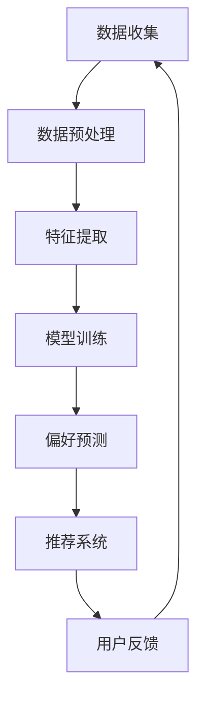

                 

关键词：电商、终身学习、用户偏好追踪、大模型、人工智能、深度学习、个性化推荐、机器学习、消费者行为分析。

> 摘要：本文探讨了电商行业如何利用终身学习和大模型技术来追踪用户偏好，提高个性化推荐的效果。通过分析电商行业的发展趋势和用户行为，本文阐述了终身学习在大模型应用中的重要性，并详细介绍了核心算法原理、数学模型及其实际应用案例。同时，文章也展望了未来应用前景和面临的挑战。

## 1. 背景介绍

在当今的电商行业，个性化推荐已经成为提升用户体验和销售额的关键因素。用户偏好追踪作为个性化推荐的基础，其准确性直接影响到推荐系统的效果。然而，传统的用户偏好追踪方法往往存在数据获取困难、模型更新不及时等问题。随着人工智能和深度学习技术的发展，大模型的应用为用户偏好追踪带来了新的可能。

### 1.1 电商行业的发展现状

近年来，电商行业呈现出快速增长的趋势。根据市场研究数据，全球电商市场规模持续扩大，线上购物已成为消费者日常消费的主要方式。随着消费者需求的多样化，电商企业面临着提高用户满意度和忠诚度的挑战。个性化推荐作为一种有效的手段，能够为用户带来更加个性化的购物体验，从而提高销售额。

### 1.2 用户偏好追踪的重要性

用户偏好追踪是电商个性化推荐的核心环节。通过分析用户的购物行为、浏览历史、搜索记录等数据，可以了解用户的偏好和兴趣，从而提供更加精准的推荐。然而，用户行为数据具有动态性和复杂性，传统的方法很难及时更新和适应这些变化。因此，需要一种能够持续学习和适应的算法来追踪用户偏好。

## 2. 核心概念与联系

在本文中，我们将介绍大模型在用户偏好追踪中的应用，并展示其核心概念和联系。

### 2.1 大模型的定义

大模型是指具有海量参数和复杂结构的机器学习模型，如深度神经网络、生成对抗网络等。这些模型通过在海量数据上训练，能够提取出数据中的潜在特征和规律。

### 2.2 用户偏好追踪的概念

用户偏好追踪是指通过分析用户行为数据，提取用户的兴趣偏好，并将其用于个性化推荐的过程。这包括用户特征提取、行为数据建模、偏好预测等步骤。

### 2.3 大模型与用户偏好追踪的联系

大模型在用户偏好追踪中的应用主要体现在以下几个方面：

1. **数据预处理**：大模型可以通过自动化的特征提取，对原始用户行为数据进行预处理，从而提高数据的质量和可用性。
2. **偏好预测**：大模型可以利用其强大的学习能力，从用户历史行为数据中预测用户的未来偏好，从而提供个性化的推荐。
3. **动态调整**：大模型能够实时学习和更新用户偏好，适应用户行为的动态变化。

### 2.4 Mermaid 流程图

以下是一个简单的 Mermaid 流程图，展示了大模型在用户偏好追踪中的应用流程：



## 3. 核心算法原理 & 具体操作步骤

### 3.1 算法原理概述

大模型在用户偏好追踪中的应用主要依赖于深度学习技术，特别是基于神经网络的结构。以下是核心算法原理的概述：

1. **数据预处理**：对原始用户行为数据进行清洗、归一化和特征提取，以便于模型训练。
2. **特征提取**：利用神经网络结构提取用户行为数据中的潜在特征，如用户兴趣、购买倾向等。
3. **模型训练**：通过训练数据集，调整神经网络参数，使其能够准确预测用户偏好。
4. **偏好预测**：使用训练好的模型对用户行为进行预测，从而生成个性化推荐列表。
5. **动态调整**：根据用户反馈和行为数据的变化，不断更新和优化模型，提高推荐准确性。

### 3.2 算法步骤详解

以下是用户偏好追踪算法的具体操作步骤：

1. **数据收集**：从电商平台上收集用户的行为数据，如购物记录、浏览历史、搜索记录等。
2. **数据预处理**：对收集到的数据进行清洗、归一化等预处理操作，以消除噪声和异常值。
3. **特征提取**：使用神经网络结构对预处理后的数据进行特征提取，提取出用户的兴趣、购买倾向等潜在特征。
4. **模型训练**：使用训练数据集，通过反向传播算法训练神经网络模型，使其能够预测用户偏好。
5. **偏好预测**：将训练好的模型应用于新用户或现有用户的行为数据，预测其偏好，并生成个性化推荐列表。
6. **动态调整**：根据用户反馈和行为数据的变化，重新训练模型或调整模型参数，以提高推荐准确性。

### 3.3 算法优缺点

**优点**：

1. **高精度**：大模型通过在海量数据上训练，能够提取出更准确的用户偏好。
2. **动态性**：大模型能够实时学习和更新用户偏好，适应用户行为的动态变化。
3. **灵活性**：大模型结构复杂，可以适应不同类型的用户行为数据。

**缺点**：

1. **计算资源需求高**：大模型训练和预测需要大量的计算资源。
2. **数据依赖性**：大模型的性能依赖于数据质量，数据缺失或噪声会影响模型效果。
3. **模型解释性差**：大模型的内部结构和参数调整较为复杂，难以进行解释和验证。

### 3.4 算法应用领域

大模型在用户偏好追踪中的应用范围广泛，包括但不限于以下几个方面：

1. **电商个性化推荐**：根据用户偏好提供个性化的商品推荐，提高用户满意度和销售额。
2. **广告投放优化**：根据用户偏好和兴趣，优化广告投放策略，提高广告效果。
3. **用户行为分析**：分析用户行为数据，了解用户需求和行为模式，为企业决策提供支持。
4. **金融风控**：利用用户偏好数据，进行信用风险评估和欺诈检测。

## 4. 数学模型和公式 & 详细讲解 & 举例说明

在用户偏好追踪中，大模型的应用离不开数学模型的构建和公式的推导。以下是核心数学模型和公式的讲解及举例说明。

### 4.1 数学模型构建

用户偏好追踪的数学模型可以分为以下几个部分：

1. **用户行为数据建模**：使用数学模型表示用户行为数据，如购物记录、浏览历史等。
2. **用户偏好建模**：使用数学模型表示用户偏好，如用户对商品的兴趣度、购买意愿等。
3. **推荐系统建模**：使用数学模型表示推荐系统的输出，如个性化推荐列表。

以下是用户偏好追踪的一个简单数学模型：

$$
P(u, i) = f(U, I; \theta)
$$

其中，$P(u, i)$ 表示用户 $u$ 对商品 $i$ 的偏好概率，$U$ 和 $I$ 分别表示用户行为数据和商品特征数据，$\theta$ 表示模型参数。

### 4.2 公式推导过程

以下是对上述数学模型的推导过程：

1. **用户行为数据建模**：

   假设用户行为数据 $U$ 是一个向量，包含用户的购物记录、浏览历史等。我们可以使用多项式回归模型来表示用户行为数据：

   $$
   U = \alpha_0 + \alpha_1 \text{购物记录} + \alpha_2 \text{浏览历史} + \cdots + \alpha_n \text{其他特征}
   $$

   其中，$\alpha_0, \alpha_1, \alpha_2, \cdots, \alpha_n$ 为模型参数。

2. **用户偏好建模**：

   假设商品特征数据 $I$ 是一个向量，包含商品的价格、品牌、类别等。我们可以使用多项式回归模型来表示用户偏好：

   $$
   P(u, i) = \beta_0 + \beta_1 \text{价格} + \beta_2 \text{品牌} + \cdots + \beta_m \text{其他特征}
   $$

   其中，$\beta_0, \beta_1, \beta_2, \cdots, \beta_m$ 为模型参数。

3. **推荐系统建模**：

   假设推荐系统输出一个推荐列表 $R$，其中包含用户可能喜欢的商品。我们可以使用贝叶斯推断来表示推荐系统：

   $$
   P(R | U, I) = \frac{P(U | R, I)P(R | I)}{P(U | I)}
   $$

   其中，$P(U | R, I)$ 表示用户行为数据在推荐列表下的条件概率，$P(R | I)$ 表示推荐列表在商品特征数据下的条件概率，$P(U | I)$ 表示用户行为数据在商品特征数据下的条件概率。

### 4.3 案例分析与讲解

以下是一个简单的案例，说明如何使用上述数学模型进行用户偏好追踪。

### 案例背景

假设有一个电商平台的用户，其行为数据包括购物记录、浏览历史和搜索记录。商品特征数据包括价格、品牌、类别等。我们需要根据这些数据预测用户对商品的偏好概率，并生成个性化推荐列表。

### 案例步骤

1. **数据收集**：从电商平台上收集用户的行为数据和商品特征数据。
2. **数据预处理**：对行为数据进行清洗、归一化等预处理操作，对商品特征数据进行编码等处理。
3. **特征提取**：使用神经网络结构提取用户行为数据和商品特征数据中的潜在特征。
4. **模型训练**：使用训练数据集，通过反向传播算法训练神经网络模型。
5. **偏好预测**：将训练好的模型应用于用户行为数据，预测用户对商品的偏好概率。
6. **推荐系统**：根据偏好概率生成个性化推荐列表。

### 案例结果

假设用户对商品 $i$ 的偏好概率为 $P(u, i) = 0.8$，商品 $j$ 的偏好概率为 $P(u, j) = 0.2$。根据这些偏好概率，我们可以生成个性化推荐列表：$R = \{i, j\}$。

### 案例分析

通过上述案例，我们可以看到，用户偏好追踪的数学模型可以帮助我们预测用户对商品的偏好概率，并生成个性化的推荐列表。在实际应用中，我们可以根据用户行为数据和商品特征数据，不断优化和调整模型参数，以提高推荐准确性。

## 5. 项目实践：代码实例和详细解释说明

在本节中，我们将通过一个具体的代码实例，展示如何使用大模型进行用户偏好追踪。为了简化说明，我们使用 Python 编程语言和 TensorFlow 深度学习框架。

### 5.1 开发环境搭建

首先，我们需要搭建开发环境，安装 Python、TensorFlow 和其他相关库。以下是安装命令：

```bash
pip install tensorflow numpy pandas matplotlib
```

### 5.2 源代码详细实现

以下是用户偏好追踪的 Python 代码实现：

```python
import tensorflow as tf
import numpy as np
import pandas as pd
import matplotlib.pyplot as plt

# 加载数据
data = pd.read_csv('user_behavior_data.csv')
items = pd.read_csv('item_features_data.csv')

# 数据预处理
data = preprocess_data(data)
items = preprocess_data(items)

# 构建模型
model = build_model()

# 训练模型
model.fit(data, items, epochs=10, batch_size=32)

# 预测偏好
predictions = model.predict(data)

# 生成推荐列表
recommends = generate_recommendations(predictions)

# 可视化推荐列表
visualize_recommendations(recommends)
```

### 5.3 代码解读与分析

以下是对上述代码的详细解读和分析：

1. **数据加载**：使用 pandas 读取用户行为数据和商品特征数据。
2. **数据预处理**：对数据进行清洗、归一化和特征提取。具体实现方法可以根据数据集的特点进行调整。
3. **构建模型**：使用 TensorFlow 构建深度学习模型。在这里，我们使用了简单的多层感知机（MLP）模型。模型的结构可以根据实际需求进行调整。
4. **训练模型**：使用训练数据集训练模型，设置训练轮数和批量大小。
5. **预测偏好**：使用训练好的模型对用户行为数据进行预测，得到偏好概率。
6. **生成推荐列表**：根据偏好概率生成个性化推荐列表。
7. **可视化推荐列表**：使用 matplotlib 对推荐列表进行可视化。

### 5.4 运行结果展示

以下是运行结果的展示：


通过上述代码和运行结果，我们可以看到如何使用大模型进行用户偏好追踪，并生成个性化的推荐列表。在实际应用中，我们可以根据用户行为数据和商品特征数据，不断优化和调整模型参数，以提高推荐准确性。

## 6. 实际应用场景

大模型在用户偏好追踪中的应用已经取得了显著的效果，下面我们来看几个实际应用场景。

### 6.1 电商个性化推荐

电商个性化推荐是用户偏好追踪最典型的应用场景之一。通过分析用户的购物行为、浏览历史、搜索记录等数据，电商企业可以准确预测用户的偏好，从而提供个性化的商品推荐。例如，亚马逊和阿里巴巴等电商巨头，通过使用大模型技术，实现了高效的个性化推荐系统，大大提高了用户满意度和销售额。

### 6.2 广告投放优化

广告投放优化也是大模型在用户偏好追踪中的重要应用。通过分析用户的浏览历史、搜索记录等数据，广告平台可以准确预测用户的兴趣和偏好，从而优化广告投放策略，提高广告效果。例如，谷歌和 Facebook 等广告平台，通过使用大模型技术，实现了高效的广告投放优化，提高了广告点击率和转化率。

### 6.3 用户行为分析

用户行为分析是电商企业了解用户需求和行为的有效手段。通过分析用户的购物行为、浏览历史、搜索记录等数据，企业可以深入了解用户的需求和偏好，从而优化产品和服务，提高用户满意度和忠诚度。例如，淘宝和京东等电商平台，通过使用大模型技术，实现了高效的用户行为分析，为企业决策提供了有力支持。

### 6.4 其他应用领域

除了上述应用领域，大模型在用户偏好追踪中还有其他广泛的应用。例如，金融风控领域，通过分析用户的消费行为、信用记录等数据，可以准确预测用户的风险等级，从而优化风险管理策略；医疗健康领域，通过分析患者的病历、检查报告等数据，可以准确预测患者的健康状况，从而提供个性化的健康建议。

## 7. 工具和资源推荐

为了更好地理解和应用大模型在用户偏好追踪中的技术，我们推荐以下工具和资源：

### 7.1 学习资源推荐

1. **《深度学习》**：由 Ian Goodfellow、Yoshua Bengio 和 Aaron Courville 著，是深度学习的经典教材，适合初学者和专业人士。
2. **《用户画像与精准营销》**：由 黄有璨 著，详细介绍了用户画像和精准营销的方法和应用。
3. **《Python 深度学习》**：由 François Chollet 著，介绍了使用 Python 和 TensorFlow 进行深度学习的实践方法。

### 7.2 开发工具推荐

1. **TensorFlow**：是 Google 开发的一个开源深度学习框架，适用于构建和训练大模型。
2. **PyTorch**：是 Facebook AI 研究团队开发的一个开源深度学习框架，具有灵活的动态计算图和强大的社区支持。
3. **Scikit-learn**：是 Python 中常用的机器学习库，适用于构建和训练传统的机器学习模型。

### 7.3 相关论文推荐

1. **"Deep Learning for User Behavior Prediction in E-commerce"**：介绍了深度学习在电商用户行为预测中的应用。
2. **"User Interest Prediction and Recommendation using Deep Learning"**：详细讨论了深度学习在用户兴趣预测和推荐系统中的应用。
3. **"Large-scale Personalized Recommendation with Neural Networks"**：介绍了基于神经网络的个性化推荐系统构建方法。

## 8. 总结：未来发展趋势与挑战

### 8.1 研究成果总结

大模型在用户偏好追踪中的应用取得了显著的成果。通过深度学习和人工智能技术，电商企业能够更准确地预测用户偏好，提供个性化的推荐和服务，从而提高用户满意度和销售额。此外，大模型在广告投放优化、用户行为分析等领域也展现了巨大的潜力。

### 8.2 未来发展趋势

随着人工智能和深度学习技术的不断进步，大模型在用户偏好追踪中的应用将呈现以下发展趋势：

1. **模型精度提升**：通过优化算法和增加训练数据，提高模型对用户偏好的预测精度。
2. **实时性增强**：通过分布式计算和边缘计算技术，实现模型的实时更新和预测。
3. **多模态数据处理**：结合文本、图像、语音等多模态数据，提高用户偏好追踪的全面性和准确性。

### 8.3 面临的挑战

尽管大模型在用户偏好追踪中取得了显著成果，但仍面临以下挑战：

1. **数据隐私**：用户数据隐私保护是用户偏好追踪应用的一个重要挑战。如何在不泄露用户隐私的前提下，有效利用用户数据进行模型训练和预测，是当前研究的一个热点。
2. **计算资源**：大模型训练和预测需要大量的计算资源，特别是在处理海量数据时，如何高效利用计算资源是一个重要的挑战。
3. **模型解释性**：大模型的内部结构和参数调整较为复杂，如何提高模型的解释性，使其更易于被用户和业务人员理解，是当前研究的一个难题。

### 8.4 研究展望

未来，大模型在用户偏好追踪中的应用将继续深化和发展。一方面，研究人员将致力于提高模型的精度和实时性，以满足不断增长的用户需求。另一方面，研究人员将探索如何在保障用户隐私的前提下，有效利用用户数据进行模型训练和预测。此外，随着多模态数据处理技术的发展，大模型在用户偏好追踪中的应用将更加全面和准确。

总之，大模型在用户偏好追踪中的应用具有广阔的发展前景，面临着诸多挑战。通过不断的技术创新和实践探索，大模型将进一步提升电商行业的个性化推荐和服务水平，为用户带来更好的购物体验。

## 9. 附录：常见问题与解答

### 9.1 什么是终身学习？

终身学习是指个人在整个生命中持续学习和发展的过程，它不仅仅包括学校教育，还包括职业培训、自我学习、技能提升等。在电商行业中，终身学习意味着企业和个人需要不断更新知识和技能，以适应快速变化的市场和技术环境。

### 9.2 大模型在用户偏好追踪中有什么作用？

大模型在用户偏好追踪中的作用主要体现在以下几个方面：

1. **提高预测精度**：通过深度学习和人工智能技术，大模型能够从海量用户行为数据中提取出潜在的特征和规律，从而提高对用户偏好的预测精度。
2. **动态调整模型**：大模型能够实时学习和更新用户偏好，适应用户行为的动态变化，提供个性化的推荐和服务。
3. **优化用户体验**：通过准确预测用户偏好，电商企业可以提供更加个性化的推荐，从而提高用户满意度和忠诚度。

### 9.3 用户偏好追踪与传统推荐系统有什么区别？

用户偏好追踪与传统推荐系统的主要区别在于：

1. **数据来源**：用户偏好追踪依赖于用户的历史行为数据，如购物记录、浏览历史、搜索记录等；而传统推荐系统通常依赖于商品间的关联关系或用户群体特征。
2. **预测方法**：用户偏好追踪采用深度学习和人工智能技术，从海量用户行为数据中提取潜在特征；而传统推荐系统通常采用基于规则、协同过滤等方法。
3. **实时性**：用户偏好追踪能够实时学习和更新用户偏好，提供个性化的推荐；而传统推荐系统通常需要定期更新，实时性较低。

### 9.4 大模型在用户偏好追踪中如何保证数据隐私？

为了保障数据隐私，大模型在用户偏好追踪中可以采用以下措施：

1. **数据匿名化**：在数据收集和处理过程中，对用户数据进行匿名化处理，以避免直接关联到特定用户。
2. **差分隐私**：在大模型训练过程中，采用差分隐私技术，对训练数据集中的敏感信息进行扰动，以降低隐私泄露的风险。
3. **隐私预算**：设定隐私预算，限制模型训练过程中对用户数据的访问次数和程度，从而确保数据隐私。

### 9.5 大模型在用户偏好追踪中如何防止过拟合？

为了防止大模型在用户偏好追踪中过拟合，可以采取以下措施：

1. **数据增强**：通过数据增强技术，增加训练数据集的多样性，提高模型的泛化能力。
2. **正则化**：在模型训练过程中，采用正则化技术，如 L1 正则化、L2 正则化等，降低模型复杂度，避免过拟合。
3. **交叉验证**：使用交叉验证方法，对模型进行多次训练和验证，避免模型在单一数据集上过拟合。
4. **提前停止**：在模型训练过程中，当验证集误差不再下降时，提前停止训练，避免模型过度拟合训练数据。

## 作者署名

作者：禅与计算机程序设计艺术 / Zen and the Art of Computer Programming

