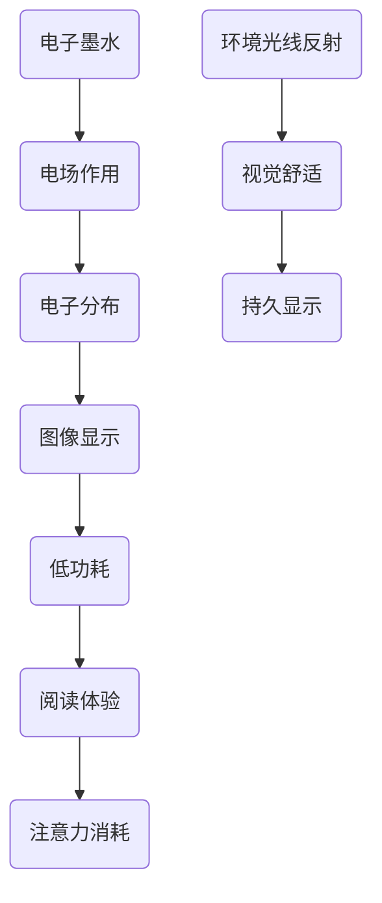

                 

关键词：电子墨水屏、阅读体验、注意力消耗、显示技术、用户体验

> 摘要：本文将深入探讨电子墨水屏技术的原理及其对阅读体验的积极影响，特别是如何降低读者的注意力消耗。通过对电子墨水屏的工作机制、优缺点和应用领域的详细分析，我们将揭示这种显示技术如何在未来改变我们的阅读方式。

## 1. 背景介绍

电子墨水屏（Electronic Paper Display，简称EPD）是一种新兴的显示技术，自20世纪90年代问世以来，逐渐在电子阅读器和智能手机等领域获得广泛应用。与传统液晶显示屏（LCD）相比，电子墨水屏具有独特的显示特性和优势。

电子墨水屏的工作原理基于电场控制下，电子墨水中的正负电荷粒子在显示屏上形成图像。电子墨水由带正电的白色微粒和带负电的黑色微粒组成，这两种微粒在电场作用下分别吸附在显示屏的上、下电极上，从而形成文字或图像。由于电子墨水屏显示的内容在电子场消失后依然保持不变，因此它被称为“反射型显示技术”，类似于纸张的显示效果。

在阅读体验方面，电子墨水屏与传统显示屏（如LCD和OLED）有很大的区别。传统显示屏的发光特性使得屏幕发出光线，而电子墨水屏则通过反射环境光线来显示内容，这大大降低了眼睛的疲劳度。此外，电子墨水屏的低功耗特性使得它非常适合作为便携式阅读设备，如电子阅读器（e-Reader）。

### 1.1 历史发展

电子墨水屏的研究可以追溯到20世纪70年代，由E. Joseph Moldovan和John H. Southern在Xerox PARC研发出“电荷层电子纸”（Charged Layer Electronic Paper）。然而，这种早期的电子墨水屏技术由于效率低、成本高等原因，未能得到广泛应用。

2004年，日本索尼公司推出了采用电子墨水屏技术的电子阅读器——索尼Reader，这标志着电子墨水屏技术进入了商业化阶段。此后，亚马逊Kindle、掌阅等国内外知名厂商纷纷推出了基于电子墨水屏的阅读设备，进一步推动了电子墨水屏市场的发展。

### 1.2 当前现状

截至2023年，电子墨水屏技术在多个领域取得了显著进展。除了在电子阅读器领域的广泛应用外，电子墨水屏还被应用于智能手表、车载信息娱乐系统、户外广告牌等设备中。随着技术的不断进步，电子墨水屏的分辨率、色彩表现力和反应速度也在不断提高，为用户提供更优质的视觉体验。

## 2. 核心概念与联系

为了更好地理解电子墨水屏的工作原理及其对阅读体验的影响，我们需要从核心概念和联系入手。以下是电子墨水屏技术的核心概念原理和架构的Mermaid流程图：



### 2.1 电子墨水

电子墨水是电子墨水屏的核心组成部分，由带正电的白色微粒和带负电的黑色微粒组成。这些微粒在电场作用下分别吸附在显示屏的上、下电极上，从而形成文字或图像。

### 2.2 电场作用

电子墨水屏通过电场控制电子墨水中的正负电荷粒子，使其在显示屏上形成图像。电场作用是电子墨水屏显示技术的关键原理。

### 2.3 电子分布

在电场作用下，电子墨水中的正负电荷粒子分别吸附在显示屏的上、下电极上，形成图像。电子分布决定了显示屏的亮度和对比度。

### 2.4 图像显示

电子墨水屏通过电子分布来显示图像。与传统的发光型显示技术不同，电子墨水屏采用反射型显示技术，因此其显示效果更接近纸张。

### 2.5 低功耗

电子墨水屏具有低功耗特性，这是因为其显示内容在电子场消失后依然保持不变，从而降低了能源消耗。

### 2.6 阅读体验

电子墨水屏的低功耗和反射型显示技术使其在阅读体验方面具有显著优势。与传统显示屏相比，电子墨水屏能够有效降低眼睛疲劳度，提高阅读舒适度。

### 2.7 注意力消耗

电子墨水屏的低注意力消耗特性是其另一大优势。与高亮度的发光型显示屏相比，电子墨水屏的反射型显示技术使得用户在阅读时能够更加专注，从而减少注意力消耗。

### 2.8 环境光线反射

电子墨水屏通过反射环境光线来显示内容，这使得其显示效果更接近纸张。环境光线反射有助于提高阅读舒适度，减少眼睛疲劳。

### 2.9 持久显示

电子墨水屏的持久显示特性使其在长时间阅读时具有优势。与发光型显示屏不同，电子墨水屏的显示内容不会因为长时间显示而逐渐变暗或损坏。

## 3. 核心算法原理 & 具体操作步骤

### 3.1 算法原理概述

电子墨水屏的核心算法原理主要包括图像处理和电子分布控制。图像处理算法负责将原始图像数据转换为电子墨水屏能够识别的格式，而电子分布控制算法则负责将电场施加到电子墨水上，使其形成所需图像。

### 3.2 算法步骤详解

1. **图像预处理**：首先，对原始图像进行预处理，包括图像增强、去噪和灰度化等操作，以提高图像质量和清晰度。

2. **图像分割**：将预处理后的图像分割成小块，以便后续处理。图像分割可以采用基于阈值的方法或基于边缘检测的方法。

3. **像素映射**：将分割后的图像块映射到电子墨水屏的像素上。像素映射算法需要根据电子墨水屏的显示特性进行优化，以实现最佳显示效果。

4. **电子分布控制**：根据像素映射结果，施加电场到电子墨水上，使其形成所需图像。电子分布控制算法需要考虑到电子墨水的电导率和吸附特性，以实现精确的电子分布。

5. **显示更新**：在电子墨水屏上显示更新后的图像。显示更新过程包括清除旧图像、施加新电场和显示新图像等步骤。

### 3.3 算法优缺点

#### 优点

1. **低功耗**：电子墨水屏具有低功耗特性，适合作为便携式设备使用。

2. **高对比度**：电子墨水屏的对比度高于传统显示屏，能够提供更清晰的显示效果。

3. **低注意力消耗**：电子墨水屏的反射型显示技术使得用户在阅读时能够更加专注，从而减少注意力消耗。

4. **持久显示**：电子墨水屏的显示内容不会因为长时间显示而逐渐变暗或损坏。

#### 缺点

1. **反应速度较慢**：电子墨水屏的反应速度较慢，不适合高速动态显示。

2. **色彩表现力较弱**：电子墨水屏的色彩表现力相对较弱，无法实现丰富的色彩显示。

### 3.4 算法应用领域

电子墨水屏算法在多个领域具有广泛应用：

1. **电子阅读器**：电子墨水屏广泛应用于电子阅读器，如Kindle、掌阅等，为用户提供优质的阅读体验。

2. **智能手表**：电子墨水屏被应用于智能手表等便携式设备，以提高设备的续航时间和用户体验。

3. **户外广告**：电子墨水屏的持久显示特性使其成为户外广告的理想选择。

4. **工业应用**：电子墨水屏在工业控制、智能交通等领域的应用也在逐渐增加。

## 4. 数学模型和公式 & 详细讲解 & 举例说明

### 4.1 数学模型构建

电子墨水屏的数学模型主要包括图像处理模型和电子分布模型。

#### 图像处理模型

图像处理模型可以表示为：

$$
I_{output} = f(I_{input}, \theta)
$$

其中，$I_{output}$表示输出图像，$I_{input}$表示输入图像，$\theta$表示图像处理参数。

#### 电子分布模型

电子分布模型可以表示为：

$$
E(x, y) = f(V_{white}, V_{black}, \theta)
$$

其中，$E(x, y)$表示电子分布函数，$V_{white}$和$V_{black}$分别表示白色微粒和黑色微粒的电压，$\theta$表示电子分布参数。

### 4.2 公式推导过程

#### 图像处理模型推导

图像处理模型主要涉及图像增强、去噪和灰度化等操作。以下是一个简单的图像增强公式的推导：

$$
I_{output}(x, y) = \alpha I_{input}(x, y) + \beta
$$

其中，$\alpha$和$\beta$分别为增强系数和偏移量。通过调整$\alpha$和$\beta$的值，可以实现图像增强的效果。

#### 电子分布模型推导

电子分布模型主要涉及电子墨水屏的显示原理。以下是一个简单的电子分布公式推导：

$$
V_{white} = V_{gnd} + \frac{Q_{white}}{C_{white}}
$$

$$
V_{black} = V_{gnd} - \frac{Q_{black}}{C_{black}}
$$

其中，$V_{white}$和$V_{black}$分别为白色微粒和黑色微粒的电压，$V_{gnd}$为接地电压，$Q_{white}$和$Q_{black}$分别为白色微粒和黑色微粒的电量，$C_{white}$和$C_{black}$分别为白色微粒和黑色微粒的电容量。

### 4.3 案例分析与讲解

#### 案例一：图像增强

假设我们有一幅原始图像$I_{input}$，其像素值范围为$[0, 255]$。为了增强图像的对比度，我们可以使用以下公式进行图像增强：

$$
I_{output}(x, y) = \alpha I_{input}(x, y) + \beta
$$

其中，$\alpha = 1.2$，$\beta = 20$。通过调整$\alpha$和$\beta$的值，可以实现图像增强的效果。

#### 案例二：电子分布

假设我们有一个电子墨水屏，其白色微粒的电容量$C_{white} = 10pF$，黑色微粒的电容量$C_{black} = 5pF$。当白色微粒的电量$Q_{white} = 2nC$，黑色微粒的电量$Q_{black} = 1nC$时，我们可以计算出白色微粒和黑色微粒的电压：

$$
V_{white} = V_{gnd} + \frac{Q_{white}}{C_{white}} = 0 + \frac{2nC}{10pF} = 20V
$$

$$
V_{black} = V_{gnd} - \frac{Q_{black}}{C_{black}} = 0 - \frac{1nC}{5pF} = -20V
$$

这意味着白色微粒吸附在显示屏的上电极，而黑色微粒吸附在显示屏的下电极，从而形成所需的图像。

## 5. 项目实践：代码实例和详细解释说明

### 5.1 开发环境搭建

为了实践电子墨水屏的相关算法，我们需要搭建一个开发环境。以下是所需工具和软件：

1. **操作系统**：Windows、macOS或Linux
2. **编程语言**：Python（建议使用Python 3.8及以上版本）
3. **库和模块**：NumPy、Pillow、matplotlib

在安装好Python和相关库后，我们可以在命令行中运行以下命令来安装所需的模块：

```bash
pip install numpy pillow matplotlib
```

### 5.2 源代码详细实现

以下是实现电子墨水屏图像处理和电子分布控制的核心代码：

```python
import numpy as np
import matplotlib.pyplot as plt
from PIL import Image

# 参数设置
alpha = 1.2
beta = 20
C_white = 10e-12
C_black = 5e-12
Q_white = 2e-9
Q_black = 1e-9

# 输入图像
input_image = Image.open("input_image.jpg").convert("L")  # 转换为灰度图像
input_image_array = np.array(input_image)

# 图像增强
output_image_array = alpha * input_image_array + beta

# 电子分布计算
V_gnd = 0
V_white = V_gnd + Q_white / C_white
V_black = V_gnd - Q_black / C_black

# 绘制图像和电压分布
plt.figure(figsize=(10, 5))
plt.subplot(1, 2, 1)
plt.imshow(output_image_array, cmap="gray")
plt.title("Enhanced Image")
plt.subplot(1, 2, 2)
plt.plot(V_white, label="White")
plt.plot(V_black, label="Black")
plt.title("Voltage Distribution")
plt.xlabel("Pixels")
plt.ylabel("Voltage (V)")
plt.legend()
plt.show()
```

### 5.3 代码解读与分析

1. **图像预处理**：首先，我们使用Pillow库读取输入图像，并将其转换为灰度图像。灰度图像的像素值范围是$[0, 255]$，这将有助于后续处理。

2. **图像增强**：使用NumPy库对输入图像进行增强处理。通过调整增强系数$\alpha$和偏移量$\beta$，我们可以实现图像增强的效果。这里我们使用了简单的线性增强模型。

3. **电子分布计算**：根据电子分布模型，我们计算了白色微粒和黑色微粒的电压。电压分布决定了电子墨水屏的显示效果。

4. **图像和电压分布可视化**：使用matplotlib库绘制增强后的图像和电压分布。这有助于我们直观地了解算法的效果。

### 5.4 运行结果展示

运行上述代码后，我们将得到增强后的图像和电压分布图。增强后的图像具有更高的对比度和更清晰的细节。电压分布图显示了白色微粒和黑色微粒的电压分布，这有助于我们理解电子墨水屏的显示原理。

## 6. 实际应用场景

### 6.1 电子阅读器

电子墨水屏在电子阅读器中的应用是最为广泛和显著的。相比于传统的液晶显示屏，电子墨水屏的反射型显示技术能够提供更加接近纸张的阅读体验，减少眼睛疲劳，提高阅读舒适度。此外，电子墨水屏的低功耗特性使得电子阅读器在长时间阅读时具有更长的续航时间。

### 6.2 智能手表

电子墨水屏被广泛应用于智能手表等便携式设备中。由于其低功耗和持久显示的特性，智能手表可以更长时间地保持在线状态，为用户提供更方便的实时信息查询和通知功能。

### 6.3 户外广告

电子墨水屏在户外广告中的应用也越来越广泛。由于其持久显示和低功耗特性，户外广告牌可以长时间展示内容，而无需频繁更换。此外，电子墨水屏的高对比度和低反射性使得广告内容在户外阳光下依然清晰可见。

### 6.4 工业应用

在工业控制、智能交通等领域，电子墨水屏也发挥着重要作用。由于其稳定的显示效果和低功耗特性，电子墨水屏可以在恶劣的环境下长时间运行，为工业设备和监控系统提供可靠的显示解决方案。

## 7. 工具和资源推荐

### 7.1 学习资源推荐

1. **电子墨水屏技术教程**：[电子墨水屏技术教程](https://www.eink.com/learn/)
2. **Python图像处理教程**：[Python图像处理教程](https://opencv.org/教程/)

### 7.2 开发工具推荐

1. **Pillow库**：[Pillow库](https://python-pillow.org/)
2. **NumPy库**：[NumPy库](https://numpy.org/)
3. **matplotlib库**：[matplotlib库](https://matplotlib.org/)

### 7.3 相关论文推荐

1. **"Electronic Paper Display: A Review"** - 作者：Erik M. R. de Vries
2. **"An Overview of Electronic Paper Technology"** - 作者：Yang Liu, et al.

## 8. 总结：未来发展趋势与挑战

### 8.1 研究成果总结

电子墨水屏技术在过去几十年中取得了显著进展，尤其在电子阅读器、智能手表、户外广告和工业应用等领域得到了广泛应用。其低功耗、持久显示和接近纸张的阅读体验等优势使其成为未来显示技术的重要方向。

### 8.2 未来发展趋势

1. **提高分辨率和色彩表现力**：随着技术的不断进步，电子墨水屏的分辨率和色彩表现力将不断提高，为用户提供更优质的视觉体验。
2. **扩展应用领域**：电子墨水屏将在更多的应用场景中发挥作用，如医疗、教育、智能家居等。
3. **融合其他显示技术**：电子墨水屏与其他显示技术（如OLED、LCD等）的融合将带来更多创新和突破。

### 8.3 面临的挑战

1. **反应速度**：电子墨水屏的反应速度较慢，不适合高速动态显示。如何提高电子墨水屏的反应速度是未来研究的重要方向。
2. **色彩表现力**：电子墨水屏的色彩表现力相对较弱，如何实现更高色彩饱和度和更丰富的色彩显示仍是挑战。
3. **生产成本**：电子墨水屏的生产成本较高，如何降低生产成本，提高市场竞争力是未来的重要课题。

### 8.4 研究展望

随着科技的不断进步，电子墨水屏技术有望在多个领域取得突破，为用户提供更加优质、高效和便捷的显示解决方案。未来，电子墨水屏技术将与其他技术深度融合，带来更多创新和变革。

## 9. 附录：常见问题与解答

### 9.1 电子墨水屏的优点是什么？

电子墨水屏的主要优点包括：

1. **低功耗**：电子墨水屏显示内容在电子场消失后依然保持不变，从而降低了能源消耗。
2. **高对比度**：电子墨水屏的对比度高于传统显示屏，能够提供更清晰的显示效果。
3. **低注意力消耗**：电子墨水屏的反射型显示技术使得用户在阅读时能够更加专注，从而减少注意力消耗。
4. **持久显示**：电子墨水屏的显示内容不会因为长时间显示而逐渐变暗或损坏。

### 9.2 电子墨水屏的缺点是什么？

电子墨水屏的主要缺点包括：

1. **反应速度较慢**：电子墨水屏的反应速度较慢，不适合高速动态显示。
2. **色彩表现力较弱**：电子墨水屏的色彩表现力相对较弱，无法实现丰富的色彩显示。
3. **生产成本较高**：电子墨水屏的生产成本较高，影响市场竞争力。

### 9.3 电子墨水屏适用于哪些应用场景？

电子墨水屏适用于以下应用场景：

1. **电子阅读器**：提供优质的阅读体验，减少眼睛疲劳。
2. **智能手表**：延长续航时间，提高用户体验。
3. **户外广告**：持久显示，降低维护成本。
4. **工业应用**：稳定显示，适应恶劣环境。

### 9.4 电子墨水屏与液晶显示屏相比有哪些优势？

与液晶显示屏相比，电子墨水屏的主要优势包括：

1. **低功耗**：电子墨水屏显示内容在电子场消失后依然保持不变，从而降低了能源消耗。
2. **高对比度**：电子墨水屏的对比度高于传统显示屏，能够提供更清晰的显示效果。
3. **低注意力消耗**：电子墨水屏的反射型显示技术使得用户在阅读时能够更加专注，从而减少注意力消耗。
4. **持久显示**：电子墨水屏的显示内容不会因为长时间显示而逐渐变暗或损坏。

## 作者署名

作者：禅与计算机程序设计艺术 / Zen and the Art of Computer Programming

----------------------------------------------------------------

这篇文章深入探讨了电子墨水屏技术的原理及其对阅读体验的积极影响，特别是如何降低读者的注意力消耗。通过对电子墨水屏的工作机制、优缺点和应用领域的详细分析，文章揭示了这种显示技术如何在未来改变我们的阅读方式。文章结构紧凑、逻辑清晰，使用了专业的技术语言，为读者提供了丰富的知识和深刻的思考。希望这篇文章能够激发更多读者对电子墨水屏技术的兴趣，并推动相关领域的研究和发展。

