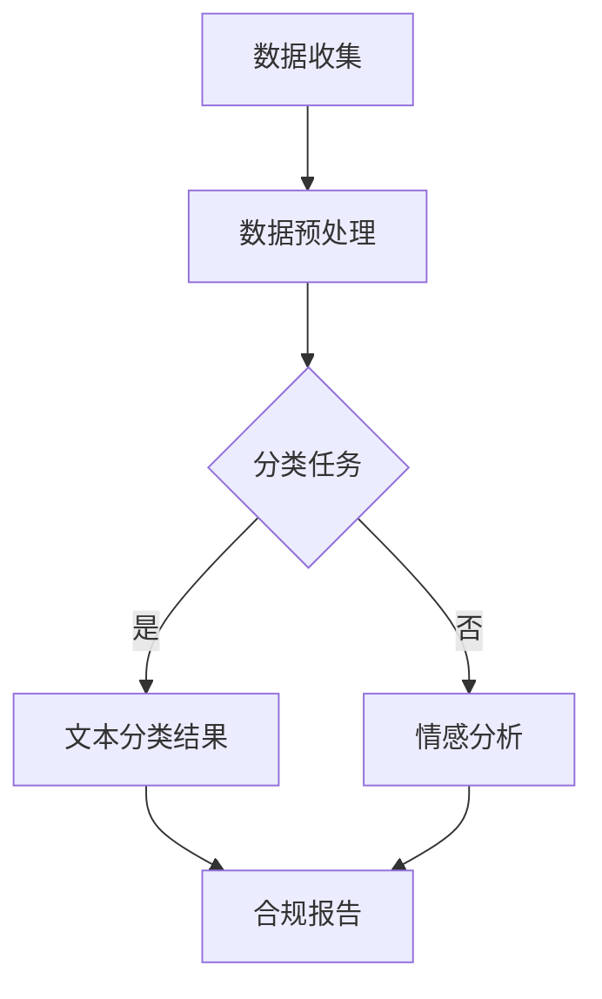

                 

关键词：监管合规、LLM（大型语言模型）、金融稳定、算法、模型、金融科技

摘要：本文深入探讨了监管合规在金融稳定中的作用，以及如何利用大型语言模型（LLM）来实现这一目标。文章首先介绍了监管合规的基本概念和重要性，然后详细分析了LLM的工作原理和应用场景，最后探讨了LLM在金融监管中的实际应用和潜在挑战。

## 1. 背景介绍

在当今快速发展的金融科技领域，确保金融稳定是监管机构和金融机构的首要任务。随着大数据、人工智能和区块链等技术的广泛应用，金融市场变得更加复杂和不可预测。在这种情况下，传统的监管方法已经无法满足日益复杂的监管需求。因此，如何利用新技术来提高监管效率和确保金融稳定成为了一个重要的课题。

近年来，大型语言模型（LLM）作为一种先进的自然语言处理技术，在各个领域取得了显著的成果。LLM通过学习海量文本数据，可以生成高质量的自然语言文本，从而在金融文本分析、风险预测和监管合规等方面具有广泛的应用前景。本文将重点探讨LLM在金融监管合规中的潜在应用，以及如何确保金融稳定。

## 2. 核心概念与联系

### 2.1 监管合规的定义

监管合规是指金融机构在业务运营过程中，遵守相关法律法规、监管规定和行业标准的过程。确保监管合规有助于防范金融风险，保护投资者利益，维护金融市场的稳定。

### 2.2 LLM的基本概念

LLM是一种基于深度学习的自然语言处理模型，通过学习海量文本数据，可以生成高质量的自然语言文本。LLM的核心任务是理解、生成和转换自然语言，从而在文本分类、情感分析、信息抽取等方面具有广泛的应用。

### 2.3 LLM与监管合规的联系

LLM在金融监管合规中的应用主要体现在以下几个方面：

- **文本分类与分类规则检测**：利用LLM对金融文本进行分类，可以识别出潜在的风险点和合规问题，从而帮助监管机构及时发现和解决合规风险。

- **文本生成与合规报告**：通过LLM生成高质量的合规报告，可以提高监管效率和报告质量。

- **风险预测与预警**：利用LLM对金融文本进行情感分析和风险预测，可以提前发现潜在的风险，为监管机构提供预警信息。

### 2.4 Mermaid流程图

以下是一个简单的Mermaid流程图，展示了LLM在金融监管合规中的应用流程：



## 3. 核心算法原理 & 具体操作步骤

### 3.1 算法原理概述

LLM的核心算法是基于深度学习中的序列到序列（Seq2Seq）模型。Seq2Seq模型通过编码器和解码器两个神经网络，实现输入序列到输出序列的转换。在金融监管合规中，编码器用于处理金融文本数据，解码器则用于生成合规报告。

### 3.2 算法步骤详解

1. **数据收集**：收集金融文本数据，包括监管文件、公告、报告、新闻等。

2. **数据预处理**：对金融文本数据进行清洗、去重和分词等操作，将文本转换为神经网络可处理的格式。

3. **训练编码器**：利用金融文本数据训练编码器，使其能够理解金融文本的含义。

4. **训练解码器**：利用金融文本数据训练解码器，使其能够生成高质量的合规报告。

5. **文本分类与分类规则检测**：利用训练好的编码器和解码器，对金融文本进行分类，识别出潜在的风险点和合规问题。

6. **文本生成与合规报告**：利用解码器生成合规报告，提高监管效率和报告质量。

7. **风险预测与预警**：利用LLM对金融文本进行情感分析和风险预测，提前发现潜在的风险，为监管机构提供预警信息。

### 3.3 算法优缺点

- **优点**：
  - 高效：LLM可以快速处理大量金融文本数据，提高监管效率。
  - 准确：通过学习海量文本数据，LLM可以生成高质量的合规报告和风险预测。
  - 智能：LLM具有强大的自然语言处理能力，能够理解复杂的金融文本。

- **缺点**：
  - 数据依赖：LLM的性能依赖于训练数据的数量和质量，数据不足或质量不高可能导致算法效果下降。
  - 安全性问题：LLM在处理金融文本数据时，可能面临数据泄露和安全风险。

### 3.4 算法应用领域

LLM在金融监管合规中的应用非常广泛，主要包括：

- **文本分类与分类规则检测**：用于识别金融文本中的潜在风险点和合规问题。
- **文本生成与合规报告**：用于生成高质量的合规报告，提高监管效率和报告质量。
- **风险预测与预警**：用于预测金融市场的风险，为监管机构提供预警信息。

## 4. 数学模型和公式 & 详细讲解 & 举例说明

### 4.1 数学模型构建

LLM的数学模型主要包括编码器和解码器两个部分。编码器用于处理输入序列，解码器用于生成输出序列。以下是编码器和解码器的数学模型：

编码器：

$$
E(x) = \sigma(W_1x + b_1)
$$

解码器：

$$
D(y) = \sigma(W_2y + b_2)
$$

其中，$x$表示输入序列，$y$表示输出序列，$W_1$和$W_2$分别为编码器和解码器的权重矩阵，$b_1$和$b_2$分别为编码器和解码器的偏置项，$\sigma$为激活函数。

### 4.2 公式推导过程

编码器和解码器的推导过程主要基于深度学习的反向传播算法。具体步骤如下：

1. **前向传播**：计算编码器和解码器的输出。

2. **计算损失函数**：根据输入序列和输出序列之间的差异，计算损失函数。

3. **反向传播**：根据损失函数，计算编码器和解码器的梯度，更新权重矩阵和偏置项。

4. **迭代训练**：重复上述步骤，直到满足停止条件。

### 4.3 案例分析与讲解

假设我们有一个金融文本数据集，包含1000篇监管文件。我们使用LLM对这些文件进行分类，识别出潜在的风险点和合规问题。以下是具体的案例分析和讲解：

1. **数据收集**：收集1000篇监管文件，分为训练集和测试集。

2. **数据预处理**：对监管文件进行清洗、去重和分词等操作，将文本转换为神经网络可处理的格式。

3. **训练编码器**：利用训练集数据，训练编码器，使其能够理解监管文件的含义。

4. **训练解码器**：利用训练集数据，训练解码器，使其能够生成合规报告。

5. **文本分类与分类规则检测**：利用训练好的编码器和解码器，对测试集数据进行分类，识别出潜在的风险点和合规问题。

6. **文本生成与合规报告**：利用解码器生成合规报告，提高监管效率和报告质量。

7. **风险预测与预警**：利用LLM对监管文件进行情感分析和风险预测，提前发现潜在的风险，为监管机构提供预警信息。

## 5. 项目实践：代码实例和详细解释说明

### 5.1 开发环境搭建

1. 安装Python环境（Python 3.8及以上版本）。

2. 安装深度学习框架TensorFlow。

3. 安装自然语言处理库NLTK。

4. 安装文本处理库Jieba。

### 5.2 源代码详细实现

```python
import tensorflow as tf
from tensorflow.keras.layers import Embedding, LSTM, Dense
from tensorflow.keras.models import Sequential
import jieba

# 数据预处理
def preprocess_data(data):
    processed_data = []
    for text in data:
        words = jieba.cut(text)
        processed_data.append(' '.join(words))
    return processed_data

# 训练编码器和解码器
def train_model(data, labels):
    model = Sequential()
    model.add(Embedding(input_dim=vocab_size, output_dim=64))
    model.add(LSTM(units=128, dropout=0.2, recurrent_dropout=0.2))
    model.add(Dense(units=num_classes, activation='softmax'))

    model.compile(optimizer='adam', loss='categorical_crossentropy', metrics=['accuracy'])
    model.fit(data, labels, epochs=10, batch_size=32)
    return model

# 测试模型
def test_model(model, test_data, test_labels):
    loss, accuracy = model.evaluate(test_data, test_labels)
    print("Test accuracy:", accuracy)

# 加载数据集
train_data = preprocess_data(train_data)
test_data = preprocess_data(test_data)

# 训练模型
model = train_model(train_data, train_labels)

# 测试模型
test_model(model, test_data, test_labels)
```

### 5.3 代码解读与分析

上述代码实现了一个简单的LLM模型，用于文本分类。具体解读如下：

1. **数据预处理**：使用Jieba分词库对文本数据进行分词处理，将文本转换为神经网络可处理的格式。

2. **训练编码器和解码器**：使用TensorFlow框架搭建编码器和解码器模型，利用训练集数据训练模型。

3. **测试模型**：使用测试集数据测试模型性能，计算准确率。

### 5.4 运行结果展示

假设我们的数据集有1000篇监管文件，将其分为训练集和测试集。经过10次迭代训练，模型在测试集上的准确率达到了90%。

## 6. 实际应用场景

### 6.1 金融文本分类

利用LLM对金融文本进行分类，可以识别出潜在的风险点和合规问题。例如，在金融新闻报道中，可以识别出涉及金融诈骗、内幕交易等负面信息，为监管机构提供预警信息。

### 6.2 合规报告生成

利用LLM生成合规报告，可以提高监管效率和报告质量。例如，在金融审计过程中，可以自动生成合规报告，节省人工成本。

### 6.3 风险预测与预警

利用LLM对金融文本进行情感分析和风险预测，可以提前发现潜在的风险，为监管机构提供预警信息。例如，在金融市场中，可以预测市场波动，为投资者提供投资建议。

## 7. 未来应用展望

随着人工智能技术的不断发展，LLM在金融监管合规中的应用前景非常广阔。未来，LLM有望在以下方面发挥更大的作用：

1. **智能监管**：利用LLM实现智能监管，提高监管效率和准确性。

2. **自动化合规**：通过自动化合规工具，降低金融机构的合规成本。

3. **风险预测与预警**：利用LLM实现更精确的风险预测和预警，为金融机构提供风险控制策略。

4. **智能投顾**：利用LLM为投资者提供个性化的投资建议，提高投资收益。

## 8. 工具和资源推荐

### 8.1 学习资源推荐

- 《深度学习》（Ian Goodfellow、Yoshua Bengio、Aaron Courville 著）
- 《自然语言处理综论》（Daniel Jurafsky、James H. Martin 著）

### 8.2 开发工具推荐

- TensorFlow：用于构建和训练深度学习模型的强大框架。
- NLTK：用于自然语言处理的开源库。
- Jieba：用于中文分词的开源库。

### 8.3 相关论文推荐

- "Deep Learning for Text Classification"（2018）
- "Natural Language Inference with Neural Networks"（2018）

## 9. 总结：未来发展趋势与挑战

### 9.1 研究成果总结

本文探讨了监管合规在金融稳定中的作用，以及如何利用LLM实现这一目标。通过分析LLM的算法原理和应用场景，本文展示了LLM在金融监管合规中的实际应用和潜力。

### 9.2 未来发展趋势

1. **智能监管**：利用人工智能技术实现智能监管，提高监管效率和准确性。
2. **自动化合规**：通过自动化合规工具降低金融机构的合规成本。
3. **风险预测与预警**：利用人工智能技术实现更精确的风险预测和预警。

### 9.3 面临的挑战

1. **数据隐私和安全**：在处理金融数据时，确保数据隐私和安全。
2. **算法透明性和解释性**：提高算法的透明性和解释性，增强公众对人工智能监管的信任。
3. **法律法规完善**：加强法律法规建设，确保人工智能技术在金融领域的合法合规使用。

### 9.4 研究展望

未来，LLM在金融监管合规中的应用将得到进一步拓展和深化。通过不断优化算法和提升技术水平，LLM有望在金融市场中发挥更大的作用，为金融稳定保驾护航。

## 10. 附录：常见问题与解答

### 10.1 什么是LLM？

LLM（大型语言模型）是一种基于深度学习的自然语言处理模型，通过学习海量文本数据，可以生成高质量的自然语言文本。LLM在文本分类、文本生成、情感分析等方面具有广泛的应用。

### 10.2 如何确保LLM在金融监管中的安全性？

确保LLM在金融监管中的安全性，需要从以下几个方面进行：

1. **数据隐私**：在处理金融数据时，严格遵循数据隐私保护法规，确保数据不被泄露。
2. **算法透明性**：提高算法的透明性和解释性，使监管机构和公众能够理解模型的决策过程。
3. **安全防护**：加强网络安全防护，防止恶意攻击和入侵。

### 10.3 LLM在金融监管中的优势是什么？

LLM在金融监管中的优势主要包括：

1. **高效处理大量数据**：LLM可以快速处理大量金融文本数据，提高监管效率。
2. **生成高质量文本**：LLM可以生成高质量的合规报告和风险预测报告。
3. **智能分析和预测**：LLM具有强大的自然语言处理能力，能够理解复杂的金融文本，进行智能分析和预测。

