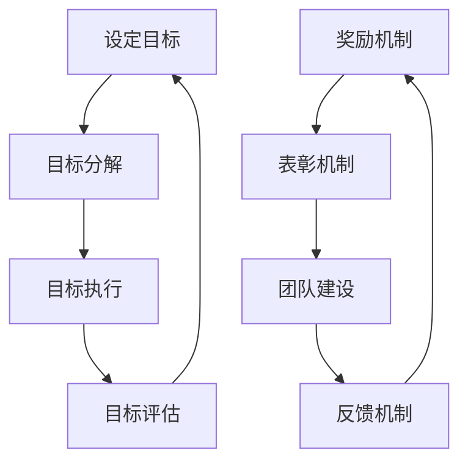

                 

 在现代企业中，目标管理是一种广泛使用的策略，旨在确保组织的各项活动与总体战略保持一致。与此同时，团队激励则成为了推动团队高效完成任务的关键因素。本文将探讨目标管理与团队激励之间的关系，旨在为读者提供一种新的视角，以理解这两个概念如何相互影响，共同促进组织的成功。

## 1. 背景介绍

目标管理（Management by Objectives, MBO）最早由管理学家彼得·德鲁克（Peter Drucker）在20世纪50年代提出。其核心思想是通过明确和可衡量的目标来指导组织成员的工作，从而实现组织目标。目标管理强调参与性管理，即让员工参与制定自己的工作目标，提高员工的工作动力和责任感。

团队激励（Team Incentive）则是通过提供奖励、表彰、晋升等机制，激发团队成员的工作积极性和创造力。团队激励的目的是建立一个积极的工作环境，让团队成员在相互支持和合作中共同实现目标。

## 2. 核心概念与联系

### 2.1 目标管理原理

目标管理的过程通常包括以下几个步骤：

1. **设定目标**：组织或个人根据组织的总体战略和愿景，设定具体、可衡量的目标。
2. **目标分解**：将总目标分解为具体的、可执行的子目标，并分配到各个部门和员工。
3. **目标执行**：员工根据目标开始执行工作，并在执行过程中不断调整和优化。
4. **目标评估**：定期对目标的完成情况进行评估，提供反馈，以帮助员工改进工作。

### 2.2 团队激励原理

团队激励的过程通常包括以下几个方面：

1. **奖励机制**：为达到目标或完成任务提供奖励，如奖金、晋升等。
2. **表彰机制**：对表现突出的团队成员进行公开表彰，提高其荣誉感和成就感。
3. **团队建设**：通过团队活动、培训等方式，增强团队成员之间的合作和信任。
4. **反馈机制**：对团队成员的工作进行及时反馈，帮助其了解自己的表现和改进方向。

### 2.3 Mermaid 流程图



## 3. 核心算法原理 & 具体操作步骤

### 3.1 算法原理概述

目标管理算法的核心在于通过设定和实现目标来提高员工的工作效率和团队的整体绩效。团队激励算法则通过奖励和表彰来激发团队成员的工作动力。

### 3.2 算法步骤详解

#### 3.2.1 目标管理算法

1. **设定目标**：组织根据战略和愿景，设定具体、可衡量的目标。
2. **目标分解**：将总目标分解为子目标，并分配到各个部门和员工。
3. **目标执行**：员工根据目标开始执行工作，并在执行过程中不断调整和优化。
4. **目标评估**：定期对目标的完成情况进行评估，提供反馈。

#### 3.2.2 团队激励算法

1. **设定奖励机制**：根据组织的绩效和员工的表现，设定奖励标准。
2. **表彰机制**：对表现突出的团队成员进行公开表彰。
3. **团队建设**：通过团队活动、培训等方式，增强团队成员之间的合作和信任。
4. **反馈机制**：对团队成员的工作进行及时反馈。

### 3.3 算法优缺点

#### 3.3.1 目标管理算法

**优点**：

- 提高员工的工作动力和责任感。
- 有助于组织目标的实现。
- 促进员工的能力提升。

**缺点**：

- 目标设定的过程可能较为繁琐。
- 需要定期评估和反馈，耗时较长。

#### 3.3.2 团队激励算法

**优点**：

- 激发员工的工作热情和创造力。
- 增强团队合作精神。
- 提高组织的整体绩效。

**缺点**：

- 可能导致员工过于注重短期绩效，忽视长期发展。
- 奖励分配不公可能引起内部矛盾。

### 3.4 算法应用领域

目标管理和团队激励算法广泛应用于企业、政府机构、教育机构等多个领域。例如，在企业中，目标管理算法用于制定销售目标、生产目标等；团队激励算法用于激发员工的工作热情和创造力。

## 4. 数学模型和公式 & 详细讲解 & 举例说明

### 4.1 数学模型构建

目标管理中的数学模型可以用于计算目标完成度，公式如下：

$$
目标完成度 = \frac{实际完成量}{目标设定量}
$$

团队激励中的数学模型可以用于计算奖励金额，公式如下：

$$
奖励金额 = 基础奖金 \times (目标完成度 + 团队贡献度)
$$

### 4.2 公式推导过程

目标完成度的推导过程较为简单，直接通过实际完成量和目标设定量的比值计算得出。

奖励金额的推导过程如下：

1. **目标完成度**：衡量员工个人在目标完成方面的表现，取值范围为 0 到 1。
2. **团队贡献度**：衡量员工在团队整体绩效方面的表现，取值范围为 0 到 1。
3. **基础奖金**：员工的基本奖金，不随目标完成度和团队贡献度变化。
4. **奖励金额**：员工在目标完成度和团队贡献度基础上，乘以基础奖金，得到总奖励金额。

### 4.3 案例分析与讲解

假设某公司的销售部门设定了一个季度销售目标为100万元，实际完成量为120万元。根据目标完成度公式，销售部门的目标完成度为：

$$
目标完成度 = \frac{120}{100} = 1.2
$$

假设该公司规定，基础奖金为10000元，团队贡献度为0.5，则销售部门的奖励金额为：

$$
奖励金额 = 10000 \times (1.2 + 0.5) = 17000元
$$

这个案例说明，通过目标管理和团队激励，可以有效提高员工的工作积极性和团队整体绩效。

## 5. 项目实践：代码实例和详细解释说明

### 5.1 开发环境搭建

在本项目中，我们将使用 Python 语言来实现目标管理和团队激励算法。首先，确保安装了 Python 3.8 或更高版本，然后安装必要的库，如 NumPy 和 Matplotlib。

```bash
pip install numpy matplotlib
```

### 5.2 源代码详细实现

以下是实现目标管理和团队激励算法的 Python 代码：

```python
import numpy as np
import matplotlib.pyplot as plt

# 目标管理函数
def calculate_completion_rate(achievement, target):
    return achievement / target

# 团队激励函数
def calculate_incentive(base_salary, completion_rate, team_contribution):
    return base_salary * (completion_rate + team_contribution)

# 测试数据
achievement = 120
target = 100
base_salary = 10000
team_contribution = 0.5

# 计算目标完成度和奖励金额
completion_rate = calculate_completion_rate(achievement, target)
incentive = calculate_incentive(base_salary, completion_rate, team_contribution)

print(f"目标完成度：{completion_rate:.2f}")
print(f"奖励金额：{incentive:.2f}")

# 可视化展示
plt.bar(['目标完成度', '奖励金额'], [completion_rate, incentive])
plt.xlabel('指标')
plt.ylabel('数值')
plt.title('目标管理和团队激励')
plt.show()
```

### 5.3 代码解读与分析

1. **目标管理函数**：`calculate_completion_rate` 函数用于计算目标完成度，输入参数为实际完成量和目标设定量，返回值为目标完成度。

2. **团队激励函数**：`calculate_incentive` 函数用于计算奖励金额，输入参数为基础奖金、目标完成度和团队贡献度，返回值为总奖励金额。

3. **测试数据**：在代码中定义了测试数据，包括实际完成量、目标设定量、基础奖金和团队贡献度。

4. **计算和可视化**：调用函数计算目标完成度和奖励金额，并使用 Matplotlib 库进行可视化展示。

### 5.4 运行结果展示

运行上述代码后，将输出目标完成度和奖励金额，并在屏幕上显示一个条形图，展示这两个指标的数值。

## 6. 实际应用场景

目标管理和团队激励在各个领域都有广泛应用，以下是一些具体的应用场景：

### 6.1 企业

在企业中，目标管理用于制定销售目标、生产目标等，团队激励则用于激发员工的工作热情和创造力。例如，某电商公司在双十一期间设定了销售额目标，通过目标管理和团队激励，确保员工在促销期间全力以赴。

### 6.2 政府

政府在公共服务领域也可以使用目标管理和团队激励。例如，环保部门设定环保目标，并通过团队激励鼓励员工积极参与环境保护工作。

### 6.3 教育

在教育领域，目标管理用于制定教学目标和学生目标，团队激励则用于激发学生的学习兴趣和积极性。例如，学校可以通过设定班级目标，并通过团队激励制度激发学生的学习热情。

## 7. 工具和资源推荐

### 7.1 学习资源推荐

- 《目标管理与团队激励》一书，详细介绍了目标管理和团队激励的理论和实践。
- 在线课程，如 Coursera、edX 等平台上的相关课程，可以帮助您深入了解目标管理和团队激励。

### 7.2 开发工具推荐

- Python：作为一种强大的编程语言，Python 广泛应用于目标管理和团队激励算法的实现。
- NumPy 和 Matplotlib：用于数据计算和可视化，是 Python 数据科学领域的必备库。

### 7.3 相关论文推荐

- “目标管理与团队激励：理论与实践”一文，探讨了目标管理和团队激励的理论基础和实践方法。
- “基于目标管理和团队激励的企业绩效研究”一文，分析了目标管理和团队激励在企业绩效提升中的作用。

## 8. 总结：未来发展趋势与挑战

### 8.1 研究成果总结

目标管理和团队激励已成为现代组织管理的重要工具，其在提高员工工作动力、团队协作和整体绩效方面发挥了重要作用。通过理论和实践的结合，目标管理和团队激励方法不断优化和创新发展。

### 8.2 未来发展趋势

- 数据驱动：随着大数据和人工智能技术的发展，目标管理和团队激励将更加依赖于数据分析和智能算法。
- 个性化激励：针对不同员工的特点和需求，设计个性化的激励方案，提高激励效果。
- 智能化目标管理：利用人工智能技术，自动设定和调整目标，提高目标管理的效率。

### 8.3 面临的挑战

- 数据隐私：在数据驱动的目标管理和团队激励中，如何保护员工的隐私是一个重要挑战。
- 激励公平性：确保激励方案的公平性和合理性，避免激励不公平导致员工不满和离职。
- 跨文化激励：在全球化的背景下，如何设计适用于不同文化的激励方案是一个挑战。

### 8.4 研究展望

目标管理和团队激励在未来将继续发展，随着技术的进步和管理理论的创新，将产生更多有针对性的解决方案。同时，如何将目标管理和团队激励与人工智能、大数据等新技术相结合，也是一个值得深入研究的方向。

## 9. 附录：常见问题与解答

### 9.1 目标管理和团队激励有什么区别？

目标管理是一种管理策略，旨在通过设定和实现目标来提高员工的工作效率和团队的整体绩效。团队激励则是通过提供奖励、表彰等机制，激发团队成员的工作动力和创造力。

### 9.2 目标管理算法有哪些优点？

目标管理算法的优点包括提高员工的工作动力和责任感、有助于组织目标的实现、促进员工的能力提升等。

### 9.3 团队激励算法有哪些缺点？

团队激励算法的缺点包括可能过于注重短期绩效、奖励分配不公可能引起内部矛盾等。

### 9.4 目标管理和团队激励在哪个领域应用最广泛？

目标管理和团队激励在各个领域都有广泛应用，包括企业、政府机构、教育机构等。在企业中应用尤为广泛，如销售、生产、研发等部门。

[END]

