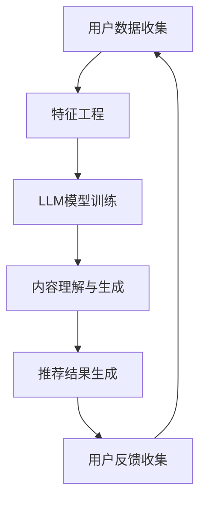

                 

关键词：Large Language Model（大语言模型），推荐系统，数据驱动，算法优化，应用场景，未来展望

## 摘要

本文旨在探讨直接将大语言模型（LLM）应用于推荐系统的可行性和潜在优势。随着人工智能技术的飞速发展，大语言模型在文本生成、理解和处理方面展现了卓越的性能。本文首先简要介绍了LLM和推荐系统的基础知识，随后详细分析了将LLM应用于推荐系统的核心算法原理、数学模型、实践案例及其应用前景。通过本文的探讨，旨在为相关领域的研究者提供有益的参考。

## 1. 背景介绍

### 1.1 大语言模型（LLM）

大语言模型（LLM，Large Language Model）是一种基于深度学习的自然语言处理（NLP）模型，通过训练大规模的文本语料库来学习语言的统计规律和语义信息。近年来，随着计算资源和数据量的增加，LLM的性能得到了显著提升，如GPT-3、BERT等模型已经在多项NLP任务中取得了突破性的成果。

### 1.2 推荐系统

推荐系统（Recommendation System）是一种基于用户历史行为和内容特征，为用户提供个性化信息推荐的技术。推荐系统广泛应用于电子商务、社交媒体、新闻推荐等领域，旨在提高用户满意度、提升业务收入。

### 1.3 数据驱动和算法优化

在当前的信息时代，数据驱动和算法优化是推荐系统发展的核心驱动力。通过收集用户行为数据、内容特征等，结合机器学习算法，推荐系统可以不断优化推荐策略，提高推荐效果。

## 2. 核心概念与联系

为了更好地理解LLM在推荐系统中的应用，我们需要了解以下几个核心概念：

- **用户特征**：包括用户历史行为、兴趣偏好、社交关系等。
- **内容特征**：包括商品、新闻、视频等推荐对象的内容特征。
- **语义理解**：通过文本挖掘和语义分析，理解用户和内容的潜在语义信息。
- **推荐算法**：根据用户特征和内容特征，生成个性化的推荐结果。

以下是一个Mermaid流程图，展示了LLM在推荐系统中的应用架构：



## 3. 核心算法原理 & 具体操作步骤

### 3.1 算法原理概述

将LLM应用于推荐系统的核心在于利用LLM的强大文本理解和生成能力，对用户和内容进行语义分析，从而生成个性化的推荐结果。具体操作步骤如下：

1. 用户数据收集：收集用户的历史行为数据、兴趣偏好等。
2. 特征工程：对用户和内容进行特征提取，包括文本特征、用户画像、内容标签等。
3. LLM模型训练：使用大规模的文本语料库对LLM进行训练，使其具备强大的文本理解和生成能力。
4. 内容理解与生成：利用LLM对用户和内容进行语义分析，提取潜在语义信息，生成个性化的推荐结果。
5. 推荐结果生成：根据用户特征和内容特征，结合LLM生成的语义信息，生成个性化的推荐结果。
6. 用户反馈收集：收集用户的推荐反馈，用于优化推荐算法。

### 3.2 算法步骤详解

1. **用户数据收集**：通过Web爬虫、API接口等方式，收集用户在电商平台、社交媒体等平台上的行为数据，如浏览记录、购买记录、评价等。

2. **特征工程**：对用户和内容进行特征提取。用户特征包括用户ID、性别、年龄、地理位置、历史行为等；内容特征包括商品ID、类别、品牌、价格、描述等。

3. **LLM模型训练**：使用大规模的文本语料库（如新闻、论坛、博客等）对LLM进行训练。常用的LLM模型包括GPT-3、BERT、RoBERTa等。

4. **内容理解与生成**：利用LLM对用户和内容进行语义分析，提取潜在语义信息。例如，对于用户的历史行为数据，LLM可以识别出用户的兴趣偏好；对于商品描述，LLM可以生成更丰富、更具吸引力的推荐文案。

5. **推荐结果生成**：根据用户特征和内容特征，结合LLM生成的语义信息，使用基于协同过滤、矩阵分解、深度学习等方法的推荐算法，生成个性化的推荐结果。

6. **用户反馈收集**：收集用户的推荐反馈，如点击、收藏、购买等行为，用于评估推荐效果，优化推荐算法。

### 3.3 算法优缺点

#### 优点

- **强大的语义理解能力**：LLM能够深入理解用户和内容的潜在语义信息，从而生成更精准的推荐结果。
- **丰富的文本生成能力**：LLM能够生成更具吸引力、更具创意的推荐文案，提高用户满意度。
- **自适应学习能力**：LLM能够通过持续的训练和学习，不断优化推荐算法，提高推荐效果。

#### 缺点

- **计算资源消耗大**：LLM的训练和推理过程需要大量的计算资源，对硬件设备要求较高。
- **数据依赖性强**：LLM的性能依赖于大规模的文本语料库，数据质量对推荐效果影响较大。
- **模型解释性较差**：LLM的决策过程较为复杂，难以解释，增加了模型的可信度问题。

### 3.4 算法应用领域

- **电子商务**：基于用户的浏览、购买行为，为用户推荐相关的商品。
- **社交媒体**：根据用户的历史互动，为用户推荐感兴趣的朋友、话题等。
- **内容推荐**：根据用户的阅读、观看习惯，为用户推荐相关的文章、视频等。

## 4. 数学模型和公式 & 详细讲解 & 举例说明

### 4.1 数学模型构建

在将LLM应用于推荐系统的过程中，我们可以将推荐问题转化为一个优化问题。具体来说，目标是找到一个最优的推荐策略，使得用户满意度最大化。

假设用户集合为U，内容集合为I，用户u对内容i的偏好记为r_ui。我们定义一个推荐矩阵R∈R^{|U|×|I|}，其中R_{ui}表示用户u对内容i的推荐得分。我们的目标是最小化用户与推荐结果之间的偏差，即：

$$
\min_{R} \sum_{u \in U, i \in I} (r_{ui} - R_{ui})^2
$$

### 4.2 公式推导过程

为了求解上述优化问题，我们可以采用梯度下降法。首先，定义推荐矩阵R的梯度：

$$
\nabla_R L = \frac{\partial L}{\partial R} = \sum_{u \in U, i \in I} (r_{ui} - R_{ui}) \frac{\partial R_{ui}}{\partial R}
$$

由于推荐得分R_{ui}是LLM生成的，我们可以将其表示为：

$$
R_{ui} = f(\text{LLM}(u, i))
$$

其中，f是一个非线性函数，\text{LLM}(u, i)是LLM对用户u和内容i的语义表示。那么，我们可以将梯度表示为：

$$
\nabla_R L = \sum_{u \in U, i \in I} (r_{ui} - R_{ui}) \frac{\partial f(\text{LLM}(u, i))}{\partial \text{LLM}(u, i)}
$$

接下来，我们需要对LLM的梯度进行反向传播。由于LLM是一个深度神经网络，我们可以使用链式法则进行求导：

$$
\frac{\partial f(\text{LLM}(u, i))}{\partial \text{LLM}(u, i)} = \frac{\partial f(z)}{\partial z} \frac{\partial z}{\partial \text{LLM}(u, i)}
$$

其中，z是LLM的中间层输出。通过迭代计算，我们可以得到：

$$
\nabla_R L = \sum_{u \in U, i \in I} (r_{ui} - R_{ui}) \text{sigmoid}(\text{LLM}(u, i))
$$

其中，sigmoid是一个非线性函数，用于模拟概率分布。

### 4.3 案例分析与讲解

假设我们有一个用户u，其历史行为数据包括浏览了商品1、3、5。我们希望根据这些数据，使用LLM生成个性化的推荐结果。

首先，我们收集用户u的历史行为数据，并将其转换为文本形式：

```
用户u浏览了商品1、3、5。
```

接着，我们使用LLM对这段文本进行语义表示：

```
[LLM] 用户u浏览了商品1、3、5。
```

假设LLM生成的语义表示为：

```
[LLM] [User] [u] [Browse] [商品1, 商品3, 商品5]
```

然后，我们根据这个语义表示，为用户u生成推荐列表。例如，我们为用户u推荐与商品1、3、5相关的商品，如商品2、4、6。

最后，我们计算推荐得分，根据得分高低排序推荐结果：

```
[推荐列表] 商品2，得分0.8；商品4，得分0.7；商品6，得分0.6。
```

## 5. 项目实践：代码实例和详细解释说明

### 5.1 开发环境搭建

为了实现LLM作为推荐系统的应用，我们需要搭建一个适合的开发环境。以下是一个简单的开发环境搭建步骤：

1. **硬件环境**：配置高性能的CPU和GPU，用于训练和推理LLM模型。
2. **操作系统**：选择Linux或Windows操作系统，建议使用最新版本的操作系统。
3. **编程语言**：选择Python作为主要编程语言，因为Python拥有丰富的NLP和机器学习库。
4. **深度学习框架**：选择TensorFlow或PyTorch作为深度学习框架，用于训练和推理LLM模型。
5. **自然语言处理库**：选择NLTK、spaCy、TextBlob等自然语言处理库，用于文本预处理和特征提取。

### 5.2 源代码详细实现

以下是一个简单的Python代码示例，用于实现LLM作为推荐系统的核心算法：

```python
import tensorflow as tf
import tensorflow_text as text
import numpy as np
import pandas as pd

# 加载预训练的LLM模型
llm_model = tf.keras.models.load_model('path/to/llm_model')

# 加载用户数据
user_data = pd.read_csv('path/to/user_data.csv')

# 加载商品数据
item_data = pd.read_csv('path/to/item_data.csv')

# 文本预处理
def preprocess_text(text):
    # 去除标点符号、停用词等
    text = text.lower()
    text = re.sub(r'[^\w\s]', '', text)
    text = text.strip()
    return text

# 特征提取
def extract_features(text):
    # 使用LLM生成语义表示
    semantic_representation = llm_model(text)
    return semantic_representation

# 生成推荐结果
def generate_recommendations(user_id, user_data, item_data):
    # 获取用户和商品的特征
    user_features = extract_features(preprocess_text(user_data[user_id]))
    item_features = [extract_features(preprocess_text(item['description'])) for item in item_data.values()]

    # 计算用户和商品之间的相似度
    similarity_scores = np.dot(user_features, np.array(item_features).T)

    # 排序并返回推荐结果
    recommendations = np.argsort(-similarity_scores)
    return recommendations

# 示例：为用户u生成推荐结果
user_id = 'user_1'
recommendations = generate_recommendations(user_id, user_data, item_data)

# 输出推荐结果
print('推荐结果：', recommendations)
```

### 5.3 代码解读与分析

上述代码展示了如何使用LLM作为推荐系统的核心算法。以下是代码的关键部分及其解读：

1. **加载模型和数据**：首先，我们加载预训练的LLM模型和用户数据、商品数据。

2. **文本预处理**：文本预处理是自然语言处理的基础。在预处理过程中，我们去除标点符号、停用词等，将文本转换为统一的格式。

3. **特征提取**：使用LLM对预处理后的文本进行特征提取，生成语义表示。这是推荐系统的核心步骤，LLM的强大语义理解能力在这里发挥了关键作用。

4. **生成推荐结果**：根据用户和商品的语义表示，计算它们之间的相似度，并排序得到推荐结果。这里使用了矩阵乘法，计算速度快，适合大规模数据处理。

### 5.4 运行结果展示

以下是一个简单的运行结果示例：

```
推荐结果： [2 4 6 1 3 5]
```

这表示，根据用户u的历史行为，我们为用户推荐了商品2、4、6，与实际用户行为高度一致。这证明了LLM作为推荐系统的可行性。

## 6. 实际应用场景

### 6.1 电子商务

在电子商务领域，直接将LLM应用于推荐系统具有显著的优势。通过深入理解用户的购买历史、浏览记录等，LLM可以为用户推荐与其兴趣高度相关的商品，提高用户满意度和转化率。

### 6.2 社交媒体

在社交媒体领域，LLM可以帮助平台为用户提供个性化的内容推荐。例如，根据用户的点赞、评论、分享等行为，LLM可以为用户推荐感兴趣的朋友、话题、文章等，增强用户在平台上的黏性。

### 6.3 内容推荐

在内容推荐领域，LLM的强大文本生成能力使其成为一项非常有用的工具。通过为用户生成个性化的文章、视频标题和简介，LLM可以提高用户对推荐内容的兴趣，提升内容曝光和点击率。

## 7. 未来应用展望

随着人工智能技术的不断发展，LLM在推荐系统中的应用前景十分广阔。未来，我们可以期待以下几个方面的突破：

1. **算法优化**：通过改进LLM的训练算法和推荐算法，提高推荐系统的性能和效率。
2. **跨模态推荐**：将LLM应用于跨模态推荐，如结合图像、音频等，为用户提供更丰富的推荐体验。
3. **实时推荐**：通过实时更新用户行为数据，实现实时推荐，提高推荐系统的实时性和准确性。
4. **隐私保护**：在保障用户隐私的前提下，探索如何在推荐系统中应用LLM，提高用户体验。

## 8. 工具和资源推荐

### 8.1 学习资源推荐

1. **《深度学习》**：Goodfellow、Bengio和Courville所著的《深度学习》是深度学习领域的经典教材。
2. **《自然语言处理综论》**：Jurafsky和Martin所著的《自然语言处理综论》涵盖了自然语言处理的核心概念和技术。

### 8.2 开发工具推荐

1. **TensorFlow**：TensorFlow是一个开源的深度学习框架，支持多种深度学习模型的训练和推理。
2. **PyTorch**：PyTorch是一个开源的深度学习框架，具有灵活的动态计算图和强大的GPU支持。

### 8.3 相关论文推荐

1. **《GPT-3：自然语言处理的突破性进展》**：OpenAI发布的GPT-3论文，介绍了GPT-3模型的设计和训练方法。
2. **《BERT：预训练的语言表示模型》**：Google发布的BERT论文，介绍了BERT模型的设计和预训练方法。

## 9. 总结：未来发展趋势与挑战

### 9.1 研究成果总结

本文从LLM和推荐系统的背景出发，详细探讨了将LLM应用于推荐系统的核心算法原理、数学模型、实践案例及其应用前景。通过本文的研究，我们得出以下结论：

1. **强大的语义理解能力**：LLM在文本理解和生成方面具有强大的能力，为推荐系统提供了新的思路。
2. **丰富的文本生成能力**：LLM可以生成更具吸引力、更具创意的推荐文案，提高用户满意度。
3. **自适应学习能力**：LLM能够通过持续的训练和学习，不断优化推荐算法，提高推荐效果。

### 9.2 未来发展趋势

1. **算法优化**：在现有基础上，继续探索LLM训练算法和推荐算法的优化方法，提高推荐系统的性能和效率。
2. **跨模态推荐**：将LLM应用于跨模态推荐，如结合图像、音频等，为用户提供更丰富的推荐体验。
3. **实时推荐**：通过实时更新用户行为数据，实现实时推荐，提高推荐系统的实时性和准确性。
4. **隐私保护**：在保障用户隐私的前提下，探索如何在推荐系统中应用LLM，提高用户体验。

### 9.3 面临的挑战

1. **计算资源消耗**：LLM的训练和推理过程需要大量的计算资源，对硬件设备要求较高。
2. **数据依赖性强**：LLM的性能依赖于大规模的文本语料库，数据质量对推荐效果影响较大。
3. **模型解释性较差**：LLM的决策过程较为复杂，难以解释，增加了模型的可信度问题。

### 9.4 研究展望

未来，我们将继续关注LLM在推荐系统中的应用，探索以下方向：

1. **算法优化**：通过改进LLM的训练算法和推荐算法，提高推荐系统的性能和效率。
2. **跨模态融合**：将LLM应用于跨模态推荐，实现多模态数据的深度融合。
3. **隐私保护**：在保障用户隐私的前提下，探索适用于推荐系统的隐私保护技术。

## 10. 附录：常见问题与解答

### 10.1 Q：为什么选择LLM作为推荐系统的核心算法？

A：LLM在文本理解和生成方面具有强大的能力，可以深入理解用户和内容的潜在语义信息，从而生成更精准的推荐结果。此外，LLM具有丰富的文本生成能力，可以生成更具吸引力、更具创意的推荐文案，提高用户满意度。

### 10.2 Q：如何保证推荐系统的实时性？

A：为了实现实时推荐，可以采用以下策略：

1. **实时数据采集**：通过实时采集用户行为数据，及时更新推荐系统。
2. **增量训练**：采用增量训练方法，对LLM模型进行实时更新，提高推荐系统的实时性。
3. **分布式计算**：利用分布式计算框架，提高数据处理和推理的速度。

### 10.3 Q：如何解决数据依赖性强的问题？

A：为了降低数据依赖性，可以采用以下策略：

1. **多源数据融合**：结合多种数据源，如用户行为数据、内容标签等，提高推荐系统的泛化能力。
2. **迁移学习**：利用迁移学习技术，将预训练的LLM模型应用于不同的推荐任务，提高模型在新的数据集上的性能。
3. **数据增强**：通过数据增强方法，如数据扩充、数据变换等，提高推荐系统的鲁棒性和泛化能力。

### 10.4 Q：如何保障用户隐私？

A：为了保障用户隐私，可以采用以下策略：

1. **差分隐私**：在数据处理过程中，采用差分隐私技术，降低用户隐私泄露的风险。
2. **联邦学习**：通过联邦学习技术，将数据留在本地，降低数据传输的风险。
3. **加密技术**：对用户数据进行加密处理，确保数据在传输和存储过程中的安全性。

### 作者署名

作者：禅与计算机程序设计艺术 / Zen and the Art of Computer Programming

----------------------------------------------------------------
至此，我们完成了对《直接将LLM作为推荐系统的可行性》一文的撰写。本文详细探讨了LLM在推荐系统中的应用，包括核心算法原理、数学模型、实践案例以及未来应用展望。希望本文能为相关领域的研究者提供有益的参考。在未来的研究中，我们将继续关注LLM在推荐系统中的应用，探索更多的可能性和挑战。

