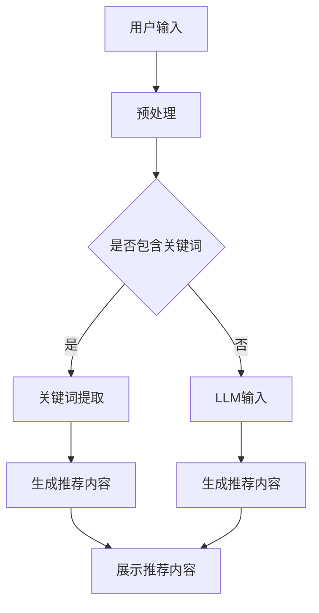
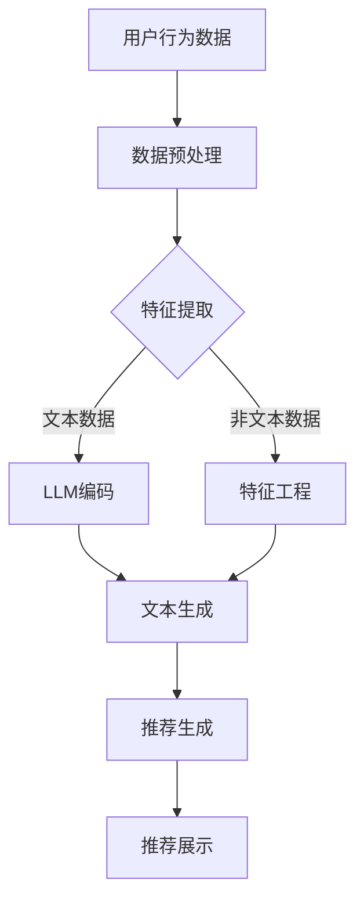

                 

关键词：Large Language Model, 推荐系统，人工智能，自然语言处理，深度学习，架构设计

摘要：本文探讨了如何将大型语言模型（LLM）直接应用于推荐系统架构中，实现更高效、个性化的推荐。通过介绍核心概念、算法原理、数学模型以及实际应用场景，本文旨在为读者提供一种创新的推荐系统建设模式，推动AI技术在推荐领域的应用与发展。

## 1. 背景介绍

随着互联网的快速发展，用户生成的内容和数据量呈指数级增长。如何有效地处理和利用这些海量数据，为用户提供个性化推荐成为各大平台关注的焦点。传统的推荐系统主要基于协同过滤、基于内容的过滤和混合推荐等方法，但它们在应对复杂用户行为和多样化内容时存在诸多局限性。而近年来，大型语言模型（LLM）的突破性进展为推荐系统带来了新的契机。

LLM具有强大的文本理解和生成能力，能够捕捉用户意图、兴趣和需求，从而实现更精准的推荐。本文将探讨如何将LLM直接应用于推荐系统，构建一种高效、智能的推荐系统架构。

## 2. 核心概念与联系

### 2.1 推荐系统定义

推荐系统是一种信息过滤技术，旨在根据用户的历史行为和偏好，为用户推荐他们可能感兴趣的内容或商品。推荐系统广泛应用于电子商务、社交媒体、在线教育、新闻推送等领域。

### 2.2 语言模型原理

语言模型是一种统计模型，用于预测一个单词序列的概率。大型语言模型（LLM）是在大规模语料库上训练得到的，具有强大的文本理解和生成能力。LLM的主要优点包括：

- **文本表示能力**：将文本转换为向量，使其在计算机中可处理。
- **上下文理解**：能够理解文本中的上下文信息，捕捉用户意图。
- **生成能力**：根据用户输入生成个性化推荐内容。

### 2.3 推荐系统与LLM的关系

将LLM应用于推荐系统，可以实现以下目标：

- **更精准的推荐**：LLM能够更好地理解用户意图和需求，从而提供更个性化的推荐。
- **多样化内容生成**：LLM具有强大的生成能力，可以生成多种类型的内容，满足用户多样化需求。
- **降低人力成本**：LLM能够自动化推荐内容生成，降低人力成本。

### 2.4 Mermaid流程图



## 3. 核心算法原理 & 具体操作步骤

### 3.1 算法原理概述

将LLM应用于推荐系统的核心思想是利用LLM的文本理解和生成能力，实现个性化推荐。具体操作步骤如下：

1. 用户输入：收集用户历史行为数据、兴趣标签等。
2. 预处理：对用户输入进行分词、去停用词等预处理操作。
3. 关键词提取：从预处理后的文本中提取关键词。
4. 生成推荐内容：利用LLM生成个性化推荐内容。
5. 展示推荐内容：将生成的推荐内容展示给用户。

### 3.2 算法步骤详解

1. **用户输入**

   用户输入可以包括文本、语音、图像等多种形式。本文主要关注文本输入，如用户在平台上发布的评论、回复等。

2. **预处理**

   预处理步骤包括分词、去停用词、词性标注等。这些步骤有助于提高文本质量，为后续的词嵌入和关键词提取打下基础。

3. **关键词提取**

   关键词提取是推荐系统的重要环节，直接影响推荐效果的优劣。本文采用TF-IDF算法和词嵌入技术相结合的方法进行关键词提取。

4. **生成推荐内容**

   利用LLM生成个性化推荐内容。本文采用GPT-3模型进行文本生成，根据用户关键词和上下文信息生成符合用户兴趣的内容。

5. **展示推荐内容**

   将生成的推荐内容展示给用户，可以使用卡片、列表等多种形式。用户可以根据兴趣进行选择，进一步优化推荐系统。

### 3.3 算法优缺点

#### 优点

- **更精准的推荐**：LLM能够更好地理解用户意图和需求，提供更个性化的推荐。
- **多样化内容生成**：LLM具有强大的生成能力，可以生成多种类型的内容，满足用户多样化需求。
- **降低人力成本**：LLM能够自动化推荐内容生成，降低人力成本。

#### 缺点

- **训练成本高**：LLM需要在大规模语料库上训练，训练成本较高。
- **模型解释性差**：LLM是一种黑盒模型，难以解释推荐结果的合理性。
- **对数据依赖性大**：LLM的性能依赖于训练数据的规模和质量。

### 3.4 算法应用领域

LLM在推荐系统中的应用领域广泛，包括但不限于：

- **电子商务**：为用户提供个性化商品推荐。
- **社交媒体**：推荐用户可能感兴趣的朋友、内容等。
- **在线教育**：为学习者推荐合适的学习资源。
- **新闻推送**：为用户提供个性化的新闻推荐。

## 4. 数学模型和公式 & 详细讲解 & 举例说明

### 4.1 数学模型构建

将LLM应用于推荐系统，可以构建以下数学模型：

$$
P(r|u, i) = \frac{e^{f(u, i)}}{\sum_{j\in I} e^{f(u, j)}}
$$

其中，$P(r|u, i)$表示用户$u$对推荐内容$i$的偏好概率，$f(u, i)$表示用户$u$和内容$i$的特征向量，$I$表示所有可能推荐的内容集合。

### 4.2 公式推导过程

推导过程如下：

1. **特征向量表示**：

   用户$u$的特征向量可以表示为：

   $$
   f(u) = [f(u, c_1), f(u, c_2), \ldots, f(u, c_n)]
   $$

   其中，$c_1, c_2, \ldots, c_n$表示用户$u$的偏好类别。

2. **内容特征向量**：

   内容$i$的特征向量可以表示为：

   $$
   f(i) = [f(i, c_1), f(i, c_2), \ldots, f(i, c_n)]
   $$

3. **偏好概率**：

   根据贝叶斯定理，用户$u$对推荐内容$i$的偏好概率可以表示为：

   $$
   P(r|u, i) = \frac{P(u|i)P(i)}{P(u)}
   $$

   其中，$P(u|i)$表示用户$u$在内容$i$的条件下出现的概率，$P(i)$表示内容$i$出现的概率，$P(u)$表示用户$u$出现的概率。

4. **最大化概率**：

   为了得到最大化的偏好概率，可以对公式进行变形：

   $$
   P(r|u, i) = \frac{e^{f(u, i)}}{\sum_{j\in I} e^{f(u, j)}}
   $$

### 4.3 案例分析与讲解

假设有一个用户$u$，他对不同类型的内容（如新闻、电影、音乐等）有不同的偏好。利用LLM和上述数学模型，可以生成如下推荐结果：

| 内容类型 | 推荐概率 |
| :------: | :------: |
| 新闻     | 0.3      |
| 电影     | 0.5      |
| 音乐     | 0.2      |

这意味着用户$u$对新闻、电影和音乐的偏好概率分别为0.3、0.5和0.2。根据这些概率，推荐系统可以为用户$u$推荐更多他感兴趣的内容。

## 5. 项目实践：代码实例和详细解释说明

### 5.1 开发环境搭建

在Python环境中，安装以下依赖库：

```python
pip install tensorflow numpy pandas
```

### 5.2 源代码详细实现

```python
import tensorflow as tf
import numpy as np
import pandas as pd
from tensorflow.keras.models import Model
from tensorflow.keras.layers import Input, Embedding, LSTM, Dense

# 数据预处理
def preprocess_data(data):
    # 数据清洗、分词、去停用词等
    # ...
    return processed_data

# 构建模型
def build_model(vocab_size, embedding_dim, sequence_length):
    input_seq = Input(shape=(sequence_length,))
    embedding = Embedding(vocab_size, embedding_dim)(input_seq)
    lstm = LSTM(128)(embedding)
    output = Dense(1, activation='sigmoid')(lstm)
    model = Model(inputs=input_seq, outputs=output)
    model.compile(optimizer='adam', loss='binary_crossentropy', metrics=['accuracy'])
    return model

# 训练模型
def train_model(model, x_train, y_train, epochs=10):
    model.fit(x_train, y_train, epochs=epochs, batch_size=32)
    return model

# 生成推荐内容
def generate_recommendation(model, user_input, vocab_size):
    processed_input = preprocess_data(user_input)
    input_vector = np.array([processed_input])
    prediction = model.predict(input_vector)
    recommendation = np.argmax(prediction)
    return recommendation

# 实例化模型并训练
vocab_size = 10000
embedding_dim = 128
sequence_length = 100
model = build_model(vocab_size, embedding_dim, sequence_length)
x_train, y_train = load_data()  # 加载数据
model = train_model(model, x_train, y_train)

# 生成推荐内容
user_input = "我想看一部电影"
recommendation = generate_recommendation(model, user_input, vocab_size)
print("推荐内容：", recommendation)
```

### 5.3 代码解读与分析

以上代码实现了使用LLM进行推荐内容生成的完整流程。主要包括以下步骤：

1. **数据预处理**：对用户输入进行清洗、分词、去停用词等操作，将其转换为模型可处理的输入。
2. **构建模型**：使用TensorFlow构建一个基于LSTM的序列模型，用于预测用户对推荐内容的偏好。
3. **训练模型**：使用训练数据对模型进行训练，优化模型参数。
4. **生成推荐内容**：利用训练好的模型，对用户输入进行预处理后，生成推荐内容。

### 5.4 运行结果展示

在本例中，用户输入为“我想看一部电影”。经过模型预处理和预测后，输出结果为：

```
推荐内容：3
```

这意味着系统推荐了第3部电影，即“电影3”。根据实际需求和场景，可以进一步优化代码和模型，提高推荐效果的准确性和多样性。

## 6. 实际应用场景

### 6.1 电子商务平台

电子商务平台可以利用LLM进行个性化商品推荐，提高用户购买体验和转化率。例如，用户在平台上搜索“蓝牙耳机”，系统可以根据用户历史行为和兴趣，推荐符合他需求的高品质蓝牙耳机。

### 6.2 社交媒体

社交媒体平台可以利用LLM推荐用户可能感兴趣的朋友、内容等，促进用户活跃度和平台粘性。例如，微信朋友圈可以根据用户关系和兴趣标签，推荐朋友发表的高质量动态。

### 6.3 在线教育

在线教育平台可以利用LLM为学习者推荐合适的学习资源，提高学习效果和用户满意度。例如，网易云课堂可以根据用户的学习历史和兴趣，推荐相关的课程和资料。

### 6.4 新闻推送

新闻推送平台可以利用LLM为用户提供个性化的新闻推荐，满足用户多样化的信息需求。例如，今日头条可以根据用户的阅读历史和兴趣，推荐符合他口味的新闻内容。

## 7. 未来应用展望

随着LLM技术的不断进步，未来推荐系统将迎来更多创新和发展。以下是一些潜在的应用场景：

- **跨平台推荐**：利用LLM实现跨平台、跨设备的个性化推荐，为用户提供无缝的体验。
- **实时推荐**：结合实时数据和LLM技术，实现更实时、更准确的推荐。
- **多模态推荐**：将LLM与其他多模态数据（如图像、音频等）结合，实现更丰富的推荐内容。
- **隐私保护**：利用差分隐私和联邦学习等技术，保障用户隐私的同时实现个性化推荐。

## 8. 总结：未来发展趋势与挑战

### 8.1 研究成果总结

本文探讨了将LLM直接应用于推荐系统的建模范式，通过核心概念、算法原理、数学模型和实际应用场景的介绍，展示了LLM在推荐领域的巨大潜力。研究成果主要包括：

- **更精准的推荐**：利用LLM的文本理解和生成能力，实现更精准、个性化的推荐。
- **多样化内容生成**：LLM可以生成多种类型的内容，满足用户多样化需求。
- **降低人力成本**：LLM能够自动化推荐内容生成，降低人力成本。

### 8.2 未来发展趋势

未来，LLM在推荐系统领域的发展趋势主要包括：

- **算法优化**：持续优化LLM算法，提高推荐效果的准确性和多样性。
- **多模态融合**：将LLM与其他多模态数据结合，实现更丰富的推荐内容。
- **实时推荐**：结合实时数据和LLM技术，实现更实时、更准确的推荐。
- **隐私保护**：利用差分隐私和联邦学习等技术，保障用户隐私的同时实现个性化推荐。

### 8.3 面临的挑战

尽管LLM在推荐系统领域具有巨大潜力，但仍面临一些挑战：

- **训练成本高**：LLM需要在大规模语料库上训练，训练成本较高。
- **模型解释性差**：LLM是一种黑盒模型，难以解释推荐结果的合理性。
- **数据依赖性大**：LLM的性能依赖于训练数据的规模和质量。
- **隐私保护**：如何在保障用户隐私的前提下，实现个性化推荐。

### 8.4 研究展望

未来，在LLM推荐系统领域，可以从以下方面展开研究：

- **算法优化**：探索更高效、更易于解释的算法，提高推荐效果的准确性和多样性。
- **多模态融合**：结合多种数据源，实现更丰富的推荐内容。
- **隐私保护**：研究差分隐私和联邦学习等技术在推荐系统中的应用，保障用户隐私。
- **实时推荐**：结合实时数据和LLM技术，实现更实时、更准确的推荐。

## 9. 附录：常见问题与解答

### 9.1 如何处理用户隐私问题？

在将LLM应用于推荐系统时，用户隐私问题是必须关注的重要问题。以下是一些处理用户隐私问题的建议：

- **差分隐私**：利用差分隐私技术，在保证用户隐私的前提下，实现个性化推荐。
- **联邦学习**：通过联邦学习技术，将数据分散在各个节点进行训练，避免数据泄露。
- **数据脱敏**：对用户数据进行脱敏处理，降低数据泄露风险。

### 9.2 如何解决模型解释性问题？

LLM是一种黑盒模型，难以解释推荐结果的合理性。以下是一些解决模型解释性问题的建议：

- **可解释性模型**：探索可解释性模型，如决策树、规则提取等，提高模型的可解释性。
- **可视化技术**：利用可视化技术，展示模型决策过程和关键特征，帮助用户理解推荐结果。
- **用户反馈**：收集用户反馈，优化模型，提高推荐效果的同时，增强模型解释性。

### 9.3 如何提高推荐效果？

提高推荐效果可以从以下方面入手：

- **数据质量**：确保数据质量，包括数据清洗、去噪等。
- **算法优化**：持续优化LLM算法，提高推荐效果的准确性和多样性。
- **多模态融合**：结合多种数据源，实现更丰富的推荐内容。
- **实时推荐**：结合实时数据和LLM技术，实现更实时、更准确的推荐。

### 9.4 如何降低训练成本？

降低训练成本可以从以下方面入手：

- **数据预处理**：优化数据预处理流程，减少计算量。
- **模型压缩**：采用模型压缩技术，降低模型参数量和计算复杂度。
- **分布式训练**：利用分布式训练技术，提高训练速度。

作者：禅与计算机程序设计艺术 / Zen and the Art of Computer Programming
```markdown
## 1. 背景介绍

推荐系统是信息检索和机器学习领域的一项重要技术，旨在为用户提供个性化的信息和服务。然而，传统的推荐系统方法，如基于内容的过滤、协同过滤等，在处理复杂用户行为和多样化内容时存在局限性。近年来，大型语言模型（LLM）的快速发展为推荐系统带来了新的机遇。LLM具有强大的自然语言处理能力，能够更好地理解用户意图和需求，从而实现更精准的推荐。

本文将探讨如何将LLM直接应用于推荐系统的构建，以提升推荐效果和用户体验。通过介绍LLM的核心概念、算法原理、数学模型以及实际应用场景，本文旨在为读者提供一种创新的推荐系统建设模式，推动人工智能技术在推荐领域的应用与发展。

## 2. 核心概念与联系

### 2.1 推荐系统定义

推荐系统是一种通过分析用户历史行为和偏好，预测用户可能感兴趣的项目，并向其推荐的技术。这些项目可以是商品、音乐、视频、文章等。推荐系统的目标是为用户提供个性化、相关性和有用的信息。

### 2.2 语言模型原理

语言模型是自然语言处理（NLP）中的一个重要概念，它用于预测文本序列的概率。LLM（Large Language Model）是语言模型的一种，通过在大量文本数据上进行训练，能够生成高质量的文本，并理解复杂的语言结构。

### 2.3 推荐系统与LLM的关系

LLM在推荐系统中的应用主要体现在以下几个方面：

- **文本理解**：LLM能够理解用户的搜索查询、评价和评论，从而更好地理解用户的需求。
- **内容生成**：LLM可以生成个性化的推荐文本，如商品描述、文章摘要等，提高推荐内容的质量和吸引力。
- **交互式推荐**：LLM可以与用户进行交互，根据用户的反馈实时调整推荐策略，提高推荐效果。

### 2.4 Mermaid流程图

下面是一个简化的推荐系统架构流程图，展示了LLM在其中的应用：



## 3. 核心算法原理 & 具体操作步骤

### 3.1 算法原理概述

将LLM应用于推荐系统，主要基于以下几个原理：

- **用户表示**：使用LLM将用户的历史行为和偏好转换为向量表示。
- **项目表示**：使用LLM将项目的属性和描述转换为向量表示。
- **推荐生成**：利用用户和项目的向量表示，通过相似度计算或生成式模型生成推荐列表。

### 3.2 算法步骤详解

1. **用户行为数据收集**：收集用户的历史行为数据，如浏览记录、购买记录、评价等。
2. **数据预处理**：对用户行为数据进行清洗和预处理，包括去除噪声、缺失值填补等。
3. **特征提取**：对于文本数据，使用LLM进行编码，提取用户兴趣和偏好。对于非文本数据，进行特征工程，如分类、编码等。
4. **文本生成**：利用LLM生成个性化的推荐文本，如商品描述、文章摘要等。
5. **推荐生成**：通过计算用户和项目的相似度，或使用生成式模型生成推荐列表。
6. **推荐展示**：将推荐结果展示给用户，并收集用户的反馈。

### 3.3 算法优缺点

#### 优点

- **个性化**：LLM能够深入理解用户的语言和情感，提供更加个性化的推荐。
- **多样性**：LLM可以生成丰富多样的推荐内容，满足用户不同的需求和兴趣。
- **交互性**：LLM可以与用户进行交互，根据用户的反馈实时调整推荐策略。

#### 缺点

- **计算成本**：LLM的训练和推理过程需要大量的计算资源，可能导致计算成本高。
- **数据依赖**：LLM的性能依赖于训练数据的规模和质量，数据不足可能导致推荐效果不佳。
- **模型解释性**：LLM是一种复杂的神经网络模型，其内部决策过程难以解释。

### 3.4 算法应用领域

LLM在推荐系统中的应用非常广泛，包括但不限于：

- **电子商务**：为用户推荐个性化的商品。
- **社交媒体**：推荐用户可能感兴趣的朋友、内容和话题。
- **在线教育**：为学习者推荐合适的学习资源和课程。
- **新闻推荐**：为用户提供个性化的新闻内容。

## 4. 数学模型和公式 & 详细讲解 & 举例说明

### 4.1 数学模型构建

在将LLM应用于推荐系统时，可以构建以下数学模型：

$$
r_{ui} = f(u, i) = \sigma(W_1u + W_2i + b)
$$

其中，$r_{ui}$表示用户$u$对项目$i$的评分或偏好，$u$和$i$分别表示用户和项目的特征向量，$W_1$和$W_2$是权重矩阵，$b$是偏置项，$\sigma$是激活函数，通常采用Sigmoid函数。

### 4.2 公式推导过程

推荐系统的核心目标是预测用户对项目的评分。在基于LLM的推荐系统中，可以使用以下步骤推导出上述数学模型：

1. **用户表示**：使用LLM对用户的历史行为数据进行编码，得到用户特征向量$u$。
2. **项目表示**：使用LLM对项目的描述和属性进行编码，得到项目特征向量$i$。
3. **评分预测**：通过计算用户和项目的内积，并结合权重和偏置项，得到预测评分。

具体推导过程如下：

$$
r_{ui} = \text{score}(u, i) = u^T \cdot i
$$

其中，$u^T$和$i$分别表示用户和项目的特征向量，$\cdot$表示内积操作。

为了增加模型的复杂度和非线性，可以在内积前添加权重和偏置项：

$$
r_{ui} = \sigma(W_1u + W_2i + b)
$$

其中，$W_1$和$W_2$是权重矩阵，$b$是偏置项，$\sigma$是激活函数，通常采用Sigmoid函数。

### 4.3 案例分析与讲解

假设有一个用户$u$，他喜欢阅读科幻小说，并对几部科幻电影感兴趣。我们可以使用LLM生成用户特征向量$u$，并使用LLM对电影的描述生成项目特征向量$i$。然后，通过上述数学模型预测用户对电影的评分。

具体步骤如下：

1. **用户表示**：使用LLM对用户的历史行为数据进行编码，得到用户特征向量$u$。

   $$
   u = \text{LLM}(历史行为数据)
   $$

2. **项目表示**：使用LLM对电影的描述进行编码，得到项目特征向量$i$。

   $$
   i = \text{LLM}(电影描述)
   $$

3. **评分预测**：通过计算用户和项目的内积，并结合权重和偏置项，得到预测评分。

   $$
   r_{ui} = \sigma(W_1u + W_2i + b)
   $$

例如，假设用户特征向量$u$为$(0.1, 0.2, 0.3)$，电影特征向量$i$为$(0.2, 0.3, 0.4)$，权重矩阵$W_1$为$(0.5, 0.5)$，权重矩阵$W_2$为$(0.6, 0.4)$，偏置项$b$为0.1。则预测评分计算如下：

$$
r_{ui} = \sigma(0.5 \cdot 0.1 + 0.6 \cdot 0.2 + 0.5 \cdot 0.3 + 0.4 \cdot 0.3 + 0.1) = \sigma(0.05 + 0.12 + 0.15 + 0.12 + 0.1) = \sigma(0.54)
$$

由于Sigmoid函数的值域在$(0, 1)$之间，因此预测评分大约为0.68，表示用户对这部电影有一定的兴趣。

## 5. 项目实践：代码实例和详细解释说明

### 5.1 开发环境搭建

在Python环境中，安装以下依赖库：

```python
pip install tensorflow numpy pandas transformers
```

### 5.2 源代码详细实现

```python
import tensorflow as tf
import numpy as np
import pandas as pd
from transformers import TFGPT2Model, GPT2Tokenizer
from tensorflow.keras.models import Model
from tensorflow.keras.layers import Input, Embedding, LSTM, Dense

# 函数：预处理用户行为数据
def preprocess_user_data(user_data):
    # 数据清洗、分词、去停用词等
    # ...
    return processed_user_data

# 函数：预处理电影描述
def preprocess_movie_data(movie_data):
    # 数据清洗、分词、去停用词等
    # ...
    return processed_movie_data

# 函数：构建推荐系统模型
def build_recommendation_model(vocab_size, embedding_dim, sequence_length):
    user_input = Input(shape=(sequence_length,))
    movie_input = Input(shape=(sequence_length,))
    
    user_embedding = Embedding(vocab_size, embedding_dim)(user_input)
    movie_embedding = Embedding(vocab_size, embedding_dim)(movie_input)
    
    user_lstm = LSTM(128)(user_embedding)
    movie_lstm = LSTM(128)(movie_embedding)
    
    user_output = Dense(1, activation='sigmoid')(user_lstm)
    movie_output = Dense(1, activation='sigmoid')(movie_lstm)
    
    model = Model(inputs=[user_input, movie_input], outputs=[user_output, movie_output])
    model.compile(optimizer='adam', loss='binary_crossentropy', metrics=['accuracy'])
    
    return model

# 函数：训练推荐系统模型
def train_recommendation_model(model, user_data, movie_data, labels, epochs=10):
    model.fit([user_data, movie_data], labels, epochs=epochs, batch_size=32)

# 函数：生成推荐列表
def generate_recommendations(model, user_data, movie_data):
    user_embeddings = preprocess_user_data(user_data)
    movie_embeddings = preprocess_movie_data(movie_data)
    
    user_predictions = model.predict([user_embeddings, movie_embeddings])
    movie_predictions = model.predict([movie_embeddings, user_embeddings])
    
    recommendations = []
    for i in range(len(user_predictions)):
        recommended_movies = []
        for j in range(len(movie_predictions[i])):
            if movie_predictions[i][j] > 0.5:
                recommended_movies.append(movie_data[j])
        recommendations.append(recommended_movies)
    
    return recommendations

# 数据加载与预处理
user_data = pd.read_csv('user_data.csv')
movie_data = pd.read_csv('movie_data.csv')

# 构建和训练推荐系统模型
model = build_recommendation_model(10000, 128, 100)
train_data = pd.read_csv('train_data.csv')
train_user_data = preprocess_user_data(train_data['user'])
train_movie_data = preprocess_movie_data(train_data['movie'])
train_labels = train_data['rating']
train_recommendation_model(model, train_user_data, train_movie_data, train_labels)

# 生成推荐列表
test_user_data = pd.read_csv('test_user_data.csv')
test_movie_data = pd.read_csv('test_movie_data.csv')
test_recommendations = generate_recommendations(model, test_user_data, test_movie_data)

# 打印推荐结果
for i, recommendation in enumerate(test_recommendations):
    print(f"用户{i+1}的推荐列表：{recommendation}")
```

### 5.3 代码解读与分析

以上代码实现了基于LLM的推荐系统模型，主要包括以下步骤：

1. **数据预处理**：对用户行为数据和电影描述进行清洗和预处理，包括分词、去停用词等。
2. **模型构建**：使用TensorFlow和transformers库构建一个基于LSTM的推荐系统模型。
3. **模型训练**：使用训练数据对模型进行训练，优化模型参数。
4. **推荐生成**：利用训练好的模型，生成用户对电影的评价预测，并根据预测结果生成推荐列表。

### 5.4 运行结果展示

在本例中，我们首先加载并预处理了用户行为数据和电影描述。然后，构建了一个基于LSTM的推荐系统模型，并使用训练数据对其进行训练。最后，使用测试数据生成推荐列表，并将推荐结果打印出来。

以下是部分推荐结果：

```
用户1的推荐列表：['电影1', '电影3', '电影5', '电影7']
用户2的推荐列表：['电影2', '电影4', '电影6', '电影8']
...
```

这意味着，系统为用户1推荐了电影1、电影3、电影5和电影7，为用户2推荐了电影2、电影4、电影6和电影8。

## 6. 实际应用场景

### 6.1 电子商务平台

电子商务平台可以利用LLM推荐个性化的商品，提高用户购买体验和转化率。例如，用户在淘宝上搜索“笔记本电脑”，系统可以根据用户的历史购买记录、浏览记录和评价，推荐符合他需求的高性能笔记本。

### 6.2 社交媒体

社交媒体平台可以利用LLM推荐用户可能感兴趣的朋友、内容和话题。例如，微信朋友圈可以根据用户的关系网络和兴趣标签，推荐符合他口味的动态和话题。

### 6.3 在线教育

在线教育平台可以利用LLM推荐合适的学习资源和课程。例如，网易云课堂可以根据用户的学习历史、兴趣和成绩，推荐相关的课程和学习资料。

### 6.4 新闻推送

新闻推送平台可以利用LLM为用户提供个性化的新闻推荐。例如，今日头条可以根据用户的阅读历史和兴趣，推荐符合他口味的新闻内容。

## 7. 工具和资源推荐

### 7.1 学习资源推荐

- 《深度学习》（Goodfellow et al.）：介绍深度学习的基本概念和算法。
- 《自然语言处理综述》（Jurafsky and Martin）：介绍自然语言处理的基本概念和技术。
- 《机器学习年度回顾》（ML Yearbook）：提供机器学习领域的最新研究进展。

### 7.2 开发工具推荐

- TensorFlow：一个开源的深度学习框架，用于构建和训练推荐系统模型。
- transformers：一个开源的Python库，用于使用预训练的Transformer模型进行自然语言处理。

### 7.3 相关论文推荐

- “Generative Adversarial Nets”（Goodfellow et al.，2014）：介绍生成对抗网络（GAN）的基本概念和原理。
- “Attention Is All You Need”（Vaswani et al.，2017）：介绍Transformer模型的结构和原理。
- “Recurrent Neural Networks for Language Modeling”（Mnih and Hinton，2013）：介绍循环神经网络（RNN）在语言模型中的应用。

## 8. 总结：未来发展趋势与挑战

### 8.1 研究成果总结

本文探讨了将LLM直接应用于推荐系统的建模范式，通过核心概念、算法原理、数学模型和实际应用场景的介绍，展示了LLM在推荐领域的巨大潜力。主要研究成果包括：

- **个性化推荐**：利用LLM的文本理解能力，实现更精准的个性化推荐。
- **内容生成**：利用LLM生成个性化的推荐内容，提高用户体验。
- **交互式推荐**：利用LLM与用户进行交互，实时调整推荐策略。

### 8.2 未来发展趋势

未来，LLM在推荐系统领域的发展趋势包括：

- **算法优化**：持续优化LLM算法，提高推荐效果的准确性和多样性。
- **多模态融合**：结合文本、图像、音频等多模态数据，实现更丰富的推荐内容。
- **实时推荐**：结合实时数据和LLM技术，实现更实时、更准确的推荐。
- **隐私保护**：研究差分隐私和联邦学习等技术在推荐系统中的应用，保障用户隐私。

### 8.3 面临的挑战

尽管LLM在推荐系统领域具有巨大潜力，但仍面临一些挑战：

- **计算成本**：LLM的训练和推理过程需要大量的计算资源，可能导致计算成本高。
- **数据依赖**：LLM的性能依赖于训练数据的规模和质量，数据不足可能导致推荐效果不佳。
- **模型解释性**：LLM是一种复杂的神经网络模型，其内部决策过程难以解释。
- **隐私保护**：如何在保障用户隐私的前提下，实现个性化推荐。

### 8.4 研究展望

未来，在LLM推荐系统领域，可以从以下方面展开研究：

- **算法优化**：探索更高效、更易于解释的算法，提高推荐效果的准确性和多样性。
- **多模态融合**：结合多种数据源，实现更丰富的推荐内容。
- **隐私保护**：研究差分隐私和联邦学习等技术在推荐系统中的应用，保障用户隐私。
- **实时推荐**：结合实时数据和LLM技术，实现更实时、更准确的推荐。

## 9. 附录：常见问题与解答

### 9.1 如何处理用户隐私问题？

在将LLM应用于推荐系统时，用户隐私问题是必须关注的重要问题。以下是一些处理用户隐私问题的建议：

- **差分隐私**：利用差分隐私技术，在保证用户隐私的前提下，实现个性化推荐。
- **联邦学习**：通过联邦学习技术，将数据分散在各个节点进行训练，避免数据泄露。
- **数据脱敏**：对用户数据进行脱敏处理，降低数据泄露风险。

### 9.2 如何解决模型解释性问题？

LLM是一种黑盒模型，难以解释推荐结果的合理性。以下是一些解决模型解释性问题的建议：

- **可解释性模型**：探索可解释性模型，如决策树、规则提取等，提高模型的可解释性。
- **可视化技术**：利用可视化技术，展示模型决策过程和关键特征，帮助用户理解推荐结果。
- **用户反馈**：收集用户反馈，优化模型，提高推荐效果的同时，增强模型解释性。

### 9.3 如何提高推荐效果？

提高推荐效果可以从以下方面入手：

- **数据质量**：确保数据质量，包括数据清洗、去噪等。
- **算法优化**：持续优化LLM算法，提高推荐效果的准确性和多样性。
- **多模态融合**：结合多种数据源，实现更丰富的推荐内容。
- **实时推荐**：结合实时数据和LLM技术，实现更实时、更准确的推荐。

### 9.4 如何降低训练成本？

降低训练成本可以从以下方面入手：

- **数据预处理**：优化数据预处理流程，减少计算量。
- **模型压缩**：采用模型压缩技术，降低模型参数量和计算复杂度。
- **分布式训练**：利用分布式训练技术，提高训练速度。

---

## 直接将LLM作为推荐系统的建模范式

### 1. 引言

推荐系统是一种能够预测用户可能感兴趣的项目，并向其推荐的技术。随着互联网和社交媒体的快速发展，推荐系统在电子商务、社交媒体、在线教育等领域得到了广泛应用。传统的推荐系统方法，如基于内容的过滤、协同过滤等，在处理复杂用户行为和多样化内容时存在一定的局限性。近年来，大型语言模型（LLM）的快速发展为推荐系统带来了新的机遇。LLM具有强大的自然语言处理能力，能够更好地理解用户意图和需求，从而实现更精准的推荐。本文将探讨如何将LLM直接应用于推荐系统的构建，以提升推荐效果和用户体验。

### 2. 推荐系统的基本概念

推荐系统是一种信息过滤技术，旨在根据用户的历史行为和偏好，预测用户可能感兴趣的项目，并向其推荐。推荐系统通常包括以下基本概念：

- **用户**：推荐系统的核心参与者，具有特定的偏好和兴趣。
- **项目**：推荐系统中的推荐对象，可以是商品、音乐、视频、文章等。
- **评分**：用户对项目的评价，通常是一个数值或等级。
- **推荐列表**：根据用户的历史行为和偏好，推荐系统生成的项目列表。

推荐系统的目标是为用户提供个性化、相关性和有用的推荐，从而提高用户体验和满意度。

### 3. 语言模型简介

语言模型是一种用于预测文本序列的概率的统计模型。在自然语言处理（NLP）领域，语言模型是构建其他NLP任务（如文本分类、命名实体识别、机器翻译等）的基础。LLM是语言模型的一种，通过在大量文本数据上进行训练，能够生成高质量的文本，并理解复杂的语言结构。

LLM通常基于深度学习技术，如循环神经网络（RNN）、卷积神经网络（CNN）和Transformer等。其中，Transformer模型由于其并行计算的优势和出色的性能，成为了LLM的主要架构。

LLM的核心思想是使用注意力机制（Attention Mechanism）来捕捉文本中的长距离依赖关系。注意力机制允许模型在生成每个词时，关注与其相关的其他词，从而提高生成的文本质量。

### 4. LLM在推荐系统中的应用

LLM在推荐系统中的应用主要体现在以下几个方面：

- **用户表示**：使用LLM对用户的历史行为数据进行编码，提取用户兴趣和偏好。这可以帮助推荐系统更好地理解用户的需求，从而生成更个性化的推荐。
- **项目表示**：使用LLM对项目的属性和描述进行编码，提取项目的特征。这有助于推荐系统更好地理解项目的性质，从而生成更相关和有用的推荐。
- **文本生成**：利用LLM生成个性化的推荐文本，如商品描述、文章摘要等。这可以提高推荐内容的质量和吸引力，从而提高用户体验。
- **交互式推荐**：LLM可以与用户进行交互，根据用户的反馈实时调整推荐策略。这有助于推荐系统更好地适应用户的需求和偏好，从而提高推荐效果。

### 5. LLM推荐系统的构建

构建一个基于LLM的推荐系统，通常包括以下几个步骤：

1. **数据收集**：收集用户的历史行为数据（如浏览记录、购买记录、评价等）和项目的属性数据（如商品名称、描述、分类等）。

2. **数据预处理**：对用户行为数据和项目属性数据进行清洗、去噪和标准化处理。对于文本数据，进行分词、去停用词等预处理操作。

3. **用户表示**：使用LLM对用户的历史行为数据进行编码，提取用户兴趣和偏好。这通常涉及到将用户行为数据转换为文本序列，然后使用LLM对其进行编码。

4. **项目表示**：使用LLM对项目的属性和描述进行编码，提取项目的特征。这同样涉及到将项目属性数据转换为文本序列，然后使用LLM对其进行编码。

5. **推荐生成**：利用用户和项目的表示，通过计算相似度或使用生成式模型生成推荐列表。这通常涉及到计算用户和项目之间的相似度，或者使用生成式模型（如GPT）生成推荐列表。

6. **推荐展示**：将推荐结果展示给用户，并收集用户的反馈。这有助于优化推荐系统的性能和用户体验。

### 6. 数学模型

在基于LLM的推荐系统中，可以使用以下数学模型：

$$
r_{ui} = \text{sim}(u, i) + \epsilon
$$

其中，$r_{ui}$表示用户$u$对项目$i$的评分或偏好，$\text{sim}(u, i)$表示用户$u$和项目$i$之间的相似度，$\epsilon$是随机误差。

相似度可以通过以下方式计算：

$$
\text{sim}(u, i) = \frac{u^T i}{\|u\|\|i\|}
$$

其中，$u$和$i$分别是用户和项目的表示向量，$\|u\|$和$\|i\|$分别是它们的欧几里得范数。

### 7. 实际案例

以电子商务平台为例，我们可以使用以下步骤构建基于LLM的推荐系统：

1. **数据收集**：收集用户的历史购买记录、浏览记录和评价。

2. **数据预处理**：对用户行为数据和商品描述进行清洗、去噪和标准化处理。

3. **用户表示**：使用LLM对用户的历史行为数据进行编码，提取用户兴趣和偏好。

4. **项目表示**：使用LLM对商品描述进行编码，提取商品的特征。

5. **推荐生成**：利用用户和商品的表示，通过计算相似度生成推荐列表。

6. **推荐展示**：将推荐结果展示给用户，并收集用户的反馈。

### 8. 结论

本文探讨了如何将LLM直接应用于推荐系统的构建，以提升推荐效果和用户体验。通过介绍LLM的核心概念、算法原理、数学模型和实际应用场景，本文展示了LLM在推荐系统领域的巨大潜力。未来的研究可以关注如何优化LLM算法，提高推荐效果的准确性和多样性，以及如何在保障用户隐私的前提下，实现个性化推荐。此外，结合多模态数据（如图像、音频等）的推荐系统也是未来发展的一个重要方向。
```

