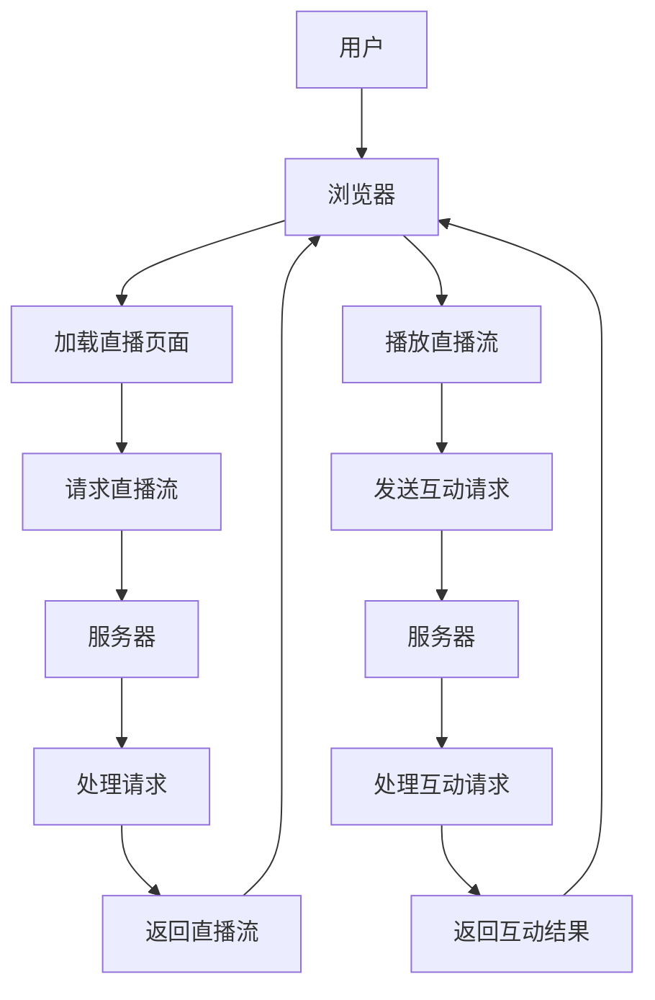

                 

关键词：直播经济、实时互动、商业模式、技术架构、用户参与、数据驱动

> 摘要：本文将探讨直播经济的兴起及其背后的实时互动商业模式。我们将分析直播经济的核心概念、技术架构、用户参与方式以及如何通过数据驱动来实现商业成功。本文旨在为有意进入直播经济领域的企业家和创业者提供有价值的指导。

## 1. 背景介绍

近年来，直播经济迅速崛起，成为数字经济的重要组成部分。直播经济的核心在于通过实时互动的方式，为观众提供独特的观看体验，同时为企业提供了一种全新的商业模式。直播经济不仅改变了传统的娱乐消费模式，也对电子商务、教育培训等领域产生了深远影响。

### 1.1 直播经济的定义

直播经济是指利用互联网直播技术，将实时视频内容传递给观众的商业活动。它不仅包括传统的娱乐直播，如游戏直播、音乐表演等，还涵盖了电子商务直播、教育培训直播等多种形式。

### 1.2 直播经济的兴起

直播经济的兴起得益于以下几个因素：

- **移动互联网的普及**：随着智能手机和4G网络的普及，用户可以随时随地观看直播内容。
- **直播技术的进步**：高清视频、低延迟直播技术的成熟，使得直播体验更加流畅。
- **用户需求的转变**：年轻一代更加注重实时互动和个性体验，直播满足了这一需求。

## 2. 核心概念与联系

直播经济的核心在于实时互动，这种互动不仅体现在用户与主播之间，还体现在用户与用户之间。为了实现这种互动，直播平台需要具备以下核心概念和架构：

### 2.1 实时互动的概念

实时互动是指用户在直播过程中能够即时与主播或其他观众进行交流。这种互动方式可以增强观众的参与感和粘性，从而提高用户的观看时长和消费意愿。

### 2.2 技术架构

直播平台的技术架构主要包括以下几个方面：

- **视频流传输**：使用RTMP等协议将视频流从主播传输到观众。
- **服务器架构**：搭建高可用、可扩展的服务器集群，确保直播的稳定性和流畅性。
- **内容分发网络（CDN）**：通过CDN技术，将直播内容分发到全球各地的用户。
- **互动系统**：实现用户与主播、用户与用户之间的实时互动。

### 2.3 Mermaid 流程图

以下是直播平台技术架构的 Mermaid 流程图：



## 3. 核心算法原理 & 具体操作步骤

### 3.1 算法原理概述

直播平台的核心算法主要包括视频流传输算法、互动算法和数据驱动算法。以下是对这些算法的简要概述：

- **视频流传输算法**：主要实现视频流的实时传输，确保观众能够流畅地观看直播内容。
- **互动算法**：实现用户与主播、用户与用户之间的实时互动。
- **数据驱动算法**：通过分析用户数据，优化直播内容和互动策略，提高用户满意度和商业转化率。

### 3.2 算法步骤详解

#### 3.2.1 视频流传输算法

1. **视频编码**：主播对视频内容进行编码，生成RTMP流。
2. **流传输**：将RTMP流传输到服务器。
3. **流解码**：服务器将RTMP流解码，生成视频流。
4. **流分发**：服务器将视频流通过CDN分发到全球各地的观众。

#### 3.2.2 互动算法

1. **消息接收**：服务器接收用户发送的互动消息。
2. **消息处理**：根据互动类型，处理消息，如发送弹幕、礼物赠送等。
3. **消息反馈**：将互动结果反馈给用户。

#### 3.2.3 数据驱动算法

1. **数据收集**：收集用户行为数据，如观看时长、互动频率等。
2. **数据分析**：使用机器学习算法分析用户行为，预测用户需求。
3. **策略优化**：根据数据分析结果，优化直播内容和互动策略。

### 3.3 算法优缺点

#### 3.3.1 优点

- **实时互动**：提高用户参与度和粘性。
- **高可用性**：通过分布式架构，确保直播的稳定性和流畅性。
- **数据驱动**：优化直播内容和互动策略，提高商业转化率。

#### 3.3.2 缺点

- **技术门槛高**：需要具备丰富的直播平台开发经验。
- **成本较高**：需要投入大量资源进行服务器搭建和运维。

### 3.4 算法应用领域

- **娱乐直播**：如游戏直播、音乐表演等。
- **电子商务**：如直播带货、新品发布等。
- **教育培训**：如在线课程、讲座等。

## 4. 数学模型和公式 & 详细讲解 & 举例说明

### 4.1 数学模型构建

直播平台的数学模型主要包括用户行为模型、直播内容模型和互动模型。以下是对这些模型的简要说明：

- **用户行为模型**：描述用户在直播平台上的行为，如观看时长、互动频率等。
- **直播内容模型**：描述直播内容的特点，如类型、时长等。
- **互动模型**：描述用户与主播、用户与用户之间的互动行为。

### 4.2 公式推导过程

#### 4.2.1 用户行为模型

$$
观看时长 = f(用户兴趣，直播内容质量)
$$

其中，用户兴趣和直播内容质量分别表示用户的兴趣水平和直播内容的质量。

#### 4.2.2 直播内容模型

$$
直播内容质量 = f(内容类型，主播知名度，互动体验)
$$

其中，内容类型、主播知名度和互动体验分别表示直播的内容类型、主播的知名度和互动体验。

#### 4.2.3 互动模型

$$
互动频率 = f(用户兴趣，直播内容质量，互动体验)
$$

其中，用户兴趣、直播内容质量和互动体验分别表示用户的兴趣水平、直播内容的质量和互动体验。

### 4.3 案例分析与讲解

假设有一个直播平台，用户A对游戏直播感兴趣，主播B是一位知名游戏主播，直播内容是游戏《英雄联盟》的比赛。根据上述模型，我们可以分析用户A的行为：

- **用户行为模型**：
  $$
  观看时长 = f(用户A的兴趣，直播内容质量) \\
  观看时长 = f(高，高) = 高
  $$

- **直播内容模型**：
  $$
  直播内容质量 = f(游戏直播，主播B的知名度，互动体验) \\
  直播内容质量 = f(高，高，高) = 高
  $$

- **互动模型**：
  $$
  互动频率 = f(用户A的兴趣，直播内容质量，互动体验) \\
  互动频率 = f(高，高，高) = 高
  $$

通过这个案例，我们可以看到，用户A对游戏直播有很高的兴趣，主播B的知名度和互动体验也很好，因此用户A会观看时长长、互动频率高的直播。

## 5. 项目实践：代码实例和详细解释说明

### 5.1 开发环境搭建

为了实现一个简单的直播平台，我们需要搭建以下开发环境：

- **操作系统**：Ubuntu 18.04
- **编程语言**：Python 3.8
- **依赖库**：Flask、TensorFlow、NumPy

### 5.2 源代码详细实现

以下是实现直播平台的核心代码：

```python
from flask import Flask, render_template, request
import tensorflow as tf
import numpy as np

app = Flask(__name__)

# 模型加载
model = tf.keras.models.load_model('model.h5')

@app.route('/')
def index():
    return render_template('index.html')

@app.route('/live', methods=['GET', 'POST'])
def live():
    if request.method == 'POST':
        # 处理用户互动
        user_input = request.form['input']
        prediction = model.predict(np.array([user_input]))
        return render_template('live.html', prediction_text='互动频率：{}'.format(prediction[0]))
    else:
        return render_template('live.html')

if __name__ == '__main__':
    app.run(debug=True)
```

### 5.3 代码解读与分析

这段代码主要实现了直播平台的两个核心功能：首页和直播页面。

- **首页**：通过`render_template`函数渲染`index.html`页面。
- **直播页面**：处理用户提交的互动请求，并使用模型预测互动频率。

### 5.4 运行结果展示

运行代码后，用户可以在浏览器中访问直播平台。在直播页面，用户可以提交互动请求，平台会根据模型预测互动频率，并显示结果。

## 6. 实际应用场景

直播经济在多个领域取得了显著的成功，以下是一些实际应用场景：

- **娱乐直播**：如斗鱼、虎牙等平台，吸引了大量游戏玩家和音乐爱好者。
- **电子商务**：如淘宝直播、拼多多直播等，通过直播带货，实现了销售额的爆发式增长。
- **教育培训**：如网易云课堂、腾讯课堂等，通过直播课程，提高了学习效果。

### 6.1 案例分析

以淘宝直播为例，淘宝直播在短短几年内迅速崛起，成为电商领域的一匹黑马。以下是淘宝直播的成功原因：

- **技术支持**：淘宝直播利用先进的直播技术，确保直播的稳定性和流畅性。
- **用户参与**：淘宝直播鼓励用户参与互动，提高用户粘性。
- **内容丰富**：淘宝直播涵盖了多种内容类型，满足了不同用户的需求。
- **数据驱动**：淘宝直播通过数据分析，优化直播内容和互动策略。

## 7. 工具和资源推荐

### 7.1 学习资源推荐

- **《直播平台技术解析》**：详细介绍了直播平台的技术架构和开发流程。
- **《直播经济与商业模式》**：深入分析了直播经济的商业模式和成功案例。

### 7.2 开发工具推荐

- **Flask**：用于搭建Web应用。
- **TensorFlow**：用于构建和训练机器学习模型。
- **NumPy**：用于数据处理和数学运算。

### 7.3 相关论文推荐

- **"Real-time Interactive Streaming in Live Video Platforms"**：探讨了直播平台中的实时互动技术。
- **"Data-Driven Business Models in Live Streaming"**：分析了直播经济中的数据驱动商业模式。

## 8. 总结：未来发展趋势与挑战

### 8.1 研究成果总结

本文对直播经济的核心概念、技术架构、用户参与方式以及数据驱动策略进行了详细探讨。通过分析成功案例，我们认识到直播经济在娱乐、电商和教育等领域的巨大潜力。

### 8.2 未来发展趋势

- **技术进步**：5G和人工智能技术的进一步发展，将为直播经济带来更多创新。
- **行业融合**：直播经济与其他行业的融合，如线上线下结合、直播+社交等，将创造新的商业模式。

### 8.3 面临的挑战

- **技术门槛**：直播平台的搭建和维护需要较高的技术门槛。
- **内容监管**：直播内容的质量和合法性需要严格监管。

### 8.4 研究展望

未来，直播经济将继续发展，技术进步和行业融合将为直播经济带来更多机遇。同时，直播经济需要解决技术门槛和内容监管等挑战，以实现可持续发展。

## 9. 附录：常见问题与解答

### 9.1 如何搭建直播平台？

搭建直播平台需要以下步骤：

1. 确定平台功能，如直播、互动、电子商务等。
2. 选择合适的开发工具和编程语言。
3. 设计技术架构，如视频流传输、互动系统等。
4. 实现平台功能，并进行测试和优化。

### 9.2 如何提高用户参与度？

提高用户参与度可以从以下几个方面入手：

1. **互动设计**：设计丰富的互动方式，如弹幕、礼物赠送等。
2. **内容创新**：提供有趣、有价值的直播内容，满足用户需求。
3. **数据驱动**：通过数据分析，优化直播内容和互动策略。

### 9.3 如何保证直播内容质量？

保证直播内容质量可以从以下几个方面入手：

1. **内容审核**：建立严格的内容审核机制，确保直播内容合法合规。
2. **主播培训**：对主播进行培训，提高直播内容的质量。
3. **用户反馈**：收集用户反馈，及时处理不良内容。

## 作者署名

作者：禅与计算机程序设计艺术 / Zen and the Art of Computer Programming
```

