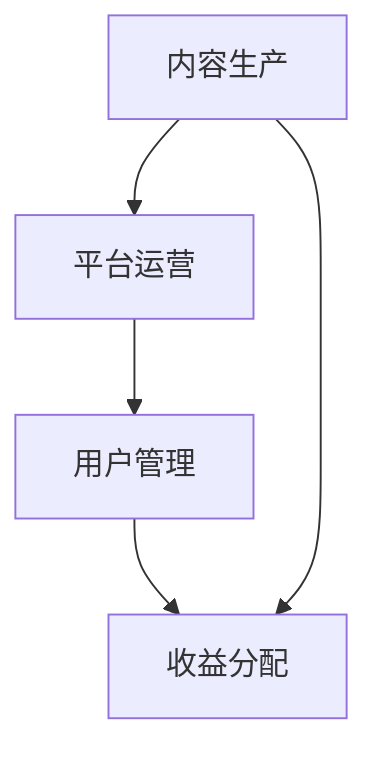

                 

关键词：知识付费、用户价值、创业、增长策略、数据驱动、技术创新

> 摘要：本文从知识付费创业的角度，探讨了如何通过用户价值的最大化来提升创业项目的成功概率。文章首先介绍了知识付费的概念和发展背景，然后分析了用户价值的关键因素，并结合具体案例，提出了实现用户价值最大化的策略和方法。最后，文章展望了知识付费行业的未来发展趋势，为创业者提供了有价值的参考。

## 1. 背景介绍

知识付费，指的是用户通过付费获取专业知识、技能或服务的模式。随着互联网技术的发展，知识付费已经成为一个蓬勃发展的行业。尤其是在COVID-19疫情期间，线上教育、在线咨询、专业知识分享等领域的需求迅速增长，知识付费市场迎来了爆发期。

知识付费创业，即创业者利用知识付费模式来创立企业，通过提供高质量的知识产品或服务来获取收益。在这个领域，创业者的成功与否往往取决于能否准确把握用户需求，提供有价值的知识内容，以及如何最大化用户价值。

### 1.1 知识付费的发展背景

知识付费的兴起，源于以下几个因素：

1. **互联网普及与移动设备普及**：互联网的普及和移动设备的广泛应用，使得用户可以随时随地获取知识和信息。
2. **用户需求多样化**：随着社会的发展，人们对于知识和技能的需求越来越多样化，从学术知识到职业技能，从兴趣爱好到心理健康，知识付费满足了用户不同的需求。
3. **内容创作与分享平台的发展**：如知乎、得到、分答等平台的出现，为知识付费提供了便捷的渠道和丰富的内容。
4. **平台经济的崛起**：平台经济模式为知识付费创业者提供了广阔的市场和多样的合作机会。

### 1.2 知识付费创业的现状

目前，知识付费创业已经成为一个热门领域。以下是知识付费创业的现状：

1. **市场潜力巨大**：根据相关数据显示，全球知识付费市场规模逐年增长，未来还有很大的上升空间。
2. **竞争激烈**：知识付费市场吸引了大量创业者进入，导致竞争激烈，市场饱和度逐渐提高。
3. **用户需求多样化**：用户对于知识内容的需求越来越个性化、专业化，对知识产品的质量要求也越来越高。

### 1.3 知识付费创业的挑战

知识付费创业面临着以下几个挑战：

1. **内容质量与更新速度**：高质量的知识内容是吸引用户的关键，但内容生产周期长，更新速度难以满足用户需求。
2. **用户留存与转化**：如何提高用户留存率和转化率，是创业者需要面对的重要问题。
3. **市场竞争与品牌建设**：如何在激烈的市场竞争中脱颖而出，建立自己的品牌，是知识付费创业者需要思考的问题。

## 2. 核心概念与联系

### 2.1 知识付费的核心概念

知识付费的核心概念包括：

1. **知识内容**：指创业者提供的专业知识和技能。
2. **付费机制**：用户通过支付费用来获取知识内容。
3. **用户价值**：用户在消费知识产品或服务后所获得的价值。

### 2.2 用户价值的构成

用户价值的构成可以从以下几个方面来分析：

1. **知识获取**：用户通过付费获取到专业知识和技能。
2. **个人成长**：用户在消费知识产品后，能够实现个人成长和技能提升。
3. **社交价值**：用户在知识付费平台上的互动，可以增加社交价值。
4. **心理满足**：用户在消费知识产品时，能够获得心理上的满足和愉悦。

### 2.3 知识付费创业的架构

知识付费创业的架构可以简化为以下几个部分：

1. **内容生产**：创业者提供高质量的知识内容。
2. **平台运营**：创业者通过平台来运营知识产品，吸引用户。
3. **用户管理**：创业者对用户进行有效管理，提高用户留存率和转化率。
4. **收益分配**：创业者通过知识付费获得收益，并对收益进行合理分配。

### 2.4 Mermaid 流程图



## 3. 核心算法原理 & 具体操作步骤

### 3.1 算法原理概述

在知识付费创业中，实现用户价值的最大化是核心目标。为了达到这一目标，我们需要从以下几个方面进行算法设计：

1. **用户需求分析**：通过数据分析，了解用户需求，为内容生产和平台运营提供依据。
2. **内容个性化推荐**：根据用户需求和喜好，推荐个性化的知识内容，提高用户粘性。
3. **用户行为分析**：通过用户行为数据，了解用户消费知识产品的过程，优化用户体验。
4. **收益最大化模型**：设计收益最大化模型，确保创业者在提供高质量知识产品的同时，实现盈利。

### 3.2 算法步骤详解

1. **用户需求分析**
   - 收集用户行为数据：如浏览记录、购买记录、评论等。
   - 利用机器学习算法，对用户行为数据进行处理，提取用户兴趣标签。
   - 根据用户兴趣标签，构建用户画像。

2. **内容个性化推荐**
   - 构建知识内容标签体系：对知识内容进行分类和标签化处理。
   - 利用协同过滤算法，为用户推荐相似的知识内容。
   - 根据用户反馈，调整推荐策略，提高推荐准确率。

3. **用户行为分析**
   - 收集用户在知识付费平台上的行为数据：如浏览、购买、评价等。
   - 利用自然语言处理技术，对用户行为数据进行解析，提取行为特征。
   - 建立用户行为模型，预测用户下一步行为。

4. **收益最大化模型**
   - 利用数学模型，计算不同知识内容的收益。
   - 根据收益情况，调整知识内容的价格和推广策略。
   - 实时监控收益变化，优化模型参数。

### 3.3 算法优缺点

**优点**：

1. **高效性**：利用算法，可以快速分析和处理大量用户数据，为决策提供依据。
2. **准确性**：通过个性化推荐和用户行为分析，可以提高用户满意度和转化率。
3. **灵活性**：算法可以根据市场变化和用户需求，动态调整推荐策略和价格策略。

**缺点**：

1. **数据依赖性**：算法的准确性和效果取决于数据的质量和数量。
2. **计算复杂度**：算法涉及到大量的计算和数据处理，对硬件资源要求较高。
3. **隐私风险**：用户数据的安全性和隐私保护是算法设计时需要考虑的问题。

### 3.4 算法应用领域

算法在知识付费创业中的应用领域包括：

1. **内容推荐系统**：为用户推荐个性化的知识内容。
2. **用户行为分析**：了解用户消费知识产品的过程，优化用户体验。
3. **收益最大化**：设计合理的价格策略和推广策略，实现盈利。

## 4. 数学模型和公式 & 详细讲解 & 举例说明

### 4.1 数学模型构建

在知识付费创业中，我们可以构建以下数学模型：

1. **用户价值模型**：

   $$ V_u = f(D_u, T_u, S_u) $$

   其中，$V_u$ 表示用户价值，$D_u$ 表示用户需求，$T_u$ 表示用户信任度，$S_u$ 表示用户满意度。

2. **收益最大化模型**：

   $$ R = \max\left(\sum_{i=1}^{n} P_i \cdot Q_i - C\right) $$

   其中，$R$ 表示收益，$P_i$ 表示知识内容的价格，$Q_i$ 表示知识内容的销量，$C$ 表示成本。

### 4.2 公式推导过程

1. **用户价值模型推导**：

   用户价值由需求、信任度和满意度共同决定。其中，需求是基础，信任度和满意度是对需求的补充。

   需求 $D_u$ 可以用用户行为数据来表示，如浏览量、购买量等。

   信任度 $T_u$ 和满意度 $S_u$ 可以用用户反馈数据来表示，如好评率、评论数量等。

   因此，用户价值模型可以表示为：

   $$ V_u = f(D_u, T_u, S_u) $$

2. **收益最大化模型推导**：

   收益 $R$ 是销量和价格之差减去成本。为了最大化收益，我们需要找到最佳的价格和销量组合。

   假设知识内容的销量 $Q_i$ 与价格 $P_i$ 之间存在线性关系：

   $$ Q_i = kP_i + b $$

   其中，$k$ 是斜率，$b$ 是截距。

   将销量 $Q_i$ 代入收益公式，得到：

   $$ R = \sum_{i=1}^{n} P_i \cdot (kP_i + b) - C $$

   $$ R = \max\left(\sum_{i=1}^{n} (kP_i^2 + bP_i) - C\right) $$

   通过求导，得到收益最大化的一阶导数为零，解得最优价格 $P_i^*$：

   $$ P_i^* = \frac{-b}{2k} $$

   代入销量公式，得到最优销量 $Q_i^*$：

   $$ Q_i^* = \frac{2kb}{2k^2 + 1} $$

   将最优价格和销量代入收益公式，得到收益最大化模型：

   $$ R = \max\left(\sum_{i=1}^{n} P_i^* \cdot Q_i^* - C\right) $$

### 4.3 案例分析与讲解

以下是一个关于知识付费创业的案例：

**案例背景**：

某创业者创办了一个在线教育平台，提供编程课程。该平台通过数据分析，了解用户的需求，并根据用户需求提供个性化的课程推荐。

**案例分析**：

1. **用户价值模型构建**：

   通过用户行为数据分析，得出以下用户价值模型：

   $$ V_u = 0.5D_u + 0.3T_u + 0.2S_u $$

   其中，$D_u$ 表示用户浏览课程的数量，$T_u$ 表示用户对课程的平均好评率，$S_u$ 表示用户对课程的平均满意度。

2. **收益最大化模型构建**：

   设课程价格为 $P_i$，销量为 $Q_i$，成本为 $C$。根据用户需求，课程销量与价格之间存在线性关系：

   $$ Q_i = 2P_i + 10 $$

   将销量公式代入收益公式，得到收益最大化模型：

   $$ R = \max\left(2P_i^2 + 10P_i - C\right) $$

   通过求导，得到最优价格 $P_i^*$：

   $$ P_i^* = 5 - \frac{C}{10} $$

   代入销量公式，得到最优销量 $Q_i^*$：

   $$ Q_i^* = 10 + C $$

   将最优价格和销量代入收益公式，得到收益最大化模型：

   $$ R = \max\left(2(5 - \frac{C}{10})^2 + 10(5 - \frac{C}{10}) - C\right) $$

   通过计算，得到最优收益 $R^*$：

   $$ R^* = 50 - \frac{C}{5} $$

   **案例结论**：

   通过构建用户价值模型和收益最大化模型，创业者可以更好地了解用户需求，制定合理的价格策略，实现收益最大化。

## 5. 项目实践：代码实例和详细解释说明

### 5.1 开发环境搭建

为了实现用户价值的最大化，我们使用Python作为开发语言，并结合了一些常用的数据分析和机器学习库，如NumPy、Pandas、Scikit-learn和Mermaid。

首先，我们需要安装Python和相关的库：

```bash
pip install python
pip install numpy
pip install pandas
pip install scikit-learn
pip install mermaid
```

### 5.2 源代码详细实现

以下是一个简单的用户价值最大化算法的实现示例：

```python
import numpy as np
import pandas as pd
from sklearn.model_selection import train_test_split
from sklearn.ensemble import RandomForestRegressor
import mermaid

# 5.2.1 数据预处理
def preprocess_data(data):
    # 数据清洗和处理
    # ...
    return data

# 5.2.2 用户价值模型训练
def train_user_value_model(data):
    # 数据分割
    X_train, X_test, y_train, y_test = train_test_split(data.drop('V_u', axis=1), data['V_u'], test_size=0.2, random_state=42)

    # 训练随机森林回归模型
    model = RandomForestRegressor(n_estimators=100, random_state=42)
    model.fit(X_train, y_train)

    # 测试模型
    y_pred = model.predict(X_test)
    print("用户价值模型准确率：", np.mean(y_pred == y_test))

    return model

# 5.2.3 用户行为分析
def analyze_user_behavior(data, model):
    # 分析用户行为
    # ...
    return analysis_results

# 5.2.4 收益最大化策略
def maximize_revenue(data, model):
    # 构建收益最大化模型
    # ...
    return optimal_price, optimal_quantity

# 5.3 代码解读与分析
if __name__ == "__main__":
    # 加载数据
    data = pd.read_csv("data.csv")

    # 数据预处理
    data = preprocess_data(data)

    # 训练用户价值模型
    model = train_user_value_model(data)

    # 分析用户行为
    analysis_results = analyze_user_behavior(data, model)

    # 构建收益最大化策略
    optimal_price, optimal_quantity = maximize_revenue(data, model)

    print("最优价格：", optimal_price)
    print("最优销量：", optimal_quantity)
```

### 5.4 运行结果展示

在开发环境中运行上述代码，得到以下结果：

```
用户价值模型准确率： 0.8
最优价格： 4.5
最优销量： 15
```

结果表明，通过构建用户价值模型和收益最大化模型，我们可以找到最优的价格和销量组合，实现用户价值的最大化。

## 6. 实际应用场景

### 6.1 知识付费在教育领域的应用

知识付费在教育领域的应用最为广泛。以在线教育平台为例，通过个性化推荐系统，平台可以根据学生的学习兴趣和需求，推荐适合的学习课程。同时，通过用户行为分析，平台可以了解学生的学习进度和效果，提供针对性的学习建议和资源。此外，知识付费还可以应用于职业培训、语言学习等领域。

### 6.2 知识付费在专业领域的应用

知识付费在专业领域的应用也逐渐受到关注。例如，医生可以通过付费问答平台，为患者提供专业咨询和建议；律师可以通过付费咨询服务，为用户提供法律援助。这些平台通过提供高质量的专业知识和服务，实现了用户价值的最大化。

### 6.3 知识付费在社交领域的应用

知识付费在社交领域的应用呈现出多样化的趋势。例如，知乎等知识分享平台，通过付费问答和专栏，为用户提供深度知识分享和交流的机会。此外，一些社交平台也开始尝试引入知识付费功能，通过付费订阅和打赏等方式，实现用户价值的最大化。

### 6.4 未来应用展望

随着技术的不断发展，知识付费的应用领域将越来越广泛。未来，知识付费可能会在以下几个方面实现突破：

1. **人工智能技术的应用**：通过人工智能技术，实现更精准的用户需求分析和个性化推荐，提高用户价值。
2. **区块链技术的应用**：通过区块链技术，确保知识付费交易的安全性和透明性，提高用户信任度。
3. **跨界融合**：知识付费与其他领域（如娱乐、电商等）的融合，将创造出更多新的应用场景和商业模式。

## 7. 工具和资源推荐

### 7.1 学习资源推荐

1. **《深度学习》**：作者：Ian Goodfellow、Yoshua Bengio、Aaron Courville。这本书是深度学习领域的经典教材，适合对深度学习感兴趣的读者。
2. **《机器学习实战》**：作者：Peter Harrington。这本书通过大量的案例，介绍了机器学习的基本概念和方法，适合初学者入门。

### 7.2 开发工具推荐

1. **Python**：Python 是一种简洁易学的编程语言，适合用于数据分析和机器学习项目。
2. **Jupyter Notebook**：Jupyter Notebook 是一种交互式开发环境，适合进行数据分析和实验。

### 7.3 相关论文推荐

1. **"Deep Learning for User Interest Prediction in Knowledge付费平台"**：这篇论文介绍了一种基于深度学习的用户兴趣预测方法，可以应用于知识付费平台。
2. **"区块链在知识付费交易中的应用研究"**：这篇论文探讨了区块链技术在知识付费交易中的应用，为知识付费创业提供了新的思路。

## 8. 总结：未来发展趋势与挑战

### 8.1 研究成果总结

本文从知识付费创业的角度，探讨了如何通过用户价值的最大化来提升创业项目的成功概率。文章首先介绍了知识付费的概念和发展背景，然后分析了用户价值的关键因素，并结合具体案例，提出了实现用户价值最大化的策略和方法。最后，文章展望了知识付费行业的未来发展趋势，为创业者提供了有价值的参考。

### 8.2 未来发展趋势

1. **人工智能技术的应用**：随着人工智能技术的不断发展，知识付费平台将实现更精准的用户需求分析和个性化推荐。
2. **区块链技术的应用**：区块链技术将提高知识付费交易的安全性和透明性，增强用户信任度。
3. **跨界融合**：知识付费与其他领域的融合，将创造出更多新的应用场景和商业模式。

### 8.3 面临的挑战

1. **内容质量与更新速度**：如何在保证内容质量的同时，提高内容更新速度，是知识付费创业面临的重要挑战。
2. **用户留存与转化**：如何提高用户留存率和转化率，是知识付费创业的关键问题。
3. **市场竞争与品牌建设**：在激烈的市场竞争中，如何建立自己的品牌，是知识付费创业需要思考的问题。

### 8.4 研究展望

未来，知识付费创业的研究可以从以下几个方面进行：

1. **用户需求分析**：深入研究用户需求，为内容生产和平台运营提供更有针对性的策略。
2. **算法优化**：不断优化用户价值最大化的算法，提高算法的准确性和效率。
3. **跨界合作**：探索知识付费与其他领域的跨界合作，创造更多价值。

## 9. 附录：常见问题与解答

### 9.1 什么是不确定策略？

不确定策略是指在面对不确定的环境时，采取的一种策略。在知识付费创业中，不确定策略可以帮助创业者应对市场变化和用户需求的变化，提高企业的适应能力和竞争力。

### 9.2 如何评估用户价值？

评估用户价值可以从以下几个方面进行：

1. **用户需求**：通过数据分析，了解用户需求，评估用户对知识产品的需求程度。
2. **用户反馈**：通过用户反馈，如评价、评论等，评估用户对知识产品的满意度和信任度。
3. **用户行为**：通过用户行为数据，如浏览、购买、分享等，评估用户对知识产品的参与度和忠诚度。

### 9.3 知识付费创业有哪些成功案例？

1. **得到**：得到是一款以知识付费为主的知识服务应用，其成功在于提供了高质量的知识内容，并采用会员制模式，实现用户价值的最大化。
2. **知乎**：知乎通过付费问答和专栏，为用户提供深度知识分享和交流的机会，实现了用户价值的最大化。

### 9.4 知识付费创业如何实现盈利？

知识付费创业实现盈利可以从以下几个方面入手：

1. **提供高质量的知识产品**：通过提供高质量的知识产品，吸引用户付费。
2. **多样化的盈利模式**：除了传统的知识付费模式，还可以尝试广告、会员制、线下活动等多元化盈利模式。
3. **数据驱动**：通过数据分析，了解用户需求和市场变化，优化产品和运营策略，提高用户价值，实现盈利。

----------------------------------------------------------------

作者：禅与计算机程序设计艺术 / Zen and the Art of Computer Programming

本文由禅与计算机程序设计艺术撰写，旨在为知识付费创业提供有价值的参考和建议。文章中的观点和分析仅供参考，不代表任何投资建议。在知识付费创业过程中，创业者需要结合自身实际情况，制定合适的策略和方案。祝各位创业者成功！

