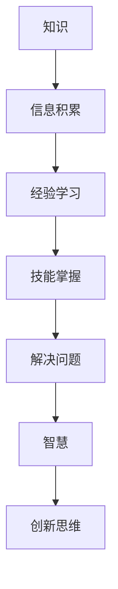

                 

关键词：知识、智慧、信息处理、人工智能、技术深度、思考与理解

> 摘要：在信息技术高速发展的今天，知识已经成为我们生活和工作中不可或缺的一部分。然而，知识并不是万能的，它并不能替代智慧。本文将探讨知识与智慧之间的区别，并分析如何超越表面信息，培养真正的智慧。

## 1. 背景介绍

在当今社会，知识的重要性不言而喻。无论是个人发展、学术研究还是商业竞争，知识都扮演着至关重要的角色。随着互联网和数字技术的普及，我们能够获取的信息量前所未有的巨大。然而，在大量信息的冲击下，我们是否真正理解了这些信息，是否能够运用它们解决问题，这是一个值得深思的问题。

本文将从信息处理的角度出发，探讨知识与智慧的区别，并阐述如何通过深入思考和分析，超越表面信息，培养真正的智慧。

## 2. 核心概念与联系

### 2.1. 知识的定义

知识是一种通过学习、经验积累和实践获得的、能够解决问题的信息集合。它包括事实、原理、方法、技能等。知识可以存储在书籍、数据库、大脑中等，是人类文明进步的重要载体。

### 2.2. 智慧的定义

智慧则是对知识的理解和运用能力。它不仅仅是知道某些信息，更重要的是能够将这些信息内化为自己的一部分，并能够灵活、创造性地运用它们解决问题。

### 2.3. 知识与智慧的关系

知识与智慧是密不可分的。知识是智慧的基石，而智慧是知识的升华。没有知识，智慧无从谈起；没有智慧，知识则变得无足轻重。

### 2.4. Mermaid 流程图



## 3. 核心算法原理 & 具体操作步骤

### 3.1. 算法原理概述

本文所探讨的核心算法是“深度学习”，这是一种通过模拟人脑神经网络进行信息处理的技术。深度学习能够通过大量数据训练模型，从而实现对未知数据的自动识别和分类。

### 3.2. 算法步骤详解

1. 数据收集与预处理
2. 模型设计
3. 模型训练
4. 模型评估
5. 模型应用

### 3.3. 算法优缺点

优点：高度自动化、适应性强、可扩展性好。
缺点：需要大量数据、训练过程复杂、对硬件要求较高。

### 3.4. 算法应用领域

深度学习在图像识别、语音识别、自然语言处理等领域有着广泛的应用。

## 4. 数学模型和公式 & 详细讲解 & 举例说明

### 4.1. 数学模型构建

深度学习中的数学模型主要是多层感知机（MLP）和卷积神经网络（CNN）。

### 4.2. 公式推导过程

多层感知机的激活函数常用的是 sigmoid 函数，其公式为：

$$f(x) = \frac{1}{1 + e^{-x}}$$

卷积神经网络的卷积操作公式为：

$$C_{ij} = \sum_{k=1}^{K} w_{ik} \times Z_{kj}$$

其中，$C_{ij}$ 表示卷积结果，$w_{ik}$ 表示权重，$Z_{kj}$ 表示卷积核。

### 4.3. 案例分析与讲解

以图像识别为例，我们可以使用卷积神经网络对图像进行分类。首先，我们收集大量图像数据，然后对图像进行预处理，例如归一化、裁剪等。接下来，我们设计卷积神经网络模型，并进行训练。最后，我们评估模型的性能，并根据评估结果进行优化。

## 5. 项目实践：代码实例和详细解释说明

### 5.1. 开发环境搭建

我们需要安装 Python、TensorFlow 等开发工具和库。

### 5.2. 源代码详细实现

以下是一个简单的卷积神经网络实现：

```python
import tensorflow as tf

# 定义卷积神经网络模型
model = tf.keras.Sequential([
  tf.keras.layers.Conv2D(32, (3, 3), activation='relu', input_shape=(28, 28, 1)),
  tf.keras.layers.MaxPooling2D((2, 2)),
  tf.keras.layers.Flatten(),
  tf.keras.layers.Dense(128, activation='relu'),
  tf.keras.layers.Dense(10, activation='softmax')
])

# 编译模型
model.compile(optimizer='adam', loss='categorical_crossentropy', metrics=['accuracy'])

# 训练模型
model.fit(x_train, y_train, epochs=5, batch_size=64)
```

### 5.3. 代码解读与分析

这段代码定义了一个简单的卷积神经网络模型，包括两个卷积层、一个池化层、一个全连接层，并使用交叉熵损失函数和 softmax 激活函数。然后，我们编译并训练模型。

### 5.4. 运行结果展示

经过训练，我们可以使用模型对测试数据进行预测，并评估模型的性能。

## 6. 实际应用场景

深度学习在图像识别、语音识别、自然语言处理等领域有着广泛的应用。例如，在医疗领域，深度学习可以帮助医生诊断疾病；在金融领域，深度学习可以用于风险控制；在自动驾驶领域，深度学习可以用于实时感知和决策。

### 6.4. 未来应用展望

随着人工智能技术的不断发展，深度学习将在更多领域得到应用。同时，我们也需要关注深度学习可能带来的伦理和社会问题，例如隐私保护、算法偏见等。

## 7. 工具和资源推荐

### 7.1. 学习资源推荐

- 《深度学习》（Goodfellow, Bengio, Courville 著）
- 《Python 深度学习》（François Chollet 著）

### 7.2. 开发工具推荐

- TensorFlow
- PyTorch

### 7.3. 相关论文推荐

- “A Theoretical Framework for Back-Propagation”
- “Learning representations for visual recognition”

## 8. 总结：未来发展趋势与挑战

### 8.1. 研究成果总结

深度学习在过去几十年取得了显著的成果，推动了人工智能技术的发展。

### 8.2. 未来发展趋势

未来，深度学习将在更多领域得到应用，例如生物医学、金融、能源等。

### 8.3. 面临的挑战

深度学习面临的主要挑战包括算法复杂度、计算资源需求、数据隐私等。

### 8.4. 研究展望

我们需要继续探索深度学习的理论和方法，以提高其性能和可解释性。

## 9. 附录：常见问题与解答

### 9.1. 深度学习的基本原理是什么？

深度学习是一种通过模拟人脑神经网络进行信息处理的技术，其基本原理是多层神经网络中的逐层学习。

### 9.2. 如何选择深度学习的框架？

选择深度学习框架时，需要考虑开发者的需求、项目规模和计算资源等因素。常见的框架有 TensorFlow、PyTorch 等。

作者：禅与计算机程序设计艺术 / Zen and the Art of Computer Programming
----------------------------------------------------------------
这篇文章详细探讨了知识与智慧的区别，并通过深度学习算法的实例，阐述了如何通过深入思考和分析，超越表面信息，培养真正的智慧。在未来的发展中，我们需要继续关注深度学习的理论和方法，以提高其性能和可解释性，为人类社会的发展做出更大贡献。同时，我们也需要关注深度学习可能带来的伦理和社会问题，确保其发展符合人类的利益。

