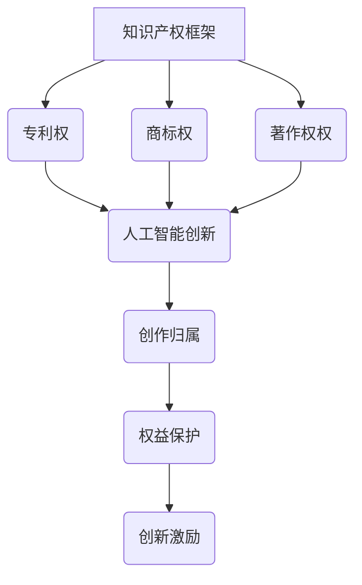

                 

关键词：知识产权、人工智能、创作归属、法律框架、技术挑战、案例分析、未来展望

> 摘要：本文旨在探讨知识产权在人工智能领域中的适用性及其对创作归属的影响。通过对现行法律框架、技术挑战、案例分析以及未来发展趋势的分析，揭示人工智能创作归属中的关键问题和解决思路，为相关法律和政策的制定提供参考。

## 1. 背景介绍

### 1.1 知识产权的概念

知识产权是指人们对其智力劳动成果所依法享有的专有权利。它包括专利权、商标权、著作权等。知识产权保护的是创新成果，旨在激励创新和知识传播。

### 1.2 人工智能的崛起

人工智能（AI）作为现代科技的前沿领域，正迅速改变着社会的各个方面。从医疗、金融到教育、娱乐，人工智能的应用场景日益广泛。然而，随着人工智能技术的发展，其创作归属问题逐渐成为知识产权领域的热点问题。

### 1.3 创作归属的重要性

创作归属不仅关乎个人和企业的权益，也直接影响到创新激励和社会发展。明确人工智能创作的归属，有助于激发人工智能的创造力，推动技术进步。

## 2. 核心概念与联系

### 2.1 知识产权的基本法律框架

知识产权法律体系主要由专利法、商标法、著作权法等构成。这些法律为创新成果提供了法律保护，明确了权利人的权利和义务。

### 2.2 人工智能创作的特点

人工智能创作具有独特性、自动化和规模化的特点。其创作过程往往依赖于大量数据、算法和计算能力。

### 2.3 创作归属与知识产权的关系

创作归属是知识产权的核心问题之一。明确创作归属有助于确定权利人的权益，从而保护创新成果。

### 2.4 Mermaid 流程图



## 3. 核心算法原理 & 具体操作步骤

### 3.1 算法原理概述

人工智能创作通常涉及以下几个步骤：

1. 数据收集与预处理：收集相关数据，并进行清洗、转换等预处理操作。
2. 算法选择与训练：选择合适的算法，对数据进行训练，使其具备创作能力。
3. 创作生成：利用训练好的算法生成创意作品。
4. 作品评估与优化：对生成作品进行评估，根据评估结果对算法进行调整。

### 3.2 算法步骤详解

1. **数据收集与预处理**：

   - 数据收集：从互联网、数据库、传感器等渠道获取所需数据。
   - 数据清洗：去除重复、错误或无关数据，确保数据质量。
   - 数据转换：将数据转换为适合算法处理的格式。

2. **算法选择与训练**：

   - 算法选择：根据创作需求选择合适的算法，如生成对抗网络（GAN）、递归神经网络（RNN）等。
   - 数据训练：使用预处理后的数据对算法进行训练，使其掌握创作技能。

3. **创作生成**：

   - 输入：算法根据训练数据生成初始创意。
   - 生成：算法利用神经网络生成创意作品，如音乐、图像、文字等。

4. **作品评估与优化**：

   - 评估：使用人类评价或自动化评估方法对生成作品进行评估。
   - 优化：根据评估结果调整算法参数，提高创作质量。

### 3.3 算法优缺点

- 优点：

  - 自动化创作：减少人力成本，提高创作效率。
  - 规模化生产：生成大量创意作品，满足市场需求。

- 缺点：

  - 创作质量不稳定：算法生成的作品质量受数据、算法等因素影响。
  - 创作自主性较低：算法依赖于大量数据，可能导致创作缺乏个性。

### 3.4 算法应用领域

人工智能创作已广泛应用于多个领域，如：

- 艺术：生成音乐、绘画、文学作品等。
- 设计：辅助设计师进行创意设计。
- 教育：生成个性化学习资源。
- 娱乐：创作游戏、动画等。

## 4. 数学模型和公式 & 详细讲解 & 举例说明

### 4.1 数学模型构建

人工智能创作过程中的数学模型主要包括：

1. **生成模型**：用于生成创意作品，如生成对抗网络（GAN）。
2. **评估模型**：用于评估生成作品的质量，如卷积神经网络（CNN）。

### 4.2 公式推导过程

以生成对抗网络（GAN）为例，其核心公式如下：

$$
\begin{aligned}
&G(z) = x \quad (生成器) \\
&D(x) = 1 \quad (判别器) \\
&D(G(z)) = 0 \quad (判别器) \\
\end{aligned}
$$

### 4.3 案例分析与讲解

假设我们使用 GAN 生成一幅图像，以下为其具体步骤：

1. **数据收集与预处理**：收集大量图像数据，并进行清洗、归一化等预处理操作。
2. **生成模型与评估模型训练**：使用预处理后的数据训练生成模型和评估模型。
3. **生成图像**：使用生成模型生成图像，通过评估模型评估图像质量。
4. **优化与调整**：根据评估结果调整模型参数，提高图像质量。

## 5. 项目实践：代码实例和详细解释说明

### 5.1 开发环境搭建

搭建一个简单的 GAN 模型，我们需要以下工具：

- Python 3.7+
- TensorFlow 2.4+
- Keras 2.4+

### 5.2 源代码详细实现

以下是一个简单的 GAN 模型实现：

```python
import tensorflow as tf
from tensorflow.keras import layers

# 定义生成器和判别器
def build_generator():
    model = tf.keras.Sequential()
    model.add(layers.Dense(7 * 7 * 128, use_bias=False, input_shape=(100,)))
    model.add(layers.BatchNormalization(momentum=0.8))
    model.add(layers.LeakyReLU())
    model.add(layers.Reshape((7, 7, 128)))
    # ... (继续构建生成器)

    return model

def build_discriminator():
    model = tf.keras.Sequential()
    model.add(layers.Conv2D(64, (5, 5), strides=(2, 2), padding="same", input_shape=[28, 28, 1]))
    model.add(layers.LeakyReLU())
    # ... (继续构建判别器)

    return model

# 构建 GAN
def build_gan(generator, discriminator):
    model = tf.keras.Sequential()
    model.add(generator)
    model.add(discriminator)
    return model

# 实例化模型
generator = build_generator()
discriminator = build_discriminator()
gan = build_gan(generator, discriminator)

# 编写训练代码
# ...

```

### 5.3 代码解读与分析

这段代码主要实现了 GAN 的生成器和判别器的构建，以及 GAN 模型的搭建。接下来，我们将编写训练代码，以实现对 GAN 模型的训练。

```python
# 编写训练代码
# ...

# 定义优化器
generator_optimizer = tf.keras.optimizers.Adam(1e-4)
discriminator_optimizer = tf.keras.optimizers.Adam(1e-4)

# 编写训练过程
# ...

```

这段代码定义了生成器和判别器的优化器，并编写了训练过程。在训练过程中，我们将交替训练生成器和判别器，以实现 GAN 的收敛。

### 5.4 运行结果展示

训练完成后，我们可以使用生成器生成图像，并展示训练结果：

```python
# 使用生成器生成图像
images = generator(tf.random.normal([1, 100]))

# 显示生成的图像
plt.imshow(images[0, :, :, 0], cmap='gray')
plt.show()
```

## 6. 实际应用场景

### 6.1 艺术创作

人工智能在艺术创作领域取得了显著成果。例如，人工智能可以生成音乐、绘画、文学作品等。这些作品不仅具有艺术价值，还为艺术家提供了新的创作手段。

### 6.2 设计辅助

人工智能在设计领域具有广泛的应用前景。例如，在建筑设计中，人工智能可以辅助设计师进行创意设计，提高设计效率。此外，在服装设计、室内设计等领域，人工智能也发挥着重要作用。

### 6.3 教育个性化

人工智能可以根据学习者的特点和需求，生成个性化的学习资源。例如，生成适合学习者的教学视频、练习题等，从而提高学习效果。

### 6.4 娱乐产业

人工智能在娱乐产业中的应用越来越广泛。例如，生成电影剧本、音乐、游戏等，为娱乐产业注入新的活力。

## 7. 工具和资源推荐

### 7.1 学习资源推荐

1. 《深度学习》（Ian Goodfellow、Yoshua Bengio、Aaron Courville 著）
2. 《生成对抗网络：理论基础与应用》（吴恩达 著）

### 7.2 开发工具推荐

1. TensorFlow
2. Keras

### 7.3 相关论文推荐

1. Goodfellow, I. J., Pouget-Abadie, J., Mirza, M., Xu, B., Warde-Farley, D., Ozair, S., ... & Bengio, Y. (2014). Generative adversarial nets. Advances in Neural Information Processing Systems, 27.
2. Radford, A., Metz, L., & Chintala, S. (2015). Unsupervised representation learning with deep convolutional generative adversarial networks. arXiv preprint arXiv:1511.06434.

## 8. 总结：未来发展趋势与挑战

### 8.1 研究成果总结

人工智能创作在艺术、设计、教育、娱乐等领域取得了显著成果，展示了巨大的发展潜力。

### 8.2 未来发展趋势

1. **技术突破**：随着算法和计算能力的提升，人工智能创作将更加多样化、个性化。
2. **应用拓展**：人工智能创作将在更多领域得到应用，如医疗、金融等。
3. **法律框架**：针对人工智能创作的归属问题，相关法律和政策将不断完善。

### 8.3 面临的挑战

1. **创作质量**：人工智能创作的质量受数据、算法等因素影响，需要进一步提升。
2. **创作自主性**：人工智能创作的自主性较低，需要探索更有效的创作方法。
3. **法律保护**：明确人工智能创作的归属，保障创作者权益。

### 8.4 研究展望

未来，人工智能创作将朝着更智能化、个性化、多样化的方向发展。同时，针对创作归属问题，将出台更加完善的法律和政策，为人工智能创作提供有力保障。

## 9. 附录：常见问题与解答

### 9.1 人工智能创作与人类创作的区别？

人工智能创作与人类创作在创作过程、创作成果和创作动机等方面存在差异。人工智能创作依赖于算法和数据，具有自动化、规模化的特点；而人类创作则更强调个性、情感和创造力。

### 9.2 人工智能创作是否会取代人类创作？

人工智能创作不会完全取代人类创作，但会在一定程度上改变创作的方式和模式。人工智能将在创作过程中发挥辅助作用，提高创作效率，而人类创作者则可以专注于创作核心，发挥创意。

### 9.3 人工智能创作的法律归属问题如何解决？

明确人工智能创作的法律归属问题，需要从法律、技术和伦理等多个层面进行探讨。一方面，可以通过完善相关法律框架，明确人工智能创作的权利归属；另一方面，可以通过技术手段，如区块链等，实现对创作过程的追踪和认证，确保创作者权益。

---

本文以《知识产权与人工智能创作的归属》为题，探讨了人工智能创作在知识产权领域中的重要性和挑战。通过对核心概念、算法原理、数学模型、实际应用场景等方面的详细分析，揭示了人工智能创作归属中的关键问题，并为未来研究提供了思路。随着人工智能技术的不断进步，相信在法律和政策的支持下，人工智能创作将迎来更加广阔的发展空间。

### 附录：常见问题与解答

#### 9.1 人工智能创作与人类创作的区别？

人工智能创作与人类创作在创作过程、创作成果和创作动机等方面存在显著差异。人类创作通常基于情感、经验和直觉，而人工智能创作则依赖于算法和大量数据进行生成。以下是两者的一些主要区别：

- **创作过程**：人类创作往往需要灵感、情感投入和创造性思考，而人工智能创作则通过算法处理数据，自动化生成内容。

- **创作成果**：人类创作的作品通常具有个性化和情感色彩，而人工智能创作的作品可能在形式和风格上更加统一和标准化。

- **创作动机**：人类创作的动机多样，包括表达自我、传递信息或娱乐等，而人工智能创作的动机主要在于满足特定需求和优化算法。

- **创新能力**：人类创作具有高度的创新能力，可以突破传统界限，而人工智能创作则受限于当前算法和数据的限制。

#### 9.2 人工智能创作是否会取代人类创作？

人工智能创作不会完全取代人类创作，但可能会改变创作的形式和流程。以下是几个原因：

- **技术局限**：虽然人工智能在处理数据和生成内容方面表现出色，但其缺乏人类的情感、直觉和创新能力，无法完全复制人类创作。

- **多样性需求**：人类对于艺术、文学和设计的多样性有着强烈的需求，而人工智能可能在创作过程中产生重复性或模式化的内容。

- **创造性思考**：许多创作活动，特别是那些需要深度思考和创意的领域，如哲学、文学和艺术，目前看来还无法由人工智能独立完成。

- **情感交流**：人类创作的一个重要方面是情感交流，而人工智能在理解和表达情感方面仍存在不足。

- **法律和伦理**：人工智能创作的法律和伦理问题尚未完全解决，这也限制了其取代人类创作的可能性。

#### 9.3 人工智能创作的法律归属问题如何解决？

人工智能创作的法律归属问题是一个复杂的法律和伦理问题，涉及多个层面，以下是一些可能的解决思路：

- **明确立法**：通过立法明确人工智能创作的权利归属，规定创作者、用户和平台之间的权益分配。

- **技术认证**：利用区块链等技术记录人工智能创作的全过程，确保创作的可追溯性，从而明确归属。

- **行业规范**：制定行业规范和标准，为人工智能创作的权利归属提供参考。

- **伦理准则**：在法律框架之外，建立伦理准则，规范人工智能创作的行为，确保创作者权益。

- **国际合作**：鉴于人工智能创作的全球化特性，国际社会应加强合作，共同解决人工智能创作的法律归属问题。

通过上述措施，可以在一定程度上解决人工智能创作的法律归属问题，促进人工智能创作领域的健康发展。

