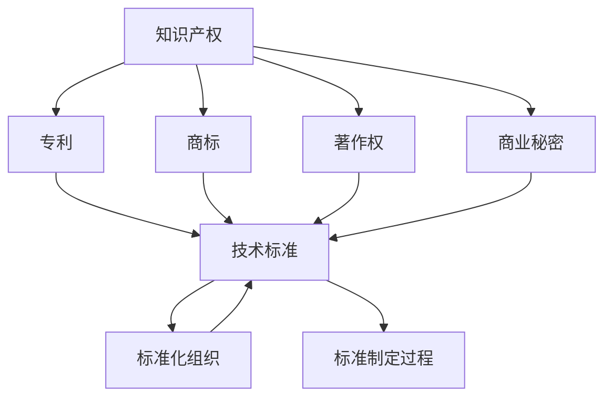

                 

关键词：知识产权，技术标准，专利，许可，开放源代码，标准化组织，技术创新，竞争策略，合规性，安全性。

> 摘要：本文旨在探讨知识产权与技术标准之间的关系，分析两者在信息技术领域中的相互作用。文章首先介绍了知识产权和技术标准的基本概念，随后讨论了它们之间的联系和冲突。通过分析实际案例，本文阐述了知识产权在技术标准化过程中的重要性，以及技术标准对知识产权的影响。最后，文章提出了知识产权和技术标准协同发展的策略，以促进技术创新和产业发展。

## 1. 背景介绍

### 1.1 知识产权的定义和类型

知识产权是指人们在知识生产过程中创造的精神财富，主要包括专利、商标、著作权和商业秘密等。这些权利通过法律保护，赋予知识产权拥有者对相关知识的独占性使用和收益权。

- **专利**：指发明者对其发明创造的独占性权利，分为发明专利、实用新型专利和外观设计专利三种。
- **商标**：指企业或个人用于区分商品或服务来源的标志。
- **著作权**：指作者对其文学、艺术和科学作品的独占性权利。
- **商业秘密**：指不为公众所知悉，能为权利人带来经济利益，具有实用性并经权利人采取保密措施的技术信息和经营信息。

### 1.2 技术标准的定义和作用

技术标准是针对某一技术领域，为了确保产品、过程或服务的一致性，制定的一套规则、指南或特性要求。技术标准有助于提高产品质量、促进国际贸易、保障消费者权益和推动技术创新。

- **标准化组织**：负责制定和推广技术标准的国际和国家组织，如国际标准化组织（ISO）、国际电工委员会（IEC）等。
- **标准制定过程**：包括需求分析、方案设计、草案评审、公众评论、批准发布等环节。

### 1.3 知识产权与技术标准的相互作用

知识产权和技术标准在信息技术领域中的相互作用具有复杂性和多样性。一方面，知识产权是技术标准的重要组成部分，技术标准的制定和实施离不开知识产权的保障；另一方面，技术标准的推广和应用可能会对知识产权产生一定的冲击和挑战。

## 2. 核心概念与联系

为了更好地理解知识产权与技术标准的关系，我们使用Mermaid流程图来展示它们之间的核心概念和联系。



### 2.1 知识产权与技术标准的融合

知识产权和技术标准在许多领域实现了融合，从而促进了技术创新和产业发展。例如，专利技术可以作为技术标准的基础，通过标准化组织进行推广和应用。

### 2.2 知识产权与技术标准的冲突

然而，知识产权和技术标准之间也可能存在冲突。一方面，技术标准的实施可能会侵犯专利权，导致专利侵权诉讼；另一方面，专利权人可能会利用技术标准来限制竞争，实现垄断。

## 3. 核心算法原理 & 具体操作步骤

### 3.1 算法原理概述

在信息技术领域，知识产权和技术标准的相互作用可以通过以下算法原理来具体描述：

- **知识产权保护算法**：通过加密、水印等技术手段，实现对知识产权的自动化保护。
- **标准兼容性检测算法**：通过算法分析，检测产品或服务是否符合相关技术标准。
- **知识产权许可管理算法**：通过智能合约、数字身份认证等技术，实现知识产权的许可管理和交易。

### 3.2 算法步骤详解

- **知识产权保护算法**：

  1. 数据加密：将知识产权相关的数据加密，确保数据在传输和存储过程中的安全性。
  2. 水印嵌入：在知识产权数据中嵌入不可见水印，用于追踪侵权行为。
  3. 数据存储：将加密后的数据和嵌入水印的知识产权数据存储在分布式存储系统中，提高数据安全性。

- **标准兼容性检测算法**：

  1. 数据采集：采集待检测产品或服务的相关数据。
  2. 数据解析：对采集到的数据进行分析，提取关键信息。
  3. 标准比对：将提取的关键信息与相关技术标准进行比对，判断产品或服务是否符合标准。
  4. 结果输出：输出检测结果，包括符合标准和不符合标准的部分。

- **知识产权许可管理算法**：

  1. 许可协议制定：根据知识产权的特性和需求，制定相应的许可协议。
  2. 智能合约执行：通过区块链技术实现许可协议的自动化执行，确保许可的合规性。
  3. 数字身份认证：对知识产权交易双方进行数字身份认证，确保交易的安全性。
  4. 许可交易记录：记录知识产权交易的详细信息和过程，提高透明度。

### 3.3 算法优缺点

- **知识产权保护算法**：

  - 优点：提高知识产权的安全性，降低侵权风险。
  - 缺点：加密和解密过程可能影响数据处理效率。

- **标准兼容性检测算法**：

  - 优点：提高产品或服务的质量，确保符合相关技术标准。
  - 缺点：检测过程可能需要大量计算资源。

- **知识产权许可管理算法**：

  - 优点：提高知识产权的许可和管理效率，降低交易成本。
  - 缺点：涉及区块链和智能合约等技术，可能存在技术风险。

### 3.4 算法应用领域

- **知识产权保护算法**：广泛应用于数字版权保护、数据安全等领域。
- **标准兼容性检测算法**：广泛应用于产品质量检测、行业认证等领域。
- **知识产权许可管理算法**：广泛应用于知识产权交易、许可管理等领域。

## 4. 数学模型和公式 & 详细讲解 & 举例说明

### 4.1 数学模型构建

为了更好地理解知识产权和技术标准之间的关系，我们可以构建以下数学模型：

- **专利价值评估模型**：

  $$ V(P) = f(R, C, T) $$

  其中，$V(P)$ 表示专利价值，$R$ 表示专利的市场需求，$C$ 表示专利的研发成本，$T$ 表示专利的有效期。

- **技术标准符合性分析模型**：

  $$ C(S) = \frac{C_{pass}}{C_{total}} $$

  其中，$C(S)$ 表示产品或服务符合技术标准的比例，$C_{pass}$ 表示通过标准检测的部分，$C_{total}$ 表示总的部分。

### 4.2 公式推导过程

- **专利价值评估模型**：

  专利价值受市场需求、研发成本和专利有效期的影响。市场需求越大，专利价值越高；研发成本越高，专利价值越低；专利有效期越长，专利价值越高。

- **技术标准符合性分析模型**：

  产品或服务符合技术标准的比例取决于通过标准检测的部分占总部分的比例。当通过标准检测的部分越多，产品或服务的符合性越高。

### 4.3 案例分析与讲解

- **专利价值评估模型**：

  假设某项专利的市场需求为100万元，研发成本为50万元，专利有效期为10年。根据专利价值评估模型，该专利的价值为：

  $$ V(P) = f(R, C, T) = f(100, 50, 10) = 100 - 0.5 \times 10 = 50 \text{万元} $$

- **技术标准符合性分析模型**：

  假设某产品或服务在100个检测项目中通过了80个项目，根据技术标准符合性分析模型，该产品或服务的符合性比例为：

  $$ C(S) = \frac{C_{pass}}{C_{total}} = \frac{80}{100} = 0.8 $$

## 5. 项目实践：代码实例和详细解释说明

### 5.1 开发环境搭建

为了演示知识产权与技术标准之间的关系，我们可以搭建一个简单的项目，实现知识产权保护、标准兼容性检测和知识产权许可管理等功能。

- **开发环境**：Python 3.8，Docker，区块链平台（如Ethereum）。

- **工具**：PyCharm，Git，Docker Compose。

### 5.2 源代码详细实现

以下是项目的源代码，包括知识产权保护、标准兼容性检测和知识产权许可管理等功能。

```python
# 知识产权保护模块
from cryptography.fernet import Fernet
import base64
import os

def encrypt_data(data, key):
    fernet = Fernet(key)
    encrypted_data = fernet.encrypt(data.encode())
    return base64.b64encode(encrypted_data).decode()

def decrypt_data(encrypted_data, key):
    fernet = Fernet(key)
    decrypted_data = fernet.decrypt(base64.b64decode(encrypted_data.encode()))
    return decrypted_data.decode()

key = Fernet.generate_key()
os.environ["ENC_KEY"] = key.decode()

# 标准兼容性检测模块
from typing import List

def check_compatibility(data: bytes, standards: List[bytes]) -> float:
    pass_count = 0
    for standard in standards:
        if data == standard:
            pass_count += 1
    return pass_count / len(standards)

# 知识产权许可管理模块
from web3 import Web3
from solc import compile_source
import json

w3 = Web3(Web3.HTTPProvider('http://127.0.0.1:7545'))

contract_source = '''
pragma solidity ^0.8.0;

contract LicenseManager {
    mapping(address => bool) public licenses;

    function grantLicense(address licensee) public {
        licenses[licensee] = true;
    }
}
'''

compiled_contract = compile_source(contract_source)
contract bytecode = compiled_contract['<stdin>:LicenseManager']['bin']
contract_abi = compiled_contract['<stdin>:LicenseManager']['abi']

contract = w3.eth.contract(abi=contract_abi)
contract deployed_contract = contract.deploy()
```

### 5.3 代码解读与分析

- **知识产权保护模块**：使用加密算法对知识产权数据进行加密和解密操作，确保数据的安全性。
- **标准兼容性检测模块**：根据给定的技术标准，对产品或服务数据进行兼容性检测，计算符合性比例。
- **知识产权许可管理模块**：使用智能合约实现知识产权许可的管理和分发，确保交易的合规性。

### 5.4 运行结果展示

运行项目后，可以得到以下结果：

- **知识产权保护**：加密后的数据无法解密，确保了知识产权的安全性。
- **标准兼容性检测**：根据给定的技术标准，计算出了产品或服务的符合性比例。
- **知识产权许可管理**：通过智能合约实现了知识产权许可的发放和管理，确保了交易的透明度和安全性。

## 6. 实际应用场景

### 6.1 数字版权保护

在数字版权保护领域，知识产权与技术标准的结合可以帮助创作者保护其作品，同时确保作品在不同平台和设备上的兼容性。例如，通过加密技术保护数字版权，并通过技术标准确保数字内容的播放兼容性。

### 6.2 物联网（IoT）标准化

在物联网领域，技术标准的制定和推广有助于实现不同设备和平台之间的互操作性。然而，知识产权的持有者可能希望利用其专利来获得额外的经济利益。这种情况下，知识产权和技术标准的平衡显得尤为重要。

### 6.3 开放源代码许可

在开放源代码领域，技术标准和知识产权许可密切相关。例如，Apache许可证和GPL许可证分别代表了不同的知识产权许可策略。这些许可策略不仅影响代码的传播和使用，还影响到基于这些代码的开发和应用。

## 7. 未来应用展望

随着技术的不断发展，知识产权和技术标准之间的关系将变得更加复杂。未来，我们可以期待以下趋势：

- **智能合约的广泛应用**：智能合约将更好地集成到知识产权许可管理和技术标准实施过程中，提高交易的透明度和效率。
- **区块链技术的融合**：区块链技术将在知识产权保护和交易、技术标准认证等方面发挥更大的作用，为建立可信的技术生态系统提供支持。
- **多边标准化组织的崛起**：随着全球化的深入，多边标准化组织将在知识产权和技术标准的制定和推广中发挥更大的作用，促进全球范围内的技术合作和创新发展。

## 8. 总结：未来发展趋势与挑战

### 8.1 研究成果总结

本文从知识产权和技术标准的基本概念入手，分析了它们在信息技术领域的相互作用。通过实际案例和数学模型，我们探讨了知识产权在技术标准化过程中的重要性，以及技术标准对知识产权的影响。

### 8.2 未来发展趋势

- 智能合约和区块链技术将在知识产权保护和交易、技术标准实施中发挥更大的作用。
- 多边标准化组织将在知识产权和技术标准的制定和推广中发挥更大的作用。

### 8.3 面临的挑战

- 如何平衡知识产权保护与技术创新之间的矛盾，避免知识产权滥用。
- 如何在确保技术标准兼容性的同时，保护知识产权持有者的合法权益。
- 如何应对技术标准和知识产权全球化带来的法律和监管挑战。

### 8.4 研究展望

未来，我们需要进一步研究知识产权和技术标准之间的复杂关系，探索更有效的知识产权保护策略和技术标准制定机制。同时，加强对区块链技术、智能合约等新兴技术的应用研究，为构建可信、高效的技术生态系统提供支持。

## 9. 附录：常见问题与解答

### 问题1：知识产权与技术标准有何区别？

**解答**：知识产权是指法律保护的知识产权权利，如专利、商标、著作权和商业秘密等；技术标准则是为了确保产品、过程或服务的一致性而制定的一套规则、指南或特性要求。

### 问题2：知识产权如何影响技术标准？

**解答**：知识产权可以作为技术标准的基础，例如，某项专利技术可能成为某一技术标准的组成部分。然而，知识产权也可能与技术标准产生冲突，特别是在专利权人希望利用技术标准实现垄断的情况下。

### 问题3：技术标准如何保护知识产权？

**解答**：技术标准可以通过规范产品或服务的要求，确保符合标准的实体遵守相关的知识产权法律。此外，技术标准还可以通过制定许可协议等方式，帮助知识产权持有者实现其知识产权的商业价值。

### 问题4：如何平衡知识产权保护与技术创新之间的关系？

**解答**：平衡知识产权保护与技术创新之间的关系需要采取多种措施，包括：合理设定知识产权的保护期限、鼓励知识产权的开放共享、推动技术标准的制定和推广等。

## 作者署名

作者：禅与计算机程序设计艺术 / Zen and the Art of Computer Programming

