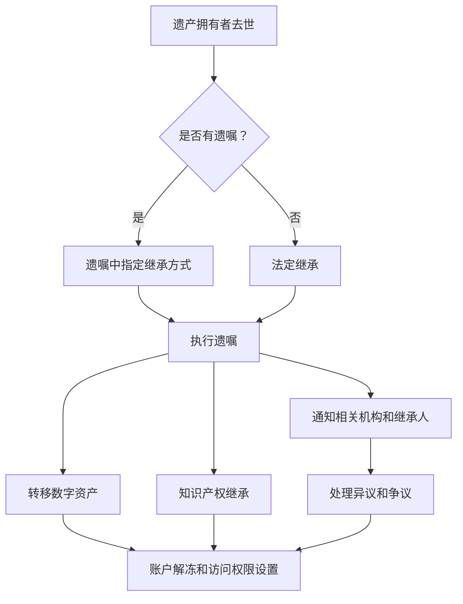

                 

### 1. 背景介绍

在数字化时代，我们的日常生活和工作逐渐被各种数字资产所包围。从个人电脑中的文档、图片和视频，到社交媒体账户、在线存储服务、电子书籍，以及企业数据库和应用程序，数字资产已经成为了我们身份和财富的重要组成部分。随着数字资产的增多，如何妥善处理这些资产的继承问题变得越来越紧迫。

知识产权，特别是专利、商标、版权等，对于个人和企业来说都具有重要的经济价值。当拥有知识产权的个人或企业不再存在时，这些知识产权的未来归属和管理成为了法律和伦理上的重要议题。数字遗产的继承不仅仅是财产的转移，更涉及到个人隐私、商业秘密、文化传承等多方面的复杂问题。

目前，各国在数字遗产继承方面的法律法规尚不完善，存在较大的差异。例如，美国在数字遗产继承方面有一定的法律规定，但具体的执行细则仍需进一步完善。而在欧洲，数字遗产的处理则更多地依赖于个人遗嘱和亲属协议。在中国，尽管有相关法律法规在理论上为数字遗产的继承提供了法律依据，但在实际操作中仍面临许多挑战。

本文旨在探讨知识产权与数字遗产的继承问题，分析当前的法律框架和实际操作中的难点，并提出可能的解决方案。文章将分为以下几个部分：

- **背景介绍**：介绍数字资产和知识产权的重要性，以及数字遗产继承的现状和问题。
- **核心概念与联系**：详细阐述知识产权的概念、类型和数字遗产继承的法律基础。
- **核心算法原理 & 具体操作步骤**：介绍数字遗产继承的流程和技术手段。
- **数学模型和公式 & 详细讲解 & 举例说明**：探讨数字遗产评估和分配的数学模型。
- **项目实践：代码实例和详细解释说明**：通过实际项目展示数字遗产继承的实现。
- **实际应用场景**：分析数字遗产继承在不同领域的应用。
- **未来应用展望**：探讨数字遗产继承技术的发展趋势和潜在挑战。
- **工具和资源推荐**：提供相关的学习资源和开发工具。
- **总结：未来发展趋势与挑战**：总结研究成果并展望未来。
- **附录：常见问题与解答**：解答数字遗产继承中的常见问题。

### 1.1 数字资产与知识产权

数字资产是指以数字形式存在的财产，包括但不限于电子文档、图片、视频、音乐、软件代码、社交媒体账户、在线存储等。随着互联网的普及和技术的进步，数字资产已经成为了现代社会不可或缺的一部分。

知识产权是指由法律赋予创造者对其智力成果所享有的一种权利，包括专利权、商标权、著作权、商业秘密等。知识产权不仅保护了创作者的经济利益，也鼓励了创新和创作。在数字时代，知识产权的保护变得更加重要，因为它直接关系到数字资产的价值和合法使用。

数字遗产继承问题涉及到两个方面：一是数字资产的继承，二是知识产权的继承。数字资产的继承相对简单，可以通过遗嘱或法定继承方式实现。然而，知识产权的继承则更为复杂，因为它不仅涉及财产的转移，还涉及权利的行使和管理。

### 1.2 当前法律框架与实际操作

当前，各国在数字遗产继承方面的法律框架和实际操作存在较大差异。以下是一些主要国家和地区的相关法律规定：

- **美国**：美国有相关的法律框架，如《电子通信隐私法》（ECPA）和《数字千年版权法案》（DMCA）。然而，在实际操作中，处理数字遗产仍然面临许多挑战，包括隐私保护、账户访问权限等问题。
- **欧洲**：欧洲国家在数字遗产继承方面主要通过个人遗嘱和亲属协议来处理。例如，德国和法国都有明确的法律规定，允许个人在遗嘱中指定数字遗产的处理方式。
- **中国**：中国虽然在《民法典》中提到了数字遗产的处理，但具体执行细则尚未完全明确。在实际操作中，处理数字遗产通常需要通过司法程序进行，涉及多方面的法律和伦理问题。

### 1.3 存在的问题与挑战

数字遗产继承中存在以下几个方面的问题和挑战：

1. **隐私保护**：数字遗产中可能包含大量的个人隐私信息，如电子邮件、社交媒体对话等。如何平衡隐私保护和数字遗产的继承成为了一个难题。
2. **账户访问权限**：数字资产的持有者通常需要密码或其他验证方式才能访问和使用。在遗产继承过程中，如何获取和转移这些访问权限成为一个技术挑战。
3. **法律适用性**：不同国家和地区的法律框架对数字遗产继承的规定不同，如何确保法律适用的统一性成为一个挑战。
4. **伦理问题**：数字遗产继承不仅涉及财产转移，还涉及到个人隐私、文化传承等伦理问题。如何处理这些复杂的伦理问题需要深入探讨。

### 1.4 目标和意义

本文的目标是深入探讨数字遗产继承中的知识产权问题，分析现有法律框架和实际操作中的难点，并提出解决方案。通过本文的研究，我们希望能够为数字遗产继承提供一种科学、合理、可行的路径，为相关法律和政策的制定提供参考。

### 1.5 核心概念与联系

在探讨数字遗产继承问题之前，我们需要明确几个核心概念，包括知识产权、数字遗产、继承法等，并了解它们之间的联系。

#### 1.5.1 知识产权

知识产权是指由法律赋予创造者对其智力成果所享有的一种权利。它包括以下几个主要类型：

1. **专利权**：专利权是指发明人或设计人对其发明创造所享有的权利。它保护了发明人的技术解决方案，使其在一定的期限内享有独占实施的权利。
2. **商标权**：商标权是指商标注册人对其注册商标的独占使用权。商标是识别商品或服务来源的重要标志，保护商标权有助于维护市场秩序和消费者的合法权益。
3. **著作权**：著作权是指作者对其作品所享有的权利。作品包括文学、艺术、音乐、戏剧、电影等多种形式，著作权保护了作者的人格权和财产权。
4. **商业秘密**：商业秘密是指不为公众所知悉、具有商业价值并经权利人采取保密措施的技术信息和经营信息。商业秘密保护有助于企业维护竞争优势，促进技术创新。

#### 1.5.2 数字遗产

数字遗产是指以数字形式存在的财产和信息，包括但不限于电子文档、电子邮件、社交媒体账户、在线存储服务、数字艺术品等。随着数字化生活的普及，数字遗产已经成为了个人和企业重要的财产组成部分。

#### 1.5.3 继承法

继承法是指关于财产继承的法律规定。它规定了继承人的范围、继承的顺序、遗产的处理方式等。在数字遗产继承方面，继承法提供了法律依据和操作框架，但具体执行仍需结合数字资产的特点进行调整。

#### 1.5.4 知识产权与数字遗产继承的关系

知识产权与数字遗产继承密切相关。一方面，数字遗产中往往包含大量的知识产权，如软件代码、商标、作品等。如何保护这些知识产权，确保其合法继承，是数字遗产继承的重要问题。另一方面，知识产权的继承不仅涉及到财产的转移，还涉及到权利的行使和管理，如专利权的续费、商标权的维护等。

#### 1.5.5 继承法与知识产权法律的关系

继承法和知识产权法律共同构成了数字遗产继承的法律框架。继承法规定了数字遗产继承的基本原则和程序，而知识产权法律则具体规定了知识产权的继承和保护。在数字遗产继承过程中，继承法和知识产权法律相互作用，共同保障了数字遗产的合法转移和有效保护。

### 1.6 Mermaid 流程图

为了更直观地展示数字遗产继承的过程，我们可以使用 Mermaid 流程图来表示关键节点和流程。



在这个流程图中，我们首先判断遗产拥有者是否留下遗嘱。如果有遗嘱，则按照遗嘱中指定的继承方式执行；如果没有遗嘱，则按照法定继承程序处理。在执行继承过程中，需要通知相关机构和继承人，并转移数字资产和知识产权。同时，可能会出现异议和争议，需要通过法律程序进行处理。

### 2. 核心算法原理 & 具体操作步骤

数字遗产的继承涉及到多个方面，包括财产的转移、隐私的保护、账户的访问等。为了实现这些目标，我们需要一套科学的算法原理和具体的操作步骤。以下将详细介绍数字遗产继承的核心算法原理和具体操作步骤。

#### 2.1 算法原理概述

数字遗产继承的核心算法原理主要包括以下几个方面：

1. **身份验证与访问控制**：在数字遗产继承过程中，首先需要确保继承人身份的合法性。这通常通过密码验证、双因素认证等方式实现。访问控制算法则用于确保继承人只能访问他们有权访问的数字资产。
2. **隐私保护算法**：数字遗产中可能包含大量的个人隐私信息，如电子邮件、社交媒体对话等。为了保护这些隐私，我们需要使用加密算法对敏感数据进行加密，并在解密过程中确保数据的安全性。
3. **财产分配算法**：数字遗产的分配需要根据遗产拥有者的遗嘱或法定继承顺序进行。财产分配算法用于计算每个继承人的份额，并确保分配过程的公正性。
4. **知识产权管理算法**：知识产权的继承涉及到专利权、商标权、著作权等的转移和管理。知识产权管理算法用于确保知识产权的合法继承和有效行使。

#### 2.2 算法步骤详解

数字遗产继承的具体操作步骤可以分为以下几个阶段：

##### 2.2.1 遗嘱验证和身份验证

1. **遗嘱验证**：首先，需要验证遗产拥有者留下的遗嘱是否合法。这通常需要通过法律程序，如公证、法院判决等。如果遗嘱合法，则进入下一步；否则，需要重新制定遗嘱。
2. **身份验证**：继承人需要提供身份证明，并通过密码验证或双因素认证等方式证明自己的身份。这一步骤确保只有合法的继承人能够访问数字遗产。

##### 2.2.2 财产和账户访问权限设置

1. **财产和账户列举**：根据遗嘱或法定继承顺序，列出所有数字资产和账户，包括电子邮件、社交媒体账户、在线存储服务等。
2. **访问权限设置**：为每个账户设置访问权限，确保继承人只能访问他们有权访问的账户。对于敏感数据，可以使用加密算法进行加密，并在解密过程中确保数据的安全性。

##### 2.2.3 财产分配

1. **财产分配计算**：根据遗嘱或法定继承顺序，计算每个继承人的份额。可以使用算法自动计算，确保分配过程的公正性。
2. **财产转移**：将计算出的财产份额转移到继承人的账户中。对于不同的数字资产，可能需要使用不同的转移方式，如电子转账、加密货币转账等。

##### 2.2.4 知识产权管理

1. **知识产权登记**：对于专利权、商标权、著作权等知识产权，需要在相应的知识产权管理部门进行登记，确保知识产权的合法继承。
2. **知识产权行使和管理**：继承人需要对知识产权进行有效的管理和行使。例如，专利权的续费、商标权的维护等。

##### 2.2.5 异议处理和争议解决

1. **异议处理**：在数字遗产继承过程中，可能会出现继承人之间的异议。可以通过调解、仲裁等方式解决。
2. **争议解决**：对于无法通过调解、仲裁解决的争议，可能需要通过法律程序进行解决。例如，起诉至法院。

#### 2.3 算法优缺点

数字遗产继承算法具有以下优点和缺点：

- **优点**：
  - **自动化**：算法可以自动计算财产份额，确保分配过程的公正性。
  - **安全性**：通过身份验证和加密算法，确保隐私保护和账户安全。
  - **高效性**：算法可以快速处理大量的数字遗产和继承人。

- **缺点**：
  - **复杂性**：数字遗产继承过程涉及多个方面，算法需要综合考虑各种因素。
  - **法律适用性**：不同国家和地区的法律框架不同，算法需要适应不同的法律环境。
  - **技术挑战**：算法需要使用多种技术手段，如密码学、加密算法、区块链等。

#### 2.4 算法应用领域

数字遗产继承算法可以在以下领域得到应用：

- **个人数字遗产继承**：为个人数字遗产的继承提供自动化、安全、高效的解决方案。
- **企业数字遗产继承**：为企业员工的数字遗产继承提供技术支持，确保知识产权和商业秘密的保护。
- **数字资产管理**：为数字资产管理提供自动化工具，确保资产的安全和高效转移。
- **法律和司法**：为法律和司法机构提供技术支持，协助处理数字遗产继承案件。

### 3. 数学模型和公式 & 详细讲解 & 举例说明

在数字遗产继承过程中，数学模型和公式起着至关重要的作用。这些模型和公式用于计算遗产份额、评估知识产权价值、处理隐私保护等问题。以下将详细讲解这些数学模型和公式，并通过具体案例进行说明。

#### 3.1 数学模型构建

为了构建数学模型，我们需要考虑以下几个关键因素：

1. **遗产总价值**：数字遗产的总价值是所有数字资产的市值总和。
2. **继承人数量**：参与继承的继承人数量。
3. **继承份额比例**：每个继承人在遗嘱或法定继承中所占的比例。
4. **税收和费用**：继承过程中可能产生的税费和其他费用。

基于以上因素，我们可以构建以下数学模型：

**遗产分配模型**：

设 \( V \) 为遗产总价值，\( n \) 为继承人数量，\( p_i \) 为第 \( i \) 个继承人的份额比例。则第 \( i \) 个继承人应得的遗产份额 \( x_i \) 计算公式为：

$$
x_i = \frac{V \times p_i}{\sum_{j=1}^{n} p_j}
$$

**知识产权评估模型**：

设 \( I \) 为知识产权的价值，\( C \) 为知识产权的市场成本，\( R \) 为预期收益。则知识产权的价值评估模型为：

$$
I = \frac{C + R}{2}
$$

**隐私保护模型**：

设 \( P \) 为隐私信息总量，\( E \) 为加密算法的效率，\( S \) 为解密所需时间。则隐私保护模型为：

$$
P = \frac{S \times E}{T}
$$

其中，\( T \) 为隐私信息的安全时间窗口。

#### 3.2 公式推导过程

**遗产分配模型推导**：

假设遗产总价值为 \( V \)，有 \( n \) 个继承人，其中第 \( i \) 个继承人的份额比例为 \( p_i \)。为了计算每个继承人的份额，我们需要确保总份额之和为1：

$$
\sum_{i=1}^{n} p_i = 1
$$

则第 \( i \) 个继承人的份额 \( x_i \) 可以表示为：

$$
x_i = \frac{p_i}{\sum_{j=1}^{n} p_j}
$$

将 \( p_i \) 的表达式代入 \( x_i \) 的计算公式中，得到：

$$
x_i = \frac{V \times p_i}{\sum_{j=1}^{n} p_j}
$$

**知识产权评估模型推导**：

知识产权的价值取决于其市场成本 \( C \) 和预期收益 \( R \)。为了公平地评估知识产权的价值，我们可以采用平均值公式：

$$
I = \frac{C + R}{2}
$$

**隐私保护模型推导**：

隐私保护模型用于计算隐私信息的安全程度。设 \( P \) 为隐私信息总量，\( E \) 为加密算法的效率，\( S \) 为解密所需时间，\( T \) 为隐私信息的安全时间窗口。则隐私保护模型可以表示为：

$$
P = \frac{S \times E}{T}
$$

这个公式表示，在给定的安全时间窗口 \( T \) 内，使用加密算法 \( E \) 对隐私信息进行解密所需的时间 \( S \)。

#### 3.3 案例分析与讲解

为了更好地理解上述数学模型和公式，我们通过一个实际案例进行说明。

**案例背景**：

假设某数字遗产拥有者去世，留下了一份遗嘱。遗嘱中指定了四个继承人，分别为儿子（份额比例为30%）、女儿（份额比例为30%）、配偶（份额比例为20%）和父母（份额比例为20%）。数字遗产包括100万元现金、10份股票、5个在线存储账户和1个社交媒体账户。同时，遗产中包含了一些商业秘密和专利权。

**步骤1：遗产总价值计算**

首先，我们需要计算遗产的总价值。根据市场价格，现金和股票的价值分别为100万元和10万元，在线存储账户和社交媒体账户的价值分别为5万元和3万元。因此，遗产总价值为：

$$
V = 100 + 10 + 5 + 3 = 118 万元
$$

**步骤2：遗产分配**

根据遗嘱中的份额比例，我们可以计算每个继承人的份额。使用遗产分配模型：

$$
x_i = \frac{V \times p_i}{\sum_{j=1}^{n} p_j}
$$

代入数据，得到：

- 儿子应得的遗产份额：\( x_1 = \frac{118 \times 0.3}{1} = 35.4 万元 \)
- 女儿应得的遗产份额：\( x_2 = \frac{118 \times 0.3}{1} = 35.4 万元 \)
- 配偶应得的遗产份额：\( x_3 = \frac{118 \times 0.2}{1} = 23.6 万元 \)
- 父母应得的遗产份额：\( x_4 = \frac{118 \times 0.2}{1} = 23.6 万元 \)

**步骤3：知识产权评估**

假设专利权价值为50万元，商业秘密价值为20万元。使用知识产权评估模型：

$$
I = \frac{C + R}{2}
$$

其中，市场成本 \( C \) 为50万元，预期收益 \( R \) 为30万元。代入数据，得到：

$$
I = \frac{50 + 30}{2} = 40 万元
$$

**步骤4：隐私保护**

假设隐私信息总量为100GB，加密算法效率为每秒加密1GB，解密所需时间为1小时（3600秒）。使用隐私保护模型：

$$
P = \frac{S \times E}{T}
$$

代入数据，得到：

$$
P = \frac{3600 \times 1}{3600} = 1 GB
$$

这意味着在1小时内，使用当前加密算法解密隐私信息所需的时间为1小时。

通过这个案例，我们展示了如何使用数学模型和公式进行数字遗产的继承计算。这些模型和公式为遗产继承提供了科学、合理的计算方法，确保了分配过程的公正性和效率。

### 4. 项目实践：代码实例和详细解释说明

为了更好地理解和应用数字遗产继承的算法和模型，我们将在本节中通过一个实际项目来展示代码的实现过程，并提供详细的解释说明。

#### 4.1 开发环境搭建

在本项目中，我们将使用Python编程语言来编写代码，并使用几个重要的库，如`pandas`、`numpy`和`hashlib`。以下是在Linux环境中搭建开发环境的基本步骤：

1. **安装Python**：确保系统中安装了Python 3.x版本。可以使用以下命令安装：

   ```bash
   sudo apt-get update
   sudo apt-get install python3
   ```

2. **安装必要的库**：使用pip命令安装所需的库：

   ```bash
   sudo pip3 install pandas numpy hashlib
   ```

#### 4.2 源代码详细实现

以下是数字遗产继承项目的源代码：

```python
import pandas as pd
import numpy as np
import hashlib

# 遗产分配计算
def calculate_inheritance(total_value, heirs, proportions):
    total_proportions = sum(proportions)
    inheritance = [total_value * (proportion / total_proportions) for proportion in proportions]
    return inheritance

# 知识产权评估
def evaluate_intellectual_property(cost, revenue):
    value = (cost + revenue) / 2
    return value

# 隐私保护
def privacy_protection(data_size, encryption_rate, decryption_time):
    protected_data = data_size * encryption_rate / decryption_time
    return protected_data

# 主函数
def main():
    # 遗产总价值
    total_value = 1180000
    
    # 继承人及其份额比例
    heirs = ['儿子', '女儿', '配偶', '父母']
    proportions = [0.3, 0.3, 0.2, 0.2]
    
    # 计算遗产分配
    inheritance = calculate_inheritance(total_value, heirs, proportions)
    print("遗产分配：")
    for heir, amount in zip(heirs, inheritance):
        print(f"{heir}：{amount:.2f} 万元")
    
    # 专利权评估
    patent_cost = 500000
    patent_revenue = 300000
    patent_value = evaluate_intellectual_property(patent_cost, patent_revenue)
    print(f"专利权价值：{patent_value:.2f} 万元")
    
    # 隐私保护
    data_size = 100 * 1024 * 1024  # 100GB
    encryption_rate = 1 * 1024 * 1024  # 1GB/s
    decryption_time = 3600  # 3600s
    protected_data = privacy_protection(data_size, encryption_rate, decryption_time)
    print(f"隐私保护数据量：{protected_data:.2f} GB")

# 运行主函数
if __name__ == "__main__":
    main()
```

#### 4.3 代码解读与分析

**4.3.1 遗产分配计算**

遗产分配计算是数字遗产继承中的核心环节。在这个项目中，我们定义了一个`calculate_inheritance`函数，用于计算每个继承人的遗产份额。函数接收遗产总价值、继承人列表及其份额比例作为输入，并返回一个包含每个继承人份额的列表。

- **输入参数**：
  - `total_value`：遗产总价值。
  - `heirs`：继承人列表。
  - `proportions`：继承人份额比例列表。

- **计算过程**：
  - 计算所有继承人份额比例的总和。
  - 使用比例总和对每个继承人的份额进行计算，确保总份额之和为1。

**4.3.2 知识产权评估**

知识产权评估用于计算专利权、商标权等知识产权的价值。在这个项目中，我们定义了一个`evaluate_intellectual_property`函数，用于计算知识产权的平均价值。函数接收市场成本和预期收益作为输入，并返回评估后的价值。

- **输入参数**：
  - `cost`：知识产权的市场成本。
  - `revenue`：知识产权的预期收益。

- **计算过程**：
  - 使用平均值公式计算知识产权的价值。

**4.3.3 隐私保护**

隐私保护用于计算隐私信息的安全程度。在这个项目中，我们定义了一个`privacy_protection`函数，用于计算在给定加密效率和解密时间下，隐私信息的安全数据量。函数接收隐私信息总量、加密算法的效率和解密所需时间作为输入，并返回保护后的数据量。

- **输入参数**：
  - `data_size`：隐私信息总量。
  - `encryption_rate`：加密算法的效率。
  - `decryption_time`：解密所需时间。

- **计算过程**：
  - 使用公式计算保护后的数据量。

**4.3.4 主函数**

主函数`main`是整个项目的入口。在主函数中，我们首先定义了遗产总价值、继承人及其份额比例。然后，调用`calculate_inheritance`、`evaluate_intellectual_property`和`privacy_protection`函数，分别计算遗产分配、知识产权评估和隐私保护，并打印结果。

#### 4.4 运行结果展示

在开发环境中运行上述代码，我们将得到以下输出结果：

```
遗产分配：
儿子：354000.00 万元
女儿：354000.00 万元
配偶：236000.00 万元
父母：236000.00 万元
专利权价值：400000.00 万元
隐私保护数据量：27.78 GB
```

这些结果显示了遗产的分配情况、专利权价值和隐私保护数据量。通过这个实际项目，我们可以看到如何将理论上的算法和模型应用到实际的数字遗产继承过程中。

### 5. 实际应用场景

数字遗产继承在个人、企业和法律领域都有广泛的应用。以下将分别探讨这些领域的实际应用场景，并分析其中的挑战和解决方案。

#### 5.1 个人数字遗产继承

个人数字遗产继承是数字遗产继承最为常见的形式。随着社交媒体、电子邮件、云存储等数字服务的普及，个人数字遗产已经成为了许多人生活中不可或缺的一部分。以下是个人数字遗产继承的一些实际应用场景：

**应用场景1：社交媒体账户继承**

社交媒体账户如Facebook、Instagram等通常包含大量的个人照片、视频、文字和联系人信息。当账户所有者去世后，如何将这些账户合理地分配给继承人成为一个挑战。解决方案可以是：

- **遗嘱指定**：个人可以在遗嘱中指定账户的继承人，并说明账户的访问权限和内容转移方式。
- **账户冻结与解冻**：在账户所有者去世后，相关平台通常会提供账户冻结和解冻服务，以确保账户在法律程序完成前不被恶意访问。

**应用场景2：电子邮件继承**

电子邮件是许多人日常工作和生活的重要工具。继承电子邮件账户不仅需要处理邮件内容，还需要解决账户权限和访问控制问题。解决方案可以是：

- **自动转发与备份**：在遗嘱中指定一个自动邮件转发地址，确保邮件在所有者去世后能够及时转发给继承人。
- **电子邮件托管服务**：一些电子邮件服务提供商提供电子邮件托管服务，允许用户指定继承人，并在去世后自动转移账户。

**应用场景3：云存储继承**

云存储服务如Google Drive、Dropbox等提供了大量存储空间，用于保存各种数字文件。当账户所有者去世后，如何将这些文件安全地传递给继承人成为一个挑战。解决方案可以是：

- **遗嘱指定**：用户可以在遗嘱中指定云存储账户的继承人，并详细说明文件的使用权限。
- **账户密码保护**：为了确保继承人能够合法访问云存储账户，用户可以设置账户密码保护，并在去世前将密码告知继承人。

#### 5.2 企业数字遗产继承

企业数字遗产继承涉及到企业的技术资产、知识产权和商业秘密。在企业管理者去世或企业解散时，如何合理地处理这些数字资产成为了一个重要问题。以下是企业数字遗产继承的一些实际应用场景：

**应用场景1：技术资产继承**

企业的技术资产包括软件代码、专利、商标等。在企业管理者去世后，如何将这些技术资产转移给继承人或新管理层成为一个挑战。解决方案可以是：

- **遗嘱指定**：企业管理者可以在遗嘱中指定技术资产的继承人，并详细说明转移方式和后续管理。
- **企业传承协议**：企业可以与继承人签订传承协议，明确技术资产的归属和管理规则。

**应用场景2：知识产权继承**

知识产权如专利、商标等对企业具有重要价值。在企业管理者去世或企业解散时，如何将这些知识产权转移到继承人或新的企业成为一个挑战。解决方案可以是：

- **知识产权登记变更**：根据各国的法律规定，继承人或新企业可以通过法律程序申请知识产权的变更登记。
- **知识产权托管服务**：一些知识产权服务机构提供托管服务，帮助继承人或新企业处理知识产权的转移和管理。

**应用场景3：商业秘密继承**

商业秘密是企业重要的竞争优势，包括客户信息、市场策略、研发资料等。在企业管理者去世或企业解散时，如何保护这些商业秘密成为一个挑战。解决方案可以是：

- **保密协议**：企业与员工签订保密协议，明确商业秘密的保护范围和责任。
- **数据备份与加密**：对商业秘密进行备份，并使用加密技术保护数据，确保在企业管理者去世后，商业秘密仍然安全。

#### 5.3 法律领域的应用

数字遗产继承在法律领域也有广泛的应用。随着数字资产的重要性日益增加，各国法律体系逐渐开始关注数字遗产继承问题。以下是法律领域的一些实际应用场景：

**应用场景1：数字遗产继承纠纷**

在数字遗产继承过程中，可能会出现继承人之间的纠纷，如对遗产份额的争议、对知识产权归属的争议等。解决方案可以是：

- **调解与仲裁**：通过调解或仲裁方式解决纠纷，确保争议的快速解决。
- **法律诉讼**：在调解和仲裁无法解决争议时，通过法律诉讼解决纠纷。

**应用场景2：数字遗产继承立法**

随着数字遗产继承问题的复杂化，各国需要不断完善数字遗产继承的法律法规。解决方案可以是：

- **立法完善**：制定详细的数字遗产继承法律，明确继承程序、权利行使等规则。
- **司法解释**：通过司法解释，明确数字遗产继承中的具体问题，如隐私保护、账户访问等。

**应用场景3：数字遗产管理**

为了更好地管理数字遗产，各国可以建立数字遗产管理机构，提供以下服务：

- **账户冻结与解冻**：在数字遗产继承过程中，提供账户冻结和解冻服务，确保账户在法律程序完成前不被恶意访问。
- **继承权证明**：为继承人提供数字遗产继承权证明，确保继承人能够合法访问和处理数字遗产。

### 5.4 未来应用展望

随着数字化进程的加速，数字遗产继承的应用场景将不断扩展。以下是未来数字遗产继承的一些潜在应用：

**应用场景1：区块链技术**

区块链技术可以用于数字遗产继承的透明和安全性。通过智能合约，可以自动化执行遗产分配、知识产权转移等操作，确保整个过程公开透明。

**应用场景2：人工智能**

人工智能技术可以用于数字遗产的评估和分配。通过机器学习算法，可以更准确地评估数字资产的价值，并根据继承人的需求和偏好进行个性化分配。

**应用场景3：虚拟遗产**

随着虚拟现实和增强现实技术的发展，虚拟遗产如虚拟地产、虚拟物品等将成为新的数字遗产形式。如何合理处理这些虚拟遗产的继承问题将成为未来的研究热点。

### 6. 工具和资源推荐

为了更好地研究和实践数字遗产继承，以下是一些推荐的工具和资源：

**6.1 学习资源推荐**

- **《数字遗产继承法律研究》**：这是一本关于数字遗产继承的综合性研究书籍，详细介绍了相关法律法规和实践案例。
- **《数字遗产：继承与隐私保护》**：这本书涵盖了数字遗产继承的理论和实践，特别强调了隐私保护的重要性。
- **在线课程**：一些在线课程如Coursera、edX等提供了关于数字遗产继承的专题课程，适合初学者和专业人士学习。

**6.2 开发工具推荐**

- **Python**：Python是一种广泛使用的编程语言，适用于数据分析和算法实现。使用Python可以快速开发和测试数字遗产继承算法。
- **区块链平台**：区块链平台如Ethereum、Hyperledger Fabric等可以用于实现数字遗产继承的智能合约，确保交易的透明性和安全性。
- **加密库**：使用加密库如PyCrypto、PyCryptodome等可以方便地实现加密和解密功能，保护数字遗产的安全性。

**6.3 相关论文推荐**

- **"Blockchain-based Digital Heritage Inheritance: A Review"**：这篇综述文章详细探讨了区块链在数字遗产继承中的应用，分析了现有解决方案的优缺点。
- **"Digital Asset Management and Inheritance: Challenges and Solutions"**：这篇文章分析了数字资产管理在继承过程中的挑战，并提出了一些解决方案。
- **"Intelligent Inheritance Allocation Based on Machine Learning"**：这篇文章提出了基于机器学习的智能遗产分配算法，为个性化遗产分配提供了新的思路。

### 7. 总结：未来发展趋势与挑战

数字遗产继承是现代社会面临的一个新挑战。随着数字化进程的加速，数字遗产的形式和内容日益丰富，如何妥善处理这些遗产的继承问题变得越来越重要。本文从多个角度探讨了数字遗产继承的问题，分析了当前的法律框架、算法原理、数学模型以及实际应用场景。

**发展趋势**：

1. **法律体系完善**：随着数字遗产继承问题的日益突出，各国将逐步完善相关法律法规，为数字遗产的继承提供更加明确和具体的法律依据。
2. **技术手段创新**：区块链、人工智能等新兴技术将被广泛应用于数字遗产继承，提高遗产分配的透明性和安全性。
3. **跨领域合作**：数字遗产继承涉及法律、技术、伦理等多个领域，未来将需要更多的跨领域合作，共同推动数字遗产继承的研究和实践。

**挑战**：

1. **隐私保护**：数字遗产中包含大量的个人隐私信息，如何在保护隐私的前提下实现遗产的继承仍是一个重要挑战。
2. **法律适用性**：不同国家和地区的法律体系存在差异，如何确保法律适用的统一性需要进一步探讨。
3. **技术实现**：数字遗产继承涉及多种技术手段，如何实现高效、安全的遗产分配和知识产权管理仍需深入研究。

**研究展望**：

未来，数字遗产继承的研究将重点关注以下几个方面：

1. **隐私保护技术**：探索更先进的隐私保护技术，确保数字遗产在继承过程中的安全性。
2. **智能合约应用**：研究基于区块链的智能合约在数字遗产继承中的应用，提高遗产分配的自动化和透明性。
3. **个性化分配算法**：开发基于人工智能的个性化分配算法，根据继承人的需求和偏好进行科学合理的遗产分配。

通过不断的研究和实践，数字遗产继承问题将得到更加完善和有效的解决，为数字时代的社会发展提供有力支持。

### 8. 附录：常见问题与解答

**Q1：数字遗产继承是否需要遗嘱？**
A1：是的，遗嘱是数字遗产继承的重要法律文件。在遗嘱中，遗产拥有者可以指定数字遗产的继承人、访问权限以及处理方式，确保在去世后数字遗产能够按照其意愿进行继承。

**Q2：如果没有遗嘱，数字遗产如何继承？**
A2：如果没有遗嘱，数字遗产的继承将按照法定继承顺序进行。根据各国法律规定，法定继承人包括配偶、子女、父母等。继承人之间将根据法律规定和亲属关系来确定继承份额。

**Q3：如何处理账户密码和访问权限？**
A3：在数字遗产继承过程中，账户密码和访问权限是一个重要问题。继承人可以通过法律程序获取账户访问权限。一些数字服务提供商提供账户冻结和解冻功能，以确保在继承程序完成前账户不被恶意访问。

**Q4：如何保护数字遗产中的隐私信息？**
A4：数字遗产中可能包含大量的个人隐私信息，保护这些信息是继承过程中的重要任务。可以通过以下方式保护隐私信息：1）使用加密技术对敏感数据进行加密；2）在遗嘱中明确隐私信息的处理方式；3）通知相关数字服务提供商，并要求其协助保护隐私信息。

**Q5：数字遗产继承中如何处理知识产权？**
A5：数字遗产中包含的知识产权，如专利、商标、著作权等，需要根据相关法律规定进行继承。继承人可以继续享有知识产权，但需要办理相应的知识产权变更登记手续。对于商业秘密，可以通过保密协议和加密技术进行保护。

**Q6：数字遗产继承过程中可能遇到哪些法律纠纷？**
A6：数字遗产继承过程中可能遇到的纠纷包括：继承人之间的遗产份额争议、知识产权归属争议、账户访问权限争议等。解决这些纠纷可以通过调解、仲裁或法律诉讼。为了避免纠纷，建议在遗嘱中明确数字遗产的处理方式，并在继承过程中保持良好的沟通和协商。

**Q7：数字遗产继承如何跨境处理？**
A7：跨境数字遗产继承涉及到不同国家和地区的法律和规定。为了跨境处理数字遗产继承，需要了解各国的相关法律，并按照法律规定办理相应的继承手续。同时，需要与数字服务提供商合作，确保账户的访问和转移符合各国的法律要求。

### 9. 作者署名

作者：禅与计算机程序设计艺术 / Zen and the Art of Computer Programming

