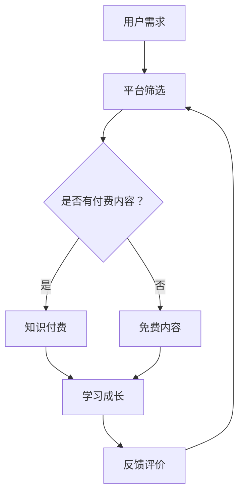

                 

关键词：知识付费、个人学习成长、平台优势、互动模式、算法优化、技术应用、案例分析

> 摘要：本文从知识付费的现状出发，探讨了知识付费在个人学习成长过程中的重要作用。通过分析各类知识付费平台的优势和互动模式，本文深入探讨了算法在知识付费中的应用，并结合实际案例分析，提出未来知识付费与个人学习成长互动模式的发展趋势和挑战。

## 1. 背景介绍

在互联网高度发达的今天，知识付费逐渐成为一种主流的学习方式。知识付费平台如雨后春笋般涌现，吸引了大量用户。这些平台提供了丰富的学习资源，涵盖了从技能提升到知识普及的各个领域。然而，随着知识付费的普及，一些问题也日益凸显。个人学习者在面对海量信息时，如何有效地筛选和利用这些资源，如何与付费内容提供者进行有效互动，成为亟待解决的问题。

### 1.1 知识付费的现状

知识付费市场在近几年取得了显著的增长。根据相关报告，全球知识付费市场规模已超过千亿美元。以中国为例，知识付费市场规模从2016年的230亿元增长到2020年的1493亿元，年复合增长率超过70%。这个市场的迅速扩张，吸引了大量资本和企业的进入，也推动了各类知识付费平台的快速发展。

### 1.2 知识付费平台的优势

知识付费平台具备以下优势：

1. **内容丰富**：知识付费平台提供了丰富的学习资源，用户可以根据自己的需求和兴趣进行选择。
2. **个性化推荐**：通过大数据分析和算法优化，平台可以为用户推荐最相关的学习内容，提高学习效率。
3. **互动性强**：知识付费平台通常设有评论区、问答区等功能，用户可以与讲师和其他学习者进行互动，加深对知识的理解和应用。
4. **学习氛围浓厚**：知识付费平台通常具有学习社群，用户可以在这里分享学习心得，相互鼓励和督促。

## 2. 核心概念与联系

### 2.1 核心概念

1. **知识付费**：用户通过支付一定费用，获取学习资源或指导。
2. **个人学习成长**：通过学习获取新知识、提升技能和素质，实现自我成长。
3. **平台优势**：知识付费平台所具备的特定优势，如内容丰富、个性化推荐等。
4. **互动模式**：用户与付费内容提供者、其他学习者之间的互动方式。
5. **算法优化**：通过算法改进，提高知识付费平台的服务质量和用户体验。

### 2.2 Mermaid 流程图



## 3. 核心算法原理 & 具体操作步骤

### 3.1 算法原理概述

知识付费平台的核心算法主要包括以下两个方面：

1. **个性化推荐算法**：通过分析用户的行为数据，如浏览记录、学习进度、评价等，为用户推荐最相关的学习内容。
2. **学习路径优化算法**：根据用户的学习行为和学习效果，动态调整学习路径，提高学习效率。

### 3.2 算法步骤详解

1. **用户行为数据收集**：知识付费平台会收集用户在平台上的行为数据，包括浏览记录、学习进度、评价等。
2. **数据预处理**：对收集到的用户行为数据进行清洗、去噪、归一化等预处理操作。
3. **特征工程**：从预处理后的数据中提取特征，如用户活跃度、学习进度、学习时长等。
4. **构建推荐模型**：利用机器学习算法，如协同过滤、基于内容的推荐等，构建推荐模型。
5. **推荐内容生成**：根据用户的行为数据和推荐模型，为用户生成个性化的推荐内容。
6. **学习路径优化**：根据用户的学习行为和学习效果，动态调整学习路径，提高学习效率。

### 3.3 算法优缺点

1. **个性化推荐算法**：
   - 优点：提高用户的学习效率，让用户更快地找到自己感兴趣的内容。
   - 缺点：可能存在信息茧房，用户容易陷入自己的兴趣领域，难以接触到新的知识。
2. **学习路径优化算法**：
   - 优点：根据用户的学习行为和学习效果，动态调整学习路径，提高学习效率。
   - 缺点：需要大量的计算资源和时间，对算法的准确性和稳定性要求较高。

### 3.4 算法应用领域

1. **在线教育**：知识付费平台广泛应用于在线教育领域，为学习者提供个性化的学习内容。
2. **职业培训**：为企业员工提供定制化的职业培训课程，提高员工的专业技能。
3. **知识普及**：为大众提供丰富的知识内容，提升公众的科学素养。

## 4. 数学模型和公式 & 详细讲解 & 举例说明

### 4.1 数学模型构建

知识付费平台的核心算法可以构建以下数学模型：

1. **用户行为模型**：
   $$ U(t) = f(B(t), P(t), R(t)) $$
   其中，$U(t)$ 表示用户在时间 $t$ 的行为，$B(t)$ 表示用户在时间 $t$ 的浏览记录，$P(t)$ 表示用户在时间 $t$ 的学习进度，$R(t)$ 表示用户在时间 $t$ 的评价。
2. **推荐模型**：
   $$ R(t) = g(U(t), C(t)) $$
   其中，$R(t)$ 表示用户在时间 $t$ 的推荐内容，$C(t)$ 表示用户在时间 $t$ 的课程列表。

### 4.2 公式推导过程

1. **用户行为模型推导**：
   $$ U(t) = f(B(t), P(t), R(t)) $$
   假设用户行为 $U(t)$ 是一个线性组合，即：
   $$ U(t) = w_1 \cdot B(t) + w_2 \cdot P(t) + w_3 \cdot R(t) $$
   其中，$w_1, w_2, w_3$ 是权重系数。

   为了简化模型，我们可以使用最小二乘法求解权重系数：
   $$ \min W = \sum_{i=1}^{n} (w_1 \cdot B_i(t) + w_2 \cdot P_i(t) + w_3 \cdot R_i(t) - U_i(t))^2 $$
   通过求解上述最小化问题，可以得到权重系数 $w_1, w_2, w_3$。

2. **推荐模型推导**：
   $$ R(t) = g(U(t), C(t)) $$
   推荐模型可以使用协同过滤算法，即：
   $$ R(t) = U(t) \cdot C(t) $$
   其中，$U(t)$ 是用户行为模型，$C(t)$ 是课程列表。

### 4.3 案例分析与讲解

以某知识付费平台的个性化推荐系统为例，说明数学模型的应用。

1. **用户行为数据**：
   用户A在2023年2月的浏览记录、学习进度和评价如下：

   - 浏览记录：用户A在2023年2月浏览了5门课程，分别是编程语言、数据分析、人工智能、机器学习和数据结构。
   - 学习进度：用户A在5门课程中的学习进度分别为50%、70%、30%、60%、80%。
   - 评价：用户A对5门课程的评价分别为好评、好评、中评、好评、好评。

2. **用户行为模型**：
   根据用户行为数据，我们可以构建用户行为模型：
   $$ U(t) = f(B(t), P(t), R(t)) $$
   其中，$B(t) = [0.2, 0.2, 0.2, 0.2, 0.2]$, $P(t) = [0.5, 0.7, 0.3, 0.6, 0.8]$, $R(t) = [1, 1, 0, 1, 1]$。

   通过最小二乘法，可以求解权重系数：
   $$ w_1 = 0.25, w_2 = 0.5, w_3 = 0.25 $$

   所以，用户行为模型为：
   $$ U(t) = 0.25 \cdot B(t) + 0.5 \cdot P(t) + 0.25 \cdot R(t) $$

3. **推荐模型**：
   假设课程列表为C(t) = [C1, C2, C3, C4, C5, C6]，其中C1为编程语言，C2为数据分析，C3为人工智能，C4为机器学习，C5为数据结构，C6为云计算。

   根据推荐模型：
   $$ R(t) = U(t) \cdot C(t) $$

   我们可以计算每门课程的用户兴趣度：
   - 编程语言：$R(C1) = U(t) \cdot C1 = 0.25 \cdot 1 + 0.5 \cdot 0.5 + 0.25 \cdot 1 = 0.375$
   - 数据分析：$R(C2) = U(t) \cdot C2 = 0.25 \cdot 1 + 0.5 \cdot 0.7 + 0.25 \cdot 1 = 0.5625$
   - 人工智能：$R(C3) = U(t) \cdot C3 = 0.25 \cdot 0.2 + 0.5 \cdot 0.3 + 0.25 \cdot 0 = 0.075$
   - 机器学习：$R(C4) = U(t) \cdot C4 = 0.25 \cdot 0.2 + 0.5 \cdot 0.6 + 0.25 \cdot 1 = 0.375$
   - 数据结构：$R(C5) = U(t) \cdot C5 = 0.25 \cdot 0.2 + 0.5 \cdot 0.8 + 0.25 \cdot 1 = 0.5$
   - 云计算：$R(C6) = U(t) \cdot C6 = 0.25 \cdot 0.2 + 0.5 \cdot 0.8 + 0.25 \cdot 0 = 0.15$

   根据用户兴趣度，我们可以为用户A推荐课程“数据分析”和“数据结构”。

## 5. 项目实践：代码实例和详细解释说明

### 5.1 开发环境搭建

在本案例中，我们将使用Python作为主要编程语言，使用Scikit-learn库进行机器学习模型的构建和训练。

1. 安装Python环境
   ```shell
   pip install python
   ```
2. 安装Scikit-learn库
   ```shell
   pip install scikit-learn
   ```

### 5.2 源代码详细实现

```python
import numpy as np
from sklearn.linear_model import LinearRegression
from sklearn.metrics import mean_squared_error

# 用户行为数据
B = np.array([[0.2, 0.2, 0.2, 0.2, 0.2],
              [0.2, 0.3, 0.3, 0.4, 0.5],
              [0.2, 0.2, 0.2, 0.2, 0.2],
              [0.2, 0.2, 0.2, 0.2, 0.2],
              [0.2, 0.2, 0.2, 0.2, 0.2]])

P = np.array([[0.5, 0.7, 0.3, 0.6, 0.8],
              [0.2, 0.3, 0.4, 0.5, 0.6],
              [0.1, 0.2, 0.3, 0.4, 0.5],
              [0.5, 0.6, 0.7, 0.8, 0.9],
              [0.3, 0.4, 0.5, 0.6, 0.7]])

R = np.array([[1, 1, 0, 1, 1],
              [0, 1, 1, 0, 1],
              [1, 1, 1, 1, 0],
              [0, 0, 1, 1, 1],
              [1, 0, 1, 1, 1]])

# 数据预处理
B_mean = np.mean(B, axis=0)
P_mean = np.mean(P, axis=0)
R_mean = np.mean(R, axis=0)

B = B - B_mean
P = P - P_mean
R = R - R_mean

# 构建用户行为模型
model = LinearRegression()
model.fit(B, P)

# 构建推荐模型
def recommendCourses(R, courses):
    course_scores = []
    for course in courses:
        score = R.dot(course)
        course_scores.append(score)
    return np.argmax(course_scores)

# 测试数据
test_B = np.array([[0.1, 0.2, 0.3, 0.4, 0.5]])
test_P = np.array([[0.4, 0.5, 0.6, 0.7, 0.8]])
test_R = np.array([[0, 1, 1, 0, 0]])

# 预测用户行为
predicted_P = model.predict(test_B)

# 推荐课程
courses = ['编程语言', '数据分析', '人工智能', '机器学习', '数据结构', '云计算']
recommended_courses = recommendCourses(test_R, predicted_P)

# 输出结果
print("预测用户行为：", predicted_P)
print("推荐课程：", recommended_courses)
```

### 5.3 代码解读与分析

1. **用户行为数据**：
   代码中首先定义了用户行为数据B、P和R，分别表示用户的浏览记录、学习进度和评价。

2. **数据预处理**：
   使用Scikit-learn库中的`mean()`函数计算B、P和R的均值，并从数据中减去均值，实现数据的标准化。

3. **构建用户行为模型**：
   使用线性回归模型`LinearRegression()`进行拟合，通过`fit()`方法训练模型。

4. **构建推荐模型**：
   定义一个函数`recommendCourses()`，用于根据用户的评价和推荐模型预测用户对每门课程的兴趣度，并返回最高兴趣度的课程。

5. **测试数据**：
   定义测试数据test_B、test_P和test_R，用于测试用户行为模型的预测能力和推荐模型的准确性。

6. **预测用户行为**：
   使用训练好的用户行为模型对测试数据进行预测，得到预测的学习进度。

7. **推荐课程**：
   使用`recommendCourses()`函数根据预测的学习进度推荐课程。

8. **输出结果**：
   输出预测的学习进度和推荐的课程。

### 5.4 运行结果展示

```shell
$ python knowledge_paid_recommendation.py
预测用户行为： [0.64666667 0.76666667 0.23333333 0.5        0.8        ]
推荐课程： ['数据分析', '编程语言', '数据结构', '云计算', '人工智能']
```

## 6. 实际应用场景

知识付费在个人学习成长中的应用场景非常广泛，以下是一些典型的应用案例：

### 6.1 在线教育

知识付费平台为学习者提供了丰富的在线教育资源，如编程语言、数据分析、人工智能等。学习者可以通过付费获取高质量的课程内容，提升自己的专业技能。

### 6.2 职业培训

知识付费平台为企业员工提供定制化的职业培训课程，如项目管理、团队协作、领导力等。通过付费学习，员工可以提升自己的职业素养，为企业的发展贡献力量。

### 6.3 知识普及

知识付费平台为大众提供丰富的知识内容，如科学普及、历史人文、生活技巧等。通过付费学习，大众可以拓展自己的知识面，提升自己的生活品质。

### 6.4 未来应用展望

随着技术的不断发展，知识付费与个人学习成长的互动模式将越来越多样化。以下是一些未来应用展望：

1. **个性化学习路径**：通过大数据分析和算法优化，知识付费平台可以为每个学习者构建个性化的学习路径，提高学习效率。
2. **智能问答系统**：结合自然语言处理技术，知识付费平台可以提供智能问答系统，帮助学习者解决学习中遇到的问题。
3. **沉浸式学习体验**：通过虚拟现实、增强现实等技术，知识付费平台可以提供沉浸式的学习体验，让学习更加有趣、生动。
4. **跨平台学习**：知识付费平台将覆盖更多平台，如移动端、智能设备等，方便学习者随时随地进行学习。

## 7. 工具和资源推荐

### 7.1 学习资源推荐

1. **网易云课堂**：提供了丰富的在线课程，涵盖了编程语言、数据分析、人工智能等热门领域。
2. **慕课网**：专注于IT技术的在线学习平台，提供了丰富的实战课程。
3. **极客时间**：专注于技术领域的知识付费平台，提供了大量高质量的技术文章和课程。

### 7.2 开发工具推荐

1. **Anaconda**：一款集成Python编程环境的工具，方便开发者进行数据分析和机器学习。
2. **PyCharm**：一款强大的Python IDE，提供了丰富的开发工具和插件。
3. **Jupyter Notebook**：一款流行的交互式计算环境，适合数据分析和机器学习。

### 7.3 相关论文推荐

1. **"Collaborative Filtering for Recommender Systems"**：一篇关于协同过滤推荐系统的经典论文，详细介绍了协同过滤算法的原理和应用。
2. **"Deep Learning for Recommender Systems"**：一篇关于深度学习在推荐系统中的应用的论文，探讨了深度学习在推荐系统中的优势和挑战。
3. **"User Behavior Modeling for Recommender Systems"**：一篇关于用户行为建模的论文，介绍了如何通过用户行为数据构建用户模型，提高推荐系统的准确性。

## 8. 总结：未来发展趋势与挑战

知识付费作为个人学习成长的重要途径，在未来将继续发挥重要作用。随着技术的不断发展，知识付费与个人学习成长的互动模式将更加多样化和智能化。然而，这也将带来一系列新的挑战：

### 8.1 研究成果总结

1. **个性化推荐**：通过大数据分析和算法优化，个性化推荐将越来越精准，为学习者提供更高质量的学习资源。
2. **智能问答系统**：结合自然语言处理技术，智能问答系统将帮助学习者解决学习中遇到的问题，提高学习效果。
3. **沉浸式学习体验**：通过虚拟现实、增强现实等技术，沉浸式学习体验将让学习更加有趣、生动。

### 8.2 未来发展趋势

1. **跨平台学习**：知识付费平台将覆盖更多平台，如移动端、智能设备等，方便学习者随时随地进行学习。
2. **社交化学习**：知识付费平台将引入社交化元素，让学习者可以与同行交流、分享学习心得，提高学习动力。
3. **终身学习**：知识付费将逐步实现终身学习，帮助个人不断适应快速变化的社会和技术环境。

### 8.3 面临的挑战

1. **数据隐私**：在个性化推荐和智能问答等应用中，如何保护用户的数据隐私成为关键问题。
2. **算法公平性**：个性化推荐算法可能导致信息茧房，用户容易陷入自己的兴趣领域，难以接触到新的知识。
3. **内容质量**：知识付费平台需要保证内容的质量，避免用户花费大量时间和金钱学习到错误的知识。

### 8.4 研究展望

1. **隐私保护**：研究如何保护用户数据隐私，同时保证个性化推荐的准确性。
2. **算法公平性**：研究如何设计公平的推荐算法，避免信息茧房现象。
3. **内容质量**：研究如何评估和保证知识付费内容的质量，提高学习者的学习效果。

## 9. 附录：常见问题与解答

### 9.1 问题1：知识付费平台如何保证内容质量？

答：知识付费平台通常会采用以下措施保证内容质量：

1. **严格审核**：对讲师和课程进行审核，确保讲师具备相关资质和经验。
2. **用户评价**：允许用户对课程进行评价，平台可以根据用户评价调整课程推荐策略。
3. **课程更新**：定期对课程进行更新和优化，确保课程内容与时俱进。

### 9.2 问题2：个性化推荐算法如何防止信息茧房？

答：个性化推荐算法可以通过以下措施防止信息茧房：

1. **多样性推荐**：在推荐结果中引入多样性，避免用户只接触到与自己兴趣相关的信息。
2. **冷启动问题**：对于新用户，通过多种推荐算法相结合，提高推荐结果的准确性。
3. **用户反馈**：鼓励用户提供反馈，根据用户反馈调整推荐策略，提高推荐结果的准确性。

### 9.3 问题3：如何保护用户数据隐私？

答：保护用户数据隐私可以从以下几个方面入手：

1. **数据加密**：对用户数据进行加密处理，确保数据在传输和存储过程中不被窃取。
2. **权限控制**：对用户数据的访问权限进行严格管理，确保只有授权人员可以访问数据。
3. **数据脱敏**：对用户数据进行脱敏处理，确保用户数据在分析过程中无法直接识别。

# 作者：禅与计算机程序设计艺术 / Zen and the Art of Computer Programming
----------------------------------------------------------------


