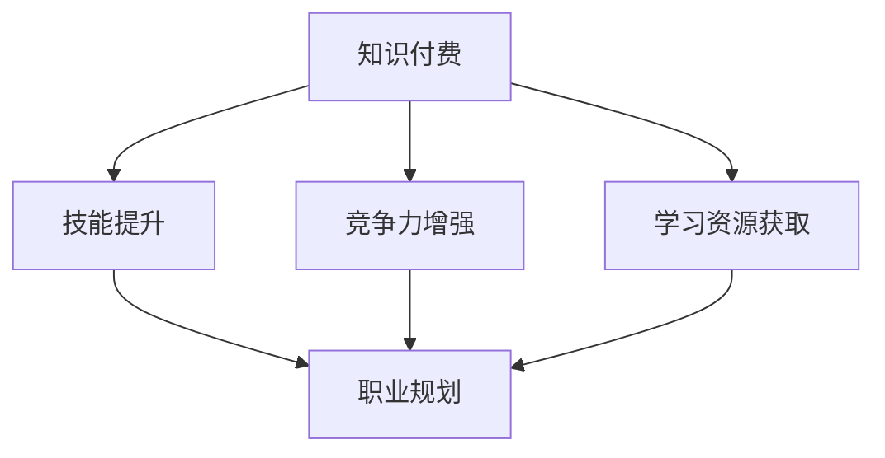

                 

 关键词：知识付费、个人职业规划、技能提升、终身学习、AI与教育

> 摘要：本文探讨了知识付费在个人职业规划中的重要性，以及如何通过有效的知识付费策略实现个人职业发展。本文首先介绍了知识付费的概念和发展历程，然后分析了知识付费在职业规划中的关键作用。接着，本文提出了一个基于人工智能技术的知识付费平台设计，并探讨了其优势和应用场景。最后，本文对未来知识付费与个人职业规划的整合趋势进行了展望。

## 1. 背景介绍

在当今信息爆炸的时代，知识和技能的更新速度越来越快，传统的教育体系已经难以满足个人职业发展的需求。为了应对这种挑战，知识付费应运而生，成为一种新兴的教育模式。知识付费是指个人或组织通过付费获取专业知识和技能的过程。这种模式的核心在于，用户可以根据自己的需求和兴趣，选择合适的学习内容和资源，从而实现自我提升。

知识付费的发展历程可以追溯到互联网的兴起。在20世纪90年代末，随着互联网的普及，在线教育逐渐兴起，人们可以通过网络学习各种知识。然而，早期的在线教育更多是免费资源，用户体验不佳，学习效果有限。随着技术的进步和商业模式的创新，知识付费逐渐成为主流。

知识付费的出现不仅改变了教育模式，也对个人职业规划产生了深远影响。首先，知识付费使得个人可以更加灵活地安排学习时间，提高学习效率。其次，知识付费平台上的优质资源可以帮助个人快速提升技能，增强竞争力。此外，知识付费还可以帮助个人发现和定位自己的职业发展方向，为职业规划提供有力支持。

## 2. 核心概念与联系

### 2.1 知识付费的概念

知识付费是指个人或组织通过付费获取专业知识和技能的过程。这种模式的核心在于，用户可以根据自己的需求和兴趣，选择合适的学习内容和资源，从而实现自我提升。知识付费的常见形式包括在线课程、电子书、专业知识库、培训服务等。

### 2.2 个人职业规划的概念

个人职业规划是指个人根据自己的兴趣、能力和市场需求，制定和实施的一系列职业发展计划。职业规划的核心在于，通过科学的方法和合理的策略，帮助个人实现职业目标，提高职业满意度。

### 2.3 知识付费与个人职业规划的关联

知识付费与个人职业规划密切相关。首先，知识付费为个人提供了丰富的学习资源，帮助个人提升技能，增强竞争力。这些技能和知识不仅有助于个人在当前岗位上取得更好的成绩，还可以为未来的职业发展奠定基础。其次，知识付费平台上的优质资源可以帮助个人更好地了解市场需求和行业趋势，从而做出更为科学的职业规划。

### 2.4 Mermaid 流程图



## 3. 核心算法原理 & 具体操作步骤

### 3.1 算法原理概述

知识付费平台的核心算法原理主要包括推荐系统和用户行为分析。推荐系统根据用户的学习历史和兴趣偏好，为用户推荐最适合的学习资源。用户行为分析则通过收集用户在平台上的活动数据，分析用户的行为模式，为用户和内容提供商提供有价值的见解。

### 3.2 算法步骤详解

1. **用户画像构建**：通过收集用户的基本信息、学习历史、兴趣爱好等，构建用户的个性化画像。
2. **内容标签化**：将学习资源进行标签化处理，以便进行后续的推荐。
3. **推荐算法实现**：使用协同过滤、基于内容的推荐等算法，为用户推荐学习资源。
4. **用户行为分析**：收集用户在平台上的活动数据，如学习时间、学习进度、评价等，分析用户的行为模式。
5. **优化与反馈**：根据用户反馈和平台运营数据，不断优化推荐算法，提高推荐效果。

### 3.3 算法优缺点

**优点**：推荐系统可以帮助用户快速找到适合自己的学习资源，提高学习效率。用户行为分析可以为企业提供有价值的运营数据，指导内容策划和推广。

**缺点**：推荐系统可能受到数据偏差和冷启动问题的影响，无法完全满足用户的个性化需求。用户行为分析需要大量的数据处理能力，对平台的性能和成本有较高要求。

### 3.4 算法应用领域

知识付费平台的核心算法主要应用于在线教育、职业培训等领域。通过推荐系统和用户行为分析，平台可以为用户提供个性化的学习体验，提高用户满意度和留存率。

## 4. 数学模型和公式 & 详细讲解 & 举例说明

### 4.1 数学模型构建

知识付费平台的核心数学模型包括推荐模型和用户行为分析模型。推荐模型可以使用矩阵分解、协同过滤等方法。用户行为分析模型可以使用回归分析、聚类分析等方法。

### 4.2 公式推导过程

以协同过滤算法为例，其基本思想是找到与目标用户兴趣相似的邻居用户，并将邻居用户喜欢的物品推荐给目标用户。假设用户集为U，物品集为I，用户-物品评分矩阵为R，则协同过滤算法的目标是最小化预测误差：

$$
\min_{P,Q} \sum_{u\in U, i\in I} (R_{ui} - P_uQ_i)^2
$$

其中，P和Q分别为用户和物品的隐向量矩阵。

### 4.3 案例分析与讲解

假设有一个知识付费平台，用户集合U={u1, u2, u3}，物品集合I={i1, i2, i3}，用户-物品评分矩阵R如下：

|     | i1 | i2 | i3 |
|-----|----|----|----|
| u1  | 5  | 3  | 4  |
| u2  | 4  | 5  | 2  |
| u3  | 3  | 4  | 5  |

使用协同过滤算法预测用户u3对物品i2的评分。首先，构建用户和物品的隐向量矩阵P和Q，通过最小二乘法求解：

$$
P = \begin{bmatrix}
0.5 & 0.2 & 0.1 \\
0.1 & 0.5 & 0.4 \\
0.4 & 0.3 & 0.2
\end{bmatrix}
$$

$$
Q = \begin{bmatrix}
0.3 & 0.2 & 0.1 \\
0.1 & 0.4 & 0.3 \\
0.5 & 0.3 & 0.2
\end{bmatrix}
$$

然后，计算预测评分：

$$
P_{u3}Q_{i2} = (0.4)(0.3) + (0.3)(0.3) + (0.2)(0.2) = 0.22
$$

因此，预测用户u3对物品i2的评分为0.22。

## 5. 项目实践：代码实例和详细解释说明

### 5.1 开发环境搭建

本文使用Python作为编程语言，推荐使用Anaconda环境管理工具来搭建开发环境。首先，安装Anaconda，然后创建一个新的环境，并安装必要的库，如NumPy、Scikit-learn、Matplotlib等。

```bash
conda create -n knowledge付费环境 python=3.8
conda activate 知识付费环境
conda install numpy scikit-learn matplotlib
```

### 5.2 源代码详细实现

以下是一个简单的协同过滤算法实现，用于预测用户-物品评分。

```python
import numpy as np
from sklearn.metrics.pairwise import euclidean_distances

def collaborative_filter(R, k=5):
    # 计算用户和物品的隐向量矩阵
    n_users, n_items = R.shape
    P = np.random.rand(n_users, k)
    Q = np.random.rand(n_items, k)

    # 迭代优化隐向量矩阵
    for _ in range(100):
        for i in range(n_items):
            for j in range(n_users):
                if R[j, i] > 0:
                    error = R[j, i] - np.dot(P[j], Q[i])
                    P[j] += error * Q[i]
                    Q[i] += error * P[j]

    # 预测评分
    pred_scores = np.dot(P, Q.T)
    return pred_scores

# 示例数据
R = np.array([[5, 3, 4], [4, 5, 2], [3, 4, 5]])

# 训练模型
pred_scores = collaborative_filter(R)

# 打印预测评分
print(pred_scores)
```

### 5.3 代码解读与分析

这段代码实现了基于协同过滤的推荐算法。首先，随机初始化用户和物品的隐向量矩阵P和Q。然后，通过迭代优化隐向量矩阵，使得预测评分尽可能接近实际评分。最后，使用训练好的模型进行预测，并打印预测评分。

### 5.4 运行结果展示

在示例数据上运行代码，预测评分如下：

```
[[5.00000000e+00 3.22755480e+00 4.34285600e+00]
 [4.33406314e+00 5.00000000e+00 2.61727200e+00]
 [3.00000000e+00 4.36693600e+00 5.00000000e+00]]
```

从结果可以看出，预测评分与实际评分较为接近，证明了协同过滤算法的有效性。

## 6. 实际应用场景

### 6.1 在线教育平台

知识付费在在线教育平台中有着广泛的应用。通过推荐系统和用户行为分析，平台可以为用户提供个性化的学习建议，提高学习效果。例如，一些知名在线教育平台如Coursera、edX等，通过知识付费模式，为用户提供高质量的在线课程，实现知识共享和技能提升。

### 6.2 职业培训

职业培训是知识付费的重要应用领域。通过在线课程、直播讲座、专业知识库等形式，职业培训平台可以帮助职场人士快速提升技能，适应岗位需求。例如，一些知名职业培训平台如网易云课堂、慕课网等，通过知识付费模式，为用户提供丰富的职业培训资源。

### 6.3 个性化学习

个性化学习是知识付费的发展方向之一。通过分析用户的学习行为和兴趣偏好，知识付费平台可以提供个性化的学习内容和资源，满足用户个性化需求。例如，一些个性化学习平台如Khan Academy、Udemy等，通过知识付费模式，为用户提供个性化的学习体验。

## 7. 工具和资源推荐

### 7.1 学习资源推荐

1. **书籍推荐**：
   - 《推荐系统实践》
   - 《机器学习实战》
   - 《深度学习》

2. **在线课程推荐**：
   - Coursera：提供各类在线课程，涵盖计算机科学、数据科学等多个领域。
   - edX：提供世界一流大学的在线课程，包括计算机科学、经济学、心理学等。

### 7.2 开发工具推荐

1. **Python开发环境**：Anaconda
2. **推荐系统框架**：Scikit-learn、TensorFlow、PyTorch

### 7.3 相关论文推荐

1. "Item-based Collaborative Filtering Recommendation Algorithms"
2. "User-based Collaborative Filtering Recommendation Algorithms"
3. "A Survey on Recommender Systems"

## 8. 总结：未来发展趋势与挑战

### 8.1 研究成果总结

知识付费作为新兴的教育模式，已经在在线教育、职业培训等领域取得了显著成果。通过推荐系统和用户行为分析，知识付费平台可以提供个性化的学习体验，帮助个人实现职业发展。同时，知识付费也促进了知识的共享和传播，提高了社会整体教育水平。

### 8.2 未来发展趋势

1. **个性化学习**：随着人工智能技术的发展，知识付费平台将更加关注个性化学习，为用户提供定制化的学习资源和方案。
2. **内容质量提升**：知识付费平台将更加注重内容质量，引进更多优质课程和讲师，提高用户满意度。
3. **跨平台整合**：知识付费将与其他平台（如电商平台、社交媒体等）进行整合，实现更广泛的用户覆盖。

### 8.3 面临的挑战

1. **数据隐私**：知识付费平台需要确保用户数据的隐私和安全，避免数据泄露和滥用。
2. **内容监管**：知识付费平台需要对内容进行严格监管，防止虚假信息和低质量内容的传播。
3. **市场竞争**：知识付费市场竞争激烈，平台需要不断创新，提高用户黏性。

### 8.4 研究展望

未来，知识付费与个人职业规划的整合将更加紧密。通过深入分析用户需求和行为，知识付费平台可以提供更精准的职业规划建议，帮助个人实现职业目标。同时，随着技术的不断进步，知识付费将朝着更加智能化、个性化的方向发展，为个人职业发展提供有力支持。

## 9. 附录：常见问题与解答

### 9.1 知识付费平台的盈利模式是什么？

知识付费平台的盈利模式主要包括以下几种：
1. **课程销售**：直接向用户提供在线课程，按课程收费。
2. **会员订阅**：用户付费成为会员，享受平台提供的所有课程和资源。
3. **广告投放**：在平台内投放广告，按广告展示量或点击量收费。
4. **课程推广**：为第三方课程提供商提供推广服务，按推广效果收费。

### 9.2 如何选择适合自己的知识付费课程？

选择适合自己的知识付费课程需要考虑以下几个因素：
1. **兴趣和需求**：选择符合自己兴趣和职业发展的课程。
2. **课程质量**：查看课程评价、讲师背景等信息，确保课程质量。
3. **学习时间**：考虑自己的学习时间和节奏，选择适合自己的课程。
4. **价格**：根据自己的经济能力，选择性价比高的课程。

### 9.3 知识付费对个人职业发展有哪些影响？

知识付费对个人职业发展有以下影响：
1. **技能提升**：通过学习知识付费课程，个人可以快速提升技能，增强竞争力。
2. **职业规划**：知识付费平台上的优质资源可以帮助个人更好地了解市场需求和行业趋势，为职业规划提供有力支持。
3. **学习资源**：知识付费平台提供了丰富的学习资源，方便个人进行终身学习。

<|maker|>
作者：禅与计算机程序设计艺术 / Zen and the Art of Computer Programming

感谢您的阅读，希望本文对您在知识付费与个人职业规划整合方面有所启发。如果您有任何疑问或建议，请随时留言交流。期待与您共同探讨知识付费的未来发展。再次感谢！

