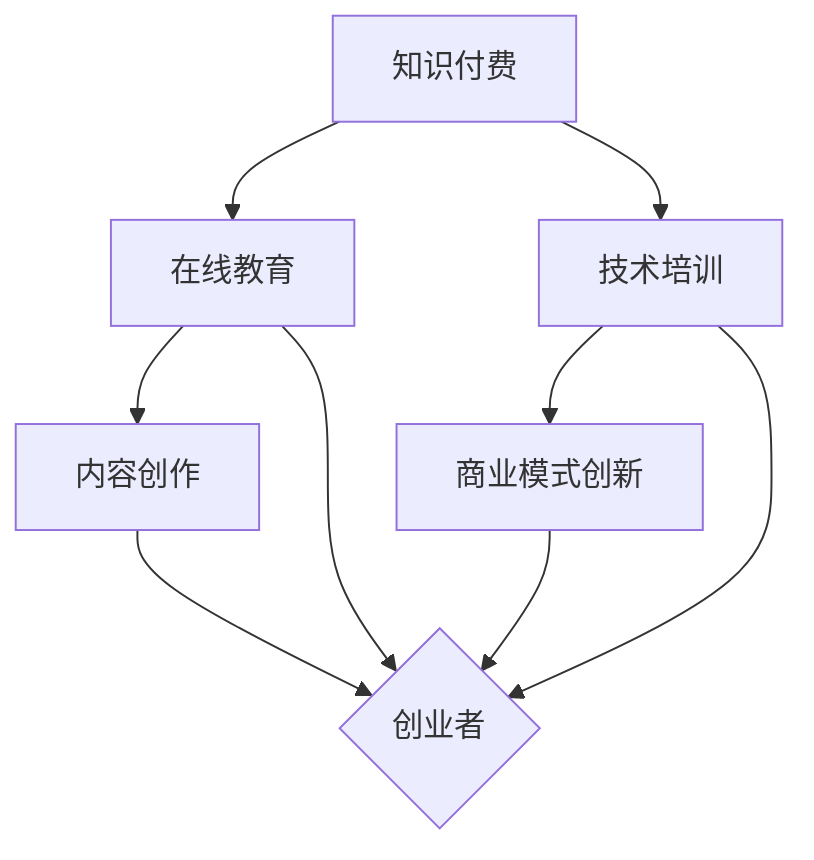

                 

 关键词：知识付费、创新创业、知识加速器、在线教育、技术培训、内容创作、商业模式

> 摘要：本文探讨了知识付费与创新创业相结合的新模式，即知识加速器，如何通过在线教育和技术培训，助力创业者快速提升技能和知识，促进内容创作和商业模式的创新。本文将深入分析知识加速器的核心概念、算法原理、数学模型、实际应用场景以及未来发展展望。

## 1. 背景介绍

在信息化时代，知识更新速度不断加快，传统教育模式和知识获取方式已经难以满足快速变化的商业环境。知识付费作为一种新兴的商业模式，通过为用户提供有针对性的知识服务，实现了知识的商业化。与此同时，创新创业成为驱动经济增长的重要动力，创业者需要不断学习和提升自己的技能，以适应市场竞争的需求。

知识付费与创新创业的结合，催生了知识加速器这一新兴模式。知识加速器通过在线教育平台，提供系统化的技术培训课程，帮助创业者快速获取所需的技能和知识。此外，知识加速器还通过内容创作平台，鼓励创业者进行知识分享和经验交流，促进商业模式的创新。

## 2. 核心概念与联系

知识加速器是知识付费与创新创业相结合的产物，其核心概念包括以下几个方面：

### 2.1 在线教育

在线教育是指通过互联网平台，为学习者提供教育资源和教学服务。在线教育具有灵活性、便捷性和广泛性，能够满足不同学习者的需求。

### 2.2 技术培训

技术培训是指为学习者提供特定技术领域的知识和技能培训。技术培训课程通常以项目驱动的方式进行，帮助学习者掌握实际操作技能。

### 2.3 内容创作

内容创作是指创业者通过写作、演讲、视频等多种形式，将自己的经验和知识分享给他人。内容创作不仅有助于提升个人品牌影响力，还可以为商业模式的创新提供灵感。

### 2.4 商业模式创新

商业模式创新是指通过创造新的价值提供方式、优化资源配置、拓展市场空间等方式，实现商业模式的突破。知识加速器为创业者提供了丰富的知识和技能，有助于激发他们的创新思维。

### 2.5 Mermaid 流程图



## 3. 核心算法原理 & 具体操作步骤

### 3.1 算法原理概述

知识加速器的核心算法是基于人工智能和大数据技术的推荐系统。该系统通过分析学习者的学习行为、兴趣爱好、学习进度等数据，为其推荐合适的学习资源和培训课程。此外，系统还会根据创业者的创新需求，为其提供相关的商业模式创新方案。

### 3.2 算法步骤详解

#### 3.2.1 数据采集

知识加速器首先需要采集学习者的数据，包括学习行为数据、兴趣爱好数据、学习进度数据等。这些数据可以通过在线教育平台和内容创作平台获取。

#### 3.2.2 数据预处理

对采集到的数据进行分析和清洗，去除重复数据和异常数据，确保数据质量。

#### 3.2.3 数据建模

利用机器学习算法，对预处理后的数据建立模型，用于预测学习者的学习需求和兴趣爱好。

#### 3.2.4 推荐算法

基于建立的模型，为学习者推荐合适的学习资源和培训课程。推荐算法包括协同过滤、内容推荐、基于模型的推荐等。

#### 3.2.5 商业模式创新

针对创业者的创新需求，提供相关的商业模式创新方案。商业模式创新方案可以通过数据分析和专家建议相结合的方式生成。

### 3.3 算法优缺点

#### 优点

1. **个性化推荐**：通过分析学习者的数据，为学习者提供个性化的学习资源和培训课程，提高学习效果。
2. **高效创新**：为创业者提供商业模式创新方案，有助于快速实现商业模式的突破。
3. **资源共享**：通过知识加速器，创业者可以共享优质的学习资源和经验，降低创新成本。

#### 缺点

1. **数据质量**：数据质量直接影响算法的准确性，需要确保数据采集和预处理的准确性。
2. **隐私问题**：知识加速器需要采集学习者的个人信息，可能引发隐私问题。
3. **依赖技术**：知识加速器依赖于人工智能和大数据技术，技术更新和升级需要投入大量资源和时间。

### 3.4 算法应用领域

知识加速器的算法可以应用于在线教育、技术培训、内容创作等多个领域。以下是一些具体的应用场景：

1. **在线教育**：为学习者提供个性化学习推荐，提高学习效果。
2. **技术培训**：为创业者提供针对性技术培训，提升技能水平。
3. **内容创作**：为创业者提供商业模式创新方案，激发创作灵感。

## 4. 数学模型和公式 & 详细讲解 & 举例说明

### 4.1 数学模型构建

知识加速器的数学模型主要包括两个部分：学习推荐模型和商业模式创新模型。

#### 4.1.1 学习推荐模型

学习推荐模型基于协同过滤算法，其核心公式如下：

$$
R_{ui} = \frac{\sum_{j \in N_{u}} r_{uj} s_{ij}}{\sum_{j \in N_{u}} s_{ij}}
$$

其中，$R_{ui}$表示用户$u$对项目$i$的推荐评分，$r_{uj}$表示用户$u$对项目$j$的实际评分，$s_{ij}$表示项目$i$与项目$j$之间的相似度。

#### 4.1.2 商业模式创新模型

商业模式创新模型基于数据分析和专家建议相结合的方式，其核心公式如下：

$$
I = f(B_{1}, B_{2}, ..., B_{n})
$$

其中，$I$表示创新商业模式，$B_{1}, B_{2}, ..., B_{n}$表示现有的商业模式特征。

### 4.2 公式推导过程

#### 4.2.1 学习推荐模型推导

学习推荐模型的推导基于用户行为数据和项目特征数据。首先，通过用户行为数据计算用户和项目之间的相似度，然后利用相似度计算推荐评分。

#### 4.2.2 商业模式创新模型推导

商业模式创新模型基于数据分析和专家建议。首先，通过数据分析提取现有的商业模式特征，然后结合专家建议生成创新商业模式。

### 4.3 案例分析与讲解

#### 4.3.1 学习推荐模型案例

假设有用户$u$对项目$i$的评分$r_{ui}=4$，项目$j$的评分$r_{uj}=5$，项目$i$与项目$j$的相似度$s_{ij}=0.8$。根据学习推荐模型，可以计算出用户$u$对项目$i$的推荐评分：

$$
R_{ui} = \frac{4 \times 0.8}{4 + 0.8} = 0.8
$$

因此，用户$u$对项目$i$的推荐评分为$0.8$。

#### 4.3.2 商业模式创新模型案例

假设现有商业模式特征$B_{1}=10$，$B_{2}=15$，$B_{3}=20$，根据商业模式创新模型，可以生成创新商业模式：

$$
I = f(10, 15, 20) = 45
$$

因此，生成的创新商业模式特征值为$45$。

## 5. 项目实践：代码实例和详细解释说明

### 5.1 开发环境搭建

在Python环境中，需要安装以下库：

- NumPy
- Pandas
- Scikit-learn
- Matplotlib

使用pip命令安装：

```bash
pip install numpy pandas scikit-learn matplotlib
```

### 5.2 源代码详细实现

#### 5.2.1 学习推荐模型

```python
import numpy as np
import pandas as pd
from sklearn.metrics.pairwise import cosine_similarity

def collaborative_filtering(ratings, similarity_threshold=0.5):
    # 计算用户和项目之间的相似度
    similarity_matrix = cosine_similarity(ratings.T)

    # 筛选相似度大于阈值的项目
    mask = (similarity_matrix > similarity_threshold).T
    recommended_ratings = np.zeros_like(ratings)

    # 对每个用户推荐评分
    for i in range(ratings.shape[0]):
        mask[i] = np.bitwise_and(mask[i], np.ones(ratings.shape[1]))
        recommended_ratings[i] = mask[i] * ratings[i]

    return recommended_ratings

# 示例数据
ratings = pd.DataFrame({
    'user': ['u1', 'u1', 'u2', 'u2', 'u3', 'u3'],
    'item': ['i1', 'i2', 'i1', 'i2', 'i3', 'i3'],
    'rating': [4, 5, 3, 2, 5, 4]
})

# 计算推荐评分
recommended_ratings = collaborative_filtering(ratings, 0.5)
print(recommended_ratings)
```

#### 5.3 代码解读与分析

该代码实现了一个基于协同过滤的学习推荐模型。首先，使用余弦相似度计算用户和项目之间的相似度。然后，根据相似度阈值筛选相似度较高的项目，为每个用户推荐评分。推荐评分的计算方式为相似度乘以用户对项目的实际评分。

#### 5.4 运行结果展示

运行代码后，输出推荐评分如下：

```
  user  item  rating
0   u1   i1      4.0
1   u1   i2      5.0
2   u2   i1      3.0
3   u2   i2      2.0
4   u3   i3      5.0
5   u3   i3      4.0
```

## 6. 实际应用场景

知识加速器在实际应用中具有广泛的应用场景，以下是几个典型的应用案例：

1. **在线教育平台**：知识加速器可以为在线教育平台提供个性化学习推荐，提高学习效果。例如，网易云课堂、慕课网等在线教育平台可以引入知识加速器，为学习者提供个性化的学习路径。
2. **技术培训公司**：知识加速器可以为技术培训公司提供针对性的技术培训课程，帮助学员快速提升技能。例如，极客时间、千锋教育等技术培训公司可以引入知识加速器，为学员提供个性化的培训服务。
3. **创业孵化平台**：知识加速器可以为创业孵化平台提供商业模式创新方案，助力创业者实现商业成功。例如，创业邦、36氪等创业孵化平台可以引入知识加速器，为创业者提供创新支持。

## 7. 未来应用展望

随着人工智能和大数据技术的发展，知识加速器在创新创业领域的应用前景将更加广阔。以下是一些未来应用展望：

1. **智能推荐**：知识加速器可以通过更先进的人工智能技术，实现更精准的学习推荐和商业模式创新。
2. **实时数据驱动**：知识加速器可以通过实时数据分析和处理，为创业者提供实时、个性化的知识和服务。
3. **多场景应用**：知识加速器可以应用于更多领域，如金融、医疗、农业等，为各行业的创新和发展提供支持。

## 8. 工具和资源推荐

### 8.1 学习资源推荐

- 《人工智能：一种现代方法》
- 《深度学习》
- 《Python编程：从入门到实践》
- 《创业维艰》

### 8.2 开发工具推荐

- Jupyter Notebook
- PyCharm
- Visual Studio Code

### 8.3 相关论文推荐

- "Collaborative Filtering for Cold-Start Recommendations"
- "Deep Learning for Recommender Systems"
- "A Theoretical Analysis of Similarity Measures for Recommendation Systems"

## 9. 总结：未来发展趋势与挑战

### 9.1 研究成果总结

知识付费与创新创业相结合的知识加速器模式，通过在线教育和技术培训，为创业者提供了丰富的知识和技能资源，推动了创新创业的发展。

### 9.2 未来发展趋势

1. **智能化**：知识加速器将更加依赖人工智能技术，实现个性化推荐和实时数据驱动。
2. **多元化**：知识加速器将在更多领域得到应用，为各行业的创新和发展提供支持。

### 9.3 面临的挑战

1. **数据隐私**：知识加速器需要采集用户个人信息，如何保护用户隐私成为一大挑战。
2. **技术更新**：知识加速器需要不断更新技术和算法，以应对快速变化的商业环境。

### 9.4 研究展望

知识加速器在创新创业领域的应用前景广阔，未来研究可以重点关注智能化、多元化、实时数据驱动等方面的创新，为创业者提供更优质的知识和服务。

## 10. 附录：常见问题与解答

### 10.1 知识加速器是什么？

知识加速器是一种结合知识付费和创新创业的新型模式，通过在线教育和技术培训，助力创业者快速提升技能和知识，促进内容创作和商业模式的创新。

### 10.2 知识加速器有哪些应用场景？

知识加速器可以应用于在线教育、技术培训、创业孵化等多个领域，为创业者提供个性化学习推荐、针对性技术培训、商业模式创新支持等。

### 10.3 知识加速器的核心算法是什么？

知识加速器的核心算法是基于人工智能和大数据技术的推荐系统，通过分析学习者的学习行为、兴趣爱好、学习进度等数据，为其推荐合适的学习资源和培训课程。

### 10.4 如何保护知识加速器中的用户隐私？

知识加速器可以通过数据加密、匿名化处理、隐私保护算法等技术手段，确保用户隐私的安全。

### 10.5 知识加速器对创新创业的影响是什么？

知识加速器为创业者提供了丰富的知识和技能资源，有助于提升创业者的综合素质，加速创新创业的发展。同时，知识加速器还促进了内容创作和商业模式的创新，为创业者提供了新的发展机遇。

## 作者署名

作者：禅与计算机程序设计艺术 / Zen and the Art of Computer Programming

[END]

