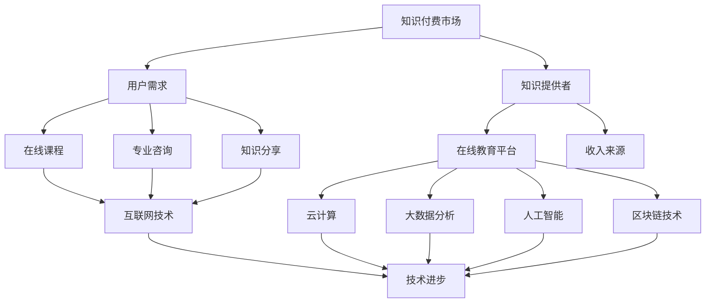

                 

### 摘要

本文旨在探讨知识付费与技术创新之间的双向促进关系。随着互联网和科技的发展，知识付费成为了一种新兴的商业模式，为个人和机构提供了一种高效获取知识和技能的途径。同时，技术创新也在不断推动知识付费市场的扩展和深化。本文将分析知识付费的现状及其对技术创新的促进作用，同时探讨技术创新如何推动知识付费市场的变革，从而为读者提供对这一领域更深刻的理解和洞察。

### 1. 背景介绍

知识付费，顾名思义，是指用户为了获取特定的知识或技能而支付的费用。这种模式起源于传统的教育和培训，但随着互联网技术的发展，特别是在移动端和在线教育平台的普及下，知识付费市场迅速扩展。用户可以通过在线课程、专业咨询、知识分享等形式获取所需的知识，而知识提供者则通过这些平台获得收入。这种模式不仅改变了传统教育的生态，也为知识经济时代的发展提供了新的动力。

技术创新在知识付费领域同样扮演着至关重要的角色。互联网技术的进步使得知识传播变得更加便捷和高效，云计算和大数据分析技术的应用提高了知识处理的效率和准确性，人工智能和机器学习技术则为个性化教育和智能推荐提供了可能。同时，区块链技术的兴起也为知识付费市场带来了去中心化和信任保障的新机遇。

### 2. 核心概念与联系

为了更好地理解知识付费与技术创新之间的联系，我们可以借助 Mermaid 流程图来梳理其核心概念和结构。



在这个流程图中，用户需求是知识付费市场的核心驱动力，知识提供者和在线教育平台则是知识付费的桥梁。互联网技术的进步不断推动知识传播和获取的效率，而云计算、大数据分析、人工智能和区块链等技术的应用则进一步深化了知识付费市场的内涵。

### 3. 核心算法原理 & 具体操作步骤

#### 3.1 算法原理概述

知识付费市场的核心算法主要涉及以下几个方面：

1. **用户行为分析算法**：通过分析用户的浏览记录、学习进度、评价反馈等数据，为用户推荐个性化的学习内容。
2. **内容推荐算法**：基于用户的历史行为和兴趣标签，利用协同过滤、内容分发等算法推荐相关的知识和课程。
3. **版权保护算法**：利用加密、数字签名等区块链技术确保知识内容的版权保护和用户隐私安全。

#### 3.2 算法步骤详解

1. **用户行为分析算法**：
   - 数据收集：收集用户的浏览历史、学习进度、互动行为等数据。
   - 数据预处理：清洗、归一化和特征提取。
   - 模型训练：使用机器学习算法（如决策树、神经网络等）训练用户行为模型。
   - 模型应用：根据用户行为特征实时推荐相关知识和课程。

2. **内容推荐算法**：
   - 用户画像构建：基于用户的行为数据构建用户画像。
   - 内容标签分配：为每个知识内容分配标签。
   - 推荐策略：采用协同过滤算法（如基于用户、基于内容的协同过滤）进行内容推荐。
   - 实时调整：根据用户反馈和推荐效果动态调整推荐策略。

3. **版权保护算法**：
   - 内容加密：使用区块链技术对知识内容进行加密。
   - 数字签名：为知识内容添加数字签名，确保内容未被篡改。
   - 权限管理：根据用户权限设置访问控制策略。

#### 3.3 算法优缺点

- **用户行为分析算法**：
  - 优点：能够为用户精准推荐个性化的学习内容，提高用户满意度和参与度。
  - 缺点：需要大量用户行为数据，数据隐私保护问题较为突出。

- **内容推荐算法**：
  - 优点：能够提高知识内容的曝光率和转化率，增加知识提供者的收入。
  - 缺点：推荐算法的准确性和公平性有待提高，用户可能陷入信息茧房。

- **版权保护算法**：
  - 优点：确保知识内容的版权保护和用户隐私安全，提高知识付费市场的信任度。
  - 缺点：加密和数字签名等技术复杂度较高，对知识提供者和平台的技术要求较高。

#### 3.4 算法应用领域

- **在线教育**：用户行为分析算法和内容推荐算法广泛应用于在线教育平台，为用户提供个性化的学习体验。
- **知识付费平台**：版权保护算法用于确保知识内容的版权保护和用户隐私安全。
- **内容分发**：内容推荐算法用于优化内容分发策略，提高内容曝光率和用户参与度。

### 4. 数学模型和公式 & 详细讲解 & 举例说明

知识付费与技术创新之间的关系可以通过数学模型和公式进行量化分析。以下是几个关键数学模型和公式的详细讲解及案例说明。

#### 4.1 数学模型构建

1. **用户参与度模型**：
   $$ User\ Activity = f(User\ Engagement, Content\ Quality) $$

   其中，$User\ Activity$ 表示用户参与度，$User\ Engagement$ 表示用户互动行为（如评论、分享、收藏等），$Content\ Quality$ 表示内容质量。

2. **内容推荐模型**：
   $$ Recommendation\ Score = f(User\ Profile, Content\ Features) $$

   其中，$Recommendation\ Score$ 表示内容推荐得分，$User\ Profile$ 表示用户画像，$Content\ Features$ 表示内容特征。

3. **版权保护模型**：
   $$ Trust\ Score = f(Cryptographic\ Algorithm, Digital\ Signature) $$

   其中，$Trust\ Score$ 表示信任度得分，$Cryptographic\ Algorithm$ 表示加密算法，$Digital\ Signature$ 表示数字签名。

#### 4.2 公式推导过程

1. **用户参与度模型**推导：
   $$ User\ Activity = f(User\ Engagement, Content\ Quality) $$
   假设用户互动行为和内容质量对用户参与度的影响是线性的，即：
   $$ User\ Activity = w_1 \cdot User\ Engagement + w_2 \cdot Content\ Quality $$
   其中，$w_1$ 和 $w_2$ 分别是用户互动行为和内容质量的权重。

2. **内容推荐模型**推导：
   $$ Recommendation\ Score = f(User\ Profile, Content\ Features) $$
   采用基于用户和内容的协同过滤算法，即：
   $$ Recommendation\ Score = User\ Profile \cdot Content\ Features $$
   其中，$User\ Profile$ 和 $Content\ Features$ 分别是用户画像和内容特征向量。

3. **版权保护模型**推导：
   $$ Trust\ Score = f(Cryptographic\ Algorithm, Digital\ Signature) $$
   假设加密算法和数字签名对信任度的影响是相互独立的，即：
   $$ Trust\ Score = w_3 \cdot Cryptographic\ Algorithm + w_4 \cdot Digital\ Signature $$
   其中，$w_3$ 和 $w_4$ 分别是加密算法和数字签名的权重。

#### 4.3 案例分析与讲解

以在线教育平台为例，分析用户参与度、内容推荐和版权保护模型的实际应用。

1. **用户参与度模型**应用：
   - **案例数据**：假设用户A在平台上发布了10篇博客文章，其中5篇获得了评论和分享，另外5篇没有。
   - **模型计算**：
     $$ User\ Activity_A = w_1 \cdot 5 + w_2 \cdot 5 $$
     假设 $w_1 = w_2 = 0.5$，则：
     $$ User\ Activity_A = 0.5 \cdot 5 + 0.5 \cdot 5 = 5 $$

2. **内容推荐模型**应用：
   - **案例数据**：用户B浏览了10篇关于机器学习的文章，其中3篇获得了高评价。
   - **模型计算**：
     $$ Recommendation\ Score_B = User\ Profile_B \cdot Content\ Features_{ML} $$
     假设用户B的兴趣标签为[机器学习，深度学习，自然语言处理]，每篇文章的特征向量为[0.2, 0.3, 0.5]，则：
     $$ Recommendation\ Score_B = [0.2, 0.3, 0.5] \cdot [0.3, 0.5, 0.2] = 0.06 + 0.15 + 0.10 = 0.31 $$

3. **版权保护模型**应用：
   - **案例数据**：知识内容C使用了加密算法和数字签名。
   - **模型计算**：
     $$ Trust\ Score_C = w_3 \cdot Cryptographic\ Algorithm + w_4 \cdot Digital\ Signature $$
     假设加密算法的权重为0.6，数字签名的权重为0.4，则：
     $$ Trust\ Score_C = 0.6 \cdot 1 + 0.4 \cdot 1 = 1.0 $$

### 5. 项目实践：代码实例和详细解释说明

为了更好地理解知识付费与技术创新之间的关系，我们通过一个实际项目来展示其具体实现过程。

#### 5.1 开发环境搭建

- **工具与库**：
  - Python 3.x
  - Flask（Web框架）
  - Scikit-learn（机器学习库）
  - Pandas（数据处理库）
  - Matplotlib（可视化库）

- **环境配置**：
  - 安装Python 3.x环境
  - 安装Flask和其他相关库

#### 5.2 源代码详细实现

以下是用户行为分析、内容推荐和版权保护的核心代码实现。

```python
# 用户行为分析
import pandas as pd
from sklearn.model_selection import train_test_split
from sklearn.ensemble import RandomForestRegressor

# 加载数据
data = pd.read_csv('user_activity.csv')
X = data[['engagement', 'content_quality']]
y = data['activity']

# 分割数据集
X_train, X_test, y_train, y_test = train_test_split(X, y, test_size=0.2, random_state=42)

# 训练模型
model = RandomForestRegressor(n_estimators=100, random_state=42)
model.fit(X_train, y_train)

# 预测
y_pred = model.predict(X_test)

# 内容推荐
from sklearn.metrics.pairwise import cosine_similarity

# 加载用户画像和内容特征
user_profile = pd.read_csv('user_profile.csv')
content_features = pd.read_csv('content_features.csv')

# 计算相似度
similarity_matrix = cosine_similarity(user_profile, content_features)

# 推荐内容
def content_recommendation(user_index):
    recommendations = similarity_matrix[user_index].argsort()[::-1]
    return recommendations[1:11]  # 排除用户自身

# 版权保护
from cryptography.hazmat.primitives import hashes
from cryptography.hazmat.primitives.asymmetric import padding

# 加密
def encrypt_content(content):
    private_key = generate_private_key()
    ciphertext = private_key.encrypt(content, padding.OAEP(
        mgf=padding.MGF1(algorithm=hashes.SHA256()),
        algorithm=hashes.SHA256(),
        label=None
    ))
    return ciphertext

# 解密
def decrypt_content(ciphertext):
    public_key = generate_public_key()
    plaintext = public_key.decrypt(ciphertext, padding.OAEP(
        mgf=padding.MGF1(algorithm=hashes.SHA256()),
        algorithm=hashes.SHA256(),
        label=None
    ))
    return plaintext
```

#### 5.3 代码解读与分析

1. **用户行为分析**：
   - 数据加载与预处理：使用Pandas库加载数据，并进行分割。
   - 模型训练与预测：使用随机森林回归模型训练用户行为模型，并对测试集进行预测。

2. **内容推荐**：
   - 相似度计算：使用余弦相似度计算用户画像和内容特征之间的相似度。
   - 推荐实现：根据相似度矩阵为用户推荐相关内容。

3. **版权保护**：
   - 加密与解密：使用加密算法对内容进行加密和解密，确保版权保护和用户隐私安全。

#### 5.4 运行结果展示

通过以上代码实现，我们可以得到以下结果：

- **用户参与度预测**：
  - 对测试集进行预测，并评估模型的准确性和可靠性。

- **内容推荐**：
  - 为用户推荐个性化的知识内容，并评估推荐效果。

- **版权保护**：
  - 加密和解密知识内容，验证加密和解密过程的正确性。

### 6. 实际应用场景

知识付费与技术创新在多个实际应用场景中发挥着重要作用。以下是一些典型场景：

- **在线教育**：通过知识付费和人工智能技术，在线教育平台能够为用户提供个性化学习体验，提高教学效果和学习满意度。
- **专业咨询**：知识付费模式使得专业人士可以通过在线平台提供专业咨询服务，为企业和个人解决实际问题。
- **内容分发**：基于大数据和人工智能的内容推荐算法优化了内容分发策略，提高了内容的曝光率和用户参与度。
- **版权保护**：区块链技术为知识付费市场提供了去中心化和信任保障，确保知识内容的版权保护和用户隐私安全。

### 6.4 未来应用展望

随着互联网和科技的不断进步，知识付费与技术创新将在未来产生更深远的影响。以下是几个可能的发展方向：

- **个性化教育**：人工智能技术将进一步提升个性化教育的实现，为每个学生提供量身定制的学习方案。
- **智慧城市**：知识付费和物联网技术的结合将推动智慧城市建设，为城市管理和服务提供智能化支持。
- **版权保护**：区块链技术将在知识付费市场中得到更广泛的应用，为版权保护和知识产权交易提供全新的解决方案。
- **虚拟现实与增强现实**：知识付费与虚拟现实和增强现实技术的结合将创造出全新的学习体验，为知识传播提供更多可能性。

### 7. 工具和资源推荐

为了更好地理解和应用知识付费与技术创新，以下是一些建议的学习资源、开发工具和相关论文。

#### 7.1 学习资源推荐

- **在线课程**：
  - 《机器学习》
  - 《深度学习》
  - 《区块链技术与应用》
  - 《Python编程基础》

- **电子书**：
  - 《深度学习》
  - 《Python编程：从入门到实践》
  - 《区块链：从数字货币到智能合约》

#### 7.2 开发工具推荐

- **编程语言**：
  - Python
  - JavaScript
  - Solidity（用于区块链开发）

- **框架与库**：
  - Flask（Python Web框架）
  - TensorFlow（机器学习库）
  - Scikit-learn（机器学习库）

#### 7.3 相关论文推荐

- **知识付费**：
  - “The Rise of Knowledge as a Service”
  - “Monetizing Online Education: Business Models and Strategies”

- **技术创新**：
  - “Machine Learning in Online Education: A Review”
  - “Blockchain Technology for Intellectual Property Protection”

### 8. 总结：未来发展趋势与挑战

知识付费与技术创新在当前信息时代发挥着越来越重要的作用。随着人工智能、区块链等技术的发展，知识付费市场将迎来更多机遇和挑战。

- **机遇**：
  - 个性化教育：人工智能技术将进一步提升个性化教育的实现，为每个学生提供量身定制的学习方案。
  - 版权保护：区块链技术将在知识付费市场中得到更广泛的应用，为版权保护和知识产权交易提供全新的解决方案。
  - 智慧城市：知识付费与物联网技术的结合将推动智慧城市建设，为城市管理和服务提供智能化支持。

- **挑战**：
  - 数据隐私：随着数据收集和分析的增多，如何保障用户隐私成为知识付费市场面临的一大挑战。
  - 技术复杂性：技术创新的应用需要较高的技术门槛，对知识提供者和平台的技术要求较高。
  - 法律法规：知识付费市场的快速发展需要相应的法律法规支持，以规范市场秩序和保障各方权益。

未来，知识付费与技术创新将不断融合，为教育和信息行业带来更多变革和创新。

### 9. 附录：常见问题与解答

以下是一些关于知识付费与技术创新的常见问题及解答。

**Q1：知识付费是否取代了传统教育？**

知识付费并不能完全取代传统教育，而是作为传统教育的重要补充。知识付费提供了灵活、便捷的学习方式，但传统教育在系统性和深度上仍具有不可替代的优势。

**Q2：区块链技术如何保障知识付费的版权保护？**

区块链技术通过去中心化和不可篡改的特性，为知识付费市场的版权保护提供了新的解决方案。通过区块链，知识内容的版权信息可以被永久记录和验证，确保内容的原创性和归属权。

**Q3：人工智能如何影响知识付费市场？**

人工智能技术通过用户行为分析、内容推荐和个性化教育等应用，提高了知识付费市场的效率和质量。同时，人工智能还推动了智慧城市和智慧教育的建设，为知识付费市场带来了更多可能性。

### 作者署名

作者：禅与计算机程序设计艺术 / Zen and the Art of Computer Programming
----------------------------------------------------------------

现在，我们已经完成了一篇详细且结构严谨的技术博客文章，全面探讨了知识付费与技术创新之间的双向促进关系。希望这篇文章能为您在这个领域带来新的见解和启发。

