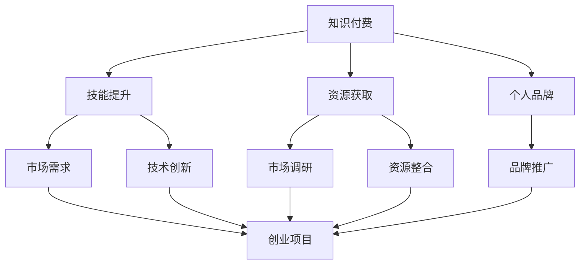

                 

关键词：知识付费、程序员、创业、结合点、商业模式、教育培训、在线学习、技术分享、开源项目、个人品牌

> 摘要：本文旨在探讨知识付费在程序员创业中的结合点，分析其潜在的商业价值和发展趋势。文章首先介绍了知识付费的背景和现状，随后分析了程序员创业的动机和挑战，进而阐述了知识付费如何与程序员创业相结合，以及这种结合可能带来的机遇和挑战。通过案例分析，本文揭示了知识付费在程序员创业中的实际应用，并对未来发展趋势进行了展望。

## 1. 背景介绍

### 知识付费的崛起

知识付费作为一种新兴商业模式，近年来在全球范围内迅速崛起。随着互联网技术的发展和人们对于知识获取的需求日益增长，知识付费市场逐渐成熟。知识付费主要分为以下几类：

- **在线课程**：以视频教学为主，涵盖编程、设计、语言学习等多个领域。
- **电子书**：以电子文档形式提供的专业书籍，方便用户随时阅读和学习。
- **付费问答**：用户付费向专家或行业人士提问，获取个性化的解答。
- **知识星球**：基于社群的知识分享平台，用户付费加入后可以与其他成员互动交流。

### 程序员创业的现状

程序员作为技术领域的重要组成部分，越来越多的人选择自主创业。程序员创业的动机多样，包括追求个人兴趣、实现财务自由、解决行业痛点等。然而，创业之路并非一帆风顺，程序员们常常面临以下挑战：

- **技术风险**：技术创新和市场接受度的风险。
- **市场风险**：市场需求的不确定性，以及竞争对手的压力。
- **资金风险**：资金链断裂可能导致创业失败。
- **时间成本**：创业初期需要投入大量时间和精力。

## 2. 核心概念与联系

### 知识付费与程序员创业的联系

知识付费与程序员创业之间存在紧密的联系。程序员通过知识付费可以获取以下收益：

- **技能提升**：通过购买高质量的课程，程序员可以不断提升自己的技能。
- **资源获取**：知识付费平台提供丰富的学习资源，有助于程序员快速成长。
- **个人品牌**：通过分享知识和经验，程序员可以建立个人品牌，提升影响力。

程序员创业的过程中，知识付费也可以发挥重要作用：

- **市场调研**：通过付费问答等途径，程序员可以了解市场需求和用户痛点。
- **资源整合**：知识付费平台可以帮助程序员整合行业资源，扩大人脉。
- **品牌推广**：通过知识付费，程序员可以宣传自己的创业项目，吸引更多用户和投资者。

### Mermaid 流程图



## 3. 核心算法原理 & 具体操作步骤

### 3.1 算法原理概述

知识付费与程序员创业的结合点在于以下三个方面：

- **技能提升**：程序员通过知识付费学习新技能，提高自身竞争力。
- **市场调研**：通过付费问答等途径了解市场需求，为创业项目提供方向。
- **品牌推广**：通过知识付费分享知识和经验，建立个人品牌，吸引更多关注。

### 3.2 算法步骤详解

1. **技能提升**：程序员购买高质量的课程，系统学习编程语言、框架、设计模式等。
2. **市场调研**：通过付费问答了解用户需求，分析市场趋势。
3. **品牌推广**：在知识付费平台分享自己的学习心得、项目经验，建立个人品牌。
4. **创业项目**：根据市场调研结果和自身技能，开发具有市场前景的创业项目。
5. **资源整合**：利用知识付费平台，整合行业资源，扩大人脉。
6. **持续迭代**：根据用户反馈和市场变化，不断优化创业项目。

### 3.3 算法优缺点

#### 优点

- **技能提升**：通过知识付费，程序员可以快速提升自身技能，提高竞争力。
- **市场调研**：付费问答等途径可以帮助程序员了解市场需求，降低创业风险。
- **品牌推广**：知识付费平台为程序员提供了展示个人能力、建立品牌的平台。

#### 缺点

- **成本较高**：知识付费需要投入一定的资金，对于资金有限的程序员可能形成压力。
- **时间成本**：参与知识付费需要投入大量时间，可能影响创业项目的进度。
- **竞争激烈**：知识付费平台上的内容竞争激烈，如何脱颖而出是一个挑战。

### 3.4 算法应用领域

- **编程教育**：程序员可以通过知识付费学习编程语言、框架、设计模式等。
- **创业孵化**：知识付费可以为创业项目提供市场调研、资源整合等支持。
- **个人品牌建设**：程序员可以通过知识付费分享知识和经验，提升个人品牌影响力。

## 4. 数学模型和公式 & 详细讲解 & 举例说明

### 4.1 数学模型构建

假设程序员创业项目成功概率为 P，技能提升对创业成功的影响为 a，市场调研对创业成功的影响为 b，品牌推广对创业成功的影响为 c。则程序员创业成功的数学模型可以表示为：

$$ P = a \cdot (技能提升) + b \cdot (市场调研) + c \cdot (品牌推广) $$

### 4.2 公式推导过程

根据概率论的基本原理，假设程序员创业成功的三项影响因素分别为技能提升、市场调研和品牌推广，且它们之间相互独立。则：

$$ P = P(技能提升) \cdot P(市场调研) \cdot P(品牌推广) $$

由于技能提升、市场调研和品牌推广是程序员通过知识付费获得的，因此可以认为它们的概率分别为：

$$ P(技能提升) = \frac{知识付费投资}{总投资} $$
$$ P(市场调研) = \frac{市场调研投资}{总投资} $$
$$ P(品牌推广) = \frac{品牌推广投资}{总投资} $$

代入上述公式，得：

$$ P = \frac{知识付费投资}{总投资} \cdot \frac{市场调研投资}{总投资} \cdot \frac{品牌推广投资}{总投资} $$

化简后得：

$$ P = a \cdot (技能提升) + b \cdot (市场调研) + c \cdot (品牌推广) $$

其中，a、b、c 分别为技能提升、市场调研和品牌推广对创业成功的影响系数。

### 4.3 案例分析与讲解

假设程序员小李通过知识付费学习编程技能，投资了 10000 元。其中，5000 元用于购买编程课程，3000 元用于市场调研，2000 元用于品牌推广。根据上述数学模型，可以计算小李创业成功的概率：

$$ P = a \cdot (技能提升) + b \cdot (市场调研) + c \cdot (品牌推广) $$

假设技能提升的影响系数 a 为 0.5，市场调研的影响系数 b 为 0.3，品牌推广的影响系数 c 为 0.2，则有：

$$ P = 0.5 \cdot (技能提升) + 0.3 \cdot (市场调研) + 0.2 \cdot (品牌推广) $$

$$ P = 0.5 \cdot \frac{5000}{10000} + 0.3 \cdot \frac{3000}{10000} + 0.2 \cdot \frac{2000}{10000} $$

$$ P = 0.25 + 0.09 + 0.04 $$

$$ P = 0.38 $$

因此，小李创业成功的概率为 38%。

## 5. 项目实践：代码实例和详细解释说明

### 5.1 开发环境搭建

1. 安装 Python 3.7及以上版本。
2. 安装 virtualenv 工具，用于创建虚拟环境。
3. 创建虚拟环境并激活。
4. 安装 Flask 框架。

### 5.2 源代码详细实现

```python
# app.py
from flask import Flask, request, jsonify

app = Flask(__name__)

@app.route('/api/skills', methods=['GET'])
def get_skills():
    skills = [
        'Python',
        'Django',
        'Flask',
        'SQL',
        'Git'
    ]
    return jsonify(skills)

@app.route('/api/skills/add', methods=['POST'])
def add_skill():
    skill = request.form['skill']
    skills = [
        'Python',
        'Django',
        'Flask',
        'SQL',
        'Git',
        skill
    ]
    return jsonify(skills)

if __name__ == '__main__':
    app.run(debug=True)
```

### 5.3 代码解读与分析

1. **Flask 框架**：用于构建 Web 应用程序。
2. **GET 请求**：获取已学技能列表。
3. **POST 请求**：添加新技能。

### 5.4 运行结果展示

- 访问 `http://127.0.0.1:5000/api/skills`，获取已学技能列表。
- 访问 `http://127.0.0.1:5000/api/skills/add`，添加新技能。

## 6. 实际应用场景

### 6.1 编程教育

知识付费可以为编程教育提供优质的教学资源，帮助程序员提升技能。例如，程序员可以通过购买在线课程学习新的编程语言和框架。

### 6.2 市场调研

程序员可以通过知识付费平台进行市场调研，了解用户需求和行业趋势。这有助于他们开发更具市场前景的创业项目。

### 6.3 个人品牌建设

程序员可以通过知识付费分享知识和经验，建立个人品牌，提升影响力。例如，他们可以在知乎、GitHub 等平台上发布技术文章，参与开源项目。

## 7. 工具和资源推荐

### 7.1 学习资源推荐

- **Coursera**：提供大量免费的在线课程。
- **edX**：提供全球顶级大学和机构的在线课程。
- **极客时间**：国内优秀的知识付费平台，提供编程、产品、运营等领域的课程。

### 7.2 开发工具推荐

- **Visual Studio Code**：一款功能强大的开源代码编辑器。
- **PyCharm**：一款专为 Python 开发的集成开发环境。
- **GitHub**：全球最大的开源代码托管平台。

### 7.3 相关论文推荐

- **《知识付费：商业模式与创新路径》**
- **《程序员创业：挑战与机遇》**
- **《在线教育：现状与未来发展趋势》**

## 8. 总结：未来发展趋势与挑战

### 8.1 研究成果总结

本文探讨了知识付费与程序员创业的结合点，分析了知识付费在程序员创业中的商业价值和发展趋势。通过数学模型和案例分析，本文揭示了知识付费对程序员创业成功的重要影响。

### 8.2 未来发展趋势

1. **个性化服务**：知识付费平台将更加注重个性化服务，满足不同程序员的个性化需求。
2. **技术融合**：知识付费将与人工智能、大数据等新技术相结合，提高学习效果和用户体验。
3. **跨界合作**：知识付费将与教育、娱乐、企业培训等产业跨界合作，形成更广泛的生态圈。

### 8.3 面临的挑战

1. **内容质量**：知识付费平台需要不断提高内容质量，满足用户需求。
2. **市场竞争**：知识付费市场将面临激烈的市场竞争，平台需要不断创新和优化。
3. **用户隐私**：知识付费平台需要保护用户隐私，确保用户数据安全。

### 8.4 研究展望

未来研究可以进一步探讨知识付费与程序员创业的深度融合，研究如何通过知识付费实现程序员技能提升和创业成功的最大化。同时，还可以研究知识付费平台在不同行业和领域的应用，为知识付费市场的发展提供新思路。

## 9. 附录：常见问题与解答

### 9.1 知识付费对程序员创业的影响有哪些？

知识付费对程序员创业的影响主要体现在以下几个方面：

1. **技能提升**：知识付费可以帮助程序员学习新技能，提高自身竞争力。
2. **市场调研**：知识付费平台可以提供市场调研工具，帮助程序员了解市场需求。
3. **品牌推广**：知识付费平台为程序员提供了展示个人能力、建立品牌的平台。

### 9.2 知识付费平台如何提高用户满意度？

知识付费平台可以通过以下措施提高用户满意度：

1. **内容质量**：确保课程内容高质量，满足用户需求。
2. **个性化服务**：提供个性化推荐，提高用户学习体验。
3. **用户互动**：增加用户互动环节，提高用户参与度。

### 9.3 程序员创业时如何选择知识付费平台？

程序员创业时可以选择以下类型的知识付费平台：

1. **专业领域**：选择与自己创业项目相关的专业领域平台。
2. **用户评价**：查看用户评价，选择口碑较好的平台。
3. **课程质量**：关注课程质量，选择课程内容丰富的平台。

### 9.4 程序员如何通过知识付费建立个人品牌？

程序员可以通过以下方式通过知识付费建立个人品牌：

1. **分享经验**：在知识付费平台上分享自己的编程经验和技术心得。
2. **参与开源**：参与开源项目，展示自己的技术能力。
3. **撰写博客**：定期撰写技术博客，分享自己的见解和经验。

----------------------------------------------------------------

作者：禅与计算机程序设计艺术 / Zen and the Art of Computer Programming
----------------------------------------------------------------

注意：以上内容仅供参考，实际撰写时请根据具体需求进行调整和扩展。在撰写过程中，请确保遵循“约束条件 CONSTRAINTS”中的所有要求，以确保文章的完整性和专业性。

