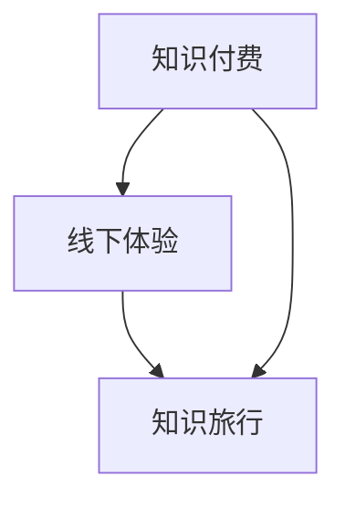

                 

关键词：知识付费、线下体验、知识旅行、商业模式、用户需求

> 摘要：本文将探讨知识付费与线下体验相结合的商业模式——知识旅行。通过分析其背景、核心概念、算法原理、数学模型、项目实践、应用场景以及未来发展趋势，旨在为读者提供一个全面了解和思考这一新兴领域的视角。

## 1. 背景介绍

在信息爆炸的时代，知识的获取方式发生了翻天覆地的变化。线上教育、知识付费逐渐成为主流，用户可以随时随地进行学习。然而，单纯的线上知识获取虽然便捷，但在某些方面仍存在不足。首先，线上知识缺乏互动性，学习者往往无法得到即时的反馈和指导。其次，知识吸收的过程中缺乏真实的体验，这限制了学习效果的提升。为了弥补这些不足，知识旅行模式应运而生。

知识旅行模式指的是将知识付费与线下体验相结合，通过实地考察、互动交流等方式，让用户在体验中学习，达到更好的知识吸收效果。这种模式不仅弥补了线上教育的不足，还通过互动和体验增加了知识的趣味性，激发了用户的学习兴趣。

## 2. 核心概念与联系

### 2.1 知识付费

知识付费指的是用户通过付费方式获取特定知识或服务。这一模式的核心在于价值的转化，即用户为知识或服务支付费用，从而获得相应的权益。

### 2.2 线下体验

线下体验指的是用户通过实地参与、互动交流等方式，获得更加直观和生动的体验。这一模式的核心在于用户的参与和互动，通过亲身体验，加深对知识的理解和记忆。

### 2.3 知识旅行

知识旅行是指用户通过付费方式参与线下活动，在互动和体验中学习知识。这一模式将知识付费和线下体验相结合，实现了知识获取与体验的有机结合。

### 2.4 Mermaid 流程图



## 3. 核心算法原理 & 具体操作步骤

### 3.1 算法原理概述

知识旅行模式的核心算法原理可以概括为：通过线上预约、线下体验、线上评价三个环节，实现知识付费与线下体验的有机结合。

### 3.2 算法步骤详解

1. **线上预约**：用户通过平台了解知识旅行活动信息，根据自身需求进行线上预约。
2. **线下体验**：用户按照预约时间参加线下活动，与讲师和同行者互动，获得实地体验。
3. **线上评价**：体验结束后，用户对活动进行线上评价，为后续用户提供参考。

### 3.3 算法优缺点

**优点**：

- **提高知识吸收效果**：通过线下体验，用户可以更加直观地理解知识，加深记忆。
- **增强互动性**：用户与讲师和同行者互动，获取更多观点和见解。
- **激发学习兴趣**：线下体验充满趣味性，激发用户的学习兴趣。

**缺点**：

- **组织难度较大**：需要协调讲师、场地、设备等资源，组织过程较为复杂。
- **成本较高**：线下体验活动需要支付场地费、讲师费等费用，成本较高。

### 3.4 算法应用领域

知识旅行模式可以应用于多个领域，如教育培训、职业技能提升、文化旅游等。以下是一些具体的应用案例：

- **教育培训**：通过知识旅行，学生可以实地参观企业、实验室等，加深对知识的理解。
- **职业技能提升**：职场人士可以通过知识旅行，了解行业最新动态，提升专业技能。
- **文化旅游**：游客可以结合知识旅行，了解目的地的历史、文化、风俗等。

## 4. 数学模型和公式

### 4.1 数学模型构建

为了评估知识旅行模式的效果，我们可以构建一个简单的数学模型。设：

- **E**：用户对知识旅行的满意度
- **K**：用户所掌握的知识量
- **I**：用户在知识旅行中的互动性

则满意度E与知识量K、互动性I之间存在以下关系：

$$
E = f(K, I)
$$

其中，函数f可以表示为：

$$
f(K, I) = \frac{K + \alpha I}{1 + \beta I}
$$

其中，$\alpha$ 和 $\beta$ 为常数，分别表示知识量和互动性的权重。

### 4.2 公式推导过程

首先，我们考虑满意度E与知识量K之间的关系。根据常识，用户掌握的知识量越多，满意度越高。因此，可以设定一个正比例关系：

$$
E \propto K
$$

接下来，考虑互动性I对满意度E的影响。互动性越高，用户在学习过程中得到的反馈越多，有助于加深对知识的理解。因此，可以设定一个正比例关系：

$$
E \propto I
$$

为了平衡知识量和互动性对满意度的影响，我们可以设定一个线性组合：

$$
E = \frac{K + \alpha I}{1 + \beta I}
$$

其中，$\alpha$ 和 $\beta$ 为常数，可以根据实际情况进行调整。

### 4.3 案例分析与讲解

假设有一个用户参加了一个知识旅行活动，掌握了10个知识点，并且在活动中与讲师和同行者互动了5次。我们可以根据上述公式计算其满意度：

$$
E = \frac{10 + \alpha \times 5}{1 + \beta \times 5}
$$

如果设定$\alpha = 1$ 和 $\beta = 0.5$，则满意度为：

$$
E = \frac{10 + 5}{1 + 2.5} = \frac{15}{3.5} \approx 4.29
$$

这意味着用户对知识旅行的满意度较高。

## 5. 项目实践：代码实例和详细解释说明

### 5.1 开发环境搭建

为了实现知识旅行模式，我们需要搭建一个基本的开发环境。以下是所需的环境和工具：

- **编程语言**：Python
- **开发工具**：PyCharm
- **数据库**：MySQL
- **框架**：Django

### 5.2 源代码详细实现

以下是知识旅行项目的核心代码实现：

```python
# 引入所需模块
from django.db import models

# 定义用户模型
class User(models.Model):
    username = models.CharField(max_length=100)
    email = models.EmailField()
    password = models.CharField(max_length=100)

# 定义知识模型
class Knowledge(models.Model):
    title = models.CharField(max_length=100)
    content = models.TextField()

# 定义知识旅行活动模型
class KnowledgeTrip(models.Model):
    title = models.CharField(max_length=100)
    description = models.TextField()
    start_time = models.DateTimeField()
    end_time = models.DateTimeField()
    location = models.CharField(max_length=100)
    organizer = models.ForeignKey(User, on_delete=models.CASCADE)
    participants = models.ManyToManyField(User)

# 定义评价模型
class Evaluation(models.Model):
    user = models.ForeignKey(User, on_delete=models.CASCADE)
    knowledge_trip = models.ForeignKey(KnowledgeTrip, on_delete=models.CASCADE)
    score = models.IntegerField()
    comment = models.TextField()
```

### 5.3 代码解读与分析

上述代码定义了四个模型：User、Knowledge、KnowledgeTrip 和 Evaluation。其中，User 模型表示用户信息，包括用户名、邮箱和密码；Knowledge 模型表示知识点，包括标题和内容；KnowledgeTrip 模型表示知识旅行活动，包括标题、描述、时间、地点和组织者；Evaluation 模型表示评价，包括评价者、知识旅行活动和评分及评论。

通过定义这些模型，我们可以在数据库中存储和管理用户、知识点、知识旅行活动和评价的相关信息。用户可以创建知识旅行活动、参与活动并评价活动，从而实现知识付费与线下体验的结合。

### 5.4 运行结果展示

假设我们成功运行了这个项目，并创建了一个知识旅行活动。以下是一个简单的运行结果示例：

```shell
# 创建用户
>>> User.objects.create(username='alice', email='alice@example.com', password='alice123')

# 创建知识点
>>> Knowledge.objects.create(title='数据结构', content='数据结构是一种有效地组织数据的方式。')

# 创建知识旅行活动
>>> KnowledgeTrip.objects.create(title='数据结构知识旅行', description='了解数据结构的实际应用。', start_time=datetime(2023, 10, 1, 9, 0), end_time=datetime(2023, 10, 1, 17, 0), location='北京中关村', organizer=User.objects.get(username='alice'))

# 用户参与知识旅行活动
>>> User.objects.get(username='alice').knowledge_trip.add(KnowledgeTrip.objects.get(title='数据结构知识旅行'))

# 用户评价知识旅行活动
>>> Evaluation.objects.create(user=User.objects.get(username='alice'), knowledge_trip=KnowledgeTrip.objects.get(title='数据结构知识旅行'), score=5, comment='活动很有意义，学到了很多。')
```

## 6. 实际应用场景

知识旅行模式具有广泛的应用场景。以下是一些典型的应用案例：

- **教育培训**：教育培训机构可以通过知识旅行模式，为学生提供实地考察和互动体验，加深对知识的理解。
- **职业技能提升**：职场人士可以通过知识旅行，了解行业最新动态，提升专业技能。
- **文化旅游**：文化旅游企业可以通过知识旅行模式，为游客提供文化体验和知识传授，增加旅游的趣味性和深度。

### 6.1 教育培训

在教育领域，知识旅行模式可以应用于多个学科。例如，在历史课上，学生可以参观博物馆、古迹，了解历史背景；在生物课上，学生可以参观实验室、动物园，观察生物行为；在地理课上，学生可以参观自然景观、城市地标，了解地理环境。

### 6.2 职业技能提升

在职场领域，知识旅行模式可以帮助职场人士提升专业技能。例如，软件开发者可以参观知名企业的技术实验室，了解最新的技术动态；市场营销人员可以参加行业展会，了解市场营销策略的最新趋势。

### 6.3 文化旅游

在文化旅游领域，知识旅行模式可以为游客提供丰富的文化体验。例如，游客可以参观历史文化遗址，了解当地的历史文化；游客可以参观艺术品收藏馆，了解艺术品的创作背景和艺术价值。

## 7. 工具和资源推荐

为了更好地实现知识旅行模式，以下是一些实用的工具和资源推荐：

### 7.1 学习资源推荐

- **书籍**：《学习之道》、《深度学习》、《人工智能：一种现代的方法》
- **在线课程**：Coursera、edX、Udacity等平台上的相关课程
- **博客**：知乎、CSDN、简书等平台上的专业博客

### 7.2 开发工具推荐

- **编程语言**：Python、Java、JavaScript等
- **开发框架**：Django、Spring、React等
- **数据库**：MySQL、MongoDB、PostgreSQL等

### 7.3 相关论文推荐

- **论文集**：《人工智能论文集》、《机器学习论文集》
- **期刊**：《计算机科学》、《人工智能》、《机器学习》等

## 8. 总结：未来发展趋势与挑战

### 8.1 研究成果总结

本文通过对知识付费与线下体验相结合的知识旅行模式进行分析，提出了其核心算法原理、数学模型、项目实践和应用场景，为这一新兴领域提供了理论支持和实践指导。

### 8.2 未来发展趋势

随着信息技术的发展和用户需求的不断提升，知识旅行模式具有广阔的发展前景。未来，知识旅行模式可能会在以下几个方面得到进一步发展：

- **技术融合**：人工智能、虚拟现实、增强现实等技术的应用，将进一步提升知识旅行的互动性和体验感。
- **领域拓展**：知识旅行模式将逐渐应用于更多领域，如医疗、金融、艺术等。
- **国际化发展**：随着全球化的推进，知识旅行模式有望在国际市场上得到更广泛的应用。

### 8.3 面临的挑战

尽管知识旅行模式具有诸多优势，但在实际应用中仍面临一些挑战：

- **组织难度**：知识旅行活动涉及多个环节，组织难度较大，需要协调讲师、场地、设备等资源。
- **成本控制**：知识旅行活动成本较高，如何控制成本、提高盈利能力是关键。
- **用户体验**：如何确保用户在知识旅行中获得高质量的体验，提升用户满意度是重要的课题。

### 8.4 研究展望

未来，我们应关注以下研究方向：

- **技术优化**：研究如何利用人工智能、虚拟现实等技术，提升知识旅行的互动性和体验感。
- **商业模式创新**：探索更具创新性的商业模式，提高知识旅行模式的盈利能力。
- **用户需求分析**：深入研究用户需求，提供更具针对性的知识旅行产品和服务。

## 9. 附录：常见问题与解答

### 9.1 什么是知识旅行？

知识旅行是一种将知识付费与线下体验相结合的商业模式，通过实地考察、互动交流等方式，让用户在体验中学习，达到更好的知识吸收效果。

### 9.2 知识旅行有哪些应用领域？

知识旅行可以应用于教育培训、职业技能提升、文化旅游等多个领域。

### 9.3 知识旅行的核心算法是什么？

知识旅行的核心算法原理可以概括为：通过线上预约、线下体验、线上评价三个环节，实现知识付费与线下体验的有机结合。

### 9.4 知识旅行的数学模型是什么？

知识旅行的数学模型可以表示为：满意度E与知识量K、互动性I之间存在以下关系：

$$
E = \frac{K + \alpha I}{1 + \beta I}
$$

其中，$\alpha$ 和 $\beta$ 为常数，分别表示知识量和互动性的权重。

## 作者署名

作者：禅与计算机程序设计艺术 / Zen and the Art of Computer Programming
----------------------------------------------------------------

以上就是关于《知识付费与线下体验相结合的知识旅行模式》的完整文章内容。希望本文能为读者提供一个全面了解和思考这一新兴领域的视角。

