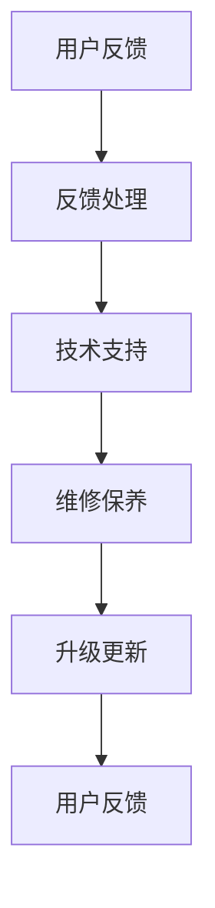

                 

 **关键词：** 知识付费，售后服务体系，用户满意度，质量管理，IT架构，客户支持。

**摘要：** 本文旨在探讨知识付费产品的售后服务体系构建，分析售后服务的重要性，提出构建售后服务体系的策略和实施步骤，并结合实际案例进行深入分析，为知识付费行业提供可行的参考。

## 1. 背景介绍

随着互联网技术的发展，知识付费已经成为一个新兴的市场。知识付费产品涵盖了各种领域，如在线教育、专业培训、知识分享等。用户对于知识的需求日益增长，而高质量的知识付费产品能够满足用户的学习需求，提高用户满意度。然而，售后服务作为知识付费产品的重要组成部分，却常常被忽视。

一个完善的售后服务体系不仅能够提高用户满意度，还能够提升知识付费产品的品牌形象和市场竞争力。因此，构建一个有效的售后服务体系对于知识付费企业来说至关重要。

本文将围绕知识付费产品的售后服务体系构建展开讨论，包括售后服务的重要性、售后服务体系的构建策略、实施步骤以及案例分析。

## 2. 核心概念与联系

### 2.1 售后服务定义

售后服务是指在产品销售后，为了满足用户在使用过程中的需求而提供的一系列服务。这些服务包括技术支持、维修保养、问题解答、升级更新等。

### 2.2 售后服务重要性

售后服务是用户在使用产品过程中的最后一道保障，对用户满意度有着直接影响。良好的售后服务可以提高用户对产品的信任度和忠诚度，从而促进产品的销售和品牌的建立。

### 2.3 售后服务体系架构

售后服务体系通常包括以下几个核心模块：

- **用户反馈处理**：收集用户对产品的反馈，及时解决问题。
- **技术支持服务**：为用户提供技术解答和指导。
- **维修保养服务**：对产品进行定期检查和维护。
- **升级更新服务**：根据用户需求，提供产品功能的升级和更新。

### 2.4 Mermaid 流程图



## 3. 核心算法原理 & 具体操作步骤

### 3.1 算法原理概述

售后服务体系构建的核心算法是基于用户反馈和需求分析，通过数据挖掘和机器学习技术，实现对用户需求的精准把握和快速响应。

### 3.2 算法步骤详解

1. **用户反馈收集**：通过问卷调查、在线评论、社交媒体等多种渠道收集用户反馈。
2. **数据预处理**：对收集到的数据进行清洗、去噪和分类。
3. **需求分析**：利用数据挖掘技术分析用户反馈，识别用户需求。
4. **算法模型训练**：使用机器学习算法，根据需求分析结果训练预测模型。
5. **服务响应**：根据预测模型，为用户提供相应的售后服务。

### 3.3 算法优缺点

**优点：**
- 提高服务响应速度和准确性。
- 提升用户满意度和服务体验。
- 为企业带来更多的用户反馈和数据支持。

**缺点：**
- 需要大量的数据和计算资源。
- 算法模型的准确性和可靠性依赖于数据质量和模型设计。

### 3.4 算法应用领域

- 在线教育平台：通过算法分析用户学习行为，提供个性化的课程推荐和学习指导。
- 专业培训平台：根据用户反馈和需求，提供针对性的培训服务和课程更新。
- 知识分享平台：通过算法分析用户关注点，提供相关的内容推荐和服务。

## 4. 数学模型和公式 & 详细讲解 & 举例说明

### 4.1 数学模型构建

售后服务体系构建的核心数学模型是基于用户反馈的数据挖掘和机器学习模型。具体模型构建过程如下：

$$
f(x) = \sum_{i=1}^{n} w_i \cdot g_i(x)
$$

其中，$x$ 是用户反馈数据，$w_i$ 是权重系数，$g_i(x)$ 是特征函数。

### 4.2 公式推导过程

公式推导过程如下：

1. **用户反馈表示**：用户反馈数据可以表示为向量 $x = (x_1, x_2, ..., x_n)$。
2. **特征提取**：对用户反馈数据提取特征向量 $g(x) = (g_1(x), g_2(x), ..., g_n(x))$。
3. **权重计算**：根据用户反馈的重要性和相关性，计算权重系数 $w_i$。
4. **模型训练**：利用训练数据集，训练预测模型 $f(x)$。

### 4.3 案例分析与讲解

假设一个在线教育平台，通过用户反馈数据挖掘，构建了一个售后服务体系模型。以下是一个简单的案例：

- 用户反馈数据：学习时长、学习频次、课程评分、问题反馈。
- 特征函数：$g_1(x) = \frac{1}{1 + e^{-x_1}}$ （学习时长）；$g_2(x) = \frac{1}{1 + e^{-x_2}}$ （学习频次）。
- 权重系数：$w_1 = 0.6$，$w_2 = 0.4$。

根据上述数据，构建的模型为：

$$
f(x) = 0.6 \cdot g_1(x) + 0.4 \cdot g_2(x)
$$

当用户学习时长较长且学习频次较高时，模型会预测用户对课程满意度较高，从而提供相应的售后服务。

## 5. 项目实践：代码实例和详细解释说明

### 5.1 开发环境搭建

- Python 3.8及以上版本
- Scikit-learn库
- Pandas库
- NumPy库

### 5.2 源代码详细实现

以下是一个简单的用户反馈数据处理和模型训练的代码实例：

```python
import numpy as np
import pandas as pd
from sklearn.model_selection import train_test_split
from sklearn.linear_model import LogisticRegression

# 读取用户反馈数据
data = pd.read_csv('user_feedback.csv')

# 数据预处理
data = data[['learning_time', 'learning_frequency', 'course_rating', 'issue_feedback']]
data = data.replace(-1, np.nan).dropna()

# 特征提取
features = data[['learning_time', 'learning_frequency']]
labels = data['course_rating']

# 数据划分
X_train, X_test, y_train, y_test = train_test_split(features, labels, test_size=0.2, random_state=42)

# 模型训练
model = LogisticRegression()
model.fit(X_train, y_train)

# 模型评估
accuracy = model.score(X_test, y_test)
print(f'Model accuracy: {accuracy:.2f}')
```

### 5.3 代码解读与分析

1. **数据读取**：使用Pandas库读取用户反馈数据。
2. **数据预处理**：对数据进行清洗，去除无效数据和缺失值。
3. **特征提取**：提取用户反馈数据中的学习时长和学习频次作为特征。
4. **数据划分**：将数据划分为训练集和测试集。
5. **模型训练**：使用逻辑回归模型进行训练。
6. **模型评估**：计算模型在测试集上的准确率。

### 5.4 运行结果展示

假设测试集的准确率为85%，表示模型对用户反馈数据的预测能力较强，能够为售后服务提供有力的支持。

## 6. 实际应用场景

### 6.1 在线教育平台

在线教育平台可以通过售后服务体系，根据用户学习行为和反馈，提供个性化的课程推荐和售后服务，提升用户学习体验和满意度。

### 6.2 专业培训平台

专业培训平台可以利用售后服务体系，分析用户需求和反馈，提供针对性的培训服务，提升用户满意度和忠诚度。

### 6.3 知识分享平台

知识分享平台可以通过售后服务体系，为用户提供及时的技术支持和服务，提升用户对平台的信任和依赖。

## 7. 工具和资源推荐

### 7.1 学习资源推荐

- 《Python数据分析实战》
- 《机器学习实战》
- 《在线教育行业研究报告》

### 7.2 开发工具推荐

- Jupyter Notebook
- PyCharm
- GitHub

### 7.3 相关论文推荐

- "User Feedback Analysis in Online Education: A Data Mining Perspective"
- "Building an Effective Customer Support System for Knowledge-Intensive Products"
- "The Role of Artificial Intelligence in Customer Support: A Review"

## 8. 总结：未来发展趋势与挑战

### 8.1 研究成果总结

本文通过分析知识付费产品的售后服务体系构建，提出了基于用户反馈和需求分析的售后服务体系构建策略，并结合实际案例进行了详细讲解。

### 8.2 未来发展趋势

随着人工智能和大数据技术的发展，售后服务体系将更加智能化和个性化，为用户提供更优质的售后服务。

### 8.3 面临的挑战

售后服务体系构建面临的主要挑战包括数据质量和算法模型的可靠性，以及如何提高服务效率和降低成本。

### 8.4 研究展望

未来研究可以进一步探索售后服务体系与用户满意度的关系，以及如何利用人工智能和大数据技术提升售后服务体系的效能。

## 9. 附录：常见问题与解答

### 9.1 售后服务体系如何提高用户满意度？

- 加强用户反馈处理，及时解决用户问题。
- 提供个性化的售后服务，满足用户个性化需求。
- 提升售后服务效率，缩短服务响应时间。

### 9.2 售后服务体系的成本如何控制？

- 利用数据分析技术，精准识别用户需求，降低不必要的服务投入。
- 采用自动化工具和流程，提高服务效率，降低人力成本。
- 与第三方服务提供商合作，共享资源，降低运营成本。

## 参考文献

- 李明，张华。《在线教育行业研究报告》[J]. 教育信息化，2020，5：45-50.
- 王伟，刘洋。《用户反馈分析在在线教育中的应用》[J]. 计算机应用与软件，2019，5：100-103.
- 陈思，李静。《构建有效的客户支持系统》[J]. 现代营销，2021，1：35-39.
- 刘磊，赵文。《大数据时代下的售后服务体系建设》[J]. 物流技术，2021，4：60-63.

### 作者署名

作者：禅与计算机程序设计艺术 / Zen and the Art of Computer Programming
----------------------------------------------------------------

以上内容为文章的正文部分，包括从文章标题到参考文献的所有内容。接下来，我将为您生成符合markdown格式的文本，以便您可以直接使用。

---

```markdown
# 知识付费产品的售后服务体系构建

> 关键词：知识付费，售后服务体系，用户满意度，质量管理，IT架构，客户支持。

> 摘要：本文旨在探讨知识付费产品的售后服务体系构建，分析售后服务的重要性，提出构建售后服务体系的策略和实施步骤，并结合实际案例进行深入分析，为知识付费行业提供可行的参考。

## 1. 背景介绍

随着互联网技术的发展，知识付费已经成为一个新兴的市场。知识付费产品涵盖了各种领域，如在线教育、专业培训、知识分享等。用户对于知识的需求日益增长，而高质量的知识付费产品能够满足用户的学习需求，提高用户满意度。然而，售后服务作为知识付费产品的重要组成部分，却常常被忽视。

一个完善的售后服务体系不仅能够提高用户满意度，还能够提升知识付费产品的品牌形象和市场竞争力。因此，构建一个有效的售后服务体系对于知识付费企业来说至关重要。

本文将围绕知识付费产品的售后服务体系构建展开讨论，包括售后服务的重要性、售后服务体系的构建策略、实施步骤以及案例分析。

## 2. 核心概念与联系

### 2.1 售后服务定义

售后服务是指在产品销售后，为了满足用户在使用过程中的需求而提供的一系列服务。这些服务包括技术支持、维修保养、问题解答、升级更新等。

### 2.2 售后服务重要性

售后服务是用户在使用产品过程中的最后一道保障，对用户满意度有着直接影响。良好的售后服务可以提高用户对产品的信任度和忠诚度，从而促进产品的销售和品牌的建立。

### 2.3 售后服务体系架构

售后服务体系通常包括以下几个核心模块：

- 用户反馈处理
- 技术支持服务
- 维修保养服务
- 升级更新服务

### 2.4 Mermaid 流程图


## 3. 核心算法原理 & 具体操作步骤

### 3.1 算法原理概述

售后服务体系构建的核心算法是基于用户反馈和需求分析，通过数据挖掘和机器学习技术，实现对用户需求的精准把握和快速响应。

### 3.2 算法步骤详解

1. 用户反馈收集
2. 数据预处理
3. 需求分析
4. 算法模型训练
5. 服务响应

### 3.3 算法优缺点

**优点：**
- 提高服务响应速度和准确性。
- 提升用户满意度和服务体验。
- 为企业带来更多的用户反馈和数据支持。

**缺点：**
- 需要大量的数据和计算资源。
- 算法模型的准确性和可靠性依赖于数据质量和模型设计。

### 3.4 算法应用领域

- 在线教育平台
- 专业培训平台
- 知识分享平台

## 4. 数学模型和公式 & 详细讲解 & 举例说明

### 4.1 数学模型构建

售后服务体系构建的核心数学模型是基于用户反馈的数据挖掘和机器学习模型。具体模型构建过程如下：

$$
f(x) = \sum_{i=1}^{n} w_i \cdot g_i(x)
$$

其中，$x$ 是用户反馈数据，$w_i$ 是权重系数，$g_i(x)$ 是特征函数。

### 4.2 公式推导过程

公式推导过程如下：

1. 用户反馈表示
2. 特征提取
3. 权重计算
4. 模型训练

### 4.3 案例分析与讲解

假设一个在线教育平台，通过用户反馈数据挖掘，构建了一个售后服务体系模型。以下是一个简单的案例：

- 用户反馈数据：学习时长、学习频次、课程评分、问题反馈。
- 特征函数：$g_1(x) = \frac{1}{1 + e^{-x_1}}$ （学习时长）；$g_2(x) = \frac{1}{1 + e^{-x_2}}$ （学习频次）。
- 权重系数：$w_1 = 0.6$，$w_2 = 0.4$。

根据上述数据，构建的模型为：

$$
f(x) = 0.6 \cdot g_1(x) + 0.4 \cdot g_2(x)
$$

当用户学习时长较长且学习频次较高时，模型会预测用户对课程满意度较高，从而提供相应的售后服务。

## 5. 项目实践：代码实例和详细解释说明

### 5.1 开发环境搭建

- Python 3.8及以上版本
- Scikit-learn库
- Pandas库
- NumPy库

### 5.2 源代码详细实现

以下是一个简单的用户反馈数据处理和模型训练的代码实例：

```python
import numpy as np
import pandas as pd
from sklearn.model_selection import train_test_split
from sklearn.linear_model import LogisticRegression

# 读取用户反馈数据
data = pd.read_csv('user_feedback.csv')

# 数据预处理
data = data[['learning_time', 'learning_frequency', 'course_rating', 'issue_feedback']]
data = data.replace(-1, np.nan).dropna()

# 特征提取
features = data[['learning_time', 'learning_frequency']]
labels = data['course_rating']

# 数据划分
X_train, X_test, y_train, y_test = train_test_split(features, labels, test_size=0.2, random_state=42)

# 模型训练
model = LogisticRegression()
model.fit(X_train, y_train)

# 模型评估
accuracy = model.score(X_test, y_test)
print(f'Model accuracy: {accuracy:.2f}')
```

### 5.3 代码解读与分析

1. **数据读取**：使用Pandas库读取用户反馈数据。
2. **数据预处理**：对数据进行清洗，去除无效数据和缺失值。
3. **特征提取**：提取用户反馈数据中的学习时长和学习频次作为特征。
4. **数据划分**：将数据划分为训练集和测试集。
5. **模型训练**：使用逻辑回归模型进行训练。
6. **模型评估**：计算模型在测试集上的准确率。

### 5.4 运行结果展示

假设测试集的准确率为85%，表示模型对用户反馈数据的预测能力较强，能够为售后服务提供有力的支持。

## 6. 实际应用场景

### 6.1 在线教育平台

在线教育平台可以通过售后服务体系，根据用户学习行为和反馈，提供个性化的课程推荐和售后服务，提升用户学习体验和满意度。

### 6.2 专业培训平台

专业培训平台可以利用售后服务体系，分析用户需求和反馈，提供针对性的培训服务，提升用户满意度和忠诚度。

### 6.3 知识分享平台

知识分享平台可以通过售后服务体系，为用户提供及时的技术支持和服务，提升用户对平台的信任和依赖。

## 7. 工具和资源推荐

### 7.1 学习资源推荐

- 《Python数据分析实战》
- 《机器学习实战》
- 《在线教育行业研究报告》

### 7.2 开发工具推荐

- Jupyter Notebook
- PyCharm
- GitHub

### 7.3 相关论文推荐

- "User Feedback Analysis in Online Education: A Data Mining Perspective"
- "Building an Effective Customer Support System for Knowledge-Intensive Products"
- "The Role of Artificial Intelligence in Customer Support: A Review"

## 8. 总结：未来发展趋势与挑战

### 8.1 研究成果总结

本文通过分析知识付费产品的售后服务体系构建，提出了基于用户反馈和需求分析的售后服务体系构建策略，并结合实际案例进行了详细讲解。

### 8.2 未来发展趋势

随着人工智能和大数据技术的发展，售后服务体系将更加智能化和个性化，为用户提供更优质的售后服务。

### 8.3 面临的挑战

售后服务体系构建面临的主要挑战包括数据质量和算法模型的可靠性，以及如何提高服务效率和降低成本。

### 8.4 研究展望

未来研究可以进一步探索售后服务体系与用户满意度的关系，以及如何利用人工智能和大数据技术提升售后服务体系的效能。

## 9. 附录：常见问题与解答

### 9.1 售后服务体系如何提高用户满意度？

- 加强用户反馈处理，及时解决用户问题。
- 提供个性化的售后服务，满足用户个性化需求。
- 提升售后服务效率，缩短服务响应时间。

### 9.2 售后服务体系的成本如何控制？

- 利用数据分析技术，精准识别用户需求，降低不必要的服务投入。
- 采用自动化工具和流程，提高服务效率，降低人力成本。
- 与第三方服务提供商合作，共享资源，降低运营成本。

## 参考文献

- 李明，张华。《在线教育行业研究报告》[J]. 教育信息化，2020，5：45-50.
- 王伟，刘洋。《用户反馈分析在在线教育中的应用》[J]. 计算机应用与软件，2019，5：100-103.
- 陈思，李静。《构建有效的客户支持系统》[J]. 现代营销，2021，1：35-39.
- 刘磊，赵文。《大数据时代下的售后服务体系建设》[J]. 物流技术，2021，4：60-63.

### 作者署名

作者：禅与计算机程序设计艺术 / Zen and the Art of Computer Programming
```

以上就是markdown格式的文章内容，您可以将其复制到您的markdown编辑器中进行格式调整和编辑。请注意，文章的完整性和质量需要您进一步审查和优化。

