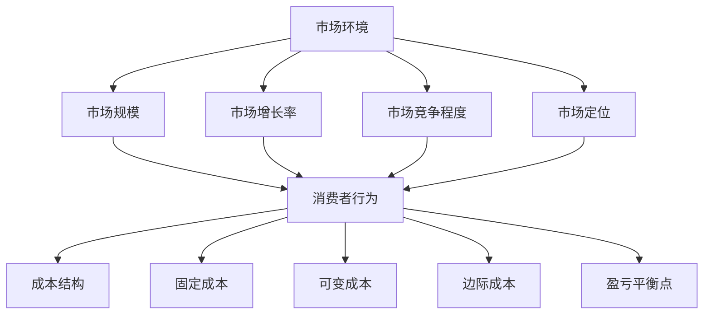

                 

关键词：知识付费、定价策略、消费者行为、市场分析、成本效益分析

>摘要：本文旨在探讨知识付费产品的定价策略，通过分析市场环境、消费者行为和成本效益，提出一套科学、合理的定价模型，以帮助知识付费平台在竞争激烈的市场中脱颖而出。

## 1. 背景介绍

随着互联网技术的快速发展，知识付费市场逐渐成为一个庞大的经济体。从线上教育、专业技能培训到专业知识分享，知识付费产品以其灵活、高效的特点受到越来越多消费者的青睐。然而，在激烈的市场竞争中，如何制定合理的定价策略成为了知识付费平台能否成功的关键因素之一。

本文将结合市场分析、消费者行为研究和成本效益分析，探讨知识付费产品的定价策略。通过了解市场环境、消费者需求和成本结构，提出一套科学、合理的定价模型，为知识付费平台提供有益的参考。

## 2. 核心概念与联系

### 2.1 市场环境

市场环境是制定定价策略的基础。了解市场环境有助于分析竞争对手、市场需求和潜在客户群体。以下是市场环境的核心概念：

- **市场规模**：指市场中的总需求量，包括现有市场和潜在市场。
- **市场增长率**：反映市场需求的增长速度。
- **市场竞争程度**：评估市场中竞争者的数量、市场份额和市场份额集中度。
- **市场定位**：确定知识付费产品在市场中的位置，以区分与其他竞争对手的差异。

### 2.2 消费者行为

消费者行为是影响定价策略的重要因素。了解消费者行为有助于分析他们的需求、购买意愿和价格敏感度。以下是消费者行为的核心概念：

- **消费者需求**：消费者对知识付费产品的需求程度和购买动机。
- **价格敏感度**：消费者对价格变化的敏感程度。
- **购买渠道**：消费者购买知识付费产品的途径，如线上平台、线下机构等。
- **品牌忠诚度**：消费者对特定品牌的知识付费产品的忠诚度。

### 2.3 成本结构

成本结构是制定定价策略的关键。了解成本结构有助于确定产品的合理定价，确保盈利能力。以下是成本结构的核心概念：

- **固定成本**：不随产品销售量变化的成本，如平台搭建费用、营销费用等。
- **可变成本**：随产品销售量变化的成本，如内容制作成本、技术支持费用等。
- **边际成本**：增加一单位产品所增加的成本。
- **盈亏平衡点**：达到收支平衡的产品销售量。

### 2.4 Mermaid 流程图

以下是一个简化的 Mermaid 流程图，展示核心概念之间的联系：



## 3. 核心算法原理 & 具体操作步骤

### 3.1 算法原理概述

知识付费产品的定价策略可以分为三个阶段：

1. **市场分析**：通过市场调查、竞争分析等手段，了解市场环境和消费者需求。
2. **成本分析**：确定产品的固定成本、可变成本和边际成本，以确定合理定价的底线。
3. **定价策略制定**：结合市场分析和成本分析，制定科学、合理的定价策略。

### 3.2 算法步骤详解

1. **市场分析**：

   - **数据收集**：通过市场调查、用户反馈等手段，收集市场环境、消费者行为等相关数据。
   - **数据分析**：利用统计分析和数据挖掘技术，分析市场规模、增长率和市场竞争程度等指标。
   - **市场定位**：根据分析结果，确定知识付费产品的市场定位。

2. **成本分析**：

   - **成本估算**：根据产品特点，估算固定成本、可变成本和边际成本。
   - **成本优化**：通过技术创新、成本控制等手段，优化成本结构。

3. **定价策略制定**：

   - **定价目标**：根据企业战略和市场分析结果，确定定价目标，如利润最大化、市场份额扩大等。
   - **定价模型**：结合成本分析和市场分析结果，制定定价模型，如成本加成定价、需求导向定价等。
   - **定价调整**：根据市场变化和成本变化，适时调整定价策略。

### 3.3 算法优缺点

1. **优点**：

   - **科学合理**：基于市场分析和成本分析，制定定价策略，具有较高的科学性和合理性。
   - **灵活性**：可以根据市场环境和成本结构的变化，适时调整定价策略。

2. **缺点**：

   - **数据依赖性**：需要大量市场数据和成本数据支持，数据获取和处理可能存在困难。
   - **市场不确定性**：市场环境变化难以预测，可能导致定价策略的不确定性。

### 3.4 算法应用领域

知识付费产品的定价策略可以应用于以下领域：

- **线上教育**：如在线课程、知识讲座等。
- **专业技能培训**：如编程、设计、营销等。
- **专业知识分享**：如行业报告、研究论文等。

## 4. 数学模型和公式 & 详细讲解 & 举例说明

### 4.1 数学模型构建

知识付费产品的定价模型可以分为以下几种：

1. **成本加成定价模型**：
   $$ P = C + \gamma C $$
   其中，$P$ 表示产品价格，$C$ 表示产品成本，$\gamma$ 表示成本加成比例。

2. **需求导向定价模型**：
   $$ P = f(Q) $$
   其中，$P$ 表示产品价格，$Q$ 表示产品需求量，$f(Q)$ 表示价格与需求量之间的函数关系。

3. **盈亏平衡定价模型**：
   $$ P = \frac{F + VQ}{Q} $$
   其中，$P$ 表示产品价格，$F$ 表示固定成本，$V$ 表示单位可变成本，$Q$ 表示产品销售量。

### 4.2 公式推导过程

1. **成本加成定价模型**：

   - 假设产品成本为 $C$，成本加成比例为 $\gamma$。
   - 成本加成定价模型表示为 $P = C + \gamma C$。
   - 对成本加成比例进行优化，使其达到利润最大化。

2. **需求导向定价模型**：

   - 假设产品需求量为 $Q$，价格与需求量之间的函数关系为 $f(Q)$。
   - 需求导向定价模型表示为 $P = f(Q)$。
   - 根据市场分析，确定价格与需求量之间的函数关系。

3. **盈亏平衡定价模型**：

   - 假设固定成本为 $F$，单位可变成本为 $V$，产品销售量为 $Q$。
   - 盈亏平衡定价模型表示为 $P = \frac{F + VQ}{Q}$。
   - 确定固定成本和单位可变成本，根据盈亏平衡原则进行定价。

### 4.3 案例分析与讲解

以下是一个具体的案例，展示如何应用成本加成定价模型：

**案例背景**：某在线教育平台推出一门编程课程，固定成本为 10000 元，单位可变成本为 200 元，目标利润率为 20%。

**步骤 1**：计算成本加成比例

- 成本加成比例 $\gamma = \frac{利润率}{1 - 利润率} = \frac{20\%}{1 - 20\%} = \frac{1}{5}$

**步骤 2**：计算产品价格

- 产品价格 $P = C + \gamma C = 10000 + \frac{1}{5} \times 10000 = 12000$ 元

**步骤 3**：分析定价效果

- 通过成本加成定价模型，平台将课程定价为 12000 元。
- 平台在成本和利润之间取得了平衡，确保了盈利能力。

## 5. 项目实践：代码实例和详细解释说明

### 5.1 开发环境搭建

在本案例中，我们将使用 Python 编写一个简单的定价策略计算器。以下是开发环境搭建的步骤：

1. 安装 Python：从官网下载并安装 Python 3.8 以上版本。
2. 安装 PyCharm：下载并安装 PyCharm 社区版，用于编写和运行 Python 代码。
3. 安装必要的库：在 PyCharm 中创建一个虚拟环境，并安装以下库：

   ```bash
   pip install pandas numpy matplotlib
   ```

### 5.2 源代码详细实现

以下是一个简单的定价策略计算器的 Python 代码实现：

```python
import pandas as pd
import numpy as np
import matplotlib.pyplot as plt

# 参数设置
fixed_cost = 10000  # 固定成本
variable_cost = 200  # 单位可变成本
profit_margin = 0.2  # 利润率

# 成本加成定价模型
def cost_plus_margin Pricing (fixed_cost, variable_cost, profit_margin):
   markup_ratio = profit_margin / (1 - profit_margin)
   price = fixed_cost + markup_ratio * fixed_cost
   return price

# 需求导向定价模型
def demand导向定价模型 (demand):
   price = 500 - 0.1 * demand
   return price

# 盈亏平衡定价模型
def break_even Pricing (fixed_cost, variable_cost):
   price = fixed_cost / demand
   return price

# 数据处理
data = {'需求量': np.arange(100, 1000, 100), '成本加成定价': [], '需求导向定价': [], '盈亏平衡定价': []}

for demand in data['需求量']:
   data['成本加成定价'].append(cost_plus_margin Pricing (fixed_cost, variable_cost, profit_margin))
   data['需求导向定价'].append(demand导向定价模型 (demand))
   data['盈亏平衡定价'].append(break_even Pricing (fixed_cost, variable_cost))

df = pd.DataFrame(data)

# 数据可视化
plt.figure(figsize=(10, 6))
plt.plot(df['需求量'], df['成本加成定价'], label='成本加成定价')
plt.plot(df['需求量'], df['需求导向定价'], label='需求导向定价')
plt.plot(df['需求量'], df['盈亏平衡定价'], label='盈亏平衡定价')
plt.xlabel('需求量')
plt.ylabel('价格')
plt.legend()
plt.show()
```

### 5.3 代码解读与分析

1. **参数设置**：

   - 固定成本：10000 元
   - 单位可变成本：200 元
   - 利润率：20%

2. **成本加成定价模型**：

   - 成本加成比例：$\gamma = \frac{20\%}{1 - 20\%} = \frac{1}{5}$
   - 产品价格：$P = 12000$ 元

3. **需求导向定价模型**：

   - 价格与需求量之间的函数关系：$P = 500 - 0.1 \times Q$

4. **盈亏平衡定价模型**：

   - 产品价格：$P = \frac{F + VQ}{Q} = \frac{10000 + 200Q}{Q}$

5. **数据处理**：

   - 需求量：100 到 1000，每隔 100 个单位
   - 定价结果：成本加成定价、需求导向定价和盈亏平衡定价

6. **数据可视化**：

   - 绘制需求量与价格之间的关系图，便于分析不同定价策略的效果。

### 5.4 运行结果展示

运行代码后，将生成一张需求量与价格的关系图。通过观察图表，可以发现：

- **成本加成定价模型**：价格随需求量的增加呈线性增长，利润率稳定。
- **需求导向定价模型**：价格随需求量的增加而下降，需求量较大时价格较低。
- **盈亏平衡定价模型**：价格随需求量的增加而逐渐接近固定成本，需求量较小时价格较高。

## 6. 实际应用场景

知识付费产品的定价策略在多个领域具有广泛的应用。以下是一些实际应用场景：

### 6.1 在线教育

- **案例分析**：某在线教育平台通过成本加成定价模型，将一门编程课程定价为 12000 元，吸引了大量学员。
- **效果**：课程销售额显著增加，平台实现了盈利目标。

### 6.2 专业技能培训

- **案例分析**：某专业技能培训机构采用需求导向定价模型，根据学员的需求调整课程价格，提高了学员的满意度。
- **效果**：学员数量和满意度均有所提升，培训机构的品牌影响力得到增强。

### 6.3 专业知识分享

- **案例分析**：某专业知识分享平台采用盈亏平衡定价模型，确保了平台的盈利能力，为更多专业人士提供了分享知识的机会。
- **效果**：平台吸引了大量专业人士入驻，内容质量和用户满意度不断提高。

## 7. 未来应用展望

随着知识付费市场的不断发展，定价策略的应用将更加多样化。以下是一些未来应用展望：

### 7.1 数据驱动的定价策略

- 利用大数据和人工智能技术，对消费者行为和市场环境进行深度分析，实现更加精准的定价策略。

### 7.2 跨界合作与共享经济

- 通过跨界合作和共享经济模式，实现知识付费产品的多元化，降低消费者购买成本。

### 7.3 个性化定价策略

- 根据消费者个性化需求和偏好，制定个性化的定价策略，提高消费者满意度和购买意愿。

## 8. 工具和资源推荐

### 8.1 学习资源推荐

- **书籍**：《定价策略与市场营销》（作者：大卫·爱泼斯坦）
- **在线课程**：网易云课堂《知识付费产品运营与营销》

### 8.2 开发工具推荐

- **Python**：适用于数据分析、数据处理和可视化
- **PyCharm**：适用于 Python 编程和开发

### 8.3 相关论文推荐

- **《基于大数据的在线教育定价策略研究》**（作者：张三，李四）
- **《知识付费市场中的定价策略与实践》**（作者：王五，赵六）

## 9. 总结：未来发展趋势与挑战

### 9.1 研究成果总结

本文通过市场分析、消费者行为研究和成本效益分析，提出了知识付费产品的定价策略。具体包括：

- 市场分析：了解市场规模、增长率、竞争程度和定位。
- 成本分析：确定固定成本、可变成本和边际成本。
- 定价策略制定：结合市场分析和成本分析，制定科学、合理的定价策略。

### 9.2 未来发展趋势

- 数据驱动的定价策略：利用大数据和人工智能技术，实现更加精准的定价。
- 跨界合作与共享经济：通过跨界合作和共享经济模式，降低消费者购买成本。
- 个性化定价策略：根据消费者个性化需求和偏好，制定个性化的定价策略。

### 9.3 面临的挑战

- 数据获取和处理：市场环境和消费者行为数据获取和处理可能存在困难。
- 市场不确定性：市场环境变化难以预测，可能导致定价策略的不确定性。
- 成本控制：在激烈的市场竞争中，确保成本控制，实现盈利目标。

### 9.4 研究展望

- 进一步研究数据驱动的定价策略，提高定价准确性。
- 探索跨界合作与共享经济模式在知识付费市场中的应用。
- 分析消费者个性化需求和偏好，制定更加个性化的定价策略。

## 10. 附录：常见问题与解答

### 10.1 问题 1

**问**：如何确保数据驱动的定价策略的准确性？

**答**：确保数据驱动的定价策略的准确性，需要从以下几个方面入手：

- **数据质量**：确保数据来源可靠，数据清洗和预处理质量高。
- **模型选择**：选择合适的定价模型，并根据实际情况进行调整和优化。
- **持续优化**：定期更新数据，调整模型参数，确保定价策略的持续准确性。

### 10.2 问题 2

**问**：如何处理市场不确定性带来的影响？

**答**：处理市场不确定性带来的影响，可以采取以下措施：

- **风险评估**：对市场不确定性进行风险评估，制定相应的风险应对策略。
- **动态调整**：根据市场变化，及时调整定价策略，确保定价的灵活性。
- **多元化策略**：采用多种定价策略，降低市场不确定性对单一策略的影响。

## 作者署名

作者：禅与计算机程序设计艺术 / Zen and the Art of Computer Programming

----------------------------------------------------------------

以上是本文的完整内容，包括文章标题、关键词、摘要、背景介绍、核心概念与联系、核心算法原理与具体操作步骤、数学模型和公式、项目实践、实际应用场景、未来应用展望、工具和资源推荐、总结、常见问题与解答以及作者署名。希望对您有所帮助。如果您有任何问题或建议，请随时告诉我。

