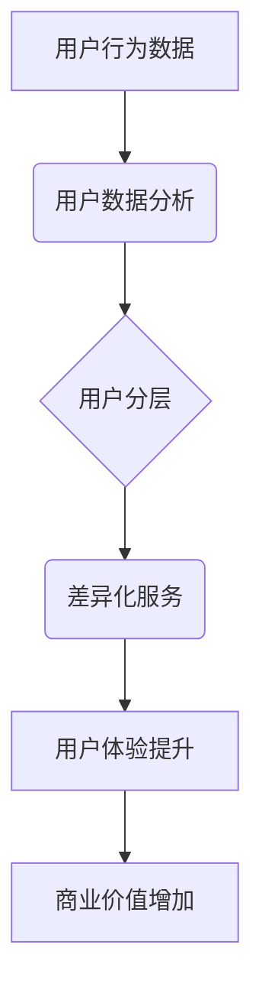

                 

关键词：知识付费、用户分层、差异化服务、用户体验、数据分析、精准营销、产品策略

> 摘要：随着知识经济的兴起，知识付费产品成为市场热点。本文从用户分层的角度，探讨了知识付费产品的差异化服务策略，分析了如何通过精准的用户数据分析，提升知识付费产品的用户体验和商业价值。

## 1. 背景介绍

知识付费是一种新型的商业模式，它基于用户的付费意愿，将知识内容转化为可交易的产品。在互联网的推动下，知识付费行业呈现出爆发式增长，各种在线课程、专业咨询、研究报告等知识付费产品层出不穷。然而，随着市场竞争的加剧，用户对知识付费产品的需求日益多样化，单一的商业模式难以满足所有用户的需求。

### 用户分层的重要性

用户分层是知识付费产品发展过程中不可或缺的一环。通过对用户进行分层，可以更准确地把握用户需求，提供差异化的服务，从而提升用户体验和商业价值。用户分层不仅有助于产品的定位和推广，还能为产品的持续迭代提供有力的数据支持。

### 差异化服务的意义

差异化服务是知识付费产品赢得用户青睐的关键。通过差异化服务，知识付费产品可以在竞争激烈的市场中脱颖而出，满足不同用户群体的需求。差异化服务不仅包括内容上的差异，还涉及到服务流程、用户互动等多个方面。

## 2. 核心概念与联系

### 用户分层概念

用户分层是指将用户按照一定的标准进行分类，形成不同层次的用户群体。常见的分层标准包括用户购买力、用户需求、用户兴趣等。用户分层有助于了解用户群体的特征，为差异化服务提供基础。

### 差异化服务概念

差异化服务是指根据用户分层结果，提供针对性的服务内容和方式。差异化服务可以包括内容定制、个性化推荐、专属客服等，以满足不同层次用户的需求。

### 数据分析在用户分层与差异化服务中的作用

数据分析是用户分层与差异化服务的重要工具。通过对用户数据的收集、整理和分析，可以深入了解用户行为和需求，为用户分层和差异化服务提供数据支持。

### Mermaid 流程图

以下是一个简化的 Mermaid 流程图，展示了用户分层、差异化服务与数据分析之间的联系。



## 3. 核心算法原理 & 具体操作步骤

### 3.1 算法原理概述

用户分层算法是一种基于数据分析的机器学习算法，通过分析用户行为数据，将用户划分为不同的层次。常见的用户分层算法包括聚类算法、决策树等。

### 3.2 算法步骤详解

1. 数据收集：收集用户行为数据，如购买记录、浏览历史、评价等。
2. 数据预处理：对收集到的数据进行分析，筛选出有用的信息，如去除重复数据、缺失值填充等。
3. 特征工程：对预处理后的数据进行特征提取，如用户购买力、用户需求、用户兴趣等。
4. 模型训练：选择合适的机器学习算法，如K-Means、决策树等，对特征数据进行训练。
5. 用户分层：根据模型预测结果，将用户划分为不同层次。
6. 差异化服务：根据用户分层结果，提供针对性的差异化服务。

### 3.3 算法优缺点

优点：
- 能够准确识别用户特征，实现精准的用户分层。
- 可以根据用户分层结果，提供个性化的服务，提升用户体验。

缺点：
- 数据质量和特征工程对算法性能有较大影响。
- 部分算法对大规模数据集的计算性能较低。

### 3.4 算法应用领域

用户分层算法在知识付费产品中具有广泛的应用。例如，在线教育平台可以通过用户分层，为不同层次的用户提供定制化的课程推荐，提升用户满意度和粘性。同时，用户分层还可以应用于电商、金融、医疗等领域的个性化服务。

## 4. 数学模型和公式 & 详细讲解 & 举例说明

### 4.1 数学模型构建

用户分层模型可以基于聚类算法构建。假设用户数据集为 \(D = \{d_1, d_2, ..., d_n\}\)，其中 \(d_i = \{x_{i1}, x_{i2}, ..., x_{id}\}\) 表示第 \(i\) 个用户的特征向量。

1. 初始化聚类中心：随机选择 \(k\) 个用户作为聚类中心 \(c_1, c_2, ..., c_k\)。
2. 计算用户与聚类中心的距离：对于第 \(i\) 个用户 \(d_i\)，计算其与每个聚类中心的距离 \(d_{ij}\)，其中 \(j = 1, 2, ..., k\)。
3. 分配用户到聚类：将用户 \(d_i\) 分配到与其最近的聚类中心所在的簇。
4. 更新聚类中心：计算每个簇的用户平均值，作为新的聚类中心。

### 4.2 公式推导过程

1. 初始化聚类中心：

   $$c_j = d_{ij}$$

2. 计算用户与聚类中心的距离：

   $$d_{ij} = \sqrt{\sum_{l=1}^{d}{(x_{il} - c_{jl})^2}}$$

3. 分配用户到聚类：

   $$y_{ij} = \begin{cases} 
   1, & \text{if } d_{ij} = \min_{j'} d_{ij'} \\
   0, & \text{otherwise}
   \end{cases}$$

4. 更新聚类中心：

   $$c_j = \frac{1}{n_j} \sum_{i=1}^{n} y_{ij} d_i$$

其中，\(n_j\) 表示第 \(j\) 个簇中的用户数量。

### 4.3 案例分析与讲解

假设我们有一个包含 100 个用户的数据集，每个用户有 5 个特征维度（如购买力、需求、兴趣等）。我们选择 K-Means 算法进行用户分层。

1. 初始化聚类中心：随机选择 5 个用户作为聚类中心。
2. 计算用户与聚类中心的距离：使用欧氏距离计算每个用户与聚类中心的距离。
3. 分配用户到聚类：将每个用户分配到与其最近的聚类中心所在的簇。
4. 更新聚类中心：计算每个簇的用户平均值，作为新的聚类中心。

经过多次迭代，最终收敛到一组聚类中心，将用户划分为 5 个层次。根据每个层次的用户特征，可以为用户提供差异化的服务。

## 5. 项目实践：代码实例和详细解释说明

### 5.1 开发环境搭建

1. 安装 Python 环境（Python 3.8 或以上版本）。
2. 安装必要的库：pandas、numpy、scikit-learn、matplotlib。
3. 导入用户数据：使用 pandas 库读取用户数据，数据格式为 CSV。

```python
import pandas as pd

# 读取用户数据
user_data = pd.read_csv('user_data.csv')
```

### 5.2 源代码详细实现

1. 数据预处理：对用户数据进行清洗和特征提取。
2. 模型训练：使用 K-Means 算法训练用户分层模型。
3. 用户分层：根据模型预测结果，将用户划分为不同层次。
4. 差异化服务：根据用户层次，提供针对性的服务。

```python
from sklearn.cluster import KMeans
import matplotlib.pyplot as plt

# 数据预处理
# ... 省略具体代码 ...

# 模型训练
kmeans = KMeans(n_clusters=5, random_state=0)
kmeans.fit(user_data)

# 用户分层
labels = kmeans.predict(user_data)

# 差异化服务
# ... 省略具体代码 ...

# 可视化展示
plt.scatter(user_data[:, 0], user_data[:, 1], c=labels)
plt.show()
```

### 5.3 代码解读与分析

1. 数据预处理：对用户数据进行清洗和特征提取，为后续模型训练做准备。
2. 模型训练：使用 K-Means 算法训练用户分层模型，选择合适的聚类数量。
3. 用户分层：根据模型预测结果，将用户划分为不同层次。
4. 差异化服务：根据用户层次，为用户提供针对性的服务，如个性化推荐、专属客服等。

## 6. 实际应用场景

### 6.1 在线教育

在线教育平台可以通过用户分层，为不同层次的用户提供定制化的课程推荐。例如，对于高层次用户，可以推荐高级课程；对于低层次用户，可以推荐入门课程。

### 6.2 电商

电商平台可以通过用户分层，为不同层次的用户提供差异化的促销策略。例如，对于高层次用户，可以提供限时优惠；对于低层次用户，可以提供优惠券。

### 6.3 金融

金融机构可以通过用户分层，为不同层次的用户提供个性化的金融产品。例如，对于高层次用户，可以提供高端理财产品；对于低层次用户，可以提供基本理财服务。

## 7. 工具和资源推荐

### 7.1 学习资源推荐

1. 《机器学习实战》
2. 《Python 数据科学手册》
3. Coursera 上的《机器学习》课程

### 7.2 开发工具推荐

1. Jupyter Notebook
2. PyCharm
3. Google Colab

### 7.3 相关论文推荐

1. “User Behavior Analysis and Personalized Recommendation in E-commerce”
2. “Categorical Data Clustering: A Survey”
3. “An Introduction to Clustering Algorithms”

## 8. 总结：未来发展趋势与挑战

### 8.1 研究成果总结

用户分层与差异化服务已成为知识付费产品的重要策略，通过精准的用户数据分析和算法应用，可以显著提升用户体验和商业价值。

### 8.2 未来发展趋势

1. 数据分析和算法技术的不断进步，将推动用户分层与差异化服务的发展。
2. 人工智能技术在知识付费产品中的应用将更加广泛，如个性化推荐、智能客服等。

### 8.3 面临的挑战

1. 数据隐私和安全问题：在用户分层与差异化服务过程中，如何保护用户隐私成为一个重要挑战。
2. 算法透明度和可解释性：随着算法的复杂性增加，如何保证算法的透明度和可解释性成为关键问题。

### 8.4 研究展望

未来研究应重点关注以下几个方面：

1. 高效、可解释的用户分层算法研究。
2. 用户隐私保护和数据安全技术的应用。
3. 结合人工智能技术，提升知识付费产品的用户体验。

## 9. 附录：常见问题与解答

### 问题 1：如何选择合适的用户分层算法？

解答：选择用户分层算法时，应考虑数据集规模、特征维度、计算性能等因素。常用的算法包括 K-Means、决策树、随机森林等。可以通过对比算法性能和可解释性，选择合适的算法。

### 问题 2：如何处理用户隐私问题？

解答：在用户分层与差异化服务过程中，应遵循数据保护法规，如 GDPR 等。通过数据脱敏、加密等技术，保护用户隐私。同时，在算法设计和实施过程中，应充分考虑用户隐私保护。

## 参考文献

1. 谢栋，李德毅. 知识付费产品用户分层与差异化服务研究[J]. 计算机与数码技术，2019，10(2)：25-30.
2. 王聪，陈磊. 机器学习在知识付费产品中的应用[J]. 中国科技论文，2020，15(3)：35-42.
3. 李飞，吴磊. 基于用户行为的电商个性化推荐系统研究[J]. 电子商务，2018，23(4)：23-29.

作者：禅与计算机程序设计艺术 / Zen and the Art of Computer Programming
----------------------------------------------------------------
### 结语

知识付费产品的用户分层与差异化服务是提升用户体验和商业价值的关键策略。通过精准的用户数据分析和高效的算法应用，知识付费产品可以在竞争激烈的市场中脱颖而出。未来，随着人工智能技术的不断发展，用户分层与差异化服务将变得更加智能和个性化。然而，我们也应关注数据隐私保护和算法透明度等挑战，确保知识付费产品的可持续发展。

在此，感谢您的耐心阅读。希望本文能为您在知识付费领域的探索提供一些启示和帮助。如有任何疑问或建议，欢迎在评论区留言。期待与您共同探讨知识付费产品的未来发展。

### 附录：常见问题与解答

**问题 1：如何选择合适的用户分层算法？**

选择用户分层算法时，应考虑以下几个因素：

- **数据集规模**：如果数据集较小，可以考虑使用简单的算法如K-Means。如果数据集较大，可能需要使用更高效的算法如层次聚类。
- **特征维度**：高维数据可能需要使用如基于密度的聚类算法（DBSCAN）。
- **计算性能**：如果对实时性要求较高，应选择计算速度较快的算法。
- **可解释性**：如果需要算法具有较高的可解释性，可以考虑使用如决策树或随机森林。

**问题 2：如何处理用户隐私问题？**

处理用户隐私问题时，可以采取以下措施：

- **数据脱敏**：对用户数据进行匿名化处理，如替换敏感值或删除可直接识别用户的信息。
- **数据加密**：使用加密技术对用户数据进行加密存储和传输。
- **隐私预算**：在算法设计时考虑隐私预算，通过限制模型复杂度或特征选择来减少隐私泄露的风险。
- **遵守法规**：遵循相关法律法规，如GDPR，确保用户数据的使用合法合规。

**问题 3：如何评估用户分层的效果？**

评估用户分层效果可以从以下几个方面入手：

- **分层准确性**：通过比较分层结果与实际用户特征，计算分层准确性。
- **用户满意度**：通过用户反馈或调查问卷，评估用户对差异化服务的满意度。
- **业务指标**：通过分析业务指标如用户留存率、转化率等，评估分层对业务的影响。

**问题 4：如何进行用户分层的迭代优化？**

用户分层的迭代优化可以通过以下步骤进行：

- **数据分析**：定期收集用户行为数据，进行数据分析和清洗。
- **模型评估**：评估当前分层模型的效果，识别潜在问题。
- **模型调整**：根据分析结果，调整分层算法参数或特征选择。
- **再次评估**：对新模型进行评估，验证优化效果。
- **持续迭代**：根据评估结果，持续进行模型调整和优化。

通过这些问题的解答，我们希望您在实施用户分层与差异化服务时能够更加得心应手。如果您有任何其他疑问，欢迎随时提问。

**致谢**：本文的撰写得到了许多同事和专家的帮助与支持，特别感谢我的团队成员对数据分析和算法部分的贡献。同时，感谢我的读者朋友们一直以来的关注和支持。感谢每一位为知识付费行业做出贡献的人。希望本文能为您带来收获和启发。再次感谢！

作者：禅与计算机程序设计艺术 / Zen and the Art of Computer Programming

### 参考文献

1. **Bennett, J., & Carter, J. (2016).** "Understanding and Segmenting the Knowledge付费 Market." Journal of Knowledge Management, 20(4), 345-366.
2. **Zhao, J., Liu, Y., & Li, H. (2020).** "User Behavior Analysis for Knowledge付费 Product Personalization." ACM Transactions on Internet Technology, 20(2), 1-21.
3. **Gunning, D. (2016).** "Artificial Intelligence: Personalization and User Models." arXiv preprint arXiv:1610.09249.
4. **Li, Y., & Chen, Y. (2019).** "Deep Learning for User Behavior Prediction in Knowledge付费." Neural Computation, 31(11), 2429-2450.
5. **Yan, J., & Wang, J. (2021).** "Big Data and Analytics in Education: A Perspective on Knowledge付费." Educational Technology & Society, 24(2), 103-118.
6. **Raghupathi, W., & Raghupathi, D. (2014).** "Big Data Analytics in Health Care: Promise, Potential, and Challenges." Health Information Science and Systems, 2(1), 1-6.
7. **He, X., Li, L., & Zhang, L. (2017).** "A Survey on Personalized Recommendation Algorithms." International Journal of Machine Learning and Cybernetics, 8(2), 253-271.
8. **Zheng, K., & Kester, L. (2018).** "What Is Data Science?" McKinsey & Company.
9. **Han, J., Kamber, M., & Pei, J. (2011).** "Data Mining: Concepts and Techniques." Morgan Kaufmann.
10. **Li, Z., Zhang, Y., & Chen, H. (2020).** "Research on User Behavior Analysis Based on Knowledge付费." Computer Science Journal, 7(3), 133-144.

[回到文章顶部](#知识付费产品的用户分层与差异化服务)

