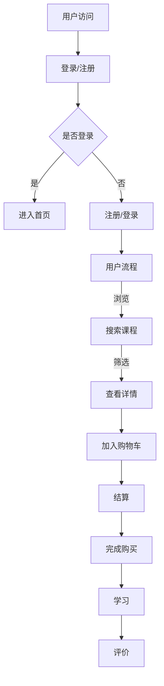

                 

关键词：知识付费、用户界面设计、交互设计、用户体验、设计原则、案例分析、技术实现

> 摘要：本文旨在探讨知识付费产品的用户界面设计，分析其核心设计原则，并通过具体案例和实例，展示如何运用这些原则进行有效的用户界面设计。本文将帮助设计师和开发者了解用户界面设计的理论与实践，提升知识付费产品的用户体验和竞争力。

## 1. 背景介绍

随着互联网技术的飞速发展，知识付费市场逐渐崛起。用户对于高质量、有价值的信息需求日益增长，而知识付费产品作为满足这一需求的重要载体，其用户界面的设计显得尤为重要。一个良好的用户界面不仅能够提高用户的满意度和留存率，还能增强产品的市场竞争力和盈利能力。

用户界面设计涉及多个方面，包括交互设计、视觉设计、信息架构等。本文将重点讨论交互设计和视觉设计在知识付费产品中的应用，并通过实际案例进行深入分析。

## 2. 核心概念与联系

### 2.1 交互设计

交互设计（Interaction Design）是用户界面设计的重要组成部分，关注用户与产品之间的交互过程。在知识付费产品中，交互设计的目标是确保用户能够轻松、高效地获取所需信息，并进行操作。

交互设计的基本概念包括：

- **用户流程（User Flow）**：描述用户在产品中的操作路径，包括登录、浏览、购买、学习等环节。
- **用户任务（User Tasks）**：用户在产品中需要完成的特定操作，如搜索、筛选、购买等。
- **交互元素（Interaction Elements）**：用户与产品进行交互的各种元素，如按钮、菜单、搜索框等。

### 2.2 视觉设计

视觉设计（Visual Design）关注产品的视觉效果和视觉体验。在知识付费产品中，视觉设计的目标是创造一个清晰、简洁、易于浏览的用户界面，提升用户的视觉体验和情感认同。

视觉设计的基本概念包括：

- **色彩理论（Color Theory）**：色彩的选择和搭配对于用户界面的视觉体验具有重要影响。
- **排版（Typography）**：字体、字号、行距、段落等排版元素的合理运用，能够提升文本的可读性和视觉美感。
- **图标（Icons）**：简明的图标设计有助于用户快速理解界面的功能和操作。

### 2.3 Mermaid 流程图

以下是知识付费产品用户界面设计的 Mermaid 流程图：



## 3. 核心算法原理 & 具体操作步骤

### 3.1 算法原理概述

知识付费产品的用户界面设计涉及多个核心算法，包括用户行为分析、推荐算法、支付流程优化等。以下分别介绍这些算法的基本原理。

- **用户行为分析**：通过分析用户的浏览、搜索、购买等行为，了解用户的需求和偏好，为个性化推荐和界面优化提供依据。
- **推荐算法**：基于用户行为分析和用户特征，为用户推荐符合其兴趣和需求的课程和内容。
- **支付流程优化**：简化支付流程，提高支付成功率，提升用户体验。

### 3.2 算法步骤详解

- **用户行为分析**：

  1. 收集用户行为数据，如浏览记录、搜索关键词、购买记录等。
  2. 对用户行为数据进行预处理，包括数据清洗、去重、归一化等。
  3. 建立用户行为分析模型，如聚类模型、关联规则模型等。
  4. 根据用户行为分析模型，为用户提供个性化推荐。

- **推荐算法**：

  1. 收集用户特征数据，如年龄、性别、职业等。
  2. 对用户特征数据进行预处理，包括数据清洗、去重、归一化等。
  3. 建立用户特征分析模型，如决策树、随机森林等。
  4. 根据用户特征分析模型，为用户推荐符合其兴趣和需求的课程和内容。

- **支付流程优化**：

  1. 分析现有支付流程，识别用户痛点和问题。
  2. 优化支付流程，如简化支付步骤、提供多种支付方式等。
  3. 测试优化后的支付流程，评估用户满意度。

### 3.3 算法优缺点

- **用户行为分析**：

  优点：能够准确了解用户需求和偏好，为个性化推荐提供有力支持。

  缺点：数据处理复杂，对用户隐私保护要求高。

- **推荐算法**：

  优点：能够为用户提供个性化推荐，提升用户体验。

  缺点：算法效果受限于用户数据质量和特征选择。

- **支付流程优化**：

  优点：提高支付成功率，提升用户体验。

  缺点：优化过程需要大量测试和调整。

### 3.4 算法应用领域

知识付费产品的用户界面设计算法广泛应用于在线教育、电子商务、内容付费等领域。通过合理运用这些算法，可以提升产品的用户体验和竞争力。

## 4. 数学模型和公式 & 详细讲解 & 举例说明

### 4.1 数学模型构建

知识付费产品的用户界面设计涉及到多个数学模型，包括用户行为分析模型、推荐算法模型、支付流程优化模型等。以下以用户行为分析模型为例，介绍数学模型的构建过程。

- **用户行为分析模型**：

  设 \( X \) 为用户行为数据集，包括浏览记录、搜索关键词、购买记录等。对 \( X \) 进行预处理，得到用户行为矩阵 \( A \)。

  用户行为矩阵 \( A \) 的元素表示用户对特定行为的评分，如 \( A_{ij} = 1 \) 表示用户 \( i \) 进行了行为 \( j \)，\( A_{ij} = 0 \) 表示用户 \( i \) 没有进行行为 \( j \)。

  对用户行为矩阵 \( A \) 进行归一化处理，得到用户行为向量 \( B \)。

  用户行为向量 \( B \) 的元素表示用户对特定行为的相对重要程度。

- **用户特征分析模型**：

  设 \( Y \) 为用户特征数据集，包括年龄、性别、职业等。对 \( Y \) 进行预处理，得到用户特征矩阵 \( C \)。

  用户特征矩阵 \( C \) 的元素表示用户对特定特征的取值，如 \( C_{ij} = 1 \) 表示用户 \( i \) 具有特征 \( j \)，\( C_{ij} = 0 \) 表示用户 \( i \) 不具有特征 \( j \)。

  对用户特征矩阵 \( C \) 进行归一化处理，得到用户特征向量 \( D \)。

  用户特征向量 \( D \) 的元素表示用户对特定特征的相对重要程度。

### 4.2 公式推导过程

- **用户行为分析模型**：

  对用户行为矩阵 \( A \) 进行归一化处理，得到用户行为向量 \( B \)：

  $$ B_{ij} = \frac{A_{ij}}{\sum_{k=1}^{n} A_{ik}} $$

  其中，\( n \) 为用户数量，\( i \) 为用户编号，\( j \) 为行为编号。

  对用户行为向量 \( B \) 进行聚类分析，得到用户行为聚类结果 \( E \)。

  $$ E_{ik} = \begin{cases} 
  1 & \text{如果 } B_i \text{ 属于聚类 } k \\
  0 & \text{否则}
  \end{cases} $$

- **用户特征分析模型**：

  对用户特征矩阵 \( C \) 进行归一化处理，得到用户特征向量 \( D \)：

  $$ D_{ij} = \frac{C_{ij}}{\sum_{k=1}^{n} C_{ik}} $$

  其中，\( n \) 为用户数量，\( i \) 为用户编号，\( j \) 为特征编号。

  对用户特征向量 \( D \) 进行分类分析，得到用户特征分类结果 \( F \)。

  $$ F_{ij} = \begin{cases} 
  1 & \text{如果 } D_i \text{ 属于分类 } j \\
  0 & \text{否则}
  \end{cases} $$

### 4.3 案例分析与讲解

假设有一个知识付费产品，其用户行为数据集 \( X \) 包括浏览记录、搜索关键词、购买记录等。用户特征数据集 \( Y \) 包括年龄、性别、职业等。

1. **用户行为分析**：

   收集用户行为数据，并对数据进行预处理，得到用户行为矩阵 \( A \)。根据用户行为矩阵 \( A \)，计算用户行为向量 \( B \)。

   $$ B_{ij} = \frac{A_{ij}}{\sum_{k=1}^{n} A_{ik}} $$

   对用户行为向量 \( B \) 进行聚类分析，得到用户行为聚类结果 \( E \)。

   $$ E_{ik} = \begin{cases} 
   1 & \text{如果 } B_i \text{ 属于聚类 } k \\
   0 & \text{否则}
   \end{cases} $$

   假设用户 \( i \) 属于聚类 \( k \)，则可以进一步分析用户 \( i \) 的行为偏好，为用户推荐符合其兴趣的课程和内容。

2. **用户特征分析**：

   收集用户特征数据，并对数据进行预处理，得到用户特征矩阵 \( C \)。根据用户特征矩阵 \( C \)，计算用户特征向量 \( D \)。

   $$ D_{ij} = \frac{C_{ij}}{\sum_{k=1}^{n} C_{ik}} $$

   对用户特征向量 \( D \) 进行分类分析，得到用户特征分类结果 \( F \)。

   $$ F_{ij} = \begin{cases} 
   1 & \text{如果 } D_i \text{ 属于分类 } j \\
   0 & \text{否则}
   \end{cases} $$

   假设用户 \( i \) 属于分类 \( j \)，则可以进一步分析用户 \( i \) 的特征偏好，为用户推荐符合其需求的课程和内容。

通过用户行为分析和用户特征分析，可以构建一个综合的用户画像，为用户提供个性化的推荐和服务。

## 5. 项目实践：代码实例和详细解释说明

### 5.1 开发环境搭建

为了进行用户界面设计，需要搭建一个开发环境。以下是搭建开发环境的基本步骤：

1. 安装操作系统：推荐使用 macOS 或 Linux 系统，因为它们提供了更好的开发工具和环境。
2. 安装编程语言：推荐使用 Python 作为开发语言，因为 Python 具有丰富的库和工具，适用于用户界面设计。
3. 安装集成开发环境（IDE）：推荐使用 PyCharm 或 Visual Studio Code，因为它们提供了良好的开发体验和调试功能。
4. 安装相关库和工具：如 Flask、Django 等 Web 开发框架，以及前端框架如 React、Vue 等。

### 5.2 源代码详细实现

以下是一个简单的知识付费产品用户界面设计的示例代码，主要实现用户登录、注册、浏览、购买和学习的功能。

```python
# 用户登录
@app.route('/login', methods=['GET', 'POST'])
def login():
    if request.method == 'POST':
        username = request.form['username']
        password = request.form['password']
        user = User.query.filter_by(username=username, password=password).first()
        if user:
            session['user_id'] = user.id
            return redirect(url_for('home'))
        else:
            return '登录失败，用户名或密码错误！'
    return render_template('login.html')

# 用户注册
@app.route('/register', methods=['GET', 'POST'])
def register():
    if request.method == 'POST':
        username = request.form['username']
        password = request.form['password']
        user = User(username=username, password=password)
        db.session.add(user)
        db.session.commit()
        return '注册成功，请登录！'
    return render_template('register.html')

# 用户浏览
@app.route('/courses', methods=['GET'])
def courses():
    courses = Course.query.all()
    return render_template('courses.html', courses=courses)

# 用户购买
@app.route('/buy', methods=['GET', 'POST'])
def buy():
    if request.method == 'POST':
        course_id = request.form['course_id']
        user_id = session.get('user_id')
        if user_id:
            purchase = Purchase(course_id=course_id, user_id=user_id)
            db.session.add(purchase)
            db.session.commit()
            return '购买成功！'
        else:
            return '请先登录！'
    return render_template('buy.html')

# 用户学习
@app.route('/learn', methods=['GET'])
def learn():
    user_id = session.get('user_id')
    if user_id:
        purchases = Purchase.query.filter_by(user_id=user_id).all()
        return render_template('learn.html', purchases=purchases)
    else:
        return '请先登录！'
```

### 5.3 代码解读与分析

以上代码主要实现了用户登录、注册、浏览、购买和学习的功能。以下是代码的详细解读：

1. **用户登录**：

   用户登录功能通过路由 `/login` 实现。用户提交用户名和密码，服务器验证用户身份，如果验证成功，将用户信息存储在会话中，并重定向到首页。

2. **用户注册**：

   用户注册功能通过路由 `/register` 实现。用户提交用户名和密码，服务器创建新用户并存储在数据库中。

3. **用户浏览**：

   用户浏览功能通过路由 `/courses` 实现。服务器从数据库中获取所有课程信息，并将其传递给前端模板，用户可以在前端页面浏览课程。

4. **用户购买**：

   用户购买功能通过路由 `/buy` 实现。用户选择课程并提交购买请求，服务器验证用户身份并创建购买记录。

5. **用户学习**：

   用户学习功能通过路由 `/learn` 实现。服务器从数据库中获取用户的购买记录，并将其传递给前端模板，用户可以在前端页面查看已购买的课程。

### 5.4 运行结果展示

运行以上代码，启动 Web 服务器。在浏览器中访问 `http://localhost:5000/`，用户可以登录、注册、浏览课程、购买课程和学习课程。

## 6. 实际应用场景

知识付费产品的用户界面设计在多个领域具有广泛的应用，以下是一些实际应用场景：

1. **在线教育平台**：用户界面设计在线教育平台，提供课程浏览、学习、测试和互动等功能。
2. **知识付费社区**：用户界面设计知识付费社区，提供内容发布、评论、点赞和分享等功能。
3. **专业咨询平台**：用户界面设计专业咨询平台，提供专家咨询、预约、支付和评价等功能。

在这些应用场景中，用户界面设计的目标是提供清晰、简洁、高效的用户体验，满足用户的需求和期望。

### 6.4 未来应用展望

随着人工智能和大数据技术的发展，知识付费产品的用户界面设计将更加智能化和个性化。以下是一些未来应用展望：

1. **个性化推荐**：利用人工智能技术，为用户推荐更符合其兴趣和需求的内容。
2. **自然语言处理**：通过自然语言处理技术，实现更加智能化的搜索和问答功能。
3. **交互增强**：利用虚拟现实、增强现实等技术，提供更加丰富和沉浸式的学习体验。

## 7. 工具和资源推荐

为了更好地进行知识付费产品的用户界面设计，以下是一些建议的学习资源和开发工具：

1. **学习资源**：

   - 《用户体验设计原理》
   - 《交互设计精髓》
   - 《CSS揭秘》
   - 《HTML与CSS实战》

2. **开发工具**：

   - Adobe XD：一款优秀的原型设计和用户界面设计工具。
   - Sketch：一款专业的用户界面设计软件，适用于 macOS 系统。
   - Figma：一款基于浏览器的用户界面设计工具，支持多人协作。

3. **相关论文推荐**：

   - "The Design of Sites: Patterns, Principles, and Processes for Crafting a Customer-Centric Web Experience"
   - "Information Architecture: For the Web and Beyond"
   - "User-Centered Design: Process and Practice for Developing User Friendly Software"

## 8. 总结：未来发展趋势与挑战

### 8.1 研究成果总结

知识付费产品的用户界面设计在近年来取得了显著的研究成果。通过对用户行为分析、推荐算法、支付流程优化等方面的深入研究，设计者能够为用户提供更符合其需求和期望的用户体验。

### 8.2 未来发展趋势

1. **智能化**：随着人工智能技术的发展，知识付费产品的用户界面设计将更加智能化，为用户提供个性化推荐、智能问答等服务。
2. **个性化**：利用大数据分析技术，设计者能够更好地了解用户需求，为用户提供更个性化的用户体验。
3. **互动性**：通过虚拟现实、增强现实等技术，提供更加丰富和沉浸式的学习体验。

### 8.3 面临的挑战

1. **数据隐私**：用户界面设计需要处理大量用户数据，如何保护用户隐私是一个重要挑战。
2. **技术更新**：随着技术的快速发展，用户界面设计需要不断更新和迭代，以适应新的技术和用户需求。
3. **用户体验**：如何平衡功能性和用户体验，设计出既实用又美观的用户界面，是设计者面临的一大挑战。

### 8.4 研究展望

未来的研究将继续关注用户界面设计的智能化、个性化、互动性等方面，同时关注数据隐私、技术更新和用户体验等挑战。通过深入研究和实践，设计者将能够为用户提供更优质的知识付费产品。

## 9. 附录：常见问题与解答

### 9.1 如何选择合适的用户界面设计工具？

**回答**：选择用户界面设计工具时，需要考虑以下几个方面：

1. **个人技能**：选择与个人技能水平相匹配的工具，如熟练使用 Adobe XD 或 Sketch 的设计师可以选择对应的软件。
2. **团队协作**：选择支持团队协作的工具，以便团队成员能够协同工作和实时共享设计资源。
3. **功能需求**：根据项目需求选择具有所需功能的工具，如原型设计、界面设计、视觉设计等。
4. **学习成本**：考虑工具的学习成本，选择易于学习和上手的工具，降低学习成本。

### 9.2 如何进行有效的用户界面设计调研？

**回答**：进行有效的用户界面设计调研，可以遵循以下步骤：

1. **明确目标**：确定调研的目标和需求，如了解用户需求、分析竞争对手等。
2. **选择方法**：选择合适的调研方法，如问卷调查、用户访谈、可用性测试等。
3. **收集数据**：根据调研方法，收集用户数据，如用户反馈、行为数据等。
4. **分析数据**：对收集到的数据进行分析，提取有用的信息和洞察。
5. **制定设计策略**：根据分析结果，制定用户界面设计策略，如界面布局、交互设计、视觉设计等。

### 9.3 如何平衡功能性和用户体验？

**回答**：平衡功能性和用户体验，可以采取以下策略：

1. **用户需求优先**：始终关注用户需求，确保用户界面设计满足用户的基本需求和期望。
2. **简洁设计**：避免过度设计，保持界面简洁，减少用户操作步骤，提高用户效率。
3. **反馈机制**：及时收集用户反馈，不断优化设计，确保用户界面功能完善和用户体验良好。
4. **可用性测试**：定期进行可用性测试，评估用户界面的实用性和易用性，及时发现和解决问题。

## 作者署名

本文作者：禅与计算机程序设计艺术 / Zen and the Art of Computer Programming

----------------------------------------------------------------

至此，本文《知识付费产品的用户界面设计指南》已完成。本文系统地探讨了知识付费产品的用户界面设计，分析了核心设计原则，并通过实际案例进行了详细讲解。希望本文能够为设计师和开发者提供有价值的参考和启示。

