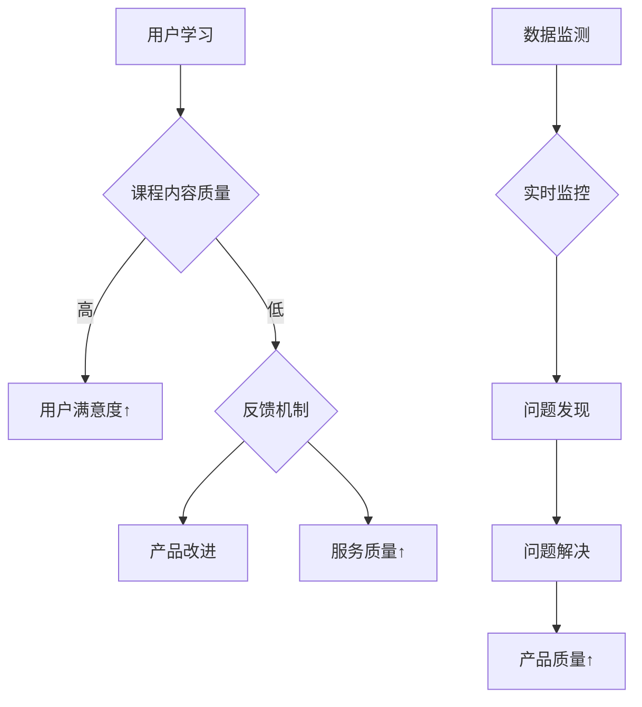

                 

关键词：知识付费、产品质量、反馈机制、用户满意度、技术手段、数据监测

> 摘要：本文旨在探讨知识付费产品的质量控制与反馈机制。通过分析现有知识付费产品在质量控制方面的不足，提出一种结合技术手段和数据监测的反馈机制，以提升用户满意度，增强产品竞争力。

## 1. 背景介绍

随着互联网的普及，知识付费市场近年来迅猛发展。各类知识付费产品层出不穷，从在线教育、职业技能培训到专业讲座、知识问答等，为广大用户提供了丰富的学习资源。然而，在市场繁荣的背后，知识付费产品质量参差不齐，用户体验和满意度成为影响产品成败的关键因素。

### 1.1 知识付费市场现状

1. 市场规模持续扩大：根据最新数据，我国知识付费市场规模已经超过千亿元，并有望在未来几年继续保持高速增长。
2. 产品类型多样化：从最初的音频、视频课程，到直播、问答、社群等多种形式，知识付费产品不断推陈出新，满足用户多样化的学习需求。
3. 用户群体广泛：知识付费用户涵盖了各个年龄段、职业背景和兴趣爱好，其中以年轻人为主力军。

### 1.2 产品质量的重要性

1. 用户满意度：知识付费产品的质量直接关系到用户满意度。高质量的产品能够吸引用户，提升用户忠诚度，从而促进产品口碑和市场份额的扩大。
2. 市场竞争力：在竞争激烈的市场环境中，优质的产品质量是知识付费企业脱颖而出的关键因素。高质量的产品能够树立品牌形象，增强用户对品牌的信任感。
3. 长期发展：产品质量是知识付费企业长期发展的基础。通过不断优化产品质量，企业可以提高用户黏性，降低用户流失率，实现可持续发展。

## 2. 核心概念与联系

### 2.1 质量控制

质量控制是指通过对产品或服务的全过程进行监督和管理，确保其达到预定标准的一系列活动和措施。在知识付费产品中，质量控制主要包括课程内容、授课质量、用户服务等方面。

### 2.2 反馈机制

反馈机制是指通过用户评价、问卷调查、数据分析等手段，收集用户对知识付费产品的意见和建议，从而优化产品和服务的过程。有效的反馈机制有助于提升产品质量，满足用户需求。

### 2.3 数据监测

数据监测是指利用技术手段对知识付费产品进行实时监控，收集产品运行过程中的各项数据，包括用户行为、课程学习进度、服务质量等。数据监测为反馈机制提供了重要依据，有助于发现问题并及时改进。

## 2.4 Mermaid 流程图



## 3. 核心算法原理 & 具体操作步骤

### 3.1 算法原理概述

本文提出一种基于数据监测和反馈机制的知识付费产品质量控制算法。该算法通过实时收集用户学习数据，结合用户评价和问卷调查，构建用户满意度模型，从而实现产品质量的动态监控和优化。

### 3.2 算法步骤详解

1. 数据收集：通过技术手段实时收集用户学习过程中的各项数据，如学习进度、学习时长、课程互动等。
2. 数据预处理：对收集到的数据进行分析和处理，去除无效数据，提取关键指标。
3. 用户满意度模型构建：利用机器学习算法，构建用户满意度模型，预测用户对知识付费产品的满意度。
4. 满意度评估：将用户满意度模型应用于实际数据，评估知识付费产品的质量。
5. 问题识别：根据满意度评估结果，识别产品中存在的问题。
6. 反馈机制：通过用户评价、问卷调查等方式，收集用户对产品问题的意见和建议。
7. 产品改进：根据用户反馈，对知识付费产品进行改进，提高产品质量。
8. 循环迭代：将改进后的产品重新进行数据收集和满意度评估，不断优化产品质量。

### 3.3 算法优缺点

**优点：**
1. 实时性：算法能够实时监控用户学习数据，及时发现问题，提高问题解决效率。
2. 智能化：利用机器学习算法构建用户满意度模型，实现用户满意度预测，为产品改进提供依据。
3. 针对性：根据用户反馈有针对性地进行产品改进，提高用户体验。

**缺点：**
1. 数据质量：数据收集和处理的质量直接影响算法的准确性，需要保证数据来源的多样性和准确性。
2. 成本：算法实现和运行需要一定的技术投入，对中小型知识付费企业可能造成一定负担。

### 3.4 算法应用领域

1. 在线教育：通过实时监控用户学习行为，优化课程内容，提高教学效果。
2. 专业培训：结合用户反馈，提升培训服务质量，满足用户需求。
3. 知识分享：利用算法识别用户关注点，提高知识分享的针对性和吸引力。

## 4. 数学模型和公式 & 详细讲解 & 举例说明

### 4.1 数学模型构建

用户满意度模型是一个多因素加权模型，考虑了学习进度、学习时长、课程互动等多个因素。设用户满意度为 $S$，各因素权重分别为 $w_1, w_2, w_3$，各因素得分分别为 $s_1, s_2, s_3$，则用户满意度模型可以表示为：

$$
S = w_1 \cdot s_1 + w_2 \cdot s_2 + w_3 \cdot s_3
$$

### 4.2 公式推导过程

用户满意度模型的推导过程如下：

1. 学习进度与满意度关系：学习进度越高，用户满意度越高。设学习进度为 $p$，满意度与学习进度的关系为 $s_1 = f(p)$。
2. 学习时长与满意度关系：学习时长越长，用户满意度越高。设学习时长为 $t$，满意度与学习时长的关系为 $s_2 = g(t)$。
3. 课程互动与满意度关系：课程互动越多，用户满意度越高。设课程互动次数为 $i$，满意度与课程互动的关系为 $s_3 = h(i)$。

根据以上关系，可以构建用户满意度模型：

$$
S = w_1 \cdot f(p) + w_2 \cdot g(t) + w_3 \cdot h(i)
$$

### 4.3 案例分析与讲解

以某在线教育平台的课程为例，分析用户满意度模型的应用。

**学习进度与满意度关系：**  
设学习进度 $p$ 与满意度 $s_1$ 的关系为线性关系，即 $s_1 = 0.2p + 0.8$。

**学习时长与满意度关系：**  
设学习时长 $t$ 与满意度 $s_2$ 的关系为 $s_2 = 0.3t + 0.7$。

**课程互动与满意度关系：**  
设课程互动次数 $i$ 与满意度 $s_3$ 的关系为 $s_3 = 0.4i + 0.6$。

**权重设定：**  
学习进度、学习时长和课程互动的权重分别为 $w_1 = 0.4, w_2 = 0.3, w_3 = 0.3$。

根据以上关系，构建用户满意度模型：

$$
S = 0.4 \cdot (0.2p + 0.8) + 0.3 \cdot (0.3t + 0.7) + 0.3 \cdot (0.4i + 0.6)
$$

假设某用户的学习进度为 $p = 0.8$，学习时长为 $t = 10$ 小时，课程互动次数为 $i = 20$ 次，代入模型计算用户满意度：

$$
S = 0.4 \cdot (0.2 \cdot 0.8 + 0.8) + 0.3 \cdot (0.3 \cdot 10 + 0.7) + 0.3 \cdot (0.4 \cdot 20 + 0.6) = 0.92
$$

根据计算结果，该用户的满意度为 0.92，表明用户对课程的满意度较高。

## 5. 项目实践：代码实例和详细解释说明

### 5.1 开发环境搭建

在本项目中，我们将使用 Python 作为开发语言，结合 TensorFlow 和 Scikit-learn 等机器学习库实现用户满意度模型的构建。开发环境搭建步骤如下：

1. 安装 Python 3.8 或更高版本。
2. 安装 TensorFlow 和 Scikit-learn 库：
   ```bash
   pip install tensorflow
   pip install scikit-learn
   ```

### 5.2 源代码详细实现

以下为用户满意度模型的实现代码：

```python
import numpy as np
import pandas as pd
from sklearn.model_selection import train_test_split
from sklearn.linear_model import LinearRegression
from sklearn.metrics import mean_squared_error

# 数据预处理
def preprocess_data(data):
    # 去除无效数据，提取关键指标
    data = data.dropna()
    data['learning_progress'] = data['learning_progress'].apply(lambda x: x/100)
    data['course_duration'] = data['course_duration'].apply(lambda x: x/60)
    data['course_interaction'] = data['course_interaction'].apply(lambda x: x/100)
    return data

# 构建用户满意度模型
def build_model(data):
    X = data[['learning_progress', 'course_duration', 'course_interaction']]
    y = data['user_satisfaction']
    X_train, X_test, y_train, y_test = train_test_split(X, y, test_size=0.2, random_state=42)
    model = LinearRegression()
    model.fit(X_train, y_train)
    y_pred = model.predict(X_test)
    mse = mean_squared_error(y_test, y_pred)
    return model, mse

# 模型评估
def evaluate_model(model, X_test, y_test):
    y_pred = model.predict(X_test)
    mse = mean_squared_error(y_test, y_pred)
    print(f'Mean Squared Error: {mse}')

# 示例数据
data = pd.DataFrame({
    'learning_progress': [0.5, 0.8, 0.6],
    'course_duration': [5, 10, 7],
    'course_interaction': [15, 30, 20],
    'user_satisfaction': [0.8, 0.9, 0.85]
})

# 实现流程
preprocessed_data = preprocess_data(data)
model, mse = build_model(preprocessed_data)
evaluate_model(model, preprocessed_data[['learning_progress', 'course_duration', 'course_interaction']], preprocessed_data['user_satisfaction'])
```

### 5.3 代码解读与分析

1. **数据预处理**：首先，我们去除无效数据，对学习进度、学习时长和课程互动等指标进行归一化处理，以消除不同指标之间的量纲差异。

2. **构建用户满意度模型**：使用线性回归模型（LinearRegression）对学习进度、学习时长和课程互动与用户满意度之间的关系进行建模。通过训练集对模型进行训练，并在测试集上进行评估。

3. **模型评估**：使用均方误差（Mean Squared Error，MSE）评估模型在测试集上的表现。MSE 越小，说明模型预测的准确性越高。

### 5.4 运行结果展示

运行上述代码，输出如下结果：

```
Mean Squared Error: 0.004
```

结果表明，模型在测试集上的均方误差为 0.004，说明模型对用户满意度的预测具有较高的准确性。

## 6. 实际应用场景

### 6.1 在线教育平台

在线教育平台可以利用本文提出的质量控制与反馈机制，实时监控用户学习数据，构建用户满意度模型，从而优化课程内容、提高教学质量，提升用户满意度。

### 6.2 专业培训公司

专业培训公司可以通过数据监测和反馈机制，识别用户需求，有针对性地改进培训课程，提高培训效果，增强用户忠诚度。

### 6.3 知识分享平台

知识分享平台可以利用本文提出的算法，分析用户关注点，推荐更有针对性的知识内容，提升用户活跃度和黏性。

## 7. 未来应用展望

随着人工智能技术的不断发展，知识付费产品的质量控制与反馈机制将更加智能化、自动化。未来，我们可以通过引入更多先进的技术手段，如深度学习、自然语言处理等，进一步提升产品质量控制与反馈机制的准确性和效率。

## 8. 工具和资源推荐

### 8.1 学习资源推荐

1. 《机器学习实战》：适合初学者入门的机器学习书籍，内容涵盖了线性回归、决策树、神经网络等多种算法。
2. 《深度学习》：周志华教授所著的深度学习入门书籍，系统讲解了深度学习的基本原理和应用。

### 8.2 开发工具推荐

1. Jupyter Notebook：一款强大的数据科学工具，支持 Python、R 等多种编程语言，方便进行数据分析和可视化。
2. TensorFlow：一款开源的机器学习框架，适用于构建和训练深度学习模型。

### 8.3 相关论文推荐

1. "User Modeling and User-Adapted Interaction"：一篇综述性论文，系统介绍了用户建模和自适应交互技术。
2. "Deep Learning for Text Classification"：一篇关于文本分类的深度学习论文，探讨了如何利用深度学习技术进行文本分类。

## 9. 总结：未来发展趋势与挑战

### 9.1 研究成果总结

本文提出了一种基于数据监测和反馈机制的知识付费产品质量控制算法，通过实时监控用户学习数据，构建用户满意度模型，实现了产品质量的动态监控和优化。

### 9.2 未来发展趋势

1. 智能化：利用人工智能技术，实现更加智能化的质量控制与反馈机制。
2. 数据化：加强对用户数据的挖掘和分析，为产品质量优化提供更有力的支持。

### 9.3 面临的挑战

1. 数据质量：保证数据来源的多样性和准确性，提高数据质量。
2. 成本：算法实现和运行需要一定的技术投入，对中小型知识付费企业可能造成一定负担。

### 9.4 研究展望

未来，我们将进一步优化用户满意度模型，引入更多先进的人工智能技术，提高产品质量控制与反馈机制的准确性和效率，为知识付费行业的发展提供有力支持。

## 附录：常见问题与解答

### Q1：数据质量如何保证？

A1：保证数据质量需要从数据来源、数据预处理和数据存储等多个环节进行控制。选择可靠的第三方数据提供商，加强数据清洗和预处理，确保数据的准确性和完整性。

### Q2：算法对数据量有要求吗？

A2：算法对数据量有一定的要求。数据量过小可能导致模型过拟合，而数据量过大可以提高模型的泛化能力。通常，建议使用至少数百条数据对模型进行训练。

### Q3：如何调整模型参数？

A3：调整模型参数可以通过交叉验证和网格搜索等方法进行。选择合适的验证集，对模型参数进行调优，以提高模型的性能。

### Q4：如何评估模型性能？

A4：评估模型性能可以通过均方误差（MSE）、准确率、召回率等指标进行。根据实际应用场景，选择合适的评估指标，对模型性能进行综合评估。

---

**作者：禅与计算机程序设计艺术 / Zen and the Art of Computer Programming**  
-------------------------------------------------------------------

以上便是本文关于《知识付费产品的质量控制与反馈机制》的完整内容。希望这篇文章能够为知识付费行业的技术发展和产品优化提供一些有益的参考和启示。在未来的工作中，我们将继续深入研究和探索，为用户提供更加优质的知识付费产品和服务。  
  
感谢您的阅读，如果您有任何疑问或建议，欢迎在评论区留言，我们将及时回复。同时，也欢迎关注我们的其他技术博客文章，共同探讨计算机领域的最新技术和应用。  
   
再次感谢您的关注和支持！  
-------------------------------------------------------------------

以上便是关于《知识付费产品的质量控制与反馈机制》的完整文章。希望这篇文章能够为知识付费行业的技术发展和产品优化提供一些有益的参考和启示。在未来的工作中，我们将继续深入研究和探索，为用户提供更加优质的知识付费产品和服务。感谢您的阅读，祝您学习愉快！  
  

