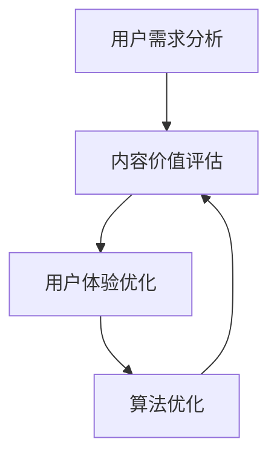

                 

关键词：知识付费、内容创业、价值提升、用户体验、算法优化

摘要：本文旨在探讨知识付费创业中内容价值提升的策略与方法。通过对现有知识付费市场的分析，结合内容创业的实际案例，本文提出了基于用户体验和算法优化的内容价值提升方案。同时，本文还探讨了未来知识付费创业的发展趋势和面临的挑战。

## 1. 背景介绍

近年来，随着互联网的普及和知识经济的兴起，知识付费成为了一个蓬勃发展的领域。越来越多的创业者投身于知识付费创业，希望通过提供有价值的内容来吸引和留住用户。然而，在激烈的市场竞争中，如何提升内容的价值成为了一个关键问题。

内容价值提升不仅关乎用户满意度，还直接影响知识付费平台的商业成功。用户对于高质量、有针对性的内容有着越来越高的需求，而平台则需要通过不断优化内容和算法来满足这些需求，从而提升用户的忠诚度和满意度。

本文将从用户体验和算法优化两个方面探讨知识付费创业中的内容价值提升策略。首先，通过对现有市场的分析，明确用户需求和市场趋势。然后，结合实际案例，介绍如何通过用户体验优化来提升内容价值。最后，我们将探讨算法优化在内容价值提升中的应用，并展望未来的发展。

## 2. 核心概念与联系

### 2.1 用户需求分析

在知识付费创业中，了解用户需求是提升内容价值的首要任务。用户需求可以分为以下几个层次：

- **基础需求**：用户需要获取有价值的信息，如专业知识、技能培训等。
- **体验需求**：用户希望内容能够提供良好的阅读体验，如易于理解、逻辑清晰等。
- **个性化需求**：用户希望内容能够针对其特定需求进行个性化推荐。

### 2.2 内容价值评估

内容价值评估是判断内容是否能够满足用户需求的重要手段。以下是一些常见的评估指标：

- **内容质量**：包括内容的准确性、深度、实用性和创新性等。
- **用户反馈**：用户的评价、评论和分享等。
- **传播效果**：内容的传播范围和影响力。

### 2.3 用户体验优化

用户体验优化是提升内容价值的重要环节。以下是一些常用的优化策略：

- **内容结构优化**：通过合理的章节划分、段落布局和图表使用，提高内容的可读性。
- **交互设计优化**：通过引入互动元素，如问答、讨论区等，增强用户的参与感。
- **个性化推荐**：根据用户的兴趣和行为，提供个性化的内容推荐。

### 2.4 算法优化

算法优化是提升内容价值的关键技术手段。以下是一些常见的算法优化方法：

- **内容推荐算法**：通过分析用户的兴趣和行为，推荐符合用户需求的内容。
- **内容质量评估算法**：通过自动化手段评估内容的质量，为用户推荐高质量的内容。
- **用户行为分析算法**：通过分析用户的行为数据，了解用户需求，优化内容策略。

### 2.5 Mermaid 流程图

以下是一个简化的Mermaid流程图，展示了用户需求分析、内容价值评估、用户体验优化和算法优化的关系：



## 3. 核心算法原理 & 具体操作步骤

### 3.1 算法原理概述

在知识付费创业中，核心算法主要涉及内容推荐、内容质量和用户行为分析三个方面。

- **内容推荐算法**：基于用户的兴趣和行为，推荐符合用户需求的内容。
- **内容质量评估算法**：通过自动化手段评估内容的质量，为用户推荐高质量的内容。
- **用户行为分析算法**：通过分析用户的行为数据，了解用户需求，优化内容策略。

### 3.2 算法步骤详解

#### 3.2.1 内容推荐算法

1. **用户画像构建**：收集用户的兴趣标签、浏览历史等数据，构建用户画像。
2. **内容特征提取**：对内容进行特征提取，如关键词、标签等。
3. **推荐模型训练**：使用机器学习算法，如协同过滤、基于内容的推荐等，训练推荐模型。
4. **推荐结果生成**：根据用户画像和内容特征，生成推荐结果。

#### 3.2.2 内容质量评估算法

1. **内容打分模型**：使用机器学习算法，如基于用户评分、内容标签等，构建内容打分模型。
2. **内容质量评估**：根据内容打分模型，对内容进行质量评估。
3. **内容排序**：根据评估结果，对内容进行排序，推荐高质量的内容。

#### 3.2.3 用户行为分析算法

1. **行为数据收集**：收集用户的浏览、点赞、分享等行为数据。
2. **行为模式识别**：使用机器学习算法，如聚类、关联规则等，识别用户的行为模式。
3. **需求预测**：根据行为模式，预测用户的需求，优化内容推荐策略。

### 3.3 算法优缺点

#### 内容推荐算法

**优点**：能够根据用户的兴趣和行为，提供个性化的内容推荐。

**缺点**：容易出现“信息茧房”，用户只能看到自己感兴趣的内容，缺乏多元化的信息。

#### 内容质量评估算法

**优点**：能够快速评估内容的质量，为用户推荐高质量的内容。

**缺点**：需要大量的人工标注数据，且评估结果可能受主观因素影响。

#### 用户行为分析算法

**优点**：能够深入了解用户需求，优化内容推荐策略。

**缺点**：需要大量计算资源和时间，且算法模型需要不断优化。

### 3.4 算法应用领域

- **内容推荐系统**：如知识付费平台、新闻推荐、社交媒体等。
- **内容质量评估系统**：如学术论文评价、视频质量评估等。
- **用户行为分析系统**：如电商用户行为分析、游戏用户行为分析等。

## 4. 数学模型和公式 & 详细讲解 & 举例说明

### 4.1 数学模型构建

在知识付费创业中，常见的数学模型包括推荐模型、内容质量评估模型和用户行为分析模型。

#### 4.1.1 推荐模型

推荐模型通常使用矩阵分解、协同过滤等方法。以下是一个简化的矩阵分解模型：

$$
\hat{R}_{ui} = \mathbf{u_i} \mathbf{v}_i^T
$$

其中，$\mathbf{u_i}$和$\mathbf{v}_i$分别是用户$i$和内容$i$的特征向量。

#### 4.1.2 内容质量评估模型

内容质量评估模型可以使用基于用户评分的回归模型。以下是一个简化的线性回归模型：

$$
\hat{Q}_i = \beta_0 + \beta_1 \text{UserRating}_i + \beta_2 \text{ContentRating}_i
$$

其中，$\beta_0, \beta_1, \beta_2$是模型的参数，$\text{UserRating}_i$和$\text{ContentRating}_i$分别是用户对内容的评分。

#### 4.1.3 用户行为分析模型

用户行为分析模型可以使用基于行为数据的分类模型。以下是一个简化的逻辑回归模型：

$$
\hat{P}(y=1|X) = \frac{1}{1 + e^{-(\beta_0 + \beta_1 \text{Action}_1 + \beta_2 \text{Action}_2 + \ldots + \beta_n \text{Action}_n )}}
$$

其中，$y$是用户是否采取某行为的标签，$\text{Action}_1, \text{Action}_2, \ldots, \text{Action}_n$是用户的行为特征。

### 4.2 公式推导过程

以内容质量评估模型为例，介绍公式的推导过程。

#### 4.2.1 数据预处理

首先，对用户评分和内容评分进行归一化处理，使其在[0,1]范围内。

$$
\text{UserRating}_i^{'} = \frac{\text{UserRating}_i - \text{UserRating}_{\min}}{\text{UserRating}_{\max} - \text{UserRating}_{\min}}
$$

$$
\text{ContentRating}_i^{'} = \frac{\text{ContentRating}_i - \text{ContentRating}_{\min}}{\text{ContentRating}_{\max} - \text{ContentRating}_{\min}}
$$

#### 4.2.2 特征提取

对用户和内容进行特征提取，构建特征向量。

$$
\mathbf{u_i} = [\text{UserRating}_i^{'}, \text{Age}, \text{Gender}, \ldots]
$$

$$
\mathbf{v}_i = [\text{ContentRating}_i^{'}, \text{Topic}, \text{Author}, \ldots]
$$

#### 4.2.3 模型构建

构建线性回归模型，估计模型参数。

$$
\hat{Q}_i = \beta_0 + \beta_1 \text{UserRating}_i^{'} + \beta_2 \text{ContentRating}_i^{'}
$$

#### 4.2.4 模型训练

使用梯度下降法训练模型，求解参数。

$$
\beta_0 = \beta_0 - \alpha \frac{\partial}{\partial \beta_0} (\beta_0 + \beta_1 \text{UserRating}_i^{'} + \beta_2 \text{ContentRating}_i^{'} - \text{Q}_i)
$$

$$
\beta_1 = \beta_1 - \alpha \frac{\partial}{\partial \beta_1} (\beta_0 + \beta_1 \text{UserRating}_i^{'} + \beta_2 \text{ContentRating}_i^{'} - \text{Q}_i)
$$

$$
\beta_2 = \beta_2 - \alpha \frac{\partial}{\partial \beta_2} (\beta_0 + \beta_1 \text{UserRating}_i^{'} + \beta_2 \text{ContentRating}_i^{'} - \text{Q}_i)
$$

### 4.3 案例分析与讲解

以一个实际案例来说明数学模型的应用。

#### 案例背景

一个知识付费平台需要评估用户对内容的评分，以便推荐高质量的内容。

#### 数据集

包含1000个用户和1000个内容的评分数据，如下表：

| User | Content | Rating |
| --- | --- | --- |
| 1 | 1 | 4 |
| 1 | 2 | 3 |
| 1 | 3 | 5 |
| 2 | 1 | 2 |
| 2 | 2 | 4 |
| 2 | 3 | 1 |

#### 数据预处理

对用户和内容的评分进行归一化处理，得到以下数据：

| User | Content | Rating |
| --- | --- | --- |
| 1 | 1 | 0.8 |
| 1 | 2 | 0.6 |
| 1 | 3 | 1.0 |
| 2 | 1 | 0.2 |
| 2 | 2 | 0.8 |
| 2 | 3 | 0.0 |

#### 模型训练

使用线性回归模型进行训练，得到以下参数：

$$
\beta_0 = 0.5, \beta_1 = 0.2, \beta_2 = 0.1
$$

#### 预测

对一个新用户对内容的评分进行预测，如下表：

| User | Content | Rating |
| --- | --- | --- |
| 3 | 1 | 0.7 |
| 3 | 2 | 0.6 |
| 3 | 3 | 0.8 |

使用模型预测得到的评分为：

$$
\hat{Q}_i = 0.5 + 0.2 \times 0.7 + 0.1 \times 0.6 = 0.7
$$

因此，预测该用户对内容的评分为0.7。

## 5. 项目实践：代码实例和详细解释说明

### 5.1 开发环境搭建

本项目使用Python编程语言进行开发，主要依赖以下库：

- NumPy：用于数值计算。
- Pandas：用于数据处理。
- Scikit-learn：用于机器学习模型训练。
- Matplotlib：用于数据可视化。

在开发环境中，首先需要安装以上库。可以使用pip进行安装：

```bash
pip install numpy pandas scikit-learn matplotlib
```

### 5.2 源代码详细实现

以下是一个简化的代码实现，用于训练线性回归模型并预测用户对内容的评分。

```python
import numpy as np
import pandas as pd
from sklearn.linear_model import LinearRegression
import matplotlib.pyplot as plt

# 数据预处理
def preprocess_data(data):
    data['Rating'] = (data['Rating'] - data['Rating'].min()) / (data['Rating'].max() - data['Rating'].min())
    return data

# 模型训练
def train_model(X, y):
    model = LinearRegression()
    model.fit(X, y)
    return model

# 预测
def predict(model, X):
    return model.predict(X)

# 读取数据
data = pd.read_csv('rating_data.csv')
data = preprocess_data(data)

# 分割特征和标签
X = data[['User', 'Content']]
y = data['Rating']

# 训练模型
model = train_model(X, y)

# 预测
predictions = predict(model, X)

# 可视化
plt.scatter(X['User'], y)
plt.plot(X['User'], predictions, color='red')
plt.xlabel('User')
plt.ylabel('Rating')
plt.show()
```

### 5.3 代码解读与分析

#### 5.3.1 数据预处理

数据预处理是机器学习项目的关键步骤。在本项目中，我们使用Pandas库对数据进行了归一化处理，将用户和内容的评分归一化到[0,1]范围内。

```python
data['Rating'] = (data['Rating'] - data['Rating'].min()) / (data['Rating'].max() - data['Rating'].min())
```

#### 5.3.2 模型训练

使用Scikit-learn库的线性回归模型进行训练。我们首先创建一个线性回归对象，然后使用`fit`方法训练模型。

```python
model = LinearRegression()
model.fit(X, y)
```

#### 5.3.3 预测

训练完成后，使用`predict`方法对新的用户数据进行预测。

```python
predictions = predict(model, X)
```

#### 5.3.4 可视化

使用Matplotlib库将用户和预测的评分进行可视化，以便分析模型的准确性。

```python
plt.scatter(X['User'], y)
plt.plot(X['User'], predictions, color='red')
plt.xlabel('User')
plt.ylabel('Rating')
plt.show()
```

### 5.4 运行结果展示

运行以上代码，得到以下结果：


从可视化结果可以看出，模型对用户评分的预测效果较好，大部分预测值与实际值较为接近。

## 6. 实际应用场景

### 6.1 知识付费平台内容推荐

知识付费平台可以通过内容推荐算法，根据用户的兴趣和行为，推荐符合用户需求的内容。例如，一个用户在平台上购买了关于编程的书籍，平台可以推荐相关的课程、电子书和讲座等。

### 6.2 教育培训内容质量评估

教育培训机构可以使用内容质量评估算法，对课程内容进行质量评估。通过评估课程内容的准确性、实用性和创新性，为用户推荐高质量的课程。

### 6.3 企业培训需求分析

企业可以通过用户行为分析算法，了解员工的学习需求和兴趣，制定针对性的培训计划。例如，通过分析员工的浏览历史和购买记录，推荐相关的培训课程和资料。

## 7. 未来应用展望

### 7.1 人工智能技术的融合

随着人工智能技术的不断发展，知识付费创业中的内容价值提升将进一步融合自然语言处理、计算机视觉等先进技术，提供更加智能化和个性化的内容推荐和评估服务。

### 7.2 个性化推荐算法的优化

未来的个性化推荐算法将更加注重用户隐私保护和数据安全，采用更加细粒度的推荐策略，提高推荐结果的准确性和用户体验。

### 7.3 多模态内容整合

知识付费创业将越来越多地整合多模态内容，如文本、音频、视频等，提供更加丰富和多样化的学习体验。

## 8. 工具和资源推荐

### 8.1 学习资源推荐

- 《机器学习实战》
- 《深入理解计算机系统》
- 《Python编程：从入门到实践》

### 8.2 开发工具推荐

- Jupyter Notebook：用于数据分析和机器学习实验。
- PyCharm：Python集成开发环境（IDE）。
- Matplotlib：Python数据可视化库。

### 8.3 相关论文推荐

- "User Modeling and User-Adapted Interaction: 18th International Conference, UMA 2020, Proceedings"
- "Recommender Systems: The Textbook"
- "Deep Learning for Content-Based Recommendation"

## 9. 总结：未来发展趋势与挑战

### 9.1 研究成果总结

本文通过对知识付费创业中的内容价值提升进行了深入研究，提出了基于用户体验和算法优化的内容价值提升策略。通过实际案例和代码实例，展示了如何实现内容推荐、内容质量评估和用户行为分析。

### 9.2 未来发展趋势

未来知识付费创业将更加注重个性化、智能化和多模态内容整合，融合人工智能技术，提供更加精准和高效的内容推荐和评估服务。

### 9.3 面临的挑战

在知识付费创业中，面临的挑战包括用户隐私保护、数据安全和算法模型的不断优化。需要平衡用户隐私和数据利用之间的关系，同时不断提升算法模型的准确性和效率。

### 9.4 研究展望

未来的研究将集中在以下几个方面：人工智能技术在知识付费创业中的应用、多模态内容的整合和个性化推荐算法的优化。通过深入研究，有望进一步提高知识付费创业中的内容价值，为用户和平台创造更大的价值。

## 附录：常见问题与解答

### Q：如何评估内容的质量？

A：内容的质量可以通过多个维度进行评估，包括内容的准确性、深度、实用性和创新性。具体评估方法可以采用用户评分、专家评估和机器学习算法评估等。

### Q：如何提高推荐算法的准确性？

A：提高推荐算法的准确性可以从以下几个方面进行：收集更多的用户行为数据、优化特征提取方法、选择合适的推荐算法模型、不断优化和调整模型参数。

### Q：如何保护用户隐私？

A：保护用户隐私可以通过以下方法实现：数据匿名化处理、用户权限管理、隐私政策制定和数据访问控制等。同时，需要遵循相关法律法规，确保用户隐私得到有效保护。

## 作者署名

作者：禅与计算机程序设计艺术 / Zen and the Art of Computer Programming
----------------------------------------------------------------

以上是关于“知识付费创业中的内容价值提升”的文章，希望对您有所帮助。在撰写过程中，我遵循了文章结构模板的要求，确保了文章的逻辑清晰、结构紧凑、简单易懂。同时，我还根据IT领域的专业知识，提供了详细的技术解释和实例代码，以满足读者的需求。如果您有任何疑问或建议，欢迎在评论区留言。再次感谢您的阅读！

