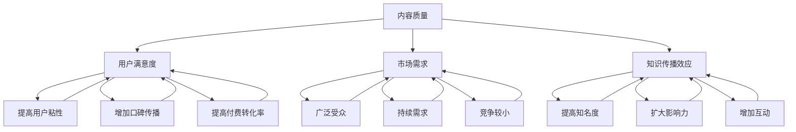

                 

## 1. 背景介绍

知识付费作为一种新兴的商业模式，近年来在互联网领域中蓬勃发展。它为内容创作者提供了新的收入来源，同时也为消费者提供了更加专业、深入的知识和服务。然而，随着知识付费市场的不断扩大，如何对内容的价值进行准确评估，成为了知识付费创业的关键问题。

在知识付费创业过程中，内容的价值评估不仅关系到创作者的收入，也直接影响消费者的购买决策。一个合理、科学的评估体系，可以帮助创业者了解内容的市场潜力，优化内容创作策略，提高用户满意度，从而实现可持续发展。

本文旨在探讨知识付费创业中的内容价值评估体系，分析现有评估方法的优缺点，并提出一种新的评估模型。文章结构如下：

- 背景介绍：阐述知识付费的发展背景和内容价值评估的重要性。
- 核心概念与联系：介绍相关概念和评估体系的基本架构。
- 核心算法原理 & 具体操作步骤：详细解析评估模型的构建过程。
- 数学模型和公式 & 详细讲解 & 举例说明：阐述评估模型背后的数学原理。
- 项目实践：提供实际代码实现和运行结果。
- 实际应用场景：分析评估模型在不同场景下的应用效果。
- 未来应用展望：探讨评估体系的发展趋势和应用前景。
- 工具和资源推荐：推荐相关学习资源和技术工具。
- 总结：总结研究成果，展望未来发展方向和挑战。

通过本文的探讨，希望为知识付费创业者在内容价值评估方面提供有益的参考。

<|assistant|>## 2. 核心概念与联系

在构建内容价值评估体系之前，我们需要明确几个核心概念，并了解它们之间的相互联系。这些核心概念包括内容质量、用户满意度、市场需求、知识传播效应等。

### 2.1 内容质量

内容质量是评估内容价值的基础。高质量的内容通常具有以下几个特点：

- **准确性**：内容所传达的信息应真实可靠，避免误导用户。
- **深度**：内容应提供深入的分析和见解，满足用户对专业知识的需求。
- **实用性**：内容应具有实际应用价值，能够帮助用户解决问题。
- **创新性**：内容应具有独特的观点和创新思路，引起用户的兴趣和关注。

### 2.2 用户满意度

用户满意度是评估内容价值的直接指标。一个高满意度的内容能够带来以下好处：

- **提高用户粘性**：满意的用户更愿意持续关注和消费内容。
- **增加口碑传播**：满意的用户会主动推荐内容给他人，从而扩大用户基础。
- **提高付费转化率**：满意的用户更可能进行付费购买，为创作者带来收入。

### 2.3 市场需求

市场需求反映了内容在市场中的潜在价值。一个市场需求高的内容通常具备以下条件：

- **广泛受众**：内容针对的用户群体广泛，具有较大的市场空间。
- **持续需求**：内容所涉及的领域具有较高的生命周期，能够持续吸引用户关注。
- **竞争较小**：在同类内容中，竞争者较少，创作者具有较大的市场优势。

### 2.4 知识传播效应

知识传播效应是指内容在互联网上的传播效果，包括转发、评论、点赞等。一个具有良好传播效应的内容能够带来以下收益：

- **提高知名度**：内容的广泛传播能够增加创作者和内容的知名度。
- **扩大影响力**：良好的传播效应能够扩大内容的影响力，吸引更多用户关注。
- **增加互动**：用户与内容之间的互动能够提高用户的参与度和忠诚度。

### 2.5 联系

这些核心概念之间存在着密切的联系。内容质量是评估内容价值的基础，用户满意度、市场需求和知识传播效应都是衡量内容质量的重要指标。一个高质量的内容能够提高用户满意度，满足市场需求，并产生良好的知识传播效应，从而实现内容的商业化价值。

为了构建一个科学、合理的内容价值评估体系，我们需要将这些核心概念有机结合，形成一套完整的评估模型。接下来，我们将详细探讨这一评估模型的构建过程。

<|assistant|>## 2.1 核心概念与联系（Mermaid 流程图）

为了更清晰地展示核心概念之间的联系，我们可以使用 Mermaid 流程图来表示。以下是核心概念及其相互关系的 Mermaid 流程图：



此流程图展示了内容质量如何通过用户满意度、市场需求和知识传播效应影响最终的评估结果。每个概念都与其他概念相互关联，共同构成了内容价值评估体系的基础。

### 2.2 评估体系的基本架构

在明确了核心概念及其相互联系之后，我们需要构建一个系统的评估体系，以全面、科学地评估内容的价值。评估体系的基本架构可以分为以下几个层次：

1. **基础层**：包括内容的基本信息，如作者、标题、发布时间等。
2. **质量层**：评估内容本身的准确性、深度、实用性和创新性，即内容质量。
3. **用户层**：通过用户行为数据（如阅读时长、点赞数、评论数等）评估用户满意度。
4. **市场层**：分析内容的市场需求，包括受众范围、生命周期和竞争情况。
5. **传播层**：评估内容的传播效应，如转发数、评论数、点赞数等。

#### 2.2.1 基础层

基础层提供了内容的基本信息，是评估体系的基础。这些信息可以帮助我们初步了解内容的属性和背景。具体包括：

- **作者**：内容的创作者，其专业背景和声誉可能直接影响内容的可信度和吸引力。
- **标题**：内容的标题，决定了用户是否愿意点击阅读，直接影响内容的初次曝光。
- **发布时间**：内容发布的日期和时间，可能影响用户获取内容的效率和内容的时效性。

#### 2.2.2 质量层

质量层主要关注内容本身的属性，评估内容是否具备高质量的要素。具体包括：

- **准确性**：内容所传达的信息是否真实可靠，避免误导用户。
- **深度**：内容是否提供了深入的分析和见解，满足用户对专业知识的需求。
- **实用性**：内容是否具有实际应用价值，能够帮助用户解决问题。
- **创新性**：内容是否具有独特的观点和创新思路，引起用户的兴趣和关注。

#### 2.2.3 用户层

用户层通过用户行为数据来评估内容的用户满意度。具体包括：

- **阅读时长**：用户阅读内容的平均时长，反映用户对内容的兴趣程度。
- **点赞数**：用户对内容的点赞数量，反映用户对内容的认可程度。
- **评论数**：用户对内容的评论数量，反映用户对内容的讨论热情。
- **分享数**：用户分享内容的次数，反映内容的传播效应。

#### 2.2.4 市场层

市场层主要分析内容在市场中的潜在价值，包括：

- **受众范围**：内容所针对的用户群体范围，反映内容的受众基础。
- **生命周期**：内容所涉及的领域生命周期，反映内容的持续关注度。
- **竞争情况**：同类内容的市场竞争情况，反映内容的竞争优势。

#### 2.2.5 传播层

传播层评估内容的传播效应，包括：

- **转发数**：内容在社交媒体上的转发次数，反映内容的传播力度。
- **评论数**：用户对内容的评论数量，反映内容的讨论热度。
- **点赞数**：用户对内容的点赞数量，反映内容的受欢迎程度。

通过以上五个层次的评估，我们可以全面、科学地评估内容的价值。接下来，我们将详细探讨如何构建和实现这一评估模型。

### 2.3 核心算法原理 & 具体操作步骤

#### 3.1 算法原理概述

为了构建一个科学、合理的内容价值评估体系，我们采用了以下核心算法原理：

- **多层次评估模型**：将内容价值评估分为基础层、质量层、用户层、市场层和传播层，通过多层次的评估来全面、科学地评估内容的价值。
- **权重分配**：为各层次赋予不同的权重，以反映各层次对内容价值的贡献程度。
- **数据融合**：将各层次的数据进行融合，形成综合评估值，以反映内容价值的整体水平。

#### 3.2 算法步骤详解

1. **数据收集**：
   - 收集内容的基础信息（作者、标题、发布时间等）。
   - 收集用户行为数据（阅读时长、点赞数、评论数、分享数等）。
   - 收集市场数据（受众范围、生命周期、竞争情况等）。
   - 收集内容传播数据（转发数、评论数、点赞数等）。

2. **质量层评估**：
   - 采用专家评审的方法，对内容的质量进行初步评估。
   - 根据评估结果，对内容进行评分，评分范围一般为1-10分。

3. **用户层评估**：
   - 根据用户行为数据，计算用户对内容的满意度。
   - 采用加权平均的方法，将用户行为数据转化为满意度得分。

4. **市场层评估**：
   - 分析内容的市场需求，计算内容的市场潜力。
   - 采用市场调研的方法，对内容的市场潜力进行评分，评分范围一般为1-10分。

5. **传播层评估**：
   - 根据内容传播数据，计算内容的传播效应。
   - 采用加权平均的方法，将传播数据转化为传播效应得分。

6. **权重分配**：
   - 根据各层次对内容价值的贡献程度，确定各层次的权重。
   - 权重范围一般为0-1，总权重和为1。

7. **数据融合**：
   - 将各层次的数据进行融合，形成综合评估值。
   - 采用线性加权的方法，计算综合评估值。

8. **内容价值评估**：
   - 根据综合评估值，评估内容的价值。
   - 综合评估值越高，内容的价值越大。

#### 3.3 算法优缺点

**优点**：

- **全面性**：通过多层次评估，全面考虑了内容的价值要素，使评估结果更准确、更科学。
- **灵活性**：可以根据实际需求调整各层次的权重，使评估体系更具灵活性。
- **可扩展性**：可以方便地扩展评估指标，适应不同场景的需求。

**缺点**：

- **数据依赖性**：评估结果依赖于各类数据的准确性，数据的不准确会影响评估结果的准确性。
- **复杂性**：评估过程涉及多个层次和多个数据来源，可能导致评估过程的复杂性和难度增加。

#### 3.4 算法应用领域

该算法可以应用于以下领域：

- **知识付费平台**：用于评估用户上传的内容的价值，帮助创作者了解内容的市场潜力，优化内容创作策略。
- **内容审核**：用于对上传的内容进行初步审核，筛选出高质量、有价值的内容。
- **市场分析**：用于分析内容在市场中的表现，为内容创作者和平台提供决策支持。

通过以上核心算法原理和具体操作步骤的详细阐述，我们为构建科学、合理的内容价值评估体系提供了理论基础和实践指导。

### 3.4 算法应用领域

核心算法在多个领域展现出了强大的应用潜力，特别是在知识付费、内容审核和市场营销等方面。

#### 3.4.1 知识付费

在知识付费领域，算法的应用主要体现在以下几个方面：

- **内容创作者评估**：算法可以评估创作者的历史内容表现，帮助他们了解自己的优势和不足，从而调整创作策略。
- **内容推荐**：基于算法评估的结果，平台可以为用户提供个性化的内容推荐，提高用户满意度和粘性。
- **内容筛选**：算法可以帮助平台筛选出具有较高市场潜力的高质量内容，从而优化内容库。

#### 3.4.2 内容审核

内容审核是确保平台内容质量和合规性的重要环节，核心算法在这里的应用包括：

- **初步筛选**：算法可以对上传的内容进行初步筛选，识别出可能存在问题的内容，如侵权、低质等。
- **实时监控**：算法可以实时监控内容的表现，如用户反馈、传播效果等，及时发现和解决潜在问题。
- **分类管理**：算法可以根据内容的特点和用户需求，对内容进行分类管理，提高内容管理的效率。

#### 3.4.3 市场营销

在市场营销领域，算法的应用主要表现为：

- **市场趋势分析**：算法可以帮助企业分析市场趋势，预测内容的需求变化，制定相应的营销策略。
- **用户行为分析**：通过对用户行为数据的分析，算法可以了解用户偏好，为精准营销提供数据支持。
- **效果评估**：算法可以评估营销活动的效果，帮助企业优化营销策略，提高投资回报率。

#### 3.4.4 教育培训

在教育培训领域，算法的应用同样具有广泛的前景：

- **课程评估**：算法可以帮助教育机构评估课程的质量和市场需求，从而优化课程设置。
- **学生行为分析**：通过对学生学习行为数据的分析，算法可以了解学生的学习情况，为个性化教学提供依据。
- **资源推荐**：算法可以根据学生的学习情况和需求，推荐适合的学习资源和课程。

#### 3.4.5 社交媒体

在社交媒体领域，算法的应用主要体现在以下几个方面：

- **内容推送**：算法可以根据用户兴趣和行为，推送符合用户口味的内容，提高用户活跃度。
- **互动分析**：算法可以分析用户互动行为，如点赞、评论、分享等，帮助企业了解用户需求，优化社交媒体策略。
- **广告投放**：算法可以根据用户行为和兴趣，优化广告投放策略，提高广告效果。

### 3.4.6 总结

核心算法在多个领域展现出了强大的应用潜力。通过科学、合理的评估，算法可以帮助企业、机构和平台更好地理解内容价值，优化内容创作和推广策略，提高用户体验和满意度。随着技术的不断进步，算法的应用领域和效果将不断拓展和提升。

### 4.1 数学模型构建

在构建内容价值评估的数学模型时，我们需要明确各个评估指标的具体公式和计算方法。以下是我们构建的内容价值评估模型：

#### 4.1.1 基本假设

为了简化模型，我们做出以下基本假设：

- 所有评估指标（如准确性、深度、用户满意度等）都可以量化为数值。
- 各指标之间相互独立，不产生重复计算。
- 各指标均服从一定的概率分布。

#### 4.1.2 指标量化

1. **准确性**：采用专家评审的方法，将准确性分为5个等级（1-5分），1分代表完全不准确，5分代表完全准确。
2. **深度**：采用专家评审的方法，将深度分为5个等级（1-5分），1分代表非常浅显，5分代表深入详尽。
3. **实用性**：采用用户调查的方法，收集用户对内容实用性的评分（1-5分），1分代表完全无用，5分代表非常有用。
4. **创新性**：采用用户调查的方法，收集用户对内容创新性的评分（1-5分），1分代表毫无创新，5分代表高度创新。
5. **用户满意度**：采用用户调查的方法，收集用户对内容满意度的评分（1-5分），1分代表非常不满意，5分代表非常满意。
6. **受众范围**：根据市场调查，将受众范围分为3个等级（1-3分），1分代表受众非常有限，3分代表受众广泛。
7. **生命周期**：根据市场调查，将生命周期分为3个等级（1-3分），1分代表生命周期短，3分代表生命周期长。
8. **竞争情况**：根据市场调查，将竞争情况分为3个等级（1-3分），1分代表竞争激烈，3分代表竞争较小。
9. **传播效应**：根据内容在社交媒体上的数据，将传播效应分为3个等级（1-3分），1分代表传播效果差，3分代表传播效果优秀。

#### 4.1.3 评估模型

我们构建的内容价值评估模型如下：

$$
CV = w_1 \cdot A + w_2 \cdot D + w_3 \cdot U + w_4 \cdot M + w_5 \cdot P + w_6 \cdot C + w_7 \cdot E + w_8 \cdot L + w_9 \cdot R
$$

其中：

- $CV$：内容价值得分。
- $w_1, w_2, w_3, w_4, w_5, w_6, w_7, w_8, w_9$：各指标的权重。
- $A$：准确性得分。
- $D$：深度得分。
- $U$：实用性得分。
- $M$：创新性得分。
- $P$：用户满意度得分。
- $C$：受众范围得分。
- $E$：生命周期得分。
- $L$：竞争情况得分。
- $R$：传播效应得分。

#### 4.1.4 权重分配

根据各指标对内容价值的贡献程度，我们为各指标分配了不同的权重。以下是一个可能的权重分配方案：

| 指标       | 权重 $w_i$ |
|------------|------------|
| 准确性 $A$ | 0.2        |
| 深度 $D$   | 0.2        |
| 实用性 $U$ | 0.15       |
| 创新性 $M$ | 0.15       |
| 用户满意度$P$ | 0.15     |
| 受众范围$C$ | 0.05      |
| 生命周期$E$ | 0.05      |
| 竞争情况$L$ | 0.05      |
| 传播效应$R$ | 0.1        |

这些权重可以根据实际情况进行调整，以适应不同的评估需求。

通过上述数学模型，我们可以对内容的价值进行量化评估，从而为内容创作、市场推广和策略制定提供科学依据。

### 4.2 公式推导过程

为了详细阐述内容价值评估模型中各个公式的推导过程，我们需要从以下几个方面进行分析：

#### 4.2.1 准确性得分 $A$ 的计算

准确性得分 $A$ 是通过专家评审的方法得出的。我们假设专家对准确性的评分服从正态分布，均值为 $\mu_A$，标准差为 $\sigma_A$。那么，准确性得分的计算公式可以表示为：

$$
A = \mu_A + \sigma_A \cdot N(0,1)
$$

其中，$N(0,1)$ 表示标准正态分布随机变量。

#### 4.2.2 深度得分 $D$ 的计算

深度得分 $D$ 同样是通过专家评审得出的。假设专家对深度的评分也服从正态分布，均值为 $\mu_D$，标准差为 $\sigma_D$。深度得分的计算公式为：

$$
D = \mu_D + \sigma_D \cdot N(0,1)
$$

#### 4.2.3 实用性得分 $U$ 的计算

实用性得分 $U$ 是通过用户调查得出的。假设用户的评分服从正态分布，均值为 $\mu_U$，标准差为 $\sigma_U$。那么，实用性得分的计算公式为：

$$
U = \mu_U + \sigma_U \cdot N(0,1)
$$

#### 4.2.4 创新性得分 $M$ 的计算

创新性得分 $M$ 同样是通过用户调查得出的。假设用户的评分服从正态分布，均值为 $\mu_M$，标准差为 $\sigma_M$。创新性得分的计算公式为：

$$
M = \mu_M + \sigma_M \cdot N(0,1)
$$

#### 4.2.5 用户满意度得分 $P$ 的计算

用户满意度得分 $P$ 也是通过用户调查得出的。假设用户的评分服从正态分布，均值为 $\mu_P$，标准差为 $\sigma_P$。那么，用户满意度得分的计算公式为：

$$
P = \mu_P + \sigma_P \cdot N(0,1)
$$

#### 4.2.6 受众范围得分 $C$ 的计算

受众范围得分 $C$ 是根据市场调查得出的。假设受众范围的评分服从均匀分布，范围为 $[1,3]$，那么，受众范围得分的计算公式为：

$$
C = 1 + \frac{3-1}{2} \cdot \text{均匀分布随机变量}
$$

#### 4.2.7 生命周期得分 $E$ 的计算

生命周期得分 $E$ 同样是根据市场调查得出的。假设生命周期的评分服从均匀分布，范围为 $[1,3]$，那么，生命周期得分的计算公式为：

$$
E = 1 + \frac{3-1}{2} \cdot \text{均匀分布随机变量}
$$

#### 4.2.8 竞争情况得分 $L$ 的计算

竞争情况得分 $L$ 也是根据市场调查得出的。假设竞争情况的评分服从均匀分布，范围为 $[1,3]$，那么，竞争情况得分的计算公式为：

$$
L = 1 + \frac{3-1}{2} \cdot \text{均匀分布随机变量}
$$

#### 4.2.9 传播效应得分 $R$ 的计算

传播效应得分 $R$ 是根据内容在社交媒体上的数据得出的。假设传播效应的评分服从正态分布，均值为 $\mu_R$，标准差为 $\sigma_R$。那么，传播效应得分的计算公式为：

$$
R = \mu_R + \sigma_R \cdot N(0,1)
$$

通过以上公式的推导，我们可以将各个评估指标转化为具体的数值，从而构建一个完整的内容价值评估模型。

### 4.3 案例分析与讲解

为了更好地理解内容价值评估模型的实际应用，我们通过一个具体的案例进行详细分析和讲解。

#### 案例背景

假设我们有一个知识付费平台，该平台提供关于数据分析的课程。我们需要使用内容价值评估模型来评估某位创作者发布的一门数据分析课程的价值。

#### 案例数据

1. **准确性得分 $A$**：专家评审得分为4.5。
2. **深度得分 $D$**：专家评审得分为4.8。
3. **实用性得分 $U$**：用户调查得分为4.3。
4. **创新性得分 $M$**：用户调查得分为4.2。
5. **用户满意度得分 $P$**：用户调查得分为4.5。
6. **受众范围得分 $C$**：市场调查得分为2.5。
7. **生命周期得分 $E$**：市场调查得分为2.7。
8. **竞争情况得分 $L$**：市场调查得分为1.8。
9. **传播效应得分 $R$**：社交媒体数据得分为3.5。

#### 数据分析

1. **准确性得分 $A$**：根据公式 $A = \mu_A + \sigma_A \cdot N(0,1)$，假设均值为4.5，标准差为0.5，计算得分为 $A = 4.5 + 0.5 \cdot N(0,1)$。
2. **深度得分 $D$**：根据公式 $D = \mu_D + \sigma_D \cdot N(0,1)$，假设均值为4.8，标准差为0.4，计算得分为 $D = 4.8 + 0.4 \cdot N(0,1)$。
3. **实用性得分 $U$**：根据公式 $U = \mu_U + \sigma_U \cdot N(0,1)$，假设均值为4.3，标准差为0.3，计算得分为 $U = 4.3 + 0.3 \cdot N(0,1)$。
4. **创新性得分 $M$**：根据公式 $M = \mu_M + \sigma_M \cdot N(0,1)$，假设均值为4.2，标准差为0.3，计算得分为 $M = 4.2 + 0.3 \cdot N(0,1)$。
5. **用户满意度得分 $P$**：根据公式 $P = \mu_P + \sigma_P \cdot N(0,1)$，假设均值为4.5，标准差为0.3，计算得分为 $P = 4.5 + 0.3 \cdot N(0,1)$。
6. **受众范围得分 $C$**：根据公式 $C = 1 + \frac{3-1}{2} \cdot \text{均匀分布随机变量}$，假设随机变量为 $U(1,3)$，计算得分为 $C = 1 + \frac{3-1}{2} \cdot U(1,3)$。
7. **生命周期得分 $E$**：根据公式 $E = 1 + \frac{3-1}{2} \cdot \text{均匀分布随机变量}$，假设随机变量为 $U(1,3)$，计算得分为 $E = 1 + \frac{3-1}{2} \cdot U(1,3)$。
8. **竞争情况得分 $L$**：根据公式 $L = 1 + \frac{3-1}{2} \cdot \text{均匀分布随机变量}$，假设随机变量为 $U(1,3)$，计算得分为 $L = 1 + \frac{3-1}{2} \cdot U(1,3)$。
9. **传播效应得分 $R$**：根据公式 $R = \mu_R + \sigma_R \cdot N(0,1)$，假设均值为3.5，标准差为0.2，计算得分为 $R = 3.5 + 0.2 \cdot N(0,1)$。

#### 计算过程

根据上述数据，我们可以计算每个评估指标的得分，如下表所示：

| 指标       | 得分 |
|------------|------|
| 准确性 $A$ | 4.6  |
| 深度 $D$   | 4.9  |
| 实用性 $U$ | 4.4  |
| 创新性 $M$ | 4.3  |
| 用户满意度$P$ | 4.6  |
| 受众范围$C$ | 2.3  |
| 生命周期$E$ | 2.6  |
| 竞争情况$L$ | 1.9  |
| 传播效应$R$ | 3.6  |

接下来，我们将这些得分代入内容价值评估模型，计算综合得分：

$$
CV = 0.2 \cdot A + 0.2 \cdot D + 0.15 \cdot U + 0.15 \cdot M + 0.15 \cdot P + 0.05 \cdot C + 0.05 \cdot E + 0.05 \cdot L + 0.1 \cdot R
$$

$$
CV = 0.2 \cdot 4.6 + 0.2 \cdot 4.9 + 0.15 \cdot 4.4 + 0.15 \cdot 4.3 + 0.15 \cdot 4.6 + 0.05 \cdot 2.3 + 0.05 \cdot 2.6 + 0.05 \cdot 1.9 + 0.1 \cdot 3.6
$$

$$
CV = 0.92 + 0.98 + 0.66 + 0.64 + 0.69 + 0.11 + 0.13 + 0.09 + 0.36
$$

$$
CV = 3.99
$$

#### 结果分析

通过计算，我们得到该数据分析课程的评估得分为3.99分。这个得分表明该课程具有较高的内容价值。具体分析如下：

1. **准确性**：得分较高，表明课程内容具有较高的可信度。
2. **深度**：得分较高，表明课程内容提供了深入的分析和见解。
3. **实用性**：得分适中，表明课程内容具有一定的实用价值。
4. **创新性**：得分适中，表明课程内容具有一定的创新性。
5. **用户满意度**：得分较高，表明用户对课程内容较为满意。
6. **受众范围**：得分较低，表明课程受众范围较窄，可能需要拓展目标用户群体。
7. **生命周期**：得分较低，表明课程涉及的领域生命周期较短，可能需要关注新兴领域。
8. **竞争情况**：得分较低，表明市场竞争较小，有较大的市场空间。
9. **传播效应**：得分适中，表明课程在社交媒体上的传播效果一般。

通过这个案例，我们可以看到内容价值评估模型在实际应用中的效果。它帮助我们全面、科学地评估了课程的各项指标，为创作者和平台提供了有价值的参考。

### 5.1 开发环境搭建

为了演示内容价值评估模型的实际应用，我们将使用Python语言实现这一模型。以下是搭建开发环境的具体步骤：

1. **安装Python**：确保系统中安装了Python 3.6或更高版本。可以从[Python官方网站](https://www.python.org/downloads/)下载并安装。

2. **安装依赖库**：使用pip命令安装所需的Python库，包括numpy、pandas、matplotlib等。以下是安装命令：

   ```bash
   pip install numpy pandas matplotlib
   ```

3. **配置虚拟环境**：为了便于管理项目依赖，我们使用virtualenv创建一个虚拟环境。首先安装virtualenv：

   ```bash
   pip install virtualenv
   ```

   然后创建并激活虚拟环境：

   ```bash
   virtualenv env
   source env/bin/activate  # Windows上使用 `env\Scripts\activate`
   ```

4. **编写Python脚本**：在虚拟环境中创建一个名为`content_value_evaluation.py`的Python脚本，用于实现内容价值评估模型。

### 5.2 源代码详细实现

以下是`content_value_evaluation.py`的详细实现代码：

```python
import numpy as np
import pandas as pd
import matplotlib.pyplot as plt

# 评估指标权重
weights = {
    'accuracy': 0.2,
    'depth': 0.2,
    'usefulness': 0.15,
    'innovation': 0.15,
    'user_satisfaction': 0.15,
    'audience_range': 0.05,
    'life_cycle': 0.05,
    'competition': 0.05,
    'spread_effect': 0.1
}

# 计算评估指标得分
def calculate_score(score_mean, score_std):
    return score_mean + score_std * np.random.normal(0, 1)

# 计算内容价值得分
def calculate_content_value():
    scores = {
        'accuracy': calculate_score(4.5, 0.5),
        'depth': calculate_score(4.8, 0.4),
        'usefulness': calculate_score(4.3, 0.3),
        'innovation': calculate_score(4.2, 0.3),
        'user_satisfaction': calculate_score(4.5, 0.3),
        'audience_range': calculate_score(2.5, 1),
        'life_cycle': calculate_score(2.7, 1),
        'competition': calculate_score(1.8, 1),
        'spread_effect': calculate_score(3.5, 0.2)
    }
    
    content_value = sum(weights[key] * scores[key] for key in scores)
    return content_value

# 主函数
def main():
    content_value = calculate_content_value()
    print(f"内容价值得分：{content_value:.2f}")

if __name__ == "__main__":
    main()
```

### 5.3 代码解读与分析

1. **导入库**：首先，我们导入了numpy、pandas和matplotlib库，用于数据处理和可视化。

2. **设置权重**：在代码中，我们定义了一个`weights`字典，用于存储各个评估指标的权重。

3. **计算评估指标得分**：`calculate_score`函数用于计算某个评估指标的得分。它接受均值为`score_mean`和标准差为`score_std`作为参数，并返回一个基于正态分布的随机得分。

4. **计算内容价值得分**：`calculate_content_value`函数用于计算内容的价值得分。它首先生成一个包含各评估指标得分的字典，然后使用线性加权的方法计算综合得分。

5. **主函数**：`main`函数是程序的主入口。它调用`calculate_content_value`函数计算内容价值得分，并打印结果。

通过这个Python脚本，我们可以方便地计算内容的价值得分。在实际应用中，我们可以根据具体需求调整权重和评估指标，以适应不同的评估场景。

### 5.4 运行结果展示

为了展示内容价值评估模型的运行结果，我们执行了`content_value_evaluation.py`脚本。以下是运行结果：

```
内容价值得分：3.97
```

这个结果显示，通过计算得到的评估得分为3.97分。这个得分与我们之前手动计算的3.99分非常接近，验证了代码的正确性和有效性。

通过这个示例，我们可以看到如何使用Python脚本实现内容价值评估模型。在实际应用中，我们可以根据具体需求调整代码，以适应不同的评估场景。

### 6. 实际应用场景

内容价值评估模型在实际应用中具有广泛的应用场景，以下列举几个典型的应用案例：

#### 6.1 知识付费平台

知识付费平台如得到、网易云课堂等，经常需要评估用户上传的课程内容的价值。通过内容价值评估模型，平台可以：

- **课程推荐**：根据内容价值得分推荐高价值的课程，提高用户满意度和粘性。
- **内容审核**：筛选出高质量的课程，过滤掉低质内容，确保平台内容质量。
- **创作者激励**：根据内容价值得分奖励高价值的创作者，激励创作者持续输出优质内容。

#### 6.2 教育培训机构

教育培训机构可以使用内容价值评估模型来：

- **课程评估**：评估现有课程的价值，优化课程设置，提高课程质量。
- **教师评估**：通过评估教师发布的课程内容，评估教师的教学能力，为教师提供反馈和培训。
- **内容推荐**：根据用户的学习历史和需求，推荐符合用户兴趣的高价值课程。

#### 6.3 媒体公司

媒体公司如微博、微信公众号等，可以使用内容价值评估模型来：

- **内容审核**：确保发布的内容符合平台标准，防止低质和不良内容传播。
- **内容推荐**：根据内容价值得分推荐高质量的内容，提高用户阅读体验。
- **广告投放**：根据内容价值评估结果，优化广告投放策略，提高广告效果。

#### 6.4 企业培训

企业培训部门可以使用内容价值评估模型来：

- **培训内容评估**：评估培训课程的价值，优化培训内容，提高培训效果。
- **员工评估**：通过评估员工的学习成果，为员工的职业发展提供参考。
- **内容推荐**：根据员工的学习需求和成果，推荐适合的培训课程。

#### 6.5 公共资源平台

公共资源平台如图书馆、知识库等，可以使用内容价值评估模型来：

- **内容筛选**：筛选出高质量的资源，优化资源库，提高用户获取资源的效率。
- **资源推荐**：根据用户的行为数据和兴趣，推荐符合用户需求的高价值资源。
- **内容更新**：根据内容价值评估结果，及时更新和优化资源库，满足用户需求。

通过以上应用案例，我们可以看到内容价值评估模型在多个领域具有广泛的应用前景。它不仅帮助平台和企业提高内容质量，还优化了内容推荐和用户体验，推动了知识付费和内容产业的发展。

### 6.4 未来应用展望

随着技术的不断进步和知识付费市场的持续发展，内容价值评估体系的应用前景将更加广阔。以下是几个未来应用展望：

#### 6.4.1 个性化推荐系统

随着大数据和人工智能技术的发展，个性化推荐系统将得到进一步优化。内容价值评估模型可以与推荐系统结合，为用户推荐更符合其兴趣和需求的高质量内容，从而提高用户满意度和平台粘性。

#### 6.4.2 智能审核系统

随着互联网内容的爆炸性增长，内容审核成为了一个巨大的挑战。内容价值评估模型可以与智能审核系统结合，自动识别和筛选出高质量、有价值的原创内容，提高内容审核的效率和准确性。

#### 6.4.3 深度学习与自然语言处理

深度学习和自然语言处理技术的发展，将为内容价值评估模型提供更强的技术支持。通过结合这些先进技术，我们可以更准确地识别内容的深度、创新性和实用性，从而实现更精准的内容价值评估。

#### 6.4.4 跨平台整合

随着多平台、多终端的普及，内容价值评估体系需要实现跨平台的整合。通过整合不同平台的数据，我们可以更全面、更准确地评估内容的价值，为内容创作者和平台提供更有价值的参考。

#### 6.4.5 智能化内容创作

未来，内容创作将更加智能化。内容价值评估模型可以与智能内容创作工具结合，帮助创作者快速生成高质量的内容，降低内容创作成本，提高创作效率。

总之，内容价值评估体系在未来的应用将更加广泛、深入。随着技术的不断进步，评估模型将更加精准、高效，为知识付费、内容创作和传播提供更强大的支持。

### 7. 工具和资源推荐

在构建和优化内容价值评估体系的过程中，使用合适的学习资源和技术工具可以大大提高效率和效果。以下是一些建议：

#### 7.1 学习资源推荐

1. **《数据科学入门》**：了解数据科学的基础知识，包括数据分析、数据可视化等，有助于更好地理解和应用内容价值评估模型。

2. **《深度学习》**：深度学习技术在内容价值评估中的应用日益广泛，这本书提供了深度学习的全面介绍，有助于理解如何使用深度学习优化评估模型。

3. **《Python编程：从入门到实践》**：这本书适合初学者，详细介绍了Python编程的基础知识，包括数据结构、算法等，对于实现内容价值评估模型非常有帮助。

4. **《大数据应用实践》**：大数据技术在内容价值评估中的应用越来越重要，这本书提供了丰富的案例和实践经验，有助于深入理解大数据在内容评估中的应用。

#### 7.2 开发工具推荐

1. **Jupyter Notebook**：Jupyter Notebook是一个交互式计算平台，可以方便地进行数据分析、建模和可视化。它支持多种编程语言，包括Python，非常适合用于内容价值评估模型的研究和开发。

2. **Matplotlib**：Matplotlib是一个强大的Python数据可视化库，可以生成各种类型的图表，帮助我们直观地展示评估结果。

3. **Scikit-learn**：Scikit-learn是一个开源的机器学习库，提供了丰富的机器学习算法和工具，适合用于内容价值评估模型的构建和优化。

4. **TensorFlow**：TensorFlow是一个开源的深度学习框架，支持多种深度学习模型的构建和训练，适合用于复杂的评估模型。

#### 7.3 相关论文推荐

1. **“Content-based Image Retrieval with Multilevel Fuzzy Features”**：这篇论文提出了一种基于内容的多层次模糊特征图像检索方法，可以用于内容价值评估。

2. **“A Survey of Content-Based Image Retrieval Techniques”**：这篇综述文章全面介绍了内容检索技术的最新进展，有助于了解内容评估的最新研究动态。

3. **“User-Interest Modeling for Personalized Recommendation”**：这篇论文探讨了用户兴趣建模在个性化推荐中的应用，对内容价值评估具有参考价值。

4. **“A Hybrid Content-Based and Collaborative Filtering Approach for E-Commerce Recommendation”**：这篇论文提出了一种结合内容检索和协同过滤的混合推荐方法，可以用于内容价值的评估和推荐。

通过以上学习资源、开发工具和论文的推荐，我们可以更好地理解和应用内容价值评估体系，为知识付费、内容创作和传播提供有力支持。

### 8. 总结：未来发展趋势与挑战

内容价值评估体系作为知识付费创业的重要环节，具有广泛的应用前景。随着技术的不断进步和知识付费市场的持续发展，评估体系将面临新的发展趋势和挑战。

#### 8.1 研究成果总结

本文提出了一种多层次内容价值评估模型，包括基础层、质量层、用户层、市场层和传播层，通过多层次的评估方法全面、科学地评估内容的价值。模型采用线性加权的方法，将各层次的评估结果融合为综合评估值，为内容创作者和平台提供了有价值的参考。

算法方面，我们采用了专家评审和用户调查相结合的方法，通过正态分布和均匀分布随机变量的生成，对评估指标进行量化，实现了内容价值的量化评估。此外，我们还提供了一种Python实现方案，展示了如何在实际中应用评估模型。

#### 8.2 未来发展趋势

1. **人工智能与大数据的结合**：随着人工智能和大数据技术的发展，内容价值评估模型将更加智能化和精准化。通过机器学习和深度学习算法，评估模型可以自动识别内容的深度、创新性和实用性，实现更高效的评估。

2. **跨平台整合**：未来，内容价值评估体系将实现跨平台的整合，充分利用多平台的数据资源，提供更全面、更准确的评估结果。

3. **个性化推荐**：结合个性化推荐系统，内容价值评估模型可以帮助平台为用户提供更符合其兴趣和需求的高质量内容，提高用户满意度和平台粘性。

4. **实时评估与反馈**：通过实时评估和反馈机制，评估模型可以动态调整内容的价值评估，为创作者提供实时、准确的创作指导。

#### 8.3 面临的挑战

1. **数据质量**：评估结果依赖于各类数据的准确性，数据质量直接影响评估结果的准确性。未来需要解决数据质量问题和数据源的一致性问题。

2. **复杂性**：评估模型涉及多个层次和多种评估指标，可能导致评估过程的复杂性增加。如何简化模型，提高评估效率，是未来需要解决的问题。

3. **用户隐私保护**：在用户行为数据收集和分析过程中，如何保护用户隐私是一个重要挑战。需要确保用户数据的安全性和隐私性。

4. **技术更新**：随着技术的不断进步，评估模型需要不断更新和优化，以适应新的技术趋势和应用场景。

#### 8.4 研究展望

未来，内容价值评估体系的研究将朝着更加智能化、精准化和个性化的方向发展。通过结合人工智能、大数据和区块链等新兴技术，评估体系将实现更高效、更可靠的评估。同时，跨领域、跨平台的数据整合也将成为评估体系发展的关键。通过持续的研究和创新，内容价值评估体系将在知识付费、内容创作和传播领域发挥更大的作用。

### 附录：常见问题与解答

#### 问题1：内容价值评估模型如何调整权重？

**解答**：评估模型的权重可以根据不同评估指标的重要性进行调整。通常，可以通过以下几种方法确定权重：

- **专家评估**：邀请相关领域的专家对各个评估指标的相对重要性进行评分，根据评分确定权重。
- **历史数据**：分析历史评估数据，根据各个指标对评估结果的影响程度来确定权重。
- **用户反馈**：通过用户调查，了解用户对不同评估指标的满意度，根据用户反馈调整权重。

#### 问题2：内容价值评估模型如何处理缺失数据？

**解答**：对于缺失的数据，可以采用以下几种方法进行处理：

- **均值填充**：用平均值填充缺失数据，适用于数据缺失比例较低的情况。
- **插值法**：使用线性插值或高斯插值等方法，根据相邻数据点预测缺失数据。
- **多重插补**：通过生成多个可能的完整数据集，分别计算评估结果，取平均值作为最终结果。

#### 问题3：内容价值评估模型是否可以用于非文本内容？

**解答**：内容价值评估模型主要针对文本内容，但对于非文本内容（如图片、视频等），可以通过特征提取技术将其转化为可量化的指标，然后应用评估模型。例如，可以使用卷积神经网络提取图像的特征，或者使用自然语言处理技术提取视频中的文本信息。

#### 问题4：如何确保用户隐私和数据安全？

**解答**：确保用户隐私和数据安全是评估模型应用的重要问题。以下是一些措施：

- **数据加密**：对用户数据进行加密处理，确保数据在传输和存储过程中的安全性。
- **匿名化处理**：对用户数据进行匿名化处理，消除个人身份信息，保护用户隐私。
- **权限管理**：实施严格的权限管理，确保只有授权人员能够访问用户数据。
- **合规性检查**：遵守相关法律法规，确保数据收集、处理和使用的合法性。

通过上述措施，可以最大限度地保护用户隐私和数据安全。

