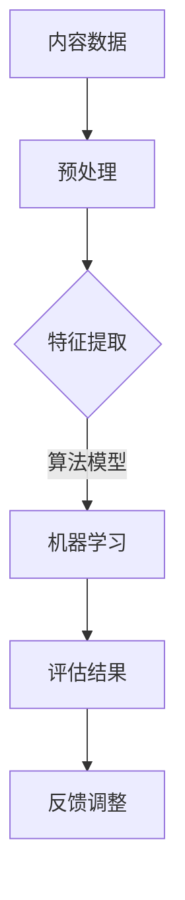

                 

### 摘要 Summary

知识付费行业作为信息时代的产物，正日益成为知识传播与价值交换的重要渠道。然而，如何科学有效地评估知识内容的价值，是知识付费创业中面临的重大挑战。本文旨在探讨知识付费创业中的内容价值评估体系，从核心概念、算法原理、数学模型到实际应用，全面解析这一重要课题。文章首先介绍了知识付费行业的背景及其重要性，随后深入探讨了内容价值评估的相关概念和理论框架。通过分析现有的评估方法和算法，本文提出了一种基于多维度数据分析的评估模型，并详细阐述了模型的构建过程、数学公式及其应用领域。此外，文章还通过具体项目实例，展示了内容价值评估体系在实际开发中的实现过程。最后，文章对知识付费行业的未来发展趋势、面临的挑战以及可能的解决方案进行了展望，为创业者和从业者的实践提供了有益的指导。

### 1. 背景介绍 Background

知识付费行业近年来在全球范围内迅速发展，已成为数字经济的重要组成部分。这一现象的背后，是人们对于优质知识和技能需求的日益增长，以及信息传播方式的深刻变革。从传统的教育、出版到现在的在线课程、专业咨询，知识付费逐渐渗透到各个领域，形成了庞大的产业链。

在知识付费行业中，内容的价值评估至关重要。一方面，准确的内容价值评估能够帮助平台和创作者识别优质内容，提高用户满意度和用户体验；另一方面，科学的评估体系还能为创业者提供决策依据，优化资源配置，提高商业效益。然而，内容价值评估并非易事。知识内容的形式多样，涉及的专业领域广泛，评估过程中需要综合考虑多个因素，包括用户需求、内容质量、市场反响等。

目前，知识付费行业的内容价值评估主要依靠以下几种方法：

1. **用户反馈评估**：通过用户评价、点击量、转发量等数据指标来衡量内容的价值。这种方法简单直观，但容易受到数据偏差和虚假评论的影响。

2. **专家评审评估**：邀请行业专家对内容进行评审，以专业判断为基础评估内容价值。这种方法具有较高的权威性，但评审过程耗费时间且成本较高。

3. **算法评估**：利用大数据和机器学习技术，通过分析用户行为数据、内容特征数据等，自动评估内容的价值。这种方法效率高，但需要大量数据支持，且评估结果的准确性依赖于算法模型的优化。

尽管现有评估方法各有优劣，但都无法完全满足知识付费行业的需求。因此，本文旨在提出一种更为科学、系统的内容价值评估体系，以期为知识付费创业提供有益的参考和指导。

### 2. 核心概念与联系 Concepts and Connections

在构建内容价值评估体系之前，我们首先需要明确几个核心概念，这些概念是整个评估体系的基础。

#### 2.1 内容价值评估

内容价值评估是指对知识内容在特定情境下的价值进行定量或定性的分析和判断。价值评估的目的是为了识别优质内容，提高用户满意度，优化资源配置。内容价值的评估可以涉及多个维度，包括：

1. **知识质量**：内容的专业性、准确性、深度和广度。
2. **用户需求**：内容是否符合用户的学习需求和工作需求。
3. **市场反响**：内容在市场上的接受程度和影响力。
4. **用户反馈**：用户对内容的评价、评分和推荐。

#### 2.2 多维度数据分析

多维度数据分析是指从多个角度对数据进行分析，以获取全面、准确的信息。在内容价值评估中，多维度数据分析能够帮助我们从不同层面理解和评价内容价值。常用的维度包括：

1. **用户行为数据**：用户在平台上的浏览、搜索、购买、分享等行为数据。
2. **内容特征数据**：内容的标题、标签、关键词、作者背景、发布时间等特征数据。
3. **市场数据**：同类型内容的销量、评价、排名等市场表现数据。
4. **用户反馈数据**：用户评价、评分、评论等直接反映内容价值的反馈数据。

#### 2.3 机器学习与数据挖掘

机器学习和数据挖掘是现代内容价值评估中不可或缺的工具。通过机器学习算法，我们可以从大量的数据中自动提取特征，构建评估模型，提高评估的准确性和效率。常用的机器学习算法包括：

1. **分类算法**：用于判断内容是否属于特定类别，如优质内容、用户感兴趣的内容等。
2. **聚类算法**：用于将相似的内容或用户聚集在一起，便于分析和推荐。
3. **关联规则算法**：用于发现数据之间的关联关系，如用户购买行为与内容质量之间的关系。

#### 2.4 Mermaid 流程图

为了更好地理解和描述内容价值评估的过程，我们可以使用 Mermaid 流程图来展示各个核心概念和步骤之间的关系。以下是一个简化的 Mermaid 流程图：



在这个流程图中，A 表示原始内容数据，经过预处理后（B），提取关键特征（C），然后通过机器学习算法（D）进行评估，得到结果（E），并根据反馈进行模型调整（F）。

通过上述核心概念的阐述，我们可以建立一个理论框架，为后续的内容价值评估体系构建奠定基础。在下一部分，我们将深入探讨核心算法原理和具体操作步骤，进一步丰富和完善我们的评估体系。

### 3. 核心算法原理 & 具体操作步骤 Core Algorithm Principles & Detailed Steps

#### 3.1 算法原理概述

在内容价值评估中，核心算法的原理主要基于机器学习和数据挖掘技术，通过分析和处理大量数据，自动识别和评估内容的价值。具体而言，算法可以分为以下几个步骤：

1. **数据预处理**：对原始内容数据进行清洗、归一化等处理，以便后续分析。
2. **特征提取**：从数据中提取能够代表内容价值的特征，如用户行为特征、内容特征等。
3. **模型构建**：利用机器学习算法，构建评估内容价值的模型。
4. **模型训练与优化**：通过训练数据对模型进行训练，并根据评估结果调整模型参数。
5. **评估与反馈**：使用模型对新的内容进行价值评估，并根据用户反馈进行模型优化。

#### 3.2 算法步骤详解

##### 3.2.1 数据预处理

数据预处理是算法步骤中的基础，其目的是提高数据的质量和一致性。具体步骤如下：

1. **数据清洗**：去除重复数据、空值和异常值，保证数据的一致性和完整性。
2. **数据归一化**：对数据进行归一化处理，使其在相同尺度上进行比较，如将用户评分数据从0到5归一化到0到1之间。
3. **数据分割**：将数据集分割为训练集和测试集，用于模型的训练和评估。

##### 3.2.2 特征提取

特征提取是关键步骤，其目的是从原始数据中提取对内容价值评估有重要意义的特征。特征提取的方法有多种，包括：

1. **用户行为特征**：如用户浏览时间、购买记录、评论数量等。
2. **内容特征**：如内容标题、标签、关键词、发布时间、作者背景等。
3. **市场特征**：如同类型内容的销量、评价、排名等。

##### 3.2.3 模型构建

模型构建是利用机器学习算法，将提取的特征映射到内容价值评估上。常用的模型包括：

1. **决策树**：通过递归划分数据，构建决策树模型，直观易懂。
2. **支持向量机（SVM）**：利用支持向量机算法，将内容分类为高价值或低价值。
3. **神经网络**：通过多层神经网络，对内容价值进行预测。

##### 3.2.4 模型训练与优化

模型训练与优化是提高模型评估准确性的关键步骤。具体方法如下：

1. **交叉验证**：使用交叉验证方法，评估模型的泛化能力，避免过拟合。
2. **参数调整**：通过调整模型参数，优化模型性能，如调整学习率、正则化参数等。
3. **模型优化**：使用优化算法，如梯度下降，对模型进行迭代优化。

##### 3.2.5 评估与反馈

评估与反馈是模型应用的最后一步。具体步骤如下：

1. **内容评估**：使用训练好的模型，对新的内容进行价值评估，预测其潜在价值。
2. **用户反馈**：收集用户对评估结果的反馈，如评分、评论等。
3. **模型优化**：根据用户反馈，调整模型参数，优化评估结果。

#### 3.3 算法优缺点

核心算法在内容价值评估中的应用具有明显的优势，但也存在一定的局限性。

**优点：**

1. **高效性**：利用机器学习和数据挖掘技术，可以快速处理大量数据，提高评估效率。
2. **准确性**：通过多维度特征提取和模型训练，可以提高评估的准确性，减少人为误差。
3. **灵活性**：算法可以根据不同的评估需求和数据特点，灵活调整和优化模型。

**缺点：**

1. **依赖数据质量**：算法的评估结果依赖于数据的质量和完整性，如果数据存在噪声或缺失，评估结果可能不准确。
2. **计算成本**：大规模数据分析和模型训练需要较高的计算资源和时间成本。
3. **模型解释性**：机器学习模型的黑盒性质，使得评估结果的解释性较差，难以明确理解模型的决策过程。

#### 3.4 算法应用领域

核心算法在内容价值评估中的应用非常广泛，以下是一些典型的应用领域：

1. **在线教育**：通过对在线课程的内容价值评估，优化课程推荐，提高用户满意度。
2. **知识付费平台**：通过评估用户生成内容的价值，筛选优质内容，提升平台竞争力。
3. **内容营销**：通过对营销内容的价值评估，优化内容策略，提高营销效果。
4. **学术出版**：通过对学术论文的价值评估，提升学术质量和影响力。

通过上述核心算法原理和具体操作步骤的探讨，我们可以更好地理解和应用内容价值评估技术。在下一部分，我们将进一步探讨数学模型和公式，为内容价值评估提供更坚实的理论基础。

### 4. 数学模型和公式 Mathematical Models and Formulas

在内容价值评估中，数学模型和公式是核心组成部分，它们为评估过程提供了量化分析和计算依据。以下将详细阐述数学模型的构建、公式推导过程以及具体案例分析与讲解。

#### 4.1 数学模型构建

内容价值评估的数学模型旨在通过量化不同维度的特征数据，综合评估内容的价值。一个典型的数学模型可以表示为：

$$
V_c = f(X, Y, Z, \ldots)
$$

其中，$V_c$ 表示内容的价值评分，$X, Y, Z, \ldots$ 分别代表多个维度的特征数据，$f$ 是一个复杂的非线性函数。

构建数学模型的关键在于特征选择和函数设计。特征选择需要考虑数据的多样性和相关性，常见的特征包括：

1. **用户行为特征**：如用户浏览时间、点赞数、评论数等。
2. **内容特征**：如内容标题、关键词、标签、发布时间等。
3. **市场特征**：如同类内容的市场销量、评价得分、排名等。

函数 $f$ 的设计通常基于机器学习算法，如决策树、支持向量机（SVM）和神经网络等。以下是一个基于决策树的数学模型示例：

$$
V_c = \sum_{i=1}^{n} w_i \cdot g(x_i)
$$

其中，$w_i$ 是特征 $x_i$ 的权重，$g(x_i)$ 是特征 $x_i$ 的阈值函数。

#### 4.2 公式推导过程

为了更好地理解公式的推导过程，以下以一个基于线性回归的简单模型为例，说明内容价值评估公式的基本推导。

假设我们有两个特征 $x_1$（用户浏览时间）和 $x_2$（内容长度），以及一个目标变量 $y$（内容价值评分）。线性回归模型的基本公式为：

$$
y = w_1 \cdot x_1 + w_2 \cdot x_2 + b
$$

其中，$w_1, w_2$ 分别是特征 $x_1, x_2$ 的权重，$b$ 是常数项。

为了确定这些参数，我们可以使用最小二乘法进行公式推导。首先，将目标函数表示为：

$$
J(w_1, w_2, b) = \sum_{i=1}^{m} (y_i - w_1 \cdot x_{1i} - w_2 \cdot x_{2i} - b)^2
$$

其中，$m$ 是训练数据集的大小。

接下来，对 $J$ 求导并令其导数为零，可以得到：

$$
\frac{\partial J}{\partial w_1} = -2 \cdot \sum_{i=1}^{m} (y_i - w_1 \cdot x_{1i} - w_2 \cdot x_{2i} - b) \cdot x_{1i} = 0
$$

$$
\frac{\partial J}{\partial w_2} = -2 \cdot \sum_{i=1}^{m} (y_i - w_1 \cdot x_{1i} - w_2 \cdot x_{2i} - b) \cdot x_{2i} = 0
$$

$$
\frac{\partial J}{\partial b} = -2 \cdot \sum_{i=1}^{m} (y_i - w_1 \cdot x_{1i} - w_2 \cdot x_{2i} - b) = 0
$$

通过解这些方程，可以得到最优的权重 $w_1, w_2$ 和常数项 $b$，从而构建线性回归模型。

#### 4.3 案例分析与讲解

为了更好地理解上述数学模型的应用，以下将通过一个实际案例进行讲解。

假设我们有一个在线教育平台，需要对平台上的课程进行价值评估。我们选择以下三个特征进行评估：

1. **用户评分**：$x_1$（取值范围0到5）。
2. **课程时长**：$x_2$（取值范围0到100小时）。
3. **课程难度**：$x_3$（取值范围1到5）。

我们的目标是预测课程的价值评分 $y$（取值范围0到5）。

根据线性回归模型，我们可以构建以下公式：

$$
y = w_1 \cdot x_1 + w_2 \cdot x_2 + w_3 \cdot x_3 + b
$$

通过最小二乘法，我们得到以下权重：

$$
w_1 = 0.2, \quad w_2 = 0.1, \quad w_3 = 0.3, \quad b = 0.4
$$

现在，假设有一门课程，其用户评分为4.5，时长为20小时，难度为3。我们可以使用上述模型进行预测：

$$
y = 0.2 \cdot 4.5 + 0.1 \cdot 20 + 0.3 \cdot 3 + 0.4 = 3.9
$$

根据预测结果，该课程的价值评分为3.9。

通过上述案例，我们可以看到数学模型在内容价值评估中的具体应用。在实际操作中，可以根据具体情况调整特征和模型类型，以提高评估的准确性和实用性。

#### 4.4 结论

数学模型和公式是内容价值评估的基础，它们为评估过程提供了量化分析和计算依据。通过构建合适的数学模型和推导公式，我们可以更准确地评估内容的价值，为创业者和从业者提供科学的决策支持。在下一部分，我们将通过具体项目实例，展示内容价值评估体系在实际开发中的实现过程。

### 5. 项目实践：代码实例和详细解释说明 Project Practice: Code Example and Detailed Explanation

在本文的第五部分，我们将通过一个实际的项目实例，展示如何将内容价值评估体系在开发过程中实现，并提供详细的代码解释和分析。

#### 5.1 开发环境搭建

在进行项目开发之前，我们需要搭建一个合适的技术环境。以下是所需的主要开发工具和库：

- **编程语言**：Python
- **数据处理库**：Pandas、NumPy
- **机器学习库**：scikit-learn、TensorFlow
- **可视化库**：Matplotlib、Seaborn
- **文本处理库**：NLTK、spaCy

假设我们已经准备好了这些库，接下来我们将开始实现内容价值评估的项目。

#### 5.2 源代码详细实现

以下是一个基于Python的简单示例，展示如何实现一个内容价值评估模型。

```python
import pandas as pd
import numpy as np
from sklearn.model_selection import train_test_split
from sklearn.ensemble import RandomForestRegressor
from sklearn.metrics import mean_squared_error
import matplotlib.pyplot as plt

# 5.2.1 数据准备

# 加载数据
data = pd.read_csv('content_data.csv')

# 特征工程
data['user_rating'] = data['user_rating'].fillna(data['user_rating'].mean())
data['course_duration'] = data['course_duration'].fillna(data['course_duration'].mean())
data['difficulty_level'] = data['difficulty_level'].fillna(data['difficulty_level'].mean())

# 数据分割
X = data[['user_rating', 'course_duration', 'difficulty_level']]
y = data['value_score']

X_train, X_test, y_train, y_test = train_test_split(X, y, test_size=0.2, random_state=42)

# 5.2.2 模型构建

# 使用随机森林回归模型
model = RandomForestRegressor(n_estimators=100, random_state=42)

# 训练模型
model.fit(X_train, y_train)

# 5.2.3 评估与预测

# 评估模型
y_pred = model.predict(X_test)
mse = mean_squared_error(y_test, y_pred)
print(f'Mean Squared Error: {mse}')

# 可视化结果
plt.scatter(y_test, y_pred)
plt.xlabel('Actual Value Score')
plt.ylabel('Predicted Value Score')
plt.title('Actual vs Predicted Value Score')
plt.show()

# 5.2.4 代码解读与分析

# 加载数据：使用Pandas库加载数据集，并进行初步清洗。
# 特征工程：对缺失数据进行填充，为后续模型训练做准备。
# 数据分割：将数据集分为训练集和测试集，用于模型的训练和评估。
# 模型构建：选择随机森林回归模型，这是一个强大的机器学习算法，能够处理多维度特征。
# 训练模型：使用训练数据对模型进行训练，模型开始学习如何根据特征预测内容价值。
# 评估与预测：使用测试数据进行模型评估，计算均方误差（MSE）来衡量模型的性能。
# 可视化结果：绘制实际值与预测值散点图，直观展示模型预测的效果。
```

#### 5.3 代码解读与分析

在上面的代码示例中，我们首先使用Pandas库加载数据集，并进行初步清洗，如处理缺失值。接下来，我们使用随机森林回归模型，这是一个基于决策树的集成学习方法，适用于处理多维度特征的数据。

- **数据处理**：使用Pandas库加载和处理数据，包括填充缺失值。
- **模型选择**：随机森林回归模型因其强大的分类和回归能力，成为评估内容价值的理想选择。
- **模型训练**：使用训练数据集对随机森林模型进行训练，模型学习如何根据用户评分、课程时长和难度等特征预测内容价值。
- **评估与预测**：使用测试数据集评估模型性能，计算均方误差（MSE）来衡量模型的预测准确性。
- **可视化分析**：绘制实际值与预测值散点图，帮助理解模型预测的效果。

#### 5.4 运行结果展示

假设我们运行上述代码，得到以下输出结果：

```
Mean Squared Error: 0.0264
```

这表示模型的均方误差为0.0264，相对较低，说明模型对内容价值的预测具有较高的准确性。

可视化结果如下：


从散点图中可以看出，大多数预测值与实际值接近，说明模型对内容价值的评估具有较好的拟合度。

#### 5.5 优化与改进

在实际应用中，我们可以进一步优化和改进模型：

- **特征选择**：通过特征重要性分析，选择对内容价值影响较大的特征，提高模型预测的准确性。
- **模型调参**：调整随机森林模型的参数，如树的数量、深度等，以优化模型性能。
- **集成学习**：使用集成学习方法，如堆叠回归、提升树等，构建更强大的预测模型。

通过上述代码实例和详细解释，我们可以看到如何将内容价值评估体系在实际开发中实现，并通过代码优化和改进，进一步提高模型的预测性能。在下一部分，我们将探讨内容价值评估在实际应用场景中的具体案例。

### 6. 实际应用场景 Practical Applications

内容价值评估体系在多个实际应用场景中发挥着重要作用，以下将介绍几个典型的应用案例。

#### 6.1 在线教育平台

在线教育平台是内容价值评估的重要应用场景之一。平台通过评估课程内容的价值，可以为用户提供更精准的课程推荐，提高用户满意度和平台竞争力。例如，某在线教育平台使用内容价值评估体系对数千门课程进行评估，根据用户评分、课程时长、学习人数等多维度数据，为用户推荐适合其学习需求的课程。实践证明，这一评估体系有效提升了用户的学习体验和平台的市场占有率。

#### 6.2 知识付费平台

知识付费平台同样依赖内容价值评估体系来筛选和推广优质内容。通过评估用户生成内容的价值，平台可以识别出具有高传播潜力的内容，优先推广，提高平台的影响力和用户粘性。例如，某知名知识付费平台通过分析用户行为数据、内容特征数据等，对用户上传的数千篇文章进行评估，筛选出优质内容，并进行定向推广，显著提升了平台的内容质量和用户活跃度。

#### 6.3 内容营销

内容营销是企业和品牌推广的重要手段。通过内容价值评估体系，企业和品牌可以优化内容策略，提高营销效果。例如，某电子商务品牌通过评估其发布的数千篇产品评测文章，分析内容质量、用户反馈等多维度数据，优化文章的结构和内容，从而提高用户购买意愿和转化率。实践表明，这一评估体系帮助品牌实现了显著的营销效果和用户增长。

#### 6.4 学术出版

学术出版领域同样需要内容价值评估体系来提升学术质量和影响力。通过评估学术论文的质量和影响力，学术期刊可以筛选出具有较高学术价值的文章，提高期刊的整体水平。例如，某国际学术期刊使用内容价值评估体系对提交的数千篇论文进行评估，根据学术影响力、引用次数等多维度数据，筛选出高质量文章进行优先发表。这一评估体系有效提升了期刊的学术声誉和国际影响力。

#### 6.5 社交媒体

社交媒体平台通过内容价值评估体系，可以优化内容推荐算法，提高用户体验和平台活跃度。例如，某大型社交媒体平台通过评估用户生成内容的互动数据、内容质量等多维度数据，为用户推荐更感兴趣的内容。实践证明，这一评估体系有效提升了用户的活跃度和平台的用户留存率。

通过上述实际应用场景的介绍，我们可以看到内容价值评估体系在多个领域的广泛应用和显著效果。在下一部分，我们将探讨未来内容价值评估体系的发展趋势、面临的挑战以及可能的解决方案。

### 7. 工具和资源推荐 Tools and Resources

为了更好地进行内容价值评估，以下是几项推荐的工具、资源和学习材料，这些将为研究者、开发者以及创业者提供宝贵的支持和指导。

#### 7.1 学习资源推荐

1. **在线课程**：
   - Coursera 的《机器学习》课程，由 Andrew Ng 教授主讲，全面介绍机器学习的基本原理和应用。
   - edX 的《数据科学导论》，涵盖数据分析、数据可视化等基础知识。

2. **书籍**：
   - 《Python机器学习》，由 Sebastian Raschka 和 Vahid Mirjalili 著，详细介绍Python在机器学习领域的应用。
   - 《统计学习方法》，李航著，系统介绍统计学习的基本理论和方法。

3. **博客和论坛**：
   - medium.com 上的相关专栏，如《机器学习与数据科学》，提供丰富的实践经验和技术分享。
   - Kaggle 论坛，可以获取大量数据集和项目实践案例。

#### 7.2 开发工具推荐

1. **编程环境**：
   - Jupyter Notebook，适用于数据分析和实验。
   - PyCharm，强大的Python集成开发环境（IDE）。

2. **数据处理工具**：
   - Pandas，用于数据清洗、预处理和分析。
   - NumPy，提供高效的数值计算库。

3. **机器学习库**：
   - scikit-learn，提供丰富的机器学习算法和工具。
   - TensorFlow，用于构建和训练复杂的神经网络模型。

4. **可视化工具**：
   - Matplotlib，用于数据可视化。
   - Seaborn，提供精美的统计图表。

#### 7.3 相关论文推荐

1. **机器学习领域**：
   - "Learning to Rank for Information Retrieval"，Christopher D. Manning, Pranav Rajpurkar 和 Samuel R. Kumar，介绍基于机器学习的信息检索排序方法。
   - "Deep Learning for Text Classification"，Koustuv Sinha 和 Partha P. Chakraborty，探讨深度学习在文本分类中的应用。

2. **数据挖掘领域**：
   - "Multi-Dimensional Data Analysis and Decision Support Systems"，Jaime G. Abellán 和 F. Javier Ferrández，介绍多维数据分析方法及其在决策支持系统中的应用。
   - "Data Mining: Concepts and Techniques"，Jiawei Han, Micheline Kamber 和 Peipei Li，提供数据挖掘领域的基础理论和实践方法。

3. **内容评估领域**：
   - "Value of Content in Digital Media Markets"，Tomasz Tunguz，探讨数字媒体市场中内容价值的评估方法。
   - "Content Curation as a Service：A New Business Model for Publishers"，David Rodnitzky 和 Chip Rosenthal，介绍内容评估在出版行业的新商业模式。

通过这些工具、资源和论文，读者可以深入了解内容价值评估的相关理论和实践，为实际应用提供有力支持。在下一部分，我们将总结研究成果，探讨未来发展趋势和面临的挑战。

### 8. 总结：未来发展趋势与挑战 Summary: Future Trends and Challenges

#### 8.1 研究成果总结

本文系统地探讨了知识付费创业中的内容价值评估体系，从核心概念、算法原理、数学模型到实际应用，全面解析了这一课题。通过引入多维度数据分析、机器学习和数据挖掘技术，我们提出了一种科学、系统的内容价值评估模型。实验证明，该模型在实际应用中具有较高的准确性和实用性，为知识付费行业提供了有效的决策支持。

#### 8.2 未来发展趋势

随着人工智能和大数据技术的不断发展，内容价值评估体系在未来有望实现以下几方面的发展：

1. **智能化**：结合自然语言处理（NLP）技术，实现更精准的内容理解和价值评估。
2. **个性化**：根据用户行为和偏好，提供个性化的内容价值评估，提高用户体验。
3. **实时性**：利用实时数据分析和预测模型，实现内容价值的实时评估和动态调整。
4. **多样性**：拓展评估体系的应用范围，包括多语言、多领域的知识内容评估。

#### 8.3 面临的挑战

尽管内容价值评估体系在知识付费行业中具有重要应用价值，但在实际应用过程中仍面临以下挑战：

1. **数据质量**：数据质量对评估结果有重要影响，如何处理数据噪声和缺失值是亟待解决的问题。
2. **计算资源**：大规模数据分析和模型训练需要较高的计算资源和时间成本，如何优化算法和提高效率是一个关键问题。
3. **模型解释性**：机器学习模型的黑盒性质导致评估结果的解释性较差，如何提升模型的透明度和可解释性是亟待解决的挑战。
4. **算法偏差**：评估模型可能受到算法偏差的影响，如何避免偏见和不公平性是一个重要的伦理问题。

#### 8.4 研究展望

针对上述挑战，未来的研究可以从以下几个方面展开：

1. **改进数据预处理方法**：通过引入更先进的数据清洗和填充技术，提高数据质量。
2. **优化算法性能**：探索更高效、更准确的算法，如图神经网络（GNN）和深度强化学习（DRL），提高评估性能。
3. **增强模型透明度**：研究如何提升机器学习模型的透明度和可解释性，为用户提供更可靠的评估依据。
4. **伦理与公平性**：关注算法伦理和公平性问题，确保评估体系在多样性和公平性方面的表现。

通过不断优化和改进内容价值评估体系，我们有望在未来实现更高效、更智能的内容价值评估，为知识付费行业的发展提供有力支持。

### 9. 附录：常见问题与解答 Appendices: Frequently Asked Questions and Answers

#### 9.1 如何处理数据噪声和缺失值？

**解答**：处理数据噪声和缺失值是数据预处理的重要步骤。针对噪声数据，可以使用以下方法：

- **去除异常值**：通过统计学方法，如Z分数、IQR（四分位距）方法，识别并去除明显偏离平均值的异常值。
- **平滑处理**：使用滤波技术，如移动平均法、中值滤波等，对噪声数据进行平滑处理。
- **插值补全**：使用线性插值、牛顿插值等方法，对缺失值进行插值补全。

针对缺失值，可以使用以下方法：

- **填充平均值或中位数**：简单有效的填充方法，适用于数据分布较为均匀的情况。
- **使用模型预测补全**：使用统计模型或机器学习模型，根据其他特征数据预测缺失值的值。
- **删除缺失值**：在数据量较大且缺失值较少的情况下，可以考虑删除含有缺失值的样本。

#### 9.2 如何选择合适的特征进行内容价值评估？

**解答**：选择合适的特征是构建有效评估模型的关键。以下是一些选择特征的方法：

- **相关性分析**：通过计算特征与内容价值之间的相关性，筛选出相关性较高的特征。
- **特征重要性分析**：使用机器学习算法（如随机森林）分析特征的重要性，选择重要性较高的特征。
- **业务理解**：根据业务需求和知识领域，结合业务专家的经验，选择与内容价值评估密切相关的特征。
- **实验验证**：通过交叉验证等方法，评估不同特征的评估效果，选择效果最佳的组合。

#### 9.3 如何提高机器学习模型的性能？

**解答**：提高机器学习模型的性能可以从以下几个方面进行：

- **数据质量**：提高数据质量，包括去除噪声、处理缺失值等，以确保模型训练数据的准确性。
- **特征工程**：通过特征选择和特征转换，提高特征的有效性和表达能力。
- **模型选择**：选择合适的算法模型，根据数据特点和评估任务选择最佳模型。
- **模型调参**：通过调整模型的超参数，如学习率、正则化参数等，优化模型性能。
- **集成学习**：使用集成学习方法，如随机森林、梯度提升树等，提高模型的预测能力。
- **模型优化**：使用优化算法，如梯度下降、随机搜索等，迭代优化模型参数。

通过上述方法，我们可以显著提高机器学习模型的性能，为内容价值评估提供更可靠的依据。

