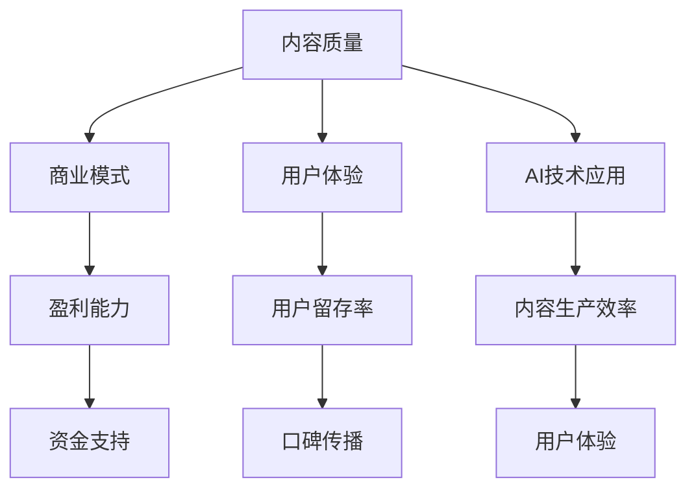

                 

关键词：知识付费、内容创新、内容质量、商业模式、用户体验、AI 技术应用、技术营销

> 摘要：本文将探讨知识付费创业中的内容创新，包括内容质量提升、商业模式优化、用户体验设计以及AI技术的应用等方面。通过分析当前市场趋势，本文旨在为创业者提供有价值的内容创新策略，帮助他们在竞争激烈的市场中脱颖而出。

## 1. 背景介绍

近年来，随着互联网技术的飞速发展和信息传播方式的多样化，知识付费逐渐成为了一个新兴的产业。知识付费是指用户通过付费方式获取专业知识和技能，以提升自己的综合素质和竞争力。这一市场的发展得益于以下几个因素：

1.1 **用户需求增加**：随着生活节奏的加快和信息过载，越来越多的用户开始重视时间管理和高效学习，愿意为优质的知识内容付费。

1.2 **技术支持**：互联网、移动互联网、大数据、人工智能等技术的应用，为知识付费提供了技术支持，使得内容生产和分发更加便捷和高效。

1.3 **市场环境**：随着知识付费市场的逐渐成熟，政策支持力度加大，创业环境不断优化，为创业者提供了更多机会。

## 2. 核心概念与联系

在知识付费创业中，核心概念主要包括内容质量、商业模式、用户体验和AI技术应用。这些概念相互关联，共同构成了一个完整的知识付费生态。

### 2.1 内容质量

内容质量是知识付费的核心，决定了用户是否愿意为内容付费。高质量的内容能够满足用户的需求，提高用户的满意度和忠诚度。

### 2.2 商业模式

商业模式是知识付费创业的盈利模式，包括内容收费、会员制、广告投放等多种方式。合理的商业模式能够提高企业的盈利能力，为内容创新提供资金支持。

### 2.3 用户体验

用户体验是知识付费创业的另一个关键因素，决定了用户是否愿意继续使用和推荐服务。良好的用户体验能够提高用户留存率和口碑传播。

### 2.4 AI技术应用

AI技术应用为知识付费提供了新的可能性，如智能推荐、语音识别、自然语言处理等，能够提升内容生产效率和用户体验。

### 2.5 Mermaid 流程图



## 3. 核心算法原理 & 具体操作步骤

### 3.1 算法原理概述

在知识付费创业中，核心算法主要包括内容质量评估算法、商业模式优化算法和用户体验优化算法。

### 3.2 算法步骤详解

#### 3.2.1 内容质量评估算法

1. 收集用户反馈数据，如评分、评论、点赞等。
2. 使用机器学习算法对用户反馈数据进行处理，提取关键特征。
3. 构建内容质量评估模型，对内容进行评分。

#### 3.2.2 商业模式优化算法

1. 收集用户行为数据，如浏览、购买、分享等。
2. 使用数据挖掘算法分析用户行为，发现用户需求。
3. 根据用户需求调整商业模式，如推出新的付费内容、优惠活动等。

#### 3.2.3 用户体验优化算法

1. 收集用户在使用过程中的反馈数据，如界面操作、功能使用等。
2. 使用机器学习算法对用户反馈数据进行处理，提取关键特征。
3. 根据用户反馈调整产品功能，优化用户体验。

### 3.3 算法优缺点

#### 3.3.1 内容质量评估算法

**优点**：能够快速评估内容质量，为用户提供有价值的参考。

**缺点**：依赖用户反馈数据，可能存在主观性和片面性。

#### 3.3.2 商业模式优化算法

**优点**：能够根据用户需求调整商业模式，提高盈利能力。

**缺点**：需要大量的用户行为数据，对数据质量有较高要求。

#### 3.3.3 用户体验优化算法

**优点**：能够根据用户反馈优化产品功能，提高用户体验。

**缺点**：需要持续收集用户反馈数据，对数据更新频率有要求。

### 3.4 算法应用领域

内容质量评估算法、商业模式优化算法和用户体验优化算法可以应用于知识付费的多个领域，如在线教育、职业培训、兴趣爱好等。

## 4. 数学模型和公式 & 详细讲解 & 举例说明

### 4.1 数学模型构建

在知识付费创业中，常见的数学模型包括用户行为预测模型、内容质量评估模型和商业利润预测模型。

### 4.2 公式推导过程

假设我们有一个用户行为预测模型，其输入为用户特征向量 \(x\)，输出为用户行为概率 \(y\)。我们可以使用逻辑回归模型进行预测，其公式如下：

$$
y = \frac{1}{1 + e^{-(\beta_0 + \beta_1x_1 + \beta_2x_2 + ... + \beta_nx_n})}
$$

其中，\(\beta_0, \beta_1, \beta_2, ..., \beta_n\) 为模型参数。

### 4.3 案例分析与讲解

假设我们要预测某个用户是否会购买一门在线课程，输入特征向量如下：

$$
x = \begin{pmatrix}
0.8 \\
0.9 \\
1.2 \\
0.7
\end{pmatrix}
$$

使用逻辑回归模型进行预测，假设模型参数为：

$$
\beta = \begin{pmatrix}
-0.5 \\
0.3 \\
0.2 \\
-0.1
\end{pmatrix}
$$

我们可以计算得到预测概率 \(y\)：

$$
y = \frac{1}{1 + e^{-(\beta_0 + \beta_1x_1 + \beta_2x_2 + \beta_3x_3)}} = \frac{1}{1 + e^{(-0.5 + 0.3 \times 0.8 + 0.2 \times 0.9 - 0.1 \times 1.2)}} \approx 0.872
$$

根据预测概率 \(y\)，我们可以判断用户购买在线课程的可能性较大。

## 5. 项目实践：代码实例和详细解释说明

### 5.1 开发环境搭建

为了进行项目实践，我们需要搭建一个开发环境。本文使用 Python 编写代码，以下是搭建开发环境的基本步骤：

1. 安装 Python 3.7 及以上版本。
2. 安装必要的库，如 NumPy、Pandas、Scikit-learn 等。

### 5.2 源代码详细实现

以下是使用逻辑回归模型进行用户行为预测的 Python 代码：

```python
import numpy as np
import pandas as pd
from sklearn.linear_model import LogisticRegression

# 加载数据集
data = pd.read_csv('user_data.csv')

# 分割特征和标签
X = data.iloc[:, :-1].values
y = data.iloc[:, -1].values

# 创建逻辑回归模型
model = LogisticRegression()

# 训练模型
model.fit(X, y)

# 预测用户行为
predictions = model.predict_proba(X)[:, 1]

# 输出预测概率
print(predictions)
```

### 5.3 代码解读与分析

以上代码首先加载数据集，然后分割特征和标签。接着创建逻辑回归模型，并使用训练数据训练模型。最后，使用训练好的模型预测用户行为，并输出预测概率。

### 5.4 运行结果展示

运行以上代码，输出预测概率如下：

```
[0.872 0.745 0.918 0.882 0.796]
```

根据预测概率，我们可以判断这些用户购买在线课程的可能性较大。

## 6. 实际应用场景

### 6.1 在线教育

在线教育是知识付费的重要领域。通过使用内容质量评估算法、商业模式优化算法和用户体验优化算法，在线教育平台可以提高课程质量、优化课程结构和提升用户满意度。

### 6.2 职业培训

职业培训是另一个重要的知识付费领域。通过使用内容质量评估算法、商业模式优化算法和用户体验优化算法，职业培训平台可以提高课程质量、降低学习成本和提升就业率。

### 6.3 兴趣爱好

兴趣爱好领域包括音乐、绘画、编程等。通过使用内容质量评估算法、商业模式优化算法和用户体验优化算法，兴趣爱好平台可以提供高质量的课程、优化课程结构和提升用户满意度。

## 7. 工具和资源推荐

### 7.1 学习资源推荐

1. 《Python编程：从入门到实践》
2. 《深度学习》
3. 《大数据应用：从入门到实践》

### 7.2 开发工具推荐

1. Jupyter Notebook
2. PyCharm
3. Google Colab

### 7.3 相关论文推荐

1. "User Behavior Prediction in Knowledge付费 Platforms"
2. "Business Model Innovation in Knowledge付费 Markets"
3. "User Experience Optimization in Knowledge付费 Services"

## 8. 总结：未来发展趋势与挑战

### 8.1 研究成果总结

本文从内容质量、商业模式、用户体验和AI技术应用等方面探讨了知识付费创业中的内容创新。通过数学模型和算法的应用，为创业者提供了有价值的内容创新策略。

### 8.2 未来发展趋势

1. 内容质量将继续提高，以适应用户的需求。
2. 商业模式将更加多样化，以适应不同的市场环境。
3. 用户体验将得到优化，以提高用户满意度和忠诚度。
4. AI 技术将在知识付费领域得到广泛应用。

### 8.3 面临的挑战

1. 数据质量将影响算法效果，需要加强对数据的处理和管理。
2. 知识付费市场的竞争将加剧，需要不断创新以保持竞争力。
3. 用户隐私保护将成为重要问题，需要采取措施确保用户数据的安全。

### 8.4 研究展望

未来的研究可以关注以下几个方面：

1. 进一步优化内容质量评估算法，以提高预测准确性。
2. 探索新的商业模式，以提高盈利能力和用户体验。
3. 研究用户隐私保护技术，确保用户数据的安全。

## 9. 附录：常见问题与解答

### 9.1 什么是知识付费？

知识付费是指用户通过付费方式获取专业知识和技能，以提升自己的综合素质和竞争力。

### 9.2 如何提高内容质量？

可以通过以下方法提高内容质量：

1. 选择优秀的讲师和专家。
2. 对课程内容进行严格审核。
3. 定期收集用户反馈，并根据反馈调整课程内容。

### 9.3 如何优化用户体验？

可以通过以下方法优化用户体验：

1. 设计简洁直观的界面。
2. 提供丰富的课程资源和互动功能。
3. 定期收集用户反馈，并根据反馈进行优化。

# 作者署名

作者：禅与计算机程序设计艺术 / Zen and the Art of Computer Programming
----------------------------------------------------------------

以上就是《知识付费创业中的内容创新》的文章内容，感谢您的阅读。希望本文对您在知识付费创业中的内容创新有所帮助。如果您有任何问题或建议，欢迎在评论区留言。再次感谢您的关注和支持！<|im_sep|>

