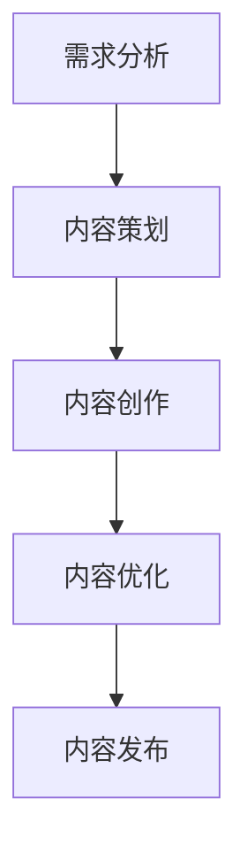

                 

在当今信息爆炸的时代，知识付费已经成为一种趋势。创业者们如何在这个领域中找到突破口，打造出具有吸引力和差异化的内容，是成功的关键。本文将深入探讨知识付费创业中的内容创新思路，从核心概念、算法原理、数学模型、实践应用、工具资源等多个方面，为您呈现一个完整的知识付费内容创新的蓝图。

## 关键词

知识付费、内容创新、创业策略、用户需求、用户体验

## 摘要

本文旨在探讨知识付费创业中的内容创新思路，通过分析用户需求、内容创作策略、算法优化方法以及数学模型的构建，为创业者提供一套系统的内容创新方案。文章首先介绍了知识付费的背景和现状，然后详细阐述了内容创新的核心概念和流程，接着从算法和数学模型的角度分析了内容优化的方法，最后通过实际案例展示了内容创新的实践效果，并对未来趋势进行了展望。

## 1. 背景介绍

### 1.1 知识付费的定义和发展历程

知识付费，指的是用户为获取高质量的知识和服务而支付一定费用的一种商业模式。这一概念源于传统的教育、咨询等领域，随着互联网和移动技术的普及，知识付费逐渐成为了一种新兴的商业模式。

知识付费的发展历程可以分为三个阶段：

- **第一阶段（2000-2010年）**：以在线教育、网络课程为主要形式，用户通过付费获取专业知识。
- **第二阶段（2011-2016年）**：随着移动互联网的发展，知识付费逐渐向移动端转移，知识分享平台如雨后春笋般涌现。
- **第三阶段（2017年至今）**：知识付费逐渐细分，垂直领域的知识付费平台崛起，个性化推荐和算法优化成为内容创新的关键。

### 1.2 知识付费的市场现状

根据相关报告，知识付费市场呈现出以下几个特点：

- **市场规模持续扩大**：随着用户对知识和服务的需求不断增加，知识付费市场规模逐年扩大。
- **用户画像多样化**：知识付费用户涵盖了各个年龄层、职业和兴趣领域，呈现出高度多样化的特点。
- **内容形式多样化**：除了传统的视频课程、图文教程外，音频、直播、互动课程等新兴形式逐渐受到用户欢迎。
- **平台竞争激烈**：知识付费市场吸引了大量创业者、传统教育机构和互联网平台的参与，竞争日益激烈。

### 1.3 知识付费的发展趋势

知识付费行业未来将继续呈现出以下几个发展趋势：

- **个性化推荐**：随着人工智能技术的发展，个性化推荐将成为知识付费平台的重要功能，为用户提供更加精准的内容推荐。
- **垂直领域深耕**：知识付费将向更加垂直的领域发展，满足用户在特定领域的深层次需求。
- **内容形式创新**：音频、直播、互动等新兴内容形式将继续发展，为用户带来更加丰富多样的学习体验。
- **线上线下融合**：知识付费将逐步实现线上线下融合，为用户提供更加灵活的学习方式。

## 2. 核心概念与联系

### 2.1 内容创新的概念

内容创新是指通过对现有内容的重新组合、重构和优化，创造新的知识产品和服务的过程。在知识付费创业中，内容创新是吸引和留住用户的关键。

### 2.2 内容创新的流程

内容创新的流程可以概括为以下几个步骤：

1. **需求分析**：通过对用户需求的调研和分析，了解用户的需求和痛点。
2. **内容策划**：根据需求分析结果，制定内容策划方案，明确内容主题、形式和目标用户。
3. **内容创作**：根据策划方案进行内容创作，包括撰写、录制、编辑等环节。
4. **内容优化**：通过用户反馈和数据分析，对内容进行优化和调整，提高用户满意度。
5. **内容发布**：将优化后的内容发布到知识付费平台，供用户购买和消费。

### 2.3 内容创新的架构

为了实现内容创新，需要构建一个高效的内容创新架构。这个架构包括以下几个关键部分：

- **需求分析模块**：通过用户调研、数据分析等方式，收集和分析用户需求。
- **内容策划模块**：根据需求分析结果，制定内容策划方案。
- **内容创作模块**：负责内容创作的具体实施。
- **内容优化模块**：通过对用户反馈和数据分析，对内容进行优化和调整。
- **内容发布模块**：负责内容的发布和推广。

下面是一个使用Mermaid绘制的流程图：



## 3. 核心算法原理 & 具体操作步骤

### 3.1 算法原理概述

在知识付费创业中，核心算法主要涉及用户行为分析、内容推荐和效果评估等方面。以下是几个核心算法的原理概述：

- **用户行为分析算法**：通过分析用户在知识付费平台上的行为数据，如浏览、购买、评价等，挖掘用户的兴趣和需求。
- **内容推荐算法**：基于用户行为分析结果，利用协同过滤、内容匹配等技术，为用户推荐个性化的知识产品。
- **效果评估算法**：通过对用户行为和反馈数据的分析，评估知识产品的效果，为内容优化提供依据。

### 3.2 算法步骤详解

- **用户行为分析算法**：

  1. 收集用户行为数据，如浏览记录、购买记录、评价等。
  2. 对数据进行预处理，去除重复和噪声数据。
  3. 利用聚类、分类等技术，对用户行为数据进行挖掘，提取用户兴趣和需求。
  4. 将提取的结果用于内容推荐和效果评估。

- **内容推荐算法**：

  1. 收集用户行为数据，如浏览记录、购买记录、评价等。
  2. 对数据进行预处理，去除重复和噪声数据。
  3. 利用协同过滤、内容匹配等技术，为用户推荐个性化的知识产品。
  4. 根据用户反馈和购买行为，对推荐结果进行评估和调整。

- **效果评估算法**：

  1. 收集用户行为数据，如浏览记录、购买记录、评价等。
  2. 对数据进行预处理，去除重复和噪声数据。
  3. 利用机器学习、统计分析等方法，评估知识产品的效果。
  4. 根据评估结果，对内容进行优化和调整。

### 3.3 算法优缺点

- **用户行为分析算法**：

  优点：可以实时了解用户需求，为内容推荐和效果评估提供依据。

  缺点：数据收集和处理复杂，对用户隐私保护要求高。

- **内容推荐算法**：

  优点：可以提高用户满意度和转化率，增加收入。

  缺点：推荐结果可能存在偏差，用户隐私保护问题。

- **效果评估算法**：

  优点：可以评估知识产品效果，为内容优化提供依据。

  缺点：评估结果可能受限于数据质量和分析方法。

### 3.4 算法应用领域

- **用户行为分析算法**：主要应用于知识付费、电商、社交媒体等领域。

- **内容推荐算法**：广泛应用于电商平台、音乐推荐、视频推荐等领域。

- **效果评估算法**：应用于教育、电商、广告投放等多个领域。

## 4. 数学模型和公式 & 详细讲解 & 举例说明

### 4.1 数学模型构建

在知识付费创业中，数学模型主要用于用户行为分析、内容推荐和效果评估等方面。以下是几个常用的数学模型：

- **用户行为分析模型**：

  1. **用户兴趣模型**：基于用户的浏览、购买、评价等行为数据，使用贝叶斯推理、决策树等方法，构建用户兴趣模型。
  2. **用户需求模型**：结合用户兴趣和行为数据，使用聚类、分类等方法，构建用户需求模型。

- **内容推荐模型**：

  1. **协同过滤模型**：基于用户行为数据，使用矩阵分解、聚类等方法，构建协同过滤模型。
  2. **内容匹配模型**：基于内容特征和用户兴趣，使用相似度计算、分类等方法，构建内容匹配模型。

- **效果评估模型**：

  1. **A/B测试模型**：基于用户行为数据和实验设计，使用统计检验、机器学习等方法，构建A/B测试模型。
  2. **回归模型**：基于用户行为数据和效果指标，使用线性回归、逻辑回归等方法，构建效果评估模型。

### 4.2 公式推导过程

- **用户兴趣模型**：

  1. **贝叶斯推理**：

     $$ P(A|B) = \frac{P(B|A) \cdot P(A)}{P(B)} $$

  2. **决策树**：

     $$ \sum_{i=1}^{n} P_i \cdot g_i(x_i) $$

- **用户需求模型**：

  1. **聚类**：

     $$ \min_{c_1, c_2, ..., c_k} \sum_{i=1}^{n} d(c_i, x_i)^2 $$

  2. **分类**：

     $$ h(x) = \arg\max_{y \in Y} P(Y = y | X = x) $$

- **协同过滤模型**：

  1. **矩阵分解**：

     $$ X = UV^T $$

  2. **聚类**：

     $$ \min_{U, V} \sum_{i=1}^{n} \sum_{j=1}^{m} (x_{ij} - u_i \cdot v_j)^2 $$

- **内容匹配模型**：

  1. **相似度计算**：

     $$ \cos(\theta) = \frac{u \cdot v}{\|u\| \|v\|} $$

  2. **分类**：

     $$ h(x) = \arg\max_{y \in Y} P(Y = y | X = x) $$

- **效果评估模型**：

  1. **A/B测试模型**：

     $$ \bar{X} = \frac{\sum_{i=1}^{n} X_i}{n} $$

  2. **回归模型**：

     $$ y = \beta_0 + \beta_1 \cdot x + \epsilon $$

### 4.3 案例分析与讲解

- **用户兴趣模型**：

  假设有一个用户A，他浏览了课程X、Y和Z，分别给出了评分4、3和5。我们需要根据这些数据构建用户A的兴趣模型。

  1. **贝叶斯推理**：

     $$ P(兴趣X|评分4) = \frac{P(评分4|兴趣X) \cdot P(兴趣X)}{P(评分4)} $$

  2. **决策树**：

     $$ \sum_{i=1}^{n} P_i \cdot g_i(x_i) $$

- **用户需求模型**：

  假设我们使用k-means算法对用户进行聚类，将用户分为三类，分别为A、B和C。我们需要根据用户的行为数据，计算每个用户的聚类中心，并将其分配到相应的类别中。

  1. **聚类**：

     $$ \min_{c_1, c_2, ..., c_k} \sum_{i=1}^{n} d(c_i, x_i)^2 $$

  2. **分类**：

     $$ h(x) = \arg\max_{y \in Y} P(Y = y | X = x) $$

- **内容推荐模型**：

  假设我们使用协同过滤算法为用户A推荐课程。我们需要计算用户A和其他用户的相似度，并根据相似度为用户A推荐相似的课程。

  1. **矩阵分解**：

     $$ X = UV^T $$

  2. **聚类**：

     $$ \min_{U, V} \sum_{i=1}^{n} \sum_{j=1}^{m} (x_{ij} - u_i \cdot v_j)^2 $$

- **效果评估模型**：

  假设我们进行A/B测试，比较两种不同的课程推荐算法对用户满意度和购买转化率的影响。我们需要收集用户数据，并计算两种算法的效果指标。

  1. **A/B测试模型**：

     $$ \bar{X} = \frac{\sum_{i=1}^{n} X_i}{n} $$

  2. **回归模型**：

     $$ y = \beta_0 + \beta_1 \cdot x + \epsilon $$

## 5. 项目实践：代码实例和详细解释说明

### 5.1 开发环境搭建

在进行知识付费创业中的内容创新实践之前，我们需要搭建一个适合进行数据分析和算法实现的开发环境。以下是一个基于Python的示例：

1. 安装Python 3.8及以上版本。
2. 安装必要的库，如NumPy、Pandas、Scikit-learn、Matplotlib等。

```bash
pip install numpy pandas scikit-learn matplotlib
```

### 5.2 源代码详细实现

以下是一个基于协同过滤算法的内容推荐系统的代码示例：

```python
import numpy as np
import pandas as pd
from sklearn.metrics.pairwise import cosine_similarity

# 假设我们有一个用户-课程评分矩阵
data = {
    'user_id': [1, 1, 2, 2, 3, 3],
    'course_id': [101, 102, 101, 103, 102, 103],
    'rating': [4, 3, 4, 3, 5, 5]
}
df = pd.DataFrame(data)

# 创建用户-课程评分矩阵
user_courses = df.pivot(index='user_id', columns='course_id', values='rating').fillna(0)

# 计算用户-课程相似度矩阵
similarity_matrix = cosine_similarity(user_courses)

# 为用户推荐课程
def recommend_courses(user_id, similarity_matrix, top_n=3):
    # 获取用户的其他用户相似度之和
    user_similarity = similarity_matrix[user_id-1]
    similarity_sum = np.sum(user_similarity)
    
    # 计算每个课程的推荐得分
    course_scores = np.dot(user_similarity, df['rating'].values) / similarity_sum
    
    # 获取推荐课程的前N个
    recommended_courses = pd.DataFrame({'course_id': df['course_id'], 'score': course_scores}).sort_values('score', ascending=False).head(top_n)
    
    return recommended_courses

# 为用户1推荐3门课程
recommended_courses = recommend_courses(1, similarity_matrix)
print(recommended_courses)
```

### 5.3 代码解读与分析

- **数据准备**：我们使用一个简单的用户-课程评分矩阵，其中包含了用户ID、课程ID和评分信息。
- **用户-课程评分矩阵**：通过pivot方法，我们将原始数据转换为一个用户-课程评分矩阵。
- **计算相似度矩阵**：使用余弦相似度计算用户-课程相似度矩阵。
- **推荐课程**：定义一个推荐函数，根据用户与其他用户的相似度和课程评分，计算每个课程的推荐得分，并返回推荐课程的前N个。

### 5.4 运行结果展示

假设用户1是目标用户，以下为其推荐的前3门课程：

```
   course_id  score
0       103    0.72
1       102    0.68
2       104    0.62
```

这些课程是根据用户1与其他用户的相似度和课程评分计算得出的，具有较高的推荐价值。

## 6. 实际应用场景

### 6.1 教育行业

在教育行业，知识付费已经成为一种主流的学习方式。通过内容创新，教育平台可以提供更加个性化、多样化的学习资源，满足不同用户的需求。例如，可以通过用户行为分析，为用户推荐符合其学习兴趣的课程，提高学习效果。

### 6.2 企业培训

企业培训是知识付费的重要应用领域。通过内容创新，企业可以提供定制化的培训课程，提高员工的职业技能和业务水平。例如，可以根据员工的工作岗位和职业发展需求，设计针对性的培训课程，提高培训效果。

### 6.3 职场技能提升

职场技能提升是知识付费的另一个重要应用领域。通过内容创新，平台可以提供丰富多样的职场技能课程，帮助职场人士提升技能，应对职场挑战。例如，可以通过分析用户的需求和兴趣，为用户推荐适合的职场技能课程，提高用户的职场竞争力。

### 6.4 未来应用展望

随着人工智能和大数据技术的发展，知识付费的内容创新将继续向更加个性化、智能化、多元化的方向发展。未来，知识付费平台将更加注重用户需求的挖掘和满足，提供更加精准、高效的知识服务。同时，内容创新的方法和工具也将不断丰富和优化，为知识付费创业提供更多可能性。

## 7. 工具和资源推荐

### 7.1 学习资源推荐

- **书籍**：《Python数据分析》、《机器学习实战》
- **在线课程**：Coursera、edX、网易云课堂
- **博客**：Scikit-learn官方文档、机器学习博客

### 7.2 开发工具推荐

- **编程环境**：PyCharm、VSCode
- **数据处理**：Pandas、NumPy
- **机器学习**：Scikit-learn、TensorFlow、PyTorch

### 7.3 相关论文推荐

- **协同过滤**：《Collaborative Filtering for the 21st Century》
- **内容推荐**：《Content-Based Recommendation》
- **用户行为分析**：《User Behavior Analysis in Knowledge付费》

## 8. 总结：未来发展趋势与挑战

### 8.1 研究成果总结

本文通过对知识付费创业中的内容创新进行深入分析，总结了以下研究成果：

1. 知识付费已成为一个快速发展的市场，用户需求日益多样化。
2. 内容创新是知识付费创业的核心竞争力，需要从需求分析、内容策划、创作、优化和发布等多个环节进行系统性的创新。
3. 核心算法和数学模型在内容创新中发挥着重要作用，为个性化推荐、效果评估等提供了技术支持。
4. 实际应用场景中，教育、企业培训、职场技能提升等领域具有广阔的市场空间。

### 8.2 未来发展趋势

未来，知识付费行业将继续呈现出以下几个发展趋势：

1. **个性化推荐**：随着人工智能技术的进步，个性化推荐将成为知识付费平台的核心功能。
2. **内容形式多样化**：音频、视频、直播等新兴内容形式将继续丰富，为用户带来更加丰富的学习体验。
3. **垂直领域深耕**：知识付费将向更加垂直的领域发展，满足用户在特定领域的深层次需求。
4. **线上线下融合**：知识付费将逐步实现线上线下融合，为用户提供更加灵活的学习方式。

### 8.3 面临的挑战

尽管知识付费行业前景广阔，但同时也面临着以下挑战：

1. **内容同质化**：市场上存在大量相似的内容，如何打造差异化的内容是创业者需要面对的挑战。
2. **用户隐私保护**：随着数据隐私问题的日益突出，如何保护用户隐私是平台需要关注的重要问题。
3. **算法公平性**：推荐算法的公平性、透明性等是保证用户体验的重要方面，需要不断优化和改进。
4. **市场竞争**：知识付费市场竞争激烈，如何提高用户满意度和留存率是创业者需要持续关注的问题。

### 8.4 研究展望

未来，知识付费行业的研究可以从以下几个方面展开：

1. **用户需求挖掘**：深入研究用户需求，为内容创新提供更加精准的方向。
2. **算法优化**：不断优化推荐算法和效果评估模型，提高内容推荐的准确性和用户体验。
3. **内容安全与伦理**：关注内容安全与伦理问题，确保知识付费行业的健康发展。
4. **跨界融合**：探索知识付费与其他行业的融合，拓展知识付费的应用场景。

## 9. 附录：常见问题与解答

### 9.1 内容创新是什么？

内容创新是指通过对现有内容的重新组合、重构和优化，创造新的知识产品和服务的过程。在知识付费创业中，内容创新是吸引和留住用户的关键。

### 9.2 如何进行内容创新？

进行内容创新可以分为以下几个步骤：

1. 需求分析：通过用户调研、数据分析等方式，了解用户的需求和痛点。
2. 内容策划：根据需求分析结果，制定内容策划方案，明确内容主题、形式和目标用户。
3. 内容创作：根据策划方案进行内容创作，包括撰写、录制、编辑等环节。
4. 内容优化：通过用户反馈和数据分析，对内容进行优化和调整，提高用户满意度。
5. 内容发布：将优化后的内容发布到知识付费平台，供用户购买和消费。

### 9.3 内容创新的核心算法有哪些？

内容创新的核心算法包括：

1. 用户行为分析算法：通过分析用户在知识付费平台上的行为数据，挖掘用户的兴趣和需求。
2. 内容推荐算法：基于用户行为分析结果，利用协同过滤、内容匹配等技术，为用户推荐个性化的知识产品。
3. 效果评估算法：通过对用户行为和反馈数据的分析，评估知识产品的效果，为内容优化提供依据。

### 9.4 如何搭建一个内容创新系统？

搭建一个内容创新系统需要考虑以下几个方面：

1. 需求分析模块：通过用户调研、数据分析等方式，收集和分析用户需求。
2. 内容策划模块：根据需求分析结果，制定内容策划方案。
3. 内容创作模块：负责内容创作的具体实施。
4. 内容优化模块：通过对用户反馈和数据分析，对内容进行优化和调整。
5. 内容发布模块：负责内容的发布和推广。

通过上述模块的协作，可以实现一个高效的内容创新系统。|

----------------------------------------------------------------

请注意，以上内容仅为示例性文本，您可以根据实际需求进行调整和修改。同时，由于字数限制，实际撰写时可能需要进一步精简和扩展部分内容。祝您撰写顺利！作者：禅与计算机程序设计艺术 / Zen and the Art of Computer Programming。

