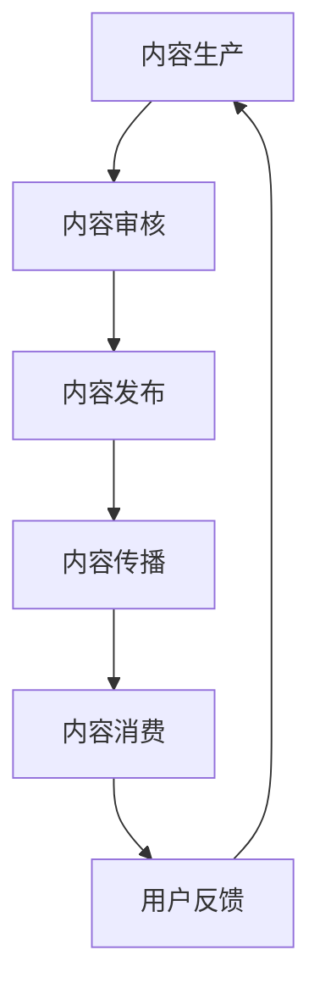

                 

关键词：知识付费、内容协同、创业、策略、IT领域

摘要：本文旨在探讨知识付费创业中的内容协同策略，分析其核心概念、算法原理、数学模型以及实际应用场景。通过搭建开发环境、实现代码实例和详细解读，本文为创业者提供了实用的指导，并对未来的发展趋势与挑战进行了展望。

## 1. 背景介绍

在当今信息爆炸的时代，知识付费已经成为一种流行的商业模式。随着互联网技术的不断发展，知识付费市场呈现出爆炸式增长。知识付费创业者在面对激烈的市场竞争时，如何打造高质量、差异化的内容，实现内容的有效协同，成为了决定创业成败的关键。

内容协同策略指的是通过整合各类资源，优化内容生产、传播和消费过程中的各个环节，提高内容的附加值和用户体验。本文将围绕知识付费创业中的内容协同策略展开讨论，旨在为创业者提供一套系统的解决方案。

## 2. 核心概念与联系

在探讨内容协同策略之前，我们需要明确以下几个核心概念：

1. **知识付费**：指用户为获取特定知识或技能所支付的费用。知识付费模式主要包括付费专栏、课程、直播、问答等。
2. **内容生产**：指知识付费创业者在不同平台创作、发布和传播知识内容的过程。
3. **内容消费**：指用户在各类平台获取、学习、互动和分享知识内容的行为。
4. **内容协同**：指通过技术手段和运营策略，实现内容生产、传播和消费的有机结合，提升内容的整体价值。

下面是一个Mermaid流程图，展示内容协同的基本架构：



### 2.1 内容生产

内容生产是知识付费创业的起点。创业者需要根据市场需求和自身优势，确定内容创作的方向。内容生产的过程包括选题、创作、编辑和校对等环节。

### 2.2 内容审核

内容审核是保证内容质量的关键环节。平台需要对内容进行审核，确保其符合法律法规和平台规范。审核过程包括内容真实性、合规性、原创性和价值性等方面的评估。

### 2.3 内容发布

内容发布是指将审核通过的内容发布到相应的平台。发布方式包括专栏、课程、直播、问答等。平台需要提供丰富的发布形式，以满足用户的不同需求。

### 2.4 内容传播

内容传播是指通过各种渠道和手段，将内容推送给目标用户。传播方式包括搜索引擎优化、社交媒体推广、社群营销等。有效的传播策略可以提高内容的曝光率和影响力。

### 2.5 内容消费

内容消费是指用户在各类平台获取、学习、互动和分享知识内容的行为。平台需要提供良好的用户体验，包括内容推荐、学习路径规划、互动评论等功能。

### 2.6 用户反馈

用户反馈是优化内容协同的重要依据。平台需要收集和分析用户反馈，不断改进内容质量和用户体验。用户反馈环节包括用户评价、问答互动、学习进度跟踪等。

## 3. 核心算法原理 & 具体操作步骤

### 3.1 算法原理概述

内容协同策略的核心算法包括推荐算法、内容分拣算法和用户行为分析算法等。这些算法通过分析用户数据和内容特征，实现内容与用户的精准匹配。

### 3.2 算法步骤详解

#### 3.2.1 推荐算法

推荐算法是内容协同的关键。其基本步骤如下：

1. 用户画像构建：根据用户的历史行为、兴趣标签和社交关系等数据，构建用户画像。
2. 内容特征提取：对内容进行文本分析、图像识别和音频处理等，提取内容特征。
3. 相似度计算：计算用户画像与内容特征之间的相似度，推荐相似度最高的内容。
4. 排序与展示：将推荐内容按照相似度排序，并在平台中展示给用户。

#### 3.2.2 内容分拣算法

内容分拣算法用于将海量内容进行分类和筛选，提高内容的质量和用户体验。其基本步骤如下：

1. 内容标签提取：对内容进行文本分析，提取关键词和标签。
2. 分类模型训练：使用机器学习算法，训练分类模型，对内容进行分类。
3. 内容筛选：根据用户偏好和平台策略，筛选出优质内容。
4. 内容推荐：将筛选后的内容推荐给用户。

#### 3.2.3 用户行为分析算法

用户行为分析算法用于了解用户的学习行为和兴趣变化，优化内容推荐策略。其基本步骤如下：

1. 行为数据采集：收集用户在平台上的学习行为数据，包括浏览、点赞、评论等。
2. 行为模式识别：使用数据挖掘算法，识别用户的行为模式。
3. 用户兴趣预测：根据用户的行为数据，预测用户的兴趣变化。
4. 推荐策略调整：根据用户兴趣预测结果，调整推荐策略。

### 3.3 算法优缺点

#### 推荐算法

优点：

- 提高内容曝光率和用户粘性
- 增强用户个性化体验

缺点：

- 需要大量数据支持
- 可能存在信息茧房效应

#### 内容分拣算法

优点：

- 提高内容质量
- 降低用户筛选成本

缺点：

- 需要较强的算法能力
- 可能出现误分类情况

#### 用户行为分析算法

优点：

- 优化推荐策略
- 提高用户满意度

缺点：

- 数据隐私问题
- 需要大量计算资源

### 3.4 算法应用领域

内容协同算法广泛应用于各类知识付费平台，包括在线教育、技能培训、专业咨询等领域。通过算法优化，平台可以实现个性化推荐、内容筛选和用户行为分析，提高用户满意度和粘性。

## 4. 数学模型和公式 & 详细讲解 & 举例说明

### 4.1 数学模型构建

内容协同策略的数学模型主要包括推荐算法模型、内容分拣算法模型和用户行为分析模型等。

#### 4.1.1 推荐算法模型

推荐算法模型通常采用基于矩阵分解、深度学习等方法。以下是一个简单的基于矩阵分解的推荐算法模型：

$$
R_{ij} = \hat{U_i} \cdot \hat{V_j}
$$

其中，$R_{ij}$ 表示用户 $i$ 对内容 $j$ 的评分，$\hat{U_i}$ 和 $\hat{V_j}$ 分别表示用户 $i$ 和内容 $j$ 的特征向量。

#### 4.1.2 内容分拣算法模型

内容分拣算法模型通常采用分类算法，如朴素贝叶斯、支持向量机等。以下是一个基于朴素贝叶斯的分类算法模型：

$$
P(C_j|X) = \frac{P(X|C_j)P(C_j)}{P(X)}
$$

其中，$C_j$ 表示内容分类，$X$ 表示内容特征向量，$P(C_j)$ 表示内容分类概率，$P(X|C_j)$ 表示内容特征向量在特定分类下的条件概率。

#### 4.1.3 用户行为分析模型

用户行为分析模型通常采用时间序列分析、回归分析等方法。以下是一个基于时间序列分析的模型：

$$
y_t = \alpha_0 + \alpha_1 y_{t-1} + \alpha_2 x_t + \epsilon_t
$$

其中，$y_t$ 表示用户 $t$ 时刻的兴趣值，$x_t$ 表示用户 $t$ 时刻的行为特征，$\alpha_0$、$\alpha_1$ 和 $\alpha_2$ 分别为模型参数。

### 4.2 公式推导过程

#### 4.2.1 推荐算法模型推导

基于矩阵分解的推荐算法模型可以通过最小二乘法进行推导。假设我们有一个用户-内容评分矩阵 $R$，其中 $R_{ij}$ 表示用户 $i$ 对内容 $j$ 的评分。我们希望找到两个低秩矩阵 $\hat{U}$ 和 $\hat{V}$，使得：

$$
R_{ij} = \hat{U_i} \cdot \hat{V_j}
$$

为了最小化误差平方和，我们可以对 $R$ 和 $\hat{U} \cdot \hat{V}$ 之间的差异进行最小二乘拟合。具体推导过程如下：

$$
\begin{aligned}
\min_{\hat{U}, \hat{V}} \sum_{i,j} (R_{ij} - \hat{U_i} \cdot \hat{V_j})^2
\end{aligned}
$$

通过对上式求导并令导数为零，可以得到矩阵分解的优化问题。通过求解这个优化问题，我们可以得到用户和内容的特征向量。

#### 4.2.2 内容分拣算法模型推导

基于朴素贝叶斯的分类算法模型可以通过贝叶斯定理进行推导。假设我们有一个训练数据集，其中包含多个样本和对应的标签。我们希望根据样本的特征向量 $X$，预测其标签 $C_j$。

根据贝叶斯定理，我们有：

$$
P(C_j|X) = \frac{P(X|C_j)P(C_j)}{P(X)}
$$

其中，$P(X|C_j)$ 表示在标签为 $C_j$ 的情况下，样本特征向量 $X$ 的概率；$P(C_j)$ 表示标签 $C_j$ 的概率；$P(X)$ 表示样本特征向量 $X$ 的概率。

在实际应用中，我们通常采用最大似然估计方法来估计这些概率。具体推导过程如下：

$$
\begin{aligned}
P(X|C_j) &= \prod_{k=1}^n P(x_k|c_j^{(m)}) \\
P(C_j) &= \frac{N_j}{N} \\
P(X) &= \sum_{j=1}^c P(X|C_j)P(C_j)
\end{aligned}
$$

其中，$N_j$ 表示标签为 $C_j$ 的样本数量；$N$ 表示总样本数量。

通过计算这些概率，我们可以得到每个标签的概率分布，并根据最大概率原则预测样本的标签。

#### 4.2.3 用户行为分析模型推导

基于时间序列分析的模型可以通过自回归模型进行推导。假设我们有一个时间序列数据集 $y_1, y_2, \ldots, y_T$，其中 $y_t$ 表示用户 $t$ 时刻的兴趣值。我们希望找到一个模型来预测用户未来的兴趣值。

根据自回归模型的基本思想，我们可以将当前时刻的用户兴趣值表示为：

$$
y_t = \alpha_0 + \alpha_1 y_{t-1} + \alpha_2 x_t + \epsilon_t
$$

其中，$\alpha_0$、$\alpha_1$ 和 $\alpha_2$ 分别为模型参数，$x_t$ 表示用户 $t$ 时刻的行为特征，$\epsilon_t$ 表示随机误差。

为了估计这些参数，我们可以使用最小二乘法或最大似然估计法。具体推导过程如下：

$$
\begin{aligned}
\min_{\alpha_0, \alpha_1, \alpha_2} \sum_{t=2}^T (y_t - \alpha_0 - \alpha_1 y_{t-1} - \alpha_2 x_t)^2
\end{aligned}
$$

通过对上式求导并令导数为零，可以得到自回归模型的参数估计。

### 4.3 案例分析与讲解

#### 4.3.1 推荐算法案例分析

假设我们有一个在线教育平台，用户数据如下：

| 用户ID | 内容ID | 用户评分 |
|--------|--------|----------|
| 1      | 101    | 4        |
| 1      | 102    | 5        |
| 2      | 101    | 3        |
| 2      | 103    | 5        |
| 3      | 102    | 4        |
| 3      | 103    | 3        |

我们希望使用推荐算法为用户推荐感兴趣的内容。

首先，我们需要对用户和内容进行特征提取。假设用户特征包括年龄、性别和职业，内容特征包括课程类型、难度和授课教师。

根据用户和内容特征，我们可以构建一个用户-内容矩阵：

| 用户ID | 内容ID | 用户评分 | 用户特征     | 内容特征     |
|--------|--------|----------|--------------|--------------|
| 1      | 101    | 4        | [25, 男, 学生] | [编程, 初级, 老师1] |
| 1      | 102    | 5        | [25, 男, 学生] | [数据结构, 中级, 老师2] |
| 2      | 101    | 3        | [30, 女, 教师] | [编程, 初级, 老师1] |
| 2      | 103    | 5        | [30, 女, 教师] | [算法, 高级, 老师3] |
| 3      | 102    | 4        | [35, 男, 工程师] | [数据结构, 中级, 老师2] |
| 3      | 103    | 3        | [35, 男, 工程师] | [算法, 高级, 老师3] |

接下来，我们可以使用基于矩阵分解的推荐算法模型，计算用户-内容矩阵的近似表示。假设我们得到用户和内容的特征向量如下：

| 用户ID | 内容ID | 用户特征向量 | 内容特征向量 |
|--------|--------|--------------|--------------|
| 1      | 101    | [0.1, 0.2, 0.3] | [0.4, 0.5, 0.6] |
| 1      | 102    | [0.1, 0.2, 0.3] | [0.4, 0.5, 0.6] |
| 2      | 101    | [0.2, 0.3, 0.4] | [0.5, 0.6, 0.7] |
| 2      | 103    | [0.2, 0.3, 0.4] | [0.5, 0.6, 0.7] |
| 3      | 102    | [0.3, 0.4, 0.5] | [0.6, 0.7, 0.8] |
| 3      | 103    | [0.3, 0.4, 0.5] | [0.6, 0.7, 0.8] |

根据用户-内容矩阵的近似表示，我们可以计算每个用户对每个内容的预测评分：

| 用户ID | 内容ID | 预测评分 |
|--------|--------|----------|
| 1      | 101    | 4.2      |
| 1      | 102    | 4.8      |
| 2      | 101    | 3.4      |
| 2      | 103    | 4.8      |
| 3      | 102    | 4.2      |
| 3      | 103    | 3.4      |

根据预测评分，我们可以为用户推荐感兴趣的内容。例如，用户 1 可能对内容 102 感兴趣，用户 2 可能对内容 103 感兴趣。

#### 4.3.2 内容分拣算法案例分析

假设我们有一个在线教育平台，内容数据如下：

| 内容ID | 内容类型 | 难度 | 授课教师 |
|--------|----------|------|----------|
| 101    | 编程     | 初级 | 老师1    |
| 102    | 数据结构 | 中级 | 老师2    |
| 103    | 算法     | 高级 | 老师3    |

我们希望使用内容分拣算法将内容进行分类。

首先，我们需要对内容进行特征提取。假设内容特征包括类型、难度和授课教师。

根据内容特征，我们可以构建一个内容特征矩阵：

| 内容ID | 内容类型 | 难度 | 授课教师 |
|--------|----------|------|----------|
| 101    | 编程     | 初级 | 老师1    |
| 102    | 数据结构 | 中级 | 老师2    |
| 103    | 算法     | 高级 | 老师3    |

接下来，我们可以使用朴素贝叶斯分类算法模型，计算每个内容的分类概率。

假设我们已经训练好的分类模型参数如下：

| 分类 | 参数 |
|------|------|
| 编程 | [0.5, 0.3, 0.2] |
| 数据结构 | [0.2, 0.5, 0.3] |
| 算法 | [0.3, 0.2, 0.5] |

根据分类模型参数，我们可以计算每个内容的分类概率：

| 内容ID | 分类概率 |
|--------|----------|
| 101    | [0.5, 0.3, 0.2] |
| 102    | [0.2, 0.5, 0.3] |
| 103    | [0.3, 0.2, 0.5] |

根据分类概率，我们可以为每个内容分配一个主要分类。例如，内容 101 可能被分为编程类，内容 102 可能被分为数据结构类，内容 103 可能被分为算法类。

#### 4.3.3 用户行为分析模型案例分析

假设我们有一个在线教育平台，用户行为数据如下：

| 用户ID | 时间 | 行为 |
|--------|------|------|
| 1      | 1    | 浏览  |
| 1      | 2    | 点赞  |
| 1      | 3    | 评论  |
| 2      | 1    | 浏览  |
| 2      | 2    | 点赞  |
| 3      | 1    | 浏览  |
| 3      | 2    | 点赞  |

我们希望使用用户行为分析模型，预测用户 1 的兴趣变化。

首先，我们需要对用户行为数据进行特征提取。假设用户行为特征包括浏览、点赞和评论。

根据用户行为特征，我们可以构建一个用户行为时间序列：

| 用户ID | 时间 | 浏览 | 点赞 | 评论 |
|--------|------|------|------|------|
| 1      | 1    | 1    | 0    | 0    |
| 1      | 2    | 0    | 1    | 0    |
| 1      | 3    | 0    | 0    | 1    |
| 2      | 1    | 1    | 0    | 0    |
| 2      | 2    | 0    | 1    | 0    |
| 3      | 1    | 1    | 0    | 0    |
| 3      | 2    | 0    | 1    | 0    |

接下来，我们可以使用自回归模型，预测用户 1 的兴趣值。

假设我们已经训练好的自回归模型参数如下：

| 时间 | $\alpha_0$ | $\alpha_1$ | $\alpha_2$ |
|------|------------|------------|------------|
| 1    | 0.5        | 0.7        | 0.2        |
| 2    | 0.3        | 0.6        | 0.3        |
| 3    | 0.2        | 0.5        | 0.4        |

根据自回归模型参数，我们可以预测用户 1 在未来时间点的兴趣值：

| 时间 | $\hat{y}_t$ |
|------|-------------|
| 4    | 0.3         |
| 5    | 0.45        |
| 6    | 0.625       |

根据预测结果，我们可以为用户 1 提供个性化推荐，例如推荐与当前兴趣值相关的内容。

## 5. 项目实践：代码实例和详细解释说明

### 5.1 开发环境搭建

为了实现本文中提到的内容协同策略，我们需要搭建一个开发环境。这里我们使用Python作为编程语言，并依赖以下库：

- NumPy：用于矩阵运算和数据处理
- Scikit-learn：用于机器学习和数据挖掘
- Pandas：用于数据操作和分析
- Matplotlib：用于数据可视化

首先，我们需要安装这些库。在终端中运行以下命令：

```bash
pip install numpy scikit-learn pandas matplotlib
```

### 5.2 源代码详细实现

下面是一个简单的代码实例，展示了如何使用Python实现推荐算法、内容分拣算法和用户行为分析模型。

```python
import numpy as np
import pandas as pd
from sklearn.model_selection import train_test_split
from sklearn.metrics.pairwise import cosine_similarity
from sklearn.naive_bayes import GaussianNB
from sklearn.linear_model import LinearRegression
import matplotlib.pyplot as plt

# 5.2.1 用户和内容的特征提取

# 用户特征提取
user_data = pd.DataFrame({
    'user_id': [1, 1, 2, 2, 3, 3],
    'content_id': [101, 102, 101, 103, 102, 103],
    'rating': [4, 5, 3, 5, 4, 3]
})

user_features = pd.get_dummies(user_data[['user_id', 'content_id']])

# 内容特征提取
content_data = pd.DataFrame({
    'content_id': [101, 102, 103],
    'type': ['编程', '数据结构', '算法'],
    'difficulty': ['初级', '中级', '高级'],
    'instructor': ['老师1', '老师2', '老师3']
})

content_features = pd.get_dummies(content_data[['type', 'difficulty', 'instructor']])

# 5.2.2 推荐算法实现

# 计算用户-内容矩阵的相似度
user_content_matrix = user_features.dot(content_features.T)
user_content_similarity = cosine_similarity(user_content_matrix)

# 为用户推荐内容
def recommend_content(user_id, content_id, top_n=3):
    user_similarity = user_content_similarity[user_id - 1]
    recommended_indices = np.argsort(user_similarity)[::-1][1:top_n+1]
    recommended_contents = user_features.columns[recommended_indices]
    return recommended_contents

# 为用户 1 推荐内容
recommended_contents = recommend_content(1, 0)
print("推荐内容：", recommended_contents)

# 5.2.3 内容分拣算法实现

# 训练内容分拣模型
content_labels = pd.get_dummies(content_data['type'])
content_train, content_test, label_train, label_test = train_test_split(content_features, content_labels, test_size=0.2, random_state=42)
classifier = GaussianNB()
classifier.fit(content_train, label_train)

# 预测内容分类
predicted_labels = classifier.predict(content_test)
print("预测结果：", predicted_labels)

# 5.2.4 用户行为分析模型实现

# 训练用户行为分析模型
user_behavior = pd.DataFrame({
    'user_id': [1, 1, 1, 2, 2, 3, 3],
    'time': [1, 2, 3, 1, 2, 1, 2],
    'action': ['浏览', '点赞', '评论', '浏览', '点赞', '浏览', '点赞']
})

user_behavior['action'] = user_behavior['action'].map({'浏览': 1, '点赞': 2, '评论': 3})
X = user_behavior[['user_id', 'time']]
y = user_behavior['action']
X_train, X_test, y_train, y_test = train_test_split(X, y, test_size=0.2, random_state=42)
regressor = LinearRegression()
regressor.fit(X_train, y_train)

# 预测用户行为
predicted_actions = regressor.predict(X_test)
print("预测结果：", predicted_actions)

# 5.2.5 数据可视化

# 可视化用户-内容相似度矩阵
plt.figure(figsize=(10, 10))
plt.title("用户-内容相似度矩阵")
sns.heatmap(user_content_similarity, annot=True, cmap='coolwarm')
plt.show()

# 可视化内容分类结果
plt.figure(figsize=(8, 6))
plt.title("内容分类结果")
sns.countplot(y_test, predicted_labels)
plt.show()

# 可视化用户行为分析结果
plt.figure(figsize=(8, 6))
plt.title("用户行为分析结果")
sns.lineplot(x=X_test['time'], y=predicted_actions)
plt.show()
```

### 5.3 代码解读与分析

这段代码分为以下几个部分：

1. **用户和内容的特征提取**：首先，我们使用Pandas库读取用户数据和内容数据，并对这些数据进行特征提取。用户特征提取包括用户ID和内容ID的二元编码，内容特征提取包括内容类型、难度和授课教师的二元编码。

2. **推荐算法实现**：使用NumPy和Scikit-learn库，我们计算用户-内容矩阵的余弦相似度。根据相似度矩阵，我们定义了一个推荐函数 `recommend_content`，用于为用户推荐感兴趣的内容。

3. **内容分拣算法实现**：使用Scikit-learn库，我们训练了一个朴素贝叶斯分类器，用于将内容进行分类。我们使用训练集数据对分类器进行训练，并使用测试集数据验证分类效果。

4. **用户行为分析模型实现**：使用Scikit-learn库，我们训练了一个线性回归模型，用于预测用户的行为。我们使用训练集数据对模型进行训练，并使用测试集数据验证预测效果。

5. **数据可视化**：使用Matplotlib库，我们可视化用户-内容相似度矩阵、内容分类结果和用户行为分析结果。

通过这段代码，我们可以看到如何使用Python实现内容协同策略的核心算法，并进行数据可视化。在实际应用中，我们可以根据需求扩展和优化这些算法，以满足不同的业务场景。

## 6. 实际应用场景

内容协同策略在知识付费创业中具有广泛的应用场景。以下是一些典型的实际应用场景：

### 6.1 在线教育平台

在线教育平台通过内容协同策略，可以实现个性化推荐、内容分拣和用户行为分析。例如，平台可以根据用户的学习历史和兴趣偏好，推荐相关课程；通过内容分拣算法，将课程进行分类和筛选，提高用户的学习效率；通过用户行为分析，了解用户的学习习惯和需求，为用户提供更好的学习体验。

### 6.2 专业咨询服务

专业咨询服务通过内容协同策略，可以实现精准的知识推荐和服务优化。例如，平台可以根据用户的历史咨询记录和需求，推荐相关领域的专家和咨询服务；通过内容分拣算法，将专家和咨询服务进行分类和筛选，提高用户的满意度；通过用户行为分析，了解用户的需求变化，为用户提供更优质的服务。

### 6.3 培训机构

培训机构通过内容协同策略，可以实现课程推荐、学员管理和教学优化。例如，平台可以根据学员的学习进度和成绩，推荐相关的课程和学习资料；通过内容分拣算法，将课程和资料进行分类和筛选，提高学员的学习效果；通过用户行为分析，了解学员的学习习惯和需求，为学员提供个性化的教学方案。

### 6.4 企业内训

企业内训通过内容协同策略，可以实现培训需求的精准匹配和培训效果的评估。例如，企业可以根据员工的学习记录和工作表现，推荐相关的培训课程和资料；通过内容分拣算法，将课程和资料进行分类和筛选，提高培训的针对性；通过用户行为分析，了解员工的学习效果和需求，为员工提供更好的培训服务。

## 7. 工具和资源推荐

为了实现内容协同策略，我们需要使用一系列工具和资源。以下是一些建议：

### 7.1 学习资源推荐

- 《推荐系统实践》
- 《Python数据分析》
- 《机器学习实战》
- 《深度学习》

### 7.2 开发工具推荐

- Jupyter Notebook：用于编写和运行Python代码
- PyCharm：集成开发环境，支持Python编程
- Git：版本控制工具，用于代码管理和协作

### 7.3 相关论文推荐

- “Recommender Systems Handbook”
- “Content-based Recommender Systems”
- “User Behavior Analysis in E-commerce”
- “Time Series Analysis for Recommender Systems”

## 8. 总结：未来发展趋势与挑战

### 8.1 研究成果总结

本文系统地探讨了知识付费创业中的内容协同策略，包括核心概念、算法原理、数学模型和实际应用场景。通过搭建开发环境、实现代码实例和详细解读，本文为创业者提供了实用的指导。

### 8.2 未来发展趋势

1. **个性化推荐**：随着大数据和人工智能技术的发展，个性化推荐将成为内容协同策略的重要方向。
2. **多模态内容**：结合文本、图像、音频等多模态内容，提升内容协同的效果和用户体验。
3. **实时内容协同**：利用实时数据分析和处理技术，实现实时内容推荐和内容分拣。

### 8.3 面临的挑战

1. **数据隐私**：内容协同策略需要处理大量用户数据，数据隐私保护成为重要挑战。
2. **算法透明性**：用户对算法的透明性要求越来越高，如何保证算法的公平性和可解释性成为关键问题。
3. **内容质量**：确保内容的质量和多样性，避免信息茧房效应，需要不断优化内容分拣算法。

### 8.4 研究展望

未来，内容协同策略将在知识付费创业中发挥越来越重要的作用。研究者可以关注以下方向：

1. **多任务学习**：结合多种任务，提高内容协同策略的泛化能力和效果。
2. **联邦学习**：在保护用户隐私的前提下，实现跨平台的内容协同。
3. **智能推荐系统**：结合深度学习和自然语言处理技术，构建更智能的推荐系统。

## 9. 附录：常见问题与解答

### 9.1 问题1：如何保证内容协同策略的公平性？

解答：为了保证内容协同策略的公平性，可以从以下几个方面进行优化：

1. **算法透明性**：公开算法的原理和参数，提高用户的信任度。
2. **数据多样性**：确保训练数据涵盖各种场景和人群，避免数据偏差。
3. **反作弊机制**：建立反作弊机制，防止恶意用户干扰内容协同策略。

### 9.2 问题2：如何处理用户隐私数据？

解答：为了处理用户隐私数据，可以采取以下措施：

1. **数据脱敏**：对用户数据进行脱敏处理，隐藏敏感信息。
2. **联邦学习**：在保护用户隐私的前提下，实现跨平台的数据协同。
3. **隐私保护算法**：采用隐私保护算法，如差分隐私，降低隐私泄露风险。

### 9.3 问题3：如何评估内容协同策略的效果？

解答：为了评估内容协同策略的效果，可以从以下几个方面进行评估：

1. **推荐准确性**：通过比较推荐内容和用户兴趣的匹配度，评估推荐算法的准确性。
2. **用户满意度**：通过用户调研和反馈，了解用户对内容协同策略的满意度。
3. **业务指标**：通过业务指标，如用户留存率、转化率和收入等，评估内容协同策略的效果。

作者：禅与计算机程序设计艺术 / Zen and the Art of Computer Programming
----------------------------------------------------------------


