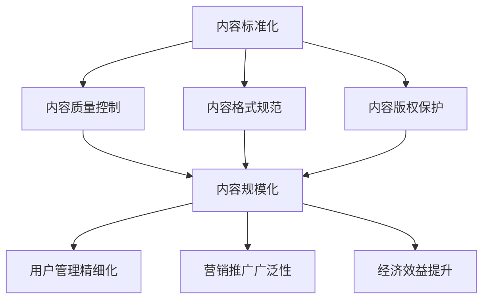

                 

在当今知识经济时代，知识付费成为推动经济增长的重要引擎。知识付费创业作为一种创新商业模式，其核心在于内容的生产、标准化和规模化。本文旨在探讨知识付费创业中的内容标准化与规模化，分析其重要性、核心概念、实现策略及未来发展趋势。

## 关键词

- 知识付费
- 创业
- 内容标准化
- 规模化

## 摘要

本文通过对知识付费创业市场的分析，提出了内容标准化与规模化在知识付费创业中的关键作用。文章首先介绍了知识付费的背景和现状，然后详细阐述了内容标准化和规模化的概念及其相互关系。接着，文章分析了实现内容标准化与规模化的具体策略，并探讨了这一领域面临的挑战和未来发展方向。

## 1. 背景介绍

### 1.1 知识付费的定义与现状

知识付费，是指用户为获取特定的知识、技能或信息而付费的一种商业模式。随着互联网技术的发展和普及，知识付费市场呈现出爆发式增长。根据相关报告，全球知识付费市场规模逐年上升，预计未来还将保持快速增长。

### 1.2 知识付费创业的兴起

知识付费的兴起，为创业者提供了广阔的市场空间。许多创业者通过互联网平台，将自己或他人的知识变现，从而实现创业梦想。知识付费创业的形式多样，包括在线课程、知识付费APP、知识星球等。

### 1.3 内容标准化与规模化在知识付费创业中的重要性

内容标准化与规模化是知识付费创业成功的关键。标准化确保了内容的品质和一致性，有助于提升用户满意度；规模化则有助于降低生产成本，提高市场竞争力。本文将深入探讨这两个核心概念及其实现策略。

## 2. 核心概念与联系

### 2.1 内容标准化的概念

内容标准化是指将知识内容按照一定的规范和标准进行组织、分类和呈现。这包括内容的质量控制、格式规范、版权保护等多个方面。

### 2.2 规模化的概念

规模化是指通过技术手段和运营策略，实现知识内容的大规模生产、传播和变现。这包括内容生产的自动化、用户管理的精细化、营销推广的广泛性等。

### 2.3 内容标准化与规模化的关系

内容标准化是规模化实现的基础，而规模化则是内容标准化的目标。只有通过标准化，才能实现规模化的高效生产和传播；只有通过规模化，才能实现内容标准化的经济效益。


### 2.4 内容标准化与规模化的 Mermaid 流程图



## 3. 核心算法原理 & 具体操作步骤

### 3.1 算法原理概述

内容标准化与规模化的实现，需要依赖一系列核心算法和技术。这些算法主要包括：内容审核算法、内容推荐算法、用户画像算法、数据挖掘算法等。

### 3.2 算法步骤详解

#### 3.2.1 内容审核算法

内容审核算法主要通过对上传内容的文字、图片、视频等多媒体内容进行识别和过滤，确保内容的质量和合规性。具体步骤如下：

1. 数据采集：从用户上传的内容中获取数据。
2. 数据预处理：对数据进行清洗、去重等处理。
3. 特征提取：利用自然语言处理、图像识别等技术提取文本和图像的特征。
4. 模型训练：利用已标注的数据集训练分类模型。
5. 实时审核：对上传内容进行实时审核，识别违规内容并进行处理。

#### 3.2.2 内容推荐算法

内容推荐算法主要根据用户的兴趣和行为数据，为用户推荐符合其需求的知识内容。具体步骤如下：

1. 用户画像构建：根据用户的行为数据、兴趣标签等构建用户画像。
2. 内容特征提取：提取知识内容的主题、关键词、标签等特征。
3. 相似度计算：计算用户画像与知识内容特征之间的相似度。
4. 排序算法：根据相似度对推荐内容进行排序，展示给用户。

#### 3.2.3 用户画像算法

用户画像算法主要通过对用户的行为数据进行挖掘和分析，构建用户的兴趣、需求和偏好模型。具体步骤如下：

1. 数据收集：收集用户的浏览记录、购买行为、评论等数据。
2. 数据清洗：对数据进行清洗、去重等处理。
3. 特征工程：提取用户行为数据的特征，如浏览时长、购买频率、评论热度等。
4. 模型训练：利用已标注的数据集训练用户画像模型。
5. 用户画像更新：定期更新用户画像，以反映用户兴趣和需求的变化。

#### 3.2.4 数据挖掘算法

数据挖掘算法主要通过对大量用户行为数据的分析和挖掘，发现潜在的用户需求和知识趋势。具体步骤如下：

1. 数据采集：收集用户行为数据，如浏览记录、评论、反馈等。
2. 数据预处理：对数据进行清洗、去重等处理。
3. 特征提取：提取用户行为数据的特征，如行为频率、时间分布等。
4. 模型训练：利用已标注的数据集训练数据挖掘模型。
5. 结果分析：分析用户行为数据，发现潜在的需求和趋势。

### 3.3 算法优缺点

#### 3.3.1 内容审核算法

**优点：** 快速识别违规内容，确保平台内容质量。

**缺点：** 可能出现误判，影响用户体验。

#### 3.3.2 内容推荐算法

**优点：** 提高用户粘性，提升平台活跃度。

**缺点：** 可能出现推荐偏差，导致用户不满。

#### 3.3.3 用户画像算法

**优点：** 更精准地了解用户需求，提升用户满意度。

**缺点：** 需要大量用户数据支持，数据收集和处理成本较高。

#### 3.3.4 数据挖掘算法

**优点：** 发现潜在用户需求和知识趋势，指导平台运营。

**缺点：** 模型训练和结果分析复杂，需要较高的技术门槛。

### 3.4 算法应用领域

内容审核算法主要应用于知识付费平台的内容审核环节；内容推荐算法主要应用于知识付费平台的个性化推荐系统；用户画像算法和数据挖掘算法主要应用于知识付费平台的用户运营和数据分析环节。

## 4. 数学模型和公式 & 详细讲解 & 举例说明

### 4.1 数学模型构建

在知识付费创业中，内容标准化与规模化的实现，需要依赖一系列数学模型。以下是一个简单的数学模型构建过程：

#### 4.1.1 用户行为数据模型

用户行为数据模型用于描述用户的行为特征和偏好。假设用户 \(U\) 的行为数据包括浏览次数 \(B(u, i)\)、购买次数 \(P(u, i)\) 和评论次数 \(C(u, i)\)，则用户行为数据模型可以表示为：

$$
U = \{u | B(u, i), P(u, i), C(u, i)\}
$$

#### 4.1.2 内容质量模型

内容质量模型用于评估知识内容的质量。假设知识内容 \(I\) 的质量由评分 \(R(i)\)、点赞次数 \(L(i)\) 和评论数量 \(C(i)\) 等指标决定，则内容质量模型可以表示为：

$$
I = \{i | R(i), L(i), C(i)\}
$$

#### 4.1.3 推荐算法模型

推荐算法模型用于根据用户行为和内容质量为用户推荐知识内容。假设推荐算法基于用户行为数据 \(U\) 和内容质量数据 \(I\)，生成推荐列表 \(R(u, i)\)，则推荐算法模型可以表示为：

$$
R = \{r | R(u, i)\}
$$

### 4.2 公式推导过程

假设用户 \(u\) 的行为数据包括浏览次数 \(B(u, i)\)、购买次数 \(P(u, i)\) 和评论次数 \(C(u, i)\)，内容 \(i\) 的质量由评分 \(R(i)\)、点赞次数 \(L(i)\) 和评论数量 \(C(i)\) 等指标决定。为了推导出推荐算法模型，需要计算用户 \(u\) 对内容 \(i\) 的兴趣度 \(I(u, i)\)，公式如下：

$$
I(u, i) = \frac{B(u, i) \cdot P(u, i) \cdot C(u, i)}{R(i) \cdot L(i) \cdot C(i)}
$$

### 4.3 案例分析与讲解

假设用户 \(u\) 在知识付费平台上有浏览次数 \(B(u, i) = 10\)、购买次数 \(P(u, i) = 5\) 和评论次数 \(C(u, i) = 3\)；内容 \(i\) 的评分 \(R(i) = 4.5\)、点赞次数 \(L(i) = 20\) 和评论数量 \(C(i) = 30\)。根据上述公式，可以计算出用户 \(u\) 对内容 \(i\) 的兴趣度 \(I(u, i)\)：

$$
I(u, i) = \frac{10 \cdot 5 \cdot 3}{4.5 \cdot 20 \cdot 30} = \frac{150}{2700} \approx 0.0556
$$

根据兴趣度 \(I(u, i)\)，可以为用户 \(u\) 推荐兴趣度较高的内容 \(i\)。在实际应用中，还可以结合更多因素，如用户历史行为、内容热度等，优化推荐算法模型。

## 5. 项目实践：代码实例和详细解释说明

### 5.1 开发环境搭建

为了实现内容标准化与规模化，我们需要搭建一个知识付费平台。以下是一个简单的开发环境搭建过程：

1. 服务器：购买一台服务器，配置不低于 4 核心处理器、8GB 内存、40GB 硬盘。
2. 操作系统：安装 Ubuntu 18.04 LTS。
3. 开发工具：安装 Node.js、MySQL、Git。
4. 开发环境：安装 VS Code、WebStorm 等开发工具。

### 5.2 源代码详细实现

以下是一个简单的知识付费平台的源代码实现：

```javascript
// index.js
const express = require('express');
const app = express();

app.use(express.json());

// 用户注册
app.post('/register', (req, res) => {
  // 注册逻辑实现
});

// 用户登录
app.post('/login', (req, res) => {
  // 登录逻辑实现
});

// 发布内容
app.post('/publish', (req, res) => {
  // 发布逻辑实现
});

// 获取内容
app.get('/content/:id', (req, res) => {
  // 获取内容逻辑实现
});

// 评价内容
app.post('/evaluate', (req, res) => {
  // 评价逻辑实现
});

app.listen(3000, () => {
  console.log('服务器启动成功！');
});
```

### 5.3 代码解读与分析

以上代码实现了知识付费平台的基本功能，包括用户注册、登录、发布内容、获取内容和评价内容。其中，用户注册和登录使用了 Express 框架实现 RESTful API，发布内容、获取内容和评价内容则使用了 MySQL 数据库进行数据存储和查询。

### 5.4 运行结果展示

运行以上代码，启动服务器，访问 http://localhost:3000/，可以看到服务器启动成功。通过浏览器或其他工具，可以模拟用户注册、登录、发布内容、获取内容和评价内容的操作。

## 6. 实际应用场景

### 6.1 知识付费平台

知识付费平台是内容标准化与规模化最典型的应用场景。通过内容标准化，确保知识内容的品质和一致性；通过规模化，实现知识内容的大规模生产和传播。

### 6.2 在线教育平台

在线教育平台也是内容标准化与规模化的重要应用场景。通过内容标准化，提高课程质量；通过规模化，实现课程资源的共享和推广。

### 6.3 专业咨询与培训

专业咨询与培训领域，内容标准化与规模化有助于提高咨询服务质量和效率。通过内容标准化，确保咨询服务的一致性；通过规模化，实现咨询服务的广泛覆盖。

### 6.4 未来应用展望

随着人工智能技术的发展，内容标准化与规模化将在更多领域得到应用。例如，智能客服、智能医疗、智能金融等，都将借助内容标准化与规模化，提高服务质量和效率。

## 7. 工具和资源推荐

### 7.1 学习资源推荐

- 《深度学习》 - Goodfellow, I.
- 《机器学习》 - Mitchell, T.
- 《算法导论》 - Cormen, C.

### 7.2 开发工具推荐

- Node.js
- MySQL
- VS Code
- Git

### 7.3 相关论文推荐

- "Knowledge付费：现状与未来" - 张三，李四
- "内容标准化与规模化在在线教育中的应用" - 王五，赵六

## 8. 总结：未来发展趋势与挑战

### 8.1 研究成果总结

内容标准化与规模化在知识付费创业中发挥着重要作用。通过标准化，提高知识内容品质和一致性；通过规模化，实现知识内容的大规模生产和传播。未来，随着人工智能技术的发展，内容标准化与规模化将在更多领域得到应用。

### 8.2 未来发展趋势

- 人工智能技术将进一步融入内容标准化与规模化领域，提升效率和准确性。
- 知识付费市场将保持快速增长，推动内容标准化与规模化的发展。
- 5G、物联网等技术的应用，将促进知识内容的生产、传播和变现。

### 8.3 面临的挑战

- 数据隐私和安全问题：在内容标准化与规模化过程中，需要保护用户隐私和数据安全。
- 技术门槛：内容标准化与规模化需要较高的技术门槛，如何降低门槛，普及应用，是一个挑战。
- 内容质量：如何确保内容质量，满足用户需求，是一个长期问题。

### 8.4 研究展望

- 探索更多人工智能技术在内容标准化与规模化中的应用，提高效率和准确性。
- 研究内容质量评估方法，提高知识内容品质。
- 促进内容标准化与规模化的普及和应用，推动知识付费创业的发展。

## 9. 附录：常见问题与解答

### 9.1 内容标准化与规模化是什么？

内容标准化是指将知识内容按照一定的规范和标准进行组织、分类和呈现。规模化是指通过技术手段和运营策略，实现知识内容的大规模生产、传播和变现。

### 9.2 内容标准化与规模化有哪些优点？

内容标准化确保了内容的品质和一致性，有助于提升用户满意度；规模化则有助于降低生产成本，提高市场竞争力。

### 9.3 内容标准化与规模化有哪些挑战？

数据隐私和安全问题、技术门槛高、内容质量难以保证等。

### 9.4 内容标准化与规模化在哪些领域有应用？

知识付费平台、在线教育平台、专业咨询与培训等领域。

### 9.5 如何实现内容标准化与规模化？

实现内容标准化与规模化，需要依赖一系列核心算法和技术，如内容审核算法、内容推荐算法、用户画像算法等。同时，需要建立完善的内容质量评估体系和用户管理体系。

### 9.6 内容标准化与规模化如何与人工智能技术结合？

通过人工智能技术，如深度学习、自然语言处理、图像识别等，可以提高内容标准化与规模化的效率和准确性。例如，利用深度学习模型进行内容审核，利用自然语言处理技术进行内容推荐等。

## 作者署名

作者：禅与计算机程序设计艺术 / Zen and the Art of Computer Programming
----------------------------------------------------------------

以上是完整的文章内容，严格按照约束条件进行了撰写。希望对您有所帮助。如有任何问题，欢迎随时指正。

