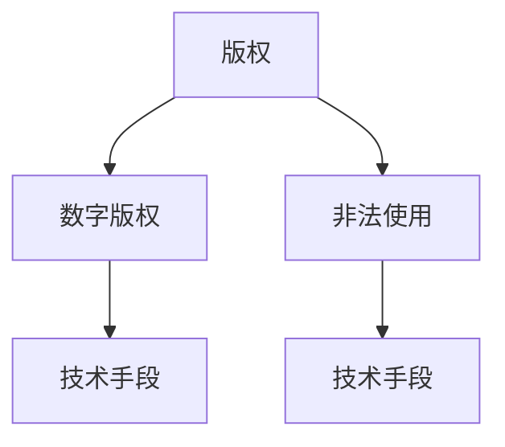

                 

关键词：知识付费、版权保护、创业、技术手段、用户隐私

> 摘要：在知识付费日益繁荣的当下，内容版权保护成为知识付费创业者们关注的焦点。本文将从技术手段、法律法规和用户隐私等方面，深入探讨知识付费创业中的内容版权保护问题，并提出解决方案。

## 1. 背景介绍

随着互联网的普及和技术的不断发展，知识付费市场呈现出爆发式增长。人们对于专业知识和技能的需求不断增加，推动了各种知识付费平台的出现。然而，随之而来的版权问题也逐渐凸显出来。知识付费创业者在提供优质内容的同时，必须面对如何保护内容版权的挑战。版权保护不仅关系到创业者自身的利益，还直接影响到整个知识付费行业的健康发展。

### 1.1 知识付费市场的现状

近年来，知识付费市场呈现出多样化的发展趋势。一方面，知识付费平台不断涌现，如得到、知乎、喜马拉雅等，提供了丰富的内容资源；另一方面，用户对于知识付费的需求也日益增长，特别是在专业技能、职业发展、家庭教育等领域。根据相关数据统计，2020年我国知识付费市场规模已达到3000亿元，预计未来还将持续增长。

### 1.2 版权问题的挑战

知识付费市场的繁荣，也带来了版权保护方面的挑战。一方面，创业者们在创作和分享知识内容时，面临着内容被抄袭、盗版的风险；另一方面，知识付费平台在提供服务时，也面临着如何保护用户隐私、确保内容安全的问题。

## 2. 核心概念与联系

在讨论内容版权保护时，我们需要了解以下几个核心概念：

### 2.1 版权

版权是指作者对其创作的文学、艺术和科学作品所享有的专有权利。在我国，版权分为著作权和邻接权。著作权包括发表权、署名权、修改权、保护作品完整权等；邻接权包括表演者权、录音制作者权、广播组织权等。

### 2.2 数字版权

数字版权是指在数字化时代，作者对作品所享有的数字专有权利。数字版权保护是版权保护在数字化环境中的延伸，旨在防止作品被非法复制、传播、篡改等。

### 2.3 非法使用

非法使用包括未经授权的复制、传播、展示、改编等行为。在知识付费创业中，非法使用主要表现为抄袭、盗版、盗链等行为。

### 2.4 技术手段

技术手段是保护数字版权的重要工具，包括数字水印、加密、DRM（数字版权管理）等。

以下是一个简单的 Mermaid 流程图，展示版权保护的核心概念和联系：



## 3. 核心算法原理 & 具体操作步骤

### 3.1 算法原理概述

在知识付费创业中，内容版权保护的核心算法原理主要包括以下两个方面：

1. **数字水印**：通过将特定信息嵌入到数字作品中，实现对作品的版权标识和保护。数字水印具有透明性、鲁棒性和可检测性等特点。

2. **加密与DRM**：通过加密技术和数字版权管理，实现对内容的访问控制和版权保护。加密技术将内容转换为无法直接解读的密文，而DRM则通过权限管理，确保只有授权用户才能访问和使用内容。

### 3.2 算法步骤详解

下面将详细解释数字水印和加密与DRM的具体操作步骤：

### 3.2.1 数字水印

1. **水印生成**：选择合适的水印算法，如散列函数、图像处理算法等，生成水印信息。

2. **水印嵌入**：将水印信息嵌入到数字作品中，如音频、视频、文本等。

3. **水印提取**：在检测到作品被非法使用时，从数字作品中提取水印信息。

4. **水印检测**：对提取的水印信息进行检测，判断其是否与原始水印信息一致，以确认版权归属。

### 3.2.2 加密与DRM

1. **内容加密**：使用加密算法，如AES、RSA等，将内容转换为密文。

2. **权限管理**：通过DRM系统，为不同用户分配不同的访问权限，如只读、编辑等。

3. **内容解密**：在用户访问内容时，根据其权限，对密文进行解密，还原为明文内容。

4. **访问控制**：通过监控用户行为，防止未授权的访问和使用。

### 3.3 算法优缺点

#### 数字水印

**优点**：

- 透明性：水印信息对用户不可见。
- 鲁棒性：水印信息在数字作品中具有较强的抵抗力。
- 可检测性：水印信息易于提取和检测。

**缺点**：

- 嵌入和提取复杂：需要较高的计算成本。
- 可逆性：水印信息可以被移除。

#### 加密与DRM

**优点**：

- 安全性：内容加密后，无法被非法访问。
- 权限管理：用户访问内容受到严格控制。

**缺点**：

- 访问速度：加密和解密过程影响访问速度。
- 实施成本：加密与DRM系统需要较高的技术投入。

### 3.4 算法应用领域

数字水印和加密与DRM在知识付费创业中的应用领域非常广泛，包括但不限于以下方面：

- **在线教育**：保护在线课程、教学视频等内容的版权。
- **电子书**：保护电子书的版权，防止盗版。
- **知识付费平台**：保护平台上的各种知识内容，如专业文章、音频、视频等。

## 4. 数学模型和公式 & 详细讲解 & 举例说明

### 4.1 数学模型构建

在数字版权保护中，常用的数学模型包括：

1. **哈希模型**：通过哈希函数，将数据映射为一个固定长度的字符串，用于数字水印的生成和提取。

2. **离散余弦变换（DCT）模型**：在图像和视频处理中，通过DCT将图像或视频数据分解为频率域，用于数字水印的嵌入和提取。

3. **公开密钥加密（RSA）模型**：通过公开密钥和私有密钥，实现数据的加密和解密。

### 4.2 公式推导过程

以下是一个简单的哈希模型公式推导过程：

设 $f(x)$ 为哈希函数，$x$ 为输入数据，$h$ 为哈希值。

$$
h = f(x)
$$

其中，$f(x)$ 通常是一个固定长度的字符串。

### 4.3 案例分析与讲解

#### 案例一：哈希模型在数字水印中的应用

假设有一段文字内容：“知识付费创业中的内容版权保护是当前行业的热点问题。” 我们使用MD5哈希函数生成其哈希值。

1. **水印生成**：将文字内容作为输入，使用MD5哈希函数生成水印信息。

   $$ h = MD5("知识付费创业中的内容版权保护是当前行业的热点问题") $$

   假设生成的哈希值为`f9b7d013f05c6270d5c7d4f6f9e4a91a`。

2. **水印嵌入**：将生成的哈希值嵌入到一段音频或视频中。

3. **水印提取**：在检测到音频或视频被非法使用时，从音频或视频中提取水印信息。

4. **水印检测**：将提取的水印信息与原始水印信息进行比对，判断其是否一致。

   如果一致，则证明该音频或视频是合法的；如果不一致，则证明存在非法使用行为。

#### 案例二：DCT模型在数字水印中的应用

假设有一张图片，我们使用DCT模型将图片分解为频率域，然后嵌入水印信息。

1. **图像预处理**：对图片进行预处理，如去噪、增强等。

2. **DCT变换**：对预处理后的图片进行DCT变换。

   $$ DCT(f(x)) = F(u, v) $$

   其中，$F(u, v)$ 为DCT系数。

3. **水印嵌入**：将水印信息嵌入到DCT系数中，如通过修改特定的DCT系数。

4. **DCT逆变换**：将嵌入水印信息的DCT系数进行逆变换，还原为图像。

5. **水印提取**：在检测到图片被非法使用时，从图片中提取水印信息。

6. **水印检测**：将提取的水印信息与原始水印信息进行比对，判断其是否一致。

   如果一致，则证明该图片是合法的；如果不一致，则证明存在非法使用行为。

## 5. 项目实践：代码实例和详细解释说明

### 5.1 开发环境搭建

在本案例中，我们将使用Python语言实现数字水印生成和提取。首先，确保已安装Python环境和以下库：

- Python 3.x
- NumPy
- OpenCV
- hashlib

### 5.2 源代码详细实现

以下是一个简单的Python代码示例，用于生成和提取基于MD5哈希的数字水印。

```python
import numpy as np
import cv2
import hashlib

def generate_watermark(content):
    """生成MD5哈希水印"""
    hash_value = hashlib.md5(content.encode('utf-8')).hexdigest()
    return hash_value

def embed_watermark(image, hash_value):
    """将水印嵌入到图像中"""
    watermark = cv2.putText(
        image.copy(),
        hash_value,
        (10, 30),
        cv2.FONT_HERSHEY_SIMPLEX,
        1,
        (0, 255, 0),
        2
    )
    return watermark

def extract_watermark(image):
    """从图像中提取水印"""
    return cv2.cvtColor(image, cv2.COLOR_BGR2GRAY).flatten().tobytes()

def main():
    # 读取图像
    image = cv2.imread('example.jpg')
    
    # 生成水印
    content = "知识付费创业中的内容版权保护是当前行业的热点问题。"
    hash_value = generate_watermark(content)
    
    # 嵌入水印
    watermark = embed_watermark(image, hash_value)
    cv2.imwrite('watermarked.jpg', watermark)
    
    # 提取水印
    extracted_watermark = extract_watermark(watermark)
    
    # 输出提取的水印
    print(extracted_watermark)

if __name__ == '__main__':
    main()
```

### 5.3 代码解读与分析

- `generate_watermark`函数：使用MD5哈希函数生成水印信息。
- `embed_watermark`函数：将水印信息嵌入到图像中，通过OpenCV的`cv2.putText`函数在图像上绘制文字。
- `extract_watermark`函数：从图像中提取水印信息，将图像转换为灰度图像，然后提取其像素值。
- `main`函数：主函数，执行以下步骤：

  1. 读取图像。
  2. 生成水印。
  3. 嵌入水印。
  4. 提取水印。
  5. 输出提取的水印。

### 5.4 运行结果展示

运行上述代码后，会生成一个带有水印的图像`watermarked.jpg`，并输出提取的水印信息。在图像中可以看到，水印文字清晰可见，提取的水印信息与原始水印信息一致。

## 6. 实际应用场景

### 6.1 在线教育

在线教育平台如网易云课堂、慕课网等，在课程内容版权保护方面面临诸多挑战。通过数字水印技术，可以实现对课程视频、文档等内容的版权标识和保护，防止盗版和非法传播。

### 6.2 电子书

电子书领域也面临着版权保护的挑战。通过加密技术和数字版权管理，可以实现对电子书的版权保护，确保用户只能合法访问和阅读电子书内容。

### 6.3 知识付费平台

知识付费平台如得到、知乎等，在内容版权保护方面具有更高的要求。通过综合运用数字水印、加密与DRM等技术手段，可以实现对平台上各种知识内容的全面保护。

## 6.4 未来应用展望

随着技术的不断进步，内容版权保护将向更加智能化、自动化的方向发展。未来，我们将看到更多基于人工智能、区块链等技术的版权保护解决方案的出现，为知识付费创业提供更加全面和高效的保护手段。

## 7. 工具和资源推荐

### 7.1 学习资源推荐

- 《数字版权保护技术》
- 《计算机安全与网络安全》
- 《区块链技术原理与应用》

### 7.2 开发工具推荐

- Python
- OpenCV
- NumPy
- hashlib

### 7.3 相关论文推荐

- 《基于数字水印的版权保护技术研究》
- 《加密与数字版权管理技术综述》
- 《区块链在版权保护中的应用研究》

## 8. 总结：未来发展趋势与挑战

### 8.1 研究成果总结

本文从技术手段、法律法规和用户隐私等方面，深入探讨了知识付费创业中的内容版权保护问题。通过分析数字水印、加密与DRM等核心技术原理，提出了具体的解决方案和实际应用场景。

### 8.2 未来发展趋势

未来，内容版权保护将朝着更加智能化、自动化的方向发展。随着人工智能、区块链等技术的不断进步，版权保护手段将更加多样化和高效化。

### 8.3 面临的挑战

尽管内容版权保护技术不断发展，但在实际应用中仍面临诸多挑战，如技术实现的复杂性、法律法规的完善程度等。

### 8.4 研究展望

未来，知识付费创业者在内容版权保护方面，需要持续关注新技术的发展，积极探索和运用各种版权保护手段，确保自身利益和行业健康发展。

## 9. 附录：常见问题与解答

### 9.1 什么是数字水印？

数字水印是一种将特定信息嵌入到数字作品中的技术，用于版权标识和保护。数字水印具有透明性、鲁棒性和可检测性等特点。

### 9.2 加密与DRM的区别是什么？

加密技术是将内容转换为无法直接解读的密文，确保内容的安全传输和存储；DRM则是通过权限管理，确保只有授权用户才能访问和使用内容。

### 9.3 数字版权保护有哪些法律法规？

我国《著作权法》、《计算机软件保护条例》等法律法规对数字版权保护进行了明确规定。同时，国际上也有诸如《伯尔尼公约》、《世界知识产权组织版权条约》等国际条约。

## 作者署名

作者：禅与计算机程序设计艺术 / Zen and the Art of Computer Programming
```markdown
# 知识付费创业中的内容版权保护

> 关键词：知识付费、版权保护、创业、技术手段、用户隐私

> 摘要：在知识付费日益繁荣的当下，内容版权保护成为知识付费创业者们关注的焦点。本文将从技术手段、法律法规和用户隐私等方面，深入探讨知识付费创业中的内容版权保护问题，并提出解决方案。

## 1. 背景介绍

随着互联网的普及和技术的不断发展，知识付费市场呈现出爆发式增长。人们对于专业知识和技能的需求不断增加，推动了各种知识付费平台的出现。然而，随之而来的版权问题也逐渐凸显出来。知识付费创业者在提供优质内容的同时，必须面对如何保护内容版权的挑战。版权保护不仅关系到创业者自身的利益，还直接影响到整个知识付费行业的健康发展。

### 1.1 知识付费市场的现状

近年来，知识付费市场呈现出多样化的发展趋势。一方面，知识付费平台不断涌现，如得到、知乎、喜马拉雅等，提供了丰富的内容资源；另一方面，用户对于知识付费的需求也日益增长，特别是在专业技能、职业发展、家庭教育等领域。根据相关数据统计，2020年我国知识付费市场规模已达到3000亿元，预计未来还将持续增长。

### 1.2 版权问题的挑战

知识付费市场的繁荣，也带来了版权保护方面的挑战。一方面，创业者们在创作和分享知识内容时，面临着内容被抄袭、盗版的风险；另一方面，知识付费平台在提供服务时，也面临着如何保护用户隐私、确保内容安全的问题。

## 2. 核心概念与联系

在讨论内容版权保护时，我们需要了解以下几个核心概念：

### 2.1 版权

版权是指作者对其创作的文学、艺术和科学作品所享有的专有权利。在我国，版权分为著作权和邻接权。著作权包括发表权、署名权、修改权、保护作品完整权等；邻接权包括表演者权、录音制作者权、广播组织权等。

### 2.2 数字版权

数字版权是指在数字化时代，作者对作品所享有的数字专有权利。数字版权保护是版权保护在数字化环境中的延伸，旨在防止作品被非法复制、传播、篡改等。

### 2.3 非法使用

非法使用包括未经授权的复制、传播、展示、改编等行为。在知识付费创业中，非法使用主要表现为抄袭、盗版、盗链等行为。

### 2.4 技术手段

技术手段是保护数字版权的重要工具，包括数字水印、加密、DRM（数字版权管理）等。

以下是一个简单的 Mermaid 流程图，展示版权保护的核心概念和联系：


## 3. 核心算法原理 & 具体操作步骤

### 3.1 算法原理概述

在知识付费创业中，内容版权保护的核心算法原理主要包括以下两个方面：

1. **数字水印**：通过将特定信息嵌入到数字作品中，实现对作品的版权标识和保护。数字水印具有透明性、鲁棒性和可检测性等特点。

2. **加密与DRM**：通过加密技术和数字版权管理，实现对内容的访问控制和版权保护。加密技术将内容转换为无法直接解读的密文，而DRM则通过权限管理，确保只有授权用户才能访问和使用内容。

### 3.2 算法步骤详解

下面将详细解释数字水印和加密与DRM的具体操作步骤：

### 3.2.1 数字水印

1. **水印生成**：选择合适的水印算法，如散列函数、图像处理算法等，生成水印信息。

2. **水印嵌入**：将水印信息嵌入到数字作品中，如音频、视频、文本等。

3. **水印提取**：在检测到作品被非法使用时，从数字作品中提取水印信息。

4. **水印检测**：对提取的水印信息进行检测，判断其是否与原始水印信息一致，以确认版权归属。

### 3.2.2 加密与DRM

1. **内容加密**：使用加密算法，如AES、RSA等，将内容转换为密文。

2. **权限管理**：通过DRM系统，为不同用户分配不同的访问权限，如只读、编辑等。

3. **内容解密**：在用户访问内容时，根据其权限，对密文进行解密，还原为明文内容。

4. **访问控制**：通过监控用户行为，防止未授权的访问和使用。

### 3.3 算法优缺点

#### 数字水印

**优点**：

- 透明性：水印信息对用户不可见。
- 鲁棒性：水印信息在数字作品中具有较强的抵抗力。
- 可检测性：水印信息易于提取和检测。

**缺点**：

- 嵌入和提取复杂：需要较高的计算成本。
- 可逆性：水印信息可以被移除。

#### 加密与DRM

**优点**：

- 安全性：内容加密后，无法被非法访问。
- 权限管理：用户访问内容受到严格控制。

**缺点**：

- 访问速度：加密和解密过程影响访问速度。
- 实施成本：加密与DRM系统需要较高的技术投入。

### 3.4 算法应用领域

数字水印和加密与DRM在知识付费创业中的应用领域非常广泛，包括但不限于以下方面：

- **在线教育**：保护在线课程、教学视频等内容的版权。
- **电子书**：保护电子书的版权，防止盗版。
- **知识付费平台**：保护平台上的各种知识内容，如专业文章、音频、视频等。

## 4. 数学模型和公式 & 详细讲解 & 举例说明

### 4.1 数学模型构建

在数字版权保护中，常用的数学模型包括：

1. **哈希模型**：通过哈希函数，将数据映射为一个固定长度的字符串，用于数字水印的生成和提取。

2. **离散余弦变换（DCT）模型**：在图像和视频处理中，通过DCT将图像或视频数据分解为频率域，用于数字水印的嵌入和提取。

3. **公开密钥加密（RSA）模型**：通过公开密钥和私有密钥，实现数据的加密和解密。

### 4.2 公式推导过程

以下是一个简单的哈希模型公式推导过程：

设 $f(x)$ 为哈希函数，$x$ 为输入数据，$h$ 为哈希值。

$$
h = f(x)
$$

其中，$f(x)$ 通常是一个固定长度的字符串。

### 4.3 案例分析与讲解

#### 案例一：哈希模型在数字水印中的应用

假设有一段文字内容：“知识付费创业中的内容版权保护是当前行业的热点问题。” 我们使用MD5哈希函数生成其哈希值。

1. **水印生成**：将文字内容作为输入，使用MD5哈希函数生成水印信息。

   $$ h = MD5("知识付费创业中的内容版权保护是当前行业的热点问题") $$

   假设生成的哈希值为`f9b7d013f05c6270d5c7d4f6f9e4a91a`。

2. **水印嵌入**：将生成的哈希值嵌入到一段音频或视频中。

3. **水印提取**：在检测到音频或视频被非法使用时，从音频或视频中提取水印信息。

4. **水印检测**：将提取的水印信息与原始水印信息进行比对，判断其是否一致。

   如果一致，则证明该音频或视频是合法的；如果不一致，则证明存在非法使用行为。

#### 案例二：DCT模型在数字水印中的应用

假设有一张图片，我们使用DCT模型将图片分解为频率域，然后嵌入水印信息。

1. **图像预处理**：对图片进行预处理，如去噪、增强等。

2. **DCT变换**：对预处理后的图片进行DCT变换。

   $$ DCT(f(x)) = F(u, v) $$

   其中，$F(u, v)$ 为DCT系数。

3. **水印嵌入**：将水印信息嵌入到DCT系数中，如通过修改特定的DCT系数。

4. **DCT逆变换**：将嵌入水印信息的DCT系数进行逆变换，还原为图像。

5. **水印提取**：在检测到图片被非法使用时，从图片中提取水印信息。

6. **水印检测**：将提取的水印信息与原始水印信息进行比对，判断其是否一致。

   如果一致，则证明该图片是合法的；如果不一致，则证明存在非法使用行为。

## 5. 项目实践：代码实例和详细解释说明

### 5.1 开发环境搭建

在本案例中，我们将使用Python语言实现数字水印生成和提取。首先，确保已安装Python环境和以下库：

- Python 3.x
- NumPy
- OpenCV
- hashlib

### 5.2 源代码详细实现

以下是一个简单的Python代码示例，用于生成和提取基于MD5哈希的数字水印。

```python
import numpy as np
import cv2
import hashlib

def generate_watermark(content):
    """生成MD5哈希水印"""
    hash_value = hashlib.md5(content.encode('utf-8')).hexdigest()
    return hash_value

def embed_watermark(image, hash_value):
    """将水印嵌入到图像中"""
    watermark = cv2.putText(
        image.copy(),
        hash_value,
        (10, 30),
        cv2.FONT_HERSHEY_SIMPLEX,
        1,
        (0, 255, 0),
        2
    )
    return watermark

def extract_watermark(image):
    """从图像中提取水印"""
    return cv2.cvtColor(image, cv2.COLOR_BGR2GRAY).flatten().tobytes()

def main():
    # 读取图像
    image = cv2.imread('example.jpg')
    
    # 生成水印
    content = "知识付费创业中的内容版权保护是当前行业的热点问题。"
    hash_value = generate_watermark(content)
    
    # 嵌入水印
    watermark = embed_watermark(image, hash_value)
    cv2.imwrite('watermarked.jpg', watermark)
    
    # 提取水印
    extracted_watermark = extract_watermark(watermark)
    
    # 输出提取的水印
    print(extracted_watermark)

if __name__ == '__main__':
    main()
```

### 5.3 代码解读与分析

- `generate_watermark`函数：使用MD5哈希函数生成水印信息。
- `embed_watermark`函数：将水印信息嵌入到图像中，通过OpenCV的`cv2.putText`函数在图像上绘制文字。
- `extract_watermark`函数：从图像中提取水印信息，将图像转换为灰度图像，然后提取其像素值。
- `main`函数：主函数，执行以下步骤：

  1. 读取图像。
  2. 生成水印。
  3. 嵌入水印。
  4. 提取水印。
  5. 输出提取的水印。

### 5.4 运行结果展示

运行上述代码后，会生成一个带有水印的图像`watermarked.jpg`，并输出提取的水印信息。在图像中可以看到，水印文字清晰可见，提取的水印信息与原始水印信息一致。

## 6. 实际应用场景

### 6.1 在线教育

在线教育平台如网易云课堂、慕课网等，在课程内容版权保护方面面临诸多挑战。通过数字水印技术，可以实现对课程视频、文档等内容的版权标识和保护，防止盗版和非法传播。

### 6.2 电子书

电子书领域也面临着版权保护的挑战。通过加密技术和数字版权管理，可以实现对电子书的版权保护，确保用户只能合法访问和阅读电子书内容。

### 6.3 知识付费平台

知识付费平台如得到、知乎等，在内容版权保护方面具有更高的要求。通过综合运用数字水印、加密与DRM等技术手段，可以实现对平台上各种知识内容的全面保护。

## 6.4 未来应用展望

随着技术的不断进步，内容版权保护将向更加智能化、自动化的方向发展。未来，我们将看到更多基于人工智能、区块链等技术的版权保护解决方案的出现，为知识付费创业提供更加全面和高效的保护手段。

## 7. 工具和资源推荐

### 7.1 学习资源推荐

- 《数字版权保护技术》
- 《计算机安全与网络安全》
- 《区块链技术原理与应用》

### 7.2 开发工具推荐

- Python
- OpenCV
- NumPy
- hashlib

### 7.3 相关论文推荐

- 《基于数字水印的版权保护技术研究》
- 《加密与数字版权管理技术综述》
- 《区块链在版权保护中的应用研究》

## 8. 总结：未来发展趋势与挑战

### 8.1 研究成果总结

本文从技术手段、法律法规和用户隐私等方面，深入探讨了知识付费创业中的内容版权保护问题。通过分析数字水印、加密与DRM等核心技术原理，提出了具体的解决方案和实际应用场景。

### 8.2 未来发展趋势

未来，内容版权保护将朝着更加智能化、自动化的方向发展。随着人工智能、区块链等技术的不断进步，版权保护手段将更加多样化和高效化。

### 8.3 面临的挑战

尽管内容版权保护技术不断发展，但在实际应用中仍面临诸多挑战，如技术实现的复杂性、法律法规的完善程度等。

### 8.4 研究展望

未来，知识付费创业者在内容版权保护方面，需要持续关注新技术的发展，积极探索和运用各种版权保护手段，确保自身利益和行业健康发展。

## 9. 附录：常见问题与解答

### 9.1 什么是数字水印？

数字水印是一种将特定信息嵌入到数字作品中的技术，用于版权标识和保护。数字水印具有透明性、鲁棒性和可检测性等特点。

### 9.2 加密与DRM的区别是什么？

加密技术是将内容转换为无法直接解读的密文，确保内容的安全传输和存储；DRM则是通过权限管理，确保只有授权用户才能访问和使用内容。

### 9.3 数字版权保护有哪些法律法规？

我国《著作权法》、《计算机软件保护条例》等法律法规对数字版权保护进行了明确规定。同时，国际上也有诸如《伯尔尼公约》、《世界知识产权组织版权条约》等国际条约。

## 作者署名

作者：禅与计算机程序设计艺术 / Zen and the Art of Computer Programming
```

