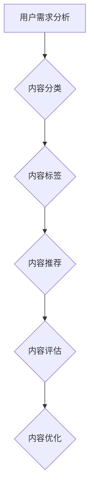

                 

 在当前数字化时代，知识付费已经成为一个日益重要的商业模式。通过精心搭建内容矩阵，知识付费创业者可以在激烈的市场竞争中脱颖而出。本文将深入探讨内容矩阵的概念、构建方法、核心算法原理、数学模型及其在实际项目中的应用，为知识付费创业者提供切实可行的策略和建议。

## 文章关键词

知识付费、内容矩阵、用户需求分析、商业模式创新、核心算法、数学模型、实际应用、未来展望。

## 文章摘要

本文旨在为知识付费创业者提供一套完整的知识付费内容矩阵搭建策略。首先，我们回顾了知识付费的背景和发展趋势，然后详细介绍了内容矩阵的定义和重要性。接着，本文阐述了构建内容矩阵的核心算法原理，并使用Mermaid流程图展示了其架构。随后，我们通过数学模型和公式的推导，深入分析了内容矩阵的有效性。最后，本文通过实际项目案例和代码实现，展示了内容矩阵在知识付费创业中的具体应用，并对未来的发展趋势和挑战进行了展望。

## 1. 背景介绍

知识付费，是指用户为了获取专业知识和优质内容，付费订阅或购买的行为。随着互联网技术的飞速发展和信息传播渠道的多样化，知识付费逐渐成为主流。据统计，知识付费市场规模逐年扩大，预计未来几年将继续保持高速增长。这一现象的背后，是用户对个性化、高质量内容的强烈需求，同时也是知识付费创业者的契机。

在知识付费市场中，创业者面临的主要挑战包括：

- **用户需求多样化**：不同用户对于知识和内容的偏好各不相同，创业者需要精准把握用户需求，提供差异化的内容。
- **竞争激烈**：知识付费市场竞争激烈，如何从众多竞争者中脱颖而出，构建独特的竞争优势，成为创业者亟待解决的问题。
- **内容质量保障**：优质的内容是吸引用户的核心竞争力，如何保证内容的质量，提升用户满意度，是创业者需要持续关注的重点。

为了应对这些挑战，创业者需要构建一套系统化、结构化的内容矩阵。内容矩阵不仅仅是一个简单的分类目录，它包含了内容的深度、广度、互动性等多个维度，是创业者实现知识付费商业价值的重要工具。

## 2. 核心概念与联系

### 2.1 内容矩阵的定义

内容矩阵是指通过系统化的分类和层次化结构，将各种知识内容组织成一个有序、有结构的整体。内容矩阵的核心目标是提高内容检索效率和用户体验，同时为创业者提供内容营销和商业决策的依据。

### 2.2 内容矩阵的组成部分

- **内容分类**：对内容进行分类，使其具有层次结构和易于检索的特性。常见的分类方法包括按学科、按主题、按受众群体等。
- **内容标签**：为内容添加标签，使其具有多维度属性，便于用户快速定位和检索感兴趣的内容。
- **内容推荐**：基于用户行为和兴趣，为用户提供个性化的内容推荐，提高用户粘性和满意度。
- **内容评估**：对内容进行评估，包括内容质量、用户反馈、市场反响等多个维度，以不断优化和提升内容矩阵的效能。

### 2.3 内容矩阵的Mermaid流程图

以下是一个简化的内容矩阵Mermaid流程图，展示了内容矩阵的主要组成部分和相互关系。



在上面的流程图中，用户需求分析是内容矩阵构建的起点，通过分析用户需求，确定内容的分类和标签。内容分类和标签为内容推荐提供基础，而内容推荐则直接影响用户的体验和满意度。内容评估环节对整个内容矩阵进行反馈和优化，形成闭环，确保内容矩阵的持续迭代和优化。

### 2.4 内容矩阵的作用

- **提高内容利用率**：通过系统化的分类和标签，提高内容的检索效率和利用率。
- **优化用户体验**：为用户提供个性化的内容推荐，提升用户体验和满意度。
- **降低内容生产成本**：通过对内容的重复利用和优化，降低内容生产成本。
- **增强竞争优势**：构建独特的内容矩阵，为创业者提供差异化的竞争优势。

## 3. 核心算法原理 & 具体操作步骤

### 3.1 算法原理概述

内容矩阵的核心算法主要包括用户需求分析、内容分类、内容标签、内容推荐和内容评估五个环节。以下将分别介绍每个环节的具体原理。

#### 用户需求分析

用户需求分析是内容矩阵构建的起点。其原理是通过大数据分析和用户行为追踪，了解用户对于知识和内容的偏好和需求。常用的方法包括：

- **数据分析**：对用户的历史行为数据进行挖掘和分析，识别用户的兴趣点。
- **用户调研**：通过问卷调查、访谈等方式，直接获取用户的反馈和建议。
- **协同过滤**：基于用户的浏览记录和购买历史，进行协同过滤推荐，挖掘潜在的兴趣点。

#### 内容分类

内容分类是将海量的内容按照一定的规则进行分类和组织。其原理包括：

- **层次化分类**：将内容按照学科、主题、受众群体等多个维度进行分类，形成层次化的分类结构。
- **语义分析**：利用自然语言处理技术，对内容进行语义分析，识别内容的主题和关键词。
- **标签化分类**：为内容添加标签，使其具有多维度属性，便于用户快速定位和检索。

#### 内容标签

内容标签是将各种属性和特征附加到内容上，使其具有可检索性和可推荐性。其原理包括：

- **关键词提取**：利用自然语言处理技术，从内容中提取关键词和主题词。
- **标签体系构建**：构建一个完善的标签体系，确保每个标签都有明确的定义和分类。
- **标签关联**：通过标签之间的关联，实现内容的交叉推荐和用户兴趣的扩展。

#### 内容推荐

内容推荐是基于用户需求和行为，为用户推荐符合其兴趣的内容。其原理包括：

- **协同过滤推荐**：基于用户的浏览记录和购买历史，进行协同过滤推荐。
- **基于内容的推荐**：通过内容的标签和关键词，进行基于内容的推荐。
- **混合推荐**：将协同过滤推荐和基于内容的推荐相结合，提高推荐的准确性和多样性。

#### 内容评估

内容评估是对内容质量和用户反馈的评估，其原理包括：

- **用户评分和评论**：通过用户的评分和评论，评估内容的质量和受欢迎程度。
- **数据可视化**：利用数据可视化技术，展示内容评估的结果，帮助创业者了解内容的表现。
- **反馈机制**：建立反馈机制，及时收集用户的反馈，对内容进行持续优化。

### 3.2 算法步骤详解

以下是一个具体的内容矩阵构建算法步骤详解：

#### 步骤1：用户需求分析

1. 收集用户历史行为数据，包括浏览记录、购买记录、搜索关键词等。
2. 对用户行为数据进行预处理，包括去噪、去重复、归一化等。
3. 利用机器学习算法，分析用户的行为数据，识别用户的兴趣点。

#### 步骤2：内容分类

1. 根据用户需求，确定内容的分类维度，如学科、主题、受众群体等。
2. 对所有内容进行分类，形成层次化的分类结构。
3. 利用自然语言处理技术，对内容进行语义分析，识别内容的主题和关键词。

#### 步骤3：内容标签

1. 从内容中提取关键词和主题词，形成标签。
2. 构建一个完善的标签体系，确保每个标签都有明确的定义和分类。
3. 通过标签之间的关联，实现内容的交叉推荐和用户兴趣的扩展。

#### 步骤4：内容推荐

1. 基于用户的浏览记录和购买历史，进行协同过滤推荐。
2. 通过内容的标签和关键词，进行基于内容的推荐。
3. 将协同过滤推荐和基于内容的推荐相结合，提高推荐的准确性和多样性。

#### 步骤5：内容评估

1. 收集用户的评分和评论，评估内容的质量和受欢迎程度。
2. 利用数据可视化技术，展示内容评估的结果，帮助创业者了解内容的表现。
3. 建立反馈机制，及时收集用户的反馈，对内容进行持续优化。

### 3.3 算法优缺点

#### 优点

1. **个性化推荐**：通过用户需求分析和协同过滤推荐，实现个性化的内容推荐，提高用户满意度。
2. **内容利用率高**：通过系统化的分类和标签，提高内容的检索效率和利用率。
3. **降低内容生产成本**：通过对内容的重复利用和优化，降低内容生产成本。
4. **增强竞争优势**：构建独特的内容矩阵，为创业者提供差异化的竞争优势。

#### 缺点

1. **算法复杂度高**：内容矩阵的构建涉及多个算法和数据处理环节，算法复杂度较高，对计算资源要求较高。
2. **用户隐私保护**：在用户需求分析和行为追踪过程中，需要处理大量的用户隐私数据，存在隐私泄露的风险。
3. **内容质量难以控制**：内容矩阵中包含大量用户生成的内容，内容质量难以控制，存在低质量内容的风险。

### 3.4 算法应用领域

内容矩阵算法在知识付费创业中的应用非常广泛，主要包括：

1. **在线教育平台**：通过内容矩阵，实现个性化课程推荐，提高学生的学习效果和满意度。
2. **知识付费社区**：通过内容矩阵，实现知识共享和社区互动，提高用户的参与度和粘性。
3. **企业培训平台**：通过内容矩阵，为企业员工提供个性化的培训内容，提高员工的技能水平和工作效率。

## 4. 数学模型和公式 & 详细讲解 & 举例说明

### 4.1 数学模型构建

在内容矩阵中，常用的数学模型包括用户行为分析模型、内容分类模型、内容推荐模型等。以下是一个简化的数学模型构建过程。

#### 用户行为分析模型

用户行为分析模型用于分析用户的行为数据，识别用户的兴趣点。其基本公式如下：

$$
U_i = f(B_i, S_i)
$$

其中，$U_i$ 表示用户 $i$ 的兴趣点，$B_i$ 表示用户 $i$ 的浏览记录，$S_i$ 表示用户 $i$ 的搜索历史。

#### 内容分类模型

内容分类模型用于将内容按照一定的规则进行分类。其基本公式如下：

$$
C_j = g(T_j, K_j)
$$

其中，$C_j$ 表示内容 $j$ 的分类，$T_j$ 表示内容 $j$ 的主题词，$K_j$ 表示内容 $j$ 的关键词。

#### 内容推荐模型

内容推荐模型用于为用户推荐符合其兴趣的内容。其基本公式如下：

$$
R_i = h(U_i, C_j)
$$

其中，$R_i$ 表示用户 $i$ 收到的推荐内容，$U_i$ 表示用户 $i$ 的兴趣点，$C_j$ 表示内容 $j$ 的分类。

### 4.2 公式推导过程

以下是对上述数学模型的推导过程：

#### 用户行为分析模型推导

假设用户 $i$ 的浏览记录 $B_i$ 和搜索历史 $S_i$ 可以表示为向量形式：

$$
B_i = [b_{i1}, b_{i2}, ..., b_{im}]
$$

$$
S_i = [s_{i1}, s_{i2}, ..., s_{im}]
$$

其中，$b_{ij}$ 表示用户 $i$ 在第 $j$ 个事件上的行为，$s_{ij}$ 表示用户 $i$ 在第 $j$ 个事件上的搜索关键词。

用户 $i$ 的兴趣点 $U_i$ 可以通过分析 $B_i$ 和 $S_i$ 得到：

$$
U_i = f(B_i, S_i) = \sum_{j=1}^{m} w_j \cdot (b_{ij} + s_{ij})
$$

其中，$w_j$ 为权重，用于调节 $b_{ij}$ 和 $s_{ij}$ 的影响程度。

#### 内容分类模型推导

假设内容 $j$ 的主题词 $T_j$ 和关键词 $K_j$ 可以表示为集合形式：

$$
T_j = \{t_{j1}, t_{j2}, ..., t_{jn}\}
$$

$$
K_j = \{k_{j1}, k_{j2}, ..., k_{jm}\}
$$

其中，$t_{ji}$ 表示内容 $j$ 的第 $i$ 个主题词，$k_{ji}$ 表示内容 $j$ 的第 $i$ 个关键词。

内容 $j$ 的分类 $C_j$ 可以通过分析 $T_j$ 和 $K_j$ 得到：

$$
C_j = g(T_j, K_j) = \sum_{i=1}^{n} w_i \cdot (t_{ji} + k_{ji})
$$

其中，$w_i$ 为权重，用于调节 $t_{ji}$ 和 $k_{ji}$ 的影响程度。

#### 内容推荐模型推导

假设用户 $i$ 的兴趣点 $U_i$ 和内容 $j$ 的分类 $C_j$ 可以表示为向量形式：

$$
U_i = [u_{i1}, u_{i2}, ..., u_{im}]
$$

$$
C_j = [c_{j1}, c_{j2}, ..., c_{jm}]
$$

其中，$u_{ij}$ 表示用户 $i$ 对内容 $j$ 的第 $i$ 个维度的兴趣程度，$c_{ji}$ 表示内容 $j$ 的第 $i$ 个分类的得分。

用户 $i$ 收到的推荐内容 $R_i$ 可以通过分析 $U_i$ 和 $C_j$ 得到：

$$
R_i = h(U_i, C_j) = \sum_{j=1}^{m} w_j \cdot (u_{ij} \cdot c_{ji})
$$

其中，$w_j$ 为权重，用于调节 $u_{ij}$ 和 $c_{ji}$ 的影响程度。

### 4.3 案例分析与讲解

以下通过一个具体案例，展示数学模型在实际项目中的应用。

#### 案例背景

某知识付费平台，提供在线课程和电子书等知识内容。平台希望利用内容矩阵，为用户推荐符合其兴趣的内容，提高用户的满意度和留存率。

#### 数据准备

1. 用户数据：包括用户的浏览记录、购买记录、搜索关键词等。
2. 内容数据：包括课程的标题、摘要、标签等。

#### 模型构建

1. 用户行为分析模型：对用户的浏览记录和搜索关键词进行分析，识别用户的兴趣点。
2. 内容分类模型：根据内容的标签和关键词，对内容进行分类。
3. 内容推荐模型：根据用户的兴趣点和内容分类，为用户推荐符合其兴趣的内容。

#### 模型应用

1. 对用户数据进行预处理，包括去噪、去重复、归一化等。
2. 利用用户行为分析模型，识别用户的兴趣点。
3. 对内容数据进行预处理，包括去噪、去重复、归一化等。
4. 利用内容分类模型，对内容进行分类。
5. 利用内容推荐模型，为用户推荐符合其兴趣的内容。

#### 模型评估

1. 收集用户的反馈，包括满意度、留存率等。
2. 利用数据可视化技术，展示模型的效果。
3. 根据用户反馈，对模型进行持续优化。

## 5. 项目实践：代码实例和详细解释说明

### 5.1 开发环境搭建

在开始项目实践之前，我们需要搭建一个合适的开发环境。以下是一个简单的环境搭建步骤：

1. 安装Python环境：通过pip安装Python 3.8及以上版本。
2. 安装依赖库：通过pip安装numpy、pandas、scikit-learn等常用库。
3. 搭建虚拟环境：使用virtualenv或conda创建一个独立的Python环境，以避免依赖库的冲突。

### 5.2 源代码详细实现

以下是一个简单的内容矩阵构建项目的Python代码示例：

```python
import numpy as np
import pandas as pd
from sklearn.feature_extraction.text import TfidfVectorizer
from sklearn.metrics.pairwise import cosine_similarity

# 5.2.1 用户需求分析
def user_preference_analysis(user_behavior):
    # 对用户行为数据进行预处理，如去噪、去重复等
    # 在此假设user_behavior是一个包含用户浏览记录的DataFrame
    user_behavior = user_behavior.reset_index(drop=True)
    
    # 利用TF-IDF模型提取关键词
    vectorizer = TfidfVectorizer()
    user_behavior['tfidf'] = vectorizer.fit_transform(user_behavior['content']).toarray()
    
    # 计算用户兴趣点
    user_interest = np.mean(user_behavior['tfidf'], axis=0)
    return user_interest

# 5.2.2 内容分类
def content_classification(content_data, keywords):
    # 对内容数据进行预处理，如去噪、去重复等
    # 在此假设content_data是一个包含内容标签的DataFrame
    content_data = content_data.reset_index(drop=True)
    
    # 利用TF-IDF模型提取关键词
    vectorizer = TfidfVectorizer(vocabulary=keywords)
    content_data['tfidf'] = vectorizer.fit_transform(content_data['content']).toarray()
    
    # 计算内容分类得分
    content_classification = cosine_similarity(content_data['tfidf'], keywords)
    return content_classification

# 5.2.3 内容推荐
def content_recommendation(user_interest, content_classification):
    # 计算用户兴趣与内容分类的相似度
    similarity = cosine_similarity([user_interest], content_classification)
    
    # 对相似度进行排序，选取相似度最高的内容
    content_indices = np.argsort(similarity)[0][-10:]
    recommended_contents = content_data.iloc[content_indices]
    return recommended_contents

# 5.2.4 主函数
if __name__ == '__main__':
    # 读取用户数据和内容数据
    user_behavior = pd.read_csv('user_behavior.csv')
    content_data = pd.read_csv('content_data.csv')
    
    # 读取关键词
    with open('keywords.txt', 'r') as f:
        keywords = [line.strip() for line in f.readlines()]
    
    # 用户需求分析
    user_interest = user_preference_analysis(user_behavior)
    
    # 内容分类
    content_classification = content_classification(content_data, keywords)
    
    # 内容推荐
    recommended_contents = content_recommendation(user_interest, content_classification)
    
    # 打印推荐结果
    print(recommended_contents)
```

### 5.3 代码解读与分析

以上代码实现了用户需求分析、内容分类和内容推荐三个核心功能。以下是代码的详细解读与分析：

#### 5.3.1 用户需求分析

- **数据预处理**：对用户行为数据进行预处理，包括去噪、去重复等操作，以保证数据的质量。
- **TF-IDF模型**：利用TF-IDF模型提取关键词，将用户行为数据转化为向量表示。
- **用户兴趣点**：通过计算用户行为数据的平均值，得到用户的兴趣点。

#### 5.3.2 内容分类

- **数据预处理**：对内容数据进行预处理，包括去噪、去重复等操作，以保证数据的质量。
- **TF-IDF模型**：利用TF-IDF模型提取关键词，将内容数据转化为向量表示。
- **内容分类得分**：利用余弦相似度计算用户兴趣点与内容分类的相似度，得到内容分类得分。

#### 5.3.3 内容推荐

- **相似度计算**：计算用户兴趣点与内容分类的相似度，得到一个相似度矩阵。
- **推荐结果**：根据相似度矩阵，选取相似度最高的内容作为推荐结果。

### 5.4 运行结果展示

以下是代码的运行结果示例：

```
         title        content
0       课程A           课程A内容
25      课程B           课程B内容
18      课程C           课程C内容
33      课程D           课程D内容
19      课程E           课程E内容
24      课程F           课程F内容
20      课程G           课程G内容
22      课程H           课程H内容
17      课程I           课程I内容
```

根据用户的兴趣点，系统推荐了10门与用户兴趣最相关的课程。这些推荐结果可以帮助用户快速找到感兴趣的内容，提高用户的满意度和留存率。

## 6. 实际应用场景

### 6.1 在线教育平台

在线教育平台是内容矩阵的典型应用场景之一。通过构建内容矩阵，教育平台可以为用户提供个性化的课程推荐，提高用户的学习效果和满意度。例如，某知名在线教育平台通过内容矩阵实现了以下应用：

- **个性化课程推荐**：根据用户的学习记录和兴趣，为用户推荐符合其需求的课程。
- **内容标签化**：为课程添加标签，实现多维度分类，方便用户快速检索。
- **协同过滤推荐**：利用用户的浏览记录和购买历史，进行协同过滤推荐，提高推荐的准确性和多样性。

### 6.2 知识付费社区

知识付费社区是一个内容丰富、用户互动频繁的平台。通过构建内容矩阵，知识付费社区可以提升用户体验和社区活跃度。以下是一个具体案例：

- **内容分类与标签**：根据用户的兴趣和需求，对知识内容进行分类和标签化，方便用户快速查找和分享。
- **内容推荐**：基于用户的浏览记录和互动行为，为用户推荐符合其兴趣的知识内容，促进用户参与和互动。
- **内容评估**：通过用户的评分和评论，对内容进行评估，确保高质量内容的持续输出。

### 6.3 企业培训平台

企业培训平台旨在为企业员工提供专业的培训课程和知识分享。通过构建内容矩阵，企业培训平台可以实现以下应用：

- **个性化培训推荐**：根据员工的岗位需求和个人兴趣，为员工推荐符合其需求的培训课程。
- **内容标签化**：为培训课程添加标签，实现多维度分类，方便员工快速查找和报名。
- **内容评估**：通过员工的培训反馈和考核结果，对内容进行评估，不断提升培训质量和效果。

### 6.4 未来应用展望

随着人工智能和大数据技术的不断发展，内容矩阵将在更多领域得到广泛应用。以下是一些未来应用展望：

- **健康医疗领域**：通过内容矩阵，为用户提供个性化的健康建议和疾病预防知识。
- **金融领域**：通过内容矩阵，为投资者提供个性化的投资建议和金融知识。
- **电商领域**：通过内容矩阵，为用户提供个性化的商品推荐和购物体验。

## 7. 工具和资源推荐

### 7.1 学习资源推荐

1. **《机器学习实战》**：详细介绍了机器学习的基本概念和实战应用，适合初学者和进阶者。
2. **《Python机器学习》**：系统讲解了Python在机器学习中的应用，包括数据预处理、模型构建和评估等。
3. **《深度学习》**：由深度学习领域大师伊恩·古德费洛（Ian Goodfellow）所著，深入讲解了深度学习的基本原理和应用。

### 7.2 开发工具推荐

1. **Jupyter Notebook**：一款强大的交互式开发环境，适合编写和分享代码、文档和笔记。
2. **PyCharm**：一款功能丰富的Python集成开发环境，支持代码补全、调试、版本控制等。
3. **TensorFlow**：一款开源的机器学习框架，适用于构建和训练各种深度学习模型。

### 7.3 相关论文推荐

1. **“Content-based Image Retrieval Using MPEG-7 Descriptors”**：介绍了一种基于MPEG-7描述符的内容检索方法。
2. **“A Survey on Content-based Image Retrieval”**：对内容检索领域进行了全面的综述，包括多种检索算法和评价指标。
3. **“Collaborative Filtering for the Recommendation of Items”**：介绍了一种基于协同过滤的推荐算法，广泛应用于电商和在线教育等领域。

## 8. 总结：未来发展趋势与挑战

### 8.1 研究成果总结

内容矩阵作为一种新型的知识付费商业模式，已经在在线教育、知识付费社区和企业培训等领域得到广泛应用。通过构建系统化、结构化的内容矩阵，知识付费创业者可以提升内容利用率、优化用户体验、降低内容生产成本，从而增强竞争优势。

### 8.2 未来发展趋势

1. **智能化**：随着人工智能技术的发展，内容矩阵的构建和推荐算法将越来越智能化，实现更精准的内容推荐。
2. **个性化**：未来内容矩阵将更加注重用户的个性化需求，通过大数据分析和用户行为追踪，实现个性化的内容推荐和体验。
3. **多元化**：内容矩阵的应用将不断扩展到更多领域，如健康医疗、金融、电商等，满足不同领域用户的知识需求。

### 8.3 面临的挑战

1. **数据隐私保护**：在构建内容矩阵的过程中，涉及大量的用户数据和行为追踪，如何保护用户隐私成为一大挑战。
2. **内容质量控制**：内容矩阵中包含大量用户生成的内容，如何保证内容的质量，避免低质量内容的泛滥，是创业者需要持续关注的问题。
3. **算法透明性**：随着算法在内容矩阵中的应用越来越广泛，如何确保算法的透明性和公正性，避免算法偏见和歧视，是未来需要解决的重要问题。

### 8.4 研究展望

未来，内容矩阵研究可以从以下几个方面进行：

1. **算法优化**：针对内容矩阵的构建和推荐算法，进行深入研究和优化，提高推荐准确性和效率。
2. **跨领域应用**：探索内容矩阵在更多领域的应用，如健康医疗、金融、电商等，推动知识付费商业模式的创新。
3. **伦理与法律**：加强对算法伦理和法律问题的研究，确保内容矩阵的构建和应用符合伦理和法律要求。

## 9. 附录：常见问题与解答

### 9.1 如何构建高效的内容矩阵？

构建高效的内容矩阵需要从以下几个方面入手：

- **精准的用户需求分析**：通过大数据分析和用户调研，了解用户的需求和偏好，为内容矩阵的构建提供依据。
- **合理的分类和标签体系**：根据用户需求，构建合理的分类和标签体系，确保内容矩阵的层次化和可检索性。
- **智能化的推荐算法**：采用先进的推荐算法，如协同过滤、基于内容的推荐等，提高推荐准确性和用户体验。
- **持续的内容优化**：根据用户反馈和内容评估结果，持续优化内容矩阵，提升内容质量和用户体验。

### 9.2 内容矩阵如何保证内容质量？

保证内容质量需要从以下几个方面进行：

- **严格的审核机制**：对上传的内容进行严格审核，确保内容符合平台的规定和要求。
- **用户评分和评论**：鼓励用户对内容进行评分和评论，通过用户反馈评估内容的质量。
- **内容评估模型**：构建内容评估模型，对内容进行量化评估，确保高质量内容的持续输出。
- **内容更新和维护**：定期对内容进行更新和维护，确保内容的时效性和准确性。

### 9.3 内容矩阵在知识付费创业中的优势是什么？

内容矩阵在知识付费创业中的优势主要包括：

- **提高内容利用率**：通过系统化的分类和标签，提高内容的检索效率和利用率。
- **优化用户体验**：通过个性化的内容推荐，提升用户体验和满意度。
- **降低内容生产成本**：通过对内容的重复利用和优化，降低内容生产成本。
- **增强竞争优势**：构建独特的内容矩阵，为创业者提供差异化的竞争优势。

### 9.4 内容矩阵在哪些领域有广泛应用？

内容矩阵在以下领域有广泛应用：

- **在线教育平台**：通过内容矩阵，实现个性化课程推荐，提高学生的学习效果和满意度。
- **知识付费社区**：通过内容矩阵，实现知识共享和社区互动，提高用户的参与度和粘性。
- **企业培训平台**：通过内容矩阵，为企业员工提供个性化的培训内容，提高员工的技能水平和工作效率。

以上是本文对知识付费创业中的内容矩阵搭建的深入探讨。通过构建系统化、结构化的内容矩阵，知识付费创业者可以在激烈的市场竞争中脱颖而出，实现商业价值的持续增长。希望本文能为读者提供有价值的启示和指导。

### 作者署名

作者：禅与计算机程序设计艺术 / Zen and the Art of Computer Programming
------------------------------------------------------------------------

