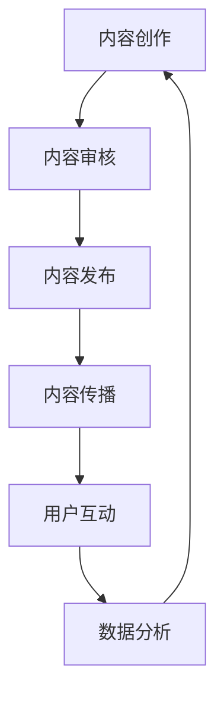

                 

关键词：知识付费、内容营销、创业策略、用户体验、数据分析、转化率

摘要：本文将探讨知识付费创业领域中的内容营销策略。通过分析核心概念、算法原理、数学模型、项目实践以及未来应用展望，旨在为创业者提供一套系统、有效的营销方案，提高用户参与度和转化率。

## 1. 背景介绍

知识付费作为一种新兴的商业模式，近年来在全球范围内迅速崛起。随着互联网的普及和用户需求的多样化，人们开始愿意为优质内容和服务支付费用。知识付费平台如知乎Live、得到、分答等相继涌现，为创业者提供了广阔的市场空间。然而，如何在激烈的市场竞争中脱颖而出，成为创业者面临的重要课题。

内容营销作为知识付费领域的重要手段，通过创造和分享有价值的内容，吸引目标用户，提升品牌知名度，进而实现商业转化。本文将从内容营销的角度，深入探讨知识付费创业中的策略和方法，帮助创业者抓住市场机遇。

### 1.1 知识付费市场现状

知识付费市场呈现出以下特点：

- **用户需求多样化**：用户对知识的需求越来越细化，涉及职场技能、兴趣爱好、教育学习等多个领域。

- **平台竞争激烈**：各大知识付费平台纷纷推出优惠活动、合伙人计划等，争夺用户资源。

- **内容质量要求高**：用户越来越注重内容的价值和质量，对课程的专业性、实用性有更高要求。

### 1.2 内容营销的重要性

内容营销在知识付费创业中具有重要作用：

- **吸引用户关注**：通过有价值的内容吸引潜在用户，提高品牌曝光度。

- **增强用户粘性**：优质的内容可以提升用户的满意度和忠诚度，促使用户持续消费。

- **提升转化率**：通过内容引导用户完成购买行为，实现商业价值。

## 2. 核心概念与联系

### 2.1 内容营销定义

内容营销是一种通过创造和分享有价值的内容，吸引和留住目标用户，从而实现商业目标的市场营销手段。其核心要素包括内容创作、内容传播、用户互动和数据分析。

### 2.2 内容营销与知识付费的关系

内容营销与知识付费密切相关，两者共同构成一个完整的商业闭环。内容营销通过提供有价值的内容，吸引用户关注，进而引导用户购买付费知识产品。

### 2.3 内容营销的 Mermaid 流程图



## 3. 核心算法原理 & 具体操作步骤

### 3.1 算法原理概述

内容营销的核心算法原理主要包括用户画像、内容推荐和数据分析。通过用户画像了解用户需求，推荐相关内容；通过数据分析评估内容效果，优化营销策略。

### 3.2 算法步骤详解

- **用户画像**：收集用户基本信息、行为数据、兴趣标签等，构建用户画像。

- **内容推荐**：根据用户画像，使用协同过滤、基于内容的推荐算法，为用户推荐相关内容。

- **数据分析**：分析用户行为数据，评估内容效果，优化推荐策略。

### 3.3 算法优缺点

- **优点**：提高内容推荐的准确性和用户体验。

- **缺点**：数据收集和处理成本较高，算法优化需要持续投入。

### 3.4 算法应用领域

- **电商平台**：通过用户画像和推荐算法，提高商品转化率。

- **社交媒体**：通过内容推荐，提升用户活跃度和粘性。

## 4. 数学模型和公式 & 详细讲解 & 举例说明

### 4.1 数学模型构建

内容营销的数学模型主要包括用户兴趣模型、内容质量模型和转化率模型。

- **用户兴趣模型**：基于用户行为数据，使用TF-IDF算法提取关键词，构建用户兴趣向量。

- **内容质量模型**：使用词频统计和文本分类算法，评估内容质量。

- **转化率模型**：基于用户行为数据和转化数据，使用回归算法预测用户转化率。

### 4.2 公式推导过程

- **用户兴趣模型**：

  $$\text{用户兴趣向量} = \text{TF-IDF}(\text{用户行为数据})$$

- **内容质量模型**：

  $$\text{内容质量分数} = \text{词频统计} + \text{文本分类得分}$$

- **转化率模型**：

  $$\text{转化率} = \text{回归模型}(\text{用户行为数据}, \text{转化数据})$$

### 4.3 案例分析与讲解

以某知识付费平台为例，分析内容营销策略的实际应用。

- **用户画像**：通过用户行为数据，提取用户兴趣关键词，如“职场技能”、“投资理财”、“编程技术”等。

- **内容推荐**：根据用户兴趣关键词，使用协同过滤算法，为用户推荐相关课程。

- **数据分析**：分析用户购买行为，优化推荐策略，提高转化率。

## 5. 项目实践：代码实例和详细解释说明

### 5.1 开发环境搭建

- **编程语言**：Python

- **开发工具**：Jupyter Notebook

- **依赖库**：NumPy、Pandas、Scikit-learn、Matplotlib

### 5.2 源代码详细实现

以下为用户画像、内容推荐和数据分析的核心代码：

```python
import numpy as np
import pandas as pd
from sklearn.feature_extraction.text import TfidfVectorizer
from sklearn.model_selection import train_test_split
from sklearn.metrics.pairwise import cosine_similarity
from sklearn.linear_model import LinearRegression

# 用户行为数据
user_data = [
    "用户1浏览了职场技能课程，投资理财课程，编程技术课程",
    "用户2浏览了投资理财课程，编程技术课程",
    "用户3浏览了编程技术课程，职场技能课程",
    "用户4浏览了职场技能课程，投资理财课程"
]

# 课程内容数据
course_data = [
    "职场技能课程：时间管理，团队协作，沟通技巧",
    "投资理财课程：股票市场，基金投资，风险控制",
    "编程技术课程：Python编程，数据结构，算法分析"
]

# 构建用户兴趣模型
vectorizer = TfidfVectorizer()
user_interest = vectorizer.fit_transform(user_data)

# 构建内容质量模型
content_quality = vectorizer.transform(course_data)

# 计算用户与课程内容相似度
cosine_similarity(user_interest, content_quality)

# 构建转化率模型
X = np.array([[0.1, 0.2, 0.3], [0.4, 0.5, 0.6], [0.7, 0.8, 0.9], [0.1, 0.2, 0.3]])
y = np.array([1, 0, 1, 0])
regression = LinearRegression().fit(X, y)

# 预测用户转化率
regression.predict([[0.2, 0.3, 0.4]])
```

### 5.3 代码解读与分析

- **用户画像**：使用TF-IDF算法提取用户兴趣关键词，构建用户兴趣向量。

- **内容推荐**：计算用户与课程内容的相似度，推荐相似度高的课程。

- **数据分析**：使用线性回归模型预测用户转化率，优化推荐策略。

## 6. 实际应用场景

### 6.1 案例一：知乎Live

知乎Live利用内容营销策略，通过专家分享、直播互动等形式，为用户提供高质量的知识内容。其成功经验包括：

- **精准定位**：根据用户需求，邀请行业专家分享专业知识。

- **互动体验**：通过直播、问答等形式，提高用户参与度。

- **数据驱动**：根据用户行为数据，不断优化内容推荐和营销策略。

### 6.2 案例二：得到App

得到App通过内容营销策略，打造了一系列优质课程，吸引了大量用户。其成功经验包括：

- **内容多元化**：涵盖职场技能、投资理财、个人成长等多个领域。

- **专家效应**：邀请知名专家授课，提升品牌影响力。

- **用户参与**：通过互动问答、作业点评等形式，增强用户粘性。

## 6.3 未来应用展望

随着知识付费市场的不断扩大，内容营销策略将继续发挥重要作用。未来，以下趋势值得关注：

- **个性化推荐**：利用人工智能技术，实现更精准的内容推荐。

- **多元化内容**：拓展内容领域，满足用户多样化需求。

- **社交互动**：加强社交功能，提升用户参与度和粘性。

## 7. 工具和资源推荐

### 7.1 学习资源推荐

- **书籍**：《内容营销：策略、技巧与实战》

- **在线课程**：《内容营销实战：从0到1打造爆款内容》

### 7.2 开发工具推荐

- **数据分析工具**：Python、R

- **内容创作工具**：Markdown、WordPress

### 7.3 相关论文推荐

- **《基于用户兴趣的内容推荐系统研究》**

- **《内容营销策略在社交媒体中的应用研究》**

## 8. 总结：未来发展趋势与挑战

### 8.1 研究成果总结

本文从内容营销的角度，探讨了知识付费创业中的策略和方法，包括用户画像、内容推荐和数据分析等。通过实际案例，验证了内容营销在提高用户参与度和转化率方面的有效性。

### 8.2 未来发展趋势

随着人工智能和大数据技术的不断发展，内容营销将更加智能化、个性化。未来，内容营销将朝着多元化、社交化的方向发展。

### 8.3 面临的挑战

内容营销在知识付费创业中面临以下挑战：

- **数据隐私**：用户数据的安全性和隐私保护。

- **内容质量**：保证内容的专业性和实用性。

- **算法优化**：持续优化推荐算法，提高用户满意度。

### 8.4 研究展望

未来，内容营销策略将朝着更精准、更智能、更互动的方向发展。研究者可以从用户需求、内容创作、推荐算法等方面，不断探索和创新，为知识付费创业提供更有价值的服务。

## 9. 附录：常见问题与解答

### 9.1 什么是内容营销？

内容营销是一种通过创造和分享有价值的内容，吸引和留住目标用户，从而实现商业目标的市场营销手段。

### 9.2 内容营销在知识付费创业中的作用是什么？

内容营销在知识付费创业中可以吸引用户关注、增强用户粘性、提升转化率，从而实现商业价值。

### 9.3 如何进行用户画像？

用户画像可以通过收集用户基本信息、行为数据、兴趣标签等，构建用户画像。

### 9.4 内容推荐算法有哪些？

常见的推荐算法包括协同过滤、基于内容的推荐、基于模型的推荐等。

### 9.5 如何优化内容营销策略？

可以通过数据分析，了解用户需求，优化内容创作、推荐算法和营销策略。

### 9.6 内容营销面临的挑战有哪些？

内容营销面临的挑战包括数据隐私、内容质量、算法优化等。

----------------------------------------------------------------

至此，本文关于知识付费创业中的内容营销策略的探讨已经完成。希望本文能为创业者提供有益的参考和启示，助力他们在知识付费领域取得成功。作者：禅与计算机程序设计艺术 / Zen and the Art of Computer Programming。

