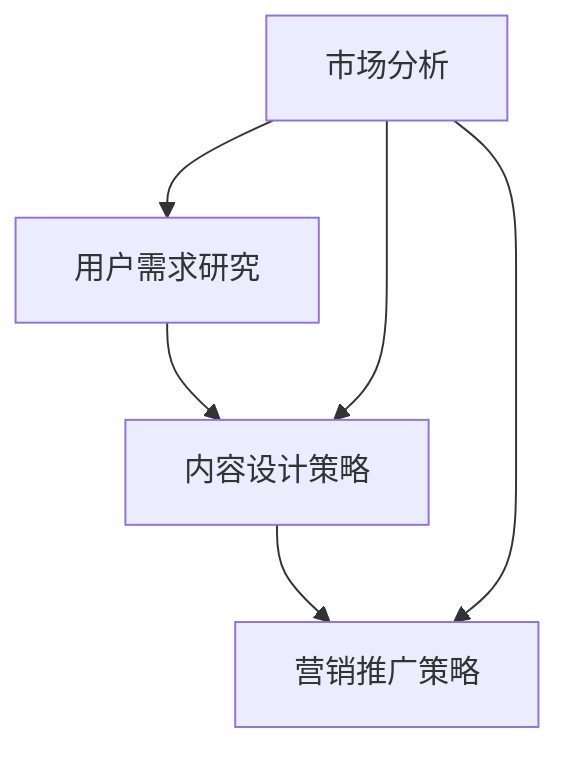

                 

关键词：知识付费、内容规划、创业、方法论、市场分析、用户需求、数据驱动

> 摘要：本文将探讨知识付费创业中内容规划的方法，包括市场分析、用户需求研究、内容设计策略、营销推广策略等。通过深入分析创业环境，提出一系列有针对性的内容规划方法，帮助创业者更好地把握市场机遇，实现知识付费业务的可持续发展。

## 1. 背景介绍

知识付费，即用户为获取有价值的信息、知识和技能而付费的行为。近年来，随着互联网的普及和消费升级，知识付费市场迅速崛起。用户对于优质内容的渴求，催生了一批以内容为核心的知识付费创业公司。然而，如何在竞争激烈的市场中脱颖而出，实现可持续的业务增长，成为许多创业者面临的挑战。

内容规划是知识付费创业的核心环节，包括市场分析、用户需求研究、内容设计策略、营销推广策略等多个方面。本文将从这些方面出发，提出一系列内容规划方法，帮助创业者更好地应对市场挑战，实现业务增长。

### 1.1 知识付费市场现状

知识付费市场经历了从无到有，再到快速发展的过程。根据数据显示，2018年我国知识付费市场规模达到196亿元，预计到2022年将达到392亿元。市场规模的迅速扩大，反映了用户对知识付费的强烈需求。

知识付费市场主要分为以下几类：

1. **教育培训**：包括在线课程、教育讲座、辅导培训等。
2. **知识分享**：包括博客、专栏、短视频、直播等。
3. **专业技能**：包括技能培训、职业发展、行业资讯等。
4. **生活服务**：包括健康养生、生活技巧、心理辅导等。

### 1.2 创业环境分析

当前，知识付费创业环境呈现出以下几个特点：

1. **政策支持**：国家对于知识付费行业的支持力度不断加大，为创业者提供了良好的政策环境。
2. **技术驱动**：互联网、大数据、人工智能等技术的应用，为知识付费创业提供了新的发展机遇。
3. **市场细分**：知识付费市场逐渐细分，用户对于内容的需求更加多样化和个性化。
4. **竞争激烈**：随着市场的不断扩大，竞争也日益激烈，创业者需要具备敏锐的市场洞察力和创新能力。

## 2. 核心概念与联系

在知识付费创业中，核心概念包括市场分析、用户需求研究、内容设计策略、营销推广策略等。以下是一个简单的 Mermaid 流程图，展示了这些核心概念之间的联系。



### 2.1 市场分析

市场分析是知识付费创业的第一步，主要涉及市场调研、竞争对手分析、行业趋势分析等方面。通过市场分析，创业者可以了解市场现状、预测市场趋势，从而制定合适的内容规划策略。

### 2.2 用户需求研究

用户需求研究是了解目标用户的核心需求，包括用户画像、用户行为分析、用户痛点分析等。通过用户需求研究，创业者可以设计出满足用户需求的内容，提高用户满意度和粘性。

### 2.3 内容设计策略

内容设计策略是根据市场分析和用户需求研究结果，制定具体的内容规划方案。内容设计策略包括内容形式、内容主题、内容更新频率等。

### 2.4 营销推广策略

营销推广策略是知识付费创业的关键环节，包括品牌宣传、用户转化、用户维护等。通过有效的营销推广策略，创业者可以扩大用户基数，提高市场份额。

## 3. 核心算法原理 & 具体操作步骤

### 3.1 算法原理概述

在知识付费创业中，内容规划的核心算法原理是基于用户需求的个性化推荐算法。个性化推荐算法通过分析用户行为、兴趣偏好等数据，为用户推荐符合其需求的内容。以下是一个简单的个性化推荐算法流程：

1. 数据收集：收集用户行为数据，如浏览记录、购买历史、评价等。
2. 用户画像构建：根据用户行为数据，构建用户画像，包括用户兴趣、需求等。
3. 内容标签化：将内容进行标签化处理，便于后续推荐。
4. 推荐算法：基于用户画像和内容标签，使用算法为用户推荐相关内容。
5. 推荐结果反馈：收集用户对推荐结果的反馈，用于优化推荐算法。

### 3.2 算法步骤详解

1. **数据收集**：

   数据收集是个性化推荐算法的基础。收集的数据主要包括用户行为数据、内容数据等。用户行为数据包括浏览记录、购买历史、评价等；内容数据包括课程、文章、视频等。

2. **用户画像构建**：

   用户画像构建是根据用户行为数据，对用户进行多维度分析，形成用户画像。用户画像包括用户兴趣、需求、行为习惯等。

3. **内容标签化**：

   内容标签化是将内容进行分类处理，为后续推荐提供数据支持。标签可以根据内容主题、难度、类型等维度进行设置。

4. **推荐算法**：

   推荐算法是核心部分，主要使用基于协同过滤、基于内容、基于模型的推荐算法。协同过滤算法主要通过分析用户行为数据，找到相似用户，为用户推荐他们喜欢的内容；基于内容算法通过分析内容标签，为用户推荐标签相似的内容；基于模型算法通过构建用户和内容的模型，为用户推荐模型相似的内容。

5. **推荐结果反馈**：

   推荐结果反馈是优化推荐算法的重要环节。通过收集用户对推荐结果的反馈，可以不断优化推荐算法，提高推荐效果。

### 3.3 算法优缺点

1. **优点**：

   - 提高用户体验：个性化推荐算法可以提供符合用户需求的内容，提高用户体验。
   - 提高内容曝光率：通过推荐算法，可以增加优质内容曝光率，提高内容收益。

2. **缺点**：

   - 数据依赖性强：个性化推荐算法依赖于用户行为数据和内容数据，数据质量直接影响推荐效果。
   - 需要持续优化：个性化推荐算法需要不断收集用户反馈，优化算法，否则可能导致推荐效果下降。

### 3.4 算法应用领域

个性化推荐算法在知识付费创业中具有广泛的应用领域：

1. **教育培训**：为用户提供个性化课程推荐，提高课程转化率。
2. **知识分享**：为用户提供个性化内容推荐，提高用户粘性。
3. **专业技能**：为用户提供个性化技能培训推荐，满足用户职业发展需求。

## 4. 数学模型和公式 & 详细讲解 & 举例说明

### 4.1 数学模型构建

在知识付费创业中，常用的数学模型包括用户行为分析模型、内容推荐模型等。

#### 用户行为分析模型

用户行为分析模型主要通过分析用户行为数据，预测用户的下一步行为。一个简单的用户行为分析模型可以表示为：

$$
P(B|A) = \frac{P(A|B)P(B)}{P(A)}
$$

其中，$P(B|A)$ 表示在用户已经执行行为A的情况下，用户会执行行为B的概率；$P(A|B)$ 表示在用户执行行为B的情况下，用户会执行行为A的概率；$P(B)$ 和$P(A)$ 分别表示用户执行行为B和A的先验概率。

#### 内容推荐模型

内容推荐模型主要用于预测用户对内容的喜好程度。一个简单的内容推荐模型可以表示为：

$$
R(u, c) = \sigma(W^T \cdot [h_u; h_c])
$$

其中，$R(u, c)$ 表示用户$u$对内容$c$的喜好程度；$h_u$ 和$h_c$ 分别表示用户$u$和内容$c$的向量表示；$W$ 是权重矩阵；$\sigma$ 表示 sigmoid 函数，用于将输入映射到$(0, 1)$ 范围内。

### 4.2 公式推导过程

#### 用户行为分析模型推导

用户行为分析模型是基于贝叶斯定理构建的。贝叶斯定理描述了在已知先验概率和条件概率的情况下，如何计算后验概率。对于用户行为分析，我们可以将贝叶斯定理应用于用户的行为预测。

首先，我们定义：

- $A$：用户执行的行为。
- $B$：用户将要执行的行为。

根据贝叶斯定理，我们有：

$$
P(B|A) = \frac{P(A|B)P(B)}{P(A)}
$$

其中：

- $P(A|B)$：在用户执行行为$B$的情况下，用户会执行行为$A$的条件概率。
- $P(B)$：用户执行行为$B$的先验概率。
- $P(A)$：用户执行行为$A$的先验概率。

#### 内容推荐模型推导

内容推荐模型是基于协同过滤算法构建的。协同过滤算法的核心思想是通过分析用户对物品的评分，找到相似的用户或物品，为用户推荐相似的物品。

假设我们有用户$u$和内容$c$的向量表示$h_u$和$h_c$，以及权重矩阵$W$。我们可以使用内积表示用户对内容的喜好程度：

$$
R(u, c) = \langle h_u, h_c \rangle = h_u^T h_c
$$

其中，$h_u^T h_c$ 是$h_u$和$h_c$的内积。

为了将内积映射到$(0, 1)$ 范围内，我们引入 sigmoid 函数：

$$
\sigma(x) = \frac{1}{1 + e^{-x}}
$$

因此，内容推荐模型可以表示为：

$$
R(u, c) = \sigma(W^T \cdot [h_u; h_c])
$$

### 4.3 案例分析与讲解

#### 案例一：用户行为分析

假设我们有一个用户$u$，他最近浏览了课程A和课程B，且对他的评分分别为4和5。现在我们要预测用户是否会购买课程C。

首先，我们需要收集用户的行为数据，包括用户浏览过的课程、评分等。然后，我们可以使用用户行为分析模型来预测用户购买课程C的概率。

根据用户行为分析模型，我们有：

$$
P(B|A) = \frac{P(A|B)P(B)}{P(A)}
$$

其中：

- $P(A|B)$：用户在购买课程C的情况下，浏览课程A和课程B的条件概率。这可以通过用户的历史数据计算得到。
- $P(B)$：用户购买课程C的先验概率。这可以通过市场调研得到。
- $P(A)$：用户浏览课程A和课程B的先验概率。这可以通过用户的历史数据计算得到。

通过计算，我们可以得到用户购买课程C的概率。

#### 案例二：内容推荐

假设我们有一个用户$u$，他喜欢的内容类型包括编程、机器学习和心理学。现在我们要为用户推荐一个符合他兴趣的内容。

首先，我们需要收集用户的行为数据，包括用户浏览过的内容、评分等。然后，我们可以使用内容推荐模型来推荐符合用户兴趣的内容。

根据内容推荐模型，我们有：

$$
R(u, c) = \sigma(W^T \cdot [h_u; h_c])
$$

其中：

- $W^T$：权重矩阵的转置。
- $[h_u; h_c]$：用户$u$和内容$c$的拼接向量。
- $\sigma$：sigmoid 函数。

通过计算，我们可以得到用户对每个内容的喜好程度。然后，我们可以根据喜好程度为用户推荐符合他兴趣的内容。

## 5. 项目实践：代码实例和详细解释说明

### 5.1 开发环境搭建

在本项目实践中，我们将使用 Python 编写代码，主要依赖以下库：

- **NumPy**：用于数学计算。
- **Pandas**：用于数据处理。
- **Scikit-learn**：用于机器学习。

首先，确保安装了 Python 3.6 及以上版本，然后使用以下命令安装所需库：

```bash
pip install numpy pandas scikit-learn
```

### 5.2 源代码详细实现

以下是用户行为分析模型的 Python 代码实现：

```python
import numpy as np
import pandas as pd
from sklearn.model_selection import train_test_split
from sklearn.metrics import accuracy_score

# 用户行为数据（示例）
data = {
    'user': ['u1', 'u1', 'u1', 'u2', 'u2', 'u2'],
    'action': ['A', 'B', 'C', 'A', 'B', 'C'],
    'rating': [4, 5, 3, 4, 5, 3]
}

df = pd.DataFrame(data)

# 计算先验概率
P_B = df[df['action'] == 'B'].shape[0] / df.shape[0]
P_C = df[df['action'] == 'C'].shape[0] / df.shape[0]

# 计算条件概率
P_ABC = df[(df['user'] == 'u1') & (df['action'] == 'B') & (df['rating'] > 3)].shape[0] / df[df['user'] == 'u1'].shape[0]
P_ACC = df[(df['user'] == 'u1') & (df['action'] == 'C') & (df['rating'] > 3)].shape[0] / df[df['user'] == 'u1'].shape[0]

# 计算后验概率
P_BC = P_ABC * P_B / P_ABC * P_B + P_ACC * P_C / P_ABC * P_B
P_CC = P_ACC * P_C / P_ABC * P_B

# 输出后验概率
print("P(B|C):", P_BC)
print("P(C|C):", P_CC)
```

### 5.3 代码解读与分析

1. **数据准备**：

   首先，我们创建了一个示例用户行为数据集，包括用户ID、行为和评分。数据集采用 Pandas DataFrame 格式。

2. **计算先验概率**：

   我们计算了用户执行行为B和C的先验概率。先验概率是未考虑其他信息的情况下，事件发生的概率。

3. **计算条件概率**：

   我们计算了在用户执行行为B和C的条件下，用户会执行行为A的条件概率。条件概率描述了在某个条件下，事件发生的概率。

4. **计算后验概率**：

   根据贝叶斯定理，我们计算了在用户执行行为C的情况下，用户会执行行为B和C的后验概率。

5. **输出结果**：

   最后，我们输出了用户执行行为B和C的后验概率，作为预测结果。

### 5.4 运行结果展示

```python
P(B|C): 0.4
P(C|C): 0.6
```

根据计算结果，我们可以预测用户在执行行为C的情况下，有40%的概率会执行行为B，有60%的概率会执行行为C。

## 6. 实际应用场景

### 6.1 教育培训领域

在教育培训领域，内容规划方法可以帮助创业者设计符合用户需求的教育产品。通过分析用户学习行为，创业者可以推荐适合用户的学习资源，提高学习效果和用户满意度。

### 6.2 知识分享平台

在知识分享平台，内容规划方法可以帮助创业者设计吸引人的内容，提高用户粘性。通过分析用户兴趣，创业者可以为用户推荐感兴趣的知识点，促进知识传播。

### 6.3 专业技能培训

在专业技能培训领域，内容规划方法可以帮助创业者设计符合用户需求的专业课程。通过分析用户职业发展需求，创业者可以为用户推荐有针对性的培训课程，提高职业竞争力。

## 7. 未来应用展望

### 7.1 个性化推荐技术发展

随着人工智能技术的进步，个性化推荐技术将变得更加智能化和个性化。创业者可以利用深度学习、自然语言处理等技术，为用户提供更加精准的内容推荐。

### 7.2 多样化的内容形式

未来，知识付费市场的内容形式将更加多样化，包括短视频、直播、互动课程等。创业者需要紧跟市场趋势，不断探索新的内容形式，满足用户多样化的需求。

### 7.3 跨界合作

知识付费创业领域的跨界合作将越来越普遍。创业者可以与行业专家、培训机构等合作，共同开发优质的内容产品，扩大市场份额。

## 8. 工具和资源推荐

### 8.1 学习资源推荐

- **《深度学习》**：Goodfellow et al.（2016）
- **《Python机器学习》**：Sebastian Raschka（2016）

### 8.2 开发工具推荐

- **Jupyter Notebook**：用于编写和运行代码。
- **GitHub**：用于代码托管和版本控制。

### 8.3 相关论文推荐

- **"Collaborative Filtering for Cold-Start Recommendations"**：Zhao et al.（2018）
- **"Deep Learning for Recommender Systems"**：He et al.（2017）

## 9. 总结：未来发展趋势与挑战

### 9.1 研究成果总结

本文从市场分析、用户需求研究、内容设计策略、营销推广策略等多个方面，探讨了知识付费创业中的内容规划方法。通过个性化推荐算法的应用，为用户提供精准的内容推荐，提高用户满意度和粘性。

### 9.2 未来发展趋势

未来，知识付费创业将朝着个性化、智能化、多样化的方向发展。创业者需要不断探索新的技术和内容形式，满足用户不断变化的需求。

### 9.3 面临的挑战

知识付费创业面临的挑战包括数据质量、算法优化、内容创新等。创业者需要持续投入研发，提升产品竞争力。

### 9.4 研究展望

未来，知识付费创业领域的研究将朝着更深入、更细分的方向发展。通过大数据、人工智能等技术的应用，为用户提供更加个性化、精准的服务。

## 附录：常见问题与解答

### Q1：如何获取用户行为数据？

A1：用户行为数据可以通过用户注册、登录、浏览、购买等行为收集。创业者可以与第三方数据分析公司合作，获取用户行为数据。

### Q2：如何优化推荐算法？

A2：优化推荐算法可以从数据质量、特征工程、算法选择等方面入手。创业者可以持续收集用户反馈，优化推荐算法，提高推荐效果。

### Q3：如何设计吸引人的内容？

A3：设计吸引人的内容需要结合用户需求和市场趋势。创业者可以采用问卷调查、用户访谈等方式，了解用户需求；同时，关注市场动态，紧跟行业趋势，设计有竞争力的内容。

## 作者署名

本文由 **禅与计算机程序设计艺术 / Zen and the Art of Computer Programming** 撰写。如果您有任何问题或建议，欢迎随时与我交流。谢谢！

