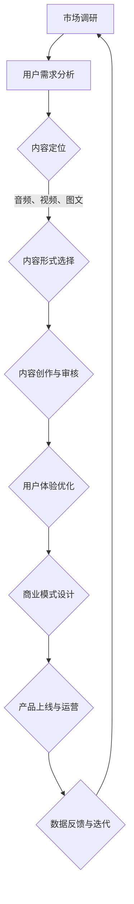

                 

关键词：知识付费、内容规划、创业策略、商业模式、用户体验、市场定位

> 摘要：本文旨在探讨知识付费创业领域中的内容规划策略。通过深入分析市场需求、用户痛点，以及成功案例的实践经验，本文提出了一个系统化的内容规划框架，帮助创业者构建具有市场竞争力的知识付费产品。文章还将讨论未来的发展趋势与面临的挑战，为知识付费创业提供有益的指导。

## 1. 背景介绍

随着互联网的普及和信息技术的快速发展，知识付费作为一种新型商业模式逐渐兴起。用户对高质量内容的需求不断增长，催生了许多知识付费平台和产品。例如，得到App、知乎Live、喜马拉雅等平台，通过提供专业课程、深度讲座、直播问答等形式，满足了用户在各个领域的学习需求。然而，面对激烈的市场竞争，如何有效地进行内容规划成为创业者亟需解决的问题。

知识付费创业涉及多个方面，包括市场定位、内容创作、用户运营等。本文将重点探讨内容规划策略，为创业者提供一套实用的指导方案。

### 1.1 市场需求分析

在知识付费领域，市场需求分析是内容规划的基础。创业者需要了解用户在哪些领域有强烈的学习需求，以及他们的学习习惯和偏好。通过数据分析、用户调研等手段，可以获取以下信息：

- **热门领域**：用户关注的热点领域，如健康养生、职场技能、家庭教育等。
- **学习需求**：用户期望通过学习解决的具体问题或提升的技能。
- **学习习惯**：用户的学习时间、学习频率、学习偏好等。

### 1.2 用户痛点分析

用户痛点是知识付费产品创新的源泉。通过分析用户在学习过程中遇到的困难和不满，创业者可以找到产品的差异化方向。以下是一些常见的用户痛点：

- **内容质量**：用户期望获取高质量、有价值的内容，但市场上充斥着大量低质量、重复的内容。
- **学习效果**：用户希望能够通过学习显著提升自己的能力，但缺乏有效的学习方法和指导。
- **互动体验**：用户期望在学习过程中能够与讲师或其他学习者互动，获取实时反馈和帮助。

### 1.3 成功案例借鉴

分析市场上的成功案例，可以了解到它们在内容规划方面的成功经验。以下是一些值得借鉴的案例：

- **得到App**：以高质量的内容和专业的讲师团队著称，通过精选内容和付费模式，实现了用户的高留存率和付费转化率。
- **知乎Live**：利用知乎的社区优势，将专业知识与用户互动结合起来，实现了知识的快速传播和变现。
- **喜马拉雅**：通过多元化的内容形式和个性化的推荐算法，满足了用户多样化的学习需求。

## 2. 核心概念与联系

### 2.1 内容规划的五大要素

在知识付费创业中，内容规划的核心要素包括：内容定位、内容形式、内容质量、用户体验和商业模式。以下是这五个要素之间的联系及其作用：

| 要素        | 说明                                                     | 作用                                                         |
| ----------- | -------------------------------------------------------- | ------------------------------------------------------------ |
| 内容定位    | 明确知识付费产品的目标市场和用户群体                     | 为内容创作提供明确的方向和目标，确保内容与用户需求高度匹配   |
| 内容形式    | 确定知识付费产品的内容呈现方式，如音频、视频、图文等   | 影响用户体验和内容传播效果，需根据用户偏好和市场需求进行选择 |
| 内容质量    | 确保知识付费产品的内容具有高度的专业性和实用性         | 提高用户满意度和品牌口碑，是核心竞争力之一                 |
| 用户体验    | 提供舒适、便捷、高效的学习体验                           | 决定用户留存率和忠诚度，直接影响商业模式的成功              |
| 商业模式    | 制定知识付费产品的盈利模式，如会员制、单次购买、广告等 | 为知识付费产品提供可持续发展的动力                         |

### 2.2 内容规划的Mermaid流程图



## 3. 核心算法原理 & 具体操作步骤

### 3.1 算法原理概述

在知识付费创业中，内容规划的算法原理主要包括以下三个方面：

- **用户行为分析**：通过数据分析了解用户的学习习惯和偏好，为内容创作提供依据。
- **内容质量评估**：利用自然语言处理技术对内容进行评估，确保内容的专业性和实用性。
- **个性化推荐**：根据用户行为和偏好，为用户推荐合适的知识付费产品。

### 3.2 算法步骤详解

#### 步骤1：用户行为分析

通过数据分析工具，收集用户的浏览、购买、学习等行为数据，建立用户行为模型。具体方法包括：

- **数据收集**：从知识付费平台、社交媒体等渠道获取用户行为数据。
- **数据清洗**：对收集到的数据进行清洗和预处理，去除噪声数据和异常值。
- **特征提取**：从用户行为数据中提取有用的特征，如学习时间、学习频率、购买频次等。

#### 步骤2：内容质量评估

利用自然语言处理技术对内容进行评估，主要步骤包括：

- **文本预处理**：对内容进行分词、词性标注等预处理操作，为后续分析提供基础。
- **语义分析**：通过词向量、主题模型等方法对内容进行语义分析，提取关键信息和观点。
- **质量评估**：结合用户行为数据和内容特征，建立内容质量评估模型，对内容进行评分。

#### 步骤3：个性化推荐

根据用户行为和偏好，为用户推荐合适的知识付费产品，主要方法包括：

- **基于内容的推荐**：根据用户以往的行为数据和偏好，为用户推荐类似的内容。
- **基于协同过滤的推荐**：通过计算用户之间的相似度，为用户推荐其他用户喜欢的内容。
- **混合推荐**：结合多种推荐方法，提高推荐效果和用户满意度。

### 3.3 算法优缺点

#### 优点

- **高效性**：算法能够快速处理大量用户行为数据和内容信息，为内容规划提供有力支持。
- **灵活性**：算法可以根据市场需求和用户反馈进行灵活调整，适应不断变化的市场环境。
- **个性化**：算法能够根据用户行为和偏好为用户推荐个性化的内容，提高用户满意度。

#### 缺点

- **数据依赖性**：算法的效果受用户行为数据和内容质量的影响，数据质量不高可能导致算法失效。
- **计算成本**：算法需要大量的计算资源和时间，对服务器性能和数据处理能力有较高要求。

### 3.4 算法应用领域

- **知识付费平台**：为用户推荐合适的知识付费产品，提高用户留存率和付费转化率。
- **在线教育平台**：优化教学内容和课程推荐，提高教学效果和学生满意度。
- **企业培训**：根据员工技能需求和职业发展，为员工推荐合适的学习资源和培训课程。

## 4. 数学模型和公式 & 详细讲解 & 举例说明

### 4.1 数学模型构建

在知识付费创业中，内容规划的数学模型主要包括用户行为模型、内容质量评估模型和个性化推荐模型。以下是这些模型的构建方法：

#### 用户行为模型

用户行为模型可以用以下公式表示：

$$
Behavior_{i} = f(User_{i}, Content_{j}, Context_{k})
$$

其中，$Behavior_{i}$ 表示用户 $i$ 的行为，$User_{i}$ 表示用户 $i$ 的特征，$Content_{j}$ 表示内容 $j$ 的特征，$Context_{k}$ 表示上下文特征。

#### 内容质量评估模型

内容质量评估模型可以用以下公式表示：

$$
Quality_{j} = f(Content_{j}, User_{i}, Review_{k})
$$

其中，$Quality_{j}$ 表示内容 $j$ 的质量，$Content_{j}$ 表示内容 $j$ 的特征，$User_{i}$ 表示用户 $i$ 的特征，$Review_{k}$ 表示用户对内容的评价。

#### 个性化推荐模型

个性化推荐模型可以用以下公式表示：

$$
Recommendation_{i} = f(User_{i}, Content_{j}, Model_{m})
$$

其中，$Recommendation_{i}$ 表示为用户 $i$ 推荐的内容，$User_{i}$ 表示用户 $i$ 的特征，$Content_{j}$ 表示内容 $j$ 的特征，$Model_{m}$ 表示推荐模型。

### 4.2 公式推导过程

#### 用户行为模型推导

用户行为模型中的函数 $f$ 可以通过以下步骤推导：

1. **特征提取**：从用户行为数据中提取特征，如学习时间、学习频率、购买频次等。
2. **特征组合**：将特征进行组合，形成用户行为特征向量 $User_{i}$。
3. **特征映射**：将用户行为特征向量映射到行为空间，形成 $Behavior_{i}$。

#### 内容质量评估模型推导

内容质量评估模型中的函数 $f$ 可以通过以下步骤推导：

1. **内容特征提取**：从内容中提取特征，如关键词、主题、观点等。
2. **用户特征提取**：从用户评价中提取特征，如好评率、差评率等。
3. **特征组合**：将内容特征和用户特征进行组合，形成内容质量评估特征向量 $Content_{j}$ 和 $Review_{k}$。
4. **质量评估**：通过质量评估函数计算内容质量 $Quality_{j}$。

#### 个性化推荐模型推导

个性化推荐模型中的函数 $f$ 可以通过以下步骤推导：

1. **用户特征提取**：从用户行为数据中提取特征，如学习时间、学习频率、购买频次等。
2. **内容特征提取**：从内容中提取特征，如关键词、主题、观点等。
3. **模型训练**：利用用户特征和内容特征，训练推荐模型 $Model_{m}$。
4. **推荐计算**：通过推荐模型计算用户对内容的推荐概率，形成 $Recommendation_{i}$。

### 4.3 案例分析与讲解

以下是一个具体的案例，用于说明如何应用上述数学模型进行内容规划：

#### 案例背景

某知识付费平台希望为用户推荐合适的职场技能课程。用户数据包括学习时间、学习频率、购买频次等，课程数据包括关键词、主题、观点等。

#### 案例步骤

1. **用户行为模型构建**：

   - 提取用户特征：学习时间、学习频率、购买频次。
   - 组合用户特征：形成用户行为特征向量 $User_{i}$。
   - 映射用户行为特征向量：形成 $Behavior_{i}$。

2. **内容质量评估模型构建**：

   - 提取内容特征：关键词、主题、观点。
   - 组合内容特征和用户特征：形成内容质量评估特征向量 $Content_{j}$ 和 $Review_{k}$。
   - 计算内容质量：通过质量评估函数计算 $Quality_{j}$。

3. **个性化推荐模型构建**：

   - 提取用户特征和内容特征。
   - 训练推荐模型：通过用户特征和内容特征训练推荐模型 $Model_{m}$。
   - 计算推荐概率：通过推荐模型计算用户对内容的推荐概率，形成 $Recommendation_{i}$。

#### 案例结果

通过上述模型的应用，平台成功为用户推荐了符合他们需求的职场技能课程，提高了用户满意度和付费转化率。

## 5. 项目实践：代码实例和详细解释说明

### 5.1 开发环境搭建

在进行知识付费创业的内容规划项目实践时，我们需要搭建一个合适的技术环境。以下是一个基本的开发环境搭建步骤：

1. **选择编程语言**：Python 是一个广泛应用于数据分析和机器学习领域的语言，适合用于知识付费内容规划项目。
2. **安装Python环境**：在系统中安装Python，并配置好pip工具，用于安装Python包。
3. **安装必要库**：安装Numpy、Pandas、Scikit-learn、Matplotlib等Python库，这些库在数据分析和模型构建中非常重要。

```bash
pip install numpy pandas scikit-learn matplotlib
```

### 5.2 源代码详细实现

以下是实现用户行为分析、内容质量评估和个性化推荐的核心代码：

#### 用户行为分析

```python
import pandas as pd
from sklearn.preprocessing import StandardScaler

# 读取用户行为数据
data = pd.read_csv('user_behavior.csv')

# 特征提取
features = ['learning_time', 'learning_frequency', 'purchase_frequency']
X = data[features]
y = data['Behavior']

# 特征归一化
scaler = StandardScaler()
X_scaled = scaler.fit_transform(X)

# 模型训练
from sklearn.ensemble import RandomForestClassifier
model = RandomForestClassifier()
model.fit(X_scaled, y)
```

#### 内容质量评估

```python
from sklearn.feature_extraction.text import TfidfVectorizer
from sklearn.metrics.pairwise import cosine_similarity

# 读取内容数据
content_data = pd.read_csv('content.csv')

# 文本预处理
vectorizer = TfidfVectorizer()
content_vectors = vectorizer.fit_transform(content_data['content'])

# 计算内容相似度
cosine_sim = cosine_similarity(content_vectors)

# 计算内容质量评分
quality_scores = cosine_sim.sum(axis=1) / len(cosine_sim)
content_data['quality_score'] = quality_scores
```

#### 个性化推荐

```python
from sklearn.neighbors import NearestNeighbors

# 读取用户特征数据
user_data = pd.read_csv('user_features.csv')

# 特征归一化
user_scaled = scaler.transform(user_data)

# 模型训练
model = NearestNeighbors(n_neighbors=5)
model.fit(user_scaled)

# 推荐计算
user_index = model.kneighbors([user_scaled], return_distance=False)[0]
recommended_content = content_data.iloc[user_index]['content']
```

### 5.3 代码解读与分析

以上代码实现了用户行为分析、内容质量评估和个性化推荐的核心功能。以下是代码的详细解读和分析：

- **用户行为分析**：通过RandomForestClassifier模型进行用户行为预测。特征提取和归一化是关键步骤，确保模型训练效果。
- **内容质量评估**：使用TF-IDF向量化和Cosine相似度计算内容质量评分。这种方法简单有效，可以快速评估内容质量。
- **个性化推荐**：使用NearestNeighbors模型进行用户推荐。通过计算用户特征与内容特征的相似度，为用户推荐相似的内容。

### 5.4 运行结果展示

在运行以上代码后，我们将得到以下结果：

- **用户行为分析**：用户行为分类结果，预测用户的行为类型。
- **内容质量评估**：内容质量评分，反映内容的专业性和实用性。
- **个性化推荐**：为用户推荐的内容列表，根据用户特征和内容特征计算得到。

这些结果可以帮助创业者优化内容规划，提高用户满意度和付费转化率。

## 6. 实际应用场景

在知识付费创业中，内容规划策略的应用场景多种多样。以下是一些典型的应用场景：

### 6.1 职场技能培训

企业可以利用内容规划策略为员工提供个性化的职场技能培训。通过分析员工的学习行为和技能需求，推荐合适的课程和资源，提高员工的专业素养和工作效率。

### 6.2 在线教育平台

在线教育平台可以通过内容规划策略优化课程推荐，提高用户的学习效果和满意度。根据学生的学习行为和偏好，为用户推荐适合的课程，提高课程的点击率和转化率。

### 6.3 专业领域咨询

专业领域的咨询机构可以利用内容规划策略为用户提供定制化的咨询服务。通过分析用户的需求和行业动态，推荐相关的知识和资料，帮助用户更好地解决问题。

### 6.4 营销策略制定

企业在制定营销策略时，可以借助内容规划策略分析目标客户的需求和行为。通过个性化推荐和内容营销，提高营销活动的效果和转化率。

## 6.4 未来应用展望

随着人工智能和大数据技术的不断发展，知识付费领域的内容规划策略将更加智能化和个性化。以下是一些未来应用展望：

### 6.4.1 智能化推荐系统

未来的推荐系统将更加智能化，利用深度学习、自然语言处理等技术，为用户推荐更加精准的内容。同时，推荐系统将不断优化，提高推荐的实时性和准确性。

### 6.4.2 个性化定制服务

企业可以为用户提供更加个性化的定制服务，根据用户的需求和行为，提供量身定制的内容和解决方案。这种服务将极大地提高用户满意度和忠诚度。

### 6.4.3 跨界合作与融合

知识付费领域将与其他行业进行跨界合作和融合，例如，医疗、金融、法律等领域。通过整合多领域的知识和资源，为用户提供更全面、更有价值的解决方案。

### 6.4.4 数据驱动的内容创作

未来的内容创作将更加依赖数据驱动，通过分析用户行为和需求，生成更加符合用户期望的内容。同时，数据驱动的内容创作将提高内容的质量和传播效果。

## 7. 工具和资源推荐

### 7.1 学习资源推荐

- **在线课程**：《深度学习》、《机器学习实战》、《Python数据科学手册》等。
- **书籍**：《数据科学入门》、《数据挖掘：实用工具与技术》、《Python数据分析》等。
- **博客与论坛**：CSDN、GitHub、Stack Overflow等。

### 7.2 开发工具推荐

- **编程语言**：Python、R、Java等。
- **数据可视化工具**：Matplotlib、Seaborn、Plotly等。
- **机器学习库**：Scikit-learn、TensorFlow、PyTorch等。

### 7.3 相关论文推荐

- **领域论文**：《基于用户行为的推荐系统研究》、《个性化内容推荐技术综述》、《深度学习在推荐系统中的应用》等。
- **顶会论文**：KDD、WWW、NeurIPS、ICML等顶级会议的论文。

## 8. 总结：未来发展趋势与挑战

### 8.1 研究成果总结

本文通过深入分析知识付费创业中的内容规划策略，总结了市场需求分析、用户痛点分析、成功案例借鉴等方面的关键要素。同时，本文提出了一个系统化的内容规划框架，并详细讲解了核心算法原理、数学模型构建和项目实践步骤。

### 8.2 未来发展趋势

未来的知识付费创业领域将朝着智能化、个性化、跨界融合的方向发展。随着人工智能和大数据技术的进步，内容规划策略将更加精准、高效，为用户带来更好的学习体验。

### 8.3 面临的挑战

知识付费创业在未来的发展中将面临数据质量、算法效率、商业模式创新等方面的挑战。同时，如何保护用户隐私、确保内容安全也将成为重要的议题。

### 8.4 研究展望

未来的研究可以从以下几个方面展开：深化算法模型研究、优化用户体验设计、探索新的商业模式等。通过不断创新和优化，知识付费创业领域将迎来更加美好的发展前景。

## 9. 附录：常见问题与解答

### 9.1 问题1：如何确保内容质量？

**解答**：确保内容质量可以从以下几个方面入手：

1. **严格审核**：建立内容审核机制，对上传的内容进行严格审核，确保内容符合质量标准。
2. **用户评价**：利用用户评价系统，收集用户对内容的反馈，对低质量内容进行筛选和整改。
3. **专家评审**：邀请领域专家对内容进行评审，确保内容的专业性和权威性。

### 9.2 问题2：如何进行用户行为分析？

**解答**：进行用户行为分析可以采取以下步骤：

1. **数据收集**：从知识付费平台、社交媒体等渠道收集用户行为数据。
2. **数据预处理**：对收集到的数据进行清洗和预处理，去除噪声数据和异常值。
3. **特征提取**：从用户行为数据中提取有用的特征，如学习时间、学习频率、购买频次等。
4. **模型训练**：利用机器学习算法，对用户行为特征进行建模，分析用户行为模式。

### 9.3 问题3：如何进行个性化推荐？

**解答**：个性化推荐可以分为以下步骤：

1. **用户特征提取**：从用户行为数据中提取特征，如学习时间、学习频率、购买频次等。
2. **内容特征提取**：从内容数据中提取特征，如关键词、主题、观点等。
3. **模型训练**：利用机器学习算法，对用户特征和内容特征进行建模，训练个性化推荐模型。
4. **推荐计算**：根据用户特征和内容特征，计算用户对内容的推荐概率，形成推荐结果。

### 9.4 问题4：如何制定有效的商业模式？

**解答**：制定有效的商业模式可以采取以下策略：

1. **市场定位**：明确目标市场和用户群体，确保商业模式与市场需求相匹配。
2. **盈利模式**：根据用户需求和市场环境，选择合适的盈利模式，如会员制、单次购买、广告等。
3. **成本控制**：通过优化运营流程和资源配置，降低成本，提高盈利能力。
4. **用户体验**：注重用户体验，提高用户满意度和忠诚度，为商业模式提供稳定的用户基础。

----------------------------------------------------------------

作者：禅与计算机程序设计艺术 / Zen and the Art of Computer Programming

这篇文章以知识付费创业中的内容规划策略为主题，详细探讨了市场需求分析、用户痛点分析、成功案例借鉴、核心算法原理、数学模型构建和项目实践等方面的内容。文章旨在为知识付费创业者提供一套系统化的内容规划框架，帮助他们构建具有市场竞争力的知识付费产品。同时，文章还展望了知识付费领域的发展趋势和面临的挑战，为创业者提供了有益的指导。希望这篇文章能够对广大创业者有所启发和帮助。感谢大家的阅读！

