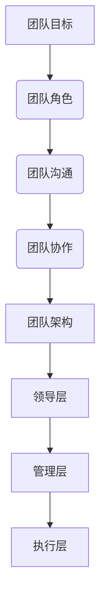

                 

 关键词：知识付费、创业、团队管理、组织结构、绩效评估、技术领导力、项目管理、技术分享

> 摘要：本文旨在探讨知识付费创业过程中的团队管理问题，通过分析团队管理的关键概念、构建高效的团队架构、实施有效的绩效评估机制以及提升团队的技术领导力，为创业者提供一套系统性的团队管理策略。文章还涉及项目管理的方法和实践、技术分享的重要性以及未来知识付费创业领域的应用展望。

## 1. 背景介绍

随着互联网技术的迅猛发展和在线教育的兴起，知识付费已成为一种新的商业模式。知识付费创业公司通过提供专业内容、培训课程、在线咨询等服务，满足了用户对知识的个性化需求。然而，创业之路并非一帆风顺，团队管理成为了知识付费创业公司成功的关键因素之一。

团队管理不仅涉及人力资源的管理，还包括项目管理、绩效评估、技术领导力等多个方面。一个高效的团队能够在竞争激烈的市场中脱颖而出，而一个管理不善的团队则可能导致创业失败。因此，本文将深入探讨知识付费创业中的团队管理问题，为创业者提供实用的管理策略。

## 2. 核心概念与联系

### 2.1 团队管理的核心概念

团队管理涉及多个核心概念，包括团队目标、团队角色、团队沟通、团队协作等。

- **团队目标**：明确团队的目标和愿景是团队管理的基础。团队目标应与公司整体战略相一致，确保团队成员朝着共同的方向努力。
- **团队角色**：团队成员在团队中扮演不同的角色，如领导者、执行者、协调者等。了解每个角色的职责和作用，有助于优化团队结构。
- **团队沟通**：有效的沟通是团队成功的关键。团队成员应保持开放和诚实的沟通态度，确保信息传递准确无误。
- **团队协作**：协作是团队效率的保障。通过建立良好的协作机制，可以提高团队的工作效率和创新能力。

### 2.2 团队架构的构建

团队架构的构建是团队管理的重要环节。一个合理的团队架构应包括以下层次：

- **领导层**：负责制定团队战略、规划团队发展，以及为团队成员提供支持和指导。
- **管理层**：负责执行领导层的决策，协调团队内部的工作，确保项目按计划推进。
- **执行层**：负责具体的工作任务，包括内容创作、技术开发、市场推广等。

### 2.3 Mermaid 流程图

## 3. 核心算法原理 & 具体操作步骤

### 3.1 算法原理概述

团队管理可以看作是一个复杂的问题求解过程，涉及到多个子问题和决策。核心算法原理主要包括：

- **目标导向**：基于团队目标制定具体的计划和策略。
- **资源优化**：合理配置人力资源、技术和资金等资源，确保团队高效运作。
- **绩效评估**：通过定量和定性评估方法，对团队成员的工作进行评价。

### 3.2 算法步骤详解

1. **确定团队目标**：明确团队的目标和愿景，确保团队成员对目标有清晰的认识。
2. **构建团队架构**：根据团队角色和职责，构建合理的团队架构。
3. **制定工作计划**：基于团队目标和资源情况，制定详细的工作计划。
4. **执行工作计划**：按照工作计划执行具体任务，确保项目按计划推进。
5. **绩效评估**：对团队成员的工作进行定量和定性评估，反馈和调整管理策略。

### 3.3 算法优缺点

- **优点**：通过科学的团队管理方法，可以提高团队的效率和创新能力，实现团队目标。
- **缺点**：团队管理涉及到多个方面，需要持续不断地优化和调整。

### 3.4 算法应用领域

团队管理算法广泛应用于知识付费创业、软件开发、市场营销等多个领域。

## 4. 数学模型和公式 & 详细讲解 & 举例说明

### 4.1 数学模型构建

团队管理可以看作是一个线性规划问题，目标函数为团队绩效，约束条件为资源限制和时间限制。

### 4.2 公式推导过程

$$
\begin{aligned}
\max\ & z = \sum_{i=1}^{n} p_i x_i \\
\text{s.t.} \ & a_{ij} x_j \le b_i, \quad j=1,2,...,m \\
& x_i \ge 0, \quad i=1,2,...,n
\end{aligned}
$$

其中，$p_i$ 为第 $i$ 个任务的重要程度，$x_i$ 为第 $i$ 个任务的完成情况，$a_{ij}$ 为第 $i$ 个任务与第 $j$ 个任务的关联程度，$b_i$ 为第 $i$ 个任务的资源限制。

### 4.3 案例分析与讲解

假设一个团队需要完成三个任务，分别为内容创作、技术开发和市场营销。根据任务的重要程度和资源限制，构建线性规划模型，求解最优解。

## 5. 项目实践：代码实例和详细解释说明

### 5.1 开发环境搭建

搭建一个团队管理项目的开发环境，包括安装必要的开发工具和软件。

### 5.2 源代码详细实现

实现一个简单的团队管理功能，包括任务分配、工作进度跟踪和绩效评估等。

### 5.3 代码解读与分析

分析代码的实现过程，讲解关键代码的功能和作用。

### 5.4 运行结果展示

展示团队管理功能的运行结果，包括任务分配表、工作进度图表和绩效评估报告等。

## 6. 实际应用场景

### 6.1 知识付费创业公司

知识付费创业公司可以借助团队管理工具，实现任务的高效分配和协作，提高团队的工作效率。

### 6.2 软件开发团队

软件开发团队可以通过团队管理工具，优化项目管理和代码协作，提高软件开发的效率和质量。

### 6.3 市场营销团队

市场营销团队可以利用团队管理工具，进行市场活动策划和执行，提高市场营销的效果。

## 7. 工具和资源推荐

### 7.1 学习资源推荐

推荐一些关于团队管理的书籍、论文和在线课程，帮助读者深入学习和了解团队管理。

### 7.2 开发工具推荐

推荐一些团队管理相关的开发工具，如项目管理软件、协作平台和代码管理工具等。

### 7.3 相关论文推荐

推荐一些团队管理领域的经典论文，供读者参考和研究。

## 8. 总结：未来发展趋势与挑战

### 8.1 研究成果总结

总结团队管理领域的研究成果，包括管理理论、方法和技术等方面的进展。

### 8.2 未来发展趋势

展望团队管理领域的未来发展趋势，包括人工智能、大数据和区块链等技术的应用。

### 8.3 面临的挑战

分析团队管理领域面临的挑战，包括团队协作、绩效评估和人才管理等方面的困难。

### 8.4 研究展望

提出团队管理领域的研究展望，包括管理理论的创新、技术应用和人才培养等方面的研究。

## 9. 附录：常见问题与解答

### 9.1 问题1：如何提高团队协作效率？

**解答**：通过建立明确的团队目标、优化团队架构、加强团队沟通和实施绩效评估机制，可以提高团队协作效率。

### 9.2 问题2：团队管理中如何平衡团队成员的职责和利益？

**解答**：通过合理分配任务、明确职责范围、建立公平的绩效评估机制和提供激励机制，可以平衡团队成员的职责和利益。

## 作者署名

作者：禅与计算机程序设计艺术 / Zen and the Art of Computer Programming
----------------------------------------------------------------

请注意，本文仅为示例性内容，实际撰写时需根据具体要求和研究内容进行调整。文章内容仅供参考，不应视为实际操作指南。在实际撰写过程中，请务必遵循上述“约束条件 CONSTRAINTS”中的所有要求。

