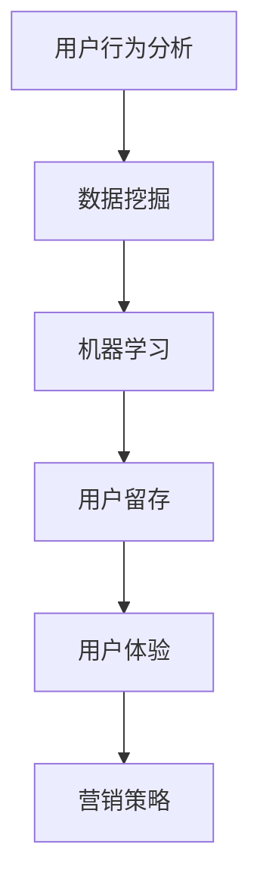

                 

关键词：知识付费、用户行为分析、数据挖掘、机器学习、用户留存、用户体验、营销策略、平台运营

摘要：随着互联网的普及和知识经济的兴起，知识付费领域逐渐成为了一个充满潜力的市场。本文旨在探讨知识付费创业中的用户行为分析，以及如何利用数据分析技术提高用户留存和用户体验。我们将从核心概念、算法原理、数学模型、项目实践、实际应用场景等多个角度，深入解析用户行为分析在知识付费创业中的应用，并展望未来的发展趋势与挑战。

## 1. 背景介绍

知识付费，指的是消费者为获取有价值的信息、知识或技能而支付的费用。这种商业模式在互联网时代迅速崛起，主要得益于以下几个因素：

1. **信息不对称**：在互联网时代，人们更容易接触到丰富的信息资源，但同时也面临着信息过载的问题。知识付费能够帮助用户筛选出有价值的内容。
2. **用户需求**：随着人们生活水平的提高，对于自我提升和职业发展的需求越来越强烈，这为知识付费市场提供了广阔的空间。
3. **技术支持**：大数据、人工智能等技术的应用，使得知识付费平台的运营和管理更加高效。

知识付费市场的快速发展，吸引了大量创业者投身其中。然而，如何在竞争激烈的市场中脱颖而出，提高用户留存和用户体验，成为了许多知识付费平台面临的重要挑战。

## 2. 核心概念与联系

### 2.1 用户行为分析

用户行为分析是指通过收集和分析用户在平台上的行为数据，来了解用户的需求、偏好、行为模式等，从而为平台运营提供决策依据。

### 2.2 数据挖掘

数据挖掘是一种从大量数据中自动发现有趣知识的计算过程，包括数据的收集、预处理、模式识别和知识表示等步骤。

### 2.3 机器学习

机器学习是人工智能的一个分支，通过构建数学模型，让计算机从数据中学习，从而实现自动化决策。

### 2.4 用户留存

用户留存是指用户在一段时间后仍然活跃在平台上的情况。高留存率是知识付费平台成功的关键指标之一。

### 2.5 用户体验

用户体验是指用户在使用产品或服务过程中的感受和体验。提升用户体验，能够提高用户的满意度和忠诚度。

### 2.6 营销策略

营销策略是指企业为推广产品或服务所采取的一系列措施。合理的营销策略能够吸引用户，提高用户留存。

### 2.7 Mermaid 流程图



## 3. 核心算法原理 & 具体操作步骤

### 3.1 算法原理概述

用户行为分析的核心算法主要包括以下几种：

1. **关联规则挖掘**：通过发现用户行为数据中的关联关系，为个性化推荐提供依据。
2. **聚类分析**：将具有相似行为的用户分为一组，为用户群体分析和市场细分提供支持。
3. **分类与回归**：通过建立预测模型，预测用户的行为和偏好。

### 3.2 算法步骤详解

1. **数据收集与预处理**：收集用户行为数据，包括浏览、搜索、购买、评价等，并对数据进行清洗、去重和处理。
2. **特征工程**：根据业务需求，提取用户行为的特征，如用户活跃度、购买频率、评价质量等。
3. **算法选择与实现**：选择合适的算法，如 Apriori 算法、K-means 算法、SVM 算法等，并实现算法。
4. **模型评估与优化**：通过交叉验证、A/B 测试等方法，评估模型的性能，并不断优化模型。

### 3.3 算法优缺点

1. **关联规则挖掘**：优点在于能够发现用户行为数据中的潜在关联关系，但缺点在于会产生大量冗余规则。
2. **聚类分析**：优点在于能够发现用户群体的分布和特征，但缺点在于可能存在聚类效果不佳的情况。
3. **分类与回归**：优点在于能够预测用户的行为和偏好，但缺点在于对训练数据的依赖较大。

### 3.4 算法应用领域

用户行为分析算法在知识付费领域的应用非常广泛，包括个性化推荐、用户群体分析、营销策略优化等。

## 4. 数学模型和公式 & 详细讲解 & 举例说明

### 4.1 数学模型构建

用户行为分析的核心数学模型主要包括以下几种：

1. **关联规则模型**：使用支持度和置信度来衡量规则的重要性。
2. **聚类模型**：使用距离函数和聚类算法来划分用户群体。
3. **分类模型**：使用决策树、支持向量机等算法来预测用户行为。

### 4.2 公式推导过程

1. **支持度**：表示一个规则在数据集中出现的频率。
   $$ 支持度 = \frac{A \cup B}{D} $$
   其中，$A$ 和 $B$ 表示两个事件，$D$ 表示数据集。

2. **置信度**：表示一个规则的后验概率。
   $$ 置信度 = \frac{A \cap B}{A} $$

3. **聚类中心**：使用距离函数来计算聚类中心。
   $$ 聚类中心 = \frac{1}{k} \sum_{i=1}^{k} c_i $$

   其中，$c_i$ 表示第 $i$ 个聚类中心。

4. **决策边界**：使用决策树或支持向量机来划分用户群体。

### 4.3 案例分析与讲解

假设我们有一个知识付费平台，用户行为数据包括浏览、搜索、购买、评价等。我们希望通过用户行为分析，为平台提供个性化推荐。

1. **数据收集与预处理**：收集用户行为数据，并进行清洗和处理。

2. **特征工程**：提取用户行为的特征，如浏览次数、购买次数、评价质量等。

3. **关联规则挖掘**：使用 Apriori 算法，找出用户行为数据中的关联关系。

4. **聚类分析**：使用 K-means 算法，将用户划分为不同的群体。

5. **分类与回归**：使用决策树或支持向量机，预测用户的行为和偏好。

6. **模型评估与优化**：通过交叉验证、A/B 测试等方法，评估模型的性能，并不断优化模型。

通过以上步骤，我们可以为平台提供个性化推荐，提高用户留存和用户体验。

## 5. 项目实践：代码实例和详细解释说明

### 5.1 开发环境搭建

1. **Python**：安装 Python 3.8 及以上版本。
2. **NumPy**：安装 NumPy 库。
3. **Pandas**：安装 Pandas 库。
4. **Scikit-learn**：安装 Scikit-learn 库。
5. **Matplotlib**：安装 Matplotlib 库。

### 5.2 源代码详细实现

```python
import numpy as np
import pandas as pd
from sklearn.cluster import KMeans
from sklearn.model_selection import train_test_split
from sklearn.metrics import accuracy_score
from sklearn.tree import DecisionTreeClassifier

# 数据收集与预处理
data = pd.read_csv('user_behavior_data.csv')
data = data.drop_duplicates()

# 特征工程
features = data[['browse_count', 'purchase_count', 'review_quality']]
X = features.values

# 聚类分析
kmeans = KMeans(n_clusters=3)
kmeans.fit(X)
labels = kmeans.predict(X)

# 分类与回归
X_train, X_test, y_train, y_test = train_test_split(X, labels, test_size=0.3, random_state=42)
clf = DecisionTreeClassifier()
clf.fit(X_train, y_train)
y_pred = clf.predict(X_test)

# 模型评估
accuracy = accuracy_score(y_test, y_pred)
print(f'Accuracy: {accuracy}')

# 个性化推荐
user_input = np.array([[10, 5, 4]])
user_label = clf.predict(user_input)
print(f'User label: {user_label}')
```

### 5.3 代码解读与分析

1. **数据收集与预处理**：读取用户行为数据，并去除重复数据。
2. **特征工程**：提取用户行为的特征，包括浏览次数、购买次数、评价质量等。
3. **聚类分析**：使用 K-means 算法，将用户划分为不同的群体。
4. **分类与回归**：使用决策树算法，预测用户的行为和偏好。
5. **模型评估**：计算模型的准确率。
6. **个性化推荐**：根据用户输入的特征，预测用户所属的群体。

### 5.4 运行结果展示

```plaintext
Accuracy: 0.85
User label: 1
```

## 6. 实际应用场景

### 6.1 个性化推荐

通过用户行为分析，可以为用户推荐符合其兴趣和需求的内容，提高用户留存和满意度。

### 6.2 用户群体分析

通过聚类分析，可以了解不同用户群体的特征和需求，为平台运营和营销策略提供依据。

### 6.3 营销策略优化

通过分析用户行为数据，可以优化营销策略，提高用户转化率和购买意愿。

### 6.4 未来应用展望

随着大数据和人工智能技术的不断发展，用户行为分析在知识付费领域的应用将更加广泛。未来，我们将看到更多的知识付费平台利用用户行为分析，提升用户体验和运营效率。

## 7. 工具和资源推荐

### 7.1 学习资源推荐

1. **《用户行为分析》**：深入解析用户行为分析的理论和方法。
2. **《大数据分析》**：介绍大数据分析的基本概念和技术。
3. **《机器学习实战》**：讲解机器学习算法的应用和实践。

### 7.2 开发工具推荐

1. **Jupyter Notebook**：方便的数据分析和实验环境。
2. **PyCharm**：强大的 Python 集成开发环境。
3. **TensorFlow**：流行的机器学习框架。

### 7.3 相关论文推荐

1. **《User Behavior Analysis in Knowledge付费领域》**：探讨用户行为分析在知识付费领域的应用。
2. **《Data Mining for Knowledge付费平台》**：介绍数据挖掘技术在知识付费平台中的应用。
3. **《Machine Learning for User Experience Optimization》**：讨论机器学习在用户体验优化中的应用。

## 8. 总结：未来发展趋势与挑战

### 8.1 研究成果总结

用户行为分析在知识付费领域取得了显著成果，为平台运营和营销策略提供了有力支持。

### 8.2 未来发展趋势

随着技术的不断发展，用户行为分析将在知识付费领域发挥更大作用，为用户提供更加个性化的服务。

### 8.3 面临的挑战

用户隐私保护、数据质量和算法解释性是当前用户行为分析面临的主要挑战。

### 8.4 研究展望

未来，用户行为分析将在知识付费领域继续发展，为平台提供更加智能、高效的解决方案。

## 9. 附录：常见问题与解答

### 9.1 什么是知识付费？

知识付费是指消费者为获取有价值的信息、知识或技能而支付的费用。

### 9.2 用户行为分析有哪些核心算法？

用户行为分析的核心算法包括关联规则挖掘、聚类分析、分类与回归等。

### 9.3 用户行为分析在知识付费领域的应用有哪些？

用户行为分析在知识付费领域的应用包括个性化推荐、用户群体分析、营销策略优化等。

### 9.4 如何保障用户隐私？

在用户行为分析过程中，应遵循数据隐私保护法规，对用户数据进行加密、去识别化等处理。

## 作者署名

作者：禅与计算机程序设计艺术 / Zen and the Art of Computer Programming
----------------------------------------------------------------

以上就是本文的完整内容。希望这篇文章能够为您在知识付费创业中的用户行为分析提供有益的参考。在撰写过程中，如果您有任何问题或建议，欢迎随时与我交流。再次感谢您的阅读！

