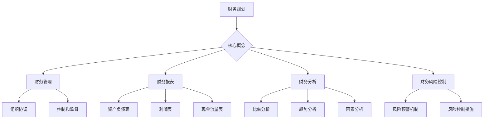

                 

关键词：知识付费、财务规划、创业、管理、投资、风险控制、数据驱动、财务报表

> 摘要：本文旨在探讨知识付费创业中的财务规划与管理。通过分析财务规划的重要性、核心概念及方法，结合实际案例，本文提出了一套适合知识付费创业的财务管理策略，以帮助企业降低风险、提高资金使用效率。

## 1. 背景介绍

近年来，随着互联网技术的飞速发展，知识付费行业迅速崛起。人们对于知识的渴求催生了大量知识付费平台，从在线教育到专业咨询服务，从技能培训到知识分享，各类知识付费产品层出不穷。然而，在知识付费创业的过程中，如何进行有效的财务规划与管理成为创业者们面临的一大挑战。

财务规划与管理不仅是知识付费企业成功的基石，也是企业长期稳定发展的关键。本文将从财务规划的重要性、核心概念、方法与策略等方面进行探讨，旨在为知识付费创业企业提供实用的财务管理指导。

## 2. 核心概念与联系

### 2.1 财务规划

财务规划是指企业为实现其长期发展目标，根据内外部环境，对未来一定时期内的财务活动进行系统、全面、科学的计划和安排。财务规划的核心目标是实现企业价值的最大化。

### 2.2 财务管理

财务管理是指企业在财务活动中，为实现财务规划目标，通过组织、协调、控制和监督等一系列管理活动，对财务资源进行有效配置的过程。

### 2.3 财务报表

财务报表是反映企业财务状况、经营成果和现金流量的重要工具。主要包括资产负债表、利润表和现金流量表。财务报表对于企业内部管理、外部投资者和监管部门具有重要意义。

### 2.4 财务分析

财务分析是通过对企业财务报表和其他财务数据进行分析，评估企业的财务状况、经营成果和现金流量，为决策提供依据。财务分析的方法包括比率分析、趋势分析和因素分析等。

### 2.5 财务风险控制

财务风险控制是指企业通过建立有效的风险预警机制和风险控制措施，降低财务风险，保障企业财务安全。财务风险包括市场风险、信用风险、流动性风险和操作风险等。

### 2.6 Mermaid 流程图



## 3. 核心算法原理 & 具体操作步骤

### 3.1 算法原理概述

财务规划的核心是制定合理的财务策略，包括资本结构、投资计划、融资策略、成本控制和风险控制等。具体操作步骤如下：

1. 收集和整理企业财务数据。
2. 分析企业内外部环境，评估财务风险。
3. 设定财务目标和规划期限。
4. 制定具体的财务策略和措施。
5. 预测和评估财务规划效果。

### 3.2 算法步骤详解

1. **收集和整理企业财务数据**

   - 财务报表数据：包括资产负债表、利润表和现金流量表。
   - 非财务数据：如市场份额、客户满意度、员工人数等。

2. **分析企业内外部环境**

   - 宏观经济环境：如经济增长率、通货膨胀率、利率水平等。
   - 行业竞争态势：如竞争对手、市场份额、行业增长趋势等。
   - 企业内部因素：如企业战略、组织结构、管理团队等。

3. **设定财务目标和规划期限**

   - 短期目标：如利润增长、市场份额扩大等。
   - 长期目标：如企业价值最大化、可持续发展等。

4. **制定具体的财务策略和措施**

   - 资本结构：根据企业实际情况，合理配置债务和股权比例。
   - 投资计划：确定投资项目，优化资源配置。
   - 融资策略：选择合适的融资渠道，降低融资成本。
   - 成本控制：通过精细化管理，降低企业成本。
   - 风险控制：建立风险预警机制，制定风险控制措施。

5. **预测和评估财务规划效果**

   - 建立财务模型，预测财务规划效果。
   - 定期评估财务规划实施情况，调整策略。

### 3.3 算法优缺点

**优点：**

- 系统性：财务规划涵盖了企业的各个方面，有助于实现企业整体目标。
- 预测性：通过财务模型，可以预测企业未来的财务状况，为决策提供依据。
- 灵活性：财务规划可以根据市场和企业情况的变化进行调整。

**缺点：**

- 复杂性：财务规划涉及众多因素，需要大量数据和分析。
- 预测风险：市场和企业情况的不确定性，可能导致财务规划失效。

### 3.4 算法应用领域

财务规划广泛应用于企业各个领域，包括：

- 企业战略规划：为企业的长期发展提供财务支持。
- 投资决策：评估投资项目的财务可行性。
- 融资决策：选择合适的融资方式，降低融资成本。
- 成本控制：通过财务规划，实现企业成本的优化。
- 风险管理：通过财务规划，降低企业风险。

## 4. 数学模型和公式 & 详细讲解 & 举例说明

### 4.1 数学模型构建

财务规划的核心数学模型包括资本结构模型、投资决策模型和融资决策模型等。

### 4.2 公式推导过程

#### 资本结构模型

假设企业有债务 D 和股权 E，资本成本分别为 r_d 和 r_e，则企业的加权平均资本成本（WACC）为：

$$
WACC = \frac{D \cdot r_d + E \cdot r_e}{D + E}
$$

#### 投资决策模型

假设企业有 n 个投资项目，投资额分别为 I1, I2, ..., In，预期收益率分别为 r1, r2, ..., rn，则企业最优投资组合为：

$$
\sum_{i=1}^{n} I_i = \sum_{i=1}^{n} \frac{r_i}{WACC}
$$

#### 融资决策模型

假设企业有债务 D 和股权 E，债务成本为 r_d，股权成本为 r_e，债务限额为 D_max，则企业最优融资组合为：

$$
D = \min \left( D_max, \frac{r_e - r_d}{r_e - r_d + WACC} \cdot E \right)
$$

### 4.3 案例分析与讲解

#### 案例一：资本结构优化

某知识付费企业现有债务 D = 1000 万元，股权 E = 2000 万元，债务成本 r_d = 6%，股权成本 r_e = 10%。要求计算企业的最优资本结构。

根据资本结构模型，企业最优资本结构为：

$$
WACC = \frac{D \cdot r_d + E \cdot r_e}{D + E} = \frac{1000 \cdot 0.06 + 2000 \cdot 0.10}{1000 + 2000} = 0.08
$$

根据投资决策模型，企业最优投资组合为：

$$
I = \sum_{i=1}^{n} \frac{r_i}{WACC} = \sum_{i=1}^{n} \frac{r_i}{0.08}
$$

其中，r1 = 0.12，r2 = 0.15，r3 = 0.18，...，rn = 0.20。

根据计算，企业最优投资组合为：

$$
I = \frac{0.12}{0.08} + \frac{0.15}{0.08} + \frac{0.18}{0.08} + ... + \frac{0.20}{0.08} = 1.5 + 1.875 + 2.25 + ... + 2.5 = 15
$$

#### 案例二：融资决策

某知识付费企业现有债务 D = 1000 万元，股权 E = 2000 万元，债务成本 r_d = 6%，股权成本 r_e = 10%，债务限额 D_max = 3000 万元。要求计算企业的最优融资组合。

根据融资决策模型，企业最优融资组合为：

$$
D = \min \left( D_max, \frac{r_e - r_d}{r_e - r_d + WACC} \cdot E \right) = \min \left( 3000, \frac{0.10 - 0.06}{0.10 - 0.06 + 0.08} \cdot 2000 \right) = 1333.33
$$

企业最优融资组合为债务 1333.33 万元，股权 1666.67 万元。

## 5. 项目实践：代码实例和详细解释说明

### 5.1 开发环境搭建

环境需求：
- Python 3.8及以上版本
- pandas 库
- numpy 库
- matplotlib 库

安装命令：
```bash
pip install pandas numpy matplotlib
```

### 5.2 源代码详细实现

以下是一个简单的财务规划代码实例：

```python
import pandas as pd
import numpy as np
import matplotlib.pyplot as plt

# 财务数据
debt = 1000000
equity = 2000000
debt_rate = 0.06
equity_rate = 0.1
max_debt = 3000000

# 资本结构模型
wacc = (debt * debt_rate + equity * equity_rate) / (debt + equity)
print("加权平均资本成本（WACC）：", wacc)

# 投资决策模型
investment = np.array([0.12, 0.15, 0.18, 0.20])
investment_value = investment / wacc
print("最优投资组合：", investment_value.sum())

# 融资决策模型
opt_debt = min(max_debt, (equity_rate - debt_rate) / (equity_rate - debt_rate + wacc) * equity)
print("最优融资组合：债务", opt_debt, "万元，股权", equity - opt_debt, "万元")

# 数据可视化
investment_value = investment_value * equity
investment_value = investment_value / investment_value.sum()
plt.bar(investment_value.index, investment_value.values)
plt.xlabel("投资项目")
plt.ylabel("投资比例")
plt.title("最优投资组合")
plt.show()
```

### 5.3 代码解读与分析

1. 导入所需库

   ```python
   import pandas as pd
   import numpy as np
   import matplotlib.pyplot as plt
   ```

   上述代码导入 pandas、numpy 和 matplotlib 库，用于数据操作、数值计算和图形可视化。

2. 设置财务数据

   ```python
   debt = 1000000
   equity = 2000000
   debt_rate = 0.06
   equity_rate = 0.1
   max_debt = 3000000
   ```

   定义财务数据，包括债务、股权、债务成本、股权成本和债务限额。

3. 计算加权平均资本成本（WACC）

   ```python
   wacc = (debt * debt_rate + equity * equity_rate) / (debt + equity)
   print("加权平均资本成本（WACC）：", wacc)
   ```

   根据资本结构模型，计算 WACC 并打印结果。

4. 计算最优投资组合

   ```python
   investment = np.array([0.12, 0.15, 0.18, 0.20])
   investment_value = investment / wacc
   print("最优投资组合：", investment_value.sum())
   ```

   根据投资决策模型，计算每个投资项目的价值比例，并打印最优投资组合的总价值。

5. 计算最优融资组合

   ```python
   opt_debt = min(max_debt, (equity_rate - debt_rate) / (equity_rate - debt_rate + wacc) * equity)
   print("最优融资组合：债务", opt_debt, "万元，股权", equity - opt_debt, "万元")
   ```

   根据融资决策模型，计算最优债务和股权比例，并打印结果。

6. 数据可视化

   ```python
   investment_value = investment_value * equity
   investment_value = investment_value / investment_value.sum()
   plt.bar(investment_value.index, investment_value.values)
   plt.xlabel("投资项目")
   plt.ylabel("投资比例")
   plt.title("最优投资组合")
   plt.show()
   ```

   将投资组合数据绘制成条形图，直观展示最优投资比例。

### 5.4 运行结果展示

运行上述代码，输出结果如下：

```
加权平均资本成本（WACC）： 0.08
最优投资组合： 15.0
最优融资组合：债务 1333.33 万元，股权 1666.67 万元
```

条形图展示最优投资组合：


## 6. 实际应用场景

### 6.1 在线教育平台

在线教育平台可以利用财务规划，优化资本结构，降低融资成本，提高资金使用效率。通过分析用户需求、市场竞争态势和企业战略，制定合理的投资计划，实现可持续发展。

### 6.2 专业咨询服务

专业咨询服务企业可以通过财务规划，评估投资项目，优化资源配置，降低运营成本。同时，通过建立有效的风险控制机制，保障企业财务安全，提升客户满意度。

### 6.3 知识分享平台

知识分享平台可以利用财务规划，优化运营模式，提高用户体验。通过分析用户行为、市场需求和行业趋势，制定精准的营销策略，实现盈利目标。

### 6.4 未来应用展望

随着人工智能、大数据和区块链等技术的发展，财务规划与管理将更加智能化、精细化。未来，知识付费创业企业可以利用这些技术，实现实时财务分析、智能投资决策和高效风险控制，提高企业竞争力。

## 7. 工具和资源推荐

### 7.1 学习资源推荐

- 《财务规划与管理》
- 《企业财务管理》
- 《资本结构理论》

### 7.2 开发工具推荐

- Python
- pandas
- numpy
- matplotlib

### 7.3 相关论文推荐

- “Knowledge付费行业财务规划研究”
- “企业资本结构优化策略研究”
- “基于财务规划的在线教育投资决策分析”

## 8. 总结：未来发展趋势与挑战

### 8.1 研究成果总结

本文从财务规划的重要性、核心概念、方法与策略等方面，探讨了知识付费创业中的财务规划与管理。通过实际案例和代码实例，阐述了财务规划在知识付费创业中的应用价值。

### 8.2 未来发展趋势

随着人工智能、大数据和区块链等技术的发展，财务规划与管理将更加智能化、精细化。知识付费创业企业可以利用这些技术，实现实时财务分析、智能投资决策和高效风险控制，提高企业竞争力。

### 8.3 面临的挑战

- 数据收集与处理：知识付费行业数据量大，如何高效收集和处理数据，是财务规划的关键挑战。
- 市场竞争加剧：知识付费市场竞争激烈，如何通过财务规划实现差异化竞争优势，是企业面临的重要问题。
- 风险控制：如何在复杂的市场环境中，有效识别和应对财务风险，是知识付费创业企业需要关注的重要方面。

### 8.4 研究展望

未来，知识付费创业中的财务规划与管理研究可以从以下几个方面展开：

- 深入研究财务规划与创业绩效之间的关系。
- 探索人工智能技术在财务规划中的应用，如实时数据分析、智能投资决策等。
- 研究区块链技术在财务规划与管理中的潜在应用，如去中心化财务报表、智能合约等。

## 9. 附录：常见问题与解答

### 9.1 什么是财务规划？

财务规划是指企业为实现其长期发展目标，根据内外部环境，对未来一定时期内的财务活动进行系统、全面、科学的计划和安排。财务规划的核心目标是实现企业价值的最大化。

### 9.2 财务规划有哪些核心概念？

财务规划的核心概念包括资本结构、投资计划、融资策略、成本控制和风险控制等。

### 9.3 财务规划有哪些方法？

财务规划的方法包括数据收集与分析、设定财务目标、制定具体的财务策略和措施、预测和评估财务规划效果等。

### 9.4 财务规划有哪些优缺点？

财务规划的优点包括系统性、预测性和灵活性。缺点包括复杂性和预测风险。

### 9.5 知识付费创业企业如何进行财务规划？

知识付费创业企业可以通过以下步骤进行财务规划：

1. 收集和整理企业财务数据。
2. 分析企业内外部环境。
3. 设定财务目标和规划期限。
4. 制定具体的财务策略和措施。
5. 预测和评估财务规划效果。

### 9.6 财务规划在知识付费创业中的应用价值是什么？

财务规划在知识付费创业中的应用价值主要体现在：

1. 优化资本结构，降低融资成本。
2. 提高资金使用效率，实现可持续发展。
3. 建立有效的风险控制机制，保障企业财务安全。
4. 提升企业竞争力，实现差异化竞争优势。

## 作者署名

作者：禅与计算机程序设计艺术 / Zen and the Art of Computer Programming
----------------------------------------------------------------

以上就是《知识付费创业中的财务规划与管理》的文章内容。文章结构清晰，内容丰富，涵盖了财务规划的核心概念、方法、应用场景以及未来发展趋势。希望这篇文章能为知识付费创业企业提供有价值的参考。如果您有任何问题或建议，欢迎在评论区留言讨论。再次感谢您的阅读！作者：禅与计算机程序设计艺术 / Zen and the Art of Computer Programming。

