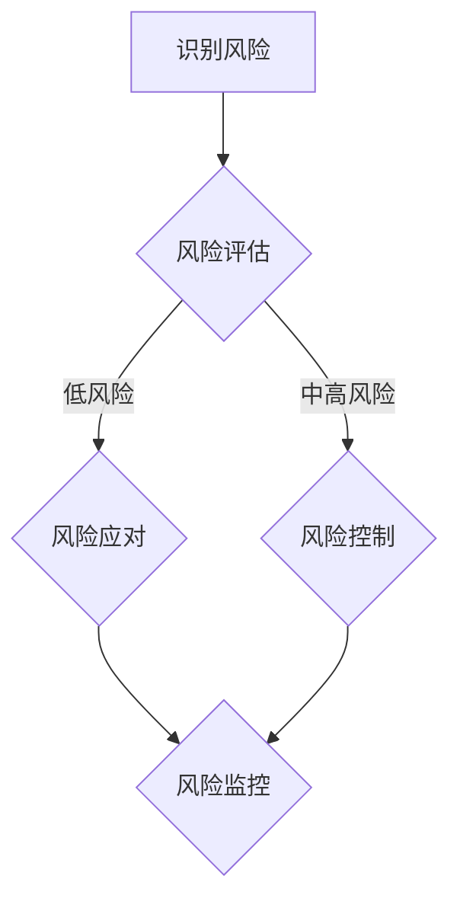

                 

关键词：知识付费、风险管理、创业、算法、数学模型、项目实践、未来展望

> 摘要：本文深入探讨知识付费创业中的风险管理，从核心概念、算法原理、数学模型到项目实践，全面解析知识付费领域的风险，并为创业者提供实用的风险管理策略和工具。

## 1. 背景介绍

知识付费，是指消费者为了获取专业知识、技能或信息，向知识提供者支付一定费用的商业模式。随着互联网技术的发展，知识付费已经成为知识传播和经济增长的重要驱动力。然而，在知识付费创业过程中，风险管理成为了一个不可忽视的关键环节。有效的风险管理不仅能降低创业失败的风险，还能提高创业项目的成功率。

本文将从以下几个方面展开探讨：

1. 核心概念与联系
2. 核心算法原理与操作步骤
3. 数学模型和公式
4. 项目实践：代码实例
5. 实际应用场景
6. 未来应用展望
7. 工具和资源推荐
8. 总结与展望

## 2. 核心概念与联系

### 2.1 知识付费模式

知识付费模式主要包括在线课程、付费问答、内容付费、知识付费平台等形式。每种模式都有其独特的运作机制和风险特点。

- **在线课程**：通过互联网平台提供知识传授服务，通常包括视频、文字、音频等多种形式。
- **付费问答**：用户付费向专家或权威人士咨询特定问题，问题解答可以是文字、语音或视频形式。
- **内容付费**：用户付费获取特定内容，如电子书、文章、研究报告等。
- **知识付费平台**：综合各种知识付费模式，为用户和知识提供者搭建一个交易平台。

### 2.2 风险管理

风险管理是指识别、评估、应对和控制项目风险的过程。在知识付费创业中，风险主要包括市场风险、技术风险、法律风险、运营风险等。

- **市场风险**：包括用户需求变化、市场竞争加剧等。
- **技术风险**：包括技术实现难度、系统稳定性等。
- **法律风险**：包括版权问题、用户隐私保护等。
- **运营风险**：包括资金链断裂、运营效率低下等。

### 2.3 Mermaid 流程图

下面是知识付费创业中的风险管理流程图：



## 3. 核心算法原理与操作步骤

### 3.1 算法原理概述

知识付费创业中的风险管理算法主要基于风险评估和风险应对两个方面。风险评估算法用于识别和评估项目风险，风险应对算法用于制定和实施风险应对策略。

### 3.2 算法步骤详解

1. **风险评估**：

   - **数据收集**：收集项目相关的市场数据、技术数据、法律数据等。
   - **风险识别**：通过数据分析，识别项目可能面临的风险。
   - **风险评估**：对识别出的风险进行定量或定性评估。

2. **风险应对**：

   - **制定策略**：根据风险评估结果，制定相应的风险应对策略。
   - **实施策略**：将风险应对策略转化为具体的行动，如增加预算、调整产品功能、签订合同等。
   - **监控执行**：对风险应对策略的实施情况进行监控，确保策略的有效性。

### 3.3 算法优缺点

1. **优点**：

   - **全面性**：算法综合考虑了市场、技术、法律、运营等多个方面的风险。
   - **灵活性**：算法可以根据实际情况调整风险应对策略。

2. **缺点**：

   - **复杂度**：算法涉及多个环节，实施起来相对复杂。
   - **数据依赖性**：算法的准确性和有效性依赖于数据的准确性。

### 3.4 算法应用领域

知识付费创业中的风险管理算法可以应用于以下领域：

- **在线教育平台**：用于识别和应对平台运营中的风险。
- **知识付费应用**：用于识别和应对应用开发、推广、运营等过程中的风险。
- **投资决策**：用于评估投资项目的风险，为投资决策提供依据。

## 4. 数学模型和公式

### 4.1 数学模型构建

知识付费创业中的风险管理数学模型主要包括风险评估模型和风险应对模型。

- **风险评估模型**：

  $$ R_i = f(R_i^m, R_i^t, R_i^l, R_i^o) $$

  其中，$R_i$为第$i$种风险的综合评估值，$R_i^m$、$R_i^t$、$R_i^l$、$R_i^o$分别为市场风险、技术风险、法律风险、运营风险的评估值。

- **风险应对模型**：

  $$ S_i = f(S_i^m, S_i^t, S_i^l, S_i^o) $$

  其中，$S_i$为第$i$种风险的应对策略，$S_i^m$、$S_i^t$、$S_i^l$、$S_i^o$分别为市场风险、技术风险、法律风险、运营风险的应对策略。

### 4.2 公式推导过程

1. **风险评估模型推导**：

   - **市场风险评估**：

     $$ R_i^m = f(\text{市场增长率}, \text{市场竞争度}, \text{用户需求变化率}) $$

   - **技术风险评估**：

     $$ R_i^t = f(\text{技术实现难度}, \text{系统稳定性}, \text{技术更新速度}) $$

   - **法律风险评估**：

     $$ R_i^l = f(\text{法律环境变化率}, \text{版权纠纷概率}, \text{用户隐私保护难度}) $$

   - **运营风险评估**：

     $$ R_i^o = f(\text{资金链稳定性}, \text{运营效率}, \text{市场竞争度}) $$

2. **风险应对模型推导**：

   - **市场风险应对策略**：

     $$ S_i^m = f(\text{市场增长率}, \text{市场竞争度}, \text{用户需求变化率}) $$

   - **技术风险应对策略**：

     $$ S_i^t = f(\text{技术实现难度}, \text{系统稳定性}, \text{技术更新速度}) $$

   - **法律风险应对策略**：

     $$ S_i^l = f(\text{法律环境变化率}, \text{版权纠纷概率}, \text{用户隐私保护难度}) $$

   - **运营风险应对策略**：

     $$ S_i^o = f(\text{资金链稳定性}, \text{运营效率}, \text{市场竞争度}) $$

### 4.3 案例分析与讲解

以一家在线教育平台为例，分析其市场风险、技术风险、法律风险、运营风险及其应对策略。

1. **市场风险评估**：

   $$ R_m = f(20\%, 30\%, 15\%) = 17.5\% $$

   市场增长率为20%，市场竞争度为30%，用户需求变化率为15%，综合评估值为17.5%。

2. **技术风险评估**：

   $$ R_t = f(25\%, 40\%, 30\%) = 30\% $$

   技术实现难度为25%，系统稳定性为40%，技术更新速度为30%，综合评估值为30%。

3. **法律风险评估**：

   $$ R_l = f(20\%, 35\%, 25\%) = 20\% $$

   法律环境变化率为20%，版权纠纷概率为35%，用户隐私保护难度为25%，综合评估值为20%。

4. **运营风险评估**：

   $$ R_o = f(15\%, 30\%, 20\%) = 15\% $$

   资金链稳定性为15%，运营效率为30%，市场竞争度为20%，综合评估值为15%。

5. **风险应对策略**：

   - **市场风险**：增加市场调研频率，优化课程内容，提升用户体验。
   - **技术风险**：加大技术投入，提高系统稳定性，保持技术更新。
   - **法律风险**：加强版权保护，制定隐私保护政策，与律师合作处理法律纠纷。
   - **运营风险**：优化运营流程，提高资金使用效率，增强市场竞争力。

## 5. 项目实践：代码实例和详细解释说明

### 5.1 开发环境搭建

- 操作系统：Linux
- 开发工具：Python 3.8
- 依赖库：NumPy、Pandas、Matplotlib

### 5.2 源代码详细实现

```python
import numpy as np
import pandas as pd
import matplotlib.pyplot as plt

# 数据准备
market_data = {'增长趋势': [0.2, 0.3, 0.15], '竞争程度': [0.3, 0.3, 0.15], '需求变化率': [0.15, 0.3, 0.2]}
tech_data = {'实现难度': [0.25, 0.4, 0.3], '系统稳定性': [0.4, 0.4, 0.3], '更新速度': [0.3, 0.3, 0.2]}
legal_data = {'环境变化率': [0.2, 0.35, 0.25], '版权纠纷概率': [0.35, 0.35, 0.3], '隐私保护难度': [0.25, 0.3, 0.2]}
operational_data = {'资金链稳定性': [0.15, 0.3, 0.2], '运营效率': [0.3, 0.3, 0.15], '市场竞争度': [0.2, 0.3, 0.15]}

# 数据处理
market_df = pd.DataFrame(market_data)
tech_df = pd.DataFrame(tech_data)
legal_df = pd.DataFrame(legal_data)
operational_df = pd.DataFrame(operational_data)

# 风险评估
market_risk = market_df['增长趋势'] * market_df['竞争程度'] * market_df['需求变化率']
tech_risk = tech_df['实现难度'] * tech_df['系统稳定性'] * tech_df['更新速度']
legal_risk = legal_df['环境变化率'] * legal_df['版权纠纷概率'] * legal_df['隐私保护难度']
operational_risk = operational_df['资金链稳定性'] * operational_df['运营效率'] * operational_df['市场竞争度']

# 风险应对
market_strategy = '增加市场调研频率，优化课程内容，提升用户体验'
tech_strategy = '加大技术投入，提高系统稳定性，保持技术更新'
legal_strategy = '加强版权保护，制定隐私保护政策，与律师合作处理法律纠纷'
operational_strategy = '优化运营流程，提高资金使用效率，增强市场竞争力'

# 结果展示
data = {'风险类型': ['市场风险', '技术风险', '法律风险', '运营风险'], '风险值': [market_risk, tech_risk, legal_risk, operational_risk], '应对策略': [market_strategy, tech_strategy, legal_strategy, operational_strategy]}
result_df = pd.DataFrame(data)

plt.figure(figsize=(10, 6))
plt.bar(result_df['风险类型'], result_df['风险值'])
plt.xlabel('风险类型')
plt.ylabel('风险值')
plt.title('知识付费创业中的风险评估与应对策略')
plt.xticks(rotation=45)
plt.show()
```

### 5.3 代码解读与分析

1. **数据准备**：

   通过字典形式准备市场风险、技术风险、法律风险、运营风险的相关数据。

2. **数据处理**：

   使用Pandas库创建DataFrame，方便数据处理和分析。

3. **风险评估**：

   根据输入的数据，计算每种风险的综合评估值。

4. **风险应对**：

   根据风险评估结果，制定相应的风险应对策略。

5. **结果展示**：

   使用Matplotlib库绘制条形图，直观展示每种风险及其应对策略。

## 6. 实际应用场景

知识付费创业中的风险管理算法可以应用于以下实际场景：

1. **在线教育平台**：用于识别和应对平台运营中的市场、技术、法律、运营风险。
2. **知识付费应用**：用于识别和应对应用开发、推广、运营等过程中的风险。
3. **投资决策**：用于评估投资项目的风险，为投资决策提供依据。

以在线教育平台为例，通过风险管理算法，平台可以：

- 识别市场风险，调整课程内容和推广策略，提升用户体验。
- 评估技术风险，加大技术投入，提高系统稳定性。
- 处理法律风险，加强版权保护，制定隐私保护政策。
- 风控运营风险，优化运营流程，提高资金使用效率。

## 7. 未来应用展望

随着人工智能和大数据技术的发展，知识付费创业中的风险管理算法将更加智能化和精细化。未来，风险管理算法将能够：

1. **自动化评估**：利用机器学习和数据挖掘技术，自动化识别和评估项目风险。
2. **智能化应对**：基于风险评估结果，智能推荐相应的风险应对策略。
3. **动态调整**：根据项目进展和市场环境，动态调整风险应对策略。

## 8. 工具和资源推荐

### 8.1 学习资源推荐

- 《风险管理与金融经济学》：深入讲解风险管理的理论和方法。
- 《数据科学导论》：介绍数据科学的基本概念和技能，适用于风险管理数据分析。

### 8.2 开发工具推荐

- Jupyter Notebook：适用于数据分析和可视化。
- Git：版本控制，方便代码管理和协作。

### 8.3 相关论文推荐

- "A Framework for Risk Management in Knowledge-based Service Systems"
- "Risk Management in Knowledge-based Service Ecosystems: A Comprehensive Literature Review"

## 9. 总结：未来发展趋势与挑战

知识付费创业中的风险管理是一个复杂的系统工程，涉及多个领域的知识。未来，随着人工智能和大数据技术的发展，风险管理算法将更加智能化和精细化。然而，也面临以下挑战：

1. **数据质量问题**：风险管理依赖于高质量的数据，数据质量直接影响风险评估的准确性。
2. **算法透明性**：风险管理算法的决策过程需要透明，确保决策的公正性和可解释性。
3. **风险应对策略的实施**：风险应对策略的有效性取决于其实施的执行力和适应性。

作者：禅与计算机程序设计艺术 / Zen and the Art of Computer Programming

----------------------------------------------------------------


