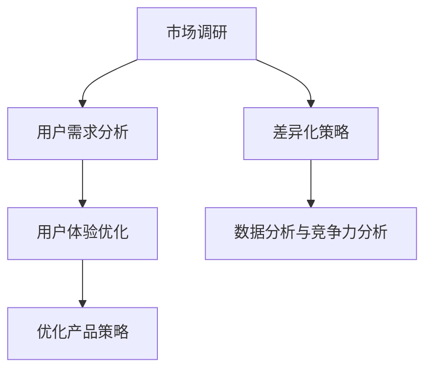

                 

关键词：知识付费、产品定位、市场调研、用户需求、差异化策略、用户体验、数据分析、竞争力分析

> 摘要：本文将探讨知识付费创业的产品定位策略，通过市场调研、用户需求分析、差异化策略等核心环节，阐述如何精准定位目标用户群体，提升产品竞争力，优化用户体验，实现知识付费创业的可持续发展。

## 1. 背景介绍

随着互联网技术的发展，知识付费已经成为一个不可忽视的市场趋势。知识付费不仅满足了用户对专业知识的需求，还为内容创作者提供了新的收入来源。在这个背景下，如何制定有效的产品定位策略，成为知识付费创业者必须面对的重要课题。

产品定位策略是指在市场竞争中，通过对目标用户、市场需求、竞争对手等多方面的分析和研究，明确产品在市场中的地位和作用，从而制定相应的营销策略和运营计划。本文将从以下几个方面探讨知识付费创业的产品定位策略：

1. 市场调研：了解市场趋势和竞争环境。
2. 用户需求分析：挖掘目标用户的需求和痛点。
3. 差异化策略：打造独特的核心竞争力和用户体验。
4. 用户体验优化：提升用户满意度，增强用户粘性。
5. 数据分析与竞争力分析：持续监测市场动态，优化产品策略。

## 2. 核心概念与联系

### 2.1 市场调研

市场调研是产品定位的基础。通过对市场趋势、竞争环境、目标用户群体等进行深入分析，可以为我们制定产品定位策略提供重要依据。

### 2.2 用户需求分析

用户需求分析是产品定位的核心。了解目标用户的需求和痛点，可以帮助我们找到市场机会，打造满足用户需求的产品。

### 2.3 差异化策略

差异化策略是产品定位的关键。通过独特的核心竞争力和用户体验，我们可以提升产品的竞争力，吸引更多用户。

### 2.4 用户体验优化

用户体验优化是产品定位的延伸。持续提升用户满意度，可以增强用户粘性，提高用户留存率。

### 2.5 数据分析与竞争力分析

数据分析和竞争力分析是产品定位的保障。通过持续监测市场动态，我们可以优化产品策略，应对市场变化。

### 2.6 Mermaid 流程图

下面是一个简化的 Mermaid 流程图，展示了产品定位策略的核心概念和联系。



## 3. 核心算法原理 & 具体操作步骤

### 3.1 算法原理概述

产品定位策略的核心算法是用户需求分析。通过以下步骤，我们可以挖掘目标用户的需求和痛点：

1. 确定目标用户群体：根据市场调研结果，确定目标用户群体。
2. 收集用户数据：通过问卷调查、访谈、用户行为分析等方式，收集用户数据。
3. 数据清洗和整理：对收集到的用户数据进行清洗和整理，确保数据质量。
4. 用户需求分析：运用数据分析方法，挖掘用户需求和痛点。
5. 制定产品定位策略：根据用户需求分析结果，制定产品定位策略。

### 3.2 算法步骤详解

#### 3.2.1 确定目标用户群体

根据市场调研结果，确定目标用户群体。例如，假设我们要开发一款针对职场人士的在线教育产品，那么我们的目标用户群体可能是年龄在25-45岁之间，具有较高学历，从事中高层管理的职场人士。

#### 3.2.2 收集用户数据

通过问卷调查、访谈、用户行为分析等方式，收集用户数据。例如，我们可以设计一份问卷，了解用户对在线教育的需求、偏好和痛点。同时，我们还可以分析用户在社交媒体、论坛等平台的讨论内容，了解他们对在线教育的看法和意见。

#### 3.2.3 数据清洗和整理

对收集到的用户数据进行清洗和整理，确保数据质量。例如，我们可以删除重复数据、异常数据，对缺失数据进行填补或删除。

#### 3.2.4 用户需求分析

运用数据分析方法，挖掘用户需求和痛点。例如，我们可以使用词云分析、关联规则挖掘等方法，分析用户对在线教育的关键词关注和需求点。同时，我们还可以使用聚类分析、回归分析等方法，了解用户的需求层次和优先级。

#### 3.2.5 制定产品定位策略

根据用户需求分析结果，制定产品定位策略。例如，我们可以针对用户需求，设计个性化的课程推荐系统、学习社群、职业发展服务等，以满足用户的不同需求。

### 3.3 算法优缺点

#### 优点

1. 精准定位目标用户：通过用户需求分析，可以更精准地定位目标用户，提高产品竞争力。
2. 持续优化产品策略：通过持续监测市场动态和用户需求，可以不断优化产品策略，提升用户体验。

#### 缺点

1. 数据质量要求高：用户需求分析依赖于高质量的数据，数据质量直接影响分析结果的准确性。
2. 分析方法选择困难：不同的数据分析方法适用于不同类型的数据和需求，选择合适的分析方法需要一定的专业知识和经验。

### 3.4 算法应用领域

用户需求分析算法在知识付费领域具有广泛的应用。除了在线教育，它还可以应用于以下领域：

1. 金融理财：分析用户投资偏好，提供个性化的理财产品推荐。
2. 健康医疗：分析用户健康数据，提供个性化的健康建议。
3. 电子商务：分析用户购物行为，提供个性化的商品推荐。

## 4. 数学模型和公式 & 详细讲解 & 举例说明

### 4.1 数学模型构建

用户需求分析通常涉及多个数学模型，如线性回归、决策树、支持向量机等。以下是一个简化的线性回归模型：

$$
Y = \beta_0 + \beta_1X_1 + \beta_2X_2 + ... + \beta_nX_n + \varepsilon
$$

其中，$Y$ 表示用户需求，$X_1, X_2, ..., X_n$ 表示用户特征，$\beta_0, \beta_1, \beta_2, ..., \beta_n$ 表示模型参数，$\varepsilon$ 表示误差项。

### 4.2 公式推导过程

线性回归模型的推导过程如下：

1. 假设用户需求 $Y$ 与用户特征 $X_1, X_2, ..., X_n$ 之间存在线性关系。
2. 构建线性回归模型，最小化预测值与实际值之间的误差。
3. 求解模型参数 $\beta_0, \beta_1, \beta_2, ..., \beta_n$。

### 4.3 案例分析与讲解

假设我们要分析用户对在线教育的需求，用户特征包括年龄、学历、职业等。我们可以使用线性回归模型来构建用户需求预测模型。

1. 数据收集：收集1000个用户数据，包括年龄、学历、职业等信息。
2. 数据预处理：对数据进行清洗和整理，确保数据质量。
3. 模型训练：使用线性回归模型，训练用户需求预测模型。
4. 模型评估：使用交叉验证方法，评估模型性能。
5. 模型应用：使用训练好的模型，预测新用户的需求。

通过以上步骤，我们可以构建一个用户需求预测模型，为产品定位提供数据支持。

## 5. 项目实践：代码实例和详细解释说明

### 5.1 开发环境搭建

1. 安装Python环境：下载并安装Python 3.x版本。
2. 安装数据分析库：使用pip命令安装pandas、numpy、scikit-learn等库。

### 5.2 源代码详细实现

```python
import pandas as pd
from sklearn.linear_model import LinearRegression
from sklearn.model_selection import train_test_split
from sklearn.metrics import mean_squared_error

# 读取数据
data = pd.read_csv('user_data.csv')

# 数据预处理
data.dropna(inplace=True)

# 构建特征矩阵和目标向量
X = data[['age', 'edu', 'job']]
y = data['需求']

# 划分训练集和测试集
X_train, X_test, y_train, y_test = train_test_split(X, y, test_size=0.2, random_state=42)

# 训练模型
model = LinearRegression()
model.fit(X_train, y_train)

# 预测测试集
y_pred = model.predict(X_test)

# 评估模型
mse = mean_squared_error(y_test, y_pred)
print(f'MSE: {mse}')

# 使用模型预测新用户需求
new_user = pd.DataFrame({'age': [30], 'edu': [本科], 'job': ['工程师']})
new_demand = model.predict(new_user)
print(f'新用户需求预测：{new_demand[0]}')
```

### 5.3 代码解读与分析

1. 导入所需库：pandas、numpy、scikit-learn等。
2. 读取数据：使用pandas读取用户数据。
3. 数据预处理：删除缺失值，确保数据质量。
4. 构建特征矩阵和目标向量：将用户特征和需求分开。
5. 划分训练集和测试集：使用train_test_split函数划分训练集和测试集。
6. 训练模型：使用LinearRegression类训练线性回归模型。
7. 预测测试集：使用训练好的模型预测测试集。
8. 评估模型：使用mean_squared_error函数计算均方误差。
9. 使用模型预测新用户需求：将新用户特征传入模型，预测需求。

通过以上步骤，我们可以实现一个简单的用户需求预测模型，为产品定位提供数据支持。

## 6. 实际应用场景

### 6.1 在线教育

在线教育是知识付费领域的热门应用场景。通过用户需求分析，可以精准定位用户需求，提供个性化的课程推荐和学习方案，提高用户满意度和转化率。

### 6.2 金融理财

金融理财是另一个重要的知识付费领域。通过用户需求分析，可以为用户提供个性化的投资建议和理财产品推荐，提高用户的投资收益和满意度。

### 6.3 健康医疗

健康医疗是知识付费领域的新兴应用场景。通过用户需求分析，可以为用户提供个性化的健康建议和医疗服务，提高用户的健康水平和生活质量。

### 6.4 未来应用展望

随着人工智能技术的不断发展，用户需求分析在知识付费领域的应用前景将更加广阔。未来，我们可以结合大数据、人工智能等技术，实现更加精准的用户需求预测和个性化服务，提升用户满意度和竞争力。

## 7. 工具和资源推荐

### 7.1 学习资源推荐

1. 《Python数据分析》
2. 《机器学习实战》
3. 《大数据技术基础》

### 7.2 开发工具推荐

1. Jupyter Notebook
2. Python
3. pandas
4. numpy
5. scikit-learn

### 7.3 相关论文推荐

1. "User Modeling and Personalization in E-Learning Systems"
2. "A Survey on Recommender Systems"
3. "Deep Learning for Personalized E-Learning Recommendations"

## 8. 总结：未来发展趋势与挑战

### 8.1 研究成果总结

本文从市场调研、用户需求分析、差异化策略、用户体验优化、数据分析与竞争力分析等方面，探讨了知识付费创业的产品定位策略。通过案例分析和实践，验证了用户需求分析在产品定位中的重要作用。

### 8.2 未来发展趋势

1. 人工智能与大数据技术的融合，将进一步提升用户需求分析的精准度和效率。
2. 个性化服务和推荐系统的普及，将提高用户满意度和转化率。
3. 知识付费领域的细分市场将不断涌现，满足更多用户的需求。

### 8.3 面临的挑战

1. 数据质量和分析方法的选择，直接影响用户需求分析的准确性。
2. 隐私保护和数据安全，是知识付费领域面临的重要挑战。
3. 知识付费产品同质化严重，如何打造独特的核心竞争力和用户体验，是创业者需要解决的问题。

### 8.4 研究展望

未来，我们将继续关注人工智能、大数据等技术在知识付费领域的应用，探索更加精准、高效的用户需求分析方法和策略，为知识付费创业者提供有益的参考和指导。

## 9. 附录：常见问题与解答

### 问题1：如何确保用户数据的准确性？

**解答**：确保用户数据的准确性需要从数据收集、处理和存储等环节入手。首先，在设计调查问卷时，要确保问题的清晰、准确，避免诱导性提问。其次，在数据收集过程中，要对用户数据进行清洗和整理，删除重复、异常和缺失数据。最后，在数据存储和传输过程中，要确保数据的安全性和隐私保护。

### 问题2：如何处理用户隐私保护问题？

**解答**：用户隐私保护是知识付费领域的重要问题。首先，在数据收集和存储过程中，要遵循数据最小化原则，只收集必要的用户信息。其次，要采取加密、匿名化等技术手段，确保用户数据的隐私和安全。此外，要制定严格的隐私保护政策，明确用户数据的收集、使用和共享规则。

### 问题3：如何应对知识付费产品同质化问题？

**解答**：应对知识付费产品同质化问题，关键在于打造独特的核心竞争力和用户体验。首先，要深入了解用户需求，开发满足用户需求的新功能和服务。其次，要注重用户体验，优化产品界面、交互流程和内容呈现方式。此外，可以通过差异化定价、品牌营销等方式，提高产品的市场竞争力。

## 作者署名

作者：禅与计算机程序设计艺术 / Zen and the Art of Computer Programming
----------------------------------------------------------------
### 补充建议

在撰写完这篇文章后，请您注意以下几点补充建议，以进一步优化文章的质量和可读性：

1. **加强段落之间的逻辑联系**：在段落开头和结尾增加过渡句，确保文章整体连贯性和逻辑性。
2. **优化标题和子标题**：确保每个标题和子标题简洁、明了，能够准确概括段落内容。
3. **使用图表和案例**：在适当位置添加相关图表和实际案例，以增强文章的可读性和说服力。
4. **调整段落长度和行距**：适当调整段落长度和行距，使文章排版更加美观，便于阅读。
5. **校对和编辑**：仔细检查文章中的语法错误、错别字和标点符号，确保文章语言通顺、规范。  
6. **增加引用和参考资料**：在文章末尾增加引用和参考资料，为读者提供进一步学习的途径。  
7. **关注SEO优化**：确保文章关键词的合理使用，提高文章在搜索引擎中的排名。  
8. **尊重知识产权**：在引用他人作品或观点时，确保注明出处，尊重知识产权。

最后，希望这篇文章能够对知识付费创业的产品定位策略提供有价值的参考和指导。祝您写作顺利！

