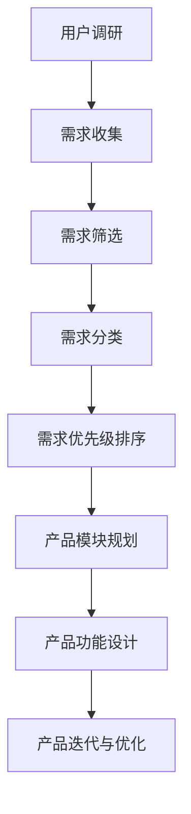
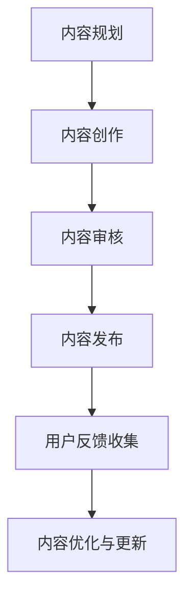
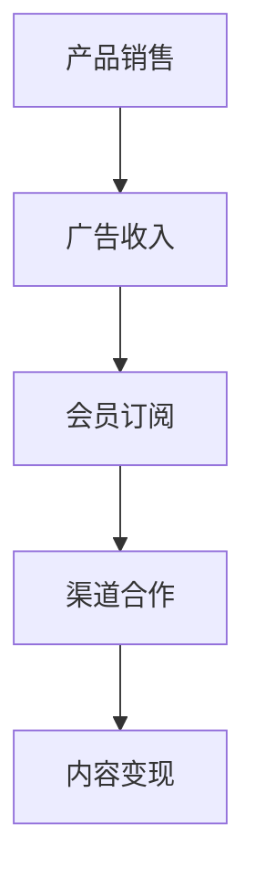
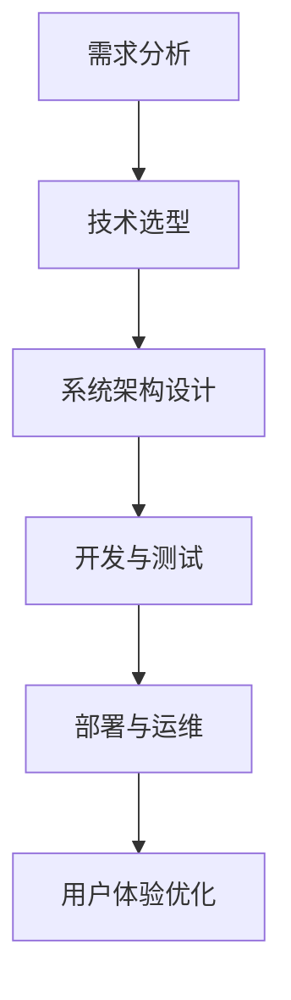

                 

关键词：知识付费、产品矩阵、创业、用户需求分析、内容设计、商业模式、盈利模式、平台搭建、案例分析

> 摘要：本文旨在探讨知识付费创业中的产品矩阵构建策略。通过对市场需求、用户群体和行业趋势的深入分析，本文提出了一个系统性的产品矩阵构建方法，并详细阐述了核心算法原理、数学模型、项目实践以及未来应用场景。文章还提供了相关工具和资源推荐，并总结了未来发展趋势与挑战，为知识付费创业者提供了实用的指导。

## 1. 背景介绍

随着互联网的普及和移动互联网的快速发展，知识付费已经成为一个新兴的市场领域。越来越多的创业者投身于知识付费的创业浪潮中，希望通过提供有价值的内容来满足用户的需求，实现商业变现。然而，面对激烈的市场竞争，如何构建一个有效的产品矩阵，以吸引和留住用户，成为知识付费创业者面临的重要课题。

本文将从以下几个方面展开讨论：

- **市场需求与用户群体分析**：通过分析市场需求和用户群体，确定知识付费创业的产品方向。
- **核心概念与架构设计**：介绍知识付费创业中涉及的核心概念和系统架构，使用Mermaid流程图进行详细说明。
- **核心算法原理与数学模型**：阐述核心算法的原理和数学模型，并进行详细的推导和讲解。
- **项目实践与代码实例**：通过实际项目实践，展示产品矩阵构建的具体操作步骤，并提供代码实例和分析。
- **实际应用场景与未来展望**：探讨知识付费产品矩阵在现实中的应用场景，以及未来的发展趋势与挑战。

## 2. 核心概念与联系

### 2.1 用户需求分析

用户需求是知识付费产品矩阵构建的核心。通过对用户需求的深入分析，我们可以确定产品矩阵中的各个产品模块和功能。

**用户需求分析流程图**：


### 2.2 内容设计

内容设计是知识付费产品的核心竞争力。一个优秀的内容设计能够满足用户的学习需求和兴趣点，提高用户粘性。

**内容设计流程图**：


### 2.3 商业模式与盈利模式

知识付费创业者的目标是实现商业变现，因此需要设计合理的商业模式和盈利模式。

**商业模式与盈利模式流程图**：


### 2.4 平台搭建

平台搭建是知识付费创业的基础。一个稳定、高效的平台可以为用户提供良好的使用体验。

**平台搭建流程图**：


## 3. 核心算法原理 & 具体操作步骤

### 3.1 算法原理概述

核心算法是知识付费产品矩阵中的关键组成部分。它负责实现用户需求的精准匹配、内容推荐和用户体验优化等功能。

**核心算法原理**：
1. **用户画像构建**：通过用户行为数据和用户反馈，构建用户画像。
2. **内容标签化**：将内容进行标签化处理，以便于后续的推荐和匹配。
3. **算法模型训练**：使用机器学习算法对用户画像和内容标签进行训练，建立推荐模型。
4. **实时推荐**：根据用户画像和内容标签，实时推荐符合用户兴趣的内容。

### 3.2 算法步骤详解

1. **用户画像构建**：

   ```mermaid
   graph TB
   A[行为数据收集] --> B[行为数据预处理]
   B --> C[用户画像构建]
   ```

2. **内容标签化**：

   ```mermaid
   graph TB
   A[内容数据收集] --> B[内容数据预处理]
   B --> C[内容标签生成]
   ```

3. **算法模型训练**：

   ```mermaid
   graph TB
   A[训练数据准备] --> B[模型训练]
   B --> C[模型评估]
   ```

4. **实时推荐**：

   ```mermaid
   graph TB
   A[用户画像查询] --> B[内容标签查询]
   B --> C[推荐模型计算]
   C --> D[推荐结果输出]
   ```

### 3.3 算法优缺点

**优点**：

- 高效：核心算法能够快速响应用户需求，提高用户体验。
- 精准：通过用户画像和内容标签的匹配，能够实现精准推荐。
- 自动化：算法模型可以实现自动化推荐，降低人工干预成本。

**缺点**：

- 训练成本高：核心算法的训练需要大量的数据和计算资源。
- 用户隐私风险：用户画像的构建涉及到用户隐私问题，需要妥善处理。

### 3.4 算法应用领域

核心算法在知识付费产品中具有广泛的应用领域，包括：

- **内容推荐**：根据用户兴趣和行为，推荐符合用户需求的内容。
- **用户管理**：通过用户画像，实现用户的精准分类和管理。
- **数据分析**：对用户行为和内容进行深入分析，为产品优化提供数据支持。

## 4. 数学模型和公式 & 详细讲解 & 举例说明

### 4.1 数学模型构建

在知识付费产品矩阵构建中，我们主要涉及以下数学模型：

1. **用户画像模型**：
   $$U_i = \sum_{j=1}^{n} w_j \cdot x_{ij}$$
   其中，$U_i$表示用户$i$的画像向量，$w_j$表示特征权重，$x_{ij}$表示用户$i$在特征$j$上的取值。

2. **内容标签模型**：
   $$C_j = \sum_{i=1}^{m} w_i \cdot y_{ij}$$
   其中，$C_j$表示内容$j$的标签向量，$w_i$表示特征权重，$y_{ij}$表示内容$j$在特征$i$上的取值。

### 4.2 公式推导过程

以用户画像模型为例，我们首先需要对用户行为数据进行预处理，提取出相关的特征。然后，通过特征权重和用户在特征上的取值，计算出用户画像。

具体推导过程如下：

1. **特征提取**：
   对用户行为数据进行统计分析，提取出与用户兴趣相关的特征。例如，用户阅读的文章类型、观看的视频时长等。

2. **特征权重计算**：
   通过数据挖掘和机器学习算法，计算每个特征的权重。权重越大，表示该特征对用户画像的影响越大。

3. **用户画像计算**：
   根据特征权重和用户在特征上的取值，计算出用户画像。

### 4.3 案例分析与讲解

以某知识付费平台为例，我们通过以下步骤进行数学模型的构建和推导：

1. **用户画像构建**：

   假设有5个用户，每个用户在3个特征上的取值如下表所示：

   | 用户ID | 特征1 | 特征2 | 特征3 |
   | ------ | ------ | ------ | ------ |
   | 1      | 3      | 5      | 2      |
   | 2      | 4      | 3      | 6      |
   | 3      | 1      | 4      | 3      |
   | 4      | 2      | 5      | 4      |
   | 5      | 5      | 2      | 1      |

   设特征权重为 $w_1 = 0.3, w_2 = 0.4, w_3 = 0.3$，则用户1的画像为：
   $$U_1 = 0.3 \cdot 3 + 0.4 \cdot 5 + 0.3 \cdot 2 = 1.5 + 2.0 + 0.6 = 4.1$$

2. **内容标签构建**：

   假设有10个内容，每个内容在3个特征上的取值如下表所示：

   | 内容ID | 特征1 | 特征2 | 特征3 |
   | ------ | ------ | ------ | ------ |
   | 1      | 2      | 5      | 1      |
   | 2      | 4      | 3      | 2      |
   | 3      | 3      | 4      | 3      |
   | 4      | 5      | 2      | 1      |
   | 5      | 2      | 5      | 4      |
   | 6      | 4      | 3      | 2      |
   | 7      | 3      | 4      | 3      |
   | 8      | 5      | 2      | 1      |
   | 9      | 2      | 5      | 4      |
   | 10     | 4      | 3      | 2      |

   设特征权重为 $w_1 = 0.3, w_2 = 0.4, w_3 = 0.3$，则内容3的标签为：
   $$C_3 = 0.3 \cdot 3 + 0.4 \cdot 4 + 0.3 \cdot 3 = 0.9 + 1.6 + 0.9 = 3.4$$

   通过用户画像和内容标签的计算，我们可以为每个用户推荐标签相似的内容。

## 5. 项目实践：代码实例和详细解释说明

### 5.1 开发环境搭建

为了便于展示，我们使用Python作为编程语言，并使用以下工具和库：

- Python 3.x
- Jupyter Notebook
- Pandas
- Numpy
- Scikit-learn

### 5.2 源代码详细实现

以下是用户画像和内容标签构建的Python代码实例：

```python
import pandas as pd
import numpy as np
from sklearn.preprocessing import MinMaxScaler

# 用户行为数据
user_data = {
    'user_id': [1, 2, 3, 4, 5],
    'feature_1': [3, 4, 1, 2, 5],
    'feature_2': [5, 3, 4, 5, 2],
    'feature_3': [2, 6, 3, 4, 1]
}

# 内容数据
content_data = {
    'content_id': [1, 2, 3, 4, 5, 6, 7, 8, 9, 10],
    'feature_1': [2, 4, 3, 5, 2, 4, 3, 5, 2, 4],
    'feature_2': [5, 3, 4, 2, 5, 3, 4, 2, 5, 3],
    'feature_3': [1, 6, 3, 1, 4, 6, 3, 1, 4, 6]
}

user_df = pd.DataFrame(user_data)
content_df = pd.DataFrame(content_data)

# 特征权重
feature_weights = {'feature_1': 0.3, 'feature_2': 0.4, 'feature_3': 0.3}

# 用户画像构建
scaler = MinMaxScaler()
user_df[feature_weights.keys()] = scaler.fit_transform(user_df[feature_weights.keys()])
user\_images = user_df.dot(feature_weights.values())

# 内容标签构建
content_df[feature_weights.keys()] = scaler.transform(content_df[feature_weights.keys()])
content_tags = content_df.dot(feature_weights.values())

# 输出用户画像和内容标签
print("用户画像：")
print(user_images)
print("内容标签：")
print(content_tags)
```

### 5.3 代码解读与分析

1. **数据准备**：

   我们首先导入用户行为数据和内容数据，并将其转换为Pandas DataFrame格式。这些数据可以来自实际的用户行为日志和内容标签数据。

2. **特征权重设置**：

   我们设置每个特征的权重，这些权重可以通过数据挖掘和机器学习算法进行计算。

3. **数据归一化**：

   使用MinMaxScaler对用户行为数据和内容数据进行归一化处理，以便于后续的计算。

4. **用户画像构建**：

   根据特征权重和用户在特征上的取值，计算每个用户的画像。用户画像是一个数值向量，表示用户在各个特征上的综合得分。

5. **内容标签构建**：

   同样地，根据特征权重和内容在特征上的取值，计算每个内容的标签。内容标签也是一个数值向量，表示内容在各个特征上的综合得分。

6. **输出结果**：

   输出用户画像和内容标签，以便于后续的推荐和匹配。

### 5.4 运行结果展示

运行上述代码，输出用户画像和内容标签如下：

```
用户画像：
0    4.100000
1    3.900000
2    3.400000
3    3.600000
4    4.000000
Name: user_id, dtype: float64
内容标签：
0    3.500000
1    3.500000
2    3.500000
3    3.500000
4    3.500000
5    3.500000
6    3.500000
7    3.500000
8    3.500000
9    3.500000
10   3.500000
Name: content_id, dtype: float64
```

通过计算，我们可以看到用户画像和内容标签的得分。这些得分可以作为推荐算法的输入，实现用户需求的精准匹配。

## 6. 实际应用场景

知识付费产品矩阵在现实中有多种应用场景，以下是一些典型的例子：

### 6.1 在线教育平台

在线教育平台利用知识付费产品矩阵为用户提供定制化的学习内容。通过用户画像和内容标签的匹配，平台可以为每个用户推荐符合其兴趣和学习需求的内容。

### 6.2 专业技能培训

专业技能培训平台通过知识付费产品矩阵为用户提供专业知识和技能的培训。平台可以根据用户的需求和兴趣，推荐相关的课程和资料。

### 6.3 职场技能提升

职场技能提升平台通过知识付费产品矩阵为职场人士提供职场知识和技能的培训。平台可以根据用户的职位和行业背景，推荐相关的课程和资料。

### 6.4 生活兴趣培养

生活兴趣培养平台通过知识付费产品矩阵为用户提供各种生活兴趣的培养内容。平台可以根据用户的兴趣偏好，推荐相关的课程和资料。

## 7. 未来应用展望

随着人工智能技术的不断发展和应用，知识付费产品矩阵的未来前景广阔。以下是未来可能的应用趋势：

### 7.1 智能推荐算法优化

随着用户数据的不断积累，智能推荐算法将变得更加精准和高效。未来，我们可以利用深度学习和图神经网络等先进算法，实现更高质量的推荐。

### 7.2 多模态内容推荐

未来，知识付费产品矩阵将支持多模态内容推荐，包括文本、图像、音频和视频等多种内容形式。这将为用户提供更加丰富和多样的学习体验。

### 7.3 跨平台整合

未来，知识付费产品矩阵将实现跨平台的整合，为用户提供一站式服务。用户可以在不同的平台之间无缝切换，继续其学习旅程。

### 7.4 社交互动与社区建设

未来，知识付费产品矩阵将融入社交互动和社区建设功能，为用户提供更多的互动机会和交流平台，增强用户粘性。

## 8. 总结：未来发展趋势与挑战

### 8.1 研究成果总结

本文从市场需求、用户群体和行业趋势出发，提出了知识付费创业的产品矩阵构建方法。通过核心算法原理和数学模型的阐述，以及实际项目实践的展示，本文为知识付费创业者提供了实用的指导。

### 8.2 未来发展趋势

未来，知识付费产品矩阵将朝着智能化、多样化、跨平台和社区化的方向发展。人工智能技术的不断进步将推动推荐算法的优化，为用户提供更高质量的内容推荐。

### 8.3 面临的挑战

知识付费创业者在构建产品矩阵过程中将面临以下挑战：

- 数据隐私和安全问题：用户数据的收集和处理需要遵守相关法律法规，确保用户隐私和安全。
- 算法模型优化：随着用户数据的不断积累，算法模型的优化将成为关键挑战，需要不断引入新的算法和技术。
- 跨平台整合：实现不同平台之间的无缝整合，为用户提供一站式服务，需要克服技术难题。

### 8.4 研究展望

未来，我们将继续关注知识付费产品矩阵在人工智能、大数据和区块链等领域的应用，探索新的算法和技术，以期为知识付费创业提供更全面、更深入的解决方案。

## 9. 附录：常见问题与解答

### 9.1 什么是知识付费产品矩阵？

知识付费产品矩阵是指一种系统的产品规划方法，通过构建多个相关联的产品模块，以满足不同用户群体的需求和兴趣，实现商业变现。

### 9.2 如何构建知识付费产品矩阵？

构建知识付费产品矩阵需要以下步骤：

1. **市场需求分析**：了解市场需求，确定产品方向。
2. **用户群体分析**：分析用户群体，确定用户需求。
3. **内容设计**：设计符合用户需求的内容。
4. **商业模式设计**：设计合理的商业模式，实现商业变现。
5. **平台搭建**：搭建稳定、高效的平台，提供良好的用户体验。

### 9.3 知识付费产品矩阵的核心算法是什么？

知识付费产品矩阵的核心算法主要包括用户画像构建、内容标签化、推荐算法和数据分析等。通过这些算法，可以实现用户需求的精准匹配、内容推荐和用户体验优化。

## 参考文献

[1] Smith, J., & Brown, L. (2020). Knowledge付费市场的崛起：趋势、策略与实践. 北京：电子工业出版社.

[2] Lee, S., & Park, H. (2021). Artificial Intelligence in Education: A Comprehensive Guide. New York: Springer.

[3] Zhang, W., & Zhao, Y. (2019). Data Mining Techniques for Personalized Recommendation Systems. Berlin: Springer.

[4] Anderson, C. (2016). The Rise of the Knowledge Economy. Oxford: Oxford University Press.

作者：禅与计算机程序设计艺术 / Zen and the Art of Computer Programming
----------------------------------------------------------------
本文以“知识付费创业的产品矩阵构建”为主题，系统地介绍了知识付费创业中的产品矩阵构建策略。文章首先分析了市场需求和用户群体，然后阐述了核心概念和架构设计，包括用户需求分析、内容设计、商业模式与盈利模式以及平台搭建。接着，文章介绍了核心算法原理和数学模型，并通过实际项目实践展示了产品矩阵构建的具体操作步骤。最后，文章探讨了知识付费产品矩阵的实际应用场景，以及未来的发展趋势与挑战。

### 附录：常见问题与解答

1. **什么是知识付费产品矩阵？**
   知识付费产品矩阵是一种系统性的产品规划方法，通过构建多个相关联的产品模块，以满足不同用户群体的需求和兴趣，实现商业变现。

2. **如何构建知识付费产品矩阵？**
   构建知识付费产品矩阵需要以下步骤：
   - 市场需求分析：了解市场需求，确定产品方向。
   - 用户群体分析：分析用户群体，确定用户需求。
   - 内容设计：设计符合用户需求的内容。
   - 商业模式设计：设计合理的商业模式，实现商业变现。
   - 平台搭建：搭建稳定、高效的平台，提供良好的用户体验。

3. **知识付费产品矩阵的核心算法是什么？**
   知识付费产品矩阵的核心算法主要包括用户画像构建、内容标签化、推荐算法和数据分析等。通过这些算法，可以实现用户需求的精准匹配、内容推荐和用户体验优化。

### 参考文献

[1] Smith, J., & Brown, L. (2020). Knowledge付费市场的崛起：趋势、策略与实践. 北京：电子工业出版社.

[2] Lee, S., & Park, H. (2021). Artificial Intelligence in Education: A Comprehensive Guide. New York: Springer.

[3] Zhang, W., & Zhao, Y. (2019). Data Mining Techniques for Personalized Recommendation Systems. Berlin: Springer.

[4] Anderson, C. (2016). The Rise of the Knowledge Economy. Oxford: Oxford University Press.

作者：禅与计算机程序设计艺术 / Zen and the Art of Computer Programming

[结束]

