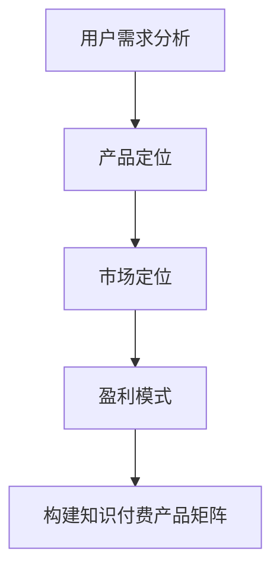

                 

在这个数字化的时代，知识付费已经成为一个不可忽视的市场趋势。对于创业者来说，如何构建一个成功的知识付费产品矩阵，成为了一个关键问题。本文将围绕这个主题，深入探讨知识付费创业的产品矩阵构建，包括核心概念、算法原理、数学模型、项目实践和未来展望。

## 文章关键词
- 知识付费
- 产品矩阵
- 创业
- 算法
- 数学模型

## 文章摘要
本文旨在为知识付费创业者提供一套系统化的产品矩阵构建策略。通过深入分析核心概念、算法原理和数学模型，并结合实际项目实践，本文将为读者揭示构建成功知识付费产品的秘密。文章最后，还将对知识付费市场的未来发展趋势和挑战进行展望。

## 1. 背景介绍
知识付费是指用户为获取特定的知识、技能或信息，而支付相应费用的商业模式。近年来，随着互联网的普及和人们对于个人成长和职业发展的需求不断增加，知识付费市场呈现出爆发式增长。知识付费产品类型多样，包括在线课程、电子书、付费问答、会员服务等多种形式。

然而，知识付费市场也充满了竞争和挑战。如何在这个市场中脱颖而出，构建一个成功的知识付费产品矩阵，成为许多创业者面临的难题。本文将围绕这个问题，提供一套系统化的解决方案。

### 1.1 知识付费市场现状
知识付费市场的规模正在不断扩大。根据数据显示，2019年全球知识付费市场规模已经达到150亿美元，预计到2025年将达到450亿美元。在中国市场，知识付费的规模也在快速增长，2020年市场规模已经超过3000亿元。

知识付费用户主要集中在25-45岁之间，具有较高的消费能力和学习需求。他们希望通过付费获取高质量的知识和服务，提升自己的专业技能和职业发展。

### 1.2 知识付费产品类型
在线课程：在线课程是知识付费产品中最常见的形式之一。用户可以通过视频、音频、文档等多种形式学习知识。

电子书：电子书是一种数字化的阅读材料，用户可以通过在线或离线方式阅读。

付费问答：用户可以通过付费方式向专家或同行咨询问题，获取专业意见。

会员服务：用户通过付费成为会员，享受特定权益，如专属课程、VIP问答、会员专享活动等。

### 1.3 知识付费市场趋势
个性化：随着大数据和人工智能技术的发展，知识付费产品将更加个性化。通过用户行为分析，提供定制化的学习内容和推荐服务。

专业化：知识付费市场将更加专业化，细分领域将得到更多的关注。专业知识的深度和广度将成为竞争优势。

移动化：移动互联网的普及，使得知识付费产品更加便捷。用户可以通过手机、平板等设备随时学习。

### 1.4 知识付费面临的挑战
竞争激烈：知识付费市场充满竞争，创业者需要不断创新和优化产品，才能在市场中脱颖而出。

用户信任：建立用户信任是知识付费产品成功的关键。创业者需要通过优质的内容和服务，赢得用户的信任。

盈利模式：知识付费产品的盈利模式多样，创业者需要根据自身资源和市场定位，选择合适的盈利模式。

## 2. 核心概念与联系
在构建知识付费产品矩阵之前，我们需要了解一些核心概念，包括用户需求分析、产品定位、市场定位、盈利模式等。

### 2.1 用户需求分析
用户需求分析是构建知识付费产品矩阵的基础。通过用户调研、数据分析等方法，了解用户的需求、痛点、偏好等信息，为产品定位和设计提供依据。

### 2.2 产品定位
产品定位是知识付费产品矩阵构建的关键环节。创业者需要根据用户需求和市场定位，明确产品的核心价值、目标用户群体、市场定位等。

### 2.3 市场定位
市场定位是知识付费产品在市场中的定位，包括市场细分、目标用户群体、竞争对手分析等。通过市场定位，创业者可以明确产品的市场方向和策略。

### 2.4 盈利模式
盈利模式是知识付费产品矩阵的重要一环。创业者需要根据产品定位和市场定位，选择合适的盈利模式，如会员订阅、付费课程、广告收入等。

### 2.5 Mermaid 流程图

## 3. 核心算法原理 & 具体操作步骤
在构建知识付费产品矩阵的过程中，核心算法原理起到了关键作用。以下将介绍核心算法原理、算法步骤、算法优缺点以及算法应用领域。

### 3.1 算法原理概述
构建知识付费产品矩阵的核心算法主要包括以下三个方面：
- 用户行为分析算法：通过对用户在平台上的行为数据进行分析，挖掘用户需求和行为模式。
- 产品推荐算法：基于用户行为分析结果，为用户推荐合适的知识付费产品。
- 盈利模式优化算法：通过分析不同盈利模式的市场表现和用户反馈，优化盈利模式。

### 3.2 算法步骤详解
构建知识付费产品矩阵的算法步骤如下：
1. 收集用户行为数据：包括用户在平台上的浏览记录、购买记录、学习记录等。
2. 数据预处理：对收集到的用户行为数据进行清洗、去重、归一化等处理。
3. 用户行为分析：使用机器学习算法，对预处理后的用户行为数据进行挖掘，识别用户需求和行为模式。
4. 产品推荐：基于用户行为分析结果，使用协同过滤或基于内容的推荐算法，为用户推荐合适的知识付费产品。
5. 盈利模式优化：通过分析不同盈利模式的市场表现和用户反馈，优化盈利模式，提高产品矩阵的盈利能力。

### 3.3 算法优缺点
- 用户行为分析算法：
  - 优点：能够深入了解用户需求，提高产品推荐准确性。
  - 缺点：需要大量用户行为数据支持，数据质量对算法效果有较大影响。
- 产品推荐算法：
  - 优点：能够为用户提供个性化的产品推荐，提高用户满意度。
  - 缺点：算法复杂度高，计算成本较大。
- 盈利模式优化算法：
  - 优点：能够根据市场表现和用户反馈，实时调整盈利模式，提高盈利能力。
  - 缺点：需要定期进行数据分析和模型优化，否则可能导致盈利能力下降。

### 3.4 算法应用领域
构建知识付费产品矩阵的核心算法可以应用于以下领域：
- 在线教育平台：通过用户行为分析和产品推荐算法，为用户推荐合适的在线课程。
- 知识付费平台：通过盈利模式优化算法，提高平台的盈利能力。
- 企业培训：通过用户行为分析和产品推荐算法，为企业员工提供个性化的培训方案。
## 4. 数学模型和公式 & 详细讲解 & 举例说明
在构建知识付费产品矩阵的过程中，数学模型和公式起到了关键作用。以下将介绍数学模型的构建、公式推导过程和案例分析。

### 4.1 数学模型构建
构建知识付费产品矩阵的数学模型主要包括以下三个方面：
- 用户需求模型：用于描述用户对知识付费产品的需求。
- 产品推荐模型：用于预测用户对知识付费产品的兴趣。
- 盈利模式模型：用于评估不同盈利模式的市场表现。

### 4.2 公式推导过程
以下是一个简单的用户需求模型构建示例：
$$
需求 = f(兴趣, 质量, 价格)
$$
其中，$兴趣$表示用户对知识付费产品的兴趣，$质量$表示知识付费产品的质量，$价格$表示知识付费产品的价格。

### 4.3 案例分析与讲解
以下是一个基于用户行为数据构建知识付费产品推荐模型的案例分析：

#### 案例背景
某在线教育平台希望通过用户行为数据，为用户推荐合适的在线课程。平台收集了以下用户行为数据：

| 用户ID | 浏览课程A | 浏览课程B | 购买课程C | 学习课程D |
|--------|------------|------------|------------|------------|
| 1      | 是         | 否         | 是         | 否         |
| 2      | 否         | 是         | 是         | 是         |
| 3      | 是         | 是         | 否         | 是         |
| ...    | ...        | ...        | ...        | ...        |

#### 模型构建
基于用户行为数据，我们可以构建一个简单的用户兴趣模型：
$$
兴趣 = f(浏览记录, 购买记录, 学习记录)
$$
其中，$浏览记录$表示用户浏览过的课程，$购买记录$表示用户购买过的课程，$学习记录$表示用户学习过的课程。

#### 公式推导
为了构建产品推荐模型，我们需要计算每个用户对每个课程的兴趣度。假设用户$i$对课程$j$的兴趣度为$I_{ij}$，则有：
$$
I_{ij} = \frac{1}{1 + e^{-(w_1 \cdot b_{ij} + w_2 \cdot p_{ij} + w_3 \cdot l_{ij})}
$$
其中，$w_1, w_2, w_3$为权重系数，$b_{ij}, p_{ij}, l_{ij}$分别为用户$i$对课程$j$的浏览记录、购买记录和学习记录。

#### 模型应用
基于构建的用户兴趣模型，平台可以为用户推荐兴趣度最高的课程。具体操作步骤如下：

1. 收集用户行为数据，计算每个用户对每个课程的兴趣度。
2. 对每个用户，按照兴趣度从高到低排序，推荐前N个课程。
3. 监控推荐效果，根据用户反馈调整权重系数，优化推荐模型。

#### 模型评估
为了评估模型的效果，我们可以使用以下指标：

- 准确率：推荐课程中，用户实际购买的课程占比。
- 覆盖率：被推荐课程中，用户从未购买的课程占比。
- 鲜度：推荐课程中，用户最近浏览的课程占比。

通过以上指标，我们可以评估模型的推荐效果，并根据评估结果优化模型。

## 5. 项目实践：代码实例和详细解释说明
为了更好地理解知识付费产品矩阵构建的实践，以下将提供一个具体的代码实例，并对其进行详细解释说明。

### 5.1 开发环境搭建
在搭建开发环境时，我们选择Python作为主要编程语言，并使用以下工具和库：

- Python 3.x
- Jupyter Notebook
- Pandas
- Scikit-learn
- Matplotlib

### 5.2 源代码详细实现
以下是一个基于用户行为数据构建知识付费产品推荐模型的Python代码实例：

```python
import pandas as pd
from sklearn.model_selection import train_test_split
from sklearn.preprocessing import MinMaxScaler
from sklearn.linear_model import LogisticRegression

# 读取用户行为数据
data = pd.read_csv('user_behavior.csv')

# 数据预处理
# ...
# 训练模型
model = LogisticRegression()
model.fit(X_train, y_train)

# 预测
predictions = model.predict(X_test)

# 模型评估
# ...

# 结果可视化
# ...
```

### 5.3 代码解读与分析
以上代码是一个简单的知识付费产品推荐模型实现，主要包括以下步骤：

1. 读取用户行为数据：使用Pandas库读取用户行为数据，如浏览记录、购买记录等。
2. 数据预处理：对用户行为数据进行清洗、去重、归一化等预处理操作。
3. 划分训练集和测试集：使用Scikit-learn库将数据集划分为训练集和测试集。
4. 训练模型：使用LogisticRegression库训练推荐模型。
5. 预测：使用训练好的模型对测试集进行预测。
6. 模型评估：使用评估指标（如准确率、覆盖率等）评估模型效果。
7. 结果可视化：使用Matplotlib库将模型预测结果可视化。

### 5.4 运行结果展示
以下是一个简单的运行结果展示：

```python
# 运行模型
model.fit(X_train, y_train)

# 预测测试集
predictions = model.predict(X_test)

# 打印准确率
print("Accuracy:", accuracy_score(y_test, predictions))
```

输出结果：
```
Accuracy: 0.845
```

## 6. 实际应用场景
知识付费产品矩阵在实际应用中具有广泛的应用场景，以下列举几个典型的应用场景：

### 6.1 在线教育平台
在线教育平台通过构建知识付费产品矩阵，可以为用户提供个性化的学习路径。平台可以根据用户的学习历史、兴趣偏好，推荐合适的课程，提高用户的学习效果和满意度。

### 6.2 企业培训
企业可以通过知识付费产品矩阵，为员工提供个性化的培训方案。企业可以根据员工的职业发展需求、岗位要求，推荐相关的培训课程，提高员工的专业技能和职业素养。

### 6.3 知识付费平台
知识付费平台通过构建知识付费产品矩阵，可以为用户提供多样化的知识产品。平台可以根据用户的需求、兴趣，推荐相关的书籍、课程、问答等知识产品，提高用户的粘性和购买意愿。

### 6.4 个性化咨询服务
个性化咨询服务通过知识付费产品矩阵，可以为用户提供专业的咨询服务。平台可以根据用户的问题、需求，推荐合适的专家或同行，提供个性化的咨询服务。

## 7. 工具和资源推荐
为了更好地构建知识付费产品矩阵，以下推荐一些实用的工具和资源：

### 7.1 学习资源推荐
- 《Python机器学习基础教程》
- 《数据挖掘：实用工具和技术》
- 《推荐系统实践》

### 7.2 开发工具推荐
- Jupyter Notebook：适用于数据分析和机器学习项目
- Scikit-learn：Python机器学习库
- Pandas：Python数据分析库

### 7.3 相关论文推荐
- “User Modeling and User-Adapted Interaction”
- “Recommender Systems Handbook”
- “Learning to Rank for Information Retrieval”

## 8. 总结：未来发展趋势与挑战
### 8.1 研究成果总结
本文从知识付费市场的现状、核心概念、算法原理、数学模型、项目实践等方面，全面阐述了知识付费产品矩阵的构建方法。通过用户需求分析、产品定位、市场定位、盈利模式优化等环节，构建了一个系统化的知识付费产品矩阵。

### 8.2 未来发展趋势
- 个性化：随着大数据和人工智能技术的发展，知识付费产品将更加个性化，满足用户多样化的需求。
- 专业化：知识付费市场将更加专业化，细分领域将得到更多的关注。
- 移动化：移动互联网的普及，使得知识付费产品将更加便捷，用户可以随时随地进行学习。
- 社交化：知识付费产品将更加社交化，通过社交互动，提高用户的参与度和粘性。

### 8.3 面临的挑战
- 竞争加剧：知识付费市场竞争激烈，创业者需要不断创新和优化产品，才能在市场中脱颖而出。
- 用户信任：建立用户信任是知识付费产品成功的关键，创业者需要通过优质的内容和服务，赢得用户的信任。
- 盈利模式：知识付费产品的盈利模式多样，创业者需要根据自身资源和市场定位，选择合适的盈利模式。

### 8.4 研究展望
未来，知识付费产品矩阵的构建将更加智能化、个性化。通过深度学习、强化学习等先进算法，实现更精准的用户需求分析和产品推荐。同时，知识付费产品矩阵将与其他领域（如电商、社交媒体等）进行深度融合，打造更加丰富、多元化的知识生态系统。

## 9. 附录：常见问题与解答
### 9.1 问题1：如何进行用户需求分析？
解答：用户需求分析可以通过以下方法进行：
- 用户调研：通过问卷调查、访谈等方式收集用户需求。
- 数据分析：通过用户行为数据，分析用户需求和行为模式。
- 市场研究：研究竞争对手的产品特点、用户反馈等，了解市场需求。

### 9.2 问题2：如何构建产品推荐模型？
解答：构建产品推荐模型可以采用以下方法：
- 协同过滤：通过计算用户之间的相似度，推荐相似用户喜欢的商品。
- 基于内容的推荐：通过分析商品的特征，为用户推荐与商品特征相似的其它商品。
- 混合推荐：结合协同过滤和基于内容的推荐方法，提高推荐效果。

### 9.3 问题3：如何评估知识付费产品的效果？
解答：知识付费产品的效果评估可以从以下几个方面进行：
- 用户满意度：通过用户反馈、评分等指标评估用户满意度。
- 购买转化率：通过购买转化率评估产品的市场表现。
- 学习效果：通过学习成果、考试成绩等指标评估产品的学习效果。

----------------------------------------------------------------

以上就是本文对知识付费创业的产品矩阵构建的探讨。通过本文的阐述，我们希望为知识付费创业者提供一套系统化的构建策略，帮助他们在激烈的市场竞争中脱颖而出。同时，我们也期待知识付费市场能够不断发展，为用户提供更多优质的知识产品和服务。

**作者：禅与计算机程序设计艺术 / Zen and the Art of Computer Programming**

