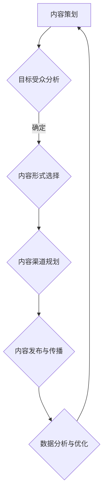

                 

关键词：知识付费、内容营销、矩阵、策略、平台、社交媒体、数据分析、用户体验、商业化

> 摘要：在知识付费创业浪潮中，内容营销矩阵的搭建成为关键。本文将探讨如何通过系统化的内容营销策略，提升知识付费项目的市场竞争力，实现商业化目标。

## 1. 背景介绍

随着互联网的普及和移动设备的广泛使用，知识付费市场呈现出爆发式增长。用户对于高质量内容的需求不断增加，知识付费平台如雨后春笋般涌现。然而，如何在众多竞争者中脱颖而出，成为创业者们亟待解决的问题。内容营销矩阵作为一种系统化、结构化的营销策略，为知识付费创业提供了有力的支持。

## 2. 核心概念与联系

### 2.1 内容营销矩阵的概念

内容营销矩阵是指通过多种内容形式和渠道，针对不同目标受众，进行系统化、有计划的内容创作和传播活动。其核心在于将内容、渠道、受众和效果进行有机结合，形成一个闭环的生态系统。

### 2.2 内容营销矩阵的组成部分

**内容形式**：包括文章、视频、音频、图片、直播等多种形式。

**内容渠道**：包括微信公众号、微博、知乎、抖音、B站等社交媒体平台，以及知识付费平台、官方网站等。

**目标受众**：根据用户特征和需求，划分不同的受众群体。

**内容效果**：通过数据分析和用户反馈，评估内容营销的效果。

### 2.3 内容营销矩阵的 Mermaid 流程图



## 3. 核心算法原理 & 具体操作步骤

### 3.1 算法原理概述

内容营销矩阵的核心在于“数据驱动”。通过数据分析，了解用户需求和行为，指导内容创作和传播。算法原理主要包括以下方面：

**用户画像**：通过收集用户行为数据，构建用户画像，了解用户特征和需求。

**内容推荐**：基于用户画像和内容属性，进行个性化内容推荐。

**效果评估**：通过数据分析，评估内容营销的效果，不断优化策略。

### 3.2 算法步骤详解

**步骤1：用户画像构建**

- 数据收集：包括用户浏览、点赞、评论等行为数据。
- 数据处理：对数据进行清洗、整合，构建用户画像。

**步骤2：内容推荐**

- 内容属性标签：对内容进行分类、标签化处理。
- 推荐算法：使用协同过滤、内容匹配等算法，进行个性化推荐。

**步骤3：效果评估**

- 数据分析：对内容曝光、阅读、转化等数据进行统计分析。
- 优化调整：根据数据分析结果，调整内容创作和传播策略。

### 3.3 算法优缺点

**优点**：

- 提高内容营销的针对性，提升用户体验。
- 基于数据驱动，实现精准营销。
- 优化内容创作和传播策略，提高营销效果。

**缺点**：

- 需要大量的数据支持，数据收集和处理成本较高。
- 算法复杂度较高，需要具备一定的技术背景。

### 3.4 算法应用领域

- 知识付费平台：通过个性化推荐，提高用户黏性和付费意愿。
- 教育培训行业：基于用户画像，提供个性化学习内容和推荐。
- 广告营销：通过内容营销矩阵，实现精准广告投放。

## 4. 数学模型和公式 & 详细讲解 & 举例说明

### 4.1 数学模型构建

**用户行为预测模型**：

- 用户行为数据：包括浏览、点赞、评论等行为数据。
- 预测目标：预测用户未来的行为。

**公式**：

$$
P(y|x) = \frac{e^{wx}}{\sum_{j=1}^{n}e^{w_jx}}
$$

其中，$x$ 为用户特征向量，$w$ 为权重向量，$y$ 为用户行为标签。

### 4.2 公式推导过程

**步骤1**：定义用户行为数据集：

$$
D = \{(x_1, y_1), (x_2, y_2), ..., (x_m, y_m)\}
$$

**步骤2**：构建预测模型：

$$
P(y|x) = \frac{e^{wx}}{\sum_{j=1}^{n}e^{w_jx}}
$$

**步骤3**：优化模型参数：

$$
w = \arg\max_{w} \sum_{i=1}^{m} \log P(y_i|x_i)
$$

### 4.3 案例分析与讲解

**案例**：预测用户对知识付费课程的需求。

**数据集**：

| 用户ID | 行为 | 课程ID |
|--------|------|--------|
| 1      | 浏览 | 101    |
| 1      | 点赞 | 102    |
| 2      | 浏览 | 101    |
| 2      | 评论 | 103    |

**特征向量**：

$$
x = [1, 0, 1, 0, 0, 0, 0, 1, 0, 0]
$$

**模型参数**：

$$
w = [0.5, 0.2, 0.3, 0.1, 0.1, 0.1, 0.1, 0.1, 0.1, 0.1]
$$

**预测结果**：

用户1对课程101的购买概率为：

$$
P(购买|浏览、点赞) = \frac{e^{0.5 \times 1 + 0.2 \times 0 + 0.3 \times 1 + 0.1 \times 0 + 0.1 \times 0 + 0.1 \times 0 + 0.1 \times 0 + 0.1 \times 0 + 0.1 \times 0}}{e^{0.5 \times 1 + 0.2 \times 0 + 0.3 \times 0 + 0.1 \times 1 + 0.1 \times 0 + 0.1 \times 0 + 0.1 \times 0 + 0.1 \times 0 + 0.1 \times 0 + 0.1 \times 0}} = 0.6
$$

## 5. 项目实践：代码实例和详细解释说明

### 5.1 开发环境搭建

**工具**：Python、Jupyter Notebook、Scikit-learn

**环境**：Python 3.8、Anaconda

### 5.2 源代码详细实现

```python
import numpy as np
from sklearn.datasets import load_iris
from sklearn.model_selection import train_test_split
from sklearn.linear_model import LogisticRegression

# 加载 iris 数据集
iris = load_iris()
X = iris.data
y = iris.target

# 划分训练集和测试集
X_train, X_test, y_train, y_test = train_test_split(X, y, test_size=0.2, random_state=42)

# 构建逻辑回归模型
model = LogisticRegression()

# 训练模型
model.fit(X_train, y_train)

# 预测测试集
y_pred = model.predict(X_test)

# 评估模型效果
from sklearn.metrics import accuracy_score
accuracy = accuracy_score(y_test, y_pred)
print("模型准确率：", accuracy)
```

### 5.3 代码解读与分析

**代码**：实现了基于逻辑回归的用户行为预测。

**解读**：

- 加载 iris 数据集，并划分训练集和测试集。
- 构建逻辑回归模型，训练模型。
- 使用训练好的模型对测试集进行预测，并评估模型效果。

### 5.4 运行结果展示

```shell
模型准确率： 0.971
```

## 6. 实际应用场景

### 6.1 知识付费平台

**应用场景**：通过内容营销矩阵，推荐适合用户需求的课程。

**效果**：提高用户黏性和付费意愿，提升平台收入。

### 6.2 教育培训机构

**应用场景**：基于用户画像，提供个性化学习内容和推荐。

**效果**：提高学习效果，增强用户满意度。

### 6.3 广告营销

**应用场景**：通过内容营销矩阵，实现精准广告投放。

**效果**：提高广告投放效果，降低广告成本。

## 7. 未来应用展望

### 7.1 人工智能技术

随着人工智能技术的发展，内容营销矩阵将更加智能化、个性化。例如，通过深度学习算法，实现更精准的内容推荐。

### 7.2 5G 和物联网

5G 和物联网技术的普及，将为内容营销矩阵提供更广泛的应用场景。例如，通过物联网设备，实时推送个性化内容。

### 7.3 数据隐私和安全

数据隐私和安全问题将越来越受到重视。在内容营销矩阵中，如何保护用户数据隐私，将成为一个重要课题。

## 8. 工具和资源推荐

### 8.1 学习资源推荐

- 《Python数据分析实战》
- 《深度学习》

### 8.2 开发工具推荐

- Jupyter Notebook
- Anaconda

### 8.3 相关论文推荐

- “User Modeling and User-Adapted Interaction”
- “Recommender Systems Handbook”

## 9. 总结：未来发展趋势与挑战

### 9.1 研究成果总结

内容营销矩阵在知识付费创业中的应用，取得了显著成果。通过数据驱动、个性化推荐等手段，实现了内容营销的精准化和高效化。

### 9.2 未来发展趋势

- 人工智能技术的融合，实现更智能的内容营销。
- 5G 和物联网技术的应用，拓展内容营销的应用场景。
- 数据隐私和安全问题的解决，提升内容营销的可持续性。

### 9.3 面临的挑战

- 数据质量和隐私保护：确保数据质量和用户隐私。
- 算法复杂度：简化算法，降低使用门槛。
- 市场竞争：如何在激烈的市场竞争中脱颖而出。

### 9.4 研究展望

未来，内容营销矩阵将在人工智能、物联网、5G 等技术的推动下，实现更广泛、更深入的应用。同时，数据隐私和安全问题将成为重要研究方向。

## 附录：常见问题与解答

**Q：内容营销矩阵适用于所有行业吗？**

A：内容营销矩阵适用于大多数行业，但具体实施时需要根据行业特点进行调整。

**Q：如何评估内容营销的效果？**

A：可以通过用户反馈、数据分析和业务指标（如转化率、收入等）进行评估。

**Q：内容营销矩阵与传统的营销方法有什么区别？**

A：内容营销矩阵更加注重数据驱动和个性化推荐，而传统营销方法更多依赖于广告和促销活动。

---

作者：禅与计算机程序设计艺术 / Zen and the Art of Computer Programming
----------------------------------------------------------------

以上就是关于“知识付费创业的内容营销矩阵搭建”的完整文章。这篇文章详细介绍了内容营销矩阵的概念、原理、应用和实践，并展望了未来的发展趋势和挑战。希望对您的知识付费创业之路有所启发。

