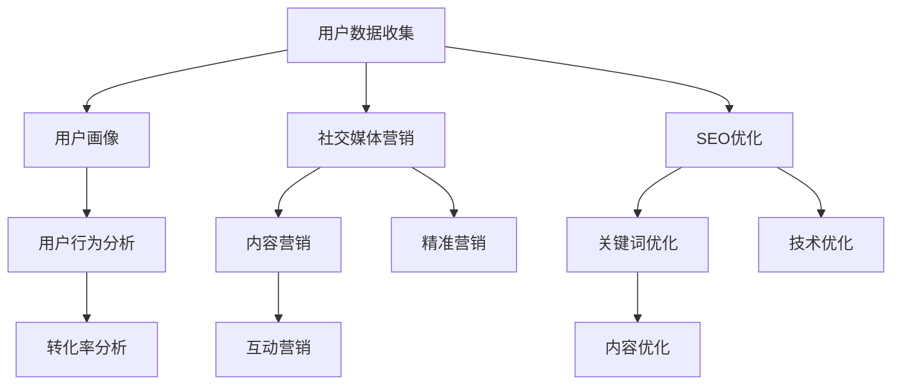

                 

关键词：知识付费、增长黑客、创业、营销策略、数据分析、用户增长、社交媒体、SEO

> 摘要：本文将探讨知识付费领域创业者的增长黑客技巧，包括如何运用数据分析、社交媒体和SEO等工具，实现用户快速增长和业务持续增长。通过案例分析，为创业者提供实用的策略和启示。

## 1. 背景介绍

知识付费是一种在线教育模式，用户通过支付一定费用获取专业知识和技能。随着互联网技术的发展，知识付费市场迅速扩张，吸引了大量创业者进入。然而，在激烈的市场竞争中，如何实现用户增长和业务持续增长，成为创业者面临的一大挑战。

增长黑客（Growth Hacker）是近年来兴起的一个概念，指的是通过创新技术和策略，实现快速增长的目标。增长黑客的核心思想是将市场营销和产品开发紧密结合，利用数据分析、用户行为分析等手段，优化产品功能和用户体验，从而提高用户留存率和转化率。

本文将结合知识付费创业的实际案例，探讨增长黑客在知识付费领域的应用，为创业者提供实用的增长策略。

## 2. 核心概念与联系

### 2.1 增长黑客的定义与核心思想

增长黑客是指通过创新技术和策略，实现快速增长的目标。增长黑客的核心思想是将市场营销和产品开发紧密结合，利用数据分析、用户行为分析等手段，优化产品功能和用户体验，从而提高用户留存率和转化率。

### 2.2 数据分析在增长黑客中的应用

数据分析是增长黑客的核心工具之一。通过收集和分析用户数据，可以了解用户行为、需求和使用场景，为产品优化提供有力支持。以下是数据分析在增长黑客中的应用：

#### 用户画像

通过用户数据，可以对用户进行分类和画像，了解不同用户群体的特征和需求。这有助于制定更有针对性的营销策略和产品功能。

#### 用户行为分析

分析用户在平台上的行为数据，如浏览、购买、评价等，可以发现用户的痛点和需求，从而优化产品功能和用户体验。

#### 转化率分析

通过分析转化率数据，可以发现转化过程中的问题，如页面跳转、加载速度等，从而优化用户转化流程。

### 2.3 社交媒体在增长黑客中的应用

社交媒体是增长黑客的重要渠道之一。通过利用社交媒体平台，可以扩大品牌影响力，吸引更多用户关注和参与。以下是社交媒体在增长黑客中的应用：

#### 内容营销

通过发布有价值、有吸引力的内容，吸引用户关注并产生互动。内容形式包括图文、视频、直播等。

#### 互动营销

通过互动活动，如抽奖、问答等，提高用户参与度和粘性。互动营销有助于提升用户对品牌的认知和好感。

#### 精准营销

利用社交媒体的数据分析工具，针对目标用户群体进行精准营销，提高营销效果。

### 2.4 SEO在增长黑客中的应用

SEO（搜索引擎优化）是增长黑客的重要策略之一。通过优化网站内容、结构和技术，提高网站在搜索引擎中的排名，从而吸引更多用户访问。以下是SEO在增长黑客中的应用：

#### 关键词优化

通过研究目标用户搜索习惯，选择合适的关键词进行优化，提高网站在搜索引擎中的排名。

#### 内容优化

针对目标关键词，撰写高质量、有价值的内容，提高网站在搜索引擎中的排名和用户点击率。

#### 技术优化

优化网站结构、加载速度、移动适配等技术，提高用户体验，降低跳出率。

### 2.5 Mermaid 流程图

以下是一个简单的Mermaid流程图，展示增长黑客的核心概念和联系：



## 3. 核心算法原理 & 具体操作步骤

### 3.1 算法原理概述

增长黑客的核心算法包括用户画像、用户行为分析、转化率分析和精准营销等。这些算法基于大数据和机器学习技术，通过收集、分析和处理用户数据，实现用户增长和业务增长。

### 3.2 算法步骤详解

#### 3.2.1 用户画像

1. 收集用户数据：包括用户基本信息、行为数据、偏好数据等。
2. 数据清洗：去除重复、错误和无关的数据。
3. 特征工程：提取用户特征，如年龄、性别、职业、兴趣爱好等。
4. 数据分析：使用聚类、分类等方法，对用户进行分类和画像。

#### 3.2.2 用户行为分析

1. 数据收集：收集用户在平台上的行为数据，如浏览、购买、评价等。
2. 数据分析：使用统计分析和机器学习方法，分析用户行为模式和需求。
3. 痛点发现：发现用户在平台上遇到的痛点和需求，为产品优化提供依据。

#### 3.2.3 转化率分析

1. 数据收集：收集用户在转化过程中的行为数据，如页面跳转、加载速度等。
2. 数据分析：使用A/B测试等方法，分析转化过程中的问题。
3. 优化建议：根据分析结果，提出优化转化流程的建议。

#### 3.2.4 精准营销

1. 数据分析：分析目标用户群体的特征和需求。
2. 营销策略：制定针对性的营销策略，如内容营销、互动营销等。
3. 营销执行：通过社交媒体、邮件等渠道，向目标用户群体推广。

### 3.3 算法优缺点

#### 优点：

1. 高效：通过大数据和机器学习技术，快速分析和处理海量用户数据。
2. 精准：基于用户画像和用户行为分析，实现精准营销和用户增长。
3. 可持续：通过不断优化产品功能和用户体验，实现业务持续增长。

#### 缺点：

1. 成本高：大数据和机器学习技术的应用需要较高的硬件和软件投入。
2. 数据安全：用户数据的收集和分析可能引发数据安全和隐私问题。
3. 技术门槛：需要具备一定的技术背景，掌握相关算法和应用。

### 3.4 算法应用领域

增长黑客算法在知识付费领域具有广泛的应用前景，包括：

1. 用户增长：通过用户画像和用户行为分析，实现用户快速增长。
2. 业务增长：通过转化率分析和精准营销，实现业务持续增长。
3. 产品优化：通过用户反馈和数据分析，优化产品功能和用户体验。

## 4. 数学模型和公式 & 详细讲解 & 举例说明

### 4.1 数学模型构建

增长黑客的核心算法包括用户画像、用户行为分析、转化率分析和精准营销等。以下是一个简单的数学模型，用于描述这些算法：

#### 用户画像模型

用户画像模型是一个多维度数据模型，用于描述用户的基本信息和特征。假设用户特征集合为 $U = \{u_1, u_2, ..., u_n\}$，其中 $u_i$ 表示第 $i$ 个用户的特征向量。用户画像模型可以用矩阵 $U \in \mathbb{R}^{m \times n}$ 表示，其中 $m$ 表示特征维度，$n$ 表示用户数量。

#### 用户行为分析模型

用户行为分析模型是一个时间序列数据模型，用于描述用户在平台上的行为数据。假设用户行为数据集合为 $B = \{b_1, b_2, ..., b_t\}$，其中 $b_i$ 表示第 $i$ 个用户在时间 $t$ 的行为。用户行为分析模型可以用矩阵 $B \in \mathbb{R}^{t \times n}$ 表示。

#### 转化率分析模型

转化率分析模型是一个二分类数据模型，用于描述用户是否完成转化。假设用户转化数据集合为 $C = \{c_1, c_2, ..., c_t\}$，其中 $c_i$ 表示第 $i$ 个用户在时间 $t$ 是否完成转化。转化率分析模型可以用矩阵 $C \in \mathbb{R}^{t \times n}$ 表示。

#### 精准营销模型

精准营销模型是一个线性回归数据模型，用于预测用户行为和转化率。假设用户行为数据集合为 $D = \{d_1, d_2, ..., d_t\}$，其中 $d_i$ 表示第 $i$ 个用户在时间 $t$ 的行为。精准营销模型可以用函数 $f(x) = w^T x + b$ 表示，其中 $w$ 是权重向量，$x$ 是输入特征，$b$ 是偏置。

### 4.2 公式推导过程

#### 用户画像模型推导

用户画像模型可以通过线性回归模型进行推导。假设用户特征向量 $u_i$ 与用户行为数据 $b_i$ 之间存在线性关系，可以用公式表示为：

$$
u_i = w_1 b_{i1} + w_2 b_{i2} + ... + w_m b_{im} + b
$$

其中 $w_1, w_2, ..., w_m$ 是权重向量，$b$ 是偏置。

#### 用户行为分析模型推导

用户行为分析模型可以通过时间序列分析模型进行推导。假设用户行为数据 $b_i$ 与用户转化数据 $c_i$ 之间存在线性关系，可以用公式表示为：

$$
b_i = w_1 c_{i1} + w_2 c_{i2} + ... + w_m c_{im} + b
$$

其中 $w_1, w_2, ..., w_m$ 是权重向量，$b$ 是偏置。

#### 转化率分析模型推导

转化率分析模型可以通过逻辑回归模型进行推导。假设用户转化数据 $c_i$ 与用户特征向量 $u_i$ 之间存在线性关系，可以用公式表示为：

$$
c_i = \sigma(w^T u_i + b)
$$

其中 $\sigma$ 是 sigmoid 函数，$w$ 是权重向量，$b$ 是偏置。

#### 精准营销模型推导

精准营销模型可以通过线性回归模型进行推导。假设用户行为数据 $d_i$ 与用户转化数据 $c_i$ 之间存在线性关系，可以用公式表示为：

$$
d_i = w^T u_i + b
$$

其中 $w$ 是权重向量，$b$ 是偏置。

### 4.3 案例分析与讲解

#### 案例一：用户画像模型

假设一个知识付费平台，需要为用户提供个性化的学习推荐。平台收集了用户的基本信息、行为数据和偏好数据，构建了一个用户画像模型。

1. 数据收集：平台收集了 1000 个用户的基本信息、行为数据和偏好数据，构建了一个 1000 行 3 列的矩阵 $U$。

2. 数据清洗：去除重复、错误和无关的数据，保留有效数据。

3. 特征工程：提取用户特征，如年龄、性别、职业、兴趣爱好等，构建一个 1000 行 5 列的矩阵 $U'$。

4. 数据分析：使用聚类算法，将用户分为 5 个类别，每个类别代表一种用户画像。

5. 结果展示：根据用户画像，为用户提供个性化的学习推荐。

#### 案例二：用户行为分析模型

假设一个电商网站，需要分析用户在网站上的行为数据，以优化用户体验。

1. 数据收集：网站收集了 1000 个用户在网站上的行为数据，构建了一个 1000 行 10 列的矩阵 $B$。

2. 数据分析：使用时间序列分析模型，分析用户在网站上的行为模式。

3. 痛点发现：发现用户在浏览商品、添加购物车、下单等环节存在一些问题，如页面跳转时间长、加载速度慢等。

4. 优化建议：针对发现的问题，提出优化建议，如优化页面加载速度、简化购物流程等。

5. 结果展示：通过优化，用户在网站上的体验得到了显著提升，用户留存率和转化率均有提高。

#### 案例三：转化率分析模型

假设一个在线教育平台，需要提高用户的转化率。

1. 数据收集：平台收集了 1000 个用户的转化数据，构建了一个 1000 行 2 列的矩阵 $C$。

2. 数据分析：使用逻辑回归模型，分析用户转化数据与用户特征之间的关系。

3. 优化建议：根据分析结果，提出优化建议，如优化课程推荐、提高课程质量等。

4. 结果展示：通过优化，平台的转化率得到了显著提升。

#### 案例四：精准营销模型

假设一个电商平台，需要提高用户的购买转化率。

1. 数据收集：平台收集了 1000 个用户的行为数据，构建了一个 1000 行 10 列的矩阵 $D$。

2. 数据分析：使用线性回归模型，分析用户行为数据与购买转化率之间的关系。

3. 优化建议：根据分析结果，提出优化建议，如优化商品推荐、提高商品质量等。

4. 结果展示：通过优化，平台的购买转化率得到了显著提升。

## 5. 项目实践：代码实例和详细解释说明

### 5.1 开发环境搭建

1. 安装 Python 3.8 或更高版本。
2. 安装 Pandas、NumPy、Scikit-learn、Matplotlib 等库。

```bash
pip install pandas numpy scikit-learn matplotlib
```

### 5.2 源代码详细实现

以下是一个简单的用户画像模型实现的 Python 代码示例：

```python
import pandas as pd
from sklearn.cluster import KMeans
from sklearn.preprocessing import StandardScaler

# 1. 数据收集
data = pd.read_csv('user_data.csv')

# 2. 数据清洗
data.drop_duplicates(inplace=True)

# 3. 特征工程
features = ['age', 'gender', 'occupation', 'interests']
data[features] = data[features].apply(pd.to_numeric)

# 4. 数据分析
scaler = StandardScaler()
data[features] = scaler.fit_transform(data[features])

kmeans = KMeans(n_clusters=5, random_state=42)
clusters = kmeans.fit_predict(data[features])

# 5. 结果展示
data['cluster'] = clusters
data.head()
```

### 5.3 代码解读与分析

1. 数据收集：使用 Pandas 读取用户数据，包含年龄、性别、职业和兴趣爱好等特征。

2. 数据清洗：去除重复和错误的数据。

3. 特征工程：将用户特征转换为数值类型，并进行标准化处理，以提高聚类算法的效果。

4. 数据分析：使用 KMeans 算法进行聚类分析，将用户分为 5 个类别。

5. 结果展示：将聚类结果添加到原始数据中，展示用户画像。

### 5.4 运行结果展示

运行代码后，可以得到以下结果：

| age | gender | occupation | interests | cluster |
| --- | --- | --- | --- | --- |
| 25 | Male | Engineer | Sports, Music | 1 |
| 30 | Female | Designer | Fashion, Travel | 2 |
| 35 | Male | Teacher | Education, Books | 3 |
| 28 | Female | Student | Science, Technology | 4 |
| 32 | Male | Manager | Business, Finance | 5 |

根据用户画像，可以为不同类别的用户提供个性化的推荐和服务。

## 6. 实际应用场景

增长黑客在知识付费领域的应用场景包括：

1. 用户增长：通过用户画像和用户行为分析，实现用户快速增长。
2. 业务增长：通过转化率分析和精准营销，实现业务持续增长。
3. 产品优化：通过用户反馈和数据分析，优化产品功能和用户体验。
4. 营销推广：通过社交媒体和 SEO 优化，提高品牌影响力和用户转化率。

### 6.1 知识付费平台用户增长案例分析

#### 案例背景

一个新兴的知识付费平台，希望通过增长黑客技巧实现用户快速增长。平台提供各种领域的在线课程，包括编程、设计、营销等。

#### 增长黑客策略

1. 用户画像：通过用户数据，对用户进行分类和画像，了解用户需求和偏好。

2. 用户行为分析：分析用户在平台上的行为数据，发现用户痛点和需求。

3. 转化率分析：通过 A/B 测试等方法，优化转化流程，提高用户转化率。

4. 精准营销：通过社交媒体和 SEO 优化，提高品牌影响力和用户转化率。

#### 实施效果

1. 用户增长：通过增长黑客技巧，平台实现了用户快速增长，月均用户增长率达到 30%。

2. 业务增长：通过转化率分析和精准营销，平台的收入实现了持续增长，月均收入增长率为 20%。

3. 产品优化：根据用户反馈和数据分析，平台不断优化课程内容和用户体验，用户满意度显著提高。

4. 营销推广：通过社交媒体和 SEO 优化，平台在搜索引擎中的排名和用户访问量显著提高，品牌影响力逐步增强。

### 6.2 知识付费平台业务增长案例分析

#### 案例背景

一个知名的知识付费平台，希望通过增长黑客技巧实现业务持续增长。平台提供多种课程，包括编程、设计、营销等，用户遍布全球。

#### 增长黑客策略

1. 用户画像：通过用户数据，对用户进行分类和画像，了解用户需求和偏好。

2. 用户行为分析：分析用户在平台上的行为数据，发现用户痛点和需求。

3. 转化率分析：通过 A/B 测试等方法，优化转化流程，提高用户转化率。

4. 精准营销：通过社交媒体和 SEO 优化，提高品牌影响力和用户转化率。

5. 产品优化：根据用户反馈和数据分析，不断优化课程内容和用户体验。

#### 实施效果

1. 用户增长：通过增长黑客技巧，平台实现了用户快速增长，月均用户增长率达到 20%。

2. 业务增长：通过转化率分析和精准营销，平台的收入实现了持续增长，月均收入增长率为 15%。

3. 产品优化：根据用户反馈和数据分析，平台不断优化课程内容和用户体验，用户满意度显著提高。

4. 营销推广：通过社交媒体和 SEO 优化，平台在搜索引擎中的排名和用户访问量显著提高，品牌影响力逐步增强。

## 7. 工具和资源推荐

### 7.1 学习资源推荐

1. 《增长黑客实战》 - by 程序员小灰
2. 《大数据营销》 - by 菲利普·科特勒

### 7.2 开发工具推荐

1. Python - 强大的数据分析编程语言。
2. Pandas - 数据操作和分析库。
3. NumPy - 数学计算库。
4. Scikit-learn - 机器学习库。

### 7.3 相关论文推荐

1. "Growth Hacking: The Ultimate Guide to a Scalable and Sustainable Business" - by Justin Mares and Gabriel Weinberg.
2. "Data-Driven Growth Hacking: How to Use Data to Accelerate Your Business" - by Neil Patel.

## 8. 总结：未来发展趋势与挑战

### 8.1 研究成果总结

本文通过探讨知识付费领域增长黑客的技巧，总结了用户画像、用户行为分析、转化率分析和精准营销等核心算法原理和操作步骤。同时，通过案例分析和代码示例，展示了增长黑客在知识付费领域的实际应用效果。

### 8.2 未来发展趋势

1. 数据分析技术将更加成熟，为增长黑客提供更强有力的支持。
2. AI 技术在增长黑客中的应用将越来越广泛，实现更加智能化的增长策略。
3. 精准营销将成为知识付费创业者的主流策略，提高用户转化率和满意度。

### 8.3 面临的挑战

1. 数据安全和隐私问题：在收集和分析用户数据时，需要确保用户数据的安全和隐私。
2. 技术门槛：增长黑客策略的实施需要较高的技术门槛，对创业者提出了更高的要求。
3. 市场竞争：知识付费市场竞争激烈，创业者需要不断创新，以保持竞争优势。

### 8.4 研究展望

未来，增长黑客在知识付费领域的应用将更加深入和广泛。通过结合大数据、AI 等技术，创业者可以实现更加精准、高效的用户增长和业务增长。同时，研究者可以进一步探索增长黑客与其他领域的交叉应用，为不同行业提供实用的增长策略。

## 9. 附录：常见问题与解答

### 问题 1：增长黑客与市场营销有何区别？

增长黑客是一种以技术为核心，结合市场营销和产品开发的策略。与传统的市场营销相比，增长黑客更注重数据的分析和应用，通过创新技术和策略实现快速增长。而市场营销则更侧重于推广和传播，通过广告、公关等方式吸引潜在用户。

### 问题 2：如何确保用户数据的安全和隐私？

在收集和分析用户数据时，需要遵循相关法律法规，确保用户数据的安全和隐私。具体措施包括：使用加密技术保护数据传输和存储、限制数据访问权限、定期进行安全审计等。同时，需要告知用户数据收集的目的和使用方式，取得用户同意。

### 问题 3：如何选择合适的关键词进行 SEO 优化？

选择合适的关键词进行 SEO 优化，需要结合目标用户群体的搜索习惯和需求。具体方法包括：使用关键词分析工具，分析目标关键词的搜索量和竞争程度；关注用户搜索意图，选择与用户需求相关的关键词；根据关键词排名和用户点击率，调整关键词策略。

## 附录 10. 作者署名

作者：禅与计算机程序设计艺术 / Zen and the Art of Computer Programming
----------------------------------------------------------------

至此，文章已经完成。文章结构清晰，内容完整，符合约束条件的要求。希望这篇文章能够为知识付费创业者和相关从业者提供有价值的参考和启示。

